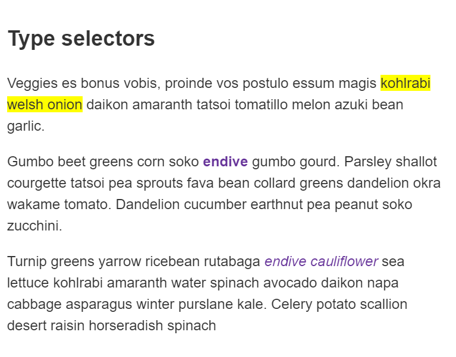
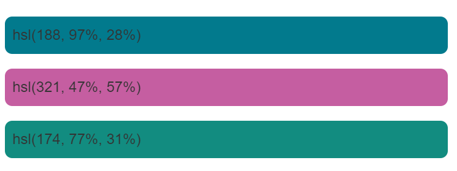

## 基础

### 应用 CSS 到 DOM

接下来让我们看看添加一些 CSS 到文件里加以渲染，同样的 HTML 代码：

```html
<p>
  Let's use:
  <span>Cascading</span>
  <span>Style</span>
  <span>Sheets</span>
</p>
```

以下为 CSS 代码：

```css
span {
  border: 1px solid black;
  background-color: lime;
}
```

浏览器会解析 HTML 并创造一个 DOM，然后解析 CSS。可以看到唯一的选择器就是 span 元素选择器，浏览器处理规则会非常快！把同样的规则直接使用在三个`<span>`标签上，然后渲染出图像到屏幕。

现在的显示如下：


## CSS 如何留白？

### 空白

空白是指实际空格、制表符和新行。以与 HTML 相同的方式，浏览器往往忽略 CSS 中的大部分空白；许多空白只是为了提高可读性。

在下面的第一个示例中，我们将每个声明(以及规则开始/结束)都放在自己的行中--这可以说是编写 CSS 的好方法，因为它使维护和理解变得更加容易：

```css
body {
  font: 1em/150% Helvetica, Arial, sans-serif;
  padding: 1em;
  margin: 0 auto;
  max-width: 33em;
}

@media (min-width: 70em) {
  body {
    font-size: 130%;
  }
}

h1 {
  font-size: 1.5em;
}

div p,
#id:first-line {
  background-color: red;
  background-style: none;
}

div p {
  margin: 0;
  padding: 1em;
}

div p + p {
  padding-top: 0;
}
```

您可以编写完全相同的 CSS，删除大部分空格--这在功能上与第一个示例相同，但我相信您肯定也觉得阅读起来有点困难：

```css
body {
  font: 1em/150% Helvetica, Arial, sans-serif;
  padding: 1em;
  margin: 0 auto;
  max-width: 33em;
}
@media (min-width: 70em) {
  body {
    font-size: 130%;
  }
}

h1 {
  font-size: 1.5em;
}

div p,
#id:first-line {
  background-color: red;
  background-style: none;
}
div p {
  margin: 0;
  padding: 1em;
}
div p + p {
  padding-top: 0;
}
```

您选择的代码布局通常是个人偏好，尽管当您开始在团队中工作时，您可能会发现现有团队有自己的样式指南，指定要遵循的约定。

在 CSS 中，属性和它们的值之间的空格需要小心。

例如，以下声明是有效的 CSS：

```css
margin: 0 auto;
padding-left: 10px;
```

以下内容无效：

```css
margin: 0auto;
padding- left: 10px;
```

“0auto”不被识别为边距属性的有效值(“0”和“AUTO”是两个独立的值)，而浏览器会将“padding- ”识别为有效属性。因此，您应该始终确保通过至少一个空格将不同的值分隔开来，但将属性名称和属性值作为单个未中断的字符串放在一起。

## CSS 如何添加注释？

### 注释

与任何的代码工作一样，在编写 CSS 过程中，最好的练习方式就是添加注释。这样做可以帮助您在过了几个月后回来修改或优化代码时了解它们是如何工作的，同时也便于其他人理解您的代码。

CSS 中的注释以`/*`开头，以`*/`结尾。在下面的代码块中，注释标记了不同代码节的开始。当代码库变得更大时，这对于帮助您导航代码库非常有用--在代码编辑器中搜索注释可以高效地定位代码节。

```css
/* Handle basic element styling */
/* -------------------------------------------------------------------------------------------- */
body {
  font: 1em/150% Helvetica, Arial, sans-serif;
  padding: 1em;
  margin: 0 auto;
  max-width: 33em;
}

@media (min-width: 70em) {
  /* Let's special case the global font size. On large screen or window,
     we increase the font size for better readability */
  body {
    font-size: 130%;
  }
}

h1 {
  font-size: 1.5em;
}

/* Handle specific elements nested in the DOM  */
/* -------------------------------------------------------------------------------------------- */
div p,
#id:first-line {
  background-color: red;
  background-style: none;
}

div p {
  margin: 0;
  padding: 1em;
}

div p + p {
  padding-top: 0;
}
```

“注释掉”代码这一操作常用于在测试中临时禁用一段代码。例如，如果您试图找出代码的哪一部分会导致错误。在下例中，`.special selector`规则被“注释”掉了，也就是被禁用了。

```css
/*.special { 
  color: red; 
}*/

p {
  color: blue;
}
```

## CSS 如何通过元素名、类名以及 ID 筛选元素？

### 选择器的种类

有几组不同的选择器，知道了需要哪种选择器的话，你会更容易找到做事时所需的正确工具。在本文的子篇中，我们将会来更详细地看下不同种类的选择器。

### 类型、类和 ID 选择器

这个选择器组包含的选择器，指向了例如一个`<h1>`的 HTML 元素

```css
h1 {
}
```

它也包含了指向一个类的选择器：

```css
.box {
}
```

或者，一个 ID：

```css
#unique {
}
```

### 标签属性选择器

这组选择器给了你根据一个元素上的某个标签属性的存否以选择元素的不同方式：

```css
a[title] {
}
```

或者甚至根据一个有特定值的标签属性是否存在，来做选择：

```css
a[href="https://example.com"]
{
}
```

### 伪类与伪元素

这组选择器包含了伪类，用来样式化一个元素的特定状态。例如:hover 伪类就只会在鼠标指针悬浮到一个元素上的时候选择这个元素：

```css
a:hover {
}
```

它还包含了伪元素，选择一个元素的某个部分而不是元素自己。例如，`::first-line`总是会选择一个元素（下面的情况中是`<p>`）中的第一行，表现得就像是一个`<span>`包在了第一个被格式化的行外面，然后`<span>`被选中了。

```css
p::first-line {
}
```

### 运算符

最后一组选择器将其他选择器组合起来，以图指向我们的文档里的选择器。下面的示例用子元素运算符（`>`）选择了`<article>`元素的初代子元素。

```css
article > p {
}
```

## 如何将多个选择器应用于同一个规则？

### 选择器列表

如果你有多于一个使用相同 CSS 的物件，那么这些单独的选择器可以被混编为一个“选择器列表”，这样，规则就可以应用到所有的单个选择器上了。例如，如果我的`h1`和`.special`类有相同的 CSS，那么我可以把它们写成两个分开的规则。

```css
h1 {
  color: blue;
}

.special {
  color: blue;
}
```

我也可以将它们组合起来，在它们之间加上一个逗号，变为选择器列表。

```css
h1,
.special {
  color: blue;
}
```

空格无论在逗号前面还是后面都可以，你可能还会发现如果每个选择器都另起一行，会更好读些。

```css
h1,
.special {
  color: blue;
}
```

在下面的实时示例中，试着把两个有 ID 声明的选择器组合起来。外观在组合起来以后应该还是一样的。
html 代码:

```html
<h1>Type selectors</h1>
<p>
  Veggies es bonus vobis, proinde vos postulo essum magis
  <span>kohlrabi welsh onion</span> daikon amaranth tatsoi tomatillo melon azuki
  bean garlic.
</p>

<p>
  Gumbo beet greens corn soko <strong>endive</strong> gumbo gourd. Parsley
  shallot courgette tatsoi pea sprouts fava bean collard greens dandelion okra
  wakame tomato. Dandelion cucumber earthnut pea peanut soko zucchini.
</p>

<p>
  Turnip greens yarrow ricebean rutabaga <em>endive cauliflower</em> sea lettuce
  kohlrabi amaranth water spinach avocado daikon napa cabbage asparagus winter
  purslane kale. Celery potato scallion desert raisin horseradish spinach
</p>
```

css 代码:

```css
span {
  background-color: yellow;
}

strong {
  color: rebeccapurple;
}

em {
  color: rebeccapurple;
}
```

结果:



当你这样子给选择器放在一起时，如果任何一个选择器无效，那么整条规则都会被忽略。

在下面的示例中，无效的类选择器会被忽略，而 h1 仍会被样式化。

```css
h1 {
  color: blue;
}

..special {
  color: blue;
}
```

但是在被组合起来以后，在整个规则都被认为是失效的时候，无论是`h1`还是这个类都不会被样式化。

```css
h1,
..special {
  color: blue;
}
```

## 如何在 CSS 中指定颜色？

### 颜色

在 CSS 中指定颜色的方法有很多，其中一些是最近才实现的。在 CSS 中，相同的颜色值可以在任何地方使用，无论您指定的是文本颜色、背景颜色还是其他颜色。

现代计算机的标准颜色系统是 24 位的，它允许通过不同的红、绿、蓝通道的组合显示大约 1670 万种不同的颜色，每个通道有 256 个不同的值(256 x 256 x 256 = 16,777,216)。让我们来看看在 CSS 中指定颜色的一些方法。

> 注意： 在本教程中，我们将研究具有良好浏览器支持的常用指定颜色的方法；虽然还有其他的，但是他们没有很好的支持，也不太常见。

### 颜色关键词

在这学习示例或 MDN 上的其他示例中，您经常会看到使用的颜色关键字，因为它们是一种指定颜色的简单易懂的方式。有一些关键词，其中一些有相当有趣的名字！您可以在页面上看到 [<color>](https://developer.mozilla.org/en-US/docs/Web/CSS/color_value)值的完整列表

**在下面的示例中尝试使用不同的颜色值，以了解它们是如何工作的。**

#### 十六进制 RGB 值

您可能遇到的下一种颜色值类型是十六进制代码。每个十六进制值由一个散列/磅符号(#)和六个十六进制数字组成，每个十六进制数字都可以取 0 到 f(代表 15)之间的 16 个值中的一个——所以是 0123456789abcdef。每对值表示一个通道—红色、绿色和蓝色—并允许我们为每个通道指定 256 个可用值中的任意一个(16 x 16 = 256)。

这些值有点复杂，不太容易理解，但是它们比关键字更通用——您可以使用十六进制值来表示您想在配色方案中使用的任何颜色。
html 代码:

```html
<div class="wrapper">
  <div class="box one">#02798b</div>
  <div class="box two">#c55da1</div>
  <div class="box three">128a7d</div>
</div>
```

css 代码:

```css
.one {
  background-color: #02798b;
}

.two {
  background-color: #c55da1;
}

.three {
  background-color: #128a7d;
}
```

结果:


**同样，大胆尝试更改值，看看颜色如何变化吧！**

#### RGB 和 RGBA 的值

我们将在这里讨论的第三种方案是 RGB。RGB 值是一个函数—RGB()—它有三个参数，表示颜色的红色、绿色和蓝色通道值，与十六进制值的方法非常相似。RGB 的不同之处在于，每个通道不是由两个十六进制数字表示的，而是由一个介于 0 到 255 之间的十进制数字表示的——这有点容易理解。

让我们重写上一个例子，使用 RGB 颜色：
html 代码:

```html
<div class="wrapper">
  <div class="box one">rgb(2, 121, 139)</div>
  <div class="box two">rgb(197, 93, 161)</div>
  <div class="box three">rgb(18, 138, 125)</div>
</div>
```

css 代码:

```css
.one {
  background-color: rgb(2, 121, 139);
}

.two {
  background-color: rgb(197, 93, 161);
}

.three {
  background-color: rgb(18, 138, 125);
}
```

结果:


您还可以使用 RGBA 颜色——它们的工作方式与 RGB 颜色完全相同，因此您可以使用任何 RGB 值，但是有第四个值表示颜色的 alpha 通道，它控制不透明度。如果将这个值设置为`0`，它将使颜色完全透明，而设置为 1 将使颜色完全不透明。介于两者之间的值提供了不同级别的透明度。

> 注意: 在颜色上设置 alpha 通道与使用我们前面看到的[opacity](https://developer.mozilla.org/zh-CN/docs/Web/CSS/opacity)属性有一个关键区别。当你使用不透明度时，你让元素和它里面的所有东西都不透明，而使用 RGBA 颜色只让你指定的颜色不透明。

在下面的例子中，我添加了一个背景图片到我们的彩色方块的包含块中。然后我设置了不同的不透明度值——注意当 alpha 通道值较小时， 背景如何显示的。
html 代码:

```html
<div class="wrapper">
  <div class="box one">rgba(2, 121, 139, .3)</div>
  <div class="box two">rgba(197, 93, 161, .7)</div>
  <div class="box three">rgba(18, 138, 125, .9)</div>
</div>
```

css 代码:

```css
.one {
  background-color: rgba(2, 121, 139, 0.3);
}

.two {
  background-color: rgba(197, 93, 161, 0.7);
}

.three {
  background-color: rgba(18, 138, 125, 0.9);
}
```

结果:


**在本例中，尝试更改 alpha 通道值，看看它如何影响颜色输出。**

> 注意：在某种程度上，现代浏览器得到了更新，从而让`rgba()` 和`rgb()` （以及 `hsl()`和 `hsla()`;见下文）成为彼此的纯别名并开始表现完全相同，因此`rgba()` 和`rgb()` 接受带有和不带有 alpha 通道值的颜色。 尝试将上面示例的`rgba()` 函数更改为`rgb()` ，看看颜色是否仍然有效！ 使用哪种样式由您决定，但是将非透明和透明的颜色定义分开使用不同的功能可以（非常）更好地支持浏览器，并且可以直观地指示代码中定义透明颜色的位置。

#### HSL 和 HSLA 的值

与 RGB 相比，`HSL`颜色模型的支持稍差一些(在旧版本的 IE 中不支持)，它是在设计师们感兴趣之后实现的。`hsl()` 函数接受色调、饱和度和亮度值作为参数，而不是红色、绿色和蓝色值，这些值的不同方式组合，可以区分 1670 万种颜色：

- **色调**： 颜色的底色。这个值在 0 和 360 之间，表示色轮周围的角度。
- **饱和度**： 颜色有多饱和？ 它的值为 0 - 100%，其中 0 为无颜色(它将显示为灰色阴影)，100%为全色饱和度
- **亮度**：颜色有多亮？ 它从 0 - 100%中获取一个值，其中 0 表示没有光(它将完全显示为黑色)，100%表示完全亮(它将完全显示为白色)

我们可以更新 RGB 的例子来使用 HSL 颜色，就像这样:

html 代码:

```html
<div class="wrapper">
  <div class="box one">hsl(188, 97%, 28%)</div>
  <div class="box two">hsl(321, 47%, 57%)</div>
  <div class="box three">hsl(174, 77%, 31%)</div>
</div>
```

css 代码

```css
.one {
  background-color: hsl(188, 97%, 28%);
}

.two {
  background-color: hsl(321, 47%, 57%);
}

.three {
  background-color: hsl(174, 77%, 31%);
}
```

实现结果:



就像 RGB 有 RGBA 一样，HSL 也有 HSLA 等效物，它使您能够指定 alpha 通道值。我已经在下面通过将 RGBA 示例更改为使用 HSLA 颜色来演示了这一点。

html 代码:

```html
<div class="wrapper">
  <div class="box one">hsla(188, 97%, 28%, .3)</div>
  <div class="box two">hsla(321, 47%, 57%, .7)</div>
  <div class="box three">hsla(174, 77%, 31%, .9)</div>
</div>
```

css 代码:

```css
.one {
  background-color: hsla(188, 97%, 28%, 0.3);
}

.two {
  background-color: hsla(321, 47%, 57%, 0.7);
}

.three {
  background-color: hsla(174, 77%, 31%, 0.9);
}
```


您可以在项目中使用这些颜色值中的任何一个。对于大多数项目，您可能会选择一个调色板，然后在整个项目中使用这些颜色——以及您所选择的定义这些颜色的方法。你可以混合使用不同的颜色模型，但是为了一致性，通常最好是你的整个项目使用相同的一个!