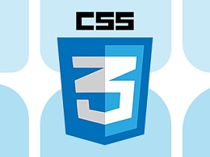

## CSS3 简介

提起 CSS 我们不会太陌生，我们 Web 页面的样式离不开它，而 CSS3 是 CSS 技术升级版本。

对于 CSS3 我们在前端开发的工作中有大量的应用，它主要就是对普通 CSS 样式的一种补充。如果说 HTML 标签是页面的骨架， CSS 是页面的皮肤， 那么 CSS3 就是页面的灵魂， 它丰富了页面的交互和显示效果。

## 1. 什么是 CSS3 ？

它其实是 CSS 不停升级的演变，早在 2001 年 W3C 就完成了 CSS3 的草案规范。CSS3 规范的一个新特点是被分为若干个相互独立的模块。一方面分成若干较小的模块较利于规范及时更新和发布，及时调整模块的内容，这些模块独立实现和发布，也为日后 CSS 的扩展奠定了基础。另外一方面，由于受支持设备和浏览器厂商的限制，设备或者厂商可以有选择的支持一部分模块，支持 CSS3 的一个子集，这样有利于 CSS3 的推广。

我们日常工作中其实 CSS 和 CSS3 是在一起使用的，有时候你甚至不知道已经使用了 CSS3 。因为 CSS3 就是 CSS 升级演变的产物。

## 2. 为什么要学习 CSS3 ？

我们学习它肯定需要一个理由，最直观的就是前端已经进入了图形化时代，丰富的页面效果在使用 CSS2 实现成本很高。其次，使用 CSS3 可以轻松完成动画或者过渡效果，远离脚本实现动画，让我节省开发时间。

CSS3 技术可以代替很多图片，减少标签的嵌套，这意味着页面的标签更少，静态资源请求数减少，这就意味着我们打开页面的时间更快更好。

最后，CSS3 做到了向后兼容，在低版本浏览器中它不会打乱原有的布局，最多就是不起作用。

## 3. CSS3 各个模块发展进程

| 时间                    | 名称                 | 最后状态   | 模块                 |
| ----------------------- | -------------------- | ---------- | -------------------- |
| 1999.01.27 - 2019.08.13 | 文本修饰模块         | 候选推荐   | css-text-decor-3     |
| 1999.06.22 - 2018.10.18 | 分页媒体模块         | 工作草案   | css-page-3           |
| 1999.06.23 - 2019.10.15 | 多列布局             | 工作草案   | css-multicol-1       |
| 1999.06.22 - 2018.06.19 | 颜色模块             | 推荐       | css-color-3          |
| 1999.06.25 - 2014.03.20 | 命名空间模块         | 推荐       | css-namespaces-3     |
| 1999.08.03 - 2018.11.06 | 选择器               | 推荐       | selectors-3          |
| 2001.04.04 - 2012.06.19 | 媒体查询             | 推荐       | css3-mediaqueries    |
| 2001.05.17 - 2019.11.13 | 文本模块             | 工作草案   | css-text-3           |
| 2001.07.13 - 2018.08.28 | 级联和继承           | 候选推荐   | css-cascade-3        |
| 2001.07.13 - 2019.06.06 | 取值和单位模块       | 候选推荐   | css-values-3         |
| 2001.07.26 - 2018.12.18 | 基本盒子模型         | 工作草案   | css-box-3            |
| 2001.07.31- 2018.09.20  | 字体模块             | 推荐       | css-fonts-3          |
| 2001.09.24 - 2017.10.17 | 背景和边框模块       | 候选推荐   | css-backgrounds-3    |
| 2002.02.20 - 2019.08-17 | 列表模块             | 工作草案   | css-lists-3          |
| 2002.05.15 - 2018.08.08 | 行内布局模块         | 工作草案   | css-inline-3         |
| 2002.08.02 - 2018.06.21 | 基本用户界面模块     | 推荐       | css-ui-3             |
| 2003.05.14 - 2019.08.02 | 生成内容模块         | 工作草案   | css-content-3        |
| 2003.08.13 - 2019.07.16 | 语法模块             | 候选推荐   | css-syntax-3         |
| 2004.02.24 - 2014.10.14 | 超链接显示模块       | 工作组笔记 | css3-hyperlinks      |
| 2005.12.15 - 2015.03.26 | 模板布局模块         | 工作组笔记 | css-template-3       |
| 2006.06.12 - 2014.05.13 | 分页媒体模块生成内容 | 工作草案   | css-gcpm-3           |
| 2008.08.01 - 2014.10.14 | Marquee 模块         | 工作组笔记 | css3-marquee         |
| 2009.07.23 - 2019.10.10 | 图像模块             | 候选推荐   | css-images-3         |
| 2010.12.02 - 2019.12.10 | 书写模式             | 推荐       | css-writing-modes-3  |
| 2011.09.01 - 2013.04.04 | 条件规则模块         | 候选推荐   | css3-conditionalr    |
| 2012.02.07 - 2016.05.17 | 定位布局模块         | 工作草案   | css-position-3       |
| 2012.02.28 - 2018.12.04 | 片段模块             | 候选推荐   | css-break-3          |
| 2012.09.27 - 2019.05.22 | 宽高大小模块         | 工作草案   | css-sizing-3         |
| 2012.10.09 - 2017.12.14 | 计数器风格           | 候选推荐   | css-counter-styles-3 |
| 2013.04.18 - 2018.07.31 | 溢出模块             | 工作草案   | css-overflow-3       |
| 2014.02.20- 2019.07.11  | 显示类型模块         | 候选推荐   | css-display-3        |

## 4. CSS3 新增特性

1. **边框特性**： 增加了圆角的定义和图片边框，它给了设计师更多的设计空间，在以前所有的元素都是方的，如果我们想要使用漂亮的边框只能使用背景图，这就无形中给服务器带来了压力。
2. **多背景图**： 现在我们一个元素上可以使用多张背景图了。
3. **颜色**： 现在我们不但可以使用线性渐变和径向渐变，还可以设置颜色的透明度，在不借助背景图的情况下可以创建更多的色彩。
4. **多列布局和弹性盒模：** 让我们不再像以前那样为了布局大盒子套小盒子，定位 和 浮动 傻傻分不清楚，它可以说是前端布局的革命。
5. **空间上增加了 2D 和 3D 空间**。
6. **过渡和动画**。
7. **web 字体**，我们可以告别千篇一律的微软雅黑了。
8. **媒体查询**，现在在不同的分辨率下我们不再通过 JS 去控制样式了。
9. **丰富的阴影效果**。多用于 hover，悬浮等场景。

## 5. 学习基础

有一定的 CSS 语法基础。
了解 HTML 基本的一些元素，如： div h1-h6 a span i 这些简单的标签。
了解 class id 这类基础元素选择器。

## 兼容性

目前 Chrome 、　 Firefox 、IE 9+ 基本上支持了大部分的 CSS3 特性，我们可以放心的使用了。对于支持性不好的也可以使用前缀。
Chrome |Safari |Firefox |IE |Opera
--|--|--|--|--
webkit-| -webkit- |-moz-| -ms-| -0-
