## border 边框

有时候在页面中需要做一些分割来区分不同的区域，这个属性不但可以用来给元素添加一个边框，也可以作为不同区域的分割线。

### 1. 官方解释

`CSS` 的 `border` 属性是一个用于设置各种单独的边界属性的简写属性。 `border` 可以用于设置一个或多个以下属性的值： `border-width`、`border-style`、`border-color`。

### 2. 慕课解释

任何一个 `h5` 标签通过添加一个 `border` 属性，可以给它设置边框的宽度、展示出来的样子（实线、虚线、圆点等）和颜色。

### 3. 语法

```css
border: [border-width ||border-style ||border-color |inherit];
```

属性值：

| 参数名称     | 参数类型             | 解释                                     |
| ------------ | -------------------- | ---------------------------------------- |
| border-width | `[‘px’| ‘rem’| ’%’]` | 控制边框的宽度                           |
| border-style | `string`             | 控制边框的样式                           |
| border-color | `string`             | 控制边框的颜色                           |
| inherit      | `[’’|’’]`            | 控制边框展示在元素宽高尺寸的外部还是内部 |

`border-width`、`border-style`、`border-color`它们的用法遵循 `css` 的：左上、 右上 、右下 、左下 的原则。最多可以添加 4 个参数。

相关属性：

| 参数名称      | 参数类型     |
| ------------- | ------------ |
| border-top    | border-width |
| border-bottom | border-width |
| border-right  | border-width |
| border-right  | border-width |

### 4. 兼容性

| IE  | Edge | Firefox | Chrome | Safari | Opera | ios | android |
| --- | ---- | ------- | ------ | ------ | ----- | --- | ------- |
| all | all  | all     | all    | all    | all   | all | all     |

### 5. 实例

接下来我们通过一个 `div` 元素，来说明 `border` 的使用方法。

```html
<div class="demo"></div>
```

#### 1. 为 `demo` 增加边框

```css
.demo {
  width: 100px;
  height: 100px;
  border: 1px solid #ddd;
}
```

效果图

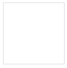

解释：通过`border` 为`div`四周增加一个宽度为 `1px`、填充样式为`solid`(实线)、颜色为`#ddd`的边框。

#### 2.只给 demo 的顶部增加一个边框：`

```css
.demo {
  width: 100px;
  height: 100px;
  border-top: 1px solid #000;
  background: #f2f2f2;
}
```

效果图

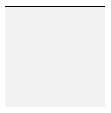

解释：通过`border-top`可以只给 `div` 的顶部增加边框而不会影响其它部分的样式。

#### 3. 修改 button 默认的边框样式

```html
<button>确认</button> <button class="btn">确认</button>
```

```css
.btn {
  border-width: 4px;
}
```

效果图

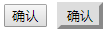

解释：左边是默认的 button 效果, 右边图片是我们修改后的效果。

#### 4. 个性化 demo 每个边框的颜色。

```css
.demo {
  width: 100px;
  height: 100px;
  border: 2px solid;
  border-top-color: red;
  border-right-color: green;
  border-bottom-color: black;
  border-left-color: orange;
}
```

效果图
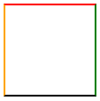

这里千万不能写成 `border-right:green;`

#### 6. 经验分享

我们有时候在元素内可能会使用`margin-top`这样的属性来让子元素和父元素的顶部有一个间隔，但是经常不天遂人愿，发现它并没有达到我们想要的效果，反而变成了父元素距离上一个元素增加了一个距离。如果我们在父元素设置一个看不见的`border`就可以解决这个问题。

#### 7. 小结

1. `border-width` 属性会有影响设定元素的尺寸。
2. 在 `table` 中使用 `border`，要使用`border-xx`这样的属性，为的是去掉一边避免重叠。
   ```css
   td {
     border: 1px solid #ccc;
     border-bottom: none;
   }
   ```
3. `border-color` 如果不设置那么它会使用元素中字体的颜色。
4. ```css
   div {
     width: 100px;
     height: 100px;
     border-width: 2px;
   }
   ```
   上面这样的设置 `div` 在页面中实际站位是 `104px`，如果不注意很容易造成页面错乱。这是因为我们大部分情况下盒模型使用的是 `W3C` 标准的`box-sizing: content-box;`，它在页面中实际宽度 = `width+border`( 该公式仅针对上面例子）。
5. 如果我们需要给 `button` 设置一个颜色，那么它就会失去浏览器自带的交互效果。
6. `border-top` 的使用和 `border` 的使用方法是一样的，如果要个性化一个边的颜色，可以这样设置： `border-top-color:red;`也可以这样设置： `border-top:1px solid red;`。

## border-image 边框图片

这个属性的兼容性不是很好，所以在正常的前端开发工作中很难用到，但是在不考虑兼容性的情况下，它无疑的一个很强大的属性，因为它可以自定义漂亮的边框，而不在是单调的线条。

### 1. 官方解释

`CSS` 属性允许在元素的边框上绘制图像。这使得绘制复杂的外观组件更加简单，也不用在某些情况下使用九宫格了。使用 `border-image` 时，其将会替换掉 `border-style` 属性所设置的边框样式。虽然规范要求使用 `border-image` 时边框样式必须存在，但一些浏览器可能没有实现这一点。

### 2. 慕课解释

通过 `border-image` 属性可以给元素添加自定义的边框样式，而不单单是系统提供的那几种。换句话说就是我们可以自定义一个图片来充当元素的边框对它进行环绕。

### 3. 语法

```css
border-image: source slice repeat;
```

包含属性

| 属性                | 描述                                                                       |
| ------------------- | -------------------------------------------------------------------------- |
| border-image-source | 背景图片源                                                                 |
| border-image-slice  | 需要展示出来图片的尺寸，如果这个量等于图片的尺寸就都相当于整个图片展示出来 |
| border-image-width  | 图片边框的宽度。                                                           |
| border-image-outset | 边框图像区域超出边框的量。                                                 |
| border-image-repeat | 图片的填充形式                                                             |

### 4. 实例

使用 `border-image` 为元素自定义一个图片边框。

```css
.demo {
  width: 100px;
  height: 100px;
  background: #ccc;
  border-width: 50px;
  border-style: solid;
  border-image: url(./../img/border-image.jpg);
}
```

#### 1. 使用 `border-image` 为元素自定义一个图片边框。

```css
.demo {
  width: 100px;
  height: 100px;
  background: #ccc;
  border-width: 50px;
  border-style: solid;
  border-image: url(./../img/border-image.jpg);
}
```

效果图

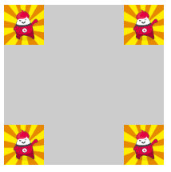

我们这使用的是 `bordr-image` 这个属性，并定义了图片路径 其它的不设定使用默认值。

#### 2. 使用 `border-image-source` 为元素设定一个边框。

```css
.demo2 {
  width: 100px;
  height: 100px;
  background: #ccc;
  border-width: 50px;
  border-style: solid;
  border-image-source: url(./../img/border-image.jpg);
}
```


我们可以看到 例 1 和 例 2 两个图是一样的，因为我们仅仅使用了 `border-image-source` 增加了图片路径而已。

#### 3. 我们在 `demo2` 上增加 `border-image-slice` 。

```css
.demo2 {
  width: 100px;
  height: 100px;
  background: #ccc;
  border-width: 50px;
  border-style: solid;
  border-image-source: url(./../img/border-image.jpg);
  border-image-slice: 70;
}
```

效果图

通过给 slice 设定一个 70 我们得到了一个漂亮的边框，下面重点说下这个属性值是如何作用在边框图片上的。


4. 继续在 `demo2`的基础上增加 `border-image-outset` 。

```css
.demo2 {
  width: 100px;
  height: 100px;
  background: #ccc;
  border-width: 20px;
  border-style: solid;
  border-image-source: url(./../img/border-image.jpg);
  border-image-slice: 20;
  border-image-outset: 22px;
}
```

效果图

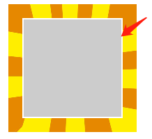

从效果图中的红色箭头我们可以看到，边框图片和灰色元素之间有一条 `2px` 的白线，这是因为我设置了 `image-outset` 向外偏移 了 `22px` 的原因。

#### 5. 使用 `border-image-repeat` 来为 `demo2` 设定图片的填充形式

```css
.demo2 {
  width: 100px;
  height: 100px;
  background: #ccc;
  border-width: 20px;
  border-style: solid;
  border-image-source: url(./../img/border-image.jpg);
  border-image-slice: 20;
  border-image-outset: 22px;
  border-image-repeat: repeat;
}
```

效果图

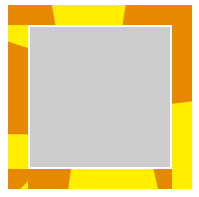

通过效果图我们可以看到图片是以平铺重复的方式来填充的，而这个属性默认是 `stretch` 拉伸来填充图片的。这个属性还有以下值通过效果图我们可以看到图片是以平铺重复的方式来填充的，而这个属性默认是 `stretch` 拉伸来填充图片的。这个属性还有以下值

| 属性值    | 描述                                                                            |
| --------- | ------------------------------------------------------------------------------- |
| `stretch` | 默认值，拉伸图片来填充区域。                                                    |
| `repeat`  | 平铺并重复图像来填充区域。                                                      |
| `round`   | 类似 `repeat` 值。如果无法完整平铺所有图像，则对图像进行缩放以适应区域。        |
| `space`   | 不拉伸图片，而是让图片成四周环绕即左上右上右下左下。                            |
| `initial` | 关键字用于设置 CSS 属性为它的默认值 。可以用于任何 HTML 元素上的任何 CSS 属性。 |
| `inherit` | 继承父级的设定                                                                  |

### 5. 兼容性

| IE  | Edge | Firefox | Chrome | Safari | Opera | ios  | android |
| --- | ---- | ------- | ------ | ------ | ----- | ---- | ------- |
| 11  | 12+  | 50+     | 5+     | 9.1+   | 43+   | 9.3+ | 2.1+    |

### 6. 经验分享

1. 这个属性使用并不太难，不过其中的`border-image-slice`属性在使用的时候有一个小技巧，就是当想要其中 `image` 不失真即不拉伸，`slice` 要和 `width` 一样。

   例如：

   ```css
   .demo {
     border-width: 20px;
     border-image-slice: 20;
   }
   ```

   还有一点要注意的是 `slice` 不需要挂单位。

2. 如果想填充中心可以加上`-webkit-border-image`就像下面这样
   ```css
   .demo {
     -webkit-border-image: url(./../img/border-image.jpg) 20 20 stretch;
   }
   ```
   这是 `border-imgae` 的连写方式，第一个和第二个 `20` 都是 `slice`，认出它的最后方法就是 它们都不带单位。

### 7. 小结

1. `border-image` 使用时候一定要设定 `border-style` 虽然这个属性没什么用，但是如果不设定它 `border-image` 就不生效。
2. `border-image-slice` 如果设定数值当 `px` 用时候直接写数字就可以 如果加上 `px` 反而会不生效。
3. `border-width` 用来设定边框的宽度，它决定图片边框展示的厚度(即围绕宽度)。

## border-radius 圆角

如果想要把元素边界变得圆润，不妨试试这个属性。

### 1. 官方定义

通过 `CSS3`，您能够创建圆角边框并且不需使用设计软件，比如 `PhotoShop`。

### 2. 慕课解释

通过给一个 `html` 元素标签的样式增加一条 `border-radius` 属性，让这个元素的边角由直角边变成圆弧。

### 3. 语法

它的用法遵循 `css` 通用的：左上、 右上 、右下 、左下 的原则。

```css
border-radius: value;
```

| 属性                       | 描述         |
| -------------------------- | ------------ |
| border-radius              | 四个边角值   |
| border-top-left-radius     | 左上角圆弧值 |
| border-top-right-radius    | 右上角圆弧值 |
| border-bottom-right-radius | 右下角圆弧值 |
| border-bottom-left-radius  | 左下角圆弧值 |

包含参数

| 参数名称 | 参数类型             |
| -------- | -------------------- |
| value    | `‘%’ | ‘px’ | ‘rem’` |

#### 1. 只有一个参数时：

```css
border-radius: value;
```

`value` 代表给这个元素 `4` 个方向增加一个的圆弧值。

#### 2. 只有两个参数时，中间用空格分开：

```css
border-radius: value1 value2;
```

`value1` 代表 左上、右下，value2 代表 右上、左下角圆弧值。

#### 3. 只有三个参数时，中间用空格分开：

```css
border-radius: value1 value2 value3;
```

`value1` 代表左上 `value2` 代表 右上 左下 `value3` 代表右下

#### 4. 有四个参数时，中间用空格分开

```css
border-radius: value1 value2 value3 value3;
```

`value1 ~ value4` 分别代表左上、 右上 、右下 、左下四个角的圆弧值

### 4. 兼容性

| IE  | Edge | Firefox | Chrome | Safari | Opera | ios | android |
| --- | ---- | ------- | ------ | ------ | ----- | --- | ------- |
| 9   | all  | all     | all    | all    | all   | all | all     |

### 5. 示例

给 `demo` 增加右上和左下的圆角

```html
<div class="demo"></div>
```

可以这样

```css
.demo {
  border-radius: 0 8px 0 8px;
}
```

推荐第一种写法，但是也可以这样

```css
.demo {
  border-top-right-radius: 8px;
  border-bottom-left-radius: 8px;
}
```

效果图


#### 2. 制作一个带有圆角的卡

```html
<div class="card">
  <div class="text">
    demo1
  </div>
</div>
```

```css
.card {
  background: red;
  width: 100px;
  height: 200px;
  line-height: 200px;
  text-align: center;
  border-radius: 6px;
}
.text {
  display: inline-block;
  width: 50px;
  height: 50px;
  line-height: 50px;
  background: #fff;
  border-radius: 50%;
}
```

效果图

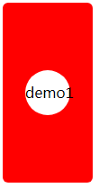

#### 3. 给一个 `table` 增加圆角左上和右上是 8px 右下和左下是直角

```html
<table>
  <tr>
    <td>姓名</td>
    <td>年龄</td>
  </tr>
  <tr>
    <td>demo</td>
    <td>19</td>
  </tr>
</table>
```

```css
table {
  background: red;
  border-radius: 8px 8px 0 0;
  font-size: 18px;
  color: #fff;
  border-collapse: collapse;
  overflow: hidden;
}
```

### 6. 经验分享

1. `border-radius：50%` 会让一个宽度和高度相等的块级元素变成一个圆。

   ```css
   .demo{
       width:100px;
       height:100px;
       border-radius：50%
   }
   ```

   设置 `50`% 的好处就是不用再去计算他的宽高，例如上面这个例子 `border-radius:50px` 同样可以让这个元素变成一个圆。

2. 如果圆角过大，记得要设定 `paddin`g ，这样可以避免里面的内容超出元素。

### 7. 小结

1. 不要让 `border-radius` 的`%` 值大于 `50`，因为如果两个相邻的半径和超过了对应的盒子的边的长度，那么浏览器要重新计算以保证它们不重合。虽然表面上看没有问题但是这样会对性能有影响。
2. 如果用 `rem`、`em` 单位在移动端用`border-radius` 画圆，在部分机型里面是椭圆的问题，可以通过 `50%` 来解决 ，或者使用 `px` 配合缩放 `scale` 来实现 `rem` 单位的效果。
3. 在内联元素 `span` 这类标签使用这个属性的时候同样有效但是记得不要使用`%`这样会导致一些 `span` 标签的圆角不一样因为 `%` 是参考长和宽计算的。
4. `border-radius` 圆角并不会隐藏标签内部元素的内容，如果有内容溢出的情况记得增加 `overflow:hidden;`
5. 任何元素都可以使用这个属性,包括视频、音频标签等等。
6. 一般情况下不推荐 `border-top-left-radius` 这类的写法除非是需要在某种交互过程中需要改变其中一个的圆角值而其它的保持不变。因为这类的标签会影响浏览器渲染的性能。

## box-shadow 阴影

使用这个属性可以让页面更有立体感，给元素添加一个阴影，使得元素看起来是悬浮在原来的位置，下面就看看它的用法吧。

### 1. 官方定义

`box-shadow` 属性向框添加一个或多个阴影。

### 2. 慕课解释

通过 `box-shadow`可以给任意 `` 元素添加阴影，可以是一个，如果用,号隔开可以添加多个。

### 3. 语法

```css
box-shadow: h-shadow v-shadow blur color;
```

```css
.demo {
  box-shadow: 1px 1px 5px #ccc;
}
```

属性值

| 值       | 说明                                                                   |
| -------- | ---------------------------------------------------------------------- |
| h-shadow | 可选。水平方向阴影位置,以文字的中心为起点 `>0` 是往右，`<0` 时候偏左。 |
| v-shadow | 可选。竖直方向阴影位置，用法同上。                                     |
| blur     | 可选。模糊的大小。                                                     |
| color    | 可选。阴影的颜色                                                       |

### 4. 兼容性

| IE  | Edge | Firefox | Chrome | Safari | Opera | ios | android |
| --- | ---- | ------- | ------ | ------ | ----- | --- | ------- |
| all | all  | all     | all    | all    | all   | all | all     |

IE9+、Firefox 4、Chrome、Opera 以及 Safari 5.1.1 支持 box-shadow 属性。

### 5. 实例

```html
<div class="demo">
  慕课网
</div>
```

#### 1. 给 demo 添加一个阴影

```css
.demo {
  width: 100px;
  height: 100px;
  text-align: center;
  line-height: 100px;
  box-shadow: 1px 1px 5px #ccc;
}
```

效果图

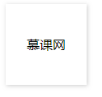

#### 2. 给 demo 添加多个阴影

```css
.demo {
  width: 100px;
  height: 100px;
  text-align: center;
  line-height: 100px;
  box-shadow: 1px 1px 5px #ccc, 2px 2px 5px rgba(255, 25, 25, 0.5),
    3px 3px 1px rgba(5, 206, 89, 0.5);
}
```

效果图

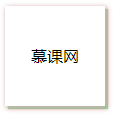

### 7. 经验分享

它的一把用来给元素添加一个阴影，交互设计师们热衷于在鼠标覆盖到元素时候，给元素增加一个悬浮效果，使它变得不同，例如:

```css
.demo {
  width: 100px;
  height: 100px;
  transition: box-shadow 1s;
}
.demo:hover {
  box-shadow: 1px 1px 5px #ccc；;
}
```

而网上常见的 `css3` 下雨效果，就是利用 `box-shadow` 颜色叠加的特性制作出来的。

```html
<div class="demo"></div>
```

```css
.demo {
  width: 15px;
  height: 15px;
  border-radius: 50%;
  box-shadow: 100px 100px 4px #dedede, 30px 40px 4px #dedede,
    70px 20px 4px #dedede, 80px 60px 4px #dedede;
}
```

效果图

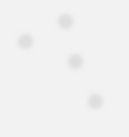

如果画得密集些就更像了，当然这些就需要专业的设计师去做一个方案了。

最后这里介绍一下阴影效果使用的窍门。

```css
.demo {
  width: 100px;
  height: 100px;
  text-align: center;
  line-height: 100px;
  box-shadow: 15px 0 15px -15px #000, -15px 0 15px -15px #000;
}
```

效果图

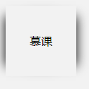

看完这个例子，我们应该已经明白 `box-shadow` 形成的阴影效果可能是一个组合。

### 8. 8. 小结

1. 如果给一个元素添加多个阴影，那么后面的颜色层级高于前面的，也就是说如果前 `3` 个参数一样，后面的颜色会覆盖前面的颜色。
2. 不要给不规则的图形添加阴影，因为这只会添加到块级元素中，不会验证图片的路径添加阴影，可以使用滤镜来达到这样的效果。

## box-sizing 盒类型

它主要用来告诉浏览器怎么计算元素的展示宽高的。

### 1. 官方定义

`box-sizing` 属性允许您以特定的方式定义匹配某个区域的特定元素。

### 2. 慕课解释

在开发过程中，当有一个 固定宽高的元素带有 `boder` 或 `padding` 的时候，它在 `IE` 中展示和 `Chrome` 中是不同的，如果我们不设置这个属性，那么在 IE 浏览器中它的实际宽高是小于 `Chrome` 浏览器的这是为什么呢？

`Chrome` 浏览器使用的是标准盒模型 `content-box`，IE 盒模型是 `border-box`。

下面就是一个盒模型的结构图

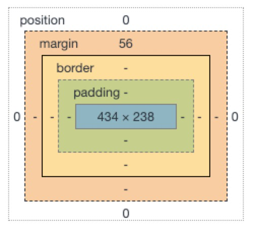

### 3. 语法

```css
box-sizing: content-box | border-box;
```

它接受一个参数 `content-box` 或 `border-box`。

上图是一个盒模型结构

#### `content-box` 的计算方式是:

width = content width;

height = content height

#### `border-box` 的计算方式是：

width = border + padding + content width

heigth = border + padding + content heigth

### 4. 兼容性

| IE  | Edge | Firefox | Chrome | Safari | Opera | ios | android |
| --- | ---- | ------- | ------ | ------ | ----- | --- | ------- |
| 10+ | 12+  | 28+     | 4+     | 6.1+   | 12.1+ | 7+  | 4.4     |

### 5. 实例

不是设置 `box-sizing` 分别在不同浏览器中的展示。

```html
<div class="demo">慕课网 CSS3 学习分享</div>
```

```css
.demo {
  width: 100px;
  height: 100px;
  background: #000;
  color: #fff;
  padding: 10px;
  border: 5px solid red;
}
```

效果图

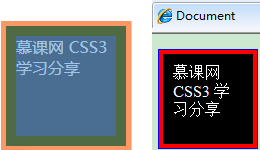


说明:左侧是 Chorme 浏览器右侧是低版本 IE 浏览器。

#### 2. 给上面 `demo` 中设置 `box-sizing` 为 `border-box`
```css
.demo{
    width:100px;
    height:100px;
    background:#000;
    color:#fff;
    padding:10px;
    border:5px solid red;
    box-sizing:border-box;
}
```
效果图

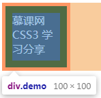

#### 3. 给上面 `demo` 中设置 `box-sizing` 为 `content-box`
```css
.demo{
    width:100px;
    height:100px;
    background:#000;
    color:#fff;
    padding:10px;
    border:5px solid red;
    box-sizing:content-box;
}
```
效果图

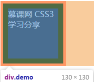

### 6. 经验分享
推荐大家设置 `box-sizing` 为`border-box` 这样方便我们写样式不必在去减去 `padding` 也不会造成 `IE` 和 `Chorme` 这类浏览器展示不同的 `bug` 。

### 7. 小结
如果不设置 `box-sizing` 不同浏览器会有不同的计算方式。