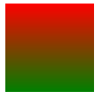
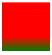
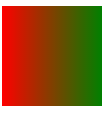
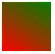
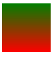
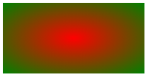
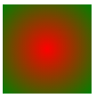
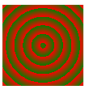
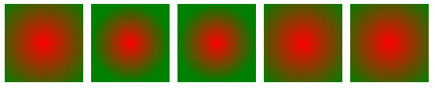
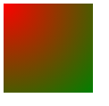

## Gradients 渐变

在以前遇到渐变的背景，我们只能选择使用图片，而现在通过 `gradients` 这个属性就可以实现颜色的渐变。它的实现是通过浏览器生成的，可以当成是矢量图形。学会它只需要几个字符就可以生成一个很大的渐变图形。

不过值得注意的是虽然它是一个颜色，但是使用它之后就不能再使用背景图片了。

## 1. 官方定义

`CSS3` 渐变（gradients）可以让你在两个或多个指定的颜色之间显示平稳的过渡。

以前，你必须使用图像来实现这些效果。但是，通过使用 `CSS3` 渐变（`gradients`），你可以减少下载的事件和宽带的使用。此外，渐变效果的元素在放大时看起来效果更好，因为渐变（`gradient`）是由浏览器生成的。
`CSS3` 定义了两种类型的渐变（`gradients`）：

- 线性渐变（`Linear Gradients`）- 向下/向上/向左/向右/对角方向
- 径向渐变（`Radial Gradients`）- 由它们的中心定义。

## 2. 慕课解释

这个属性可以通过写一些参数来生成一个渐变图形，例如从黄色渐渐的过度到红色，以前的实现方式这可以是一个径向渐变，也可以是一个线性渐变。生成的这个渐变图形在放大或缩小的时候都不会失真，因为它是由浏览器模拟生成的，就和我们使用矢量图是一样的效果。

线性渐变：顾名思义颜色的变化规律是沿着一条直线，它可以是各个方向上面的线。

## 3. 语法

### 3.1 线性渐变

```css
.demo {
  background: linear-gradient(direction|angle, color-stop1, color-stop2, ...);
}
```

属性说明
值 |描述
--|--
`directio | angle` |线性渐变的方向，例如： to right ， to left， to bottom right，也可以是一个角度。
`color-stop#` |线性渐变的颜色，至少需要两个颜色。也就是说需要至少有 `color-stop1`, `color-stop2`。

说明：创建一个线性渐变至少需要两个颜色，他们的默认方向是从上到下的。

使用角度可以创建更细腻的渐变。但要注意的是：这个角度值得是水平方向和渐变线之间的角度。0 度从下到上 90 度从左到右，这样一个顺时针的变化。

#### 3.2 径向渐变

```css
.demo {
  background-image: radial-gradient(
    shape size at position,
    start-color,
    ...,
    last-color
  );
}
```

属性说明

| 值            | 描述                                                                                   |
| ------------- | -------------------------------------------------------------------------------------- |
| `shape`       | 径向渐变颜色区域的形状 `circle`（圆形）或 `ellipse`（椭圆）                            |
| `size`        | 参数定义了渐变的大小 `closest-side` `farthest-side` `closest-corner` `farthest-corner` |
| `at`          | 固定搭配 `shape` `size` 来表示在一个位置 `position`                                    |
| `position`    | 径向渐变的起点位置                                                                     |
| `start-color` | 径向渐变的颜色至少需要两个颜色。                                                       |

说明： 径向渐变同样可以省略 `shape` `size` `at` `position` ，这样默认就是一个圆形的径向渐变，中心点在元素的中心点位置。 每个颜色后面可以跟一个表示长度的数值 `%` `px` `rem` 等，用来表示颜色的覆盖区域，大于这个数值则开始径向渐变。

## 4. 兼容性

| IE   | Firefox | Chrome | Safari | Opera | ios | android |
| ---- | ------- | ------ | ------ | ----- | --- | ------- |
| 9.0+ | 4.0+    | 4.0+   | 3.0+   | 10.5+ | all | all     |

## 5. 实例

### 5.1 线性渐变

```html
<div class="demo"></div>
```

1. 创建一个从上到下颜色由红变绿的线性渐变。

   ```css
   .demo {
     width: 100px;
     height: 100px;
     background: linear-gradient(red, green);
   }
   ```

   效果图

   

   如果渐变方向正好是上下方向，那么只要写两个颜色就好了。

2. 接上面一个例子，让红色在元素 `70%`的位置之后在开始向绿色渐变。

   ```css
   .demo {
     width: 100px;
     height: 100px;
     background: linear-gradient(red 70%, green);
   }
   ```

   效果图

   

   这个的实现只要在颜色后面加一个 `%`数就好，也可以是其他的计量单位例如 `px`。

3. 创建一个从左到右的渐变背景色。

   ```css
   .demo {
     width: 100px;
     height: 100px;
     background: linear-gradient(to right, red 70%, green);
   }
   ```

   效果图
   

4. 创建一个从左上到右下的渐变颜色。

   ```css
   .demo {
     width: 100px;
     height: 100px;
     background: linear-gradient(to right bottom, red, green);
   }
   ```

   效果

   

   这里的 `to right bottom` 也可以写成 `right bottom` 。

5. 创建一个 `30` 度角的线性渐变。

   ```css
   .demo {
     width: 100px;
     height: 100px;
     background: linear-gradient(30deg, red, green);
   }
   ```

   效果图

   

6. 创建一个 0 度角的线性渐变。

   ```css
   .demo {
     width: 100px;
     height: 100px;
     background: linear-gradient(0deg, red, green);
   }
   ```

   效果图
   

### 5.2 径向渐变

1. 创建一个红色到绿色的径向渐变

   ```css
   .demo {
     width: 200px;
     height: 100px;
     background: radial-gradient(red, green);
   }
   ```

   效果图

   

   说明：渐变默认形状是椭圆形，但是如果在一个宽度和高度相等的元素内则会变成圆形，但是其实还是椭圆的，只是看到的像圆形，这是因为两个中心点重合了。

2. 创建一个椭圆红色到绿色的假圆形径向渐变
   ```css
   .demo {
     width: 100px;
     height: 100px;
     background: radial-gradient(red, green);
   }
   ```
   说明：这不是真的圆形如果宽度和高度不相等则变成椭圆的
3. 创建一个真正的圆形渐变

   ```css
   .demo {
     width: 100px;
     height: 100px;
     background: radial-gradient(circle, red, green);
   }
   ```

   

4. 创建一个重复的径向渐变

   ```css
   .demo {
     width: 100px;
     height: 100px;
     background: repeating-radial-gradient(circle, red 5%, green 20%);
   }
   ```

   效果图

   

5. 设定渐变的不同 size 我们左下对比。

   ```css
   .demo {
     width: 100px;
     height: 100px;
     float: left;
     margin-right: 10px;
   }
   .demo0 {
     background-image: radial-gradient(red, green);
   }
   .demo1 {
     background-image: radial-gradient(closest-side, red, green);
   }
   .demo2 {
     background-image: radial-gradient(farthest-side, red, green);
   }
   .demo3 {
     background-image: radial-gradient(closest-corner, red, green);
   }
   .demo4 {
     background-image: radial-gradient(farthest-corner, red, green);
   }
   ```

   效果图

   

   说明：从左到右依次为：默认 `closest-side` `farthest-side` `closest-corner` `farthest-corner`,可以清楚的观察到渐变的中心点都是元素的中心点，当时他们的过度点出现了明显的不同。

6. 改变渐变的中心点。

   ```css
   .demo {
     width: 100px;
     height: 100px;
     background-image: radial-gradient(at top left, red, green);
   }
   ```

   效果图

   

   说明，也可以是 数量单位例如

   ```css
   background-image: radial-gradient(at 10% 20%, red, green);
   ```

   我们可以把它理解为一个坐标。

## 6. 经验分享

1. 不要写成下面这样

   ```css
   (left,circle,red 10%,yellow 50%,green 50%)
   ```

   `left` 前面一定要加上 `at` 不然它的兼容性很不好

2. 使用渐变背景色可以是 `background` 也可以是 `background-image` 但不要写成 `background-color` 。

3. 设置了渐变背景色就不能在用一个元素内在使用图片了如果想叠加图片可以像下面这样的结构：

   ```html
   <div class="demo">
     <div class="demo-img"></div>
   </div>
   ```

   通过在内部新建一个标签来引用你想插入的图片，并通过定位来达到想要的效果。

4. 尽量使用渐变而不是图片，这样可以减少网络请求，也减少项目体积。

## 7. 小结

渐变属性因为不兼容 `IE8` 浏览器，所以在使用这个的时候要做好降级处理。例如可以在 `IE8` 使用纯色，或者通过图片代替，而非 `IE8` 在使用渐变，这也可以通过 `JS` 判断环境。
