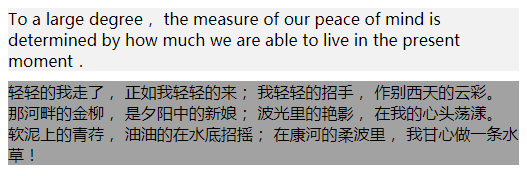
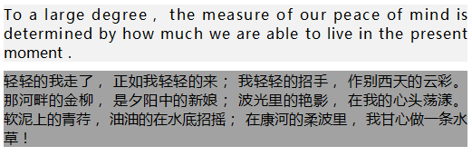
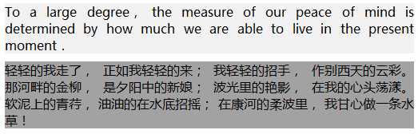
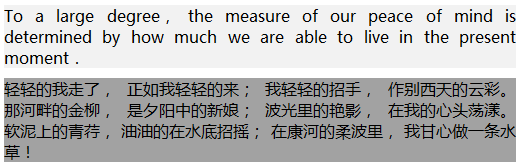
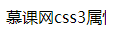
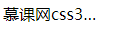
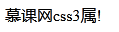
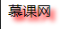

## text-justify

这个属性不怎么常用，因为它的兼容性不好，只兼容 `IE` 浏览器，它主要是给对齐属性 `text-align:justify` 做一个补充。

### 1. 官方定义

改变字与字之间的间距使得每行对齐。

### 2. 慕课解释

这个属性主要用来页面文字的排版，如果我们一个段落不设置任何属性，那么它的每一行有长有短，很不美观，通过这个属性，可以让每一行都能实现左右对齐。

我们首先要设置 `text-align:justify` 然后再设置 `text-justify` 去告诉浏览器使用什么样的排版方式让文字对齐。而不设置 `text-justify` 浏览器则使用默认的方式让其实现两端对齐。

这个属性只兼容 `IE` 浏览器。而其他浏览器的对齐方式仅受 `text-align:justify` 对齐方式的影响。

### 3. 语法

```css
.demo {
  text-align: justify;
  text-justify: inter-word;
}
```

属性值说明

| 值              | 描述                                                   |
| --------------- | ------------------------------------------------------ |
| auto            | 浏览器自行渲染                                         |
| none            | 禁用齐行。                                             |
| inter-word      | 增加/减少单词间的间隔。                                |
| inter-ideograph | 用表意文本来排齐内容。                                 |
| inter-cluster   | 只对不包含内部单词间隔的内容（比如亚洲语系）进行排齐。 |
| distribute      | 类似报纸版面，除了在东亚语系中最后一行是不齐行的。     |
| kashida         | 通过拉伸字符来排齐内容。                               |

### 4. 兼容性

| IE  | Edge | Firefox | Chrome | Safari | Opera | ios | android |
| --- | ---- | ------- | ------ | ------ | ----- | --- | ------- |
| 9+  | no   | no      | no     | no     | no    | no  | no      |

### 5. 实例

1.  默认文字排版

    ```html
    <div class="demo">
      To a large degree， the measure of our peace of mind is determined by how
      much we are able to live in the present moment．
    </div>
    <div class="demo-1">
      轻轻的我走了， 正如我轻轻的来； 我轻轻的招手， 作别西天的云彩。
      那河畔的金柳， 是夕阳中的新娘； 波光里的艳影， 在我的心头荡漾。
      软泥上的青荇， 油油的在水底招摇； 在康河的柔波里， 我甘心做一条水草！
    </div>
    ```

    ```css
    .demo {
      background: #f2f2f2;
      margin-bottom: 10px;
    }
    .demo-1 {
      background: #a2a2a2;
    }
    ```

    效果图

    

    说明：这两端字符第一段是英文，第二段是中文他们都没有实现两端对齐。中文还好，英文的排版最差，这是因为英文单词不像汉字，它长短不一。

    下面我们通过设置 `text-justify` 中包含的各种属性来看看，他们都是怎么实现两端对齐的。

2.  使用浏览器默认对齐方式

    ```css
    .demo {
      background: #f2f2f2;
      margin-bottom: 10px;
      text-align: justify;
    }
    .demo-1 {
      background: #a2a2a2;
      text-align: justify;
    }
    ```

    或

    ```css
    .demo {
      background: #f2f2f2;
      margin-bottom: 10px;
      text-align: justify;
      text-justify: auto;
    }
    .demo-1 {
      background: #a2a2a2;
      text-align: justify;
      text-justify: auto;
    }
    ```

    效果图

    

    说明：直接设置 `text-align:justify;`就会实现文字两端对齐，对齐方式使用浏览器默认方式。

3.  使用 `inter-ideograph` 来实现文字对齐。

    ```css
    .demo {
      background: #f2f2f2;
      margin-bottom: 10px;
      text-align: justify;
      text-justify: inter-ideograph;
    }
    .demo-1 {
      background: #a2a2a2;
      text-align: justify;
      text-justify: inter-ideograph;
    }
    ```

    效果图

    

    说明：通过设置 `inter-ideograph`，让 `IE` 浏览器使用表意文本对齐方式对齐内容 。

4.  使用 `inter-word` 来实现文本排版对齐

    ```css
    .demo {
      background: #f2f2f2;
      margin-bottom: 10px;
      text-align: justify;
      text-justify: inter-word;
    }
    .demo-1 {
      background: #a2a2a2;
      text-align: justify;
      text-justify: inter-word;
    }
    ```

    效果图

    

    说明：如图所示，文字还是对齐了，如果和 `inter-ideograph` 的效果图对比还是有细微差别，它的对齐方式修改了单词之间的距离。所以说这只是 `IE`浏览器在对齐的时候一种排版方式。

5.  使用 `inter-cluster` 来实现文本排版对齐。

    ```css
    .demo {
      background: #f2f2f2;
      margin-bottom: 10px;
      text-align: justify;
      text-justify: inter-cluster;
    }
    .demo-1 {
      background: #a2a2a2;
      text-align: justify;
      text-justify: inter-cluster;
    }
    ```

    效果图

    

    由此可见使用其他属性 `distribute`、`kashida` 都只是改变 IE 浏览器的一种对齐方式。

### 6. 小结

1. 要使用这个属性一定要先设置 `text-align:justify;`
2. 且仅仅兼容 IE 浏览器。

## text-overflow 文字超出

改属性主要用来定义当文字超出元素限定范围内之后，防止页面混乱，对超出的文字做的一个隐藏处理。

### 1. 官网定义

`text-overflow` 属性规定当文本溢出包含元素时发生的事情。

### 2. 慕课解释

`text-overflow` 用于设置当文字内容超过所在元素设定的范围时候的展示效果。

### 3. 语法

```css
.demo {
  text-overflow: clip|ellipsis|string;
}
```

属性值说明
值 |说明
--|--
clip |超出内容后裁剪
ellipsis |文字溢出后使用在最后的结尾使用省略号
string |使用给定的字符串来代表被修剪的文本

### 4. 兼容

| IE  | Edge | Firefox | Chrome | Safari | Opera | ios | android |
| --- | ---- | ------- | ------ | ------ | ----- | --- | ------- |
| all | all  | all     | all    | all    | all   | all | all     |

### 5. 实例

1.  文字超出后裁剪内容

    ```html
    <div class="demo">
      慕课网css3属性教学 text-overflow。
    </div>
    ```

    ```css
    .demo {
      height: 30px;
      width: 100px;
      overflow: hidden;

      white-space: nowrap;
      text-overflow: clip;
    }
    ```

    效果图

    

2.  文字超出元素后使用省略号。

    ```html
    <div class="demo">
      慕课网css3属性教学 text-overflow。
    </div>
    ```

    ```css
    .demo {
      height: 30px;
      width: 100px;
      overflow: hidden;
      white-space: nowrap;
      text-overflow: ellipsis;
    }
    ```

    效果图

    

3.  文字超出后使用 `！`

    ```html
    <div class="demo">
      慕课网css3属性教学 text-overflow。
    </div>
    ```

    ```css
    .demo {
      height: 30px;
      width: 100px;
      overflow: hidden;
      white-space: nowrap;
      text-overflow: '!';
    }
    ```

    效果图

    

    说明：只在火狐浏览器兼容。

### 6. 经验分享

`text-overflow` 这个属性常常用来限制文字超出后我们怎么去处理超出的这部分文字，通常是隐藏掉，这样才不会破坏页面的视觉效果，不会把文字堆积重叠到一起。

### 7. 小结

1. `text-overflow`一定要和 `overflow: hidden;`、`white-space: nowrap;` 一起使用，不能单独用。
2. 这个属性通常是在有范围规定的元素中使用。

## text-shadow 文本阴影

它可以给任意的字符设置一个或多个阴影。

### 1. 官方定义

`text-shadow` 属性向文本设置阴影。

### 2. 慕课解释

`text-shadow` 一共接受 4 个参数，前两个是阴影的位置通过 x，y 坐标系来设定，第三个参数设定模糊的大小，最后一个参数设定阴影的颜色。

### 3. 语法

```css
.demo {
  text-shadow: h-shadow v-shadow blur color;
}
```

属性值

| 值       | 说明                                                              |
| -------- | ----------------------------------------------------------------- |
| h-shadow | 可选。水平方向阴影位置,以文字的中心为起点>0 是往右，<0 时候偏左。 |
| v-shadow | 可选。竖直方向阴影位置，用法同上。                                |
| blur     | 可选。模糊的大小。                                                |
| color    | 可选。阴影的颜色                                                  |

### 4. 兼容性

| IE  | Edge | Firefox | Chrome | Safari | Opera | ios | android |
| --- | ---- | ------- | ------ | ------ | ----- | --- | ------- |
| all | all  | all     | all    | all    | all   | all | all     |

### 5. 实例

1.  为文字添加阴影。

    ```html
    <div class="demo">慕课网</div>
    ```

    ```css
    .demo {
      text-shadow: 5px 5px 5px red;
    }
    ```

    效果图

    

2.  制作一个文字发光效果

    ```css
    html,
    body {
      background: #000;
    }
    .demo {
      color: #fff;
      text-shadow: 5px 5px 20px #fff, -5px -5px 20px #fff, 5px -5px 20px #fff, -5px
          5px 20px #fff;
    }
    ```

    效果图

    

    说明：其实就是在各个方向上都增加一个白色的阴影，在黑色的背景下就显得有发光的效果了。

3.  通过投影直至化制作一个 3D 的文字效果

    ```css
    .demo {
      font-size: 30px;
      color: #fff;
      text-shadow: 1px 1px hsl(0, 0%, 85%), 2px 2px hsl(0, 0%, 80%),
        3px 3px hsl(0, 0%, 75%), 4px 4px hsl(0, 0%, 70%),
        5px 5px hsl(0, 0%, 65%), 5px 5px 10px black;
    }
    ```

    效果图

    

    说明：这个效果也是利用各种色组叠加来实现的。

### 6. 经验分享

首先通过上面的例子我们可以了解到这个属性是可以无限制的增加一个颜色组，通过通过这个可以制作出很多有意思的效果。例如下雨的圆形光晕等等。

### 7. 小结

在以前也有`text-shadow:#000 5px 5px 5px`这样的写法，不过不推荐。
