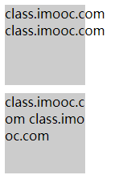
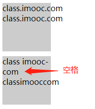
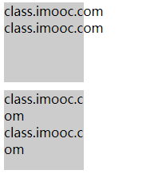
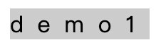
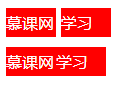

## word-break 文本打断

这个属性主要用来处理英文单词，在超出一行之后如何换到下一行的规则。

### 1. 官方定义

`word-break` 属性规定自动换行的处理方法。

### 2. 慕课解释

一段英文段落，在其文本所在的元素边缘通常都会把整个单词另起一行，而这个属性可以打破这种排版方式，让这个段落的英文单词都是分开的，同汉字一样，在元素的边缘只是最后一个字母换行。

### 3. 语法

```css
word-break: normal|break-all|keep-all;
```

```css
.demo {
  word-break: break-all;
}
```

属性值

| 值        | 说明                                                                         |
| --------- | ---------------------------------------------------------------------------- |
| normal    | 就是按照浏览器自己的排版规则，不设置就是默认。                               |
| break-all | 其意义就同英文直接翻译一样，打破所有的英文单词，可以在任意的字母处另起一行。 |
| keep-all  | 只能在半角空格或连字符处换行。                                               |

### 4. 兼容性

| IE  | Edge | Firefox | Chrome | Safari | Opera | ios | android |
| --- | ---- | ------- | ------ | ------ | ----- | --- | ------- |
| all | all  | all     | all    | all    | all   | all | all     |

### 5. 实例

1. 对超出元素区域的的文本换行。

   ```html
   <div class="demo">
     class.imooc.com class.imooc.com
   </div>
   <div class="demo demo-1">
     class.imooc.com class.imooc.com
   </div>
   ```

   ```css
   .demo {
     background: #ccc;
     width: 100px;
     height: 100px;
     margin-bottom: 10px;
   }
   .demo-1 {
     word-break: break-all;
   }
   ```

   效果图

   

   说明： 上图是没有使用换行属性的效果。下图使用了换行属性

2. 仅对段落中的半角空格和连字符进行换行。

   ```html
   <div class="demo-2">
     class imooc-com class imooc-com classimooccom
   </div>
   ```

   ```css
   .demo-2 {
     background: #ccc;
     width: 100px;
     height: 100px;
     word-break: keep-all;
   }
   ```

   效果图

   

   说明： 如图第一行的结尾使用了连字符所以后面的英文字符换行了，第二行使用了空格所以后面的也换行了，而第三行没有空格或连字符因此没有换行。

### 6. 经验分享

这个属性用来处理当我们不想让 一个英文单词直接下一行，而是从中间断开，断开的地方换行例如我们使用连字符的时候。

### 7. 小结

1. 这个和 `word-wra`p 有区别， `word-wrap`必须要是连续的英文字符,而它没有限制，所以不要记混。
2. 这个属性对英文字符、半角空格、连字符都起作用。

## word-wrap 换行

在了解这个属性前，首先要说的是它只用于**英文**。

### 1. 官方定义

`word-wrap` 属性允许长单词或 URL 地址换行到下一行。

### 2. 慕课解释

当一个英文单词，或者一段很长且中间没有空格的英文字母的文本超出文本所在元素边缘时候，直接将超出的部分换行，而不是把这个连续的文本直接全部另起一行。

### 3. 语法

```css
word-wrap: normal|break-word;
```

```css
.demo {
  word-wrap: break-word;
}
```

| 值         | 说明                                                                         |
| ---------- | ---------------------------------------------------------------------------- |
| normal     | 就是按照浏览器自己的排版规则，不设置就是默认。                               |
| break-word | 当连续的英文字符超过元素的宽度时候直接折行，而不是把整个连续的英文单词换行。 |

### 4. 兼容性

| IE  | Edge | Firefox | Chrome | Safari | Opera | ios | android |
| --- | ---- | ------- | ------ | ------ | ----- | --- | ------- |
| all | all  | all     | all    | all    | all   | all | all     |

### 5. 实例

1.  对超出元素区域的的文本换行。

    ```html
    <div class="demo">
      class.imooc.com class.imooc.com
    </div>
    <div class="demo demo-1">
      class.imooc.com class.imooc.com
    </div>
    ```

    ```css
    .demo {
      background: #ccc;
      width: 100px;
      height: 100px;
      margin-bottom: 10px;
    }
    .demo-1 {
      word-wrap: break-word;
    }
    ```

    效果图

    

    说明： 上图是没有使用换行属性的效果。下图使用了换行属性。

### 6. 经验分享

这个属性有一个近似属性 `wrod-break`,我们通过表面意思进行区分。`wrod-wrap` 主要是换行，`wrod-break` 是用来英文单子怎么在内断开的。

最后我们在一次对比下这两个属性

```html
<div class="demo">
  class.imooc.com class.imooc.com
</div>
<div class="demo demo-1">
  class.imooc.com class.imooc.com
</div>
<div class="demo demo-2">
  class.imooc.com class.imooc.com
</div>
```

```css
.demo {
  background: #ccc;
  width: 100px;
  height: 100px;
  margin-bottom: 10px;
}
.demo-1 {
  word-wrap: break-word;
}
.demo-2 {
  word-break: break-all;
}
```

效果图


### 7. 小结

1. 必须要是连续的英文字符。
2. 这个属性主要是对英文起作用，如果中英文混杂，则优先把中文和英文先换行，然后再打破连续的英文单词。

## letter-spacing 字间距

当我们需要扩大或者减少字符之间的距离时候，会用到这个属性。这里要注意它只能作用英文，对于中文是无效的，所以在中文设置中一般很少用到它。

### 1. 官方定义

`letter-spacing` 属性增加或减少字符间的空白（字符间距）。

### 2. 慕课解释

该属性定义了在文本字符框之间插入多少空间。由于字符字形通常比其他字符框要窄，指定长度值时，会调整字母之间通常的间隔。因此，`normal` 就相当于值为 0。

这个属性常用来修改文字之间的距离，它允许为负值，默认的字符间的距离为 0。如果数值小于 0 字符会紧凑，大于 0 时越大越松散。

### 3. 语法

```css
.demo {
  letter-spacing: value;
}
```

值说明

| 参数名称 | 参数类型              |
| -------- | --------------------- |
| value    | `‘px’ | ‘rem’ | ‘em’` |

### 4. 兼容性

| IE  | Edge | Firefox | Chrome | Safari | Opera | ios | android |
| --- | ---- | ------- | ------ | ------ | ----- | --- | ------- |
| all | all  | all     | all    | all    | all   | all | all     |

### 5. 实例

1.  字符之间增加 `5px` 的间距。

    ```css
    .demo {
      letter-spacing: 5px;
    }
    ```

    效果图

    

2.  设置字符之间距离为 `-2px`

    ```css
    .demo {
      letter-spacing: -2px;
    }
    ```

    效果图

    

3.  通过使用 `letter-spacing` 清除我们编辑 `html` 代码时候元素设定 `inline-block` 之后出现的空格。

    ```html
    <div class="demo">
      <span>慕课网</span>
      <span>学习</span>
    </div>
    ```

    ```css
    .demo {
      letter-spacing: -5px;
    }
    .demo > span {
      display: inline-block;
      width: 50px;
      background: red;
      letter-spacing: normal;
    }
    ```

    效果图

    


    上图是 `span` 只设定了 `display: inline-block;`，下图我们通过 在父级元素上设置`letter-spacing`去除了`span `之间空格的距离。而在`span`中又重置了`letter-spacing`让文字恢复了它们之间的距离，让其不在拥挤。**不过我们不推荐这种方式，建议内联块级元素不要分行**。

### 6. 经验分享

与 `word-spacing` 的区别：

`word-spacing` 这个属性只能作用英文，意思是两个英文单词之间的距离，这里要注意是‘英文单词’而不是‘字符’，而 `letter-spacing` 没有任何限制可以作用于‘任何字符’。

### 7. 小结

1. 这个属性仅仅对字符起作用，不能作用于元素标签上面。

2. 这个属性不可以是 `%` 这样的计量单位，因为它不是一个距离，没有相对点，浏览器不知道该如何解释。
