## perspective 透视

**透视距离**和**透视位置**可以更好地观察拥有 3D 效果的元素。

### 1. 官方解释

`perspective` 属性定义 3D 元素距视图的距离，以像素计算。该属性允许您改变 3D 元素查看 3D 元素的视图。

当为元素定义 `perspective` 属性时，其子元素会获得透视效果，而不是元素本身。

`perspective-origin` 属性定义 `3D` 元素所基于的 `X` 轴和 `Y` 轴。该属性允许您改变 3D 元素的底部位置。

当为元素定义 `perspective-origin` 属性时，其子元素会获得透视效果，而不是元素本身。

### 2. 慕课解释

通过在父级元素设置这两个属性，可以简单的理解为设置一个观察者的位置，也就是我们的眼睛 `perspective` 的大小代表眼睛距离元素的位置。

`perspective-origin`，代表眼睛所在的坐标点，我们可以设置 `x` 轴和 `y` 轴，这两个属性其实就间接的组成了 （`x,y,z`）空间坐标组，要注意的是，这是设置都是在父元素上进行的。

### 3. 语法

```css
div {
  perspective: 500px;
  perspective-origin: 50%, 50%;
}
```

### 4. 兼容性

目前浏览器都不支持 `perspective` 属性。
`Chrome` 和 `Safari` 支持替代的 `-webkit-perspective` 属性。

### 5. 实例

1.  增加一个 `500px` 的透视效果

    ```html
    <div class="demo">
      <div class="cell"></div>
    </div>
    ```

    ```css
    .demo {
      perspective: 500px;
      background: #f2f2f2;
    }
    .cell {
      width: 100px;
      height: 100px;
      background: #000;
      transform: translate3d(1px, -1px, -200px) rotateY(70deg);
    }
    ```

    效果图：

    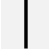

    无透视

    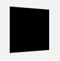

        	解释：加了 `500px` 的透视效果。

2.  修改观察点的位置为 `50% 50%`

    ```css
    .demo {
      perspective: 500px;
      background: #f2f2f2;
      perspective-origin: 50% 50%;
    }
    .cell {
      width: 100px;
      height: 100px;
      background: #000;
      transform: translate3d(1px, -1px, -200px) rotateY(70deg);
    }
    ```

    效果图:

    

### 6. 经验分享

`perspective-origin` 通常使用 `%` 代表在观察父元素，观察点的坐标。

### 7. 小结

1. 推荐设置 `none` 而不是 `0` ，内部的子元素不会透视。
2. 该属性的作用范围是针对子元素让其具有透视效果。
3. 不可以使用 `%` 数作为透视距离。

## transform 2D 平面转换

在以前我们改变元素的位置需要设置 `left` 、 `right` 这类的属性，它对其它元素有很大的影响，现在通过 `transform` 就可以实现任意空间的改变了。

### 1. 官方解释

`CSS transform` 属性允许你旋转，缩放，倾斜或平移给定元素。这是通过修改 CSS 视觉格式化模型的坐标空间来实现的。

### 2. 慕课解释

`transfrom` 这个属性可以改变一个目标元素在页面中的位置，例如相对原来元素所在的位置平移，相对原来的尺寸放大或者缩小，也可以旋转或者斜切。

### 3. 语法

通用坐标轴说明:

`x` 代表横轴，`y` 代表纵轴。

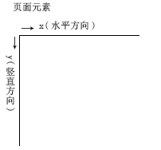

包含参数：

| 值                      | 描述                                         |
| ----------------------- | -------------------------------------------- |
| `translate(x,y)`        | 可以改变元素的位置，而不会对相邻元素由影响。 |
| `translateX(x)`         | 只改变元素的水平位置。                       |
| `translateY(y)`         | 只改变元素在竖直方向的位置。                 |
| `scale(x,y)`            | 元素缩放，x 代表水平方向，y 代表竖直方向。   |
| `scaleX(x)`             | 仅对元素 x 方向上缩放。                      |
| `scaleY(y)`             | 仅对元素 y 方向上缩放。                      |
| `skew(x-angle,y-angle)` | 定义沿着 X 和 Y 轴的 2D 倾斜转换。           |
| `skewX(angle)`          | 定义沿着 X 轴的 2D 倾斜转换。                |
| `skewY(angle)`          | 定义沿着 Y 轴的 2D 倾斜转换。                |
| `rotate(angle)`         | 在平面上旋转一个角度                         |

### 4. 实例

接下来我们都是对 `demo` 这个元素进行操作。

```html
<div class="demo"></div>
```

1.  使用 `translate` 让元素位移

    ```css
    .demo {
      transform: translate(40px, 40px);
    }
    ```

    效果图

    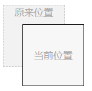

    ```html
    <!DOCTYPE html>

    <html lang="en">
      <head>
        <meta charset="UTF-8" />
        <meta name="viewport" content="width=device-width, initial-scale=1.0" />
        <title>Document</title>
        <style>
          body {
            perspective: 500px;
            transform-style: preserve-3d;
          }
          .commn {
            width: 100px;
            height: 100px;
            text-align: center;
            line-height: 100px;
            background: #f2f2f2;
            border: 1px solid #ccc;
            position: absolute;
            top: 0;
            left: 0;
          }
          .demo {
            z-index: 1;
            opacity: 0.5;
            background: red;
          }
          .demo-3d {
            transform: translate3d(100px, 100px, -100px) rotateZ(45deg);
          }
        </style>
      </head>
      <body>
        <div class="commn demo">transfrom3d</div>
        <div class="commn demo-3d">transfrom3d</div>
      </body>
    </html>
    ```

2.  使用 `translateX` 让元素水平位移：

    ```css
    .demo {
      transform: translateX(80px);
    }
    ```

    效果图

    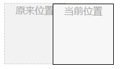

3.  使用 `translateY` 让元素在竖直方向上位移：

    ```css
    .demo {
      transform: translateY(40px);
    }
    ```

    效果图

    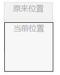

4.  使用 `scale` 对元素缩放：

    ```css
    .demo {
      transform: scale(0.8, 0.8);
    }
    ```

    `scale` 接受一个倍数大于 1 时候放大，小于 1 时候缩小。当 x，y 参数的值一样时，可以如下面这样写：

    ```css
    .demo {
      transform: scale(0.8);
    }
    ```

    如果只需要对水平方向缩放，可以向下面这样写，竖直方向同理：

    ```css
    .demo {
      transform: scaleX(0.8);
    }
    ```

    效果图

    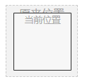

5.  使用 `skew` 对元素倾斜

    ```css
    .demo {
      transform: skew(30deg, 0deg);
    }
    ```

    效果图

    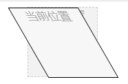

    ```css
    .demo {
      transform: skew(0deg, 30deg);
    }
    ```

    效果图

    

6.  `rotate` 使元素旋转一个角度。在 `2D` 效果中它只接受一个参数角度，并沿着顺指针方向开始。

    ```css
    .demo {
      transform: rotate(30deg);
    }
    ```

    效果图

    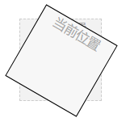

### 5. 兼容性

| IE  | Edge | Firefox | Chrome | Safari | Opera | ios | android |
| --- | ---- | ------- | ------ | ------ | ----- | --- | ------- |
| 9+  | 12+  | 28+     | 4+     | 6.1+   | 12.1+ | 7+  | 4.4     |

### 6. 场景

1. 在需要动画渲染改变元素位置时候
2. 需要对场景进行缩放或者旋转时候

### 7. 小结

1. 要分清 `transform` 和 `transition`，后者是过渡；
2. `transform` 可以使得元素位置改变，而不会影响其他围绕元素，所以可以使用`transform` 尽量使用，可以提高浏览器的渲染效率；
3. `transform` 中斜切的效果，我们拿 X 水平坐标轴为例，其实就是底部向右移动一个角度，这个角度就是竖直方向偏移的角度。

## transform 3D 空间转换

`transform` 这个属性的强大之处在于它可以把一个二维的空间转化成一个三维的空间，给视觉设计师更多的发挥空间，也给用户带来更好的视觉体验。

### 1. 官方定义

transform 属性向元素应用 3D 转换。属性允许我们对元素进行旋转、缩放、移动或倾斜。

### 2. 慕课解释

当给元素使用 `transform` 之后，它就可以在它原来所在的位置变成一个向任意空间变换的元素，这里可以通过在 `Z` 轴上的设置，让他在空间上呈现 `3D` 效果。

### 3. 语法

```css
transform: none|transform-functions;
```

3D 空间坐标轴

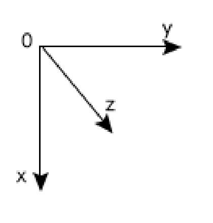

值说明

| 值                      | 描述                                                   |
| ----------------------- | ------------------------------------------------------ |
| `translate3d(x,y,z)`    | 定义 3D 转换。                                         |
| `translateX(x)`         | 定义转换，只是用 X 轴的值。                            |
| `translateY(y)`         | 定义转换，只是用 Y 轴的值。                            |
| `translateZ(z)`         | 定义 3D 转换，只是用 Z 轴的值。                        |
| `scale3d(x,y,z)`        | 定义 3D 缩放转换。                                     |
| `scaleX(x)`             | 通过设置 X 轴的值来定义缩放转换。                      |
| `scaleY(y)`             | 通过设置 Y 轴的值来定义缩放转换。                      |
| `scaleZ(z)`             | 通过设置 Z 轴的值来定义 3D 缩放转换。                  |
| `rotate3d(x,y,z,angle)` | 定义 3D 旋转。                                         |
| `rotateX(angle)`        | 定义沿着 X 轴的 3D 旋转。                              |
| `rotateY(angle)`        | 定义沿着 Y 轴的 3D 旋转。                              |
| `rotateZ(angle)`        | 定义沿着 Z 轴的 3D 旋转。                              |
| `transform-style`       | 在空间内如何呈现 `flat 2D` 呈现, `preserve-3d 3D` 呈现 |

我们在 `transform2D` 中已经对平面属性做了详细的介绍，本章节主要是其 `3D` 属性，这些属性的使用需要在父级设置 `perspective` 和 `transform-style`

让父级有了透视效果以及设置父级在内部空间的呈现方式。

### 4. 兼容性

| IE  | Edge | Firefox | Chrome | Safari | Opera | ios | android |
| --- | ---- | ------- | ------ | ------ | ----- | --- | ------- |
| 9+  | 12+  | 28+     | 4+     | 6.1+   | 12.1+ | 7+  | 4.4     |

### 5. 实例

通用 html ：

```html
<div class="common demo">transfrom3d</div>
<div class="common demo-3d">transfrom3d</div>
```

通用 style ：

```css
body {
  perspective: 500px;
}
.common {
  width: 100px;
  height: 100px;
  text-align: center;
  line-height: 100px;
  background: #f2f2f2;
  border: 1px solid #ccc;
  position: absolute;
  top: 0;
  left: 0;
}
.demo {
  z-index: 1;
  opacity: 0.5;
  background: red;
}
```

1.  `demo-3d` 在 `z` 坐标轴向内延伸 100px。

    ```css
    .demo-3d {
      transform: translate3d(0, 0, -100px);
    }
    ```

    效果图

    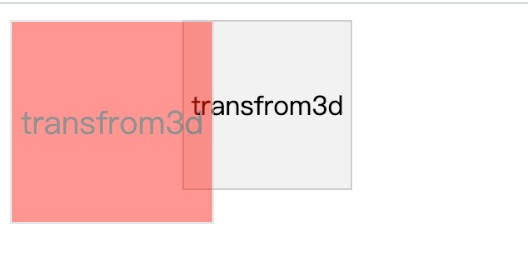

    说明： 红色背景是 `demo-3d` 原来的位置，我们通过图片看到它的表现是水平向右移动且缩小了，其实他是进行了 3D 空间的移动。

2.  `demo-3d` 在 `z` 轴空间上缩放。

    ```css
    .demo-3d {
      transform: scale3d(1, 1, 0);
    }
    ```

    效果图

    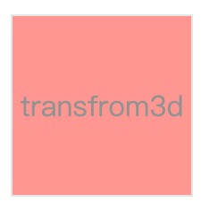

    **说明**： `scale3d` 这个属性可以拆成 `scaleX()` 、`scaleY()` 、 `scaleZ()` 。我们发现 `scaleZ()` 在 `3D` 空间变化上，它的区间 0~1 是不起作用的，只有 `0` 代表缩小到 `0`（消失）， `1` (不变)。

3.  `demo-3d` 在 `z` 轴上旋转

    ```css
    .demo-3d {
      transform: rotate3d(0, 0, 1, 45deg);
    }
    ```

    效果图

    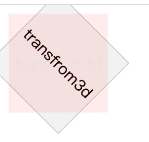

    **说明**： 不推荐使用 `rotate3d()` 这个属性，因为它只能通过 `0` 或 `1` 去选择是否需要旋转，第 4 个参数给 1 个旋转角度，这种方式很不灵活，不过它的特性就是可以同时控制 x，y，z 方向上的旋转角度。

    其实我们从 `1 ～ 3` 这 `3` 个例子中看到只设定了其中一项，接下来我们全方位的变化。

4.  在 `x，y，z` 上应用 `translate3d` 和 `rotateZ`

    ```css
    .demo-3d {
      transform: translate3d(100px, 100px, -100px) rotateZ(45deg);
    }
    ```

    效果图：

    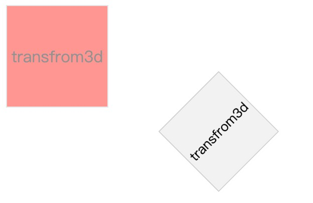

5.  写一个墙角效果

    ```html
    <div class="cude">
      <div class="common left">left</div>
      <div class="common right">right</div>
      <div class="common bottom">bottom</div>
    </div>
    ```

    ```css
    .cude {
      perspective: 1500px;
      width: 200px;
      height: 200px;
      position: relative;
      margin: 100px auto;
      transform-style: preserve-3d;
      transform: rotateX(-14deg) rotateY(-45deg);
    }
    .common {
      position: absolute;
      top: 0;
      left: 0;
      width: 200px;
      height: 200px;
      background: #666;
      opacity: 0.8;
      font-size: 20px;
      text-align: center;
      line-height: 200px;
      font-weight: bold;
      color: #fff;
      border: 1px solid #fff;
    }
    .right {
      transform: rotateY(180deg) translateZ(101px);
      background: rosybrown;
    }
    .left {
      transform: rotateY(-90deg) translateZ(101px);
      background: rosybrown;
    }
    .bottom {
      transform: rotateX(90deg) translateZ(-100px);
    }
    ```

    效果图

    

    说明： 写这个其实没有什么技巧，首先设置 `transform-style: preserve-3d;` 然后在理解每个面相对角度的基础上去设置 `translateZ` 和 `rotate3d`.

### 6. 经验分享

1. 我们如果是初学 `transform`，这里介绍一个区分旋转角度方向的方法，也就是左手法则，我们左手指向设置旋转坐标的正向，例如 `z` 轴，左手只向屏幕外，手指自然弯曲的方向就是旋转的方向。

2. 我们通常旋转 都是以中心点为起点开始旋转的，这往往不是我们想要的方式，可以通过设置 `transform-origin` 这个属性改变旋转起始点的位置。

   ```css
   transform-origin: 50% 50% 0;
   ```

   上面设置代表在元素的水平面的中心位置。

   ```css
   transform-origin: 0 50% 0;
   ```

   上面这个设置代表在元素 `top` 的中心位置。

   ```css
   transform-origin: 50% 0 0;
   ```

   上面这个设置代表在元素 `left` 的中心位置。

3. 如果我们在实际工作中遇到改变元素的位置，例如拖拽这些使用 `transform:translate3D(x,y,z)` 可以提高浏览器的性能，而且它的位置变化不会改变页面中其它元素的位置。


### 7. 小结
`rotateX`、`rotateY`这些是 `3D` 空间的变化，不可以出席在 `2D` 空间上面。