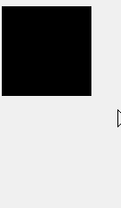
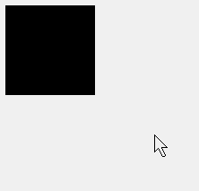
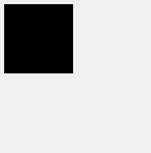
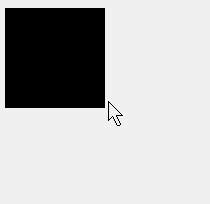
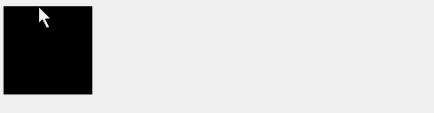
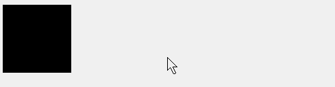
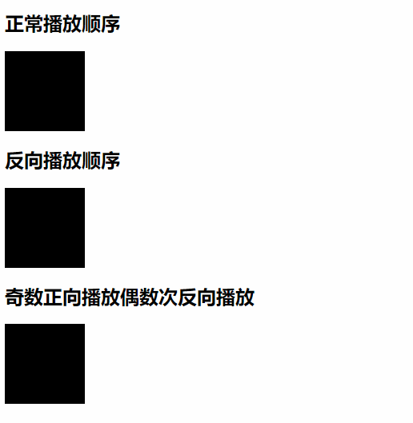
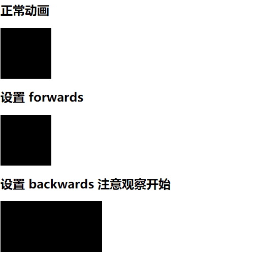
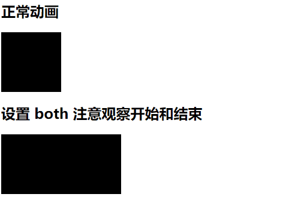

## transition 过度

如果想做出细腻的过渡效果，那么这个属性可能会满足你的需求。这个属性简单的来说就是用来模拟需要变化的属性，从开始到结束数值之间的过渡。

### 1. 官方定义

`transition` 属性是一个简写属性，用于设置四个过渡属性：

- `transition-property`
- `transition-duration`
- `transition-timing-function`
- `transition-delay`

### 2. 慕课解释

`transition` 用来设置一个属性状态从开始到结束中间这个过程的变化。它是 `transition-property`、`transition-duration`、`transition-timing-function`、`transition-delay`、这四个属性的缩写。它们分别代表了：要使用过度动画的属性、过渡动画的时间、过渡动画的加速度函数即数值变化的快慢过程、过渡动画的延迟时间。而我们通常使用过渡属性完成元素过渡的这个过程一般使用 `transition` 。

### 3. 语法

```css
.demo {
  transition: property duration timing-function delay;
}
```

属性值说明：

| 属性值                       | 描述                                |
| ---------------------------- | ----------------------------------- |
| `transition-property`        | 规定设置过渡效果的 CSS 属性的名称。 |
| `transition-duration`        | 规定完成过渡效果需要多少秒或毫秒。  |
| `transition-timing-function` | 规定速度效果的速度曲线。            |
| `transition-delay`           | 定义过渡效果何时开始。              |

### 4. 兼容性

| IE  | Edge | Firefox | Chrome | Safari | Opera | ios | android |
| --- | ---- | ------- | ------ | ------ | ----- | --- | ------- |
| 9+  | 12+  | 28+     | 4+     | 6.1+   | 12.1+ | 7+  | 4.4     |

### 5. 实例

1.  当鼠标移动到元素上，使用过渡属性来让元素的高度变化，从而实现一个过渡效果。

    ```html
    <div class="demo"></div>
    ```

    ```css
    .demo {
      width: 100px;
      height: 100px;
      background: #000;
      transition: height 1s;
    }
    .demo:hover {
      height: 150px;
    }
    ```

    效果图：

    

2.  当鼠标移动上去改变元素的宽高值，让它们都实现过渡动画。

    写法一：

    ```css
    .demo {
      width: 100px;
      height: 100px;
      background: #000;
      transition: height 1s, width 1s;
    }
    .demo:hover {
      width: 150px;
      height: 150px;
    }
    ```

    写法二：

    ```css
    .demo {
      width: 100px;
      height: 100px;
      background: #000;
      transition: all 1s;
    }
    .demo:hover {
      width: 150px;
      height: 150px;
    }
    ```

    效果图：

    

    说明：这两种方式都可以实现我们所要的过渡方式。不过这里慕课推荐使用第一种方式。

3.  改变上面过渡完成的速度。

    ```css
    .demo {
      width: 100px;
      height: 100px;
      background: #000;
      transition: height 1s ease-in, width 1s ease-out;
    }
    .demo:hover {
      width: 150px;
      height: 150px;
    }
    ```

    效果图：

    

    说明：在 `transition` 第三个值使用了动画函数，改变了过渡过程中完成的速度，我们可以很清楚的看到他们的变化速度。

4.  当鼠标移动上去 `1s` 之后开始动画。

    ```css
    .demo {
      width: 100px;
      height: 100px;
      background: #000;
      transition: height 1s ease-in 1s, width 1s ease-out 1s;
    }
    .demo:hover {
      width: 150px;
      height: 150px;
    }
    ```

    效果图：

    

    说明：我们可以看到鼠标放到元素上 1s 之后开始动画，而离开元素之后 1s 之后开始动画。

### 6. Tips

通过上面的实例可以知道 `transition` 的属性值配置很灵活，但是我们要遵循一定的规律，这不单是增加了代码的可读性，也符合浏览器解析规则的规律。

`hover` 到按钮上改变按钮的位置和背景颜色。

```html
<button class="demo">慕课</button>
```

```css
.demo {
  width: 100px;
  height: 30px;
  line-height: 30px;
  border-radius: 4px;
  background: #000;
  color: #fff;
  border: none;
  transition: background 0.4s, transform 0.4s;
}
.demo:hover {
  background: red;
  transform: translateY(-5px);
}
```

效果图：


### 7. 小结

1. 尽量不要使用 `all` 来驱动过渡的属性，这会使得浏览器卡顿。
1. 尽量不要使用 `margin-left` 这类的属性，很可能会打乱页面元素的位置。
1. 推荐使用 `transform` 来改变元素的位置和大小。

## animation 动画

`animation` 是动画，而 `transition` 是过渡，它们用法很相似，但实际又不大相同，可以说 `animation` 是 `transition` 的升级版，它可以创建一个持续的自动执行动画。

### 1. 官方定义

`animation` 属性是一个简写属性，它是下面属性的缩写：

- `animation-name`
- `animation-duration`
- `animation-timing-function`
- `animation-delay`
- `animation-iteration-count`
- `animation-direction`
- `animation-fill-mode`

注意：请始终规定 `animation-duration` 属性，否则时长为 `0`，就不会播放动画了。

### 2. 慕课解释

`animation` 是几个属性值的缩写，我们定义一个动画通常使用 `animation` 就足够了，如果想单独改变动画的某些属性可以使用单独的动画属性去改变，构成一个动画的最基本属性需要 一个`@keyframes` 和 `duration`。

### 3. 语法

```css
.demo {
  animation: name duration timing-function delay iteration-count direction;
}
```

属性值说明：

| 属性                      | 描述                                                                    |
| ------------------------- | ----------------------------------------------------------------------- |
| animation-name            | 规定需要绑定到选择器的 keyframe 名称。                                  |
| animation-duration        | 规定完成动画所花费的时间，以秒或毫秒计。                                |
| animation-timing-function | 规定动画的速度曲线。                                                    |
| animation-delay           | 规定在动画开始之前的延迟。以秒或毫秒计。                                |
| animation-iteration-count | 规定动画应该播放的次数。 一个整数代表重复的次数或者 `infinite` 无限重复 |
| animation-direction       | 规定是否应该轮流反向播放动画。                                          |

注意：请始终规定 `animation-duration` 属性，否则时长为 0，就不会播放动画了。

### 2. 慕课解释

`animation` 是几个属性值的缩写，我们定义一个动画通常使用 `animation` 就足够了，如果想单独改变动画的某些属性可以使用单独的动画属性去改变，构成一个动画的最基本属性需要 一个`@keyframes` 和 `duration`。

### 3. 语法

```css
.demo {
  animation: name duration timing-function delay iteration-count direction;
}
```

属性值说明：

| 属性                      | 描述                                                                    |
| ------------------------- | ----------------------------------------------------------------------- |
| animation-name            | 规定需要绑定到选择器的 keyframe 名称。                                  |
| animation-duration        | 规定完成动画所花费的时间，以秒或毫秒计。                                |
| animation-timing-function | 规定动画的速度曲线。                                                    |
| animation-delay           | 规定在动画开始之前的延迟。以秒或毫秒计。                                |
| animation-iteration-count | 规定动画应该播放的次数。 一个整数代表重复的次数或者 `infinite` 无限重复 |
| animation-direction       | 规定是否应该轮流反向播放动画。                                          |

`animation-direction` 参数值详解：

| 值                  | 描述                                                             |
| ------------------- | ---------------------------------------------------------------- |
| `normal`            | 默认值。动画按正常播放。                                         |
| `reverse`           | 动画反向播放。                                                   |
| `alternate`         | 动画在奇数次（1、3、5…）正向播放，在偶数次（2、4、6…）反向播放。 |
| `alternate-reverse` | 动画在奇数次（1、3、5…）反向播放，在偶数次（2、4、6…）正向播放。 |
| `initial`           | 设置该属性为它的默认值。                                         |
| `inherit`           | 从父元素继承该属性。                                             |

`animation-fill-mode` 参数值详解

| 值        | 描述                                                                               |
| --------- | ---------------------------------------------------------------------------------- |
| none      | 默认值。动画在动画执行之前和之后不会应用任何样式到目标元素。                       |
| forwards  | 设置动画结束之后使用结束后的状态作为样式。                                         |
| backwards | 在设置延迟之后 元素使用动画设置的开始的状态                                        |
| both      | 在设置动画延迟情况下，元素使用开始的状态，并在整个动画结束之后使用结束之后的状态。 |
| initial   | 设置该属性为它的默认值。                                                           |
| inherit   | 从父元素继承该属性。                                                               |

### 4. 兼容性

| IE  | Edge | Firefox | Chrome | Safari | Opera | ios | android |
| --- | ---- | ------- | ------ | ------ | ----- | --- | ------- |
| 9+  | 12+  | 28+     | 4+     | 6.1+   | 12.1+ | 7+  | 4.4     |

### 5. 实例

1.  使用 `from to` 定义一个名字为 `go` 的 `@keyframes` 的动画。

    ```css
    @keyframes go {
      from {
        width: 200px;
      }
      to {
        width: 500px;
      }
    }
    .demo {
      width: 100px;
      height: 100px;
      background: #000;
      animation: go 2s;
    }
    ```

    效果图

    

    说明：这是最简单的动画创建方式，使用 `@keyframes` 命名一个叫做 `go` 的动画，再为这个动画加上一个 `2s` 的持续时间 ，构成了最简单的动画，但是它只播放一次。

2.  对上面的例子进行改造，通过设置动画函数，修改动画执行的快慢。

    ```css
    @keyframes go {
      from {
        width: 200px;
      }
      to {
        width: 500px;
      }
    }
    .demo {
      width: 100px;
      height: 100px;
      background: #000;
      animation: go 2s ease-in; /*这里增加了动画函数*/
    }
    ```

    效果图

    

    说明：通过在 `animation` 增加第 `3` 个参数 `animation-timing-function` 动画函数，它可以改变动画运动的速度曲线。

    > Tips：要注意的是，不管怎么改变动画的结束时间是不会变的。具体可以看 `timing-function` 的介绍。

3.  继续对上面例子增加一个延迟实现 `3s` 后在执行动画。

    ```css
    @keyframes go {
      from {
        width: 200px;
      }
      to {
        width: 500px;
      }
    }
    .demo {
      width: 100px;
      height: 100px;
      background: #000;
      animation: go 2s ease-in 3s; /*这里增加了动画延迟时间 3 秒*/
    }
    ```

    效果图

    

    说明：动画延迟了 3 秒开始再次执行了。

4.  增加 `animation-iteration-count` 属性，改变动画的播放次数

    动画延迟 3s 开始播放，播放 2 次结束。

    ```css
    @keyframes go {
      from {
        width: 200px;
      }
      to {
        width: 500px;
      }
    }
    .demo {
      width: 100px;
      height: 100px;
      background: #000;
      animation: go 2s ease-in 3s 2; /*播放 2 次结束*/
    }
    ```

    效果图

    

    说明：通过效果图可以很清楚的看到了动画反复执行了 2 次，**值得注意的这个 3s 的延迟只针对第一次动画开始前，在动画开始之后重复循环的时候就不再起作用了**。

    动画延迟 3s 开始播放，然后无限循环。

    ```css
    @keyframes go {
      from {
        width: 200px;
      }
      to {
        width: 500px;
      }
    }
    .demo {
      width: 100px;
      height: 100px;
      background: #000;
      animation: go 2s ease-in 3s infinite; /*无限次循环*/
    }
    ```

    说明：通过 `infinite` 动画在经过 `3s` 的延迟之后开始无限的循环了。

5.  `animation-direction` 来改变动画在循环过程中是否反向

    延续上面的例子，我们发现动画每次循环都是从开始的位置开始循环的，下面通过添加 `animation-direction` 来改变动画在循环过程中是否反向。

    ```css
    @keyframes go {
      from {
        width: 200px;
      }
      to {
        width: 500px;
      }
    }
    .demo {
      width: 100px;
      height: 100px;
      background: #000;
      animation: go 2s ease-in 3s infinite reverse; /*动画反向播放*/
    }
    ```

    使用 `alternate` 属性，让动画在奇数时候正向播放，偶数时候反向播放

    ```css
    @keyframes go {
      from {
        width: 200px;
      }
      to {
        width: 500px;
      }
    }
    .demo {
      width: 100px;
      height: 100px;
      background: #000;
      animation: go 2s ease-in 3s infinite alternate;
    }
    ```

    效果图

    

    ```html
    <!DOCTYPE html>
    <html lang="en">
      <head>
        <meta charset="UTF-8" />
        <meta name="viewport" content="width=device-width, initial-scale=1.0" />
        <title>Document</title>
        <style>
          @keyframes go {
            from {
              width: 200px;
            }
            to {
              width: 500px;
            }
          }
          .demo {
            width: 100px;
            height: 100px;
            background: #000;
            animation: go 2s ease-in 3s infinite; /*动画反向播放*/
          }
          .demo-1 {
            width: 100px;
            height: 100px;
            background: #000;
            animation: go 2s ease-in 3s infinite reverse; /*动画反向播放*/
          }
          .demo-2 {
            width: 100px;
            height: 100px;
            background: #000;
            animation: go 2s ease-in 3s infinite alternate; /*动画偶数反向播放*/
          }
        </style>
      </head>
      <body>
        <h2>正常播放顺序</h2>
        <div class="demo"></div>
        <h2>反向播放顺序</h2>
        <div class="demo-1"></div>
        <h2>奇数正向播放偶数次反向播放</h2>
        <div class="demo-2"></div>
      </body>
    </html>
    ```

6.  `animation-fill-mode` 设置动画的初始或结束状态。

    单次动画使用 `forwards` 设置动画结束之后使用结束后的状态作为样式

    ```css
    @keyframes go {
      from {
        width: 200px;
      }
      to {
        width: 500px;
      }
    }
    .demo {
      width: 100px;
      height: 100px;
      background: #000;
      animation: go 2s ease-in 1s forwards;
    }
    ```

    在设置延迟之后元素中使用 `backwards` 设置动画的开始的样式。

    ```css
    @keyframes go {
      from {
        width: 200px;
      }
      to {
        width: 500px;
      }
    }
    .demo {
      width: 100px;
      height: 100px;
      background: #000;
      animation: go 2s ease-in 1s backwards;
    }
    ```

    效果图

    

    ```html
    <!DOCTYPE html>
    <html lang="en">
      <head>
        <meta charset="UTF-8" />
        <meta name="viewport" content="width=device-width, initial-scale=1.0" />
        <title>Document</title>
        <style>
          @keyframes go {
            from {
              width: 200px;
            }
            to {
              width: 500px;
            }
          }
          .demo {
            width: 100px;
            height: 100px;
            background: #000;
            animation: go 2s ease-in 2s; /*动画反向播放*/
          }

          .demo-1 {
            width: 100px;
            height: 100px;
            background: #000;
            animation: go 2s ease-in 2s forwards;
          }
          .demo-2 {
            width: 100px;
            height: 100px;
            background: #000;
            animation: go 2s ease-in 2s backwards;
          }
        </style>
      </head>
      <body>
        <h2>正常动画</h2>
        <div class="demo"></div>
        <h2>设置 forwards</h2>
        <div class="demo-1"></div>
        <h2>设置 backwards 注意观察开始</h2>
        <div class="demo-2"></div>
      </body>
    </html>
    ```

    说明：在鼠标刷新浏览器我们看到本应该 `100px` 宽度的元素是以 `200px` 开始的，当动画结束之后，回到了 `100px`。

    `both` 在设置动画延迟情况下，元素使用开始的状态，并在整个动画结束之后使用结束之后的状态。

    ```css
    @keyframes go {
      from {
        width: 200px;
      }
      to {
        width: 500px;
      }
    }
    .demo {
      width: 100px;
      height: 100px;
      background: #000;
      animation: go 2s ease-in 2s both;
    }
    ```

    效果图


    

    ```html
    <!DOCTYPE html>
    <html lang="en">
    <head>
        <meta charset="UTF-8">
        <meta name="viewport" content="width=device-width, initial-scale=1.0">
        <title>Document</title>
        <style>
            @keyframes go{
                from{
                    width:200px;
                }
                to{
                    width:500px
                }
            }
            .demo{
                width:100px;
                height:100px;
                background: #000;
                animation:go 2s ease-in 2s ;/*动画反向播放*/
            }
            .demo-3{
                width:100px;
                height:100px;
                background: #000;
                animation:go 2s ease-in 2s  both;
            }
        </style>
    </head>
    <body>
        <h2>正常动画</h2>
        <div class="demo"></div>
        <h2>设置 both 注意观察开始和结束</h2>
        <div class="demo-3"></div>
    </body>
    </html>
    ```

### 6. 经验分享

1. 当动画造成页面的卡顿，可以用下面这种方式尝试解决：

   开启 GPU 加速，例如使用 `transform:transition3d(0,0,0)`。

2. 有时候需要实现鼠标 `hover` 到元素上，会出现一个提示效果。如果使用 `transition` 过渡属性发现总是不能实现这个效果，而 `animation` 是可以解决的：

   ```html
   <div class="demo">往事不要再提<span>人生已多风雨</span></div>
   ```

   ```css
   .demo {
     cursor: pointer;
   }
   .demo > span {
     display: none;
   }
   .demo:hover > span {
     display: block;
     animation: shows 1s forwards;
   }
   @keyframes shows {
     from {
       opacity: 0;
     }
     to {
       opacity: 1;
     }
   }
   ```

   效果图

   

   说明： `transition` 不能实现（隐藏/显示）之间的过渡效，原因是 `diaplay:none` 设置之后虽然元素在页面中，但是这个标签不在浏览器的渲染进程里面。如果这个元素属性为 `display：block` 相当于元素从新渲染出来，这时里面的 `opacity: 0` 到 `1` 就不起作用了。所以这里使用 `animation` 正好可以弥补这个问题。

### 7. 小结

1. 尽量停止不可以见的动画，以减少卡顿。
2. 尽量使用 `transform` 属性完成动画内部属性的切换，因为它是使用 `GPU` 计算的，也会提升动画的性能。
