## columns 字符分割

这个属性主要用来对字符进行横向分割排版，例如报纸的版面。

### 1. 官方定义

`columns` 属性是一个简写属性，用于设置列宽和列数。

### 2. 慕课解释

`columns` 是 `column-width` 每列宽度，`column-count` 每列的列数这两个属性的缩写，当列宽和列数的乘积大于元素的宽度时候就不会在分开自动合成一列。当他们的乘积小于元素的外宽的时候，每列的实际宽度可能大于 `column-width` 设定的值。

### 3. 语法

使用 `columns` 时候

```css
.demo {
  columns: column-width column-count;
}
```

| 值           | 描述             |
| ------------ | ---------------- |
| column-width | 宽度 `px|rem|em` |
| column-count | 数字代表分的列数 |

单独使用时候：

```css
.demo{
    column-count:number;
    column-width：value
}
```

另外 `colunms` 还有其他的补充属性：

```css
column-gap: <length> | normal;
```

设置列与列之间的距离：

```css
column-gap: <length> | normal;
```

设置列与列之间的边线：

```css
column-rule：[ column-rule-width ]  [ column-rule-style ]  [ column-rule-color ]
```

内部元素是否允许横跨所有的列：

```css
column-span：none | all
```

| 值   | 描述                 |
| ---- | -------------------- |
| none | 不允许子元素单独一行 |
| all  | 指定子元素单独一行   |

列的高度是否统一：

```css
column-fill: auto | balance;
```

| 值      | 描述                               |
| ------- | ---------------------------------- |
| auto    | 自适应高度也就是它们有不同的高度。 |
| balance | 以最高的子元素为统一高度           |

这个属性兼容性极差，除了火狐支持外其它浏览器均不在支持了。

### 4. 兼容性

| IE  | Edge | Firefox | Chrome | Safari | Opera | ios | android |
| --- | ---- | ------- | ------ | ------ | ----- | --- | ------- |
| 9+  | 12+  | 28+     | 4+     | 6.1+   | 12.1+ | 7+  | 4.4     |

### 5. 实例

1.  对一段文本分两列每列宽度不小于 `200px`

    ```css
    .demo {
      -webkit-columns: 200px 2;
    }
    ```

    效果图

    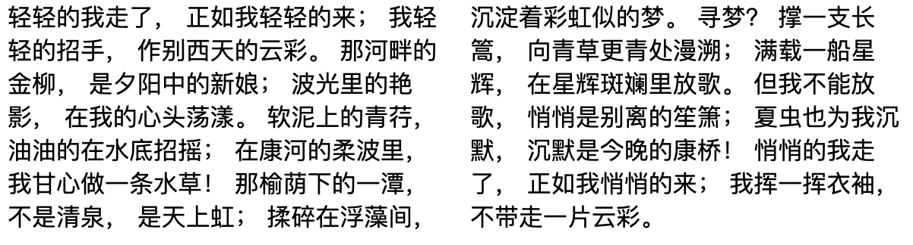

    ```html
    <!DOCTYPE html>
    <html>
      <head>
        <style>
          .demo {
            -webkit-columns: 200px 2;
          }
        </style>

        <div class="demo">
          <p>
            轻轻的我走了， 正如我轻轻的来； 我轻轻的招手， 作别西天的云彩。
            那河畔的金柳， 是夕阳中的新娘； 波光里的艳影， 在我的心头荡漾。
            软泥上的青荇， 油油的在水底招摇； 在康河的柔波里，
            我甘心做一条水草！ 那榆荫下的一潭， 不是清泉， 是天上虹；
            揉碎在浮藻间， 沉淀着彩虹似的梦。 寻梦？ 撑一支长篙，
            向青草更青处漫溯； 满载一船星辉， 在星辉斑斓里放歌。 但我不能放歌，
            悄悄是别离的笙箫； 夏虫也为我沉默， 沉默是今晚的康桥！
            悄悄的我走了， 正如我悄悄的来； 我挥一挥衣袖， 不带走一片云彩。
          </p>
        </div>
      </head>
      <body></body>
    </html>
    ```

2.  对一段文本分 3 列每列宽度不小于 `200px`。

    ```css
    .demo {
      -webkit-columns: 200px 3;
    }
    ```

    效果图

    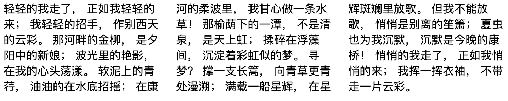


    ```html
    <!DOCTYPE html>
    <html>
    <head>
    <style>
    .demo{
        -webkit-columns:200px 3;
    }
    </style>

    <div class="demo">

        <p>
            轻轻的我走了，
        正如我轻轻的来；
        我轻轻的招手，
        作别西天的云彩。
        那河畔的金柳，
        是夕阳中的新娘；
        波光里的艳影，
        在我的心头荡漾。
        软泥上的青荇，
        油油的在水底招摇；
        在康河的柔波里，
        我甘心做一条水草！
        那榆荫下的一潭，
        不是清泉，
        是天上虹；
        揉碎在浮藻间，
        沉淀着彩虹似的梦。
        寻梦？

            撑一支长篙，
        向青草更青处漫溯；
        满载一船星辉，
        在星辉斑斓里放歌。
        但我不能放歌，
        悄悄是别离的笙箫；
        夏虫也为我沉默，
        沉默是今晚的康桥！
        悄悄的我走了，
        正如我悄悄的来；
        我挥一挥衣袖，
        不带走一片云彩。
        </p>

        </div>

    </head>
    <body>
    ```

3.  对两段文本分 3 列。

    ```html
    <div class="demo">
      <p>
        轻轻的我走了，正如我轻轻的来； 我轻轻的招手，作别西天的云彩。
        那河畔的金柳， 是夕阳中的新娘； 波光里的艳影，
        在我的心头荡漾。软泥上的青荇，油油的在水底招摇； 在康河的柔波里，
        我甘心做一条水草！ 那榆荫下的一潭，不是清泉， 是天上虹；
        揉碎在浮藻间，沉淀着彩虹似的梦。 寻梦？
      </p>
      <p>
        撑一支长篙， 向青草更青处漫溯；满载一船星辉，
        在星辉斑斓里放歌。但我不能放歌，悄悄是别离的笙箫；
        夏虫也为我沉默，沉默是今晚的康桥！悄悄的我走了，正如我悄悄的来；
        我挥一挥衣袖，不带走一片云彩。
      </p>
    </div>
    ```

    ```css
    .demo {
      -webkit-columns: 200px 3;
    }
    p {
      margin: 0;
    }
    ```

    效果图

    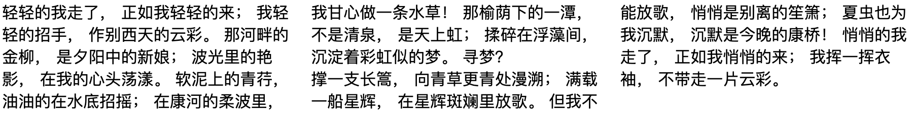

    ```html
    <!DOCTYPE html>
    <html>
      <head>
        <style>
          .demo {
            -webkit-columns: 200px 3;
          }
          p {
            margin: 0;
          }
        </style>

        <div class="demo">
          <p>
            轻轻的我走了， 正如我轻轻的来； 我轻轻的招手， 作别西天的云彩。
            那河畔的金柳， 是夕阳中的新娘； 波光里的艳影， 在我的心头荡漾。
            软泥上的青荇， 油油的在水底招摇； 在康河的柔波里，
            我甘心做一条水草！ 那榆荫下的一潭， 不是清泉， 是天上虹；
            揉碎在浮藻间， 沉淀着彩虹似的梦。 寻梦？
          </p>
          <p>
            撑一支长篙， 向青草更青处漫溯； 满载一船星辉， 在星辉斑斓里放歌。
            但我不能放歌， 悄悄是别离的笙箫； 夏虫也为我沉默，
            沉默是今晚的康桥！ 悄悄的我走了， 正如我悄悄的来； 我挥一挥衣袖，
            不带走一片云彩。
          </p>
        </div>
      </head>
      <body></body>
    </html>
    ```

4.  修改两列间隔的距离

    ```css
    .demo {
      -webkit-columns: 200px 2;
      column-gap: 100px;
    }
    ```

    效果图

    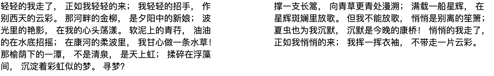

    ```html
    <!DOCTYPE html>
    <html>
      <head>
        <style>
          .demo {
            -webkit-columns: 200px 2;
            column-gap: 100px;
          }
        </style>

        <div class="demo">
          <p>
            轻轻的我走了， 正如我轻轻的来； 我轻轻的招手， 作别西天的云彩。
            那河畔的金柳， 是夕阳中的新娘； 波光里的艳影， 在我的心头荡漾。
            软泥上的青荇， 油油的在水底招摇； 在康河的柔波里，
            我甘心做一条水草！ 那榆荫下的一潭， 不是清泉， 是天上虹；
            揉碎在浮藻间， 沉淀着彩虹似的梦。 寻梦？
          </p>
          <p>
            撑一支长篙， 向青草更青处漫溯； 满载一船星辉， 在星辉斑斓里放歌。
            但我不能放歌， 悄悄是别离的笙箫； 夏虫也为我沉默，
            沉默是今晚的康桥！ 悄悄的我走了， 正如我悄悄的来； 我挥一挥衣袖，
            不带走一片云彩。
          </p>
        </div>
      </head>
      <body></body>
    </html>
    ```

5.  为每列直接增加边线。

    ```css
    .demo {
      -webkit-columns: 200px 2;
      column-gap: 100px;
      column-rule: 1px solid #ccc;
    }
    ```

    效果图  
    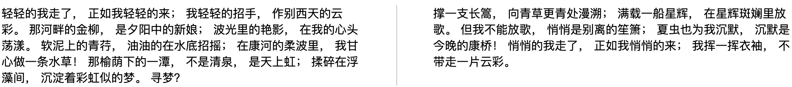

    ```html
    <!DOCTYPE html>
    <html>
      <head>
        <style>
          .demo {
            -webkit-columns: 200px 2;
            column-gap: 100px;
            column-rule: 1px solid #ccc;
          }
        </style>

        <div class="demo">
          <p>
            轻轻的我走了， 正如我轻轻的来； 我轻轻的招手， 作别西天的云彩。
            那河畔的金柳， 是夕阳中的新娘； 波光里的艳影， 在我的心头荡漾。
            软泥上的青荇， 油油的在水底招摇； 在康河的柔波里，
            我甘心做一条水草！ 那榆荫下的一潭， 不是清泉， 是天上虹；
            揉碎在浮藻间， 沉淀着彩虹似的梦。 寻梦？
          </p>
          <p>
            撑一支长篙， 向青草更青处漫溯； 满载一船星辉， 在星辉斑斓里放歌。
            但我不能放歌， 悄悄是别离的笙箫； 夏虫也为我沉默，
            沉默是今晚的康桥！ 悄悄的我走了， 正如我悄悄的来； 我挥一挥衣袖，
            不带走一片云彩。
          </p>
        </div>
      </head>
      <body></body>
    </html>
    ```

6.  让其内部 `class="head"`个子元素横跨所有列

    ```html
    <div class="demo">
      <p class="head">再别康桥</p>
      <p>
        轻轻的我走了，正如我轻轻的来； 我轻轻的招手，作别西天的云彩。
        那河畔的金柳， 是夕阳中的新娘； 波光里的艳影，
        在我的心头荡漾。软泥上的青荇，油油的在水底招摇； 在康河的柔波里，
        我甘心做一条水草！ 那榆荫下的一潭，不是清泉， 是天上虹；
        揉碎在浮藻间，沉淀着彩虹似的梦。 寻梦？
      </p>
      <p>
        撑一支长篙， 向青草更青处漫溯；满载一船星辉，
        在星辉斑斓里放歌。但我不能放歌，悄悄是别离的笙箫；
        夏虫也为我沉默，沉默是今晚的康桥！悄悄的我走了，正如我悄悄的来；
        我挥一挥衣袖，不带走一片云彩。
      </p>
    </div>
    ```

    ```css
    .demo{
        -webkit-columns:200px 2;
        column-gap:100px;
        column-rule:1px solid #ccc;

    }
    .head{
        column-span:all;
    }
    p{
        margin: 0;
        texta
    }
    ```

    效果图

    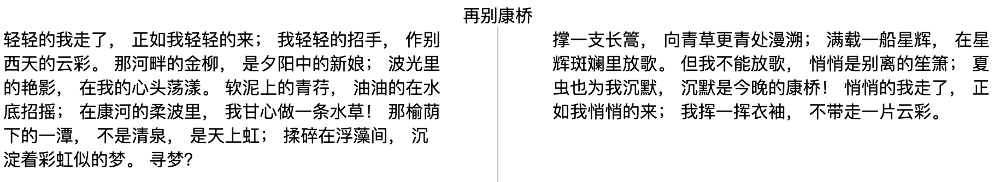

    ```html
    <!DOCTYPE html>
    <html>
      <head>
        <style>
          .demo {
            -webkit-columns: 200px 2;
            column-gap: 100px;
            column-rule: 1px solid #ccc;
          }
          .head {
            column-span: all;
            text-align: center;
          }
          p {
            margin: 0;
            background: #ccc;
            column-fill: balance;
          }
        </style>

        <div class="demo">
          <p class="head">
            再别康桥
          </p>
          <p>
            轻轻的我走了， 正如我轻轻的来； 我轻轻的招手， 作别西天的云彩。
            那河畔的金柳， 是夕阳中的新娘； 波光里的艳影， 在我的心头荡漾。
            软泥上的青荇， 油油的在水底招摇； 在康河的柔波里，
            我甘心做一条水草！ 那榆荫下的一潭， 不是清泉， 是天上虹；
            揉碎在浮藻间， 沉淀着彩虹似的梦。 寻梦？
          </p>
          <p>
            撑一支长篙， 向青草更青处漫溯； 满载一船星辉， 在星辉斑斓里放歌。
            但我不能放歌， 悄悄是别离的笙箫； 夏虫也为我沉默，
            沉默是今晚的康桥！ 悄悄的我走了， 正如我悄悄的来； 我挥一挥衣袖，
            不带走一片云彩。
          </p>
        </div>
      </head>
      <body></body>
    </html>
    ```

### 6. 经验分享

使用 `columns` 可以快速的把元素内的字符分成我们想要的列数，如果想要自适应该怎么做呢？可以只设置列数这样在一定程度上可以不考虑元素的宽度，如下：

```css
.demo {
  -webkit-columns: 2;
}
```

这样不管窗口怎么边它都是分成两列，其实任何自适应的原理也是如此。

### 7. 小结

1. 它分的列和子元素的个数无关。
2. 分的列数最好保证和内部子元素数量相等。

## flex 弹性盒子布局介绍

`flex` 布局可以说是目前为止最好用的布局方式，但是目前还稍微有一点受到兼容性的影响，它对 IE9 不兼容，但是在未来随着 `IE9` 逐渐被淘汰，我相信，它一定会在布局这块大放异彩，因为它实现了太多我们曾经不能实现的布局效果，而且只要简单的几个属性就可以搞定！

### 1. 官方解释

一种弹性盒模型布局方式。

### 2. 慕课解释

`flex` 布局也叫弹性布局，它的特点是可以实现子元素的自适应屏幕大小，可以自由的分配每个 `box` 需要占用的空间比例。我们把父元素称作为：容器。子元素称作为：项目。容器默认存在两个轴：水平主轴（`mian axis`）、垂直交叉轴（`cross axis`）。左侧是主轴的开始点，右侧是主轴的结束点，垂直方向上顶部是交叉轴的开始位置，底部是交叉轴的结束位置。

### 3. 语法

通过下面两种形式都可以实现弹性盒模型“容器”的初始化。

1. 块级弹性模块。

   ```css
   div {
     display: flex;
   }
   ```

2. 内联弹性模块

   ```css
   div {
     display: inline-flex;
   }
   ```

#### 容器包含属性

| 参数名称        | 参数                                                                      | 解释                                 |
| --------------- | ------------------------------------------------------------------------- | ------------------------------------ |
| flex-direction  | `row | row-reverse | column | column-revers` 定义主轴上项目的的方向       |
| flex-wrap       | `nowrap | wrap | wrap-reverse`                                            | 定义项目如何换行                     |
| flex-flow       | `< flex-direction > | < flex-wrap >`                                      | 前两个属性的简写                     |
| justify-content | `flex-start | flex-end | center | space-between | space-around`           | 定义主轴(水平)上项目的对齐方式       |
| align-items     | `flex-start | flex-end | center | baseline | stretch`                     | 定义交叉（垂直）方向上项目的对齐方式 |
| align-content   | `flex-start | flex-end | center | space-between | space-around | stretch` | 多轴(多行)下项目的（水平）对齐方式   |

#### 项目包含属性

| 参数名称    | 参数                                                         | 解释         |
| ----------- | ------------------------------------------------------------ | ------------ |
| flex-grow   | number                                                       |
| flex-shrink | number                                                       |
| flex-basis  | 像素                                                         |
| flex        |                                                              |              |
| order       | number                                                       |
| align-self  | `auto | flex-start | flex-end | center | baseline | stretch` | 修改单个项目 |

### 4. 兼容性

| IE  | Edge | Firefox | Chrome | Safari | Opera | ios | android |
| --- | ---- | ------- | ------ | ------ | ----- | --- | ------- |
| 10+ | 12+  | 28+     | 4+     | 6.1+   | 12.1+ | 7+  | 4.4     |

### 5. 实例

1.  创建一个弹性盒模型，容器为块级，项目自适应。

    ```css
    .demo {
      display: flex;
    }
    ```

2.  创建一个行内盒模型

    ```css
    .demo {
      display: inline-flex;
    }
    ```

### 6. 小结

1. 需要父元素首先设置成 `dislpay:flex` 这样子元素才能起作用，而子元素的 `float` 、 `clear` 、 `vertical-align` 属性都失去作用。
2. 子元素可以使用 `position` 来脱离 `flex` 布局。

## `flex order` 排序

一般情况下浏览器会把元素从左到右或者从上到下排列，如果我们想要更改它们的排列顺序该如何做呢？使用 `order` 就可以轻松的修改。数字越大越往后，数字越小越在前。

### 1. 官方定义

`order` 属性设置或检索弹性盒模型对象的子元素出现的順序

### 2. 慕课解释

子元素可以通过设置 `order` 数值的大小来设定在页面中出现的顺序，数值小的在前，数值大的在后。

### 3. 语法

```css
.item-child {
  order: 1;
}
```

属性说明

| 参数名称 | 参数类型 | 解释               |
| -------- | -------- | ------------------ |
| order    | number   | 数值越小排位越靠前 |

### 4.兼容性

| IE  | Edge | Firefox | Chrome | Safari | Opera | ios | android |
| --- | ---- | ------- | ------ | ------ | ----- | --- | ------- |
| 10+ | 12+  | 28+     | 4+     | 6.1+   | 12.1+ | 7+  | 4.4     |

### 5. 实例

1.  子元素 `child-1` 在右侧 `child-2` 在左侧

    ```html
    <div class="demo">
      <div class="child-1">
        1
      </div>
      <div class="child-2">
        2
      </div>
    </div>
    ```

    ```css
    .demo {
      display: flex;
    }
    .child-1 {
      flex: auto;
      order: 2;
      background: #000;
    }
    .child-2 {
      flex: auto;
      order: 1;
      background: rgb(255, 2, 2);
    }
    ```

    效果图

    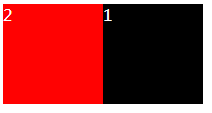

    ```html
    <!DOCTYPE html>
    <html lang="en">
      <head>
        <meta charset="UTF-8" />
        <meta name="viewport" content="width=device-width, initial-scale=1.0" />
        <meta http-equiv="X-UA-Compatible" content="ie=edge" />
        <title>Document</title>
        <style>
          .demo {
            display: flex;
          }
          .child-1 {
            flex: auto;
            order: 2;
            background: #000;
          }
          .child-2 {
            flex: auto;
            order: 1;
            background: rgb(255, 2, 2);
          }
        </style>
      </head>
      <body>
        <div class="demo">
          <div class="child-1">
            1
          </div>
          <div class="child-2">
            2
          </div>
        </div>
      </body>
    </html>
    ```

2.  子元素 `child-1` 在下 `child-2` 在上

    ```html
    <div class="demo">
      <div class="child-1">
        1
      </div>
      <div class="child-2">
        2
      </div>
    </div>
    ```

    ```css
    .demo {
      display: flex;
      flex-direction: column;
    }
    .child-1 {
      flex: auto;
      order: 2;
      background: #000;
    }
    .child-2 {
      flex: auto;
      order: 1;
      background: rgb(255, 2, 2);
    }
    ```

    效果图

    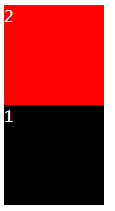

    ```html
    <!DOCTYPE html>
    <html lang="en">
      <head>
        <meta charset="UTF-8" />
        <meta name="viewport" content="width=device-width, initial-scale=1.0" />
        <meta http-equiv="X-UA-Compatible" content="ie=edge" />
        <title>Document</title>
        <style>
          .demo {
            display: flex;
            flex-direction: column;
          }
          .child-1 {
            flex: auto;
            order: 2;
            background: #000;
          }
          .child-2 {
            flex: auto;
            order: 1;
            background: rgb(255, 2, 2);
          }
        </style>
      </head>
      <body>
        <div class="demo">
          <div class="child-1">
            1
          </div>
          <div class="child-2">
            2
          </div>
        </div>
      </body>
    </html>
    ```

### 6. 经验分享

通过使用 `order` 属性可以实现拖动排序，当 `JS` 脚本运行之后，只要确定元素拖动到指定的位置通过修改对应的 `order` 就可以轻松完成顺序的改变。

### 7. 小结

只有在弹性盒模型下起作用

## flex 弹性盒子

`display:flex` 和接下来我们介绍的这个 `flex` 是有区别的，前者是修改 `display` 实现弹性和模型的，而 `flex` 仅仅是弹性盒模型下 `flex-grow`、`flex-shrink` 和 `flex-basis` 三个的缩写属性，用来定义和模型内部的子元素在浏览器重的展示形式。 下面我们主要讲这三个属性。

### 1. 官方定义

属性用于设置或检索弹性盒模型对象的子元素如何分配空间。

`flex` 属性是 `flex-grow`、`flex-shrink`和 `flex-basis` 属性的简写属性

### 2. 慕课解释

`fl` 父元素设置成 `display：flex` 之后子元素的空间分配通过 `flex` 设置，其特点为弹性，即内部分配空间如果按照比例分配则其不会随着父元尺寸变化而变化。

### 3. 语法

子元素

```css
 {
  flex: flex-grow flex-shrink flex-basis|auto|initial|inherit|none;
}
```

属性说明

| 参数名称    | 参数类型              | 解释                                              |
| ----------- | --------------------- | ------------------------------------------------- |
| flex-grow   | number                | 其它子元素的比例关系默认为 0 ，存在剩余空间不扩大 |
| flex-shrink | number                | 默认为 1 空间不足时候缩小                         |
| flex-basis  | `content | <'width'>` | 设定一个长度或者自动填充                          |

### 4. 兼容性

flex:

| IE  | Edge | Firefox | Chrome | Safari | Opera | ios | android |
| --- | ---- | ------- | ------ | ------ | ----- | --- | ------- |
| –   | –    | 63-74   | 84-85  | –      | –     | –   | –       |

flex-grow| flex-shrink|flex-basis:

| IE  | Edge | Firefox | Chrome | Safari | Opera | ios | android |
| --- | ---- | ------- | ------ | ------ | ----- | --- | ------- |
| 10+ | 12+  | 28+     | 4+     | 6.1+   | 12.1+ | 7+  | 4.4     |

### 5.实例

1. 给一个块级元素添加 `flex` 属性 ，让其子元素平均分配空间。

   ```html
   <div class="demo">
     <div class="item">1</div>
     <div class="item">2</div>
     <div class="item">3</div>
   </div>
   ```

   ```css
   .demo {
     display: flex;
     width: 200px;
     height: 60x;
     line-height: 60px;
     border: 1px solid #ccc;
     border-right: none;
   }
   div > .item {
     width: 100px;
     border-right: 1px solid #ccc;
     text-align: center;
     flex: 1;
   }
   ```

效果图

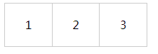

解释：容器 `demo` 设置了 `flex` 总宽度为 `200px`，项目 `item` 设置宽度 `100px`；如果正常情况下会超出容器，我们通过设置 `flex:1` 让项目自适应容器，并等分了空间。

2. 给一个块级元素添加 `inline-flex` 属性,让其变成行内元素，子元素平均分配

   ```html
   <div class="demo">
     <div class="item">1</div>
     <div class="item">2</div>
     <div class="item">3</div>
   </div>
   慕课
   ```

   ```css
   .demo {
     display: inline-flex;
     width: 200px;
     height: 60x;
     line-height: 60px;
     border: 1px solid #ccc;
     border-right: none;
   }
   div > .item {
     width: 100px;
     border-right: 1px solid #ccc;
     text-align: center;
     flex: 1;
   }
   ```

   效果图

   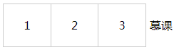

   `demo` 和文字在一行，`demo` 变成内联元素了。

3. 一个左侧 `100px`，右侧自适应的，左右布局

   ```html
   <div class="demo-2">
     <div class="item-left">1</div>
     <div class="item-right">2</div>
   </div>
   ```

   ```css
   .demo-2 {
     display: flex;
   }
   .item-left {
     flex-basis: 100px;
   }
   .item-right {
     flex-grow: 1;
   }
   ```

   效果图

   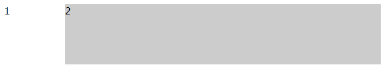

4. .一个左侧为 `100px`，右侧最大为 `600px` 的左右布局

   ```css
   .demo-2 {
     display: flex;
   }
   .item-left {
     flex-basis: 100px;
     background: red;
     flex-shrink: 0;
   }
   .item-right {
     flex-basis: 600px;
     background: yellow;
   }
   ```

   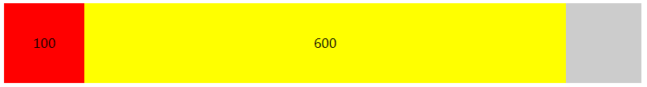

   解释：右侧最大宽度为 `600`，如果小于 `600` 右侧将随屏幕尺寸缩小。

### 6. 经验分享

现在的很多前端开发都会接到一些设计稿，要求在各种终端都可以适应，那么用好 `flex` 是一个关键。 `flex:1` 是其中最常见的设置,它等价于：

```css
.demo {
  flex-grow: 1;
  flex-shrink: 1;
  flex-basis: auto;
}
```

其意思就是剩余空间就扩大，而剩余空间不足就缩小，就像弹簧一样。那么这部分就可以自适应各种屏幕大小了。

### 7. Tips

1. `flex-basis` 和 `flex-grow` 同时使用时候 `flex-basis` 不起作用。
2. `flex` 的属性 默认是 `0 1 auto`，它们的顺序是 `flex-grow` `flex-shrink` 和 `flex-basis` 即三不：有剩余空间不扩大、当空间不足时缩小、不限制尺寸。
3. `flex` 属性有两个快捷值 即 `auto`（ 1 1 auto）和 `none`（0 0 auto）。
4. 尽量不要使用缩小，因为它的兼容性不是很好。

## flex-direction 排列方向

弹性和模型中内部的子元素的排列方向可以通过这个属性修改，那么我们就一起看下它的使用吧。

### 1. 官方定义

`flex-direction` 属性规定项目的排列方向。

### 2. 慕课解释

`flex-direction` 用来调整主轴的方向，我们知道主轴默认是水平方向且从左到右，而我们可以通过这个属性设置主轴的方向，即项目是水平方向从左到右还是垂直方向从上到下或者从下到上排列。

### 3. 语法

```css
div {
  flex-direction: row|row-reverse|column|column-reverse|initial|inherit;
}
```

```html
<div class="demo">
  <div class="item">1</div>
  <div class="item">2</div>
  <div class="item">3</div>
</div>
```

```css
.demo {
  display: flex; /* 让容器变成弹性盒*/
  flex-direction: row-reverse; /*改变项目的排列方向*/
}
```

### 4. 兼容性

| IE  | Edge | Firefox | Chrome | Safari | Opera | ios | android |
| --- | ---- | ------- | ------ | ------ | ----- | --- | ------- |
| 10+ | 12+  | 28+     | 4+     | 6.1+   | 12.1+ | 7+  | 4.4     |

### 5. 实例

1. 让子元素从上到下垂直方向排列

   ```css
   .demo {
     display: flex;
     flex-direction: column;
     text-align: center;
     line-height: 100px;
   }
   .item {
     background: #ccc;
     height: 100px;
     border-bottom: 1px solid #fff;
   }
   ```

   效果图

   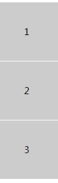

2. 让子元素从下到上反向排列

   ```css
   .demo {
     display: flex;
     flex-direction: column-reverse;
     text-align: center;
     /*实现文字垂直居中*/
     line-height: 100px;
   }
   .item {
     background: #ccc;
     height: 100px;
     border-bottom: 1px solid #fff;
   }
   ```

   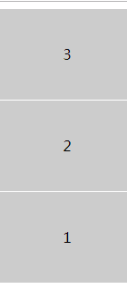

3. 让子元素从左到右排列

   ```css
   .demo {
     display: flex;
     flex-direction: row;
   }
   .item {
     background: #ccc;
     height: 100px;
     width: 100px;
     border-right: 1px solid #fff;
   }
   ```

   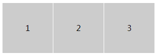

4. 让子元素从左到右反向排列

   ```css
   .demo {
     display: flex;
     flex-direction: row-reverse;
   }
   .item {
     background: #ccc;
     height: 100px;
     width: 100px;
     border-right: 1px solid #fff;
   }
   ```

   效果图

   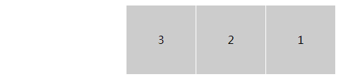

### 6. 经验分享

通过 `flex` 可以做一个上下固定，中间自适应的布局，它常常用于登录页那类的布局设置。

```html
<div class="demo">
  <div class="head">头部</div>
  <div class="content">内容</div>
  <div class="foot">尾部</div>
</div>
```

```css
html,
body {
  padding: 0;
  margin: 0;
  height: 100%;
  color: #fff;
}
.demo {
  height: 100%;
  display: flex;
  flex-direction: column;
}
.head,
.foot {
  flex: 0 1 100px;
  background: #000;
}
.content {
  flex: 1;
  background: red;
}
```

说明：这个布局就是两端固定，中间自适应的典型写法，而如果设置 `flex-direction:row` 就变成了左右固定，中间自适应的横向布局。而他们正是组成页面的基础。

### 7. 小结

1. 一定要在弹性盒模型下使用。
2. 可以通过样式直接设置排列顺序，节省浏览器性能。

## flex-wrap 换行

`flex-wrap` 主要通过在外层容器中设置它里面的子项目是否可以换行。默认情况下项目是不换行的。

### 1. 官方定义

`flex-wrap` 属性规定 `flex` 容器是单行或者多行，同时横轴的方向决定了新行堆叠的方向。

### 2. 慕课解释

默认情况下，设置了 `display:flex` 的容器是不会换行的，这时候如果我们希望它换行就可以通过 `flex-wrap` 设置超出宽度换行，也可以设置它如何换行，既换行之后的排列的方向。

### 3. 语法

```css
flex-wrap: nowrap|wrap|wrap-reverse|initial|inherit;
```

属性值

| 值           | 描述                                                     |
| ------------ | -------------------------------------------------------- |
| nowrap       | 默认值。规定灵活的项目不拆行或不拆列。                   |
| wrap         | 规定灵活的项目在必要的时候拆行或拆列。                   |
| wrap-reverse | 规定灵活的项目在必要的时候拆行或拆列，但是以相反的顺序。 |
| initial      | 设置该属性为它的默认值。请参阅 initial。                 |
| inherit      | 从父元素继承该属性。请参阅 inherit。                     |

### 4. 兼容性

| IE  | Edge | Firefox | Chrome | Safari | Opera | ios | android |
| --- | ---- | ------- | ------ | ------ | ----- | --- | ------- |
| 10+ | 12+  | 28+     | 4+     | 6.1+   | 12.1+ | 7+  | 4.4     |

### 5. 实例

1. 设置一个容器，当内部的内容超过容器的宽度时候向下换行

   ```css
   .demo {
     display: flex;
     flex-wrap: wrap;
   }
   .item {
     width: 200px;
     height: 100px;
     line-height: 100px;
     background: #ccc;
     border-right: 1px solid #fff;
     text-align: center;
   }
   ```

   效果图

   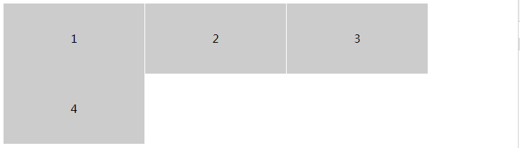

2. 设置一个容器当内部的项目超过容器的宽度时候反向向下换行。

   ```css
   .demo {
     display: flex;
     flex-wrap: wrap-reverse;
   }
   .item {
     width: 200px;
     height: 100px;
     line-height: 100px;
     background: #ccc;
     border-right: 1px solid #fff;
     text-align: center;
   }
   ```

   效果图

   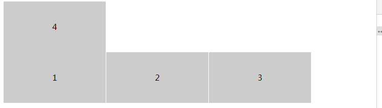

### 6. 小结

`flex` 弹性盒模型默认是不换行的既 `nowrap`

## justify-content (轴内)对齐方式

`justify-content` 属性可以改变项目在容器中的对齐方式。

### 1. 官方定义

`justify-content` 用于设置或检索弹性盒子元素在主轴（横轴）方向上的对齐方式。

### 2. 慕课解释

`justify-content` 它主要用来设置每行里面项目的排列规则,一共有 5 种设置。

### 3. 语法

```css
justify-content: flex-start|flex-end|center|space-between|space-around|initial|inherit;
```

属性值

| 值            | 描述                                             |
| ------------- | ------------------------------------------------ |
| flex-start    | 默认值。项目位于容器的开头。                     |
| flex-end      | 项目位于容器的结尾。                             |
| center        | 项目位于容器的中心。                             |
| space-between | 项目位于各行之间留有空白的容器内。               |
| space-around  | 项目位于各行之前、之间、之后都留有空白的容器内。 |
| initial       | 设置该属性为它的默认值。请参阅 initial。         |
| inherit       | 从父元素继承该属性。请参阅 inherit。             |

### 4. 兼容性

| IE  | Edge | Firefox | Chrome | Safari | Opera | ios | android |
| --- | ---- | ------- | ------ | ------ | ----- | --- | ------- |
| 10+ | 12+  | 28+     | 4+     | 6.1+   | 12.1+ | 7+  | 4.4     |

### 5. 实例

想改变对项目的对齐方式只要给 `justify-content` 使用不同的属性值，我们看下不同的值带来的效果。

```html
<!DOCTYPE html>
<html lang="en">
  <head>
    <meta charset="UTF-8" />
    <meta name="viewport" content="width=device-width, initial-scale=1.0" />
    <title>Document</title>
    <style>
      .demo {
        display: flex;
      }
      .item {
        width: 100px;
        height: 100px;
        line-height: 100px;
        text-align: center;
        background: #ccc;
        border-right: 1px solid #fff;
      }
      .demo-2 {
        justify-content: flex-end;
      }
      .demo-3 {
        justify-content: center;
      }
      .demo-4 {
        justify-content: space-between;
      }
      .demo-5 {
        justify-content: space-around;
      }
    </style>
  </head>
  <body>
    <p>
      flex-start: 默认值。项目位于容器的开头。
    </p>
    <div class="demo demo-1">
      <div class="item">1</div>
      <div class="item">2</div>
      <div class="item">3</div>
      <div class="item">4</div>
    </div>
    <p>
      flex-end 项目位于容器的结尾。
    </p>
    <div class="demo demo-2">
      <div class="item">1</div>
      <div class="item">2</div>
      <div class="item">3</div>
      <div class="item">4</div>
    </div>
    <p>
      flex-end 项目位于容器的中心。
    </p>
    <div class="demo demo-3">
      <div class="item">1</div>
      <div class="item">2</div>
      <div class="item">3</div>
      <div class="item">4</div>
    </div>
    <p>space-between 项目位于各行之间留有空白的容器内。</p>
    <div class="demo demo-4">
      <div class="item">1</div>
      <div class="item">2</div>
      <div class="item">3</div>
      <div class="item">4</div>
    </div>
    <p>space-around 项目在容器的前后留白并</p>
    <div class="demo demo-5">
      <div class="item">1</div>
      <div class="item">2</div>
      <div class="item">3</div>
      <div class="item">4</div>
    </div>
  </body>
</html>
```

效果图

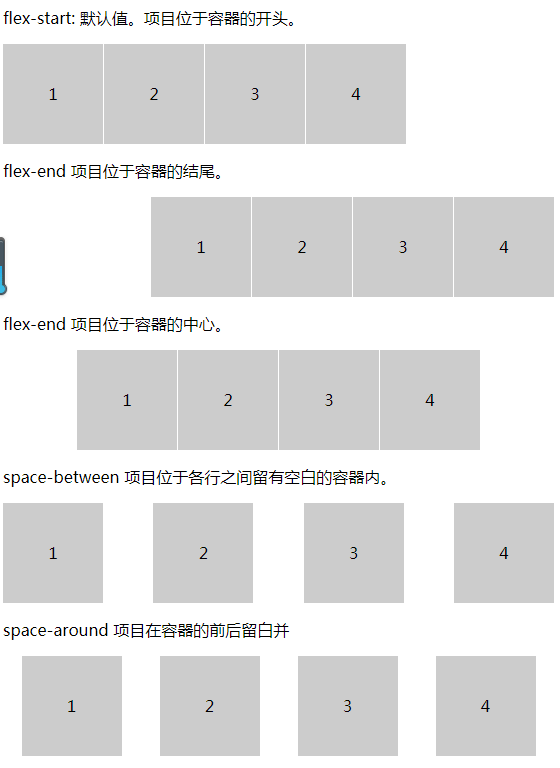

### 6. 小结

通常我们在不知道容器宽度时候可以使用这种方式去设置我们的排版。

## `align-items` 竖直方向对齐方式

`align-items` 属性可以改变项目在容器中的对齐方式。

### 1. 官方定义

`align-items` 属性定义 `flex` 子项在 `flex` 容器的当前行的侧轴（纵轴）方向上的对齐方式。

### 2. 慕课解释

`align-items` 主要用来设置一行内，当项目大小不一致时候的对齐方式。

提示： 子项目含有一个 `align-self` 属性可重写父级容器 `align-items` 属性，可以对单个项目对齐方式进行单一控制。

### 3. 语法

```css
align-items: stretch|center|flex-start|flex-end|baseline|initial|inherit;
```

属性值

| 值         | 描述                                     |
| ---------- | ---------------------------------------- |
| stretch    | 默认值。元素被拉伸以适应容器。           |
| center     | 元素位于容器的中心。                     |
| flex-start | 元素位于容器的开头。                     |
| flex-end   | 元素位于容器的结尾。                     |
| baseline   | 元素位于容器的基线上。                   |
| initial    | 设置该属性为它的默认值。请参阅 initial。 |
| inherit    | 从父元素继承该属性。请参阅 inherit。     |

### 4. 兼容性

| IE  | Edge | Firefox | Chrome | Safari | Opera | ios | android |
| --- | ---- | ------- | ------ | ------ | ----- | --- | ------- |
| 10+ | 12+  | 28+     | 4+     | 6.1+   | 12.1+ | 7+  |

### 5. 实例

想要改变对齐方式可以用过 `align-items` 设置不同的属性值，我们看下不同的值带来的效果。

```html
<!DOCTYPE html>
<html lang="en">
  <head>
    <meta charset="UTF-8" />
    <meta name="viewport" content="width=device-width, initial-scale=1.0" />
    <title>Document</title>
    <style>
      .demo {
        display: flex;
      }
      .item {
        width: 100px;
        height: 100px;
        line-height: 100px;
        text-align: center;
        background: #ccc;
        border-right: 1px solid #fff;
      }
      .item:first-child {
        height: 120px;
      }
      .item:nth-of-type(3) {
        height: 160px;
      }
      .demo-2 {
        align-items: center;
      }
      .demo-3 {
        align-items: flex-start;
      }
      .demo-4 {
        align-items: flex-end;
      }
      .demo-5 {
        align-items: baseline;
      }
    </style>
  </head>
  <body>
    <p>
      stretch 默认值。元素被拉伸以适应容器。
    </p>
    <div class="demo demo-1">
      <div class="item">1</div>
      <div class="item">2</div>
      <div class="item">3</div>
      <div class="item">4</div>
    </div>
    <p>
      center 项目位于容器的中心。
    </p>
    <div class="demo demo-2">
      <div class="item">1</div>
      <div class="item">2</div>
      <div class="item">3</div>
      <div class="item">4</div>
    </div>
    <p>
      flex-start 项目位于容器的头部。
    </p>
    <div class="demo demo-3">
      <div class="item">1</div>
      <div class="item">2</div>
      <div class="item">3</div>
      <div class="item">4</div>
    </div>
    <p>flex-end 项目位于容器的低部。</p>
    <div class="demo demo-4">
      <div class="item">1</div>
      <div class="item">2</div>
      <div class="item">3</div>
      <div class="item">4</div>
    </div>
    <p>baseline 元素位于容器的基线上。默认情况和 flex-star 一样。</p>
    <div class="demo demo-5">
      <div class="item">1</div>
      <div class="item">2</div>
      <div class="item">3</div>
      <div class="item">4</div>
    </div>
  </body>
</html>
```

效果图

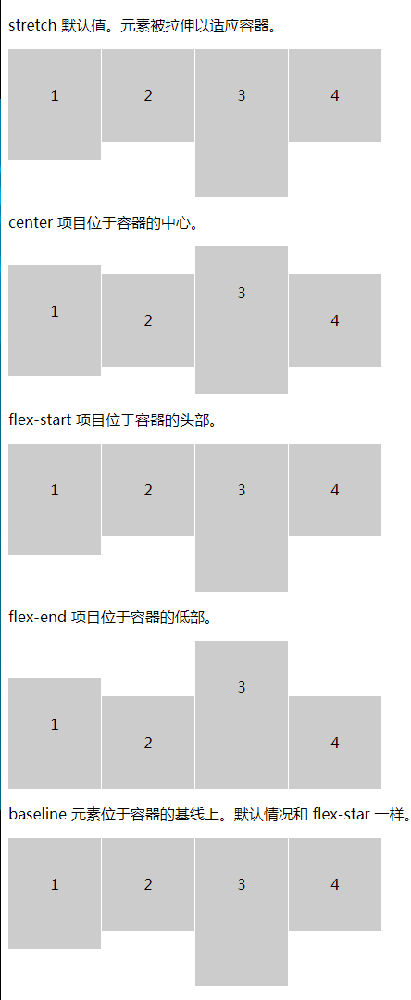

### 6. 小结

在可以使用 `flex` 的开发环境中，我们可以使用这种方式去对齐文字和图片，文字和 `input`这样的对齐方式简单快捷，远胜于其他的方式

## align-content 多轴对齐

这个属性可以改变项目在容器中的对齐方式。

### 1. 官方定义

`align-content` 属性在弹性容器内的各项没有占用交叉轴上所有可用的空间时对齐容器内的各项（垂直）。

### 2. 慕课解释

`align-content` 是当容器内部的元素换行之后，我们如何设置他们所有在水平方向上排列的，这里要说的是它是一个多轴的统一设置。

### 3. 语法

```css
align-content: stretch|center|flex-start|flex-end|space-between|space-around|initial|inherit;
```

属性值

| 值         | 描述                                     |
| ---------- | ---------------------------------------- |
| stretch    | 默认值。元素被拉伸以适应容器。           |
| center     | 元素位于容器的中心。                     |
| flex-start | 元素位于容器的开头。                     |
| flex-end   | 元素位于容器的结尾。                     |
| baseline   | 元素位于容器的基线上。                   |
| initial    | 设置该属性为它的默认值。请参阅 initial。 |
| inherit    | 从父元素继承该属性。请参阅 inherit。     |

### 4. 兼容性

| IE  | Edge | Firefox | Chrome | Safari | Opera |
| --- | ---- | ------- | ------ | ------ | ----- |
| 10+ | 12+  | 28+     | 4+     | 6.1+   | 12.1+ |

### 5. 实例

想改变对齐方式只要给 `align-content` 使用不同的属性值，我们看下不同的值带来的效果。

```html
<!DOCTYPE html>
<html lang="en">
  <head>
    <meta charset="UTF-8" />
    <meta name="viewport" content="width=device-width, initial-scale=1.0" />
    <title>Document</title>
    <style>
      .demo {
        display: flex;
        flex-wrap: wrap;
        height: 100px;
        border: 1px solid #ccc;
      }
      .item {
        width: 400px;
        height: 30px;
        line-height: 30px;
        text-align: center;
        background: #ccc;
        border-right: 1px solid #fff;
      }
      .demo-2 {
        align-content: flex-end;
        justify-content: flex-end;
      }
      .demo-3 {
        align-content: center;
      }
      .demo-4 {
        align-content: space-between;
      }
      .demo-5 {
        align-content: space-around;
      }
    </style>
  </head>
  <body>
    <p>
      flex-start: 默认值。项目位于容器的开头。
    </p>
    <div class="demo demo-1">
      <div class="item">1</div>
      <div class="item">2</div>
      <div class="item">3</div>
      <div class="item">4</div>
    </div>
    <p>
      flex-end 项目位于容器的结尾。
    </p>
    <div class="demo demo-2">
      <div class="item">1</div>
      <div class="item">2</div>
      <div class="item">3</div>
      <div class="item">4</div>
    </div>
    <p>
      flex-end 项目位于容器的中心。
    </p>
    <div class="demo demo-3">
      <div class="item">1</div>
      <div class="item">2</div>
      <div class="item">3</div>
      <div class="item">4</div>
    </div>
    <p>space-between 项目位于各行之间留有空白的容器内。</p>
    <div class="demo demo-4">
      <div class="item">1</div>
      <div class="item">2</div>
      <div class="item">3</div>
      <div class="item">4</div>
    </div>
    <p>space-around 项目在容器的前后留白并</p>
    <div class="demo demo-5">
      <div class="item">1</div>
      <div class="item">2</div>
      <div class="item">3</div>
      <div class="item">4</div>
    </div>
  </body>
</html>
```

效果图

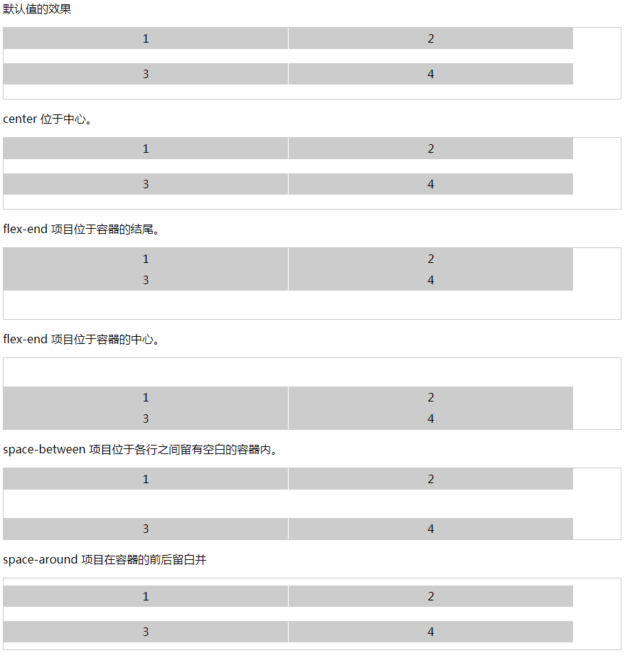

### 6. 小结

1. 使用 `justify-conten`t 属性对齐主轴上的各项（水平），它和 `align-content` 并不冲突
2. 器内必须有多行的项目，该属性才能渲染出效果。

## Grid 布局方式

### 1. 官方定义

通过设置 `display: grid;` 可以定义一个 `CSS` 网格。然后使用 `grid-template-rows` 和 `grid-template-columns` 属性来定义网格的 `columns` 和 `rows`。

使用这些属性定义的网格被描述为 显式网格 (explicit grid)。

### 2. 慕课解释

`Grid` 是一个二维网格布局，它有行 `grid-template-rows` （横排）、 列 `grid-template-columns`（竖排）,内部的项目就分布在其中，而网格线就是行和列划分出来的。

基本属于解释:

**容器**：上面代码中，最外层的`<div>`元素 demo 就是容器 <br/>
**项目**：内层的三个`<div>`元素 item 就是项目<br/>
**行**：把 row 即横向称为行<br/>
**列**：把 column 即纵向称为列<br/>
**单元格**：它们的交叉区域 cell 也就是单元格<br/>
**网格线**:grid line 网格线就是由行和列划分出来的

### 3. 语法

1.  块级的网格

    ```css
    .demo {
      display: grid;
    }
    ```

2.  内联级的网格。
    `css .demo { display: inline-grid; }`
    容器包含属性如下

| 属性名                | 值                                                                             | 说明                            |
| --------------------- | ------------------------------------------------------------------------------ | ------------------------------- |
| grid-template-columns | length                                                                         | 列和每列宽度                    |
| grid-template-rows    | length                                                                         | 行和每行的高度                  |
| grid-row-gap          | length                                                                         | 行和行之间的距离                |
| grid-column-gap       | length                                                                         | 列与列之间距离                  |
| grid-gap              | `row column`                                                                   | 行、列间距的合并写法            |
| grid-template-areas   | string                                                                         | 用来指定区域                    |
| grid-auto-flow        | `row | column`                                                                 | 默认是 row ，用来指定排列优先级 |
| justify-items         | `start | end | center | stretch`                                               | 水平方向内容的位置              |
| align-items           | `start | end | center | stretch`                                               | 垂直方向内容的位置              |
| place-items           | `align justify`                                                                | 垂直和水平位置合并写法          |
| justify-content       | `start | end | center | stretch | space-around | space-between | space-evenly` | 水平方向整个内容区域的位置      |
| align-content         | `start | end | center | stretch | space-around | space-between | space-evenly` | 垂直方向整个内容区域的位置      |
| place-content         | `align justify`                                                                | 垂直和水平方向的合并写法        |
| grid-auto-columns     | length                                                                         | 多于的网格列宽定义              |
| grid-auto-rows        | length                                                                         | 多于的网格行高的定义            |

`grid-template` 是 `grid-template-columns` 、`grid-template-rows`、 `grid-template-areas` 缩写。

`grid` 是 `grid-template-rows`、`grid-template-columns`、`grid-template-areas`、 `grid-auto-rows`、`grid-auto-columns`、`grid-auto-flow`的合并缩写。

**提示：`gird` 属性很复杂因此不推荐 `grid` 的缩写**

项目包含属性介绍

| 属性名            | 值                                | 说明                                            |
| ----------------- | --------------------------------- | ----------------------------------------------- |
| grid-column-start | `number | areaName | span number` | 项目开始位置在左边框所在的第几根垂直网格线      |
| grid-column-end   | `number | areaName | span number` | 项目开始位置在右边框所在的第几根垂直网格线      |
| grid-row-start    | `number | areaName | span number` | 项目开始位置在上边框所在的第几根水平网格线      |
| grid-row-end      | `number | areaName | span number` | 项目开始位置在下边框所在的第几根水平网格线      |
| grid-column       | `number / number`                 | `grid-column-start` 和 `grid-column-end` 的合并 |
| grid-area         | areaName                          | 指定项目放在哪一个区域                          |
| justify-self      | `start | end | center | stretch`  | 单元格内容的水平方向位置                        |
| align-self        | `start | end | center | stretch`  | 单元格内容的垂直方向位置                        |
| place-self        | align-self justify-self           | 单元格内容的垂直和水平位置缩写                  |

### 4. 兼容性

| IE  | Edge | Firefox | Chrome | Safari | Opera | ios   | android |
| --- | ---- | ------- | ------ | ------ | ----- | ----- | ------- |
| No  | 16+  | 52+     | 57+    | 10.1+  | 44+   | 10.3+ | 81      |

### 5. 实例

本小节暂时不对父容器和子容器内的属性进行详细的实例使用展示，仅对 `display` 属性进行效果区分，可以从下一小节开始其他内容的学习。

1.  创建一个块级的 Gird 布局。

    ```html
    <div class="demo">
      <div class="item">1</div>
      <div class="item">2</div>
      <div class="item">3</div>
      <div class="item">4</div>
    </div>
    ```

    通过下面的设置：

    ```css
    .demo {
      display: grid;
      grid-template-columns: 100px 100px;
      grid-template-rows: 100px 100px;
      border: 1px solid #eee;
    }
    .item:nth-of-type(1) {
      background: red;
    }
    .item:nth-of-type(2) {
      background: green;
    }
    .item:nth-of-type(3) {
      background: purple;
    }
    ```

    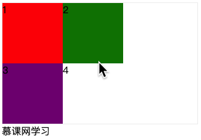

2.  创建内联级的 Gird 布局。

    ```html
    <div class="demo">
      <div class="item">1</div>
      <div class="item">2</div>
      <div class="item">3</div>
      <div class="item">4</div>
    </div>
    慕课网学习
    ```

    ```css
    .demo {
      display: inline-grid;
      grid-template-columns: 100px 100px;
      grid-template-rows: 100px 100px;
      border: 1px solid #eee;
    }
    .item:nth-of-type(1) {
      background: red;
    }
    .item:nth-of-type(2) {
      background: green;
    }
    .item:nth-of-type(3) {
      background: purple;
    }
    ```

    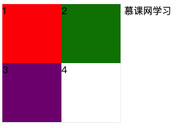

### 6. 小结

1. `Grid` 布局是二维布局原因就是项目所在的单元格是由行和列产生的。
2. 网格线的开始位置在容器的最顶端和最左边。
3. 使用区域命名之后会影响网格线的名称会变成 `区域名-star`、`区域名-end`
4. 可以把 `columns` 理解为高度，`rows` 理解为宽度这样便于理解。

## grid-template|auto/rows(行)|columns (列)

开始学习 `Grid` 要做的第一件事情就是划格子，本章主要给大家讲解如何画格子。掌握好这个掌握好这个技能是学习 `Grid` 布局的基础。

### 1. 官方定义

`grid-template-columns` 该属性是基于 网格列. 的维度，去定义网格线的名称和网格轨道的尺寸大小。<br/>
`grid-template-rows` 该属性是基于 网格行 的维度，去定义网格线的名称和网格轨道的尺寸大小。<br/>
repeat() 函数表示轨道列表的重复片段，允许以更紧凑的形式写入大量显示重复模式的列或行。<br/>
`auto-fill`和 `auto-fit` 属性规定如何填充列（是否进行协调）。<br/>
`fr` fr 单位被用于在一系列长度值中分配剩余空间，如果多个已指定了多个部分，则剩下的空间根据各自的数字按比例分配。<br/>
`minmax()` 定义了一个长宽范围的闭区间， 它与 CSS 网格布局一起使用。<br/>
`grid-auto-columns` 指定了隐式创建的网格纵向轨道（track）的宽度
`grid-auto-rows` 用于指定隐式创建的行轨道大小。<br/>

### 2. 慕课解释

`grid-template-columns` 网格的列的宽度，我们可以理解为项目的宽度，这样更容易学习。<br/>
`grid-template-rows` 网格行的高度，我们同样可以理解为项目的高度。<br/>
`grid-auto-columns` 超出定义的列后，多于没有定义的列宽。<br/>
`grid-auto-rows` 超出定义的行后，多于的行高。<br/>
`repeat(number,length)` 这是 Grid 布局中用到的函数它接受两个参数分别是 `number` 代表重复数量和 length 代表宽度或高度的值。它也可以代表重复的模式，例如 repeat(2, 100px 200px 300px)实际就是 100px 200px 300px 100px 200px 300px。<br/>
`auto-fill` 如同它字面的意思,自动规划多余空间内项目填充，这里要注意的是它和 `auto` 自适应宽度是不同的。<br/>
`fr` 代表倍数关系，它数字部分都是整数例如 1fr 2fr 后面是前面的两<br/>倍。
`minmax()` 代表一个长度范围例如 `minmax(10px, 100px)` 就是这个长度是 10px ~ 100px 之间。<br/>

### 3. 语法

```
grid-template-columns:none | px | % | em| rem | fr | auto| minmax(min,max) | auto| repeat;
grid-template-rows:none | px | % | em| rem | fr | auto| minmax(min,max) | auto| repeat;
grid-auto-columns:none | px | % | em| rem | fr | auto| minmax(min,max) | auto| ;
grid-auto-rows:none | px | % | em| rem | fr | auto| minmax(min,max) | auto| ;
```

说明：`grid-template-columns` 和 `grid-template-rows` 接受多个值，并且它们可以混合使用。`grid-auto-columns` 和 `grid-auto-rows` 接受 1 个值。

函数语法：

```css
grid-template-rows: repeat(2, 10px 1rem 1em, 1fr);
```

说明：`repeat`的意思是重复，上面的意思每 4 行的高度分别是 10px 1rem 1em,1fr 一共重复 2 次，共 8 行。

```css
grid-template-rows: 100px minmax(40px, 60px);
```

说明：`minmax` 的意思是取最大和最小，上面的意思是第 2 行的高度最小是 40px 最大是 60px.

### 4. 兼容性

| IE  | Edge | Firefox | Chrome | Safari | Opera | ios   | android |
| --- | ---- | ------- | ------ | ------ | ----- | ----- | ------- |
| No  | 16+  | 52+     | 57+    | 10.1+  | 44+   | 10.3+ | 81      |

### 5. 实例

1. `none` 不明确网格，列数和宽度行数和高度都由 `grid-auto-flow` 属性隐式指定。这样写他们将排成 1 列因为我们没有规定列宽。

   ```html
   <div class="demo">
     <div class="item">1</div>
     <div class="item">2</div>
     <div class="item">3</div>
     <div class="item">4</div>
   </div>
   ```

   ```css
   .demo {
     display: grid;
     grid-template-columns: none;
     grid-template-rows: none;
     grid-auto-columns: 100px;
     grid-auto-rows: 50px;
     color: #fff;
     text-align: center;
   }
   ```

   效果图

   

2. 设置一个左 `100px` 右侧自适应的左右布局。

   ```html
   <div class="demo">
     <div class="item">1</div>
     <div class="item">2</div>
   </div>
   ```

   ```css
   .demo {
     display: grid;
     grid-template-columns: 100px auto;
     color: #fff;
     text-align: center;
   }
   ```

   效果图
   

3. 设置一个左 `100px` 中自适应右侧 `100px` 的左中右布局。

   ```html
   <div class="demo">
     <div class="item">1</div>
     <div class="item">2</div>
     <div class="item">3</div>
   </div>
   ```

   ```css
   .demo {
     display: grid;
     grid-template-columns: 100px auto 100px;
     color: #fff;
     text-align: center;
   }
   ```

   效果图

   

4. 为上面的布局设置一个固定的行高。

   ```css
   .demo {
     display: grid;
     grid-template-columns: 100px auto 100px;
     grid-template-rows: 100px;
     color: #fff;
     text-align: center;
   }
   ```

   效果图

   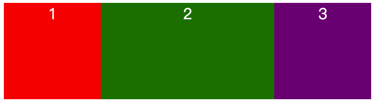

5. 修改上面的布局为两列，其中只设定一行高度

   ```css
   .demo {
     display: grid;
     grid-template-columns: 150px 150px;
     grid-template-rows: 100px;
     color: #fff;
     text-align: center;
   }
   ```

   效果图

   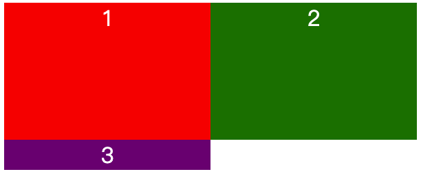

   说明：我们容器里面有 3 个项目 而只设定了第一行的高度因此，第 2 行的高度是文字撑开的高度。

6. 让每行的高度为 100px

   ```css
   .demo {
     display: grid;
     grid-template-columns: 150px 150px;
     grid-auto-rows: 100px;
     color: #fff;
     text-align: center;
   }
   ```

   效果图

   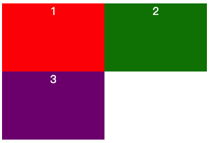

7. 使用 `minmax()` 让其第二列的宽度在 `100px` 到 `200px` 之间。

   ```css
   .demo {
     display: grid;
     grid-template-columns: 500px minmax(100px, 200px);
     grid-auto-rows: 100px;
     color: #fff;
     text-align: center;
   }
   ```

   效果图

   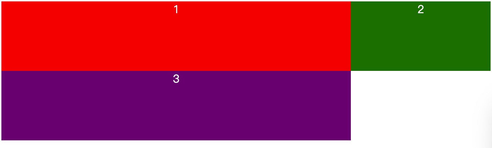

8. 使用 `fr` 把容器分为 3 等列。

   ```css
   .demo {
     display: grid;
     grid-template-columns: 1fr 1fr 1fr;
     grid-auto-rows: 100px;
     color: #fff;
     text-align: center;
   }
   ```

   效果图
   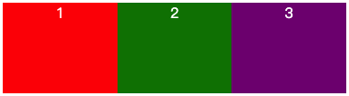

   也可以用小数。

   ```css
   .demo {
     display: grid;
     grid-template-columns: 1fr 1fr 0.5fr;
     grid-auto-rows: 100px;
     color: #fff;
     text-align: center;
   }
   ```

   效果图

   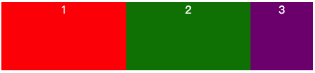

9. 使用 `repeat` 函数。

   ```css
   .demo {
     display: grid;
     grid-template-columns: repeat(3, 100px);
     grid-auto-rows: 100px;
     color: #fff;
     text-align: center;
   }
   ```

   效果图
   

10. `auto-fill` 自动填充规划剩余空间的项目

    ```css
    .demo {
      display: grid;
      grid-template-columns: repeat(auto-fill, 100px);
      grid-auto-rows: 100px;
      color: #fff;
      text-align: center;
    }
    ```

    效果图

    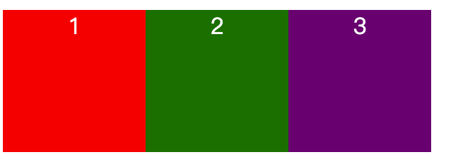

11. `auto-fit` 自动规划多余空间。

    ```css
    .demo {
      display: grid;
      grid-template-columns: repeat(auto-fit, 100px);
      grid-auto-rows: 100px;
      color: #fff;
      text-align: center;
    }
    ```

    效果图
    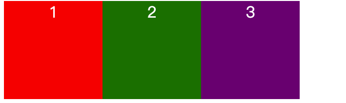

### 6. 小结

1. `auto-fill` 和 `auto-fit` 虽然都是自动画出布局，但是还是有一定区别：

   假如一个容器内有 3 个项目 这时候有多余的空间可以去填 4 个项目，auto-fill 会在剩余空间画一个空的项目位置，而 auto-fit 则不会。

2. `fr` 可以和其它的数值混用，例如：
   ```css
   .demo {
     grid-template-columns: 1fr 1fr 20px 1rem;
   }
   ```
3. `minmax()` 中的值也可以使用 `fr`，例如：

   ```css
   .demo {
     grid-template-columns: minmax(1fr, 2fr);
   }
   ```

   它们的规则是一个范围，左边是最小值，右侧是最大值。

4. `repeat()` 函数用来设定 `Grid` 重复的轨道，内部同样可以嵌套多个值，例如：

   `repeat()` 和 `minmax()` 一起使用：

   ```css
   .demo {
     grid-template-columns: repeat(3, minmax(10px, 20px) 10px 30px);
   }
   ```
