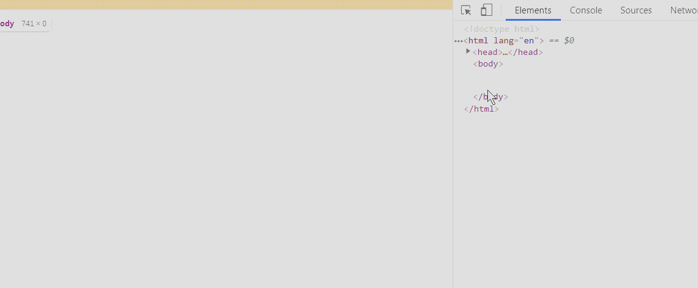
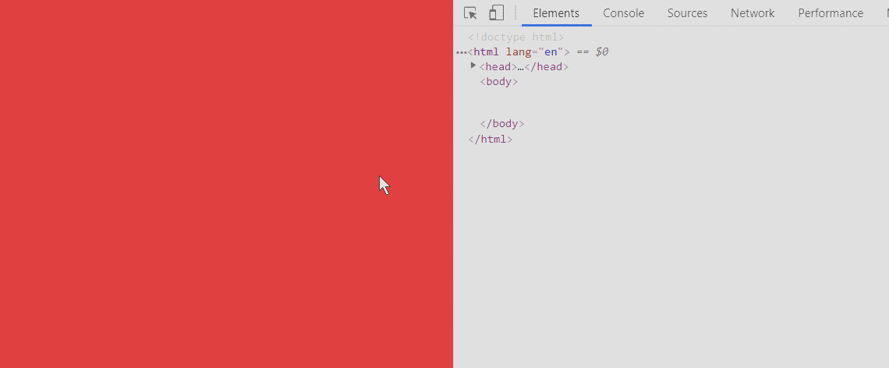
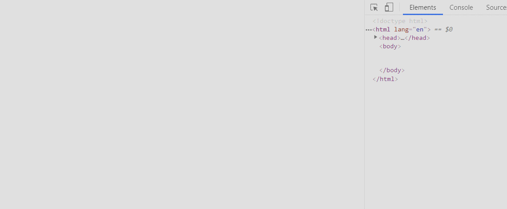

## @media 媒体查询

这个属性通常是用在不同屏幕下可以设置不同的样式，它多用在响应式页面中。

### 1. 官方定义

`@media` 可以针对不同的屏幕尺寸设置不同的样式，特别是如果你需要设置设计响应式的页面，`@media` 是非常有用的。

### 2. 慕课解释

`@media` 通常被人们称为媒体查询，其实就是响应式，它通过设定后面的参数来实现在不同的浏览器可视尺寸下的展示效果。

它不仅仅可以用来设置 `CSS` 样式，也可以设置 `HTML` 页面中 `link` 的引用。

### 3. 语法

在开始使用 `@media` 标签前，首先需要在 `.html` 文件中设置：

```html
<meta
  name="viewport"
  content="width=device-width, initial-scale=1.0, maximum-scale=1.0, user-scalable=no"
/>
```

这段代码主要是用来兼容移动设备的展示效果。

我们简单的对这几个参数进行一下解释：

| 参数名                 | 含义                                       |
| ---------------------- | ------------------------------------------ |
| `width = device-width` | 宽度等于当前设备的宽度                     |
| `initial-scale`        | 初始的缩放比例（默认设置为 1.0）           |
| `minimum-scale`        | 允许用户缩放到的最小比例（默认设置为 1.0） |
| `maximum-scale`        | 允许用户缩放到的最大比例（默认设置为 1.0） |
| `user-scalable`        | 用户是否可以手动缩放（默认设置为 no）      |

说明：我们设置时候通常规则如下：

```html
<meta
  content="width=device-width, initial-scale=1.0, maximum-scale=1.0, user-scalable=0, viewport-fit=cover，user-scalable=no"
  name="viewport"
/>
```

意思是缩放比例为 1，最大缩放比例为 1 不可以手动缩放。里面的 `viewport-fit` 是指浏览器视图填充方式是否全屏。

#### @media 标签

下面我们就来看一下`@media` 标签的使用方法，先看一下语法

```css
@media mediatype and|not|only (media feature) {
    CSS Code...
}
```

说明： `@media` 不同于其它的 `CSS3` 属性，它是一个标签，后面跟了一个名称，和一个大括号，这和我们 `JavaScript` 函数很像，大家也可以这么理解。

`mediatype` 用来描述当前浏览器所在设备的类型，比如是计算机显示器、手机、电视等等。

`mediatype` 有一个表：

| 媒体类型   | 兼容性              | 说明                                             |
| ---------- | ------------------- | ------------------------------------------------ |
| all        | 所有浏览器          | 用于所有媒体设备类型                             |
| aural      | Opera               | 用于语音和音乐合成器                             |
| braille    | Opera               | 用于触觉反馈设备                                 |
| handheld   | Chrome,Safari,Opera | 用于小型或手持设备                               |
| print      | 所有浏览器          | 用于打印机                                       |
| projection | Opera               | 用于投影图像，如幻灯片                           |
| screen     | 所有浏览器          | 用于计算机显示器                                 |
| tty        | Opera               | 用于使用固定间距字符格的设备。如电传打字机和终端 |
| tv         | Opera               | 用于电视类设备                                   |
| embossed   | Opera               | 用于凸点字符（盲文）印刷设备                     |

说明：我们常用的媒体类型通常设置为 `screen`。代码如下

```css
@media screen and (max-width: 500px) {
}
```

上面就是所有浏览器中适用我们 and 之后的规则。

#### 关键字

关键字就是用来描述响应条件的描述，具体作用如下：

- `and` 就是和某种定制的屏幕宽度下；
- `not` 关键字是用来排除某种指定的媒体类型；
- `only` 用来定某种特定的媒体类型。

#### media feature

括号内的它就是用来指定分辨率的。写法如下：

```css
@media only screen and (max-width: 500px) {
}
```

它的意思就是当浏览器的可视区域小于 500px 时候使用 {} 内的规则，具体规则如下：

| 值                      | 描述                                                                             |
| ----------------------- | -------------------------------------------------------------------------------- |
| aspect-ratio            | 定义输出设备中的页面可见区域宽度与高度的比率。                                   |
| color                   | 定义输出设备每一组彩色原件的个数。如果不是彩色设备，则值等于 0。                 |
| color-index             | 定义在输出设备的彩色查询表中的条目数。如果没有使用彩色查询表，则值等于 0。       |
| device-aspect-ratio     | 定义输出设备的屏幕可见宽度与高度的比率。                                         |
| device-height           | 定义输出设备的屏幕可见高度。                                                     |
| device-width            | 定义输出设备的屏幕可见宽度。                                                     |
| grid                    | 用来查询输出设备是否使用栅格或点阵。                                             |
| height                  | 定义输出设备中的页面可见区域高度。                                               |
| max-aspect-ratio        | 定义输出设备的屏幕可见宽度与高度的最大比率。                                     |
| max-color               | 定义输出设备每一组彩色原件的最大个数。                                           |
| max-color-index         | 定义在输出设备的彩色查询表中的最大条目数。                                       |
| max-device-aspect-ratio | 定义输出设备的屏幕可见宽度与高度的最大比率。                                     |
| max-device-height       | 定义输出设备的屏幕可见的最大高度。                                               |
| max-device-width        | 定义输出设备的屏幕最大可见宽度。                                                 |
| max-height              | 定义输出设备中的页面最大可见区域高度。                                           |
| max-monochrome          | 定义在一个单色框架缓冲区中每像素包含的最大单色原件个数。                         |
| max-resolution          | 定义设备的最大分辨率。                                                           |
| max-width               | 定义输出设备中的页面最大可见区域宽度。                                           |
| min-aspect-ratio        | 定义输出设备中的页面可见区域宽度与高度的最小比率。                               |
| min-color               | 定义输出设备每一组彩色原件的最小个数。                                           |
| min-color-index         | 定义在输出设备的彩色查询表中的最小条目数。                                       |
| min-device-aspect-ratio | 定义输出设备的屏幕可见宽度与高度的最小比率。                                     |
| min-device-width        | 定义输出设备的屏幕最小可见宽度。                                                 |
| min-device-height       | 定义输出设备的屏幕的最小可见高度。                                               |
| min-height              | 定义输出设备中的页面最小可见区域高度。                                           |
| min-monochrome          | 定义在一个单色框架缓冲区中每像素包含的最小单色原件个数                           |
| min-resolution          | 定义设备的最小分辨率。                                                           |
| min-width               | 定义输出设备中的页面最小可见区域宽度。                                           |
| monochrome              | 定义在一个单色框架缓冲区中每像素包含的单色原件个数。如果不是单色设备，则值等于 0 |
| orientation             | 定义输出设备中的页面可见区域高度是否大于或等于宽度。                             |
| resolution              | 定义设备的分辨率。如：96dpi, 300dpi, 118dpcm                                     |
| scan                    | 定义电视类设备的扫描工序。                                                       |
| width                   | 定义输出设备中的页面可见区域宽度。                                               |

经验介绍：我们在设置媒体响应的条件时候，通常使用的是 `max-width`、`min-width`、`max-height`、`min-height`，这里面有一个比较绕人的地方：

- `min` 代表最小也就是说满足我们设置条件的最小值是多少，比它大的都会满足。
- `max` 则代表的是最大值，比它小的都会满足。

### 4. 兼容性

| IE  | Edge | Firefox | Chrome | Safari | Opera | ios | android |
| --- | ---- | ------- | ------ | ------ | ----- | --- | ------- |
| 9+  | 12+  | 3.5     | 21     | 4.0 9  | 7+    | 4.4 |

### 5. 实例

1. 当浏览器宽度小于 `400px` 时候背景色设红色，大于 `400px` 时候背景色设白色。

   ```css
   @media screen and (max-width: 400px) {
     html,
     body {
       background: red;
     }
   }
   ```

   效果图：

   

2. 使用 `only` 当浏览器宽度小于 `600px` 时候背景色设红色，大于 `600px` 时候背景色设白色。

   ```css
   @media only screen and (max-width: 600px) {
     html,
     body {
       background: red;
     }
   }
   ```

   效果图：

   

3. 使用多个 `and` 来设置屏幕背景色。

   ```css
   @media only screen and (min-width: 600px) and (max-width: 800px) {
     html,
     body {
       background: red;
     }
   }
   ```

   

   说明：这段代码的意思是当浏览器可视区域大于 `600px` 小于 `800px` 背景色为红色。

### 6. 小结

在工作中媒体查询不只是用来限定 `css` 文件中使用哪组样式，也可以直接作用在 `link` 标签上，让页面直接选择什么样的 `css` 文件。

例如：

```html
<link
  rel="stylesheet"
  type="text/css"
  media="screen and (orientation:portrait)"
  href="style.css"
/>
```

说明：`@media` 变成了标签属性 `media` ,上面的意思就是用来区分移动设备是横向还是纵向的。
