## only-child & only-of-type

在前端开发页面的过程中需要对一些特定类型的元素赋予特殊的样式，通常我们不会在 `HTML` 标签上一个个去增加 `class` 去设置特殊的样式，这时候通过元素选择伪类就能解决这类问题。本章主要介绍`only-child` 和 `only-of-type` 这两个伪类。

### 1. 官方定义

1. `only-child` 匹配属于父元素中唯一子元素。
2. `only-of-type` 匹配属于父元素的特定类型的唯一子元素。

### 2. 慕课解释

`only-child` 当元素添加这个伪类的时候，它在所属的父元素之内，有且仅有它自己时伪类生效。

### 3. 语法

```css
.demo:only-child {
}
.demo:only-of-type {
}
```

说明：通过 `:` 后面加伪类进行元素选择。

### 4. 兼容性

| IE  | Edge | Firefox | Chrome | Safari | Opera | ios | android |
| --- | ---- | ------- | ------ | ------ | ----- | --- | ------- |
| all | all  | all     | all    | all    | all   | all | all     |

### 5. 实例

#### only-child

1.  当页面中只有一个.demo 标签时候背景变成红色：

    ```html
    <body>
      <div class="demo">慕课网</div>
    </body>
    ```

    ```css
    .demo:only-child {
      color: #fff;
      background: red;
      padding: 10px;
    }
    ```

    效果图：

    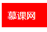

2.  当页面有两个 `demo class` 时候不再有任何效果：

    ```html
    <body>
      <div class="demo">慕课网</div>
      <div class="demo">慕课网</div>
    </body>
    ```

    ```css
    .demo:only-child {
      color: #fff;
      background: red;
      padding: 10px;
    }
    ```

    效果图：

    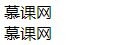

    说明：`body` 下面有两个 `demo` 不是唯一子元素，这时候伪类就不再起作用。

    注意：当 `demo` 元素内部包含 `demo` 元素还是起作用的，因为 `body` 下面的子元素只有 1 个。

    ```html
    <body>
      <div class="demo">
        慕课网
        <div class="demo">慕课网</div>
        <div class="demo">慕课网</div>
      </div>
    </body>
    ```

    效果图：

    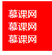

    如果我们希望在 `demo` 内部只有一个 `demo` 时候 ，内部的 `demo` 变成红色怎么做呢？

    ```html
    <div class="demo">
      慕课网
      <div class="demo">慕课网</div>
    </div>
    ```

    ```css
    .demo > .demo:only-child {
      color: #fff;
      background: red;
      padding: 10px;
    }
    ```

    效果图：

    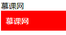

#### only-of-type

1. 给类名为 demo 的元素增加红色背景

   ```html
   <body>
     <div class="demo">慕课网</div>
   </body>
   ```

   ```css
   .demo:only-of-type {
     color: #fff;
     background: red;
     padding: 10px;
   }
   ```

   效果图：

   

   说明：这里发现它和 `only-child` 的功能类似，但其实是不一样的我们看下面这个例子：

   ```html
   <body>
     <div class="demo">慕课网</div>
     <p class="demo">慕课网</p>
   </body>
   ```

   ```css
   .demo:only-of-type {
     color: #fff;
     background: red;
     padding: 10px;
   }
   ```

   效果图：

   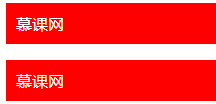

   解释：我们发现同样都变红了。这是因为 两个 `demo` 并不是唯一的。因为其中一个是 `div` 而另一个是 `p`，这时候 `only-child` 是不能分辨的，这也是它们的区别。

### 6. Tips

这两个伪类功能很类似，我们不容易区分但是这里有个小技巧 :`only-child` 就像 `JS` 中的 `id` 一样，只能是唯一的。

## before && after

这两个伪类元素功能很相似，都是在元素内部插入新的内容。下面一起看下他们的区别和用法。

### 1. 官方定义

**before**：元素的内容之前插入新内容。<br/>
**after**：元素的内容之后插入新内容。

### 2. 慕课解释

`before` 和 `after` 的功能就是在元素的内部的原有内容之前，或者之后插入新的内容。

### 3. 语法

```css
.demo:before {
}
.demo:after {
}
```

解释：使用方法如上面，通过在元素选择器后面增加一个 : 来开始伪类的使用。

### 4. 兼容性

| IE  | Edge | Firefox | Chrome | Safari | Opera | ios | android |
| --- | ---- | ------- | ------ | ------ | ----- | --- | ------- |
| all | all  | all     | all    | all    | all   | all | all     |

### 5. 实例

```html
<div class="demo">慕课网</div>
```

1. 在元素内容之前插入文字：姓名。

   ```css
   .demo:before {
     content: '姓名：';
   }
   ```

   效果图：

   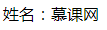

2. 在元素内容之后插入：很好。

   ```css
   .demo:after {
     content: '很好';
   }
   ```

   效果图：

   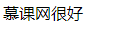

### 6. 经验分享

这两个伪类当然不是仅仅插入内容这么简单，它还有其他的妙用。

1. 使用伪类 `after` 清除元素内部浮动效果：

   ```html
   <div class="demo">
     <div class="item">慕</div>
     <div class="item">课</div>
   </div>
   <div class="">网</div>
   ```

   ```css
   .demo:after {
     content: '';
     display: block;
     clear: both;
   }
   .item {
     float: left;
   }
   ```

   效果图：

   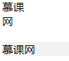

   说明：下面灰色部分是没有清除浮动的效果，上面是清除浮动的效果。因为清除了浮动所以 “网” 这个字换行了。

2. 在元素内容开始前插入图片

   ```html
   <div class="demo">慕课网</div>
   ```

   ```css
   .demo:before {
     content: '';
     display: inline-block;
     width: 12px;
     height: 12px;
     font-size: 12px;
     line-height: 12px;
     background: url(//img.mukewang.com/wiki/5eea2f6809a8d35e00400040.jpg)
       center no-repeat;
     background-size: cover;
   }
   ```

   效果图

   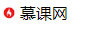

### 7. 小结

1. 注意：对于 IE8 及更早版本中的`:before`、`:after`，必须声明 <!DOCTYPE>。
2. 在元素选择器后面这样写也可以：

   ```css
   .demo::before {
   }
   .demo::after {
   }
   ```

## nth 元素选择

当我们要一组 `class` 同名，或者连续的一组元素的其中一个，或者某种规律的元素添加单独样式的时候，不妨看看这类的元素选择器

### 1. 官方定义

- `nth-child(n)` 选择器匹配属于其父元素的第 N 个子元素；
- `nth-last-child(n)` 选择器匹配属于其元素的第 N 个子元素的每个元素，从最后一个子元素开始计数；
- `nth-of-type(n)` 选择器匹配属于父元素的特定类型的第 N 个子元素的每个元素。

### 2. 慕课解释

`nth-child(n)`、 `nth-last-child(n)` 、`nth-of-type(n)` 都是用来匹配父元素内部子元素的。不过也有些区别：

- `nth-child` 按照个数来算；
- `nth-of-type` 按照类型来计算；
- `nth-last-child(n)` 从最后一个子元素往前开始计算。

### 3. 语法

```css
.item:nth-child(2n + 1) {
}
.item:nth-of-type(n) {
}
.item:nth-last-child(2n) {
}

/* n 从 0 开始计数的正整数。 */
```

### 4. 兼容性

| IE  | Edge | Firefox | Chrome | Safari | Opera | ios | android |
| --- | ---- | ------- | ------ | ------ | ----- | --- | ------- |
| all | all  | all     | all    | all    | all   | all | all     |

### 5. 实例

```html
<div class="demo">
  <div class="item">1</div>
  <div class="item">2</div>
  <div class="item">3</div>
  <div class="item">4</div>
</div>
```

选择 `demo` 内第 3 个子元素背景为红色。

1. 使用 nth-child

   ```css
   .item {
     width: 100px;
     height: 100px;
     text-align: center;
     line-height: 100px;
     border: 1px solid #ccc;
     background: #f2f2f2;
   }
   .item:nth-child(3) {
     background: red;
   }
   ```

   效果图：

   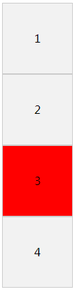

2. 使用 `nth-last-child`。

   ```css
   .item {
     width: 100px;
     height: 100px;
     text-align: center;
     line-height: 100px;
     border: 1px solid #ccc;
     background: #f2f2f2;
   }
   .item:nth-last-child(2) {
     background: red;
   }
   ```

   效果图：

   

3. 使用 nth-of-type

   ```css
   .item {
     width: 100px;
     height: 100px;
     text-align: center;
     line-height: 100px;
     border: 1px solid #ccc;
     background: #f2f2f2;
   }
   .item:nth-of-type(3) {
     background: red;
   }
   ```

   效果图：

   

### 6. 经验分享

1. 在实例中我们看到 `nth-of-type` 和 `nth-child` 同样都使用的是 （3）， 那么它们的不同是什么呢？下面这个例子我们一起看下：

   ```html
   <div class="demo">
     <p class="item">我是 p 标签</p>
     <div class="item">1</div>
     <div class="item">2</div>
     <div class="item">3</div>
     <div class="item">4</div>
   </div>
   <div class="demo">
     <p class="item-2">我是 p 标签</p>
     <div class="item-2">1</div>
     <div class="item-2">2</div>
     <div class="item-2">3</div>
     <div class="item-2">4</div>
   </div>
   ```

   ```css
   .demo {
     float: left;
   }
   .item,
   .item-2 {
     width: 100px;
     height: 100px;
     text-align: center;
     line-height: 100px;
     border: 1px solid #ccc;
     background: #f2f2f2;
   }
   .item:nth-of-type(3) {
     background: red;
   }
   .item-2:nth-child(3) {
     background: red;
   }
   ```

   效果图

   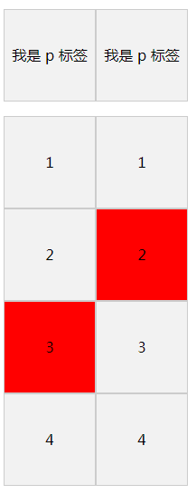

   通过效果图我们就清楚的明白他们的差异了。


    下面是让所有偶数的背景变红。

    ```css
    .item {
      width: 100px;
      height: 100px;
      text-align: center;
      line-height: 100px;
      border: 1px solid #ccc;
      background: #f2f2f2;
    }
    .item:nth-of-type(2n) {
      background: red;
    }
    ```
    效果图：

    

2. 使用 `nth-of-type(3n+1)` 起作用，而 `nth-of-type(1+3n)` 不起作用，所以 n 一定要放在最前面。