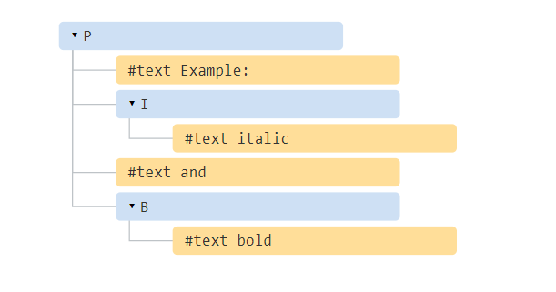

<!-- TOC -->

- [1. DOM 变动观察器（Mutation observer）](#1-dom-变动观察器mutation-observer)
  - [1.1. 语法](#11-语法)
  - [1.2. 用于集成](#12-用于集成)
  - [1.3. 用于架构](#13-用于架构)
    - [1.3.1. 动态高亮显示示例](#131-动态高亮显示示例)
  - [1.4. 其他方法](#14-其他方法)
  - [1.5. 总结](#15-总结)
- [2. 选择（Selection）和范围（Range）](#2-选择selection和范围range)
  - [2.1. 范围](#21-范围)
    - [2.1.1. 选择文本节点的一部分](#211-选择文本节点的一部分)
  - [2.2. Range 方法](#22-range-方法)
  - [2.3. 选择](#23-选择)
  - [2.4. 选择属性](#24-选择属性)
  - [2.5. 选择事件](#25-选择事件)
    - [2.5.1. 选择跟踪演示](#251-选择跟踪演示)
    - [2.5.2. 选择获取演示](#252-选择获取演示)
  - [2.6. 选择方法](#26-选择方法)
  - [2.7. 表单控件中的选择](#27-表单控件中的选择)
    - [2.7.1. 示例：跟踪选择](#271-示例跟踪选择)
    - [2.7.2. 示例：移动光标](#272-示例移动光标)
    - [2.7.3. 示例：修改选择](#273-示例修改选择)
    - [2.7.4. 示例：在光标处插入](#274-示例在光标处插入)
  - [2.8. 使不可选](#28-使不可选)
  - [2.9. 参考](#29-参考)
  - [2.10. 总结](#210-总结)
- [3. 事件循环：微任务和宏任务](#3-事件循环微任务和宏任务)
  - [3.1. 事件循环](#31-事件循环)
  - [3.2. 用例 1：拆分 CPU 过载任务](#32-用例-1拆分-cpu-过载任务)
  - [3.3. 用例 2：进度指示](#33-用例-2进度指示)
  - [3.4. 用例 3：在事件之后做一些事情](#34-用例-3在事件之后做一些事情)
  - [3.5. 宏任务和微任务](#35-宏任务和微任务)
  - [3.6. 总结](#36-总结)

<!-- /TOC -->

# 1. DOM 变动观察器（Mutation observer）

`MutationObserver` 是一个内建对象，它观察 DOM 元素，在其发生更改时触发回调。

我们将首先看一下语法，然后探究一个实际的用例，以了解它在什么地方有用。

## 1.1. 语法

`MutationObserver` 使用简单。

首先，我们创建一个带有回调函数的观察器

```js
let observer = new MutationObserver(callback);
```

然后将其附加到一个 DOM 节点：

```js
observer.observe(node, config);
```

`config` 是一个具有布尔选项的对象，该布尔选项表示“将对哪些更改做出反应”：

- `childList` —— node 的直接子节点的更改，
- `subtree` —— node 的所有后代的更改，
- `attributes` —— node 的特性（attribute），
- `attributeFilter` —— 特性名称数组，只观察选定的特性。
- `characterData` —— 是否观察 node.data（文本内容），

其他几个选项：

- `attributeOldValue` —— 如果为 true，则将特性的旧值和新值都传递给回调（参见下文），否则只传新值（需要 attributes 选项），
- `characterDataOldValue` —— 如果为 true，则将 node.data 的旧值和新值都传递给回调（参见下文），否则只传新值（需要 characterData 选项）。

然后，在发生任何更改后，将执行“回调”：更改被作为一个 [MutationRecord](https://dom.spec.whatwg.org/#mutationrecord) 对象列表传入第一个参数，而观察器自身作为第二个参数。

MutationRecord 对象具有以下属性：

- `type` —— 变动类型，以下类型之一：
  - `"attributes"`：特性被修改了，
  - `"characterData"`：数据被修改了，用于文本节点，
  - `"childList"`：添加/删除了子元素。
- `target` —— 更改发生在何处：`"attributes"` 所在的元素，或 `"characterData"` 所在的文本节点，或 `"childList"` 变动所在的元素，
- `addedNodes/removedNodes` —— 添加/删除的节点，
- `previousSibling/nextSibling` —— 添加/删除的节点的上一个/下一个兄弟节点，
- `attributeName/attributeNamespace` —— 被更改的特性的名称/命名空间（用于 XML），
- `oldValue` —— 之前的值，仅适用于特性或文本更改，如果设置了相应选项 `attributeOldValue/characterDataOldValue`。

例如，这里有一个 `<div>`，它具有 `contentEditable` 特性。该特性使我们可以聚焦和编辑元素。

```html
<div contenteditable id="elem">Click and <b>edit</b>, please</div>

<script>
  let observer = new MutationObserver((mutationRecords) => {
    console.log(mutationRecords); // console.log(the changes)
  });

  // 观察除了特性之外的所有变动
  observer.observe(elem, {
    childList: true, // 观察直接子节点
    subtree: true, // 及其更低的后代节点
    characterDataOldValue: true, // 将旧的数据传递给回调
  });
</script>
```

如果我们在浏览器中运行上面这段代码，并聚焦到给定的 `<div>` 上，然后更改 `<b>edit</b>` 中的文本，console.log 将显示一个变动：

```js
mutationRecords = [{
  type: "characterData",
  oldValue: "edit",
  target: <text node>,
  // 其他属性为空
}];
```

如果我们进行更复杂的编辑操作，例如删除 `<b>edit</b>`，那么变动事件可能会包含多个变动记录：

```js
mutationRecords = [{
  type: "childList",
  target: <div#elem>,
  removedNodes: [<b>],
  nextSibling: <text node>,
  previousSibling: <text node>
  // 其他属性为空
}, {
  type: "characterData"
  target: <text node>
  // ...变动的详细信息取决于浏览器如何处理此类删除
  // 它可能是将两个相邻的文本节点 "edit " 和 ", please" 合并成一个节点，
  // 或者可能将它们留在单独的文本节点中
}];
```

因此，`MutationObserver` 允许对 DOM 子树中的任何更改作出反应。

## 1.2. 用于集成

在什么时候可能有用？

想象一下，你需要添加一个第三方脚本，该脚本不仅包含有用的功能，还会执行一些我们不想要的操作，例如显示广告 `<div class="ads">Unwanted ads</div>`。

当然，第三方脚本没有提供删除它的机制。

使用 `MutationObserver`，我们可以监测到我们不需要的元素何时出现在我们的 DOM 中，并将其删除。

还有一些其他情况，例如第三方脚本会将某些内容添加到我们的文档中，并且我们希望检测出这种情况何时发生，以调整页面，动态调整某些内容的大小等。

`MutationObserver` 使我们能够实现这种需求。

## 1.3. 用于架构

从架构的角度来看，在某些情况下，`MutationObserver` 有不错的作用。

假设我们正在建立一个有关编程的网站。自然地，文章和其他材料中可能包含源代码段。

在 HTML 标记（markup）中的此类片段如下所示：

```js
...
<pre class="language-javascript"><code>
  // 这里是代码
  let hello = "world";
</code></pre>
...
```

另外，我们还将在网站上使用 JavaScript 高亮显示库，例如 [Prism.js](https://prismjs.com/)。调用 `Prism.highlightElem(pre)` 会检查此类 pre 元素的内容，并在其中添加特殊标签（tag）和样式，以进行彩色语法高亮显示，类似于你在本文的示例中看到的那样。

那什么时候运行该高亮显示方法呢？我们可以在`DOMContentLoaded` 事件中或者在页面尾部运行。到那时，我们的 DOM 已准备就绪，我们可以搜索元素 `pre[class*="language"]` 并对其调用 `Prism.highlightElem`：

```js
// 高亮显示页面上的所有代码段
document
  .querySelectorAll('pre[class*="language"]')
  .forEach(Prism.highlightElem);
```

到目前为止，一切都很简单，对吧？HTML 中有 `<pre>` 代码段，我们高亮显示它们。

现在让我们继续。假设我们要从服务器动态获取资料。我们将 在本教程的后续章节 中学习进行此操作的方法。目前，只需要关心我们从网络服务器获取 HTML 文章并按需显示：

```js
let article = /* 从服务器获取新内容 */ (articleElem.innerHTML = article);
```

新的 `article HTML` 可能包含代码段。我们需要对其调用 `Prism.highlightElem`，否则它们将不会被高亮显示。

**对于动态加载的文章，应该在何处何时调用`Prism.highlightElem`？**

我们可以将该调用附加到加载文章的代码中，如下所示：

```js
let article = /* 从服务器获取新内容 */ (articleElem.innerHTML = article);

let snippets = articleElem.querySelectorAll('pre[class*="language-"]');
snippets.forEach(Prism.highlightElem);
```

……但是，想象一下，代码中有很多地方可以加载内容：文章，测验，论坛帖子。我们是否需要在每个地方都附加一个高亮显示调用？那不太方便，也很容易忘记。

并且，如果内容是由第三方模块加载的，该怎么办？例如，我们有一个由其他人编写的论坛，该论坛可以动态加载内容，并且我们想为其添加语法高亮显示。没有人喜欢修补第三方脚本。

幸运的是，还有另一种选择。

我们可以使用 MutationObserver 来自动检测何时在页面中插入了代码段，并高亮显示之它们。

因此，我们在一个地方处理高亮显示功能，从而使我们无需集成它。

### 1.3.1. 动态高亮显示示例

这是一个工作示例。

如果你运行这段代码，它将开始观察下面的元素，并高亮显示现在此处的所有代码段：

```js
let observer = new MutationObserver((mutations) => {
  for (let mutation of mutations) {
    // 检查新节点，有什么需要高亮显示的吗？

    for (let node of mutation.addedNodes) {
      // 我们只跟踪元素，跳过其他节点（例如文本节点）
      if (!(node instanceof HTMLElement)) continue;

      // 检查插入的元素是否为代码段
      if (node.matches('pre[class*="language-"]')) {
        Prism.highlightElement(node);
      }

      // 或者可能在子树的某个地方有一个代码段？
      for (let elem of node.querySelectorAll('pre[class*="language-"]')) {
        Prism.highlightElement(elem);
      }
    }
  }
});

let demoElem = document.getElementById("highlight-demo");

observer.observe(demoElem, { childList: true, subtree: true });
```

下面有一个 HTML 元素，以及使用 innerHTML 动态填充它的 JavaScript。

请先运行前面那段代码（上面那段，观察元素），然后运行下面这段代码。你将看到 MutationObserver 是如何检测并高亮显示代码段的。

一个具有 `id="highlight-demo"` 的示例元素，运行上面那段代码来观察它。

下面这段代码填充了其 innerHTML，这导致 MutationObserver 作出反应，并突出显示其内容：

```js
let demoElem = document.getElementById("highlight-demo");

// 动态插入带有代码段的内容
demoElem.innerHTML = `下面是一个代码段：
  <pre class="language-javascript"><code> let hello = "world!"; </code></pre>
  <div>另一个代码段：</div>
  <div>
    <pre class="language-css"><code>.class { margin: 5px; } </code></pre>
  </div>
`;
```

现在我们有了 MutationObserver，它可以跟踪观察到的元素中的，或者整个 document 中的所有高亮显示。我们可以在 HTML 中添加/删除代码段，而无需考虑高亮问题。

## 1.4. 其他方法

有一个方法可以停止观察节点：

- `observer.disconnect()` —— 停止观察。

当我们停止观察时，观察器可能尚未处理某些更改。

- `observer.takeRecords()` —— 获取尚未处理的变动记录列表，表中记录的是已经发生，但回调暂未处理的变动。

这些方法可以一起使用，如下所示：\

```js
// 我们想要停止跟踪变动
observer.disconnect();

// 处理未处理的变动
let mutationRecords = observer.takeRecords();
...
```

> :information_source: 垃圾回收

观察器在内部对节点使用弱引用。也就是说：如果一个节点被从 DOM 中删除了，并且该节点变得不可访问，那么它就会被垃圾回收。

观察到 DOM 节点这一事实并不能阻止垃圾回收。

## 1.5. 总结

`MutationObserver` 可以对 DOM 的变化作出反应：特性（attribute），添加/删除的元素，文本内容。

我们可以用它来跟踪代码其他部分引入的更改，以及与第三方脚本集成。

`MutationObserver` 可以跟踪任何更改。`config` “要观察的内容”选项用于优化，避免不必要的回调调用以节省资源。

# 2. 选择（Selection）和范围（Range）

在本章中，我们将介绍文档中的选择以及在表单字段（如 `<input>`）中的选择。

JavaScript 可以获取现有选择，选择/取消全部或部分选择，从文档中删除所选部分，将其包装到一个标签（tag）中，等。

你可以在本文最后的“总结”部分中找到使用方法。但是，如果你阅读整篇内容，将会有更多收获。底层的（underlying）Range 和 Selection 对象很容易掌握，因此，你不需要任何诀窍便可以使用它们做你想要做的事儿。

## 2.1. 范围

选择的基本概念是 [Range](https://dom.spec.whatwg.org/#ranges)：本质上是一对“边界点”：范围起点和范围终点。

每个点都被表示为一个带有相对于起点的相对偏移（offset）的父 DOM 节点。如果父节点是元素节点，则偏移量是子节点的编号，对于文本节点，则是文本中的位置。下面举例说明。

让我们选择一些东西。

首先，我们可以创建一个范围（构造器没有参数）：

```js
let range = new Range();
```

然后，我们可以使用 range.setStart(node, offset) 和 range.setEnd(node, offset) 来设置选择边界。

例如，考虑以下 HTML 片段：

```html
<p id="p">Example: <i>italic</i> and <b>bold</b></p>
```

这是其 DOM 结构，请注意，这里的文本节点对我们很重要：



让我们来选择 "`Example: <i>italic</i>`"。它是 `<p>` 的前两个子节点（文本节点也算在内）：


```html
<p id="p">Example: <i>italic</i> and <b>bold</b></p>

<script>
  let range = new Range();

  range.setStart(p, 0);
  range.setEnd(p, 2);

  // 范围的 toString 以文本形式返回其内容（不带标签）
  alert(range); // Example: italic

  // 将此范围应用于文档选择（后文有解释）
  document.getSelection().addRange(range);
</script>
```

- `range.setStart(p, 0)` —— 将起点设置为 `<p>` 的第 0 个子节点（即文本节点 "Example: "）。
- `range.setEnd(p, 2)` —— 覆盖范围至（但不包括）`<p>` 的第 2 个子节点（即文本节点 " and "，但由于不包括末节点，所以最后选择的节点是 `<i>`）。

这是一个更灵活的测试台，你可以在其中尝试更多不同的情况：

```js
<p id="p">Example: <i>italic</i> and <b>bold</b></p>

From <input id="start" type="number" value=1> – To <input id="end" type="number" value=4>
<button id="button">Click to select</button>
<script>
  button.onclick = () => {
    let range = new Range();

    range.setStart(p, start.value);
    range.setEnd(p, end.value);

    // 应用选择，后文有解释
    document.getSelection().removeAllRanges();
    document.getSelection().addRange(range);
  };
</script>
```

例如，从 1 到 4 选择得到的范围为 `<i>italic</i>` and `<b>bold</b>`。


我们不必在 `setStart` 和 `setEnd` 中使用相同的节点。一个范围可能跨越许多不相关的节点。唯一要注意的是终点要在起点之后。

### 2.1.1. 选择文本节点的一部分

让我们选择部分文本，像这样：


这也是可以做到的，我们只需要将起点和终点设置为文本节点中的相对偏移量即可。

我们需要创建一个范围，它：

- 从 `<p>` 的第一个子节点的位置 2 开始（选择 "Ex**ample**: " 中除前两个字母外的所有字母）
- 到 `<b>` 的第一个子节点的位置 3 结束（选择 “**bol**d” 的前三个字母，就这些）：

```html
<p id="p">Example: <i>italic</i> and <b>bold</b></p>

<script>
  let range = new Range();

  range.setStart(p.firstChild, 2);
  range.setEnd(p.querySelector("b").firstChild, 3);

  alert(range); // ample: italic and bol

  // 使用此范围进行选择（后文有解释）
  window.getSelection().addRange(range);
</script>
```

`range` 对象具有以下属性：


- startContainer，startOffset —— 起始节点和偏移量，
  - 在上例中：分别是 `<p>` 中的第一个文本节点和 2。
- endContainer，endOffset —— 结束节点和偏移量，
  - 在上例中：分别是 `<b>` 中的第一个文本节点和 3。
- collapsed —— 布尔值，如果范围在同一点上开始和结束（所以范围内没有内容）则为 true，
  - 在上例中：`false`
- commonAncestorContainer —— 在范围内的所有节点中最近的共同祖先节点，
  - 在上例中：`<p>`

## 2.2. Range 方法

有许多便利的方法可以操纵范围。

设置范围的起点：

- `setStart(node, offset)` 将起点设置在：`node` 中的位置 offset
- `setStartBefore(node)` 将起点设置在：`node` 前面
- `setStartAfter(node)` 将起点设置在：`node` 后面

设置范围的终点（类似的方法）：

- `setEnd(node, offset)` 将终点设置为：`node` 中的位置 offset
- `setEndBefore(node)` 将终点设置为：`node` 前面
- `setEndAfter(node)` 将终点设置为：`node` 后面

**如前所述，node 既可以是文本节点，也可以是元素节点：对于文本节点，offset 偏移的是字符数，而对于元素节点则是子节点数。**

其他：

- `selectNode(node)` 设置范围以选择整个 node
- `selectNodeContents(node)` 设置范围以选择整个 node 的内容
- `collapse(toStart)` 如果 toStart=true 则设置 end=start，否则设置 start=end，从而折叠范围
- `cloneRange()` 创建一个具有相同起点/终点的新范围

如要操纵范围内的内容：

- `deleteContents()` —— 从文档中删除范围内容
- `extractContents()` —— 从文档中删除范围内容，并将删除的内容作为 DocumentFragment 返回
- `cloneContents()` —— 复制范围内容，并将删除的内容作为 DocumentFragment 返回
- `insertNode(node)` —— 在范围的起始处将 node 插入文档
- `surroundContents(node)` —— 使用 `node` 将所选范围内容包裹起来。要使此操作有效，则该范围必须包含其中所有元素的开始和结束标签：不能像 `<i>abc` 这样的部分范围。

使用这些方法，我们基本上可以对选定的节点执行任何操作。

这是在测试台上看到它们的实际效果：

```html
点击按钮运行所选内容上的方法，点击 "resetExample" 进行重置。

<p id="p">Example: <i>italic</i> and <b>bold</b></p>

<p id="result"></p>
<script>
  let range = new Range();

  // 下面演示了上述的每个方法：
  let methods = {
    deleteContents() {
      range.deleteContents();
    },
    extractContents() {
      let content = range.extractContents();
      result.innerHTML = "";
      result.append("extracted: ", content);
    },
    cloneContents() {
      let content = range.cloneContents();
      result.innerHTML = "";
      result.append("cloned: ", content);
    },
    insertNode() {
      let newNode = document.createElement("u");
      newNode.innerHTML = "NEW NODE";
      range.insertNode(newNode);
    },
    surroundContents() {
      let newNode = document.createElement("u");
      try {
        range.surroundContents(newNode);
      } catch (e) {
        alert(e);
      }
    },
    resetExample() {
      p.innerHTML = `Example: <i>italic</i> and <b>bold</b>`;
      result.innerHTML = "";

      range.setStart(p.firstChild, 2);
      range.setEnd(p.querySelector("b").firstChild, 3);

      window.getSelection().removeAllRanges();
      window.getSelection().addRange(range);
    },
  };

  for (let method in methods) {
    document.write(
      `<div><button onclick="methods.${method}()">${method}</button></div>`
    );
  }

  methods.resetExample();
</script>
```

还有比较范围的方法，但是很少使用。当你需要它们时，请参考 [规范](https://dom.spec.whatwg.org/#interface-range) 或 [MDN](https://developer.mozilla.org/en-US/docs/Web/API/Range) 手册。

## 2.3. 选择

`Range` 是用于管理选择范围的通用对象。我们可能会创建此类对象，并传递它们 —— 它们在视觉上不会自行选择任何内容。

文档选择是由 `Selection` 对象表示的，可通过 `window.getSelection()` 或 `document.getSelection()` 来获取。

一个选择可以包括零个或多个范围。至少，Selection API 规范 是这么说的。不过实际上，只有 Firefox 允许使用 Ctrl+click (Mac 上用 Cmd+click) 在文档中选择多个范围。

这是在 Firefox 中做的一个具有 3 个范围的选择的截图：


其他浏览器最多支持 1 个范围。正如我们将看到的，某些 Selection 方法暗示可能有多个范围，但同样，在除 Firefox 之外的所有浏览器中，范围最多是 1。

## 2.4. 选择属性

与范围相似，选择的起点称为“锚点（anchor）”，终点称为“焦点（focus）”。

主要的选择属性有：

- `anchorNode` —— 选择的起始节点，
- `anchorOffset` —— 选择开始的 anchorNode 中的偏移量，
- `focusNode` —— 选择的结束节点，
- `focusOffset` —— 选择开始处 focusNode 的偏移量，
- `isCollapsed` —— 如果未选择任何内容（空范围）或不存在，则为 true 。
- `rangeCount` —— 选择中的范围数，除 Firefox 外，其他浏览器最多为 1。

> :information_source: 在文档中，选择的终点可能在起点之前

有很多选择内容的方式，取决于用户的操作：鼠标，热键，手机上的点击等。

其中的某些方式，例如鼠标，允许从两个方向创建相同的选择：“从左到右”和“从右到左”。

如果在文档中，选择的起点（anchor）在终点（focus）之前，则称此选择具有 “forward” 方向。

例如，如果用户使用鼠标从 “Example” 开始选择到 “italic”：


否则，如果是从 “italic” 的末尾开始选择到 “Example”，则所选内容将被定向为 “backward”，其焦点（focus）将在锚点（anchor）之前：


这与始终指向前方的 `Range` 对象不同：范围的起点不能在终点之后。

## 2.5. 选择事件

有一些事件可以跟踪选择：

- `elem.onselectstart` —— 当选择从 elem 上开始时，例如，用户按下鼠标键并开始移动鼠标。
  - 阻止默认行为会使选择无法开始。
- `document.onselectionchange` —— 当选择变动时。
  - 请注意：此处理程序只能在 document 上设置。

### 2.5.1. 选择跟踪演示

下面是一个小型演示，它随更改动态显示选择边界：

```html
<p id="p">Select me: <i>italic</i> and <b>bold</b></p>

From <input id="from" disabled /> – To <input id="to" disabled />
<script>
  document.onselectionchange = function () {
    let {
      anchorNode,
      anchorOffset,
      focusNode,
      focusOffset,
    } = document.getSelection();

    from.value = `${anchorNode && anchorNode.data}:${anchorOffset}`;
    to.value = `${focusNode && focusNode.data}:${focusOffset}`;
  };
</script>
```

### 2.5.2. 选择获取演示

要获取整个选择：

- 作为文本：只需调用 `document.getSelection().toString()`。
- 作为 DOM 节点：获取底层的（underlying）范围，并调用它们的 `cloneContents()` 方法（如果我们不支持 Firefox 多选的话，则仅取第一个范围）。

下面是将选择内容获取为文本和 DOM 节点的演示：

```html
<p id="p">Select me: <i>italic</i> and <b>bold</b></p>

Cloned: <span id="cloned"></span>
<br />
As text: <span id="astext"></span>

<script>
  document.onselectionchange = function () {
    let selection = document.getSelection();

    cloned.innerHTML = astext.innerHTML = "";

    // 从范围复制 DOM 节点（这里我们支持多选）
    for (let i = 0; i < selection.rangeCount; i++) {
      cloned.append(selection.getRangeAt(i).cloneContents());
    }

    // 获取为文本形式
    astext.innerHTML += selection;
  };
</script>
```

## 2.6. 选择方法

添加/移除范围的选择方法：

- `getRangeAt(i)` —— 获取从 0 开始的第 i 个范围。在除 Firefox 之外的所有浏览器中，仅使用 0。
- `addRange(range)` —— 将 range 添加到选择中。如果选择已有关联的范围，则除 Firefox 外的所有浏览器都将忽略该调用。
- `removeRange(range)` —— 从选择中删除 range。
- `removeAllRanges()` —— 删除所有范围。
- `empty()` —— removeAllRanges 的别名。

另外，还有一些方便的方法可以直接操作选择范围，而无需使用 `Range`：

- `collapse(node, offset)` —— 用一个新的范围替换选定的范围，该新范围从给定的 node 处开始，到偏移 offset 处结束。
- `setPosition(node, offset)` —— collapse 的别名。
- `collapseToStart()` —— 折叠（替换为空范围）到选择起点，
- `collapseToEnd()` —— 折叠到选择终点，
- `extend(node, offset)` —— 将选择的焦点（focus）移到给定的 node，位置偏移 oofset，
- `setBaseAndExtent(anchorNode, anchorOffset, focusNode, focusOffset)` —— 用给定的起点 anchorNode/anchorOffset 和终点 focusNode/focusOffset 来替换选择范围。选中它们之间的所有内容。
- `selectAllChildren(node)` —— 选择 node 的所有子节点。
- `deleteFromDocument()` —— 从文档中删除所选择的内容。
- `containsNode(node, allowPartialContainment = false)` —— 检查选择中是否包含 node（特别是如果第二个参数是 true 的话）

因此，对于许多任务，我们可以调用 Selection 方法，而无需访问底层的（underlying）Range 对象。

例如，选择段落 `<p>` 的全部内容：

```html
<p id="p">Select me: <i>italic</i> and <b>bold</b></p>

<script>
  // 从 <p> 的第 0 个子节点选择到最后一个子节点
  document.getSelection().setBaseAndExtent(p, 0, p, p.childNodes.length);
</script>
```

使用范围来完成同一个操作：

```html
<p id="p">Select me: <i>italic</i> and <b>bold</b></p>

<script>
  let range = new Range();
  range.selectNodeContents(p); // 或者也可以使用 selectNode(p) 来选择 <p> 标签

  document.getSelection().removeAllRanges(); // 清除现有选择（如果有的话）
  document.getSelection().addRange(range);
</script>
```

> :information_source: 如要选择，请先移除现有的选择

如果选择已存在，则首先使用 `removeAllRanges()` 将其清空。然后添加范围。否则，除 Firefox 外的所有浏览器都将忽略新范围。

某些选择方法例外，它们会替换现有的选择，例如 `setBaseAndExtent`。

## 2.7. 表单控件中的选择

诸如 input 和 textarea 等表单元素提供了 [专用的选择 API](https://html.spec.whatwg.org/#textFieldSelection)，没有 Selection 或 Range 对象。由于输入值是纯文本而不是 HTML，因此不需要此类对象，一切都变得更加简单。

属性：

- `input.selectionStart` —— 选择的起始位置（可写），
- `input.selectionEnd` —— 选择的结束位置（可写），
- `input.selectionDirection` —— 选择方向，其中之一：“forward”，“backward” 或 “none”（例如使用鼠标双击进行的选择），

事件：

- `input.onselect` —— 当某个东西被选择时触发。

方法：

- `input.select()` —— 选择文本控件中的所有内容（可以是 textarea 而不是 input），
- `input.setSelectionRange(start, end, [direction])` —— 在给定方向上（可选），从 start 一直选择到 end。
- `input.setRangeText(replacement, [start], [end], [selectionMode])` —— 用新文本替换范围中的文本。
  - 可选参数 start 和 end，如果提供的话，则设置范围的起点和终点，否则使用用户的选择。
  - 最后一个参数 selectionMode 决定替换文本后如何设置选择。可能的值为：
    - `"select"` —— 将选择新插入的文本。
    - `"start"` —— 选择范围将在插入的文本之前折叠（光标将在其之前）。
    - `"end"` —— 选择范围将在插入的文本之后折叠（光标将紧随其后）。
    - `"preserve"` —— 尝试保留选择。这是默认值。

现在，让我们看看这些方法的实际使用。

### 2.7.1. 示例：跟踪选择

例如，此段代码使用 `onselect` 事件来跟踪选择：

```html
<textarea id="area" style="width:80%;height:60px">
Selecting in this text updates values below.
</textarea>
<br />
From <input id="from" disabled /> – To <input id="to" disabled />

<script>
  area.onselect = function () {
    from.value = area.selectionStart;
    to.value = area.selectionEnd;
  };
</script>
```

请注意：

- `onselect` 是在某项被选择时触发，而在选择被删除时不触发。
- 根据 [规范](https://w3c.github.io/selection-api/#dfn-selectionchange)，发表单控件内的选择不应该触发 document.onselectionchange 事件，因为它与 document 选择和范围不相关。一些浏览器会生成它，但我们不应该依赖它。

### 2.7.2. 示例：移动光标

我们可以更改 `selectionStart` 和 `selectionEnd`，二者设定了选择。

一个重要的边界情况是 `selectionStart` 和 `selectionEnd` 彼此相等。那正是光标位置。或者，换句话说，当未选择任何内容时，选择会折叠在光标位置。

因此，通过将 `selectionStart` 和 `selectionEnd` 设置为相同的值，我们可以移动光标。

例如：

```html
<textarea id="area" style="width:80%;height:60px">
Focus on me, the cursor will be at position 10.
</textarea>

<script>
  area.onfocus = () => {
    // 设置零延迟 setTimeout 以在浏览器 "focus" 行为完成后运行
    setTimeout(() => {
      // 我们可以设置任何选择
      // 如果 start=end，则光标就会在该位置
      area.selectionStart = area.selectionEnd = 10;
    });
  };
</script>
```

### 2.7.3. 示例：修改选择

如要修改选择的内容，我们可以使用 `input.setRangeText()` 方法。当然，我们可以读取 `selectionStart/End`，并在了解选择的情况下更改 value 的相应子字符串，但是 setRangeText 功能更强大，通常更方便。

那是一个有点复杂的方法。使用其最简单的单参数形式，它可以替换用户选择的范围并删除该选择。

例如，这里的用户的选择将被包装在 _..._ 中：

```html
<input
  id="input"
  style="width:200px"
  value="Select here and click the button"
/>
<button id="button">Wrap selection in stars *...*</button>

<script>
  button.onclick = () => {
    if (input.selectionStart == input.selectionEnd) {
      return; // 什么都没选
    }

    let selected = input.value.slice(input.selectionStart, input.selectionEnd);
    input.setRangeText(`*${selected}*`);
  };
</script>
```

使用更多参数，我们可以设置范围 `start` 和 `end`。

在下面这个示例中，我们在输入文本中找到 "THIS"，将其替换，并保持替换文本的选中状态：

```html
<input id="input" style="width:200px" value="Replace THIS in text" />
<button id="button">Replace THIS</button>

<script>
  button.onclick = () => {
    let pos = input.value.indexOf("THIS");
    if (pos >= 0) {
      input.setRangeText("*THIS*", pos, pos + 4, "select");
      input.focus(); // 聚焦（focus），以使选择可见
    }
  };
</script>
```

### 2.7.4. 示例：在光标处插入

如果未选择任何内容，或者我们在 `setRangeText` 中使用了相同的 `start` 和 `end`，则仅插入新文本，不会删除任何内容。

我们也可以使用 `setRangeText` 在“光标处”插入一些东西。

这是一个按钮，按下后会在光标位置插入 "HELLO"，然后光标紧随其后。如果选择不为空，则将其替换（我们可以通过比较 `selectionStart!=selectionEnd` 来进行检查，为空则执行其他操作）：

```html
<input id="input" style="width:200px" value="Text Text Text Text Text" />
<button id="button">Insert "HELLO" at cursor</button>

<script>
  button.onclick = () => {
    input.setRangeText(
      "HELLO",
      input.selectionStart,
      input.selectionEnd,
      "end"
    );
    input.focus();
  };
</script>
```

## 2.8. 使不可选

要使某些内容不可选，有三种方式：

1. 使用 CSS 属性 `user-select: none`。

   ```html
   <style>
     #elem {
       user-select: none;
     }
   </style>
   <div>
     Selectable
     <div id="elem">Unselectable</div>
     Selectable
   </div>
   ```

   这样不允许选择从 `elem` 开始。但是用户可以在其他地方开始选择，并将 elem 包含在内。

   然后 elem 将成为 `document.getSelection()` 的一部分，因此选择实际发生了，但是在复制粘贴中，其内容通常会被忽略。

2. 防止 `onselectstart` 或 `mousedown` 事件中的默认行为。

   ```html
   <div>
     Selectable
     <div id="elem">Unselectable</div>
     Selectable
   </div>

   <script>
     elem.onselectstart = () => false;
   </script>
   ```

   这样可以防止在 elem 上开始选择，但是访问者可以在另一个元素上开始选择，然后扩展到 elem。

   当同一行为上有另一个事件处理程序触发选择时（例如 `mousedown`），这会很方便。因此我们禁用选择以避免冲突，仍然允许复制 elem 内容。

3. 我们还可以使用 `document.getSelection().empty()` 来在选择发生后清除选择。很少使用这种方法，因为这会在选择项消失时导致不必要的闪烁。

## 2.9. 参考

- [DOM 规范：范围（Range）](https://dom.spec.whatwg.org/#ranges)
- [选择（Selection）API](https://www.w3.org/TR/selection-api/#dom-globaleventhandlers-onselectstart)
- [HTML 规范：用于文本控件选择的 API](https://html.spec.whatwg.org/multipage/form-control-infrastructure.html#textFieldSelection)

## 2.10. 总结

我们介绍了用于选择的两种不同的 API：

1. 对于文档：`Selection` 和 `Range` 对象。
2. 对于 `input`，`textarea`：其他方法和属性。

第二个 API 非常简单，因为它处理的是文本。

最常用的方案一般是：

1. 获取选择

   ```js
   let selection = document.getSelection();

   let cloned = /* 要将所选的节点克隆到的元素 */;

   // 然后将 Range 方法应用于 selection.getRangeAt(0)
   // 或者，像这样，用于所有范围，以支持多选
   for (let i = 0; i < selection.rangeCount; i++) {
   cloned.append(selection.getRangeAt(i).cloneContents());
   }
   ```

2. 设置选择

   ```js
    let selection = document.getSelection();

    // 直接：
    selection.setBaseAndExtent(...from...to...);

    // 或者我们可以创建一个范围并：
    selection.removeAllRanges();
    selection.addRange(range);
   ```

   最后，关于光标。在诸如 `<textarea>` 之类的可编辑元素中，光标的位置始终位于选择的起点或终点。我们可以通过设置 `elem.selectionStart` 和 `elem.selectionEnd` 来获取光标位置或移动光标。

# 3. 事件循环：微任务和宏任务

浏览器中 JavaScript 的执行流程和 Node.js 中的流程都是基于 **事件循环** 的。

理解事件循环的工作方式对于代码优化很重要，有时对于正确的架构也很重要。

在本章中，我们首先介绍有关事物工作方式的理论细节，然后介绍该知识的实际应用。

## 3.1. 事件循环

**事件循环** 的概念非常简单。它是一个在 JavaScript 引擎等待任务，执行任务和进入休眠状态等待更多任务这几个状态之间转换的无限循环。

引擎的一般算法：

1. 当有任务时：
   - 从最先进入的任务开始执行。
2. 休眠直到出现任务，然后转到第 1 步。

当我们浏览一个网页时就是上述这种形式。JavaScript 引擎大多数时候不执行任何操作，仅在脚本/处理程序/事件激活时执行

任务示例：

- 当外部脚本 `<script src="...">` 加载完成时，任务就是执行它。
- 当用户移动鼠标时，任务就是派生出 mousemove 事件和执行处理程序。
- 当安排的（scheduled）setTimeout 时间到达时，任务就是执行其回调。
- ……诸如此类。

设置任务 —— 引擎处理它们 —— 然后等待更多任务（即休眠，几乎不消耗 CPU 资源）。

一个任务到来时，引擎可能正处于繁忙状态，那么这个任务就会被排入队列。

多个任务组成了一个队列，即所谓的“宏任务队列”（v8 术语）：


例如，当引擎正在忙于执行一段 script 时，用户可能会移动鼠标而产生 mousemove 事件，setTimeout 或许也刚好到期，以及其他任务，这些任务组成了一个队列，如上图所示。

队列中的任务基于“先进先出”的原则执行。当浏览器引擎执行完 script 后，它会处理 mousemove 事件，然后处理 setTimeout 处理程序，依此类推。

到目前为止，很简单，对吧？

两个细节：

1. 引擎执行任务时永远不会进行渲染（render）。如果任务执行需要很长一段时间也没关系。仅在任务完成后才会绘制对 DOM 的更改。
2. 如果一项任务执行花费的时间过长，浏览器将无法执行其他任务，无法处理用户事件，因此，在一定时间后浏览器会在整个页面抛出一个如“页面未响应”之类的警报，建议你终止这个任务。这种情况常发生在有大量复杂的计算或导致死循环的程序错误时。

以上是理论知识。现在，让我们来看看如何应用这些知识。

## 3.2. 用例 1：拆分 CPU 过载任务

假设我们有一个 CPU 过载任务。

例如，语法高亮（用来给本页面中的示例代码着色）是相当耗费 CPU 资源的任务。为了高亮显示代码，它执行分析，创建很多着了色的元素，然后将它们添加到文档中 —— 对于文本量大的文档来说，需要耗费很长时间。

当引擎忙于语法高亮时，它就无法处理其他 DOM 相关的工作，例如处理用户事件等。它甚至可能会导致浏览器“中断（hiccup）”甚至“挂起（hang）”一段时间，这是不可接受的。

我们可以通过将大任务拆分成多个小任务来避免这个问题。高亮显示前 100 行，然后使用 setTimeout（延时参数为 0）来安排（schedule）后 100 行的高亮显示，依此类推。

为了演示这种方法，简单起见，让我们写一个从 1 数到 1000000000 的函数，而不写文本高亮。

如果你运行下面这段代码，你会看到引擎会“挂起”一段时间。对于服务端 JS 来说这显而易见，并且如果你在浏览器中运行它，尝试点击页面上其他按钮时，你会发现在计数结束之前不会处理其他事件。

```js
let i = 0;

let start = Date.now();

function count() {
  // 做一个繁重的任务
  for (let j = 0; j < 1e9; j++) {
    i++;
  }

  alert("Done in " + (Date.now() - start) + "ms");
}

count();
```

浏览器甚至可能会显示一个“脚本执行时间过长”的警告。

让我们使用嵌套的 setTimeout 调用来拆分这个任务：

```js
let i = 0;

let start = Date.now();

function count() {
  // 做繁重的任务的一部分 (*)
  do {
    i++;
  } while (i % 1e6 != 0);

  if (i == 1e9) {
    alert("Done in " + (Date.now() - start) + "ms");
  } else {
    setTimeout(count); // 安排（schedule）新的调用 (**)
  }
}

count();
```

现在，浏览器界面在“计数”过程中可以正常使用。

单次执行 `count` 会完成工作 (\*) 的一部分，，然后根据需要重新安排（schedule）自身的执行 (\*\*)：

1. 首先执行计数：i=1...1000000。
2. 然后执行计数：i=1000001..2000000。
3. ……以此类推。

现在，如果在引擎忙于执行第一部分时出现了一个新的副任务（例如 onclick 事件），则该任务会被排入队列，然后在第一部分执行结束时，并在下一部分开始执行前，会执行该副任务。周期性地在两次 count 执行期间返回事件循环，这为 JavaScript 引擎提供了足够的“空气”来执行其他操作，以响应其他的用户行为。

值得注意的是这两种变体 —— 是否使用了 setTimeout 对任务进行拆分 —— 在执行速度上是相当的。在执行计数的总耗时上没有多少差异。

为了使两者耗时更接近，让我们来做一个改进。

我们将要把调度（scheduling）移动到 count() 的开头：

```js
let i = 0;

let start = Date.now();

function count() {
  // 将调度（scheduling）移动到开头
  if (i < 1e9 - 1e6) {
    setTimeout(count); // 安排（schedule）新的调用
  }

  do {
    i++;
  } while (i % 1e6 != 0);

  if (i == 1e9) {
    alert("Done in " + (Date.now() - start) + "ms");
  }
}

count();
```

现在，当我们开始调用 `count()` 时，会看到我们需要对 count() 进行更多调用，我们就会在工作前立即安排（schedule）它。

如果你运行它，你很容易注意到它花费的时间明显减少了。

为什么？

这很简单：你应该还记得，多个嵌套的 `setTimeout` 调用在浏览器中的最小延迟为 4ms。即使我们设置了 0，但还是 4ms（或者更久一些）。所以我们安排（schedule）得越早，运行速度也就越快。

最后，我们将一个繁重的任务拆分成了几部分，现在它不会阻塞用户界面了。而且其总耗时并不会长很多。

## 3.3. 用例 2：进度指示

对浏览器脚本中的过载型任务进行拆分的另一个好处是，我们可以显示进度指示。

通常，浏览器会在当前执行的代码完成后进行渲染（render）。任务的执行是否会花费很长时间对此没有影响。对 DOM 的更改只有在任务完成后才会被绘制。

从一方面讲，这非常好，因为我们的函数可能会创建很多元素，将它们一个接一个地插入到文档中，并更改其样式 —— 访问者不会看到任何未完成的“中间态”内容。很重要，对吧？

这是一个示例，对 i 的更改在该函数完成前不会显示出来，所以我们将只会看到最后的值：

```html
<div id="progress"></div>

<script>
  function count() {
    for (let i = 0; i < 1e6; i++) {
      i++;
      progress.innerHTML = i;
    }
  }

  count();
</script>
```

……但是我们也可能想在任务执行期间展示一些东西，例如进度条。

如果我们使用 setTimeout 将繁重的任务拆分成几部分，那么变化就会被在它们之间绘制出来。

这看起来更好看：

```html
<div id="progress"></div>

<script>
  let i = 0;

  function count() {
    // 做繁重的任务的一部分 (*)
    do {
      i++;
      progress.innerHTML = i;
    } while (i % 1e3 != 0);

    if (i < 1e7) {
      setTimeout(count);
    }
  }

  count();
</script>
```

现在 `div` 显示了 `i` 的值的增长，这就是进度条的一种。

## 3.4. 用例 3：在事件之后做一些事情

在事件处理程序中，我们可能会决定推迟某些行为，直到事件冒泡并在所有级别上得到处理后。我们可以通过将该代码包装到零延迟的 setTimeout 中来做到这一点。

在 创建自定义事件 一章中，我们看到过这样一个例子：自定义事件 menu-open 被在 setTimeout 中分派（dispatched），所以它在 click 事件被处理完成之后发生。

```js
menu.onclick = function () {
  // ...

  // 创建一个具有被点击的菜单项的数据的自定义事件
  let customEvent = new CustomEvent("menu-open", {
    bubbles: true,
  });

  // 异步分派（dispatch）自定义事件
  setTimeout(() => menu.dispatchEvent(customEvent));
};
```

## 3.5. 宏任务和微任务

除了本章中所讲的 宏任务（macrotask） 外，还有在 微任务（Microtask） 一章中提到的 **微任务（microtask）**。

微任务仅来自于我们的代码。它们通常是由 promise 创建的：对 `.then/catch/finally` 处理程序的执行会成为微任务。微任务也被用于 await 的“幕后”，因为它是 promise 处理的另一种形式。

还有一个特殊的函数 `queueMicrotask(func)`，它对 func 进行排队，以在微任务队列中执行。

**每个宏任务之后，引擎会立即执行微任务队列中的所有任务，然后再执行其他的宏任务，或渲染，或进行其他任何操作。**

例如，看看下面这个示例：

```js
setTimeout(() => alert("timeout"));

Promise.resolve().then(() => alert("promise"));

alert("code");
```

这里的执行顺序是怎样的？

1. `code` 首先显示，因为它是常规的同步调用。
2. `promise` 第二个出现，因为 then 会通过微任务队列，并在当前代码之后执行。
3. `timeout` 最后显示，因为它是一个宏任务。

更详细的事件循环图示如下（顺序是从上到下，即：首先是脚本，然后是微任务，渲染等）：


微任务会在执行任何其他事件处理，或渲染，或执行任何其他宏任务之前完成。

这很重要，因为它确保了微任务之间的应用程序环境基本相同（没有鼠标坐标更改，没有新的网络数据等）。

如果我们想要异步执行（在当前代码之后）一个函数，但是要在更改被渲染或新事件被处理之前执行，那么我们可以使用 `queueMicrotask` 来对其进行安排（schedule）。

这是一个与前面那个例子类似的，带有“计数进度条”的示例，但是它使用了 `queueMicrotask` 而不是 setTimeout。你可以看到它在最后才渲染。就像写的是同步代码一样：

```html
<div id="progress"></div>

<script>
  let i = 0;

  function count() {
    // 做繁重的任务的一部分 (*)
    do {
      i++;
      progress.innerHTML = i;
    } while (i % 1e3 != 0);

    if (i < 1e6) {
      queueMicrotask(count);
    }
  }

  count();
</script>
```

## 3.6. 总结

事件循环的更详细的算法（尽管与 [规范](https://html.spec.whatwg.org/multipage/webappapis.html#event-loop-processing-model) 相比仍然是简化过的）：

1. 从 **宏任务** 队列（例如 “script”）中出队（dequeue）并执行最早的任务。
2. 执行所有 **微任务**：
   - 当微任务队列非空时：
     - 出队（dequeue）并执行最早的微任务。
3. 执行渲染，如果有。
4. 如果宏任务队列为空，则休眠直到出现宏任务。
5. 转到步骤 1。

安排（schedule）一个新的 **宏任务**：

- 使用零延迟的 `setTimeout(f)`。

它可被用于将繁重的计算任务拆分成多个部分，以使浏览器能够对用户事件作出反应，并在任务的各部分之间显示任务进度。

此外，也被用于在事件处理程序中，将一个行为（action）安排（schedule）在事件被完全处理（冒泡完成）后。

安排一个新的 **微任务**：

- 使用 `queueMicrotask(f)`。
- `promise` 处理程序也会通过微任务队列。

在微任务之间没有 UI 或网络事件的处理：它们一个立即接一个地执行。

所以，我们可以使用 `queueMicrotask` 来在保持环境状态一致的情况下，异步地执行一个函数。

> :information_source: Web Workers

对于不应该阻塞事件循环的耗时长的繁重计算任务，我们可以使用 [Web Workers](https://html.spec.whatwg.org/multipage/workers.html)。

这是在另一个并行线程中运行代码的方式。

Web Workers 可以与主线程交换消息，但是它们具有自己的变量和事件循环。

Web Workers 没有访问 DOM 的权限，因此，它们对于同时使用多个 CPU 内核的计算非常有用。
