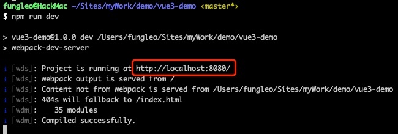
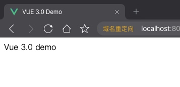

## vue3.0 Composition API 上手初体验 构建基本项目开发环境

目前，`vue3.0` 已经进入了 `beta` 版本了。众多的特性已经定下来了，相信有不少朋友都已经开始阅读相关的资料或源码了。

虽然我现在工作比较劳累，但是对于这样的前端行业的盛事，我也不能袖手旁观哪！所以，我决定写一个系列的文章，来带大家上手一下全新的 vue3.0。

首先，从目前公开信息来看，`vue3.0` 是完全兼容 `2.0` 版本的所有写法的。因此，即便不了解 `3.0` 的内容，用原有的知识储备，也是完全可以使用 `3.0` 版本的。这一点，各位同行不要惊慌。

另外，由于目前 `vue3.0` 对应的脚手架还没有开放，因此，我们只能手动搭建我们的项目了。那么本文，就来简单说说如何从 0 到 1 构建一个基于 vue3.0 的项目环境。

其实，再过几个月，就完全不必参考此文了，因为到时候官方脚手架会把一切都安排的妥妥的。不过，这也并不表示此文完全没有价值，因为，如果你只会用脚手架，不会自己构建脚手架，也是一件蛮遗憾的事情，对吧？

> 请确保你对 vue2.0 是有一定了解的，对于命令行的操作是有基础的，对于 node\npm 等是了然的，再阅读本文。受限于个人时间有限，不能十分详尽的展开介绍，因此，只能简要的大概说明。

> 如果确实没有基础，可以看我 2017 年写得一个系列的文章。 [Vue2 项目实战](https://blog.csdn.net/fungleo/category_9269903.html) 此链接中有全部内容链接，可以去这里看。

> 所有命令均在 MacOS 系统下，npm 源设置为淘宝源。本人不回答任何有关 windows 系统的问题，理由很简单——不会。

## 搭建基础 webpack 环境

首先在系统中找个目录，用来构建本项目。本人目录为 `~/Sites/myWork/demo/vue3-demo`。下文命令均在此目录下执行。

```bash
# 创建项目文件夹
mkdir -p ~/Sites/myWork/demo/vue3-demo
# 进入项目文件夹
cd ~/Sites/myWork/demo/vue3-demo
# 构建 npm 环境，执行命令后会有一系列的问题和选项，一路回车即可。
npm init
# 安装 vue3.0
# @next 是表示最新版，目前最新版是3.0，几年之后肯能会是更高的版本
# 当前时间为2020年5月
npm i vue@next
# 安装 webpack 依赖
# -D 表示是开发环境依赖，不加表示是项目依赖
npm i webpack webpack-cli webpack-dev-server -D
# 安装打包编译依赖
npm i html-webpack-plugin clean-webpack-plugin -D
# 安装 vue 文件编译依赖
npm i vue-loader@next @vue/compiler-sfc -D
# 安装 css 编译依赖
npm i css-loader style-loader -D
# 安装 scss 依赖
npm i node-sass sass-loader -D
```

好，基本的这些包都有了。后面我们当然还会安装其他的依赖，等下再说。

## 构建基础文件

```bash
# 创建 webpack 配置文件
touch webpack.config.js
# 创建项目开发文件夹，以及静态资源文件夹
mkdir src public
# 创建基础文件
touch src/main.js public/index.html
```

打开编辑器，我们开始编写这些文件吧。

## webpack.config.js 文件内容

关于 `webpack` 的这个配置文件详解，我就不解释了，网上教程大把，我这边也没有做过多优化，只是能跑起来而已。懂得不用解释，不懂的直接复制。

```js
const path = require('path')
const { VueLoaderPlugin } = require('vue-loader')
const HtmlWebpackPlugin = require('html-webpack-plugin')
const { CleanWebpackPlugin } = require('clean-webpack-plugin')

module.exports = (env = {}) => ({
  mode: env.prod ? 'production' : 'development',
  devtool: env.prod ? 'source-map' : 'inline-source-map',
  entry: path.resolve(__dirname, './src/main.js'),
  output: {
    path: path.resolve(__dirname, './dist'),
    publicPath: '/',
  },
  resolve: {
    alias: {
      vue: '@vue/runtime-dom',
      '@': path.resolve(__dirname, './src'),
    },
  },
  module: {
    rules: [
      {
        test: /\.vue$/,
        use: 'vue-loader',
      },
      {
        test: /\.css$/,
        use: ['style-loader', 'css-loader'],
      },
      {
        test: /\.scss$/,
        use: ['style-loader', 'css-loader', 'sass-loader'],
      },
    ],
  },
  plugins: [
    new VueLoaderPlugin(),
    new CleanWebpackPlugin(),
    new HtmlWebpackPlugin({
      template: path.resolve(__dirname, './public/index.html'),
      filename: 'index.html',
    }),
  ],
  devServer: {
    publicPath: '/',
    inline: true,
    hot: true,
    stats: 'minimal',
    contentBase: __dirname,
    overlay: true,
    historyApiFallback: true,
  },
})
```

## public/index.html 文件内容

一个基础的 html 内容而已，包含一个 `#app` 的 `div` 作为我们代码的根节点。

```html
<!DOCTYPE html>
<html lang="zh-CN">
  <head>
    <meta charset="UTF-8" />
    <title>VUE 3.0 Demo</title>
  </head>
  <body>
    <div id="app"></div>
  </body>
</html>
```

## src/main.js 文件内容

这个内容是临时的，只是看我们的 `webpack` 是否能正常跑起来。

```js
document.querySelector('#app').innerText = 'Vue 3.0 demo'
```

## package.json 两处修改

第一个是将主文件引向我们刚刚写的 `webpack` 配置文件。

另一个是添加 `dev` 节点，调用 `webpack-dev-server`

```json
  "main": "webpack.config.js",
  "scripts": {
    "dev": "webpack-dev-server"
  },
```

## 跑起来！

在命令行输入下面的命令：

```bash
npm run dev
```



如上图所示，当命令跑起来之后，会显示成这个样子。

然后，我们在浏览器里面输入 `http://localhost:8080` 看项目是否跑起来了。



现在，我们可以看到，通过我们刚刚的配置，已经可以把项目跑起来了。

那么，我们的基础开发环境就弄好了。注意，我这边只是为了能把项目搞跑起来，至于其他的什么优化是一毛钱都没有的。目前我也不建议大家将 vue3.0 用于生产环境，搞这个，只是为了学习而已。有关 webpack 更多内容，可以去找一找相关的资料文档，我对这玩意儿也就是知其然不知其所以然的状态。
