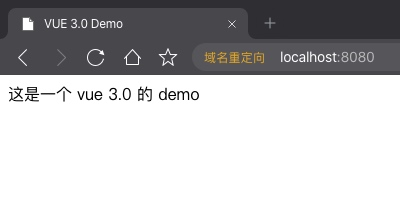

## vue3.0 Composition API 上手初体验 构建 vue 基础代码

上一讲中，我们通过配置 `webpack` 构建了一个基础的开发环境。但是并没有涉及到 `vue3.0` 的内容，这一讲中，我们来构建一些基础代码。

首先，在终端中进入到我们的项目目录，我的 demo 目录为 `~/Sites/myWork/demo/vue3-demo`。

## 创建基础文件

```bash
# 进入项目文件夹
cd ~/Sites/myWork/demo/vue3-demo
# 创建 App.vue 文件
touch src/App.vue
```

## 重写 src/main.js 文件

在上一讲中，我们直接写了个测试代码就完了，这里我们将文件内容替换为以下内容：

```js
import { createApp } from 'vue'
import App from './App.vue'

createApp(App).mount('#app')
```

注意，这里的写法已经和 2.0 的写法完全不一致了。 2.0 的时候采用的是创建一个新对象的方式，而这里采用的是函数方式。

这里我不做过多解释，如果想追究原理，可以去查看源码，或等待官方更新文档。

## 编写 src/App.js 文件

```js
<template>
  <div>这是一个 vue 3.0 的 demo</div>
</template>
```

然后我们运行 npm run dev 将项目跑起来。


## 小结
这一讲内容比较少，着重点是 main.js 中的写法变化。

下一讲，我们来引入 `vue-router`。
