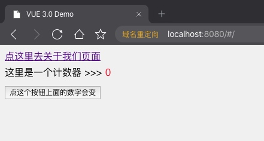
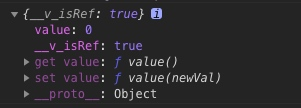

## vue3.0 Composition API 上手初体验 神奇的 setup 函数 (一) 响应数据的绑定

从网上大家对于 vue 3.0 的最大的变化，就是 `Vue Composition API` 的看法来说，两极分化比较严重。一种是认为这种写法实在太优秀了，很好，很喜欢。另外一种则认为变得没有以前那么清晰了，增加了学习成本。

那么我是怎么认为的呢？当然是第一种想法啊！你可知道，曾经我一度感觉到 `vue` 的语法实在是太过于变态，进而放弃使用 `react` 开发一年有余。后来因为来上海，入职的公司都是 `vue` 项目，故而我又开始了 `vue` 代码的编写。

但是，说实话，对于原来的 `vue` 的语法，我个人还是比较崩溃的。比如令人无法理解的 `this`，你别问，用就对了！

当然，还是有很多人喜欢 vue 的各种语法糖的，比如 `v-for \ v-model` 之类的。我个人表示这些确实降低了开发难度，但也确实变得更加费解。不过，语法糖这事儿，用着用着，就感觉，真爽。所谓嘴上不想要，身体还是很诚实的。

## 写一个简单的 setup 函数

我们编辑我们项目中的 `src/views/Home.vue` 文件，改成一下代码：

```html
<template>
  <router-link to="/about">点这里去关于我们页面</router-link>
  <div class="home">
    这里是一个计数器 >>> <span class="red">{{count}}</span> <br />
    <button @click="countAdd">{{btnText}}</button>
  </div>
</template>

<script>
  // ref 是 vue 3.0 的一个重大变化，其作用为创建响应式的值
  import { ref } from 'vue'
  // 导出依然是个对象，不过对象中只有一个 setup 函数
  export default {
    setup() {
      // 定义一个不需要改变的数据
      const btnText = '点这个按钮上面的数字会变'
      // 定义一个 count 的响应式数据，并赋值为 0
      const count = ref(0)
      // 定义一个函数，修改 count 的值。
      const countAdd = () => {
        count.value++
      }
      // 导出一些内容给上面的模板区域使用
      return {
        btnText,
        count,
        countAdd,
      }
    },
  }
</script>
<style lang="scss">
  .home {
    line-height: 2;
    .red {
      color: red;
    }
  }
</style>
```

我们把项目跑起来看看结果，如下图所示：


当然，点击按钮，数字肯定是会相加的。这里就不截图了。

## 划重点

首先，我们的组件不用写一堆东西了，只需要一个 `setup` 函数即可。

这样做得好处就是，我们可以把很多零碎的东西拆成公共组件，然后交给其他组件去调用。我写 `vue` 有一个痛苦的点就是很多的东西我想抽离成组件，但是一拆，就得有 `data ()`, `methods` 等等一堆。因此，有时候就偷懒，懒得拆了。

现在好了，可以一个函数就是一个组件，多方便啊！

其次，在 `setup` 函数中 `return` 出去的东西，可以在模板区域直接使用，也不必理会 `this` 这个神奇的东西。

然后就是 `ref` 这个函数，我们可以从 `vue` 中引入它，它传入一个值作为参数，返回一个基于该值的 响应式 `Ref` 对象，该对象中的值一旦被改变和访问，都会被跟踪到，通过修改 `count.value` 的值，可以触发模板的重新渲染，显示最新的值。

我们在控制台打印 `count`，如下图，我们可以看到它的结构，如下图所示：



`vue 3.0` 封装得很好，我们在模板区域，只要使用 `count` 就可以显示它的值了，不需要使用 `count.value`。当然，我们修改这个值，还是需要在 js 中使用 `count.value` 的。

好，消化一下，下一讲，我们来说说如何搞一个响应式的对象数据。
