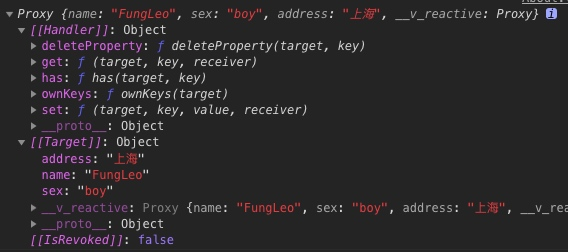

## vue3.0 Composition API 上手初体验 神奇的 setup 函数 (二) 响应对象数据的绑定

上文中，我们已经了解普通响应数据的绑定了。但是，那只是普通数据，我们在实际开发中，用到的对象数据是最多的。这一讲，我们就来讲讲响应对象数据的绑定。

开干。

## 编辑 src/views/About.vue 文件

编写代码如下：

```html
<template>
  <router-link to="/">点这里去首页</router-link>
  <hr />
  <dl>
    <dt>{{state.name}}</dt>
    <dd>性别：{{state.sex}}</dd>
    <dd>地址：{{state.address}}</dd>
  </dl>
  <button @click="addressChange">更新地址</button>
</template>
<script>
  // reactive 是 vue 3.0 的一个重大变化，其作用为创建响应式的对象或数组
  import { reactive } from 'vue'
  // 导出依然是个对象，不过对象中只有一个 setup 函数
  export default {
    setup() {
      // 定义一个 state 的响应式对象数据，并赋值
      const state = reactive({
        name: 'FungLeo',
        sex: 'boy',
        address: '上海',
      })
      console.log(state)
      // 定义一个函数，修改 state 的值。
      const addressChange = () => {
        state.address += '浦东'
      }
      // 导出一些内容给上面的模板区域使用
      return {
        state,
        addressChange,
      }
    },
  }
</script>
```

代码差不多，我们来看下效果：


## 划重点

在上一讲中，我们使用的是 `ref` 来绑定响应的值，这里，我们需要的是 `reactive`。

`reactive` 和 `ref` 的区别就是，`reactive` 是处理**对象**或者**数组**的。

我们在代码中，使用了 `reactive` 来处理 `state` 这个对象。我们来打印一下，可以看到是如下图的内容。



这里面的重点是 `Proxy` 代理。这里就要说到，`vue 3.0` 和 `vue 2.0` 的一个重大区别了，就是采用了 ES2015 的 Proxy 来代替 Object.defineProperty。结果是功能更强大，同时性能更优秀。更多的内容，可以自己找相关的资料来详细了解。

好的，有关普通数据和对象数组数据的响应式绑定就说完了。但是看到这里，各位看官要问，原来的各种生命周期钩子哪里去了？

别着急，下一讲，我们来说道说道。
