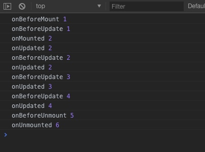

## vue3.0 Composition API 上手初体验 神奇的 setup 函数 (三) 生命周期函数

通过前面两讲，我相信大家对于 vue 3.0 双向绑定数据，已经有了一些了解了。但是，对于生命周期函数，还是一脸懵逼的。

这一讲，我们来讲解生命周期函数

## vue 2.0 生命周期对比 3.0 生命周期

| 2.0 周期名称  | 3.0 周期名称    | 说明                          |
| ------------- | --------------- | ----------------------------- |
| beforeCreate  | setup           | 组件创建之前                  |
| created       | setup           | 组件创建完成                  |
| beforeMount   | onBeforeMount   | 组件挂载之前                  |
| mounted       | onMounted       | 组件挂载完成                  |
| beforeUpdate  | onBeforeUpdate  | 数据更新，虚拟 DOM 打补丁之前 |
| updated       | onUpdated       | 数据更新，虚拟 DOM 渲染完成   |
| beforeDestroy | onBeforeUnmount | 组件销毁之前                  |
| destroyed     | onUnmounted     | 组件销毁后                    |

通过上表对比，我们可以看到，原有的生命周期，基本都是存在的。并且新的明明，更加直观，通过 `on` 前缀，可以直观的看到，这是一个生命周期函数。

## 生命周期是如何使用的呢？上代码！

我们在我们项目中，创建一个文件 `src\views\Life.vue`， 并在路由中挂载该组件。

```bash
# 进入项目文件夹
cd ~/Sites/myWork/demo/vue3-demo
# 创建新组件文件
touch src/views/Life.vue
```

`src/router/index.js`

```js
// ...
{
  path: '/life',
  component: () => import('@/views/Life.vue')
}
// ...
```

## 编写 srv/views/Life.vue 内容

```html
<template>
  <router-link to="/">点这里去首页</router-link>
  <hr />
  <div class="home">
    这里是一个计数器 >>> <span class="red">{{count}}</span> <br />
    <button @click="countAdd">点击加数字</button>
  </div>
</template>
<script>
  // 你需要使用到什么生命周期，就引出来什么生命周期
  import {
    onBeforeMount,
    onMounted,
    onBeforeUpdate,
    onUpdated,
    onBeforeUnmount,
    onUnmounted,
    ref,
  } from 'vue'

  export default {
    // setup 函数，就相当于 vue 2.0 中的 created
    setup() {
      const count = ref(0)
      // 其他的生命周期都写在这里
      onBeforeMount(() => {
        count.value++
        console.log('onBeforeMount', count.value)
      })
      onMounted(() => {
        count.value++
        console.log('onMounted', count.value)
      })
      // 注意，onBeforeUpdate 和 onUpdated 里面不要修改值，会死循环的哦！
      onBeforeUpdate(() => {
        console.log('onBeforeUpdate', count.value)
      })
      onUpdated(() => {
        console.log('onUpdated', count.value)
      })
      onBeforeUnmount(() => {
        count.value++
        console.log('onBeforeUnmount', count.value)
      })
      onUnmounted(() => {
        count.value++
        console.log('onUnmounted', count.value)
      })
      // 定义一个函数，修改 count 的值。
      const countAdd = () => {
        count.value++
      }
      return {
        count,
        countAdd,
      }
    },
  }
</script>
```

## 看结果

我们在浏览器中进入页面，并且点击两下按钮，然后回到首页，可以在控制台中看到完整的生命周期的输出，如下图所示：



## 划重点

首先，在 `vue 3.0` 中，生命周期是从 `vue` 中导出的，我们需要用到哪些，就导出哪些。

可能不少看官会认为多次一举，但实则不然。`vue` 提供这么多的生命周期，有几个是我们常用的？在大多数的组件中，我们用不到生命周期。即便是页面级别的应用，可能用到最多的是 `onMounted` 即可。

当然，那些绑定时间的操作会用到解绑，因此会用到 `onUnmounted`。其它的生命周期，正常情况下是基本用不到的。所以，通过引入使用的这种设定，可以减少我们的最终编译的项目的体积。而且，这样的引入使用，更加的逻辑清晰。

其次，除 `setup` 之外，其他的生命周期函数，都是在 `setup` 里面直接书写函数即可。

好的，生命周期我相信已经讲解清楚了。下一讲，我们来讨论计算属性。
