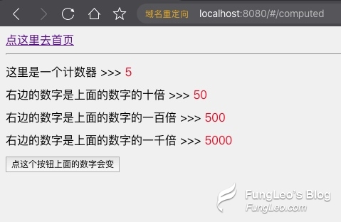

## vue3.0 Composition API 上手初体验 神奇的 setup 函数 (四) 计算属性 computed

上一讲中，我们讲解了 `vue 3.0` 的生命周期，我相信大家已经了然了。在 `vue` 中，计算属性 computed 是非常常用的。那么，在 `vue 3.0` 中，计算属性是如何使用的呢？这一讲我们来着重讨论，。

## 上代码！

首先，我们新建 `src/views/Computed.vue` 文件，并在路由中设定路由为 `computed`。不会操作的看上一讲的演示。

然后编写如下代码：

```html
<template>
  <router-link to="/">点这里去首页</router-link>
  <hr />
  <div class="home">
    这里是一个计数器 >>> <span class="red">{{count}}</span> <br />
    右边的数字是上面的数字的十倍 >>> <span class="red">{{bigCount}}</span>
    <br />
    右边的数字是上面的数字的一百倍 >>>
    <span class="red">{{computeCount['100x']}}</span> <br />
    右边的数字是上面的数字的一千倍 >>>
    <span class="red">{{computeCount['1000x']}}</span> <br />
    <button @click="countAdd">点这个按钮上面的数字会变</button>
  </div>
</template>

<script>
  // 需要使用计算属性，也需要从 vue 中导出引入
  import { ref, computed } from 'vue'
  // 导出依然是个对象，不过对象中只有一个 setup 函数
  export default {
    setup() {
      // 定义一个 count 的响应式数据，并赋值为 0
      const count = ref(0)
      // 定义一个函数，修改 count 的值。
      const countAdd = () => {
        count.value++
      }
      // 计算属性，使用计算函数并命名，然后在 return 中导出即可
      const bigCount = computed(() => {
        return count.value * 10
      })
      // 计算多个属性，可以通过返回一个对象的方式来实现
      const computeCount = computed(() => {
        return {
          '100x': count.value * 100,
          '1000x': count.value * 1000,
        }
      })
      // 导出一些内容给上面的模板区域使用
      return {
        count,
        countAdd,
        bigCount,
        computeCount,
      }
    },
  }
</script>
```

## 看效果

在浏览器中访问 `http://localhost:8080/#/computed` 我们可以打开页面，看到如下图。

这是我多点了几次按钮，导致上面的数字变大了哈，默认都是 0



## 划重点

计算属性和生命周期一样，都是从 `vue` 中导出引入的。我们把计算属性当成一个函数来使用，直接 `return` 计算结果即可。

计算属性函数可以多次使用，可以返回一个值，也可以返回一个对象包含多个值。嘿嘿很爽吧！

其实最重要的是，编程风格的统一。对于 `react` 转 `vue` 的开发者来说，这样的编写风格是十分舒服的。但对于 `vue 2.0` 的开发者来说，会不太习惯。但是没关系，习惯后你会很喜欢的。

好了，关于 `vue 3.0` 的这些新特性，基本都讲完了，下一讲我们玩玩组件。
