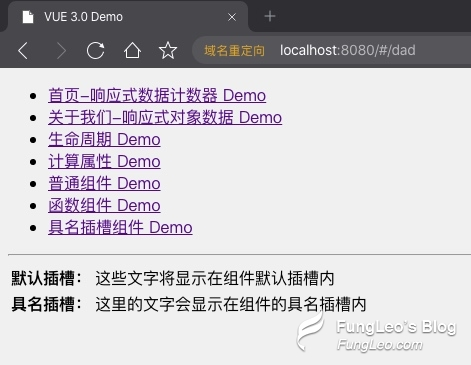

## vue3.0 Composition API 上手初体验 vue 组件的具名插槽 slot 的变化

在我讲 `vue 3.0` 的普通组件的内容里，我提到了具名插槽发生了变化，我当时不清楚新的如何使用。今天查看了一些资料，终于搞明白了。

## 搞一个带具名插槽的子组件

直接撸代码：

```html
<template>
  <table>
    <tr>
      <th>默认插槽：</th>
      <td><slot /></td>
    </tr>
    <tr>
      <th>具名插槽：</th>
      <td><slot name="footer" /></td>
    </tr>
  </table>
</template>
```

从代码中可以看到，我使用了 `<slot />` 来调用默认的插槽。同时，也使用了 `<slot name="footer" />` 来展示具名插槽

## vue 2.0 的具名插槽父组件的调用方法

```html
<template>
  <Child>
    这些文字将显示在组件默认插槽内
    <template slot="footer">
      这里的文字会显示在组件的具名插槽内
    </template>
  </Child>
</template>
<script>
  import Child from '@/components/child.vue'
  export default {
    components: { Child },
  }
</script>
```

如上，我们可以使用 `<template slot="footer">` 往具名插槽里面填充内容。但是，在`vue 3.0` 里面，这种写法是不被支持的。

## vue 3.0 的具名插槽父组件的调用方法

```html
<template>
  <Child>
    这些文字将显示在组件默认插槽内
    <template v-slot:footer>
      这里的文字会显示在组件的具名插槽内
    </template>
  </Child>
</template>
<script>
  import Child from '@/components/child.vue'
  export default {
    components: { Child },
  }
</script>
```

好的，我们可以看到，原有的语法已经更换为了 `<template v-slot:footer>`，其它的内容没有变化。在浏览器中的效果如下图所示：



> 这也是语法糖搞多了之后不可避免的问题。作为开发人员，我们哪有那么多时间去翻看这些文档，查看这些语法糖又怎么更新了呢？当然，vue 的文档还是做得很好的。

## 具名插槽的传值

在原有的语法里面，可以通过 `slot-scope` 来接收子组件的传值，典型的应用可以参考 element-ui 的 Table 组件，官方演示如下图所示：


但是在 `vue 3.0` 中，这个写法已经被废弃了，更换为新的写法。我们重写我们的子组件代码如下：

```html
<template>
  <table>
    <tr>
      <th>默认插槽：</th>
      <td><slot /></td>
    </tr>
    <tr>
      <th>具名插槽：</th>
      <td><slot name="footer" /></td>
    </tr>
    <tr>
      <th>传参插槽：</th>
      <td><slot name="bottom" :color="color" /></td>
    </tr>
    <tr>
      <th>传对象参插槽：</th>
      <td><slot name="object" v-bind="{ old, name }" /></td>
    </tr>
  </table>
</template>
<script>
  export default {
    setup() {
      return {
        color: 'red',
        old: 34,
        name: 'FungLeo',
      }
    },
  }
</script>
```

然后我们的父组件改成

```html
<template>
  <Child>
    这些文字将显示在组件默认插槽内
    <template v-slot:footer>
      这里的文字会显示在组件的具名插槽内
    </template>
    <template v-slot:bottom="scope">
      文字右边会有个颜色值 >>> {{scope.color}}
    </template>
    <template v-slot:object="scope">
      文字右边会有多个数据 >>> 名字：{{scope.name}}，年龄：{{scope.old}}
    </template>
  </Child>
</template>
<script>
  import Child from '@/components/child.vue'
  export default {
    components: { Child },
  }
</script>
```

可以看到，我们的父组件获取子组件传值，可以通过 `v-slot` 的自定义命名值来获取对象数据。

而子组件给父组件传值，如果是传单个值，可以用 `:color="color"` 这样的语法来进行传值。如果要传多个数据，则可以使用 `v-bind` 来传一个对象出去。

> 刚刚尝试了一下，`v-bind` 可以缩写成 : 也就是说，上面的代码可以写成 `<slot name="object" :="{ old, name }" />` ，但是我个人不推荐这样写，有点懵逼


不过这种插槽传值在实际开发中的应用较少，大家只要知道有这种用法就可以了。具体什么应用场景，只有你自己遇到了实际的需求你才会知道。

好的，有关 `vue 3.0` 插槽的部分，我就讲完了，相关的代码，我会推到 github 仓库中，大家可以下载查看。
