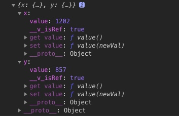
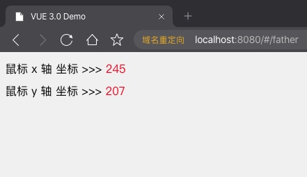

## vue3.0 Composition API 上手初体验 函数组件的开发与使用

在上一节中，我们讨论了普通组件的开发与使用，其实相比较 vue 2.0 来说，差别并不大。

`vue 3.0` 的 `Composition API` 带来的最大的特性，就是函数组件。通过函数组件，我们可以体会到 类似 `react` 编程的愉悦。这个章节，我们就来讨论一下。

在 `vue 2.0` 中，当多个页面或组件使用到相同逻辑的时候，我们会使用 `mixin` 来编写逻辑。其实我个人在使用 `mixin` 时，感觉还是很方便的，但是当项目组的其他成员开始使用 `mixin` 时，我就经常崩溃了。

原因很简单，当使用 `mixin` 时最大的问题就是——命名污染。比如，你在 `mixin` 中定义了一个 `data` 叫 `love`，那么，在调用该 `mixin` 的页面，就不能使用 love 了，否则会覆盖掉。当然，方法名也是一样的。生命周期的话，还存在重复执行的问题。

这导致的结果就是，要小心意义的使用 `mixin`，甚至，在某些团队里面，就严禁使用 `mixin` 了。

好，废话不说，闲言少叙，开干。

## 创建函数式子组件 Position.js

```bash
# 进入项目文件夹
cd ~/Sites/myWork/demo/vue3-demo
# 创建 Position.js 文件
touch src/components/Position.js
```

创建好文件后，我们录入以下内容：

```js
// 函数式组件， 该组件会返回鼠标在屏幕上的坐标值
// toFefs 是将 reactive 对象的所有 key 都转化为 ref 值
// 这样，在引入使用的组件中，就可以 用 const { x, y } = xx 来使用这些 key 对应的 value 了
import { onMounted, onUnmounted, reactive, toRefs } from 'vue'

// 这里导出，就不是对象，而是一个函数了。
export default () => {
  // 定义一个准备导出的对象数据
  const position = reactive({
    x: 0,
    y: 0,
  })
  // 定义一个会改变数据的函数
  const update = (page) => {
    position.x = page.pageX
    position.y = page.pageY
  }
  // 使用生命周期，绑定和移除事件
  onMounted(() => {
    window.addEventListener('mousemove', update)
  })
  onUnmounted(() => {
    window.removeEventListener('mousemove', update)
  })
  // 将 reactive 对象 转化为 ref 响应式的值，并返回
  return toRefs(position)
}
```

这是一个简单的函数组件，其作用是返回鼠标在屏幕的坐标，通过 vue 提供的生命周期，我们来绑定和移除事件。

这里的重点是什么呢？在 `vue2.0` 当中，我们当然可以把一些函数方法给抽离出来，写自定义的工具函数，以达到逻辑的复用。但是，这些只是纯粹的 `js` 而已。而 `vue3.0` 提供的这种函数式风格的组件，可以非常方便的在函数中使用 `vue` 的特性，比如生命周期等等。

这样，我们就能写出更加灵活的功能了，而不仅仅只是业务逻辑代码的抽离。这一点，也是 `vue3.0` 带来的最大变革。

## 知识点

这里，我们用到了 `toRefs` 方法。这个也算是 `vue3.0` 给我们提供的一个语法糖函数了。通过 `toRefs` 函数，它可以将 `reactive` 对象，转化为普通对象，而它的每个 `key` 值，都会是如 `ref` 数据那样的格式，打印出来如下图所示：



可以看到，每个 `key` 都变成了对象，并且，都有一个 `value` 值。这样就变成了响应式的数据。

## 写一个调用函数子组件的父组件

我们创建一个 `src/views/Father.vue` 文件，并在路由中设置地址为 `/father`。录入以下内容：

```html
<template>
  <div class="home">
    鼠标 x 轴 坐标 >>> <span class="red">{{ x }}</span> <br />
    鼠标 y 轴 坐标 >>> <span class="red">{{ y }}</span> <br />
  </div>
</template>
<script>
  // 引用我们开发的子组件
  import Position from '@/components/Position.js'
  export default {
    setup() {
      // 引用函数子组件并展开它的值
      const { x, y } = Position()
      // 将他的值 return 出去
      return { x, y }
    },
  }
</script>
```

代码非常简单，只要引用我们的函数子组件，执行并拿到结果，return 出去，或者参与其他的计算等等，都是可以的。别的没啥，看效果就行啦！



好的，通过本文的讲解，相信大家对于函数组件的开发，已经有一定的了解了。下面，只要我们去想想自己的应用场景，去构建自己的项目，就可以啦！
