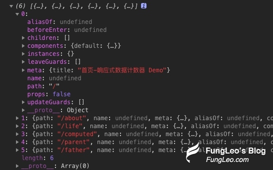
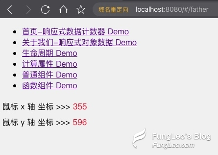

## vue3.0 Composition API 上手初体验 用路由循环，做个导航菜单

通过前文的讲述，我已经基本讲清楚了 `vue 3.0` 的新特性，以及开发使用方法。只是演示 `Demo` 搞了好几个页面，只能输入地址进行跳转让我不爽，于是，我给我的 `Demo` 代码搞了个菜单，这里，我把这部分内容讲述一下。

## 重构 src/router/index.js 文件

在原来编写的代码中，我给单条路由只写了 `path` 和 `component` 两个参数，这里，我们加上 `meta` 参数，并为其设置 `title` 属性。相关代码如下：

```js
// 构建我们的页面路由配置，可以看到，这里和原来的写法并无二致。
const routes = [
  {
    path: '/',
    component: Home,
    meta: { title: '首页-响应式数据计数器 Demo' },
  },
  {
    path: '/about',
    component: () => import('@/views/About.vue'),
    meta: { title: '关于我们-响应式对象数据 Demo' },
  },
  {
    path: '/life',
    component: () => import('@/views/Life.vue'),
    meta: { title: '生命周期 Demo' },
  },
  {
    path: '/computed',
    component: () => import('@/views/Computed.vue'),
    meta: { title: '计算属性 Demo' },
  },
  {
    path: '/parent',
    component: () => import('@/views/Parent.vue'),
    meta: { title: '普通组件 Demo' },
  },
  {
    path: '/father',
    component: () => import('@/views/Father.vue'),
    meta: { title: '函数组件 Demo' },
  },
]
```

好的，通过上述的配置，我们需要的基础数据已经有了。

## 编写菜单函数组件

我们可以把菜单作为一个函数组件，我们新建 `src/components/Menu.js`文件，并录入以下内容：

```js
// 引入路由
import router from '@/router'
// 导出为函数
export default () => {
  // 通过 getRoutes() 函数，获取所有的路由信息
  const routes = router.getRoutes()
  const links = []
  // 循环路由信息，将数据整理并 push 到 links 数组
  routes.forEach((route, index) => {
    links.push({
      name: route.meta.title || `未命名${index}`,
      link: route.path,
    })
  })
  // 将 links 数组返回
  return links
}
```

我们可以通过 `vue-router` 提供的 `getRoutes()` 函数，来获取我们配置的所有路由信息，打印数据如下图所示：



从上图我们可以看到，其数据结构还是比较复杂的。而我们做一个导航菜单，完全没有必要使用如此复杂的数据。因此，我上面写了一个 `forEach` 循环，将数据整理了一下，并返回。

## 重写 `src/App.vue` 引入菜单函数组件

少废话，上代码：

```html
<template>
  <!-- 菜单 -->
  <ul>
    <li v-for="item in menus">
      <router-link :to="item.link">{{ item.name }}</router-link>
    </li>
  </ul>
  <!-- 路由视图 -->
  <router-view />
</template>
<script>
  // 引入 Menu 组件
  import Menu from '@/components/Menu.js'

  export default {
    setup() {
      // 获取菜单数据并返回
      const menus = Menu()
      return {
        menus,
      }
    },
  }
</script>
```

说实话，不是很优雅。其实也可以换个做法，就是上面的 `Menu.js` 可以该写成一个 `vue` 普通组件，然后再这边只要引用注册并使用即可。

就这样吧，看效果：


如上图所示，我们的每个页面上，都已经有了导航菜单了。
