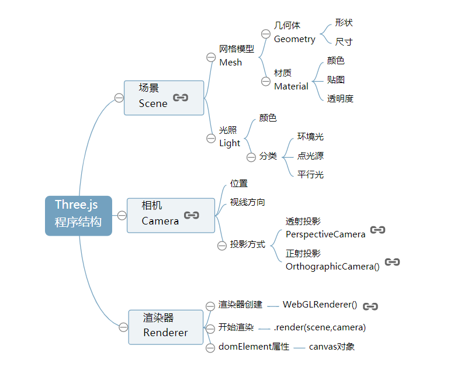

# Three.js快速入门—新手上路
本章节属于新手上路内容，本章节不会对Threejs几何体、材质、相机、模型、光源等概念详细讲解，会首先提供给大家一个注释非常详细的案例源码。本章节的案例源码实现的三维效果虽然非常简单，但是可以完整地展示Three.js的整体结构。

本章节的教学思路是先给你展示一个小案例的源码让你体验测试，然后从整体对每一块的功能进行整体介绍。和传统教学思路不同，传统的教学方式往往是对一个新技术的所有基础知识点逐步阐述，然后一行一行去实现一个案例代码。本章节是先把一个小案例的完整代码提供给你，文字部分对代码进行整体介绍，不做过细讲解。对于基础不好的初学者，可能很难一行一行写出来，但是这没有关系，你可以先把Threejs当成一个黑箱，在后面章节学习中，全部在第一章案例代码基础上进行增删代码，学习第一章内容全部在第1.1节基础上进行增删代码。

简单地说，一句话，初学者第一天，不要想着自己一行一行写出来一个小案例，而是能在1.1节提供的行行中文注释的源码基础上增删代码、修改参数。

# Threejs第一个3D场景
下面的代码完整展示了通过three.js引擎创建的一个三维场景，在场景中绘制并渲染了一个立方体的效果，为了大家更好的宏观了解three.js引擎， 尽量使用了一段短小但完整的代码实现一个实际的三维效果图。
## 学习建议
刚一开始学习，不需要完全看懂下面的代码，能够修改增删部分代码就可以，随着时间的推移就能够很好的使用三维引擎three.js。

本课程风格和大多数课程风格不同，注意一定要结合案例代码学习，在案例代码的基础上调试体验总结，就像做化学实验一样，不要仅仅阅读文字。

## .html文件引入three.js引擎
在`.html`文件中引入`three.js`就像前端经常使用的jquery.js一样引入即可。
```html
<!--相对地址加载-->
<script src="./three.js"></script>
```
## 案例源码
第一个Three.js案例，麻雀虽小，五脏俱全，整体展示了Three.js的整套渲染系统。
```html
<template>
  <div></div>
</template>
<script lang="ts">

import * as THREE from 'three'
import { ref, defineComponent } from 'vue'
export default defineComponent({
  name: 'A01',
  props: {
    msg: {
      type: String,
      required: true
    }
  },
  created(){
    /**
     * 创建场景对象Scene
     */
    var scene = new THREE.Scene();
    /**
     * 创建网格模型
     */
    // var geometry = new THREE.SphereGeometry(60, 40, 40); //创建一个球体几何对象
    var geometry = new THREE.BoxGeometry(100, 100, 100); //创建一个立方体几何对象Geometry
    var material = new THREE.MeshLambertMaterial({   color: 0x0000ff   }); //材质对象Material
    var mesh = new THREE.Mesh(geometry, material); //网格模型对象Mesh
    scene.add(mesh); //网格模型添加到场景中
    /**
     * 光源设置
     */
    //点光源
    var point = new THREE.PointLight(0xffffff);
    point.position.set(400, 200, 300); //点光源位置
    scene.add(point); //点光源添加到场景中
    //环境光
    var ambient = new THREE.AmbientLight(0x444444);
    scene.add(ambient);
    // console.log(scene)
    // console.log(scene.children)
    /**
     * 相机设置
     */
    var width = window.innerWidth; //窗口宽度
    var height = window.innerHeight; //窗口高度
    var k = width / height; //窗口宽高比
    var s = 200; //三维场景显示范围控制系数，系数越大，显示的范围越大
    //创建相机对象
    var camera = new THREE.OrthographicCamera(-s * k, s * k, s, -s, 1, 1000);
    camera.position.set(200, 300, 200); //设置相机位置
    camera.lookAt(scene.position); //设置相机方向(指向的场景对象)
    /**
     * 创建渲染器对象
     */
    var renderer = new THREE.WebGLRenderer();
    renderer.setSize(width, height);//设置渲染区域尺寸
    renderer.setClearColor(0xb9d3ff, 1); //设置背景颜色
    document.body.appendChild(renderer.domElement); //body元素中插入canvas对象
    //执行渲染操作   指定场景、相机作为参数
    renderer.render(scene, camera);
  }
})

</script>
```
## 体验测试
直接看上面的代码大家可能不太理解，如果是第一次接触会比较陌生，可以尝试更改代码的参数看看有什么效果，代码的功能都有注释， 看着注释也能大概猜出一个参数的含义。通过修改代码，同时刷新浏览器查看效果形成一个互动来提高自己学习的驱动力。

## 几何体Geometry
```js
//创建一个立方体几何对象Geometry
var geometry = new THREE.BoxGeometry(100, 100, 100);
```
代码`var box=new THREE.BoxGeometry(100,100,100);`通过构造函数`THREE.BoxGeometry()`创建了一个长宽高都是100的立方体，通过构造函数名字 `BoxGeometry` 也能猜出这个构造函数的意义，利用new关键字操作构造函数可以创建一个对象， 这都是Javascript语言的基本知识，至于`THREE.BoxGeometry()`构造函数具体是什么可以不用关心， 就像你使用前端使用JQuery库一样查找官方文档就可以，你可以把代码`THREE.BoxGeometry(100,100,100)`中的第一个参数更改为为50，刷新浏览器查看数据更改后长方体的效果图，可以看到已经不是长宽高一样的立方体， 而是普通的长方体。

你也可以用下面一段代码代替上面的长方体代码，你会发现会渲染出来一个球体效果。
```js
//创建一个球体几何对象
var geometry = new THREE.SphereGeometry(60, 40, 40);
```
## 材质Material
代码`var material=new THREE.MeshLambertMaterial({color:0x0000ff});`通过构造函数 `THREE.MeshLambertMaterial()` 创建了一个可以用于立方体的材质对象， 构造函数的参数是一个对象，对象包含了颜色、透明度等属性，本案例中只定义了颜色`color`，颜色属性值`0x0000ff`表示蓝色，可以把颜色值改为`0x00ff00`，可以看到是绿色的立方体效果， 这里使用的颜色值表示方法是16进制RGB三原色模型。使用过渲染类软件、设计过网页或者学习过图形学应该能知道RGB三原色模型，这里就不再详述。

## 光源Light
代码`var point=new THREE.PointLight(0xffffff);`通过构造函数 `THREE.PointLight()`创建了一个点光源对象，参数`0xffffff`定义的是光照强度， 你可以尝试把参数更改为为`0x444444`，刷新浏览器你会看到立方体的表面颜色变暗，这很好理解，实际生活中灯光强度变低了，周围的景物自然暗淡，three.js引擎对WebGL光照模型算法都进行了封装，不需要你了解计算机图形学， 可以直接使用调用three.js光源相关API直接创建一个光源对象，就像你使用普通的三维建模渲染软件一样，只是这里多了一个Javascript编程语言而已。

## 相机Camera
代码 `var camera = new THREE.OrthographicCamera(-s * k, s * k, s, -s, 1, 1000);`通过构造函数 `THREE.OrthographicCamera()`创建了一个正射投影相机对象， 什么是“正射投影”，什么是“相机对象”，每个人的基础不一样，或许你不太理解，或许你非常理解，如果不清楚还是那句话，刚一开始不用深究，改个参数测试一下看看视觉效果你就会有一定的感性认识。 比如把该构造函数参数中用到的参数s，也就是代码`var s = 200;`中定义的一个系数，可以把200更改为300,你会发现立方体显示效果变小，这很好理解，相机构造函数的的前四个参数定义的是拍照窗口大小， 就像平时拍照一样，取景范围为大，被拍的人相对背景自然变小了。camera.position.set(200, 300, 200);和camera.lookAt(scene.position);定义的是相机的位置和拍照方向，可以更改camera.position.set(200,300,200);参数重新定义的相机位置，把第一个参数也就是x坐标从200更改为250， 你会发现立方的在屏幕上呈现的角度变了，这就像你生活中拍照人是同一个人，但是你拍照的位置角度不同，显示的效果肯定不同。这些具体的参数细节可以不用管， 至少你知道相机可以缩放显示三维场景、对三维场景的不同角度进行取景显示。

## 整个程序的结构




## 场景——相机——渲染器
从实际生活中拍照角度或是使用三维渲染软件角度理解本节课的案例代码，立方体网格模型和光照组成了一个虚拟的三维场景,相机对象就像你生活中使用的相机一样可以拍照，只不过一个是拍摄真实的景物，一个是拍摄虚拟的景物，拍摄一个物体的时候相机的位置和角度需要设置，虚拟的相机还需要设置投影方式，当你创建好一个三维场景，相机也设置好，就差一个动作“咔”，通过渲染器就可以执行拍照动作。


## 对象、方法和属性 
从面向对象编程的角度理解上面的程序，使用three.js和使用其它传统前端Javascript库或框架一样，通过框架提供的构造函数可以创建对象，对象拥有方法和属性，只不过three.js是一款3D引擎， 如果你对HTML、Javascript语言、三维建模渲染软件都能够理解应用，即使你不懂计算机图形学和WebGL，也能够学习three.js引擎,创建可以在线预览的三维场景。

案例源码分别使用构造函数`THREE.Scene()`、`THREE.OrthographicCamera()`、`THREE.WebGLRenderer()`创建了场景、相机、渲染器三个最顶层的总对象，然后通过总对象的子对象、方法和属性进行设置， 相机对象和渲染对象相对简单，最复杂的是场景对象，`new THREE.Mesh(box,material);`使用构造函数`Mesh()`创建了一个网格模型对象，该对象把上面两行含有顶点位置信息的几何体对象和含有颜色信息的材质对象作为参数，网格模型创建好之后， 需要使用场景对象的方法`.add()`把三维场景的子对象添加到场景中，`new THREE.PointLight(0xffffff);`、`new THREE.AmbientLight(0x444444);`定义了两个点光源、环境光对象，然后作为场景的子对象插入场景中。 场景、相机、渲染器设置完成后，设置代码`renderer.render(scene,camera)`把场景、相机对象作为渲染器对象方法`render()`的参数，这句代码的意义相当于告诉浏览器根据相机的放置方式拍摄已经创建好的三维场景对象。


## WebGL封装
如果你有WebGL基础，可以通过下面介绍了解Three.js对WebGL的封装，如果不了解WebGL或计算机图形学，随便阅读一下或者直接跳过。

从WebGL的角度来看，three.js提供的构造函数基本是对原生WebGL的封装，如果你有了WebGL的基础，在学习three.js的很多对象、方法和属性是很容易理解的。在three.js入门教程中不会去过多讲解WebGL的基础知识， 但是为了大家更好的理解three.js的很多命令，与three.js相关的WebGL API知识、GPU渲染管线的知识。图形学可能很多人会觉得比较难，其实主要是算法部分，大家先可以学习一些基本的WebGL知识，初学的时候尽量不关注算法，主要了解顶点数据处理的过程，GPU渲染管线的基本功能单元。实际的工作中如果不是开发3D引擎可能不会使用原生WebGL API，但是学习了这些之后，对于three.js的深度开发学习很有好处，如果你了解你WebGL知识，可以联系绘制函数`drawArrays()`来理解渲染器的渲染操作方法`render()`。


# 旋转动画、requestAnimationFrame周期性渲染
基于WebGL技术开发在线游戏、商品展示、室内漫游往往都会涉及到动画，初步了解three.js可以做什么，深入讲解three.js动画之前，本节课先制作一个简单的立方体旋转动画。 本节课是在 `1.1节 第一个3D场景` 已绘制好的立方体代码基础上进行更改。

## 周期性渲染
在1.1节中讲解过，每执行一次渲染器对象 `WebGLRenderer` 的渲染方法`.render()`，浏览器就会渲染出一帧图像并显示在Web页面上，这就是说你按照一定的周期不停地调用渲染方法`.render()`就可以不停地生成新的图像覆盖原来的图像。这也就是说只要一边旋转立方体，一边执行渲染方法`.render()`重新渲染，就可以实现立方体的旋转效果。

为了实现周期性渲染可以通过浏览器全局对象`window`对象的一个方法`setInterval()`,可以通过window对象调用该方法`window.setInterval()`，也可以直接以函数形式调用`setInterval()`。

```js
// 间隔20ms周期性调用函数fun
setInterval("render()",20)
```
为了实现立方体旋转动画效果，直接使用下面的代码代替1.1节中代码`renderer.render(scene,camera);`即可。
```js
// 渲染函数
function render() {
    renderer.render(scene,camera);//执行渲染操作
    mesh.rotateY(0.01);//每次绕y轴旋转0.01弧度
}
//间隔20ms周期性调用函数fun,20ms也就是刷新频率是50FPS(1s/20ms)，每秒渲染50次
setInterval("render()",20);
```
上面代码定义了一个渲染函数`render()`，函数中定义了三个语句，通过`setInterval("render()",20);`可以实现m每间隔20毫秒调用一次函数`render()`，每次调用渲染函数的时候，执行`renderer.render(scene,camera);`渲染出一帧图像，执行`mesh.rotateY(0.01);`语句使立方体网格模型绕y轴旋转0.01弧度。

## 渲染频率
调用渲染方法`.render()`进行渲染的渲染频率不能太低，比如执行`setInterval("render()",200);`间隔200毫秒调用渲染函数渲染一次，相当于每秒渲染5次，你会感觉到比较卡顿。渲染频率除了不能太低，也不能太高，太高的话计算机的硬件资源跟不上，函数`setInterval()`设定的渲染方式也未必能够正常实现。一般调用渲染方法.`render()`进行渲染的渲染频率控制在每秒30~60次，人的视觉效果都很正常，也可以兼顾渲染性能。

```js
//设置调用render函数的周期为200ms，刷新频率相当于5你能明显的感受到卡顿
setInterval("render()",200);
```
## 函数 `requestAnimationFrame()`
前面讲解threejs动画效果，使用了`setInterval()`函数，实际开发中，为了更好的利用浏览器渲染，可以使用函数`requestAnimationFrame()`代替`setInterval()`函数，`requestAnimationFrame()`和`setInterval()`一样都是浏览器`window`对象的方法。

`requestAnimationFrame()`参数是将要被调用函数的函数名，`requestAnimationFrame()`调用一个函数不是立即调用而是向浏览器发起一个执行某函数的请求， 什么时候会执行由浏览器决定，一般默认保持60FPS的频率，大约每16.7ms调用一次`requestAnimationFrame()`方法指定的函数，60FPS是理想的情况下，如果渲染的场景比较复杂或者说硬件性能有限可能会低于这个频率。可以查看文章[《requestAnimationFrame()》](http://www.yanhuangxueyuan.com/HTML5/time.html)了解更多`requestAnimationFrame()`函数的知识。
```js
function render() {
        renderer.render(scene,camera);//执行渲染操作
        mesh.rotateY(0.01);//每次绕y轴旋转0.01弧度
        requestAnimationFrame(render);//请求再次执行渲染函数render
    }
render();
```
## 均匀旋转
在实际执行程序的时候，可能`requestAnimationFrame(render)`请求的函数并不一定能按照理想的60FPS频率执行，两次执行渲染函数的时间间隔也不一定相同，如果执行旋转命令的`rotateY`的时间间隔不同，旋转运动就不均匀，为了解决这个问题需要记录两次执行绘制函数的时间间隔。

使用下面的渲染函数替换原来的渲染函数即可，`rotateY()`的参数是`0.001*t`，也意味着两次调用渲染函数执行渲染操作的间隔`t`毫秒时间内，立方体旋转了`0.001*t`弧度，很显然立方体的角速度是`0.001`弧度每毫秒`(0.0001 rad/ms = 1 rad/s = 180度/s)`。CPU和GPU执行一条指令时间是纳秒ns级，相比毫秒ms低了6个数量级，所以一般不用考虑渲染函数中几个计时语句占用的时间，除非你编写的是要精确到纳秒ns的级别的标准时钟程序。
```js
let T0 = new Date();//上次时间
function render() {
        let T1 = new Date();//本次时间
        let t = T1-T0;//时间差
        T0 = T1;//把本次时间赋值给上次时间
        requestAnimationFrame(render);
        renderer.render(scene,camera);//执行渲染操作
        mesh.rotateY(0.001*t);//旋转角速度0.001弧度每毫秒
    }
render();
```
# 鼠标操作三维场景
为了使用鼠标操作三维场景，可以借助three.js众多控件之一`OrbitControls.js`，可以在下载的`three.js-master`文件中找到(`three.js-master\examples\js\controls`)。 然后和引入`three.js`文件一样在html文件中引入控件`OrbitControls.js`。本节课的目的不是为了深入讲解`OrbitControls.js`，主要目的一方面向大家展示下threejs的功能，另一方面后面课程学习过程中经常会通过鼠标旋转、缩放模型进行代码调试。
## 代码实现
`OrbitControls.js`控件支持鼠标左中右键操作和键盘方向键操作，具体代码如下，使用下面的代码替换1.1节中`renderer.render(scene,camera);`即可。
```js
function render() {
  renderer.render(scene,camera);//执行渲染操作
}
render();
var controls = new THREE.OrbitControls(camera,renderer.domElement);//创建控件对象
controls.addEventListener('change', render);//监听鼠标、键盘事件
```
OrbitControls.js控件提供了一个构造函数`THREE.OrbitControls()`，把一个相机对象作为参数的时候，执行代码`new THREE.OrbitControls(camera,renderer.domElement)`，浏览器会自动检测鼠标键盘的变化， 并根据鼠标和键盘的变化更新相机对象的参数，比如你拖动鼠标左键，浏览器会检测到鼠标事件，把鼠标平移的距离按照一定算法转化为相机的的旋转角度，你可以联系生活中相机拍照,即使景物没有变化，你的相机拍摄角度发生了变化，自然渲染器渲染出的结果就变化了，通过定义监听事件`controls.addEventListener('change', render)`，如果你连续操作鼠标，相机的参数不停的变化，同时会不停的调用渲染函数`render()`进行渲染，这样`threejs`就会使用相机新的位置或角度数据进行渲染。

执行构造函数`THREE.OrbitControls()`浏览器会同时干两件事，一是给浏览器定义了一个鼠标、键盘事件，自动检测鼠标键盘的变化，如果变化了就会自动更新相机的数据， 执行该构造函数同时会返回一个对象，可以给该对象添加一个监听事件，只要鼠标或键盘发生了变化，就会触发渲染函数。 关于监听函数`addEventListener`介绍可以关注文章[《HTML5事件》](http://www.yanhuangxueyuan.com/HTML5/event.html)。
## 场景操作
- 缩放：滚动—鼠标中键
- 旋转：拖动—鼠标左键
- 平移：拖动—鼠标右键

## `requestAnimationFrame()`使用情况
如果`threejs`代码中通过`requestAnimationFrame()`实现渲染器渲染方法`render()`的周期性调用，当通过`OrbitControls`操作改变相机状态的时候，没必要在通过`controls.addEventListener('change', render)`监听鼠标事件调用渲染函数，因为`requestAnimationFrame()`就会不停的调用渲染函数。
```js
function render() {
  renderer.render(scene,camera);//执行渲染操作
  // mesh.rotateY(0.01);//每次绕y轴旋转0.01弧度
  requestAnimationFrame(render);//请求再次执行渲染函数render
}
render();
var controls = new THREE.OrbitControls(camera);//创建控件对象
// 已经通过requestAnimationFrame(render);周期性执行render函数，没必要再通过监听鼠标事件执行render函数
// controls.addEventListener('change', render)
```
注意开发中不要同时使用`requestAnimationFrame()`或`controls.addEventListener('change', render)`调用同一个函数，这样会冲突。

# 3D场景中插入新的几何体
前面课程绘制了一个立方体效果，下面通过three.js的球体构造函数`SphereGeometry()`在三维场景中添加一个球几何体。

## SphereGeometry构造函数
```js
SphereGeometry(radius, widthSegments, heightSegments)
```
第一个参数`radius`约束的是球的大小，参数`widthSegments`、`heightSegments`约束的是球面的精度，球体你可以理解为正多面体，就像圆一样是正多边形，当分割的边足够多的时候，正多边形就会无限接近于圆，球体同样的的道理， 有兴趣可以研究利用WebGL实现它的算法，对于three.js就是查找文档看使用说明。

| 参数           | 含义                     |
| -------------- | ------------------------ |
| radius         | 球体半径                 |
| widthSegments  | 控制球面精度，水平细分数 |
| heightSegments | 控制球面精度，水平细分数 |

## 绘制球体网格模型
使用`THREE.SphereGeometry(60,40,40);`替换立方体几何体代码`new THREE.BoxGeometry(100, 100, 100);`。
```js
var box=new THREE.SphereGeometry(60,40,40);//创建一个球体几何对象   
```
### 更多几何体
threejs除了立方体、球体还提供了很多的常见几何体的API，这里不再过多讲解，具体可以查看 [threejs文档](http://www.yanhuangxueyuan.com/threejs/docs/index.html#api/zh/geometries/CylinderGeometry)，你可以在案例源码中测试下面的几何体代码。
```js
//长方体 参数：长，宽，高
var geometry = new THREE.BoxGeometry(100, 100, 100);
// 球体 参数：半径60  经纬度细分数40,40
var geometry = new THREE.SphereGeometry(60, 40, 40);
// 圆柱  参数：圆柱面顶部、底部直径50,50   高度100  圆周分段数
var geometry = new THREE.CylinderGeometry( 50, 50, 100, 25 );
// 正八面体
var geometry = new THREE.OctahedronGeometry(50);
// 正十二面体
var geometry = new THREE.DodecahedronGeometry(50);
// 正二十面体
var geometry = new THREE.IcosahedronGeometry(50);
```
## 同时绘制多个几何体
这也比较简单，直接模仿立方体的代码就可以，需要创建一个几何体对象作和一个材质对象，然后把两个参数作为网格模型构造函数`Mesh()`的参数创建一个网格模型，然后再使用场景对象`scene`的方法`.add()`把网格模型mesh加入场景中。

`threejs`的几何体默认位于场景世界坐标的原点`(0,0,0)`,所以绘制多个几何体的时候，主要它们的位置设置。

下面代码同时绘制了立方体、球体和圆柱三个几何体对应的网格模型。
```js
// 立方体网格模型
var geometry1 = new THREE.BoxGeometry(100, 100, 100);
var material1 = new THREE.MeshLambertMaterial({
  color: 0x0000ff
}); //材质对象Material
var mesh1 = new THREE.Mesh(geometry1, material1); //网格模型对象Mesh
scene.add(mesh1); //网格模型添加到场景中

// 球体网格模型
var geometry2 = new THREE.SphereGeometry(60, 40, 40);
var material2 = new THREE.MeshLambertMaterial({
  color: 0xff00ff
});
var mesh2 = new THREE.Mesh(geometry2, material2); //网格模型对象Mesh
mesh2.translateY(120); //球体网格模型沿Y轴正方向平移120
scene.add(mesh2);

// 圆柱网格模型
var geometry3 = new THREE.CylinderGeometry(50, 50, 100, 25);
var material3 = new THREE.MeshLambertMaterial({
  color: 0xffff00
});
var mesh3 = new THREE.Mesh(geometry3, material3); //网格模型对象Mesh
// mesh3.translateX(120); //球体网格模型沿Y轴正方向平移120
mesh3.position.set(120,0,0);//设置mesh3模型对象的xyz坐标为120,0,0
scene.add(mesh3); //
```
## 辅助三维坐标系`AxisHelper`
为了方便调试预览threejs提供了一个辅助三维坐标系`AxisHelper`，可以直接调用`THREE.AxisHelper`创建一个三维坐标系，然后通过`.add()`方法插入到场景中即可。
```js
// 辅助坐标系  参数250表示坐标系大小，可以根据场景大小去设置
var axisHelper = new THREE.AxisHelper(250);
scene.add(axisHelper);
```
threejs三维坐标系老版本名称是`AxisHelper`，新版本名称[AxesHelper](http://www.yanhuangxueyuan.com/threejs/docs/index.html#api/zh/helpers/AxesHelper)。


# 材质效果
前面案例中几何体对应网格模型材质只是设置了一个颜色，实际渲染的时候往往会设置其他的参数，比如实现玻璃效果要设置材质透明度，一些光亮的表面要添加高光效果。
## 半透明效果
更改场景中的球体材质对象构造函数[THREE.MeshLambertMaterial()](http://www.yanhuangxueyuan.com/threejs/docs/index.html#api/zh/materials/MeshLambertMaterial)的参数，添加`opacity`和`transparent`属性，`opacity`的值是0~1之间，`transparent`表示是否开启透明度效果， 默认是`false`表示透明度设置不起作用，值设置为`true`，网格模型就会呈现透明的效果，使用下面的代码替换原来的球体网格模型的材质， 刷新浏览器,通过鼠标旋转操作场景,可以看到半透明的球体和立方体颜色叠加融合的效果。
```js
var sphereMaterial=new THREE.MeshLambertMaterial({
    color:0xff0000,
    opacity:0.7,
    transparent:true
});//材质对象
```
材质对象的一些属性可以在构造函数参数中设置，也可以访问材质对象的属性设置。
```js
material.opacity = 0.5 ;
material.transparent = true ;
```
## 材质常见属性

材质属性	|简介
---|---
color	|材质颜色，比如蓝色0x0000ff
wireframe	|将几何图形渲染为线框。 默认值为false
opacity	|透明度设置，0表示完全透明，1表示完全不透明
transparent	|是否开启透明，默认false

## 添加高光效果
直接使用下面的代码替换上面的透明度材质即可，刷新浏览器可以看到球体表面的高光效果。
```js
var sphereMaterial=new THREE.MeshPhongMaterial({
    color:0x0000ff,
    specular:0x4488ee,
    shininess:12
});//材质对象
```
处在光照条件下的物体表面会发生光的反射现象，不同的表面粗糙度不同，宏观上来看对光的综合反射效果，可以使用两个反射模型来概括，一个是漫反射，一个是镜面反射， 使用渲染软件或绘画的时候都会提到一个高光的概念，其实说的就是物理光学中镜面反射产生的局部高亮效果。实际生活中的物体都是镜面反射和漫反射同时存在，只是那个占得比例大而已， 比如树皮的表面更多以漫反射为主基本没有体现出镜面反射，比如一辆轿车的外表面在阳光下你会看到局部高亮的效果，这很简单汽车表面经过抛光等表面处理粗糙度非常低， 镜面反射效果明显，对于three.js而言漫反射、镜面反射分别对应两个构造函数[MeshLambertMaterial()](http://www.yanhuangxueyuan.com/threejs/docs/index.html#api/zh/materials/MeshLambertMaterial)、[MeshPhongMaterial()](http://www.yanhuangxueyuan.com/threejs/docs/index.html#api/zh/materials/MeshPhongMaterial),通过three.js引擎你可以很容易实现这些光照模型，不需要自己再使用原生WebGL实现，更多关于光照模型的知识可以参考文章[《WebGL_course光照渲染立方体》](http://www.yanhuangxueyuan.com/WebGL_course/light.html)或计算机图形学的相关书籍。

前面案例都是通过构造函数`MeshLambertMaterial()`实现漫反射进行渲染，高光效果要通过构造函数`MeshPhongMaterial()`模拟镜面反射实现，属性`specular`表示球体网格模型的高光颜色，改颜色的`RGB`值会与光照颜色的RGB分量相乘， `shininess`属性可以理解为光照强度的系数，初学的的时候这些细节如果不清楚，不用深究，每个人的基础不同，理解问题的深度和角度不同，比如高光，学习过计算机图形学的会联想到镜面反射模型和物理光学， 从事过与美术相关工作，都知道需要的时候会给一个物体添加高光，视觉效果更加高亮，因此对于构造函数`MeshPhongMaterial()`的参数设置不太清除也没关系，对于零基础的读者本节课的要求就是有个简单印象就可以， 站在黑箱外面理解黑箱；对于有WebGL基础的，可以思考`three.js`引擎构造函数实际封装了哪些WebGL API和图形学算法，站在黑箱里面理解黑箱，如果是你你会怎么封装开发一个三维引擎，这样你可以从底层理解上层的问题， 保证学习的连贯性；如果你使用过其它的三维建模渲染软件，那就使用`three.js`这个黑箱类比一个你熟悉的黑箱，通过类比降低学习难度，比如你可以打开`3dmax`软件设置一个材质的高光，体验下视觉效果。

## 材质类型
threejs提供了很多常用的材质效果，这些效果本质上都是对WebGL着色器的封装，对于开发者来说直接使用就可以,这里不再做过多介绍，大家现有一个印象即可。

材质类型	|功能
---|---
[MeshBasicMaterial](http://www.yanhuangxueyuan.com/threejs/docs/index.html#api/zh/materials/MeshBasicMaterial)	|基础网格材质，不受光照影响的材质
[MeshLambertMaterial](http://www.yanhuangxueyuan.com/threejs/docs/index.html#api/zh/materials/MeshLambertMaterial)	|Lambert网格材质，与光照有反应，漫反射
[MeshPhongMaterial](http://www.yanhuangxueyuan.com/threejs/docs/index.html#api/zh/materials/MeshPhongMaterial)	|高光Phong材质,与光照有反应
[MeshStandardMaterial](http://www.yanhuangxueyuan.com/threejs/docs/index.html#api/zh/materials/MeshStandardMaterial)	|PBR物理材质，相比较高光Phong材质可以更好的模拟金属、玻璃等效果

# threejs光源
为了更好的渲染场景，threejs提供了生活中常见的一些光源的API。

你可以测试前面几节课案例中的光源代码，比如全部删除所有的光源代码，你会发现场景中的物体是黑色的，就像生活中一样没有光，物体是黑色的。
## 常见光源类型
本节课不会对threejs各类光源进行深入介绍，主要是简单展示下，对于初学者有一个印象就可以。


光源	|简介
---|---
[AmbientLight](http://www.yanhuangxueyuan.com/threejs/docs/index.html#api/zh/lights/AmbientLight)	|环境光
[PointLight](http://www.yanhuangxueyuan.com/threejs/docs/index.html#api/zh/lights/PointLight)	|点光源
[DirectionalLight](http://www.yanhuangxueyuan.com/threejs/docs/index.html#api/zh/lights/DirectionalLight)	|平行光，比如太阳光
[SpotLight](http://www.yanhuangxueyuan.com/threejs/docs/index.html#api/zh/lights/SpotLight)	|聚光源

## 环境光创建
```js
//环境光    环境光颜色与网格模型的颜色进行RGB进行乘法运算
var ambient = new THREE.AmbientLight(0x444444);
scene.add(ambient);
```
## 点光源创建
```js
//点光源
var point = new THREE.PointLight(0xffffff);
point.position.set(400, 200, 300); //点光源位置
// 通过add方法插入场景中，不插入的话，渲染的时候不会获取光源的信息进行光照计算
scene.add(point); //点光源添加到场景中
```
光源通过`add`方法插入场景中，不插入的话，渲染的时候不会获取光源的信息进行光照计算
## 立体效果
仅仅使用环境光的情况下，你会发现整个立方体没有任何棱角感，这是因为环境光知识设置整个空间的明暗效果。如果需要立方体渲染要想有立体效果，需要使用具有方向性的点光源、平行光源等。

## 光源光照强度
通过光源构造函数的参数可以设置光源的颜色，一般设置明暗程度不同的白光RGB三个分量值是一样的。如果把`THREE.AmbientLight(0x444444);`的光照参数`0x444444`改为`0xffffff`,你会发现场景中的立方体渲染效果更明亮。

## 光源位置
```js
//点光源
var point = new THREE.PointLight(0xffffff);
point.position.set(400, 200, 300); //点光源位置
scene.add(point); //点光源添加到场景中
```
你可以把点光源的位置设置为`(0,0,0)`，然后不使用其它任何光源，这时候你会发现场景中立方体渲染效果是黑色。其实原因很简单，立方体是有大小占，用一定空间的，如果光源位于立方体里面，而不是外部，自然无法照射到立方体外表面。
```js
point.position.set(0, 0, 0);
```
如果只设置一个点光源的情况下，你通过鼠标旋转操作整个三维场景，你会发现立方体点光源无法照射的地方相对其他位置会比较暗，你可以通过下面的代码在新的位置插入一个新的光源对象。点光源设置的位置是`(-400, -200, -300)`，相当于把立方体夹在两个点光源之间。
```js
// 点光源2  位置和point关于原点对称
var point2 = new THREE.PointLight(0xffffff);
point2.position.set(-400, -200, -300); //点光源位置
scene.add(point2); //点光源添加到场景中
```