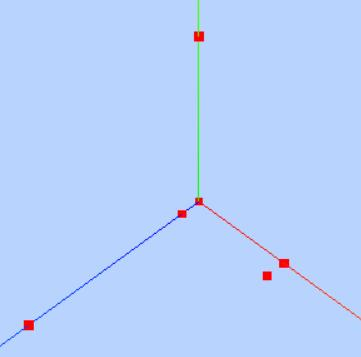
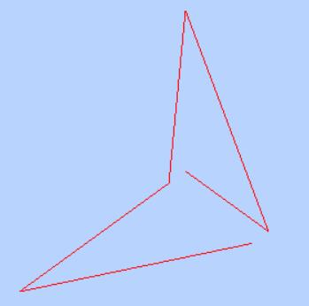

# 顶点位置数据解析渲染
如果你没有WebGL基础，可以先不用记忆每个的threejs 具体内容，有一个大致印象即可，学习本节课的重点是建立顶点的概念。如果你建立了顶点的概念，那么对于你深入理解学习Three.js很有帮助。

如果你已经有WebGL基础或者说图形学基础，说明你肯定有顶点的概念，本节课重点可以放在学习threejs的API使用细节，threejs引擎是如何封装webgl的。

## JavaScript类型化数组
本节课会用到javascript的类型化数组，你如果不了解，可查看MDN关于[javascript类型化数组](https://developer.mozilla.org/zh-CN/docs/Web/JavaScript/Typed_arrays)的介绍,也可以查看文章[类型化数组](http://www.yanhuangxueyuan.com/Javascript/typeArray.html)。

## 自定义几何体
你可以直接调用`BoxGeometry`直接创建一个立方体几何体，调用`SphereGeometry`创建一个球体几何体。不过为了大家更好的建立顶点概念，通过下面的代码自定义了一个几何体，通过网格模型可以渲染出来两个三角形效果。


下面代码通过Threejs引擎的[BufferGeometry](http://www.yanhuangxueyuan.com/threejs/docs/index.html#api/zh/core/BufferGeometry)和[BufferAttribute](http://www.yanhuangxueyuan.com/threejs/docs/index.html#api/zh/core/BufferAttribute)两个API自定义了一个具有六个顶点数据的几何体。
```js
var geometry = new THREE.BufferGeometry(); //创建一个Buffer类型几何体对象
//类型数组创建顶点数据
var vertices = new Float32Array([
  0, 0, 0, //顶点1坐标
  50, 0, 0, //顶点2坐标
  0, 100, 0, //顶点3坐标
  0, 0, 10, //顶点4坐标
  0, 0, 100, //顶点5坐标
  50, 0, 10, //顶点6坐标
]);
// 创建属性缓冲区对象
var attribue = new THREE.BufferAttribute(vertices, 3); //3个为一组，表示一个顶点的xyz坐标
// 设置几何体attributes属性的位置属性
geometry.attributes.position = attribue;
```
通过自定义的几何体创建一个网格模型。对于网格模型而言，几何体所有顶点每三个顶点为一组可以确定一个三角形，几何体是六个顶点，也就是说可以绘制两个三角形，当然了你可以自己再增加三个顶点位置坐标数据，测试下渲染效果。
```js
// 三角面(网格)渲染模式
var material = new THREE.MeshBasicMaterial({
  color: 0x0000ff, //三角面颜色
  side: THREE.DoubleSide //两面可见
}); //材质对象
var mesh = new THREE.Mesh(geometry, material); //网格模型对象Mesh
```
## 点模型Points
为了更好的理解几何体是由顶点构成的，可以把几何体geometry作为点模型`Points`而不是网格模型Mesh的参数，你会发现上面的六个点坐标会渲染为六个方形的点区域，可以用下面代码代替上面的网格模型部分代码测试效果。

对于网格模型`Mesh`而言，几何体geometry三个顶点为一组渲染出来一个三角形，对于点模型`Points`而言，几何体的每个顶点对应位置都会渲染出来一个方形的点区域，该区域可以设置大小。
```js
// 点渲染模式
var material = new THREE.PointsMaterial({
  color: 0xff0000,
  size: 10.0 //点对象像素尺寸
}); //材质对象
var points = new THREE.Points(geometry, material); //点模型对象
scene.add(points); //点对象添加到场景中
```



## 线模型`Line`
上面两个案例适用点模型和网格模型去渲染几何体的顶点数据，下面代码是把几何体作为线模型Line参数，你会发现渲染效果是从第一个点开始到最后一个点，依次连成线。
```js
// 线条渲染模式
var material=new THREE.LineBasicMaterial({
    color:0xff0000 //线条颜色
});//材质对象
var line=new THREE.Line(geometry,material);//线条模型对象
scene.add(line);//线条对象添加到场景中
```



## 几何体本质
查看下面一段代码，你可以看出来立方体网格模型Mesh是由立方体几何体geometry和材质material两部分构成，立方体几何体`BoxGeometry`本质上就是一系列的顶点构成，只是Threejs的API`BoxGeometry`把顶点的生成细节封装了，用户可以直接使用。比如一个立方体网格模型，有6个面，每个面至少两个三角形拼成一个矩形平面，每个三角形三个顶点构成，对于球体网格模型而言，同样是通过三角形拼出来一个球面，三角形数量越多，网格模型表面越接近于球形。
```js
var geometry = new THREE.BoxGeometry(100, 100, 100); //创建一个立方体几何对象Geometry
var material = new THREE.MeshLambertMaterial({
  color: 0x0000ff
}); //材质对象Material
var mesh = new THREE.Mesh(geometry, material); //网格模型对象Mesh
```


# 顶点颜色数据插值计算
上节课自定义几何体给大家介绍了一个顶点位置坐标概念，本节课给大家介绍一个新的几何体顶点概念，就是几何体顶点颜色。

通常几何体顶点位置坐标数据和几何体顶点颜色数据都是一一对应的，比如顶点1有一个顶点位置坐标数据，也有一个顶点颜色数据，顶点2同样也有一个顶点位置坐标数据，也有一个顶点颜色数据...

