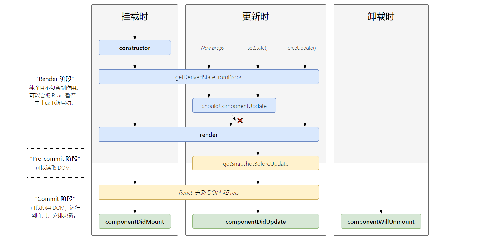

## react很简单
1. 1个新概念
2. 4个必须API
3. 单项数据流
4. 完善的错误提示

## 以组件方式考虑UI的构建
### 理解React组件

Props + State  = view

1. React组件一般不提供方法,而是某种状态机
2. React组件可以理解为一个纯函数
3. 单项数据绑定

### 创建一个简单的组件: TabSelect
1. 创建静态UI
2. 考虑组件的状态组成
3. 考虑组件的交互方式

### 受控组件
表单元素状态由使用者维护
```jsx
<input
    type="text"
    value="{this.state.value}"
    onChange = { evt =>  
    this.setState({value:evt.target.value})
    }
/>
```
### 非受控组件
表单元素状态DOM自身维护
```jsx
<input 
    type="text"
    ref={ node => this.input = node}
/>
```
### 何时创建组件: 单一职责原则
1. 每个组件只做一件事
2. 如果组件变得复杂,那么应该拆分成小组件

### 数据状态管理: DRY原则
1. 能计算得到的状态就不要单独存储
2. 组件尽量无状态, 所需数据通过`props`获取

### JSX: 在JavaScript代码中直接写HTML标记
```jsx
const name = 'Nate Wang';
const element = <h1>Hello, {name}</h1>;
```
### JSX的本质: 动态状创建组件的语法糖
```jsx
const name = 'Josh Perez';
const element = React.createElement('h1',null,'Hello, ',name);
```

详细示例:
```jsx
class CommentBox extends React.Component{
    render(){
        return (
            <div className="comments">
                <h1>Comments ({this.state.items.length})</h1>
                <CommentList data={this.state.items } />
                <CommentList/>
            </div>
        );
    }
}

ReactDOM.render(<CommentBox topicId="1" />, mountNode)
```
翻译成:
```jsx
class CommentBox extends React.Component{
    reader(){
        return React.createElement(
            'div',
            {className:"comments"},
            React.createElement(
            'h1',
            null,
            "Comments (",
            this.state.items.length,
            ")"
        ),
        React.createElement(CommentList, {data:  this.state.items }),
        React.createElement(CommentList,null)
        );
    }
}

ReactDOM.reader({
    React.createElement(CommentBox, {topicId:'1'}),
    mountNode
});
```


### 在JSX中使用表达式
1. jsx本身也是表达式

    ```jsx
    const element  = <h1>Hello, world!</h1>;
    ```
2. 在属性中使用表达式

    ```jsx
    <MyComponent foo={1 + 2 + 3 + 4} />
    ```
3. 衍生属性

    ````js
    const props = { firstName: 'ben'. lastName: 'Hector'};
    const greeting = <Greeting {..props}/>;
    ```
4. 表达式作为子元素

    ```jsx
    const element = <li>{props.message}</li>
    ```

### 约定: 自定义组件以大写字母开头
1. React认为小写的tag时原生DOM节点,如div
2. 大写字母开头为自定义组件
3. JSX标记可以直接使用属性语法, 例如 `<menu.item/>`
## 生命周期


图片来源: https://projects.wojtekmaj.pl/react-lifecycle-methods-diagram/

### reader阶段
纯净且没有副总用,可能会被react暂停, 中止或重新启动
### Pro-commit阶段

可以读取 DOM

### commit阶段
可以使用DOM, 运行副作用, 安排更新

## 生命周期方法
### constructor
1. 用于初始化内部状态,很少使用
2. 唯一可以直接修改 `state`的地方

### getDerivedStateFromProps
1. 当`state`需要从`props`初始化时使用
2. 尽量不要使用: 维护两者状态一致性会增加复杂度
3. 每次`render`都会调用
4. 典型场景: 表单控件获取默认值

### componentDIdMount
1. ui渲染完成后调用
2. 只执行一次
3. 典型场景: 获取外部资源

### componentWILLUnmount
1. 组件移除时被调用
2. 典型场景: 资源释放

### getSnapshotBeforeUpdate
1. 在页面render之前调用, state已更新
2. 典型场景: 获取render之前的DOM状态

### componentDidUpdate
1. 每次UI更新时被调用
2. 典型场景: 页面需要根据`props`变化重新获取数据

### shouldComponentUpdate
1. 决定 `Virtual DOM` 是否要重绘
2. 一般可以由`PureComponent`自动实现
3. 典型场景: 性能优化

