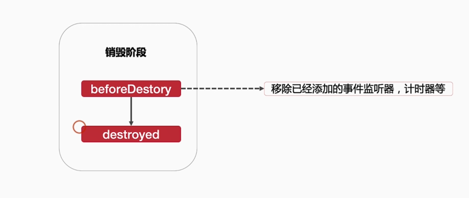

## vue的特点
1. 更加轻量20kb min + gzip
2. 渐进式框架
3. 响应式的更新机制
4. 学习成本低

## 环境搭建
- 浏览器: Chrome
- IDE: VS Code 或者 WebStorm
- Node.js 8.9+, npm

### Vue.component缺点
- 全局定义: 强制要求每个component中的命名不得重复
- 字符串模板: 缺乏语法高亮, 在HTML有多行的时候, 需要用到丑陋的 \
- 不支持CSS: 意味着当HTML和JavaScript组件化时, CSS明显被遗漏
- 没有构建步骤: 限制只能使用HTML和ES5 JavaScript, 而不能使用预处理器, 如Pug(formerly Jade) 和Babel
### Vue Cli
- npm install -g @vue/cli
- vue create hello-world
- cd hello-world
- npm run serve

## Vue组件的核心概念
组件:


Vue 组件 = Vue 实例 = new Vue(options)
### 属性
- 自定义属性 props 
    - 组件props中声明的属性
- 原生属性
    - 没有声明的属性, 默认自动挂载到组件根元素上, 设置inheritAttrs为 false 可以关闭自动挂载
- 特殊属性 class, style
    - 挂载到组件根原生上, 支持字符串, 对象, 数字等多种语法
### 事件
- 普通事件
  - @click, @input, @change, @xxx等事件, 通过this.$emit('xxx', ...) 触发
- 修饰符事件
  - @input.trim, @click.stop, @submit.prevent等, 一般用于原生HTML原生, 自定义组件需要自行开发支持
### 插槽
- 普通插槽

    - `<template slot="xxx">...</template>`
    - `<template v-slot:"xxx">...</template>`
- 作用域插槽
  - `<template slot="xxx" slot-scope="props">...</template>`
  - `<template v-slot:xxx="props" >...</template>`

### 双向绑定

model: 数据

view: 视图
什么是双向绑定:


什么是单向数据流


### 双向绑定 or 单向数据流
- Vue是单向数据流, 不是双向绑定
- Vue的双向绑定不过是语法糖
- Object.defineProperty是用来做响应式更新的, 和双向绑定没关系

语法糖:
```html
<PersonalInfo v-model="phoneInfo"
:zip-code.sync="zipCode" />
```
```html
<PersonalInfo 
    :phone-info="phoneInfo"
    @change="val =>(phoneInfo = val)"
    :zip-code="zipCOde"
    @update:zipCode="val => (zipCode=val)"
    />
```
### 数据驱动


### 数据来源(单向的)
- 来自父元素的属性
- 来自组件自身的状态 data
- 来自状态管理器, 如vuex, Vue.observable

### 状态data vs 属性 props
- 状态是组件自身的数据
- 属性是来自父组件的数据
- 状态的改变未必会触发更新
- 属性的改变未必会触发更新

### 响应式更新


### 计算属性 computed
- 减少模板中计算逻辑
- 数据缓存
- 依赖固定的数据类型(响应式数据)

### 侦听器 watch
- 更加灵活, 通用
- watch中可以执行任何逻辑, 如函数节流, Ajax异步获取数据, 甚至操作DOM
####  computed vs watch
- computed 能做的, watch都能做, 反之不行
- 能用computed的尽量用computed

## 生命周期


### 创建阶段


### 更新阶段


### 销毁阶段




## 函数式组件(临时变量)
- functional: true
- 无状态, 无实例, 没有this上下文, 无生命周期


## 指令
### 内置指令
- v-text
- v-html
- v-show
- v-if
- v-else
- v-else-if
- v-for
- v-on
- v-bind
- v-model
- v-slot
- v-pre
- v-cloak
- v-once
### 自定义指令
生命周期钩子
-  bind
-  inserted
-  update
-  componentUpdated
-  unbind

## 高级特性 provide/inject
### 组件通信


