## Ant Design 
网址:
https://ant.design/docs/spec/introduce-cn

## 设计价值观

### 自然
- 感知自然: 认知心理学所述，约 80% 外界信息通过视觉通道获取。界面设计中最重要的视觉要素，包括布局、色彩、插画、图标等，应充分汲取自然界规律，从而降低用户认知成本，带来真实流畅的感受。在一些场景下，适时加入听觉、触觉等其它感知通道，能创造更丰富自然的产品体验。
- 行为自然: 在与系统的互动中，设计者应充分理解用户、系统角色、任务目标间的关系，场景化组织系统功能和服务。同时辅以行为分析、人工智能、传感器、元数据等策略，提供主动式服务，帮助用户决策、减少操作，从而节约用户脑力和体力，让人机交互行为更自然。

### 确定性
界面是用户与系统交互的媒介，是手段而非目的。在追求「自然」交互基础上，通过 Ant Design 创造的产品界面应是高确定性、低合作熵的状态。

- 设计者确定：企业级产品都是分工合作的产物，参与者越多合作熵越高，这是一切设计工作低效、产品系统不易维护的来源。通过探索设计规律、模块化设计思路，来为设计者提供足够精简的设计规则、组件、模式等，赋能设计者、降低合作熵。
  - 保持克制： 能做，但想清楚了不做。设计者应当聚焦在最有价值产品功能打磨，并用尽可能少的设计元素将其表达。正如 Antoine de St.Exupery 所说：**完美不在于无以复加，而在于无可删减，万事莫不如此**。
  - 面向对象的方法： 探索设计规律，并将其抽象成「对象」，增强界面设计的灵活性和可维护性，同时也减少「设计者」的主观干扰，从而降低系统的不确定性。例如：色值换算、间距排版。
  - 模块化设计： 将复杂或者重复出现的局部封装成模块，提供有限接口与其他模块互动，最终全面减少系统的复杂度，进而增进可靠性以及可维护性。设计者可运用现有的组件/模板或者自行抽象可复用的组件/模板，节约无谓的设计且保持系统一致性，让「设计者」把创造力专注在最需要的地方。

- 用户确定：用户日常工作是通过诸多企业级产品的协同来完成的，除了考虑单一产品的设计一致性，更应当在跨产品、跨终端、跨系统间保持良好的确定性。**一致的外观和交互**，保持面向用户的熟悉感，能提升易学性，降低认知和操作成本，提升工作效率。

### 意义感
一个产品或功能被设计者创造出来不只是用户的需要，而更多是承载用户的某个工作使命。产品设计应充分站在工作视角，促成用户使命的达成；同时，在「自然」、「确定」之上，兼顾用户的人性需求，为工作过程创造富有意义感的人机交互。
- 结果的意义：明确目标，即时反馈。洞悉工作目标，根据使用流程拆解明确的子目标，让每个交互行为都围绕着主目标的达成；为每个行为，辅以恰当、即时的反馈，让用户对操作结果了然于胸。此外，可通过情感化设计，适度安抚用户负面情感，强化用户正面情感。
- 过程的意义：挑战适中，全情投入。调整不同场景下的工作难度，让功能适时适地触发，以匹配用户能力；如无必要，勿增实体，不分散用户注意力，让用户专注于任务达成，而非界面。让当下的工作既不过于简单，亦不过于复杂，挑战适中，并随着用户能力的成长提出更高的挑战，能让用户持续沉浸在工作的心流中，获得富有成就感的工作体验。

## 生长性
企业级产品功能的增长与用户系统角色的演变相生相伴。设计者应为自己创造的产品负责，提升功能、价值的可发现性。用发展的眼光做设计，充分考虑人、机两端的共同生长。

- 价值连接：产品的增长依赖于用户的群体扩大和深度使用，而用户的成长又依赖于产品功能的壮大。设计者应建立系统设计思维，洞悉产品功能的价值，探索用户在不同场景下的需求，在价值和需求间建立连接。让产品价值被发现，帮助用户建立更有效、更高效的工作方式。

- 人机共生：产品功能和用户需求的更多连接，让人机互动更加紧密，用户和系统共生。产品设计时，不应将用户和系统独立开来，应作为一个动态发展的共同体来思考，确保其足够的灵活、包容，充满生命力。

# 全局样式
## 色彩
Ant Design 将色彩体系解读成两个层面：系统级色彩体系和产品级色彩体系。

系统级色彩体系主要定义了蚂蚁中台设计中的基础色板、中性色板和数据可视化色板。

产品级色彩体系则是在具体设计过程中，基于系统色彩进一步定义符合产品调性以及功能诉求的颜色。

### 基础色板
- Dust Red / 薄暮   斗志, 奔放
- Volcano / 火山   醒目, 澎湃
- Sunset Orange / 日暮 温暖, 欢快
- Calendula Gold / 金盏花  活力, 积极
-  Sunrise Yellow / 日出 出生, 阳光
-  Lime / 青柠 自然, 生机
-  Polar Green / 极光绿  健康, 创新
-  Cyan / 明青 希望, 坚强
-  Daybreak Blue / 拂晓蓝 包容, 科技, 普惠
-  Geek Blue / 极客蓝  探索, 钻研
-  Golden Purple/ 酱紫  优雅, 浪漫
-  Magenta / 法式洋红  明快, 感性

### 色板
#### 颜色映射原理
颜色有三个视觉通道，分别是色调（H）、饱和度（S）、明度（B），不同的视觉通道可以与不同的数据类型建议关联。

**色调（H）：通常使用颜色中的不同色调来描述不同的分类数据**，如水果品类中苹果映射为红色、香蕉映射为黄色、梨映射为绿色，将品类与色调（H）建立了关联。

**饱和度（S）/明度（B）：颜色通过明暗、饱和度的共同变化来描述有序或数值型的连续数据**，比如身高由低到高或由 160cm 到 180 cm 的颜色映射为由浅到深，将连续变化与颜色的明暗饱和变化建立关联。

#### 6大色板类型
- 分类色板
  - 分类色板用于描述分类数据，如苹果、香蕉、梨，常用一个颜色代表一个值以区分不同类型，取色时色相分布均衡，相邻颜色之间明暗需考虑差异性，常用于饼图的不同分类、填充地图中的不同国家、关系图中的不同角色等
- 顺序色板
  - 顺序色板，一般使用同一或邻近色相，通过明度或饱和度的渐变，常用来表示同一事物中的数值大小或梯度变化，如排行榜等级变化、一个国家或地区的新增人口数对比、风险等级变化等。
- 单色顺序色板
  -  单一色相渐变称之为单色顺序色板，人眼可识别的色彩数量 5 ～ 7 个，为保证信息的最佳识别度，尽可能的克制使用颜色数量
- 邻近色顺序色板

  - 为拉开颜色差异，可用两个或以上个色相，通过明度或饱和度渐变，颜色连续而丰富，可产生更多色彩分级，表达更多的连续数值，常用于热力图中的热度变化，通过邻近色相的差异将聚集部分突显出来
- 发散色板
  - 对比色渐变色板，一般是两种互补色（也可以是对比色）去展现数据从一个负向值到 0 点再到正向值的连续变化区间，显示相对立的两个值的大小关系，常用于气温的冷热、海拔高低、股票涨跌等
- 叠加色板
  - 叠加色板，为了色尽其用的原则，将两组顺序色板通过图层叠加模式产生一组新的色板，一个颜色代表两种变量数据，常用于观察一个事物两个维度变化的相关性，如胖瘦和高矮两个维度的人数分布中，瘦且高的人群分布。
- 强调色板
  - 对比突出重点或特定数据，将重点关注的数据标以高饱和度的强调色，其他普通数据标以低饱和、低明度的基本色，常用于对比重点关注事物与其他分类事物的差别，如将自家产品与竞品的对比使用
- 语义色板
  - 色彩在可视化中的使用，不仅是数据信息传递的可视化通道，同时也是更深一层的文化故事的载体，用于表达意义或情感。重视用色习惯，遵循相关标准，色彩也不是都能寓意的，相当一部分图表色彩选择和感情因素无关，而是按照某种习惯来设定色彩，即所谓约定俗成，有的甚至形成来规范。如气象预警配色，红绿灯配色，股市的红涨绿跌等。
  - red  表达 负面的, 不可行, 严重, 危险, 失败, 热量等含义
  - Green 表达正面的, 可行, 植物, 安全,成功等含义
  - Yellow 表达警告, 注意, 阻止等含义
  
### 8 条使用建议
1. 避免使用过多颜色
   
   在实际应用中，经常会出现大量颜色使用的误区，建议高亮重要的数据（不超过 8 个），其他数据默认置灰，通过图例交互进行查看。
2. 数据映射规则从简

    同样的数据，映射规则尽量保持为一种。
3. 选择准确的色板

    对应自己的数据，按照数据特性选用对的色板，下图中分类数据应选用分类色板，而不是连续色板。

4. 解释你的颜色
    
    当图表中出现不同颜色时，需要向读者解释颜色代表的含义。

5. 保持颜色一致性
    
    对于统一度量，使用同样的颜色方案，而且在整个页面（通常是仪表盘）使用时，注意保持整体颜色方案的一致性。

6. 彩虹色环不连续
    
    不以色环顺序来表达连续的有序型或数值型数据，因为色环顺序并非人眼自然记忆，且彩虹色变化并非均衡变化，如下图中灰阶的转化，很容易看出彩虹色并不是一个连续逐渐加深的色板，因此彩虹色环并不适合展示连续数据，容易引起误解。
7. 顺序色板需均衡

    下图右侧「不建议」图中，第 2 、第 3 个颜色很相近，难以区分，第 3 、第 4 个颜色跳跃很大，对于均衡的连续数据表达中，容易引起数据感知的误差，均衡选色可在 PhotoShop 的拾色器中使用 Lab 模式下固定色相不变，调节 L 值进行等距取色。

8. 为视障群体设计    
    - 分类色板选取需明暗交替

        虽然正常人眼中右侧分类色板通过色相可以区分差异，但在视障人士、甚至全色盲，则主要靠颜色的明暗差异来识别不同的数据类型，因此分类色板需要注意适度的明暗交替
   - 离散色板尽量选取蓝黄对比

     一般场景中，我们常也会使用黄绿配色，黄绿对比中，黄是暖色系，绿是冷色系，同样能给到对比感受，且打破常规的蓝红对比色，给到新颖的色彩感受，但如果你的用户中视障人士占比较多，则尽量避免绿黄配色，如图为两种色板在正常人眼和红绿色盲眼中的对比效果，黄绿配色在红绿色盲眼中就失去了色彩对比，难以区分。

## 布局
在中后台视觉体系中定义布局系统，我们建议从 5 个方面出发：

1. 统一的画板尺寸
2. 适配方案
3. 网格单位
4. 栅格
5. 常用模度

### 统一画板
为了尽可能减少沟通与理解的成本，有必要在组织内部统一设计板的尺寸。蚂蚁中台设计团队统一的画板尺寸为 1440。

### 适配
在设计过程中，设计师还需要建立适配的概念，根据具体情况判断系统是否需要进行适配，以及哪些区块需要考虑动态布局。据统计，使用中台系统的用户的主流分辨率主要为 1920、1440 和 1366，个别系统还存在 1280 的显示设备。

Ant Design 两种较为典型的适配方案：

#### 一、左右布局的适配方案
常被用于左右布局的设计方案中，常见的做法是将左边的导航栏固定，对右边的工作区域进行动态缩放。

#### 二、上下布局的适配方案
常被用于上下布局的设计方案中，做法是对两边留白区域进行最小值的定义，当留白区域到达限定值之后再对中间的主内容区域进行动态缩放。

这里提及的只是非常简单的两种适配的思路，实际设计中一套完美的适配方案需要设计师具备前端视角、平面构图视角以及交互视角。

### 网格单位
Ant Design 通过网格体系来实现视觉体系的秩序。网格的基数为 8，不仅符合偶数的思路同时能够匹配多数主流的显示设备。通过建立网格的思考方式，还能帮助设计者快速实现布局空间的设计决策同时也能简化设计到开发的沟通损耗。

### 关于栅格
Ant Design 采用 24 栅格体系。以上下布局的结构为例，对内容区域进行 24 栅格的划分设置，如下图所示。我们为页面中栅格的 Gutter 设定了定值，即浏览器在一定范围扩大或缩小，栅格的 Column 宽度会随之扩大或缩小，但 Gutter 的宽度值固定不变。

对开发者而言栅格是实现动态布局的手段，而设计师对于栅格的理解源自平面设计中的栅格。在具体落地中视角的不同就容易造成偏差，最终影响还原度，继而增加沟通成本。

Ant Design 的设计师通过 4 点来实现设计过程中和工程师的沟通：

1. 清晰的定义动态布局范围
2. 尽量保持偶数思维
3. 关键数据的交付（Gutter、Column）
4. 区块的定义要从 column 开始到 column 结束

## 字体
字体是体系化界面设计中最基本的构成之一。

我们的用户通过文本来理解内容和完成工作，科学的字体系统将大大提升用户的阅读体验及工作效率。Ant Design 字体方案，是基于「动态秩序」的设计原则，结合了自然对数以及音律的规则得出的，再经过了大量的蚂蚁中后台产品验证之后，推荐给大家。在中后台视觉体系中定义字体系统，我们建议从下面五个方面出发：

1. 字体家族
2. 主字体
3. 字阶与行高
4. 字重
5. 字体颜色

### 建议
字体系统的构建，是「动态秩序之美」的第一步。在实际的设计中，我们还有三点建议：

1. 建立体系化的设计思路：在同一个系统的 UI 设计中先建立体系化的设计思路，对主、次、辅助、标题、展示等类别的字体做统一的规划，再落地到具体场景中进行微调。建立体系化的设计思路有助于强化横向字体落地的一致性，提高字体应用的性价比，减少不必要的样式浪费。
2. 少即是多：在视觉展现上能够用尽量少的样式去实现设计目的。避免毫无意义的使用大量字阶、颜色、字重强调视觉重点或对比关系。
3. 尝试让字体像音符一样跳跃：在需要拉开差距的时候可以尝试在字阶表中跳跃的选择字体大小，会令字阶之间产生一种微妙的韵律感。

## 图标
图标是UI设计中必不可少的组成. 通常我们理解图标设计的含义，是将某个概念转换成清晰易读的图形，从而降低用户的理解成本，提升界面的美观度。在我们的企业级应用设计范围中，图标在界面设计的诸多元素中往往只占了很小的比重，在调用时也会被缩到比设计稿小很多倍的尺寸，加上在图形素材极度丰富并且便于获取的今天，在产品设计体系中实现一套美观、一致、易用、便于延展的图标体系往往会被不小心忽略掉。Ant Design 相信一整套优质的图标对于设计质量的影响是非常巨大的，这考验着设计师的协作能力，以及对图形塑造的系统性思维，同时也能反映一个团队对于细节的追求。

### 设计原则
Ant Design 的图标设计原则源自 "确定" 和 "自然", 落实到图标设计领域, 一共有四个, 他们分别为:
- 准确: 设计造型准确的图标（保持偶数原则，去小数点）；选择表意准确的图标，不对用户的认知造成困扰。
- 简单： 在表意清晰准确的基础上，尽量保持图形的简洁，不做多余的修饰。
- 节奏： 挖掘构图中的秩序之美。
- 愉悦： 赋予适度的情感。

### 图标设计指引
根据"确定性"和"自然"的价值观，当构图含义明确之后，图标设计所追求的便是秩序之美。Ant Design 的图标主要通过四方面去实现"秩序美"，分别是：形式、韵律、平衡以及辨识。
#### 1. 形式
形式, 是构成一个图形最初始的结构. Ant Design 整套基础图标基本上都是由圆, 方, 三角这样的图形演变而成的. 追求图形初始结构的理性, 而非直觉式的设计, 是秩序之美的第一步.

#### 2. 韵律
Ant Design 图标的韵律感通过两个方面来体现：元素的韵律和构图的韵律。系统图标中最常见的元素基本上可以归纳称为：点、线、圆角、三角。

##### 2.1 元素的韵律
- 点:  点是很多图形中都会出现的元素. Ant Design 会在一套图标中挖掘同一元素的规律, 同时对其进行克制的运用. 我们对于点的尺寸选择上会保持 16 的 倍数这一原则. 比如，在点的选择中，新版的图标最常用的是四种尺寸的点，分别为 80、96、112、128。当出现特殊尺寸的需求时，会按照 16 的倍数进行延展。
- 线： 线条也是非常通用的元素之一。新版图标在线条之间的关系采用 8 倍数原则，从小到大以 8 的规律递增。常用的规格也是 4 种，分别为 56、64、72、80。
- 圆角： 圆角的规格采取的也是 8 倍数原则，最常用的是 3 种，分别是 8，16、32，它们之间是两倍数的关系。而图标内部空间的圆角则保持直角的处理方式。
- 三角: 新版图标的角度受到美式战斗机 F-14 tomcat 的启发，将常用的角度定在约 76 度。在日常设计中，多数系统图标的角度都可以从 76 度这个数值出发，根据实际情况进行灵活的应用。

##### 2.2 构图的韵律
在图标体系中, 除了对重复出现的元素进行管理之外, 我们还建议通盘的去考虑设计构图上的节奏感

- 保持类似图标在构造上的一致性也是建立图标体系节奏感的一种方法。

    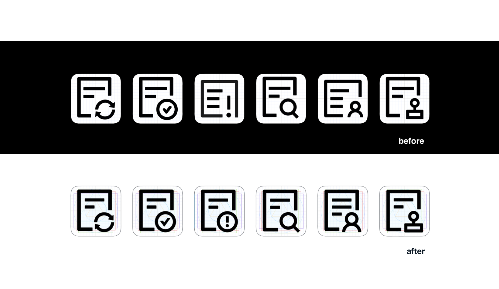

-  此外，在单个图标的设计过程中，也建议适当理性的看待各元素间的比例关系，而非直觉式的开展绘制。

#### 3. 平衡
要保持整套图标在视觉重量上的平衡，是一件不太容易的事并且是一件需要大量实践的工作。图标的造型、线条摆放的角度甚至是留白空间等，都是会影响视觉平衡的因素，因此需要设计师适时的通过对基本元素规格上的微调来达到图标的平衡感。
- 弯曲的线条会比竖直的线条看起来细。 因此在圆形的外边框上我们会适当的对 72px 的规格进行 4 px 的微调。

    

- 倾斜的线条也会比竖直的线条看起来细。 因此倾斜的线条也会进行 4 px 的微调

    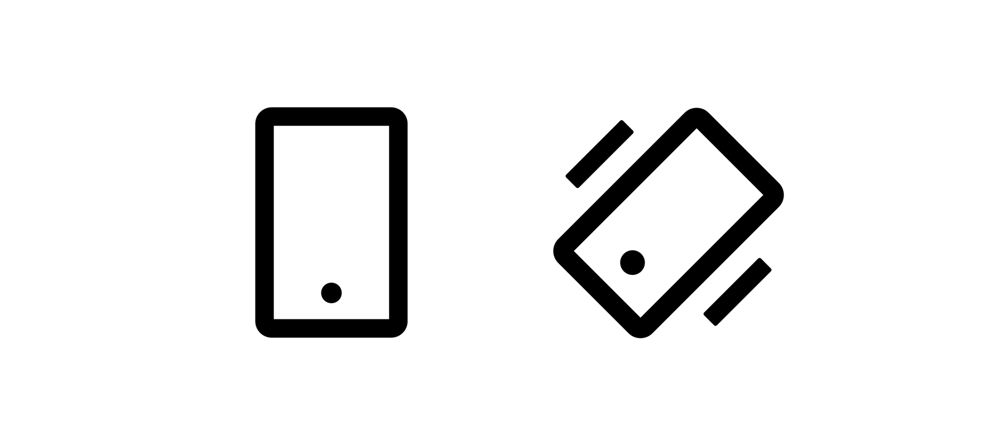

- 图形的留白空间也是值得推敲的课题。 当某些图形的留白不足时，可以通过调节线条的粗细来达到视觉重量上的平衡。

    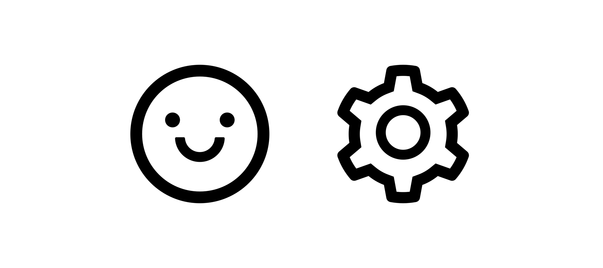

#### 4. 辨识
辨识度是一套图标具备的可被感知的特色，通常和系统本身的品牌基因相关。Ant Design 的系统图标在这一次除了遵循"确定"和"自然"这两块价值观，在辨识度这一块也做了两处小尝试。

- 让科技有温度: 通过对于图形圆角的定义, 过于圆润的圆角（72）调整至（32），在视觉效果上令图标看起来更为坚硬和理性（对应科技感），但又不至于太过尖锐（有温度）。

    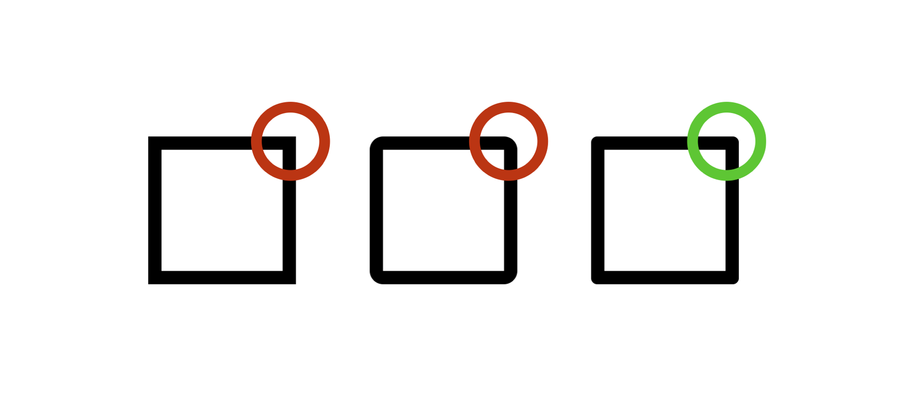

- 让图形有生命： 在部分图标设计中，会适度的注入拟人化的元素，令图标具备生命力。

    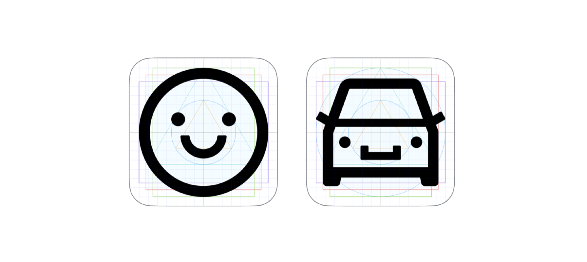

## 阴影
阴影来源于现实生活的反映物体与物体之间距离的物理现象。在界面中，我们往往通过模拟元素的投影直截了当的来告诉用户，元素之间的高度距离与层次关系。

### 高度
阴影是由两个不同阶层的平面产生，且强度由两者之间的距离决定。所以物体的高度直接影响物体的阴影，对象离地面越远阴影越大，模糊值越高。我们将系统分为无、低、中、高四个 UI 层级，各自分布在不同的高度层级，阴影属性也有所不同。

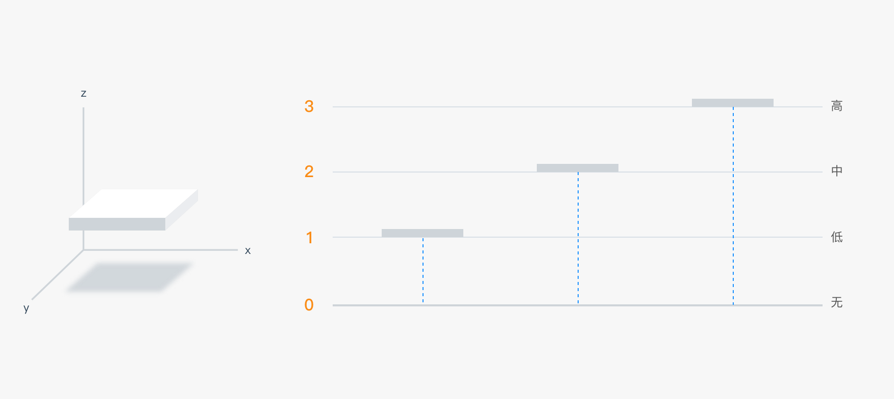

第 0 层：物体紧贴地面，投影与物体完全重叠，在界面中不对此层定义阴影值。如：输入框等；

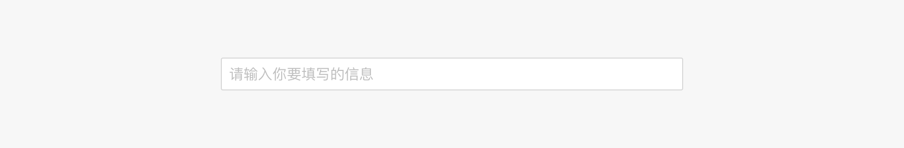

第 1 层: 物体位于低层级，此时物体被操作(悬停、点击等)触发为悬浮状态，当操作完成或取消时，悬停状态反馈也跟随消失，物体回归到原有的层级中，如：卡片 hover 等；

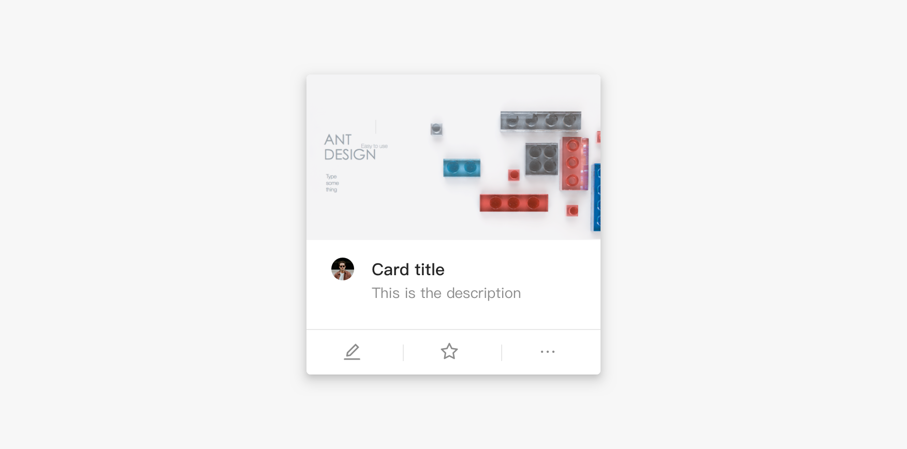

第 2 层：物体位于中层级，此时物体与基准面的关系是展开并跟随，物体由地面上的元素展开产生，会跟随元素所在层级的移动而移动，如：下拉面板等；

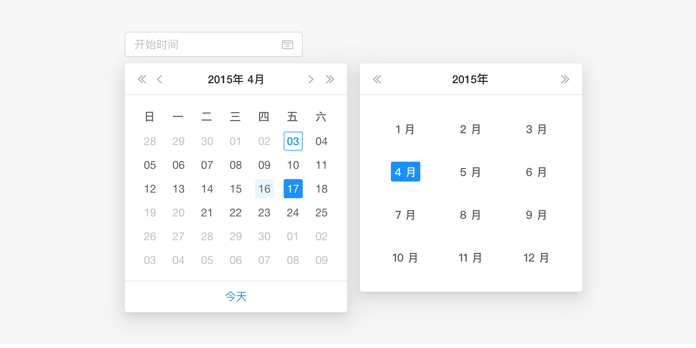

第 3 层：物体位于高层级，该物体的运动和其他层级没有关联，如：对话框等。

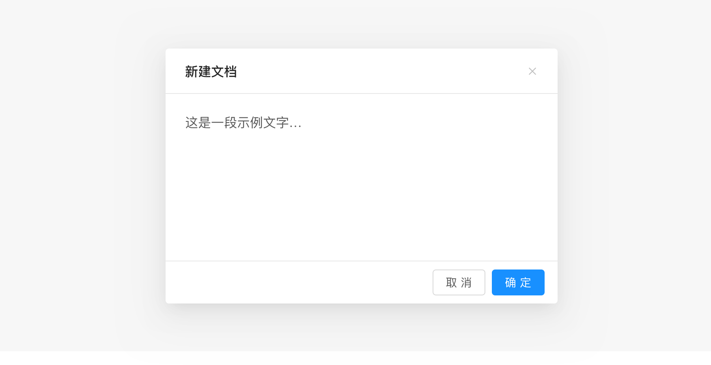

### 光源
阴影的方向是由光源与物体的相对位置所决定的。假定光源所处高度不变，光源与物体的距离和物体与阴影的距离成正比。光源越远，则阴影距离物体越远。阴影的方向在界面里通常使用 `X, Y` 坐标轴来表示。

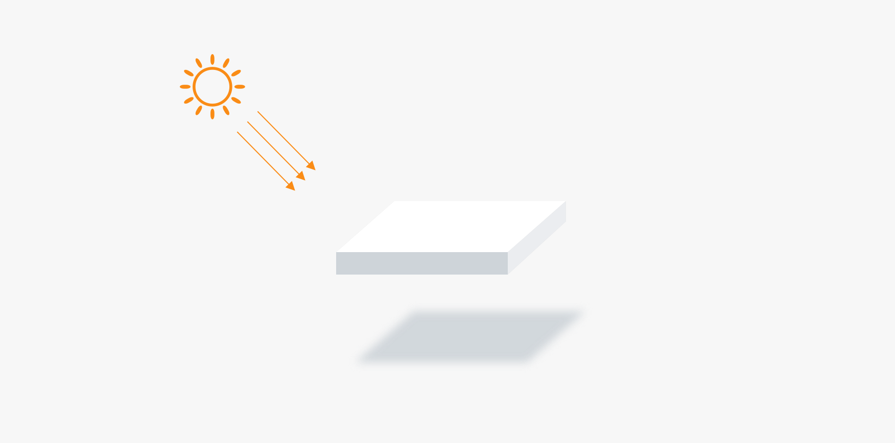

### 阴影值
综上可知。阴影由光照而产生。主要影响其值的是物体高度与光源位置：
1. 在不同高度上时, 投射出的阴影颜色、模糊度、面积都有所区分。离地面越远的物体，产生的阴影颜色越淡、模糊度越高、面积越大；反之则颜色更深、模糊度越低、面积越小；
2. 而投影的方向主要由光源与物体的相对位置决定。

在 Ant Design 中不同的阴影方向使用在不同的地方:

- 阴影向下: 主要应用于组件内部或组件本身, 是比较常规场景的用法
- 阴影向上: 主要应用于底部导航或工具栏等
- 阴影向左：主要应用于右边导航栏、抽屉组件或固定表格栏
- 阴影向右：主要应用于左边导航栏、抽屉组件或固定表格栏

阴影是模拟的真实世界的反馈，Ant Design 为了更符合真实阴影，在 4.0 中采用了三层阴影的表达方式，让阴影更柔和，更符合真实状态

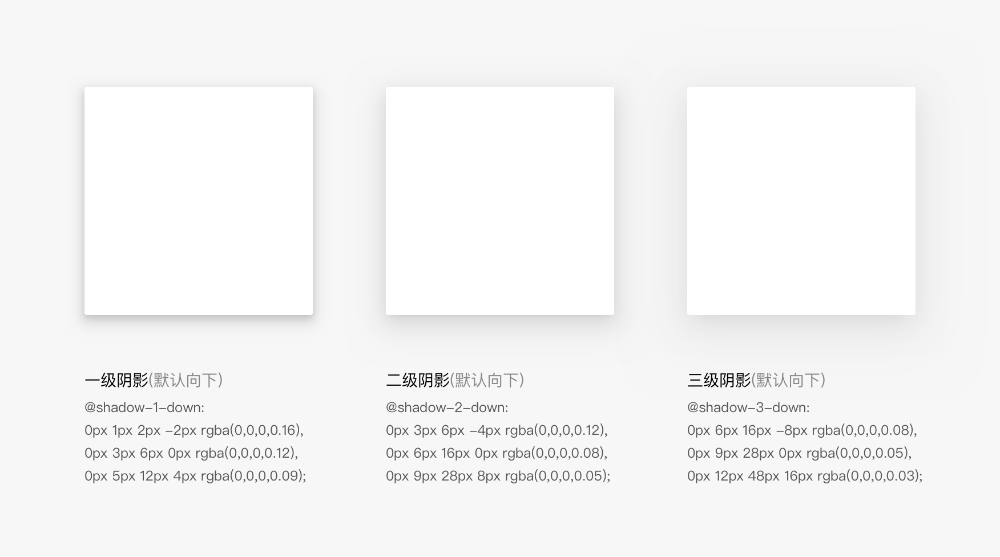

### 常用阴影设计表
第一层:

| 阴影类型        | 阴影颜色(rgba)      | 方向(x,y) | 模糊度(Blur) | 扩展值（Spread） |
| --------------- | ------------------- | --------- | ------------ | ---------------- |
| @shadow-1-up    | rgba(0, 0, 0, 0.16) | 0px, -1px | 2px          | -2px             |
| @shadow-1-up    | rgba(0, 0, 0, 0.12) | 0px, -3px | 6px          | 0px              |
| @shadow-1-up    | rgba(0, 0, 0, 0.09) | 0px, -5px | 12px         | 4px              |
| @shadow-1-down  | rgba(0, 0, 0, 0.16) | 0px, 1px  | 2px          | -2px             |
| @shadow-1-down  | rgba(0, 0, 0, 0.12) | 0px, 3px  | 6px          | 0px              |
| @shadow-1-down  | rgba(0, 0, 0, 0.09) | 0px, 5px  | 12px         | 4px              |
| @shadow-1-left  | rgba(0, 0, 0, 0.16) | -1px, 0px | 2px          | -2px             |
| @shadow-1-left  | rgba(0, 0, 0, 0.12) | -3px, 0px | 6px          | 0px              |
| @shadow-1-left  | rgba(0, 0, 0, 0.09) | -5px, 0px | 12px         | 4px              |
| @shadow-1-right | rgba(0, 0, 0, 0.16) | 1px, 0px  | 2px          | -2px             |
| @shadow-1-right | rgba(0, 0, 0, 0.12) | 3px, 0px  | 6px          | 0px              |
| @shadow-1-right | rgba(0, 0, 0, 0.09) | 5px, 0px  | 12px         | 4px              |

第二层

| 阴影类型        | 阴影颜色（rgba）    | 方向（X, Y） | 模糊度（Blur） | 扩展值（Spread） |
| --------------- | ------------------- | ------------ | -------------- | ---------------- |
| @shadow-2-up    | rgba(0, 0, 0, 0.12) | 0px, -3px    | 6px            | -4px             |
| @shadow-2-up    | rgba(0, 0, 0, 0.08) | 0px, -6px    | 16px           | 0px              |
| @shadow-2-up    | rgba(0, 0, 0, 0.05) | 0px, -9px    | 28px           | 8px              |
| @shadow-2-down  | rgba(0, 0, 0, 0.12) | 0px, 3px     | 6px            | -4px             |
| @shadow-2-down  | rgba(0, 0, 0, 0.08) | 0px, 6px     | 16px           | 0px              |
| @shadow-2-down  | rgba(0, 0, 0, 0.05) | 0px, 9px     | 28px           | 8px              |
| @shadow-2-left  | rgba(0, 0, 0, 0.12) | -3px, 0px    | 6px            | -4px             |
| @shadow-2-left  | rgba(0, 0, 0, 0.08) | -6px, 0px    | 16px           | 0px              |
| @shadow-2-left  | rgba(0, 0, 0, 0.05) | -9px, 0px    | 28px           | 8px              |
| @shadow-2-right | rgba(0, 0, 0, 0.12) | 3px, 0px     | 6px            | -4px             |
| @shadow-2-right | rgba(0, 0, 0, 0.08) | 6px, 0px     | 16px           | 0px              |
| @shadow-2-right | rgba(0, 0, 0, 0.05) | 9px, 0px     | 28px           | 8px              |

第三层：

| 阴影类型        | 阴影颜色（rgba）    | 方向（X, Y） | 模糊度（Blur） | 扩展值（Spread） |
| --------------- | ------------------- | ------------ | -------------- | ---------------- |
| @shadow-3-up    | rgba(0, 0, 0, 0.08) | 0px, -6px    | 16px           | -8px             |
| @shadow-3-up    | rgba(0, 0, 0, 0.05) | 0px, -9px    | 28px           | 0px              |
| @shadow-3-up    | rgba(0, 0, 0, 0.03) | 0px, -12px   | 48px           | 16px             |
| @shadow-3-down  | rgba(0, 0, 0, 0.08) | 0px, 6px     | 16px           | -8px             |
| @shadow-3-down  | rgba(0, 0, 0, 0.05) | 0px, 9px     | 28px           | 0px              |
| @shadow-3-down  | rgba(0, 0, 0, 0.03) | 0px, 12px    | 48px           | 16px             |
| @shadow-3-left  | rgba(0, 0, 0, 0.08) | -6px, 0px    | 16px           | -8px             |
| @shadow-3-left  | rgba(0, 0, 0, 0.05) | -9px, 0px    | 28px           | 0px              |
| @shadow-3-left  | rgba(0, 0, 0, 0.03) | -12px, 0px   | 48px           | 16px             |
| @shadow-3-right | rgba(0, 0, 0, 0.08) | 6px, 0px     | 16px           | -8px             |
| @shadow-3-right | rgba(0, 0, 0, 0.05) | 9px, 0px     | 28px           | 0px              |
| @shadow-3-right | rgba(0, 0, 0, 0.03) | 12px, 0px    | 48px           | 16px             |

## 暗黑模式
暗黑模式是指把所有 UI 换成黑色或者深色的一个主题模式。

### 何时使用
- 当需要长时间在暗光环境下工作时，建议使用暗黑模式，减小亮度对比带来的视觉压力，保证使用者的体验舒适。
- 当需要沉浸式的专注工作内容时，建议使用暗黑模式，可以帮助使用者更关注凸显出来的内容和操作。
  >如同在电影院看电影时要全场关灯，是一样的原理。

### 设计原则
1. 内容的舒适性
   
    暗黑模式下避免使用对比很强的色彩或内容，长时间使用会带来疲劳感。

2. 信息的一致性

    暗黑模式下的信息内容需要和浅色模式保持一致性，不应该打破原有的层级关系。

# 设计模式
## 概览
### 原则
基于价值观衍生出的一般设计技巧，包括如何高效组织信息、帮助建立用户与界面的互动等原则性要求。
### 全局规则
通过规范常见的互动行为，包括导航、数据录入、数据展示、反馈、操作、帮助等，呈现组件元素的标准用法和弹性空间，并了解如何将他们组织在一起来创建良好的体验。
### 模板文档
基于蚂蚁中台的设计经验，我们总结了表单、列表、数据可视化、详情页、工作台、异常、结果、编辑器几类页面的典型解决方案，介绍每类页面的设计目标、设计技巧以及典型页面内容等，帮助广大设计者可以快速开始构建界面。你还可以在 [Ant Design Pro](https://pro.ant.design/index-cn) 里在线预览这些典型页面。

## 原则
### 亲密性
如果信息之间关联性越高, 它们之间的距离就应该越接近，也越像一个视觉单元；反之，则它们的距离就应该越远，也越像多个视觉单元。亲密性的根本目的是实现组织性，让用户对页面结构和信息层次一目了然。

#### 纵向间距关系

>纵向间距示例
>
>在 Ant Design 中，这三种规格分别为：8px（小号间距）、16px（中号间距）、24px（大号间距）。

通过「小号间距」、「中号间距」、「大号间距」这三种规格来划分信息层次。

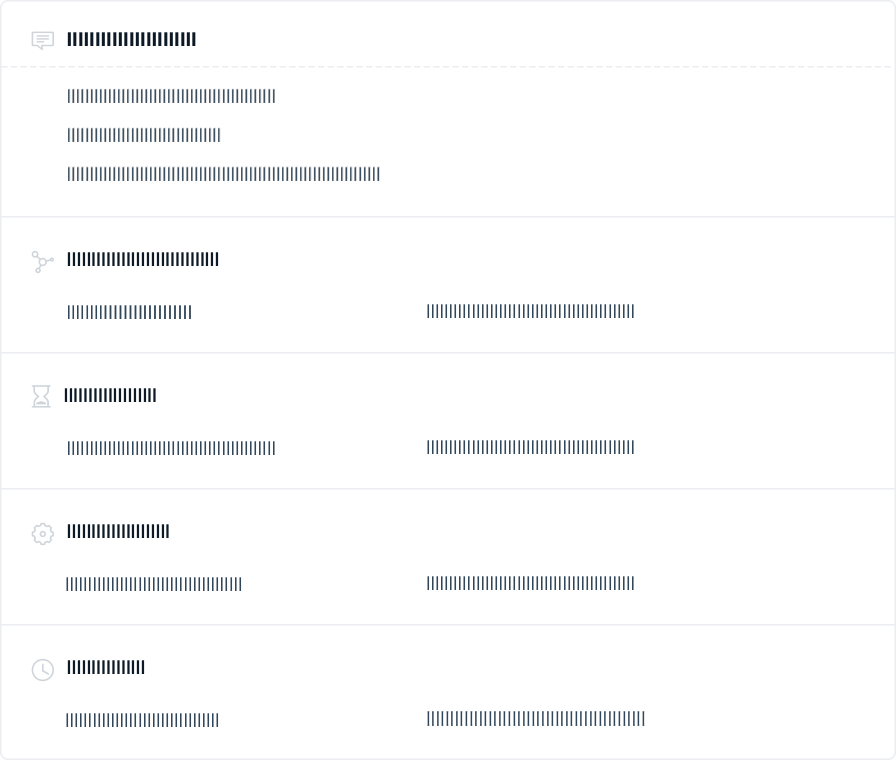

>增加元素示例
>通过增啊及 [分割线] 来拉开层次

在这三种规格不适用的情况下, 可以通过加减 [基础间距] 的 倍数, 或者增加元素来拉开信息层次.

>注：在 Ant Design 中，`y = 8 + 8 * n`。其中，`n >= 0`，y 是纵向间距，8 是「基础间距」。

#### 横向间距关系

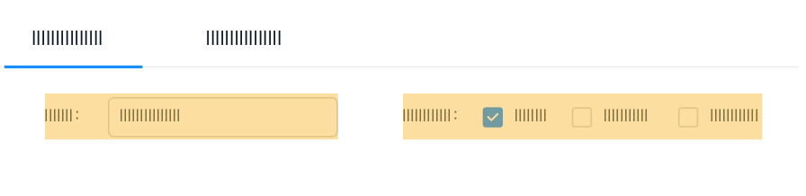

>组合排布示例

为了适用不同尺寸的屏幕，在横向采用栅格布局来排布组件，从而保证布局的灵活性。

>复选框内示例

在一个组件内部，元素的横向间距也应该有所不同。
### 对齐
正如「格式塔学派」中的连续律（Law of Continuity）所描述的，在知觉过程中人们往往倾向于使知觉对象的直线继续成为直线，使曲线继续成为曲线。在界面设计中，将元素进行对齐，既符合用户的认知特性，也能引导视觉流向，让用户更流畅地接收信息。
>格式塔学派（德语：Gestalttheorie）：是心理学重要流派之一，兴起于 20 世纪初的德国，又称为完形心理学；主张人脑的运作原理是整体的，「整体不同于其部件的总和」。——摘自「维基百科」

#### 文案类对齐
>推荐示例:
>
>标题和正文左对齐，使用了一个视觉起点。

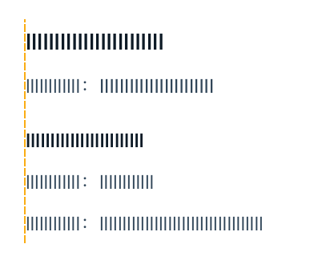

>不推荐示例
>
>标题和正文使用了两个视觉起点，不推荐该种对齐方式，除非刻意强调两者区别。

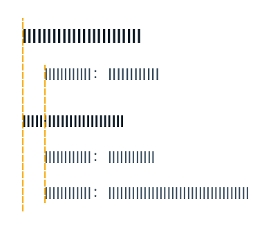

如果页面的字段或段落较短、较散时，需要确定一个统一的视觉起点。

#### 表单类对齐

>冒号对齐示例

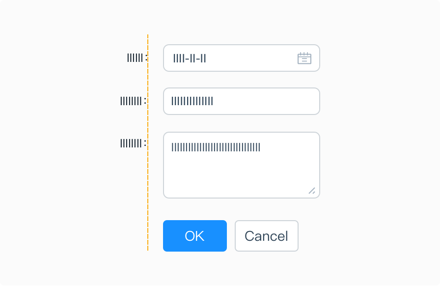

冒号对齐（右对齐）能让内容锁定在一定范围内，让用户眼球顺着冒号的视觉流，就能找到所有填写项，从而提高填写效率。

#### 数字类对齐
> 正确示例:

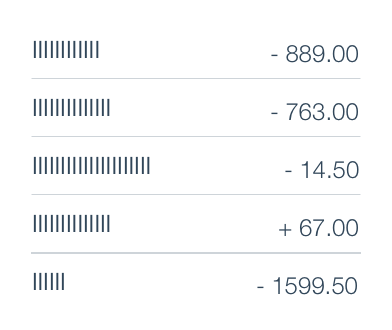

>错误示例:

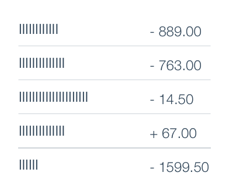

为了快速对比数值大小，建议所有数值取相同有效位数，并且右对齐。

### 对比
对比是增加视觉效果最有效方法之一, 同时也能在不同元素之间建立一种有组织的层次结构, 让用户快速识别关键信息.

>注：要实现有效的对比，对比就必须强烈，切不可畏畏缩缩。

#### 主次关系对比
>正确示例

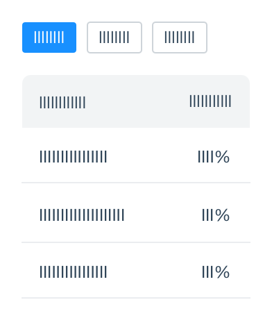

>错误示例

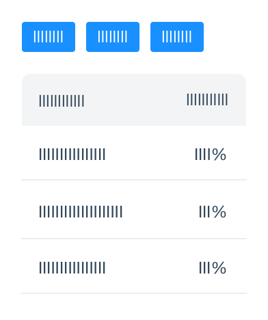

为了让用户能在操作上（类似表单、弹出框等场景）快速做出判断， 来突出其中一项相对更重要或者更高频的操作。

>注意：突出的方法，不局限于强化重点项，也可以是弱化其他项。

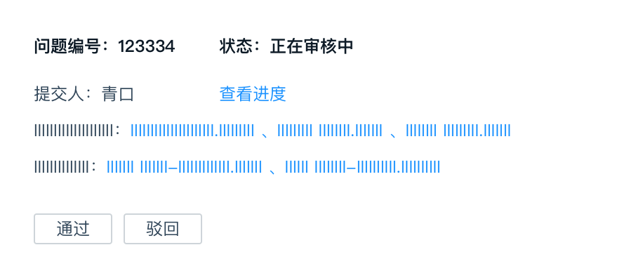

>不区分主次的示例:
>
>「通过」和「驳回」都使用次按钮，系统保持中立。

在一些需要用户慎重决策的场景中，系统应该保持中立，不能替用户或者诱导用户做出判断。

#### 总分关系对比
>总分关系示例 1

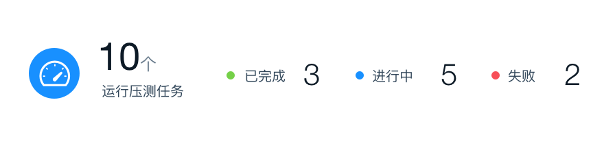

>总分关系示例 2

通过调整排版、字体、大小等方式来突出层次感，区分总分关系，使得页面更具张力和节奏感。

#### 状态关系对比

静态对比示例
>用不同颜色点，来表明不同状态。

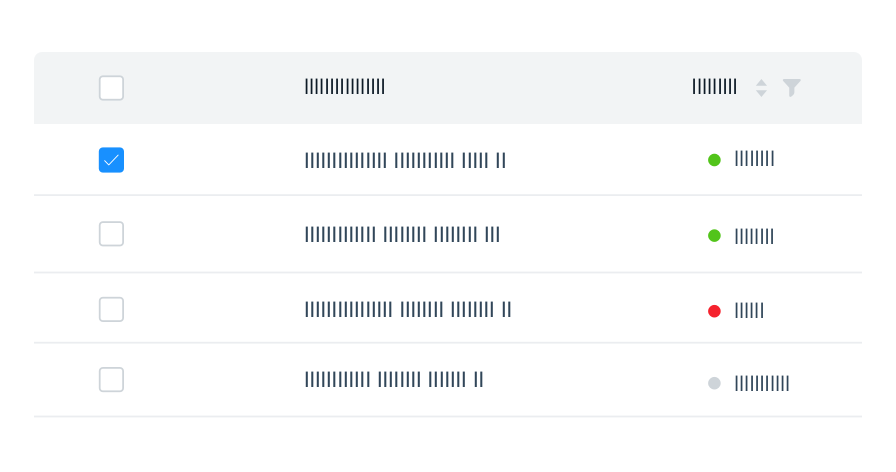

动态对比示例
>鼠标悬停时，该项和其他项呈现出明显不同的视觉效果，响应用户操作。

通过改变颜色、增加辅助形状等方法来实现状态关系的对比，以便用户更好的区分信息。

常见类型有「静态对比」、「动态对比」。

### 重复
相同的元素在整个界面中不断重复, 不仅可以有效降低用户的学习成成本, 也可以帮助用户识别出这些元素之间的关联性
#### 重复元素
线框重复示例

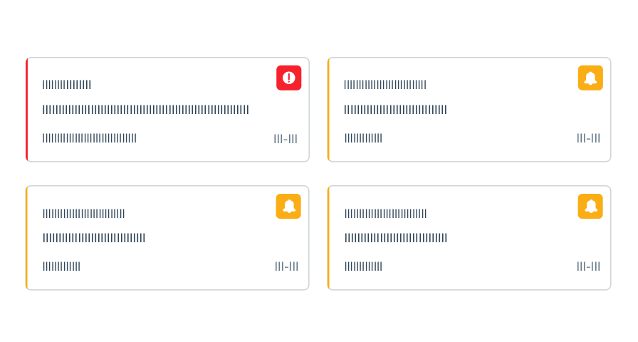

设计要素重复示例

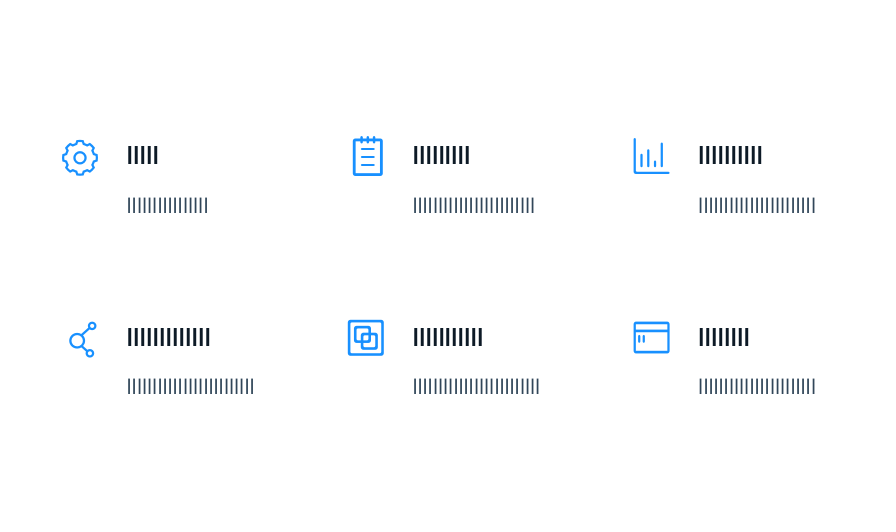

文案格式重复示例

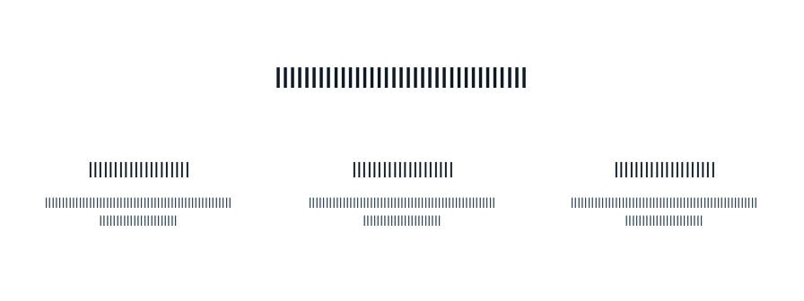

重复元素可以是一条粗线、一种线框，某种相同的颜色、设计要素、设计风格，某种格式、空间关系等。

### 直截了当
正如 Alan Cooper 所言：「需要在哪里输出，就要允许在哪里输入」。这就是直接操作的原理。eg：不要为了编辑内容而打开另一个页面，应该直接在上下文中实现编辑。

#### 页面编辑

单机编辑示例
>状态一：普通的浏览模式，不区分可编辑行和不可编辑行； 
>状态二：鼠标悬停时，「指针」变为「手型」，编辑区域底色变黄，出现「Tooltips」提示单击编辑； 
>状态三：鼠标点击后，出现「输入框」、「确定」、「取消」表单元素，同时光标定位在「输入框」中。
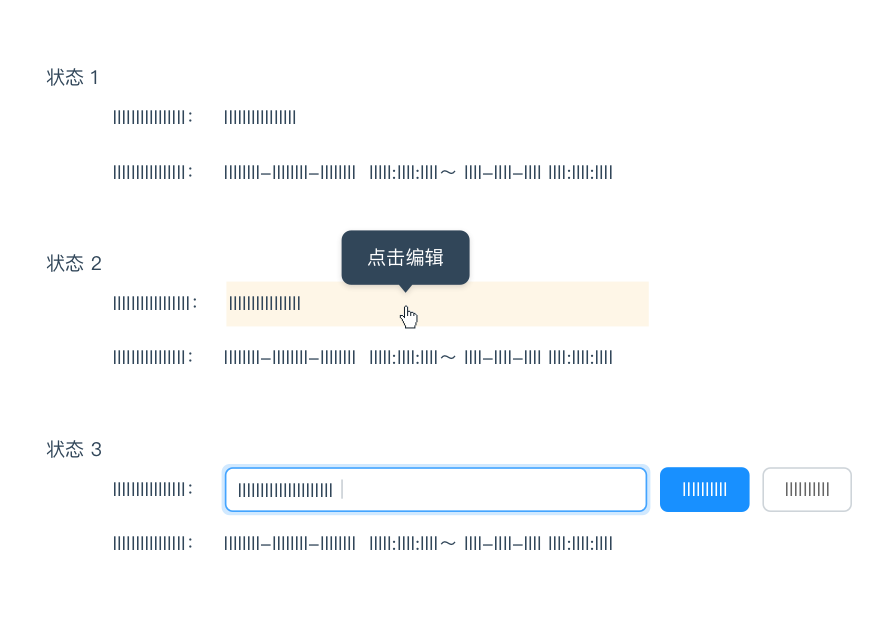

单字段行内编辑

当「易读性」远比「易编辑性」重要时，可以使用「单击编辑」。

文字链/图标编辑示例
>状态一：在可编辑行附近出现文字链/图标； 
>状态二：鼠标点击「编辑」后，出现「输入框」、「确定」、「取消」表单元素，同时光标定位在「输入框」中。

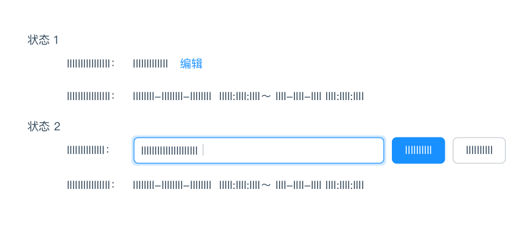

当「易读性」为主，同时又要突出操作行的「易编辑性」时，可使用「文字链/图标编辑」。

多字段行内编辑示例
>编辑模式在不破坏整体性的前提下，可扩大空间，以便放下「输入框」等表单元素；其中，在 Table 中进行编辑模式切换时，需要保证每列的不跳动。

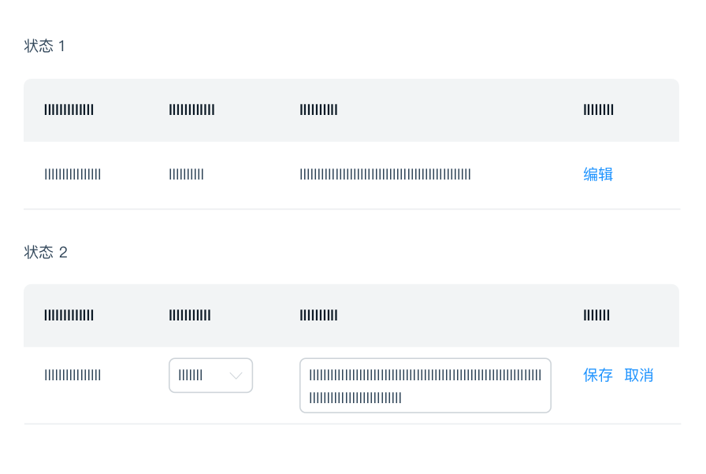

多字段行内编辑
>注：在「多字段行内编辑」的情况下，显示的内容和编辑时所需的字段会存在比较大的差异，所以更需要「巧用过渡」原则中的[「解释刚刚发生了什么」](https://ant.design/docs/spec/transition-cn#%E8%A7%A3%E9%87%8A%E5%88%9A%E5%88%9A%E5%8F%91%E7%94%9F%E4%BA%86%E4%BB%80%E4%B9%88)来消除这种视觉影响。

#### 利用拖放

>拖放列表示例: 
>状态一：鼠标悬停该行时，出现可移动的「图标」； 
>状态二：鼠标悬停在该「图标」时，指针变为「手型」，点击即可进行拖动； 
状态三：拖动到可放置区块，出现蓝色描边，告知用户该区块可放置该对象。

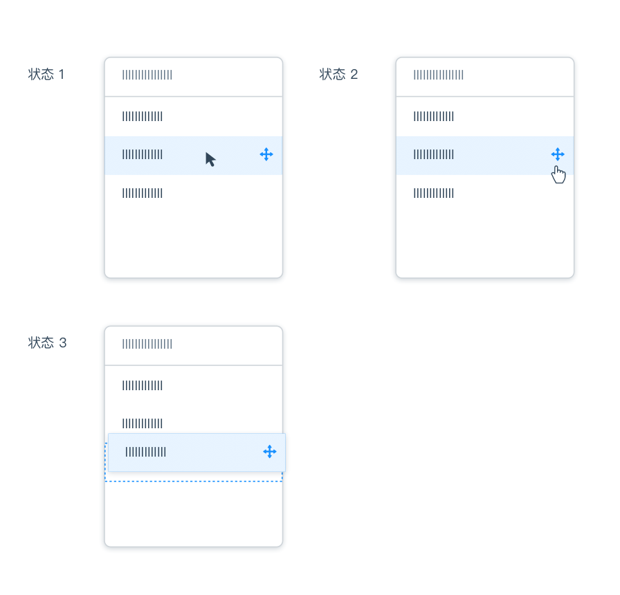

拖放列表

只能限制在一个维度（上/下或者左/右）进行拖放。

>拖放图片/文件示例

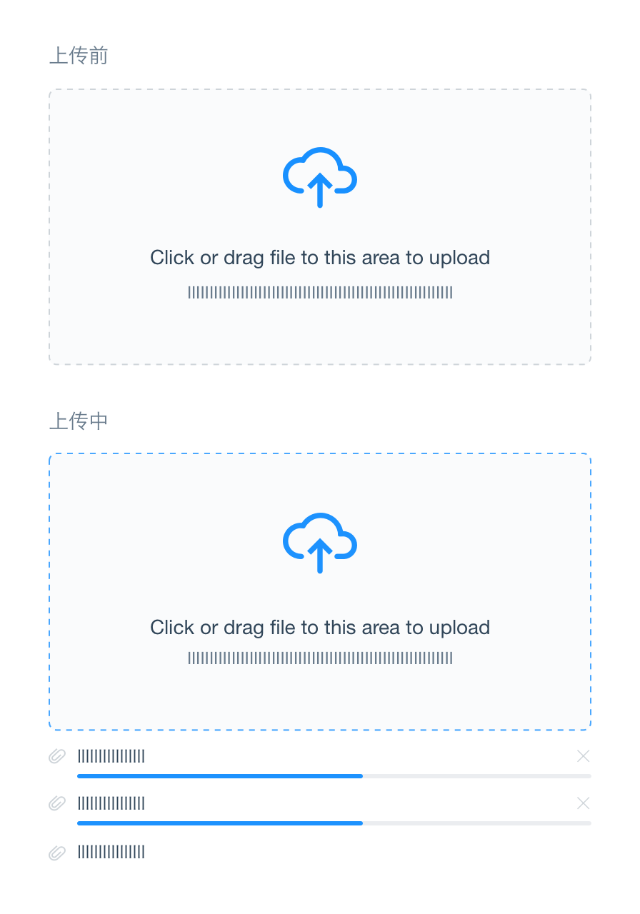

拖放图片/文件

### 足不出户
能在这个页面解决的问题, 就不要去其它页面解决，因为任何页面刷新和跳转都会引起变化盲视（Change Blindness），导致用户心流（Flow）被打断。频繁的页面刷新和跳转，就像在看戏时，演员说完一行台词就安排一次谢幕一样。

>变化盲视（Change Blindness）：指视觉场景中的某些变化并未被观察者注意到的心理现象。产生这种现象的原因包括场景中的障碍物，眼球运动、地点的变化，或者是缺乏注意力等。——摘自《维基百科》
>
>心流（Flow）：也有别名以化境 (Zone) 表示，亦有人翻译为神驰状态，定义是一种将个人精神力完全投注在某种活动上的感觉；心流产生时同时会有高度的兴奋及充实感。——摘自《维基百科》

#### 覆盖层

推荐示例
>用户点击「删除」后，直接操作；出现 Message 告知用户操作成功，并提供用户「撤销」的按钮；用户进行下一个操作或者 1 分钟内不进行任何操作， Message 消失，用户无法再「撤销」。

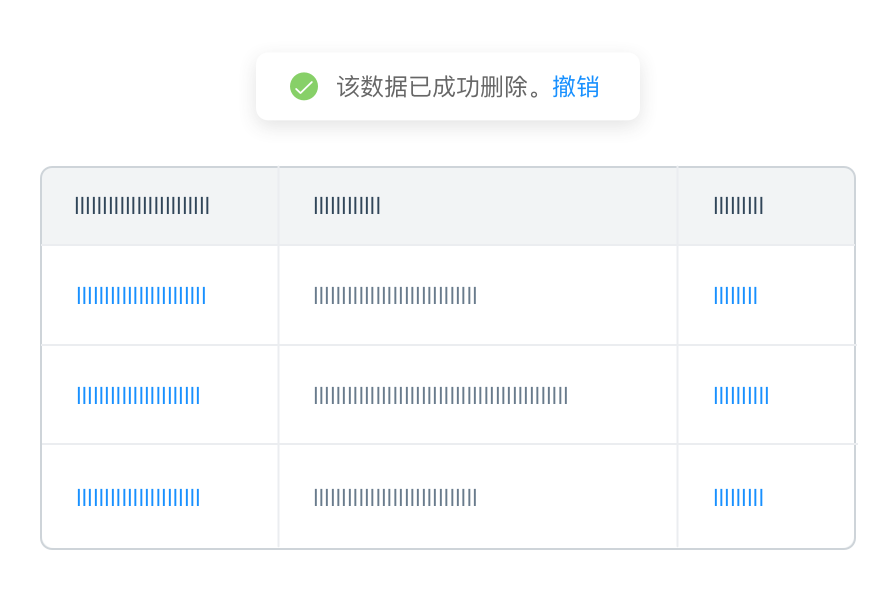

推荐示例
>特例：在执行某些无法「撤销」的操作时，可以点击「删除」后，出现 Popconfirm 进行二次确认，在当前页面完成任务。
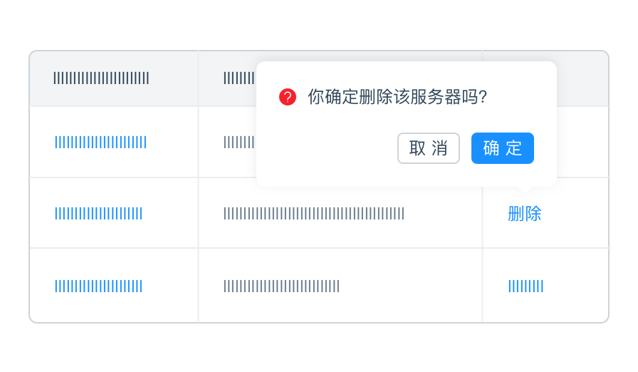

不推荐示例
>滥用 Modal 进行二次确认，就像「狼来了」一样，既打断用户心流（无法将上下文带到弹出框中），也无法避免失误的发生。

二次确认覆盖层：避免滥用 Modal 进行二次确认，应该勇敢的让用户去尝试，给用户机会「撤销」即可。

详情覆盖层：一般在列表中，通过用户「悬停」/「点击」某个区块，在当前页加载该条列表项的更多详情信息。

详情覆盖层示例
>通过「点击」图标查看更多详情信息。

>注：使用「悬停」激活时，当鼠标移入时，需要设置 0.5 秒左右的延迟触发；当鼠标移出时，立刻关闭覆盖层

输入覆盖层：在覆盖层上，让用户直接进行少量字段的输入。

输入覆盖层示例
>鼠标「点击」图标触发；鼠标「点击」悬浮层以外的其他区块后，直接保存输入结果并退出。
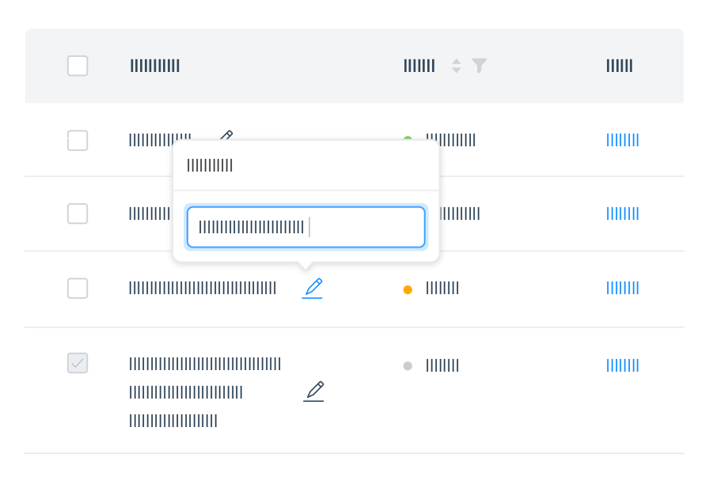

#### 嵌入层
列表嵌入层：在列表中，显示某条列表项的详情信息，保持上下文不中断。

>列表嵌入层示例

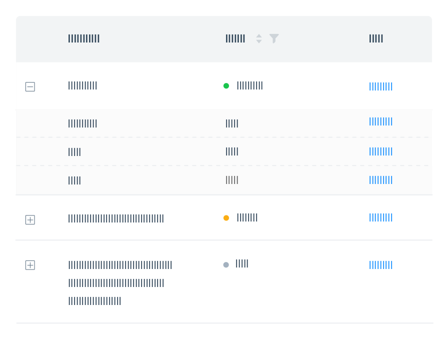

标签页：将多个平级的信息进行整理和分类了，一次只显示一组信息。

>标签页示例

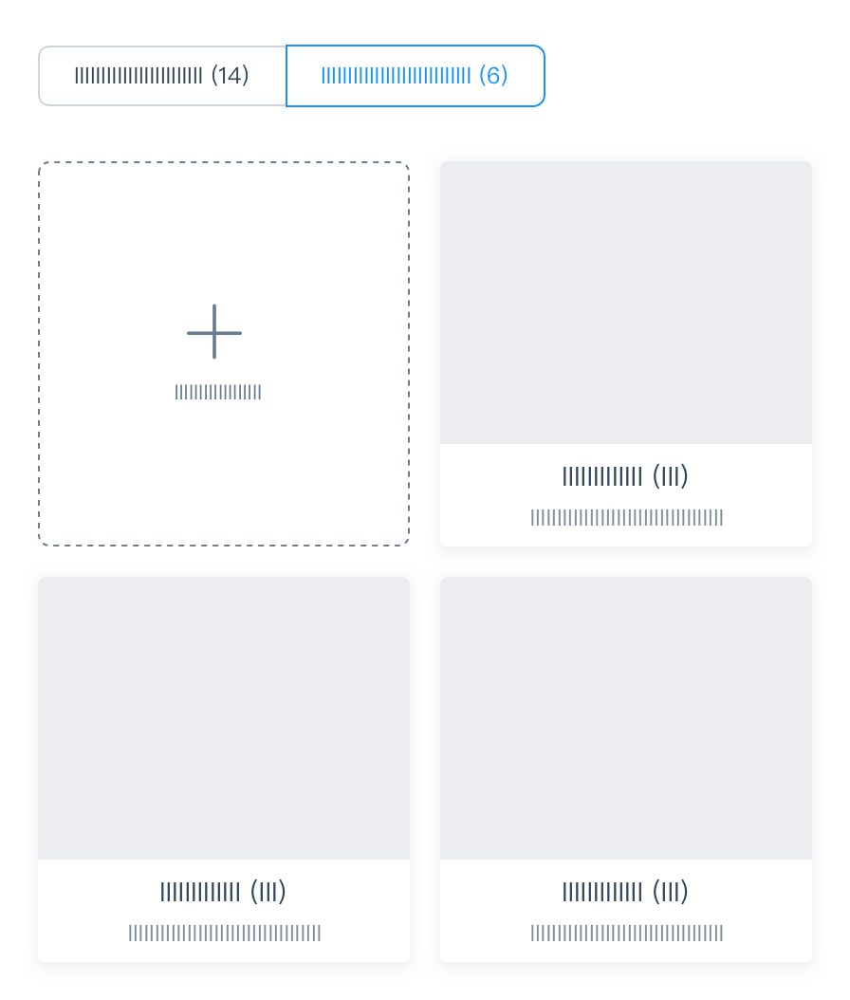

####  虚拟页面
在交互过程中，「覆盖层」可以在当前页面上方显示附加内容和交互链接；「嵌入层」可以在页面内部实现同样效果；而「虚拟页面」不局限机械时代的「页面」，可以利用信息时代的特点构建一种新型「页面」。

#### 流程处理
长期以来，Web 实现流程的方式就是把每个步骤放在一个单独的页面上。虽然这种做法是分解问题最简单的方式，但并不是最佳解决方案。对于某些「流程处理」而言，让用户始终待在同一个页面上则更有必要。

渐进式展现：基于用户的操作/某种特定规则，渐进式展现不同的操作选项。
>渐进式展现示例

配置程序：通过提供一系列的配置项，帮助用户完成任务或者产品组装。

>配置程序示例

弹出框覆盖层：虽然弹出框的出现会打断用户的心流，但是有时候在弹出框中使用「步骤条」来管理复杂流程也是可行的。

>弹出框覆盖层示例

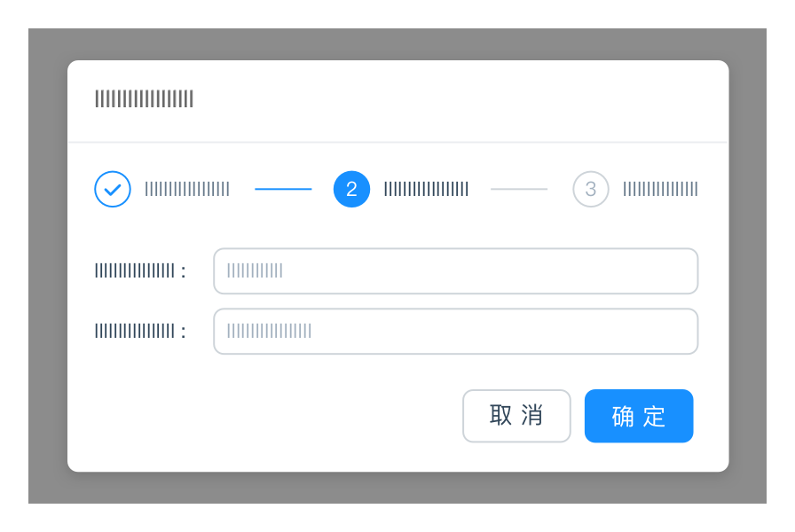

###  简化交互
根据费茨法则（Fitts's Law）所描述的，如果用户鼠标移动距离越少、对象相对目标越大，那么用户越容易操作。通过运用上下文工具（即：放在内容中的操作工具），使内容和操作融合，从而简化交互。

>费茨法则 ：到达目标的时间是到达目标的距离与目标大小的函数，具体:.其中：1.设备当前位置和目标位置的距离（D）；2.目标的大小（W）。距离越长，所用时间越长；目标越大，所用时间越短。

#### 实时可见工具

如果某个操作非常重要，就应该把它放在界面中，并实时可见。

实时可见工具示例 --摘自知乎
>状态一：在文案中出现一个相对明显的点击区域； 
>状态二：鼠标悬停时，鼠标「指针」变为「手型」 ，底色发生变化，邀请用户点击。
>状态三：鼠标点击后，和未点击前有明显的区分。

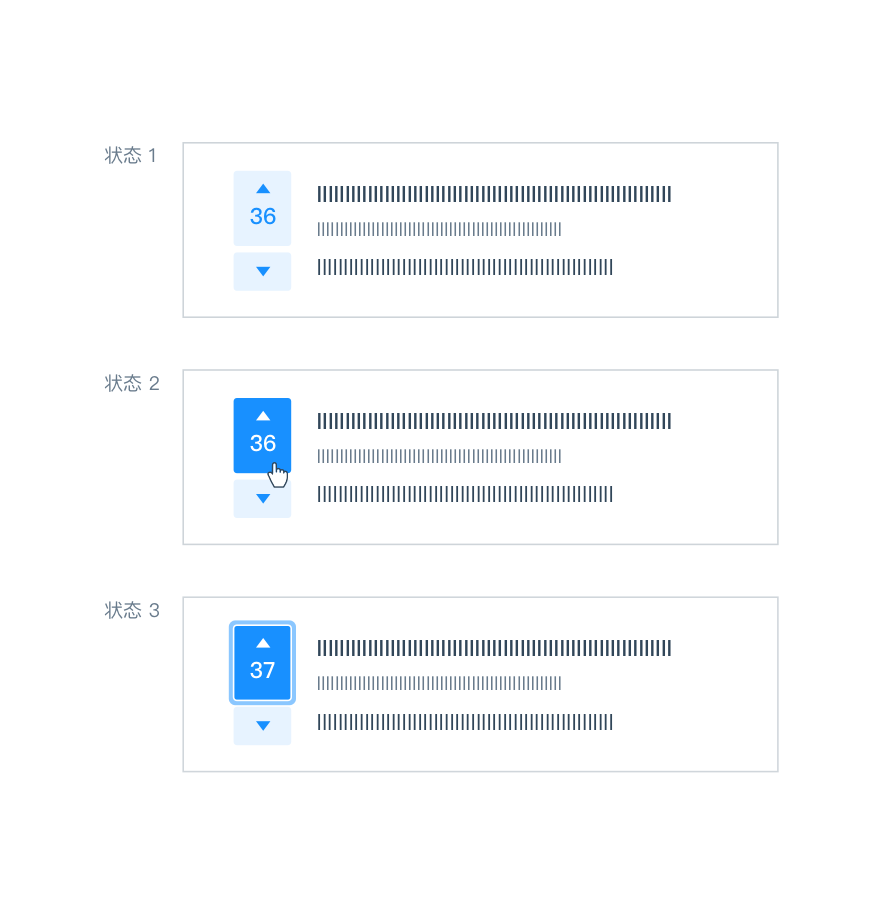

#### 悬停即现工具
如果某个操作不那么重要，或者使用「实时可见工具」过于啰嗦会影响用户阅读时，可以在悬停在该对象上时展示操作项。

悬停即现工具示例
>鼠标悬停时，出现操作项。

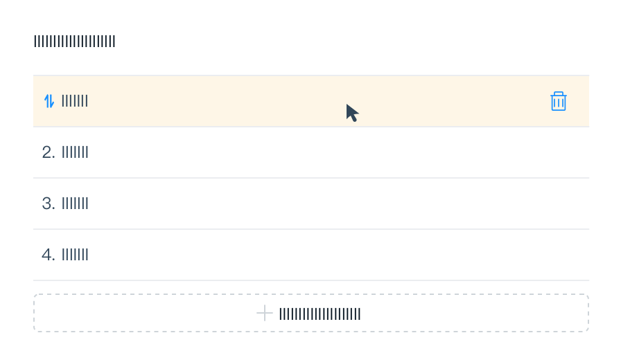

#### 开关显示工具
如果某些操作只需要在特定模式时显示，可以通过开关来实现。

开关显示工具示例
>用户点击「修改」后，Table 中「文本」变成「输入框」，开启编辑功能。

#### 可视区域 ≠ 可点击区域
在使用 Table 时，文字链的点击范围受到文字长短影响，可以设置整个单元格为热区，以便用户触发。

文字链热区示例
>当悬浮在 ID 所在的文字链单元格时，鼠标「指针」随即变为「手型」，单击即可跳转。

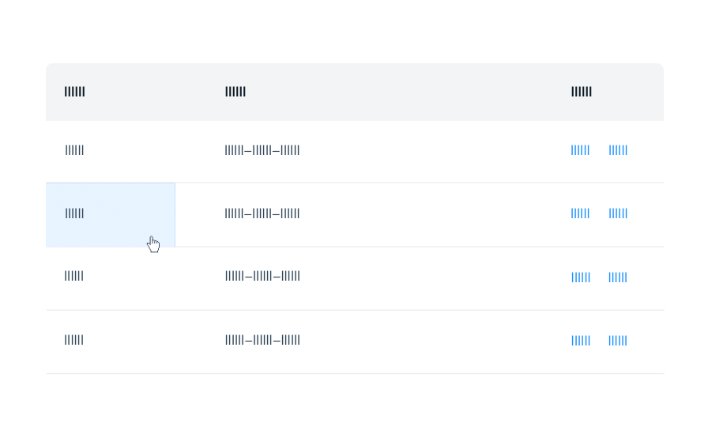

当需要增强按钮的响应性时，可以通过增加用户点击热区的范围，而不是增大按钮形状，从而增强响应性，又不缺失美感。

>注：在移动端尤其适用。

### 提供邀请
很多富交互模式（eg：「拖放」、「行内编辑」、「上下文工具」）都有一个共同问题，就是缺少易发现性。所以「提供邀请」是成功完成人机交互的关键所在。

邀请就是引导用户进入下一个交互层次的提醒和暗示，通常包括意符（eg：实时的提示信息）和可供性，以表明在下一个界面可以做什么。当可供性中可感知的部分（Perceived Affordance）表现为意符时，人机交互的过程往往更加自然、顺畅。

>意符（Signifiers）：一种额外的提示，告诉用户可以采取什么行为，以及应该怎么操作；必须是可感知（eg：视觉、听觉、触觉等）。——摘自《设计心理学 1 》
>
>可供性（Affordance）：也被翻译成「示能」，由 James J. Gibson 提出，定义为物品的特性与决定物品用途的主体能力之间的关系；其中部分可感知（此部分定义为 Perceived Affordance），部分不可感知。——摘自《设计心理学 1 》

#### 静态邀请
指通过可视化技术在页面上提供引导交互的邀请。

文本邀请示例:

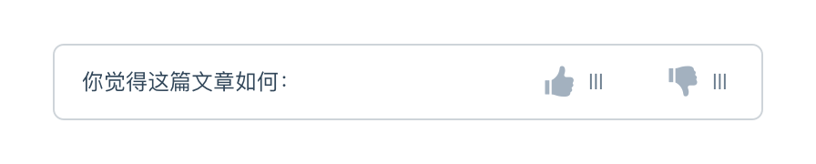

白板式邀请示例

未完成邀请示例:

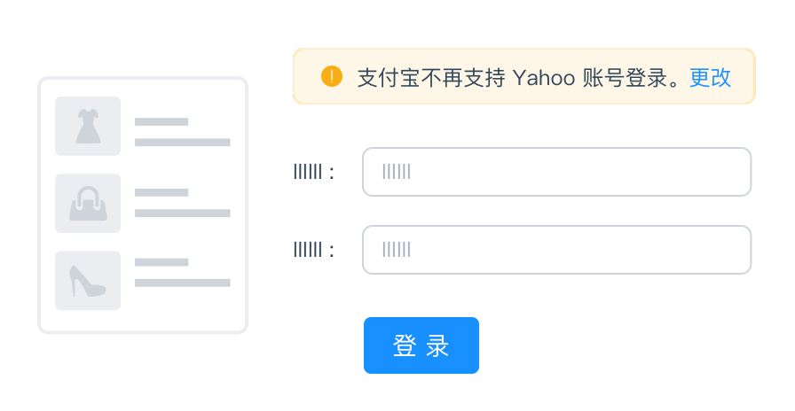

引导操作邀请：一般以静态说明形式出现在页面上，不过它们在视觉上也可以表现出多种不同样式。常见类型：「文本邀请」、「白板式邀请」、「未完成邀请」。

