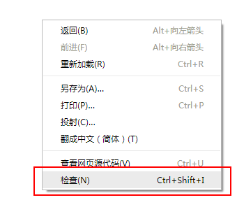
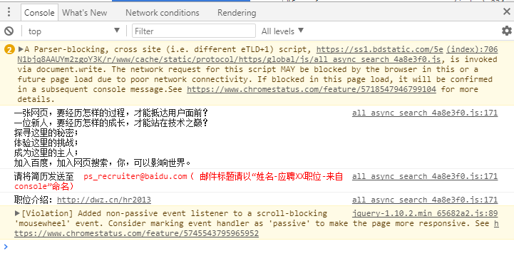

本文先整体介绍一下我所理解的前端状况。

本系列的目的主要是分享一些个人经验和理解，希望能帮到需要的小伙伴们。同时从头开始的整理和思考，或许对于本骚年自己也有一定的帮助。共勉共勉~

# 什么是前端
## 连接用户的最后一层
说起来，对前端这样的认知方式，大概是当初加入的原因。

为什么我喜欢称之为连接用户的最后一层呢？因为页面的展示和操作交互，是我们的产品与用户直接对话的一步。 当然，用户交互的界面很多，除了前端，还有终端、操作系统、等等。

如果说，想要区分哪些是前端呢？这个要跟我们的浏览器紧紧相关了。

## 浏览器带你看遍世界
浏览器是个伟大的发明（不知道算发明不），把我们的世界从身边的小圈直接扩大到全世界的各个地方。

以前常说，读书能让我们看到外面的世界。而浏览器的出现，让我们可以接受来自不同国家、不同领域的信息。 浏览器作为跨电脑、手机的应用，只需要打开浏览器，我们就能找到想要的内容，从文字到图片、视频，甚至是游戏，都可以在其中体验。如今手机的普及，更是常常会有 H5 页面，包括一些简单的活动、抽奖、分享信息等。

前端是什么呢？最初的前端，就是写浏览器里面的页面的。像我们常说的网站、网页，或者是百度等，都是前端实现的页面。 最初的时候，前端主要控制页面的展示，和一些样式的调整。随着网络速度和机器能力的提升，页面的交互逻辑逐渐复杂。

随着前端工程化的一些工具、插件、框架的出现，前端的开发效率逐步提升，同时浏览器的兼容和能力开放增加，前端能做到的事情更多。这里补充一下，前端是通过`HTML/CSS/Javascript`来写页面的。而浏览器除了对`HTML/CSS`的渲染，还有`Javascript`引擎，作为页面的逻辑控制。

目前为止，或许大部分的前端的工作内容还是基于浏览器，但随着浏览器的内核或者是Javascript的解析引擎被移植到各个环境，前端的爪子也伸到很多地方。

## 前端的位置
一个完整的产品需要很多道工序，一个应用程序也对应很多层的开发。

一般来说，一个网页可以为静态页面，即内容和样式都是前端写好的，部署到机器上，添加路由就可访问。 现在的话，页面大部分是动态生成的，即页面打开后，需要拉取接口获取数据，然后重新更新到页面中。像一些直播弹幕、状态的查询等，常常是前端将后台的数据拉取回来后，渲染到页面。

浏览器网页的开发组成：`前端 <=> (数据交互) <=> 后台`。

而如果是多终端的数据展示，则后台的数据则需要同时提供给其他地方。

常见的手机 APP：`用户 <=> 终端/webview嵌H5 <=> (数据交互) <=> 终端后台 <=> 数据库 <=> 管理后台 <=> 管理前端 <=> 运营人员`。

前端页面既可以作为展示，也可以作为管理，可用于分享，也可用于娱乐。产品的难点，多在于创造和创新，前端也只是一种实现方式而已。 而本骚年更爱的对前端的理解是，身肩负着与用户最亲密的接触，需要把最好的一面呈现给用户。

如果说我们想要让用户喜欢我们的产品，首先要做的就是要以最完美的形态出现，而前端的工作，就是要完美地控制展示层。

# 前端能做什么
## 纯前端的进击
现在，前端可以做的事情很多。

### 服务端
在`node.js`的强助力之下，前端小伙伴也能管理文件和资源，维护服务进程和数据库了。当然，异步的方式，或许更适合高并发的服务。

### #App 开发
智能手机的普及，开拓了一大片 App 的市场。对终端的尝试，也是近年来前端圈子一直在做的事情。
有了`react-native`、`weex`等各种 Native App、Hybrid App 开发框架支持，前端小伙伴们也能偶尔朝终端 APP 插上一脚。

### PC 应用
用`electron`这样的框架，将浏览器加一层对接系统 API 的封装，便实现了跨系统的 PC 应用开发。
网易云音乐的 PC 版便是`electron`的产品，而小伙伴们写代码的`VS Code`又何尝不是呢。

### 无处不在的 H5 页面
如今智能手机的普及，更是让 H5 出现在各种信息流中。H5 是什么呢，其实就是移动端的网页，主要用于信息分享、简单的功能、小游戏等等，加载和传播速度快的小页面。
H5 页面主要依赖 App 里的浏览器内核，基本上每个 App 都会支持 H5 页面的。而 HTNL5 中`video`、`audio`、`canvas`等新媒体元素，以及 CSS3 中的动画效果，使得用户能在小小的屏幕页面里，获取到各种各样的信息。

### 小程序开发
从微信开始火起来的小程序，到后面的支付宝小程序、头条小程序、百度小程序、QQ 小程序等等，这种 Hybrid APP 的方式如今也找到了一个较友好的方向来进行：官方 APP 提供增强 WebView 的形式，给到开发者参与到 APP 生态中，共同补齐生态建设能力。

### Serverless
如今各种云开发的能力在健全和推广，例如微信小程序的云开发能力，也补齐了前端开发对服务端开发和运维中缺失的一环，能真正意义上实现一人完成整个小程序，从设计到开发到上线到运维。

## 前端的快速发展
前端也有很多的插件或者库的支持，有了`Canvas`可以写网页游戏、各种图表插件`Echarts/d3`绘制图表、还有WebGL的支持、`three.js`的封装库来写 3D 动画或是游戏。

我们也常常看到前端的技术栈不停地更新，样式库`bootstrap`，曾经打天下的`jQuery`，如今各种框架之争`Vue`、`Angular`、`React`，数据流的处理`Rxjs`、用于 API 的查询语言GraphQL。

作为一个前端，也会常常担心跟不上时代变更的角度。如今的年轻人也越来越聪明了，带的小弟关注的东西比你逼格高很多。
但其实也享受这种不断更新的过程，勇于接受挑战，更新和迭代自己，跟随着世界的脚步走。每一步都走稳了，才是最踏实的方式。


# 前端页面
打开浏览器，里面全都是网页或是网站。包括大家常用的百度、论坛、视频网站等等，当然现在使用 App 的占比上升了不少。不过对于常常需要搜索、或是某些应用的老用户来说，当然是大屏幕的视野要宽，键盘的输入要快啦。

## 页面查看

近年来，单页应用的出现率涨高了。要说明什么是单页应用呢，我们先从最初的静态页面说起。

静态页面，里面主要是`HTML`、`CSS`和`javascript`这几种类型组成的。当然还有像`xHTML/svg`等待。

废话少说，我们先来看看百度首页。

### 右键菜单
在定位某个元素的时候，我们也可以在该元素上右键选择“检查”，菜单如下：



- 查看网页源代码
    
    选择“查看网页源代码”，能看到当前页面的整个`HTML`文档，里面包括一些当前页面的代码。
- 另存为
    
    选择“另存为”，可以将该页面以及相关的一些静态资源打包下载，以前经常这样来“借鉴”别人的样式。
- 检查
    
    选择“检查”，可以检查当前选中的元素，同时打开控制台。接下里我们重点介绍控制台，因为你们以后会与他们为伴。

### 控制台
这里顺便讲讲，前端常用的调试工具。首先，必备第一个就是 Chrome 浏览器啦。

#### 打开控制台
假设你们已经在使用 Chrome 浏览器看我的文章了，那么我们可以有三个方法打开控制台

1. 按键F12。
2. 右键菜单，选择“检查”。
3. 快捷键`Shift + Ctrl + I`。
#### 控制台菜单
我们来看控制台：


这是控制台的菜单，这边简单做介绍（从左往右）：

1. 检查元素（箭头带个框框）：与右键选择元素检查相似，后面讲。
2. 屏幕切换（手机卡在框框上）：该功能主要用于 PC 端和移动端屏幕切换，适合 H5 的开发，并且可匹配多种机型。
3. Element：查看元素，能看到页面中所有存在的元素。
4. Console：输出，常用来输出一些信息，或是错误信息。
5. Source：查看源文件，可支持打断点调试。开启了 source map 后，更是可以浏览器直接更改本地文件。
6. Network：查看网络请求信息，包括静态资源的下载、ajax 请求等。

这里面主要介绍这几个，其他的等需要的时候你们就会自己去接触啦。

#### Element 查看元素
我们看看元素的查看，这里很方便的是，当我们选中 Element 里面某个元素，Chrome 便会突显出来，并且伴有常用的元素信息，宽高、padding、margin 等等。


同时，我们也可以看到下方的 Style，里面会有当前元素匹配中的一些 CSS 样式，我们也可以尝试在这里调整，调整成想要的样式之后，再贴进我们的代码里。

#### Console 输出
我们常用几种方式来调试，包括打断点、`alert()`和`console`等。本骚年用`console`稍微多一些。

看看百度的页面，还藏了招聘信息：



当然现在好像越来越流行了，有时候有趣得网站也会藏些解码游戏在里面。

#### Network
我们在搜索框里面输入内容，便能看到百度页面发起的请求：


我们能在这里查看请求的内容、状态、服务端返回的内容等等。

## 页面组成
上面也提到过，我们的页面主要由HTML、CSS和js组成，如果只用于静态数据的展示，或许只需要前两者就好了，一些公司的主页/官网也常常是简单的页面。

### HTML
HTML，指超文本标签语言。 它被称为通向 WEB 技术世界的钥匙，因为我们的`CSS`和`Javascript`，其实也属于HTML中的`<style>`和`<script>`标签而已。

但更多时候，我喜欢用`HTML`指代元素，例如`<div>`、`<p>`等。

最简单的莫过于：
```html
<html>
  <head></head>
  <body>
    <h1>我的第一个标题</h1>
    <p>我的第一个段落。</p>
  </body>
</html>
```
我们的`<html>`里面包括两个子模快：

- `<head>`：常包括一些样式、`<meta>`标签、甚至是`<script>`，不展示到页面
- `<body>`：包括展示在页面的内容
### CSS
CSS 主要是给我们的`HTML`元素添加样式，可以通过几个方式匹配：

- `DOM`：像常用的`p`、`ul/li`等便是`DOM`匹配
- `class`：类的匹配
- `id`：id 标识符的匹配

`class`针对一类元素的匹配，`id`则是唯一标识符，若页面内有多个相同的`id`，则只有第一个生效。 给元素添加样式，像是绘画的过程，绘制边框、大小、颜色等，都是通过样式来设置的。

### Javascript
JavaScript 是可插入 HTML 页面的编程代码。插入 HTML 页面后，可由所有的现代浏览器执行。

我们常常使用 Javascript 来做以下事情：

1. 输出 HTML。
2. 处理事件（点击、输入等）。
3. 改变 HTML 内容和样式。
4. 处理 Http 请求。

其他的一些基础内容，这里面不详述了。推荐几个学习基础的网站：

- [w3school](http://www.w3school.com.cn/index.html)
- [MDN web](https://developer.mozilla.org/zh-CN/docs/Web/HTML)
# 单页&&多页
前端程序员越来越频繁提到“单页应用”、“多页应用”这些，那这又分别代表什么呢？

## 单页应用
其实很简单，单页应用与多页最简单的区别就是，单页应用，是一个`HTML`文件。

当我们需要更改页面的展示，我们会移除掉部分元素，然后将需要新增的内容填充进去，与画画的擦除重绘相似。

单页应用的好处是：

1. 页面的数据状态都能维持着。
2. 部分擦除重绘，比整个页面刷新的效果体验要好很多。

当然，单页应用也会有缺点：

1. 不利于 SEO。
2. 请求等待时间长。

事物都是有利有弊，单页应用的最大痛处在于 SEO。 [搜索引擎优化](https://zh.wikipedia.org/wiki/%E6%90%9C%E5%B0%8B%E5%BC%95%E6%93%8E%E6%9C%80%E4%BD%B3%E5%8C%96)（英语：search engine optimization，缩写为 SEO），是一种通过了解搜索引擎的运作规则来调整网站，以及提高目的网站在有关搜索引擎内排名的方式。

而关于单页应用的 SEO，也是有各种各样的方式优化的，大家也可以去了解。

## 多页应用
多页应用，更常见于相同的业务不同的页面的开发，这些页面或许没有很多的联系或者公用的数据，每个页面维护各自的状态。

如今 H5 的业务多了，直出渲染也多了些。而多页应用和直出也是不错的搭配。

### 单页与多页应用的比较
-	|单页面应用	|多页面应用
---|---|--|---
组成|	一个外壳页面和多个页面片段组成	|多个完整页面构成
资源共用(css,js)	|共用，只需在外壳部分加载	|不共用，每个页面都需要加载
刷新方式|	页面局部刷新或更改|	整页刷新
url 模式|	a.com/#/pageone a.com/#/pagetwo|	a.com/pageone.html a.com/pagetwo.html
用户体验	|页面片段间的切换快，用户体验良好	|页面切换加载缓慢，流畅度不够，用户体验比较差
页面跳转动画	|容易实现	|无法实现
数据传递	|容易	|依赖 url 传参、或者 cookie 、localStorage 等
搜索引擎优化(SEO)	|需要单独方案、实现较为困难、不利于 SEO 检索 可利用服务器端渲染(SSR)优化	|实现方法简易
>以上表格内容来自[《前端：你要懂的单页面应用和多页面应用》](https://juejin.im/post/5a0ea4ec6fb9a0450407725c)

### 直出和同构
直出，常常指代后端渲染，即我们请求的页面已经是把模版和数据组合好，直接吐出来给到浏览器。

与此相对的，是前端渲染。例如单页应用，我们拿到的只是一个简单的空`<html>`，然后浏览器解析发现需要一些请求的数据和资源，发起二次请求。 当然，这样一来一去，消耗和等待的时间便会长了。

同构又是什么呢？

直出渲染的后端可以有很多，像 PHP、JSP、Node.js 等都是可以的。而同构的意思是，前后端使用一套代码。所以简单来说，就是 Node.js 的胜出了，同构最明显的优势，则是方便维护。

# HTML 和 CSS
这里主要针对一些样式的逻辑来说明，其他详细的属性和设置值希望大家已经在 [w3c](http://www.w3school.com.cn/) 或是 [MDN](https://developer.mozilla.org/zh-CN/docs/Web/CSS) 上学习过了。
## 盒子模型
我们能从控制台的 Element 模块里，找到这样的盒子模型：