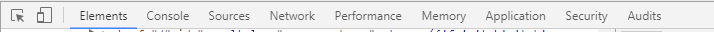
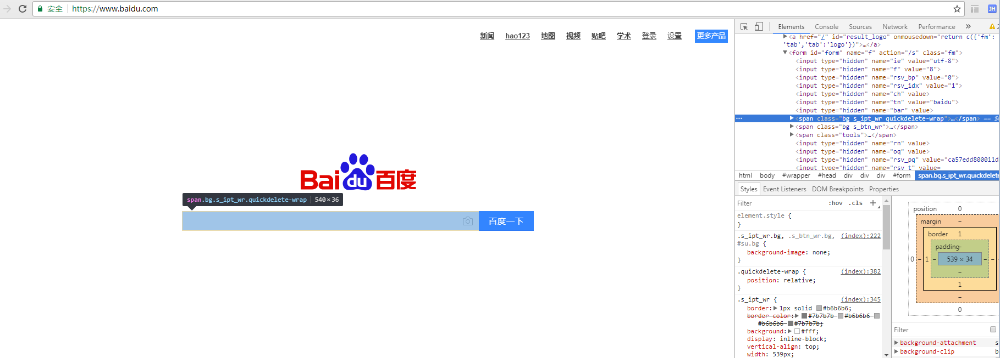
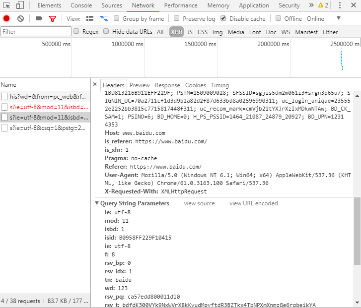
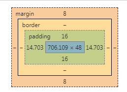
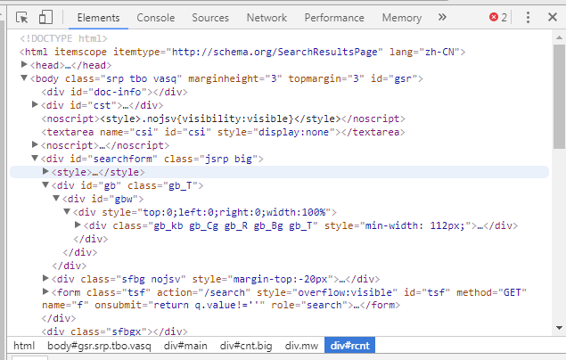
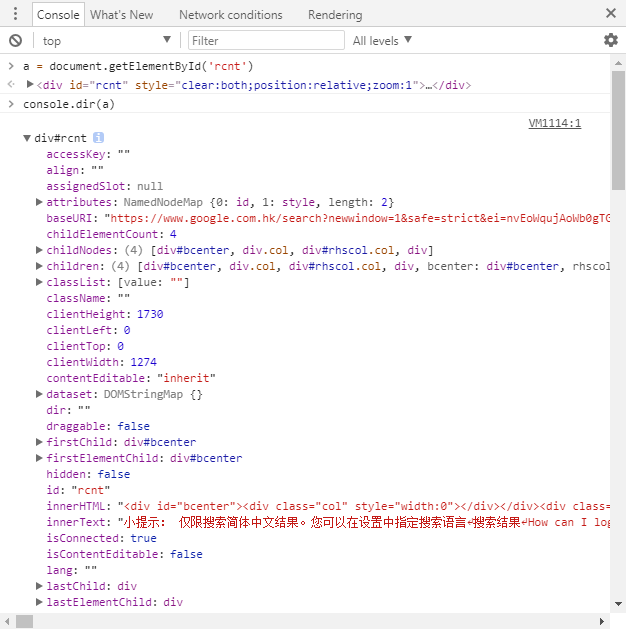

本文先整体介绍一下我所理解的前端状况。

本系列的目的主要是分享一些个人经验和理解，希望能帮到需要的小伙伴们。同时从头开始的整理和思考，或许对于本骚年自己也有一定的帮助。共勉共勉~

# 什么是前端
## 连接用户的最后一层
说起来，对前端这样的认知方式，大概是当初加入的原因。

为什么我喜欢称之为连接用户的最后一层呢？因为页面的展示和操作交互，是我们的产品与用户直接对话的一步。 当然，用户交互的界面很多，除了前端，还有终端、操作系统、等等。

如果说，想要区分哪些是前端呢？这个要跟我们的浏览器紧紧相关了。

## 浏览器带你看遍世界
浏览器是个伟大的发明（不知道算发明不），把我们的世界从身边的小圈直接扩大到全世界的各个地方。

以前常说，读书能让我们看到外面的世界。而浏览器的出现，让我们可以接受来自不同国家、不同领域的信息。 浏览器作为跨电脑、手机的应用，只需要打开浏览器，我们就能找到想要的内容，从文字到图片、视频，甚至是游戏，都可以在其中体验。如今手机的普及，更是常常会有 H5 页面，包括一些简单的活动、抽奖、分享信息等。

前端是什么呢？最初的前端，就是写浏览器里面的页面的。像我们常说的网站、网页，或者是百度等，都是前端实现的页面。 最初的时候，前端主要控制页面的展示，和一些样式的调整。随着网络速度和机器能力的提升，页面的交互逻辑逐渐复杂。

随着前端工程化的一些工具、插件、框架的出现，前端的开发效率逐步提升，同时浏览器的兼容和能力开放增加，前端能做到的事情更多。这里补充一下，前端是通过`HTML/CSS/Javascript`来写页面的。而浏览器除了对`HTML/CSS`的渲染，还有`Javascript`引擎，作为页面的逻辑控制。

目前为止，或许大部分的前端的工作内容还是基于浏览器，但随着浏览器的内核或者是Javascript的解析引擎被移植到各个环境，前端的爪子也伸到很多地方。

## 前端的位置
一个完整的产品需要很多道工序，一个应用程序也对应很多层的开发。

一般来说，一个网页可以为静态页面，即内容和样式都是前端写好的，部署到机器上，添加路由就可访问。 现在的话，页面大部分是动态生成的，即页面打开后，需要拉取接口获取数据，然后重新更新到页面中。像一些直播弹幕、状态的查询等，常常是前端将后台的数据拉取回来后，渲染到页面。

浏览器网页的开发组成：`前端 <=> (数据交互) <=> 后台`。

而如果是多终端的数据展示，则后台的数据则需要同时提供给其他地方。

常见的手机 APP：`用户 <=> 终端/webview嵌H5 <=> (数据交互) <=> 终端后台 <=> 数据库 <=> 管理后台 <=> 管理前端 <=> 运营人员`。

前端页面既可以作为展示，也可以作为管理，可用于分享，也可用于娱乐。产品的难点，多在于创造和创新，前端也只是一种实现方式而已。 而本骚年更爱的对前端的理解是，身肩负着与用户最亲密的接触，需要把最好的一面呈现给用户。

如果说我们想要让用户喜欢我们的产品，首先要做的就是要以最完美的形态出现，而前端的工作，就是要完美地控制展示层。

# 前端能做什么
## 纯前端的进击
现在，前端可以做的事情很多。

### 服务端
在`node.js`的强助力之下，前端小伙伴也能管理文件和资源，维护服务进程和数据库了。当然，异步的方式，或许更适合高并发的服务。

### #App 开发
智能手机的普及，开拓了一大片 App 的市场。对终端的尝试，也是近年来前端圈子一直在做的事情。
有了`react-native`、`weex`等各种 Native App、Hybrid App 开发框架支持，前端小伙伴们也能偶尔朝终端 APP 插上一脚。

### PC 应用
用`electron`这样的框架，将浏览器加一层对接系统 API 的封装，便实现了跨系统的 PC 应用开发。
网易云音乐的 PC 版便是`electron`的产品，而小伙伴们写代码的`VS Code`又何尝不是呢。

### 无处不在的 H5 页面
如今智能手机的普及，更是让 H5 出现在各种信息流中。H5 是什么呢，其实就是移动端的网页，主要用于信息分享、简单的功能、小游戏等等，加载和传播速度快的小页面。
H5 页面主要依赖 App 里的浏览器内核，基本上每个 App 都会支持 H5 页面的。而 HTNL5 中`video`、`audio`、`canvas`等新媒体元素，以及 CSS3 中的动画效果，使得用户能在小小的屏幕页面里，获取到各种各样的信息。

### 小程序开发
从微信开始火起来的小程序，到后面的支付宝小程序、头条小程序、百度小程序、QQ 小程序等等，这种 Hybrid APP 的方式如今也找到了一个较友好的方向来进行：官方 APP 提供增强 WebView 的形式，给到开发者参与到 APP 生态中，共同补齐生态建设能力。

### Serverless
如今各种云开发的能力在健全和推广，例如微信小程序的云开发能力，也补齐了前端开发对服务端开发和运维中缺失的一环，能真正意义上实现一人完成整个小程序，从设计到开发到上线到运维。

## 前端的快速发展
前端也有很多的插件或者库的支持，有了`Canvas`可以写网页游戏、各种图表插件`Echarts/d3`绘制图表、还有WebGL的支持、`three.js`的封装库来写 3D 动画或是游戏。

我们也常常看到前端的技术栈不停地更新，样式库`bootstrap`，曾经打天下的`jQuery`，如今各种框架之争`Vue`、`Angular`、`React`，数据流的处理`Rxjs`、用于 API 的查询语言GraphQL。

作为一个前端，也会常常担心跟不上时代变更的角度。如今的年轻人也越来越聪明了，带的小弟关注的东西比你逼格高很多。
但其实也享受这种不断更新的过程，勇于接受挑战，更新和迭代自己，跟随着世界的脚步走。每一步都走稳了，才是最踏实的方式。


# 前端页面
打开浏览器，里面全都是网页或是网站。包括大家常用的百度、论坛、视频网站等等，当然现在使用 App 的占比上升了不少。不过对于常常需要搜索、或是某些应用的老用户来说，当然是大屏幕的视野要宽，键盘的输入要快啦。

## 页面查看

近年来，单页应用的出现率涨高了。要说明什么是单页应用呢，我们先从最初的静态页面说起。

静态页面，里面主要是`HTML`、`CSS`和`javascript`这几种类型组成的。当然还有像`xHTML/svg`等待。

废话少说，我们先来看看百度首页。

### 右键菜单
在定位某个元素的时候，我们也可以在该元素上右键选择“检查”，菜单如下：


- 查看网页源代码
    
    选择“查看网页源代码”，能看到当前页面的整个`HTML`文档，里面包括一些当前页面的代码。
- 另存为
    
    选择“另存为”，可以将该页面以及相关的一些静态资源打包下载，以前经常这样来“借鉴”别人的样式。
- 检查
    
    选择“检查”，可以检查当前选中的元素，同时打开控制台。接下里我们重点介绍控制台，因为你们以后会与他们为伴。

### 控制台
这里顺便讲讲，前端常用的调试工具。首先，必备第一个就是 Chrome 浏览器啦。

#### 打开控制台
假设你们已经在使用 Chrome 浏览器看我的文章了，那么我们可以有三个方法打开控制台

1. 按键F12。
2. 右键菜单，选择“检查”。
3. 快捷键`Shift + Ctrl + I`。
#### 控制台菜单
我们来看控制台：



这是控制台的菜单，这边简单做介绍（从左往右）：

1. 检查元素（箭头带个框框）：与右键选择元素检查相似，后面讲。
2. 屏幕切换（手机卡在框框上）：该功能主要用于 PC 端和移动端屏幕切换，适合 H5 的开发，并且可匹配多种机型。
3. Element：查看元素，能看到页面中所有存在的元素。
4. Console：输出，常用来输出一些信息，或是错误信息。
5. Source：查看源文件，可支持打断点调试。开启了 source map 后，更是可以浏览器直接更改本地文件。
6. Network：查看网络请求信息，包括静态资源的下载、ajax 请求等。

这里面主要介绍这几个，其他的等需要的时候你们就会自己去接触啦。

#### Element 查看元素
我们看看元素的查看，这里很方便的是，当我们选中 Element 里面某个元素，Chrome 便会突显出来，并且伴有常用的元素信息，宽高、padding、margin 等等。




同时，我们也可以看到下方的 Style，里面会有当前元素匹配中的一些 CSS 样式，我们也可以尝试在这里调整，调整成想要的样式之后，再贴进我们的代码里。

#### Console 输出
我们常用几种方式来调试，包括打断点、`alert()`和`console`等。本骚年用`console`稍微多一些。

看看百度的页面，还藏了招聘信息：


当然现在好像越来越流行了，有时候有趣得网站也会藏些解码游戏在里面。

#### Network
我们在搜索框里面输入内容，便能看到百度页面发起的请求：



我们能在这里查看请求的内容、状态、服务端返回的内容等等。

## 页面组成
上面也提到过，我们的页面主要由HTML、CSS和js组成，如果只用于静态数据的展示，或许只需要前两者就好了，一些公司的主页/官网也常常是简单的页面。

### HTML
HTML，指超文本标签语言。 它被称为通向 WEB 技术世界的钥匙，因为我们的`CSS`和`Javascript`，其实也属于HTML中的`<style>`和`<script>`标签而已。

但更多时候，我喜欢用`HTML`指代元素，例如`<div>`、`<p>`等。

最简单的莫过于：
```html
<html>
  <head></head>
  <body>
    <h1>我的第一个标题</h1>
    <p>我的第一个段落。</p>
  </body>
</html>
```
我们的`<html>`里面包括两个子模快：

- `<head>`：常包括一些样式、`<meta>`标签、甚至是`<script>`，不展示到页面
- `<body>`：包括展示在页面的内容
### CSS
CSS 主要是给我们的`HTML`元素添加样式，可以通过几个方式匹配：

- `DOM`：像常用的`p`、`ul/li`等便是`DOM`匹配
- `class`：类的匹配
- `id`：id 标识符的匹配

`class`针对一类元素的匹配，`id`则是唯一标识符，若页面内有多个相同的`id`，则只有第一个生效。 给元素添加样式，像是绘画的过程，绘制边框、大小、颜色等，都是通过样式来设置的。

### Javascript
JavaScript 是可插入 HTML 页面的编程代码。插入 HTML 页面后，可由所有的现代浏览器执行。

我们常常使用 Javascript 来做以下事情：

1. 输出 HTML。
2. 处理事件（点击、输入等）。
3. 改变 HTML 内容和样式。
4. 处理 Http 请求。

其他的一些基础内容，这里面不详述了。推荐几个学习基础的网站：

- [w3school](http://www.w3school.com.cn/index.html)
- [MDN web](https://developer.mozilla.org/zh-CN/docs/Web/HTML)
# 单页&&多页
前端程序员越来越频繁提到“单页应用”、“多页应用”这些，那这又分别代表什么呢？

## 单页应用
其实很简单，单页应用与多页最简单的区别就是，单页应用，是一个`HTML`文件。

当我们需要更改页面的展示，我们会移除掉部分元素，然后将需要新增的内容填充进去，与画画的擦除重绘相似。

单页应用的好处是：

1. 页面的数据状态都能维持着。
2. 部分擦除重绘，比整个页面刷新的效果体验要好很多。

当然，单页应用也会有缺点：

1. 不利于 SEO。
2. 请求等待时间长。

事物都是有利有弊，单页应用的最大痛处在于 SEO。 [搜索引擎优化](https://zh.wikipedia.org/wiki/%E6%90%9C%E5%B0%8B%E5%BC%95%E6%93%8E%E6%9C%80%E4%BD%B3%E5%8C%96)（英语：search engine optimization，缩写为 SEO），是一种通过了解搜索引擎的运作规则来调整网站，以及提高目的网站在有关搜索引擎内排名的方式。

而关于单页应用的 SEO，也是有各种各样的方式优化的，大家也可以去了解。

## 多页应用
多页应用，更常见于相同的业务不同的页面的开发，这些页面或许没有很多的联系或者公用的数据，每个页面维护各自的状态。

如今 H5 的业务多了，直出渲染也多了些。而多页应用和直出也是不错的搭配。

### 单页与多页应用的比较
-	|单页面应用	|多页面应用
---|---|--|---
组成|	一个外壳页面和多个页面片段组成	|多个完整页面构成
资源共用(css,js)	|共用，只需在外壳部分加载	|不共用，每个页面都需要加载
刷新方式|	页面局部刷新或更改|	整页刷新
url 模式|	a.com/#/pageone a.com/#/pagetwo|	a.com/pageone.html a.com/pagetwo.html
用户体验	|页面片段间的切换快，用户体验良好	|页面切换加载缓慢，流畅度不够，用户体验比较差
页面跳转动画	|容易实现	|无法实现
数据传递	|容易	|依赖 url 传参、或者 cookie 、localStorage 等
搜索引擎优化(SEO)	|需要单独方案、实现较为困难、不利于 SEO 检索 可利用服务器端渲染(SSR)优化	|实现方法简易
>以上表格内容来自[《前端：你要懂的单页面应用和多页面应用》](https://juejin.im/post/5a0ea4ec6fb9a0450407725c)

### 直出和同构
直出，常常指代后端渲染，即我们请求的页面已经是把模版和数据组合好，直接吐出来给到浏览器。

与此相对的，是前端渲染。例如单页应用，我们拿到的只是一个简单的空`<html>`，然后浏览器解析发现需要一些请求的数据和资源，发起二次请求。 当然，这样一来一去，消耗和等待的时间便会长了。

同构又是什么呢？

直出渲染的后端可以有很多，像 PHP、JSP、Node.js 等都是可以的。而同构的意思是，前后端使用一套代码。所以简单来说，就是 Node.js 的胜出了，同构最明显的优势，则是方便维护。

# HTML 和 CSS
这里主要针对一些样式的逻辑来说明，其他详细的属性和设置值希望大家已经在 [w3c](http://www.w3school.com.cn/) 或是 [MDN](https://developer.mozilla.org/zh-CN/docs/Web/CSS) 上学习过了。
## 盒子模型
我们能从控制台的 Element 模块里，找到这样的盒子模型：



盒模型(box model)是 CSS 中的一个重要概念，它是元素大小的呈现方式。

### 概念
在一个文档中，每个元素都被表示为一个矩形的盒子。确定这些盒子的尺寸, 属性（像它的颜色，背景，边框方面）和位置是渲染引擎的目标。

在 CSS 中，使用标准盒模型描述这些矩形盒子中的每一个。这个模型描述了元素所占空间的内容。
每个盒子有四个边：外边距边（`margin`）,边框边（`border`）,内填充边（`padding`）与内容边（`content`）。

### `margin` 叠加
当两个或更多个垂直边距相遇时，它们将形成一个外边距（`margin`）。

`margin`的叠加会有一些混淆，需要注意的地方是：
外边距（`margin`）的高度等于两个发生叠加的外边距的高度中的较大者。

**只有普通文档流中块框的垂直外边距才会发生外边距叠加。行内框、 浮动框或绝对定位框之间的外边距不会叠加。**

### 盒模型计算
CSS3 中新增了一种盒模型计算方式：`box-sizing`属性。盒模型默认的值是`content-box`, 新增的值是`padding-box`和`border-box`，几种盒模型计算元素宽高的区别如下：

#### content-box（默认）
元素宽高(`width/height`)等于：`content`

布局所占宽高等于：`width/height(content) + border + padding`

#### padding-box
元素宽高(`width/height`)等于：`content + padding` 

布局所占宽高等于：`width/height(content + padding) + border`

### border-box
元素宽高(`width/height`)等于：`content + padding + border`

布局所占宽高等于：`width/height(content + padding + border)`

## 内联元素与块状元素
### 内联元素
内联元素又称行内元素等，表示位于行内的元素。
内联元素只能容纳文本或者其他内联元素，它允许其他内联元素与其位于同一行。

内联元素的宽度高度不起作用。

常见的内联元素：`<a>/<span>/<i>/<strong>`等。

### 块状元素
块状元素一般是其他元素的容器，可容纳内联元素和其他块状元素。

块状元素排斥其他元素与其位于同一行。

块状元素的宽度高度起作用。

常见的块状元素有：

- `<div>/<p>/<h1>/<h2>…<h6>/<ul>/<ol>`
- HTML5 新元素: `<section>/<article>/<header>/<footer>`等
### 常用的 display 属性
#### block：块状元素
- 可容纳其他块状元素或内联元素
- 排斥其他元素与其位于同一行
- 宽度高度起作用，`block`元素可以设置宽度`width`和高度`height`，有效
#### inline：内联元素
- 位于行内，即位于块状元素或者其他内联元素内
- 只能容纳文本或者其他内联元素
- 允许其他内联元素与其位于同一行
- inline 元素的宽度高度不起作用
#### inline-block 元素
- 与`inline`元素相似的地方
  - 位于行内，即位于块状元素或者其他内联元素内
  - 允许其他内联元素与其位于同一行
- 与`block`元素相似的地方
  - 可容纳其他块状元素或内联元素
  - 宽度高度起作用
- 使用 `line-block` 可以很方便解决一些问题:
  - 使元素居中
  - `inline`元素`a/span`设置宽高
  - 将多个块状元素放在一行
### float 浮动
`float`属性定义元素在哪个方向浮动。

`float`属性可应用于图像，使文本围绕在图像周围。

使用`float`还可能遇到高度塌陷的问题，而可以使用几个方法解决：
- 父元素使用`overflow: hidden`（此时高度为`auto`）
- 使父元素也成为浮动`float`元素
使用`clear`清除浮动

`float`撑开父元素主要依赖 BFC 原则。

#### BFC特性:
1. BFC会阻止垂直外边距(margin-top, margin-bottom)折叠
2. BFC不会重叠浮动元素
3. BFC可以包含浮动

### 具体说明
以上的一些样式属性和方法，更多具体说明可参考[《CSS 的 display 有关》](https://godbasin.github.io/2016/06/26/about-display/)。

## 元素定位
**文档流**：正常的文档流也叫普通流，在 HTML 里面的写法就是从上到下，从左到右的排版布局。

而我们常用的布局，与`position`样式属性紧紧相关。

### static
默认值。没有定位，元素出现在正常的流中（忽略 top, bottom, left, right 或者 z-index 声明）。

### inherit
规定应该从父元素继承 position 属性的值。

### relative
生成相对定位的元素，相对于其正常位置进行定位。

`relative`的特点：
- 保持原有文档流，但相对本身的原始位置发生位移，且占空间
- 元素也遵循从上到下，从左到右的排版布局
- 相对于其正常位置进行定位，在这里设置了`relative`的元素相对其原本位置（`position: static`）进行位移
- 元素占有原本位置，因此下一个元素会排到该元素后方
- 元素占位不会随着定位的改变而改变。也就是说`relative`在文档流中占有的位置与其原本位置（`position: static`）相同

这里有个需要注意的地方： 虽然`relative`元素占位与`static`相同，但会溢出父元素，撑开整个页面（`document`）。

### absolute
生成绝对定位的元素，相对于`static`定位以外的第一个父元素进行定位。
元素的位置通过`left`, `top`, `right`以及`bottom`属性进行规定。

`absolute`的特点:
- `absolute`元素脱离文档流
- `absolute` 元素不占位,因此下一个符合普通流的元素会略过`absolute`元素排到其上一个元素的后方
- `absolute`元素的定位是相对于`static`定位以外的第一个父元素进行定位
### fixed
生成绝对定位的元素，相对于浏览器窗口进行定位。
元素的位置通过`left`, `top`, `right`以及`bottom`属性进行规定。

`fixed`的特点:
- `fixed`元素脱离文档流
- `fixed`元素不占位
- `fixed`相对于浏览器窗口来定位，不管是否有`static`定位以外的父元素
- `absolute`元素会随着页面的滚动而滚动，而`fixed`不会

## 元素堆叠
元素的堆叠方式和顺序，除了与`position`定位有关，也与`z-index`有关。

### z-index
有关 `z-index`的说明:
1. 无`z-index`或者`z-index`值相等时，堆叠顺序均由元素在文档中的先后位置决定，后出现的会在上面。
2. 当向上追溯找不到含有`z-index`值的父元素的情况下，则可以视为自由的`z-index`元素。
3. 自由的`z-index`元素可以与其他自由的定位元素或者父元素的同级兄弟定位元素来比较`z-index`的值，决定其堆叠顺序。
4. `z-index`值只决定同一父元素中的同级子元素的堆叠顺序。
5. 父元素的`z-index`值为子元素定义了堆叠顺序，即子元素依赖于父元素`z-index`值来获得页面中的堆叠顺序。
### 具体说明
有关元素定位和堆叠的更多说明，可以参考文章《[CSS 的 position 和 z-index 有关》](https://godbasin.github.io/2016/06/25/about-position/)。

# DOM 和 BOM
## 什么是 DOM
文档对象模型 (`DOM`) 是`HTML`和`XML`文档的编程接口。
`DOM`将文档解析为一个由节点和对象（包含属性和方法的对象）组成的结构集合。

尽管通常会使用`JavaScript`来访问`DOM`， 但它并不是`JavaScript`的一部分，它也可以被其他语言使用。

## DOM 解析
我们常见的`HTML`元素，在浏览器中会被解析成节点：


在控制台，我们也能比较清晰地看到这样的层级关系：



**节点数中的节点彼此拥有层级关系**

父（`parent`）、子（`child`）和同胞（`sibling`）等术语用于描述这些关系。父节点拥有子节点。同级的子节点被称为同胞（兄弟或姐妹）。

- 在节点树中，顶端节点被称为根（`root`）
- 每个节点都有父节点、除了根（它没有父节点）
- 一个节点可拥有任意数量的子
- 同胞是拥有相同父节点的节点

**通过`HTML DOM`，树中的所有节点均可通过`JavaScript`进行访问。所有`HTML`元素（节点）均可被修改，也可以创建或删除节点。**

## DOM接口
`DOM`接口主要用于操作DOM节点，如常见的增删查改。

在 web 和 XML 页面脚本中使用 DOM 时，一些常用的 API 如下：

- `document.getElementById(id)`：根据id获取元素
- `document.getElementsByTagName(name)`：根据tag获取元素
- `document.createElement(name)`：创建元素
- `parentNode.appendChild(node)`：添加子元素
- `element.innerHTML`：设置/获取元素内容
- `element.styles`：设置/获取元素样式
- `element.setAttribute()`：设置元素属性值
- `element.getAttribute()`：获取元素属性值
- `element.addEventListener()`：添加事件绑定

通常什么时候会用呢，最常见的便是列表的维护，包括增加新的选项、删除某个、修改某个等等。

在浏览器兼容性问题很多的时候，我们常常会使用jQuery来进行些DOM操作，如今兼容性问题逐渐变少，大家更倾向于用原生DOM接口来进行操作。

## DOM 事件流
事件流所描述的就是从页面中接受事件的顺序。
**DOM 事件流（event flow）存在三个阶段：事件捕获阶段、处于目标阶段、事件冒泡阶段。**
1. 捕获阶段: 一开始从文档的根节点流向目标对象
2. 目标阶段: 然后再目标对象上被触发
3. 冒泡阶段: 之后再回溯到文档的根节点

### 事件捕获
当鼠标点击或者触发 dom 事件时，浏览器会从根节点开始由外到内进行事件传播，即点击了子元素，如果父元素通过事件捕获方式注册了对应的事件的话，会先触发父元素绑定的事件。

在事件捕获的概念下在p元素上发生click事件的顺序应该是`document -> html -> body -> div -> p`。

### 事件冒泡
与事件捕获恰恰相反，事件冒泡顺序是由内到外进行事件传播，直到根节点。

在事件冒泡的概念下在p元素上发生click事件的顺序应该是`p -> div -> body -> html -> document`。


**`DOM`标准事件流的触发的先后顺序为：先捕获再冒泡，即当触发 `dom` 事件时，会先进行事件捕获，捕获到事件源之后通过事件传播进行事件冒泡。**

不同的浏览器对此有着不同的实现, IE10 及以下不支持捕获型事件，所以就少了一个事件捕获阶段，IE11、Chrome 、Firefox、Safari 等浏览器则同时存在。

曾经踩过 IE9 中`button`的坑，例如`<button><span></span></button>`，如果我们分别在button以及span里均绑定click事件，则span的事件不会被触发。不知道这个跟事件机制是否相关呢？

**addEventListener** `addEventListener`的第三个参数就是为冒泡和捕获准备的. `addEventListener`有三个参数：
```js
element.addEventListener(event, function, useCapture)
```

- `event`: 需要绑定的事件
- `function`: 触发事件后要执行的函数
- `useCapture`: 默认值是false, 表示在事件冒泡阶段调用事件处理函数, 如果参数为 `true`, 则表示在事件捕获阶段调用处理函数

### 事件委托
基于事件冒泡机制，我们可以实现将子元素的事件委托给父级元素来进行处理。
当我们需要对很多元素添加事件的时候，可以通过将事件添加到它们的父节点而将事件委托给父节点来触发处理函数。

这样能解决什么问题呢？
1. 绑定子元素会绑定很多次的绑定，而绑定父元素只需要一次绑定。
2. 将事件委托给父节点，这样我们对子元素的增加和删除、移动等，都不需要重新进行事件绑定。

很常见的就是我们有个列表，每个选项都可以进行编辑、删除、添加标签等功能，而把事件委托给父元素或者`document`，不管我们新增、删除、更新选项，都不需手动去绑定和移除事件。

最常在`jQuery`中使用事件委托：
```js
$("#my-list").delegate("button", "click", function() {
  // "$(this)"是被click的元素
  console.log("you clicked a button", $(this));
});
```
现在我们基本上都使用框架了，我们可以随意地在元素上绑定事件，如 Vue 中`<div @click="myClickEvent" />`，因为框架会帮我们用事件委托的方式处理掉，大部分都会绑定在最外层初始化的id元素，或者是document吧。

## 虚拟 DOM
一个 `DOM` 节点元素, 其实是很复杂的, 包含了很多的书序和方法.

我们来简单打印一下一个`DOM` 元素



看到右边的滚动条了没，有如此之多的属性。

所以随着应用程序越来越复杂，`DOM`操作越来越频繁，需要监听事件和在事件回调用更新页面的 `DOM` 操作也越来越多，性能消耗则会比较大。于是乎，虚拟`DOM`的想法便被人提出并实现了。

虚拟`DOM`其实是用来模拟真实`DOM`的中间产物，主要包括以下功能：

