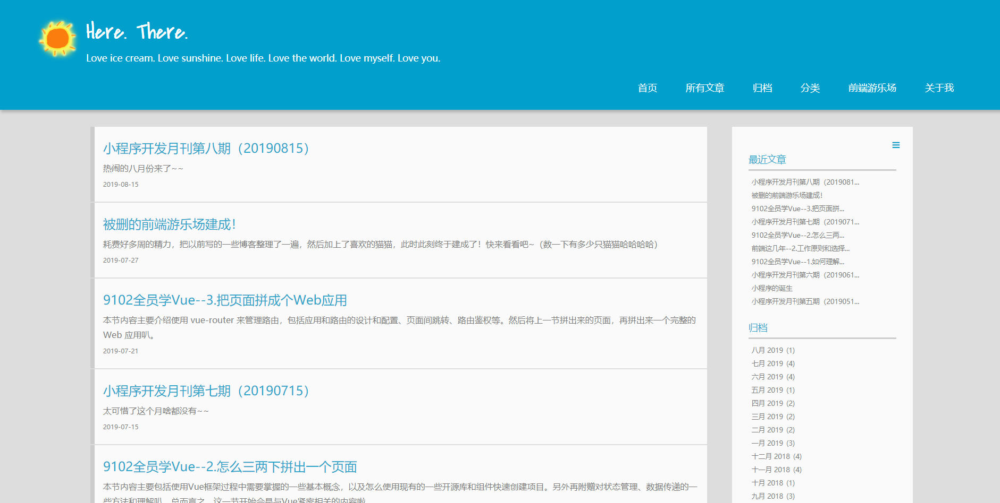
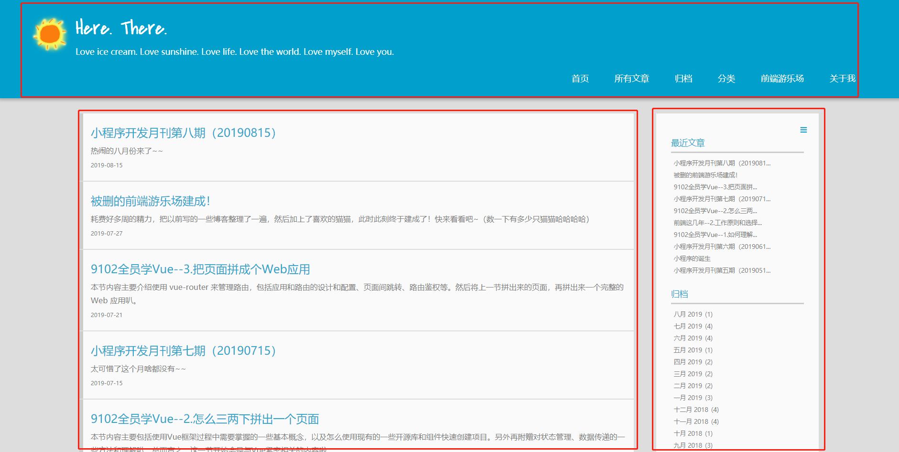
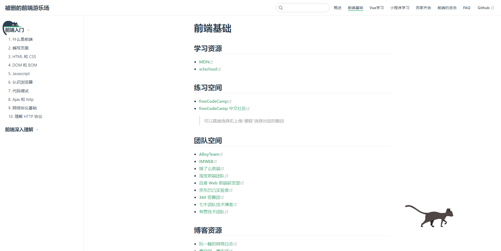
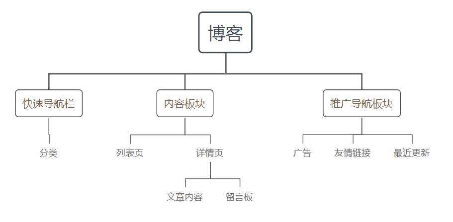
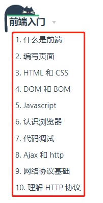

# 如何正确地进行抽象
关于抽象，它其实是一个通用的能力。而掌握了抽象的能力后，当你用到应用、页面中，不管是组件化、配置化还是数据流等处理，都可以水到渠成。

对于写业务代码，很多前端都觉得枯燥无趣，且认为容易达到技术瓶颈。其实并不是这样的，几乎所有被我们称之为“技术需求”、“技术工具”的开发，它都来自于业务的需要，Vue 也是。而在前端领域，业务开发就真的只是调节样式、拼接模板、绑定事件、接口请求、更新页面这些内容吗？其实也不是的，在学习完本章之后，你会发现前端的世界也可以这么精彩，而 Vue 也可以这么好玩。

我们下面将按照将页面划分成模块、模块抽象成数据、对应用进行配置化，以及组件的抽象、组件配置化的顺序，来探索这样一种新玩法吧。

## 1. 页面划分成模块
产品在设计一个页面的时候，会根据内容和功能的不同，设计出不同的模块，然后再拼凑成页面。对于前端同学来说，拿到一个设计好的交互稿或者设计图之后，需要进行逆向拆解，我们要把一个页面按照功能和内容划分出一个个的模块。而我们拆出来的模块并不一定完全跟产品设计的一致，会根据不同的粒度、视觉和易抽象程度来进行划分。

### 1. 什么是模块
我们来看看常见的应用页面，这里我截取了自己的博客来进行说明：



我们可以直观地根据视觉感受来划分下：



大致可以分为三大块：

- 头部：快速导航栏
- 左侧：内容板块
- 右侧：推广导航板块

其实论坛类、博客类的页面大多如此，我们再来看看用 Vuepress 搭建的前端游乐场（跟 Vue 官网很像）：



除此之外，还有视频类、电商类等各种角色的网站，大家有空也可以去看看，思考下里面是怎么划分的。或许你会觉得，想这些有什么用呢？这对我们平时的工作有什么帮助吗？其实`观察 -> 思考 -> 总结`也是有意思的事情，可以多一种角度来思考自己的工作内容，也能提高写代码的趣味性。如果你要认真地把这个过程放置到你的工作中，也可以找到很多提升工作效率的方法，也会让你的路越走越顺畅。

模块的划分，其实最终在代码中呈现出来的，常常是组件的划分。

### 2. 组件与模块
[《第4章 Vue 组件的使用》](https://godbasin.github.io/vue-ebook/vue-ebook/4.html)中，我们详细地介绍了组件。虽然组件和模块是不一样的两个概念，但是模块有些时候也可以作为一个组件来维护，而模块也可以是属于某个组件、或是包含哪些组件的关系。模块更多是在是视觉上呈现的划分，而组件则更偏向功能上的划分。一个模块是否可以成为一个组件，需要看这个模块是否拥有属于自己的状态、数据、事件等对于组件的封装也都已经在 4.4 章节中有详细的描述。

## 2.  模块抽象成数据
想象一下，在把数据与逻辑分离到极致的时候，我们看一个应用/页面，会看到一具静态的逻辑躯壳，以及动态的数据组成。数据如灵魂般地注入到应用/页面中，可使其获得生命。关于如何进行数据的抽离，通常来说可以把变化的部分分离和抽象，然后通过注入的方式，来实现具体的功能和展示。

是否有点抽象？这样的一个分离过程，也可以理解为我们写好的一个页面，需要从后台获取到数据，然后根据数据渲染出对应的内容。在这里，页面就是静态的，而获取的数据就是动态的。从另外一个角度来说，除了后台请求的数据，我们在 Vue 中通过`data`绑定的数据都可以抽离。关于这些可抽离的数据，我们来简单识别和划分一下。

### 1. 状态数据
在一个应用的设计里，我们可能会拥有多个组件，每个组件又各自维护着自己的某些状态，同时部分状态相互影响着，叠加起来呈现出应用最终的整体状态。这些状态，都可以通过数据的方式来表示，我们简单称之为**状态数据**。怎么定义状态数据？最浅显或是最直观的办法就是，这些数据可以直接影响页面的呈现，如对话框的出现、隐藏，标签的激活、失活，长流程中的进行中步骤等，都可以作为状态数据。在 Vue 里面，状态数据会经常与 v-show、v-if等逻辑结合使用。

我们的应用，大多数都是呈现树状结构，一层层地往下分解，直到无法分割的某个简单功能。同时，我们的组件也会呈现出来这样树状的方式，状态是跟随着组件维护，某个功能状态属于组件自己，最外层的状态则属于整个应用，当然这个应用可以看做是一个组件。



如图 10-4，图中的每个模块都可以附着着一个“是否可见”的状态。我们的应用状态整体上也是会呈现树状的方式，与我们的组件相对应，就像 DOM 节点树、CSS 规则树和渲染树的关系。


### 2. 动态数据
我们还有很多的数据，如内容、个人信息等，都是需要我们从数据库拉取回来的。这种需要动态获取然后用于展示或是影响展示的一些数据，我们可以称作动态数据。动态数据不同于状态数据，并不会跟随着应用的生命周期而改变，也不会随着应用的关闭而消失。它们独立存在于外界，通过注入的方式进入应用，并影响具体的展示和功能逻辑。

和状态数据不一样，动态数据并不一定呈现为树状的形式。它可以是并行的，可以是联动关系，随着注入的地方不一样，最终在应用中形成的结构也会不一致。我们可以简单理解为每个动态数据都是平等的。



如图 ，这里每篇文章内容，都是单独的一份从后台请求的数据注入。其实博客通常是静态模板，不存在从后台请求的情况，这里打个比喻，大家可以想象下社区里的文章、知乎帖子、微博等等。

### 3. 将数据与应用抽离
要怎么理解将数据与应用抽离呢？形象点形容，就像是我们一个公司，所有的桌子椅子装修和电脑都是静态的，它们相当于一个个的组件，同时每个办公室也可以是一个大点的组件或是模块。那么在我们这个公司里：
- 状态数据：椅子的位置、消耗的电量、办公室的照明和空调状态等
- 动态数据：员工等各种人员流动

当然，公司里没有人员流动的时候，似乎就是个空壳。每天上班的时候，一个个的程序员来到公司里，给公司注入灵魂，公司得以运作。要说将数据和应用抽离，作用到这个例子中大概是这个样子的：

```bash
# 将公司和人分开（下班后）
--------------------------------------------------------
                         公司
---------------------------  ---------------------------
|                                                      |  人           人
|                                                      |      人          人
|                         办公楼                        |           人
|                                                      |   人     人     人  人
|                                                      |   人      人   人
---------------------------  ---------------------------


# 在公司正常运作的时候
--------------------------------------------------------
                         公司
--------------------------------------------------------
|   人     人             人   人       人     人 人    |
|           人            人   人     人          人    |
|        人    人    办公楼   人   人          人       |
|     人    人                人  人     人     人  人  |
|     人     人         人      人     人      人   人  |
--------------------------------------------------------
```