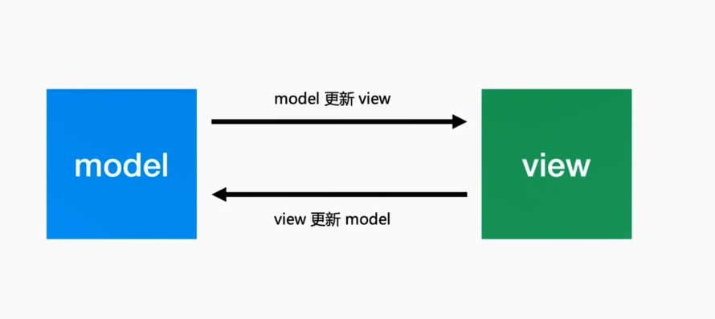
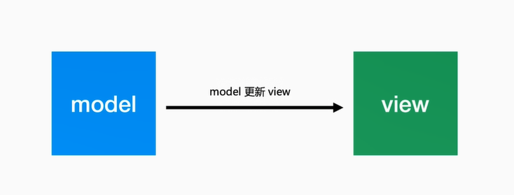
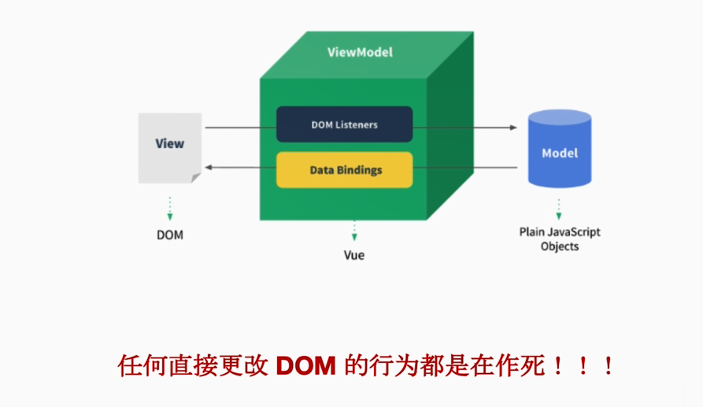
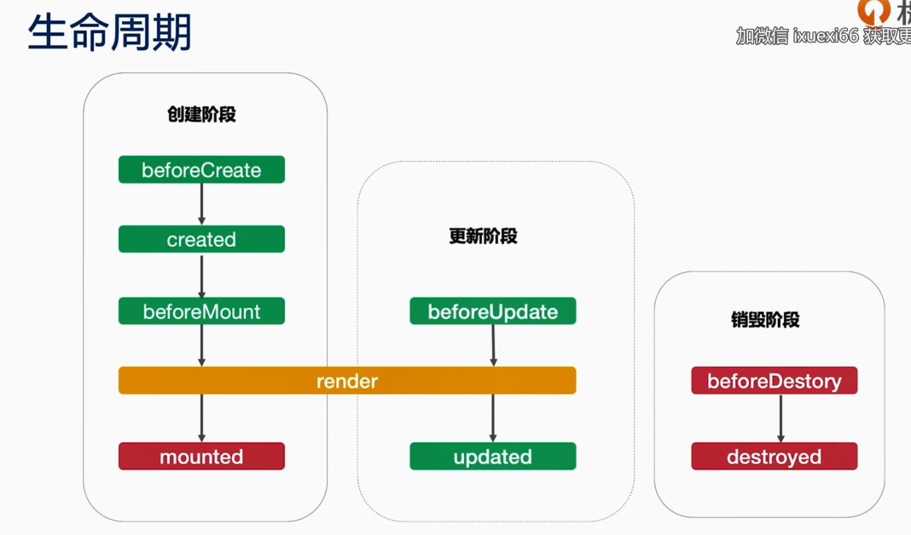
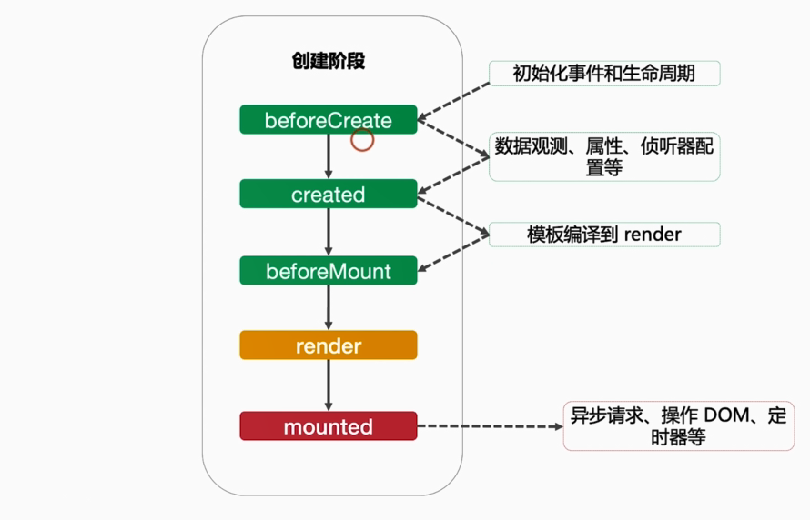
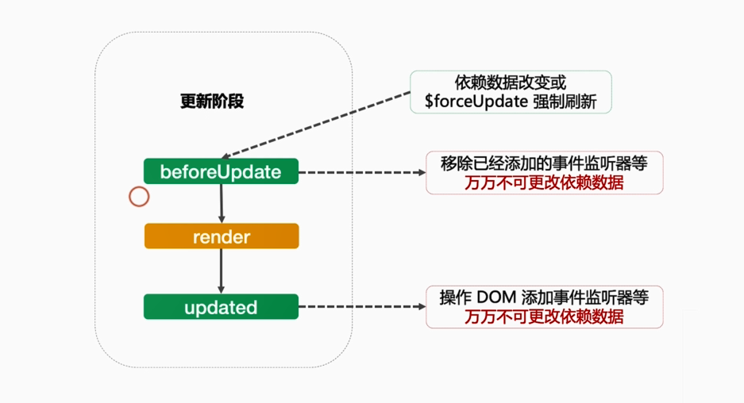
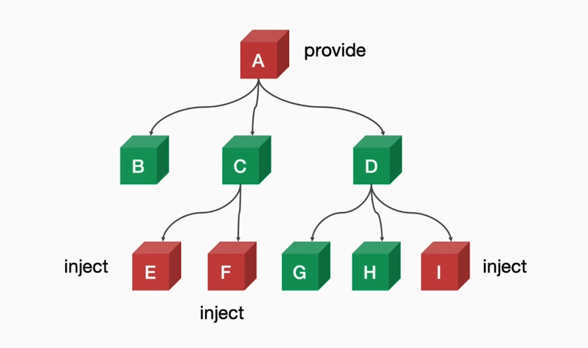

## vue的特点
1. 更加轻量20kb min + gzip
2. 渐进式框架
3. 响应式的更新机制
4. 学习成本低

## 环境搭建
- 浏览器: Chrome
- IDE: VS Code 或者 WebStorm
- Node.js 8.9+, npm

### Vue.component缺点
- 全局定义: 强制要求每个component中的命名不得重复
- 字符串模板: 缺乏语法高亮, 在HTML有多行的时候, 需要用到丑陋的 \
- 不支持CSS: 意味着当HTML和JavaScript组件化时, CSS明显被遗漏
- 没有构建步骤: 限制只能使用HTML和ES5 JavaScript, 而不能使用预处理器, 如Pug(formerly Jade) 和Babel
### Vue Cli
- npm install -g @vue/cli
- vue create hello-world
- cd hello-world
- npm run serve

## Vue组件的核心概念
组件:


Vue 组件 = Vue 实例 = new Vue(options)
### 属性
- 自定义属性 props 
    - 组件props中声明的属性
- 原生属性
    - 没有声明的属性, 默认自动挂载到组件根元素上, 设置inheritAttrs为 false 可以关闭自动挂载
- 特殊属性 class, style
    - 挂载到组件根原生上, 支持字符串, 对象, 数字等多种语法
### 事件
- 普通事件
  - @click, @input, @change, @xxx等事件, 通过this.$emit('xxx', ...) 触发
- 修饰符事件
  - @input.trim, @click.stop, @submit.prevent等, 一般用于原生HTML原生, 自定义组件需要自行开发支持
### 插槽
- 普通插槽

    - `<template slot="xxx">...</template>`
    - `<template v-slot:"xxx">...</template>`
- 作用域插槽
  - `<template slot="xxx" slot-scope="props">...</template>`
  - `<template v-slot:xxx="props" >...</template>`

### 双向绑定

model: 数据

view: 视图
什么是双向绑定:


什么是单向数据流


### 双向绑定 or 单向数据流
- Vue是单向数据流, 不是双向绑定
- Vue的双向绑定不过是语法糖
- Object.defineProperty是用来做响应式更新的, 和双向绑定没关系

语法糖:
```html
<PersonalInfo v-model="phoneInfo"
:zip-code.sync="zipCode" />
```
```html
<PersonalInfo 
    :phone-info="phoneInfo"
    @change="val =>(phoneInfo = val)"
    :zip-code="zipCOde"
    @update:zipCode="val => (zipCode=val)"
    />
```
### 数据驱动



### 数据来源(单向的)
- 来自父元素的属性
- 来自组件自身的状态 data
- 来自状态管理器, 如vuex, Vue.observable

### 状态data vs 属性 props
- 状态是组件自身的数据
- 属性是来自父组件的数据
- 状态的改变未必会触发更新
- 属性的改变未必会触发更新

### 响应式更新


### 计算属性 computed
- 减少模板中计算逻辑
- 数据缓存
- 依赖固定的数据类型(响应式数据)

### 侦听器 watch
- 更加灵活, 通用
- watch中可以执行任何逻辑, 如函数节流, Ajax异步获取数据, 甚至操作DOM
####  computed vs watch
- computed 能做的, watch都能做, 反之不行
- 能用computed的尽量用computed

## 生命周期



### 创建阶段



### 更新阶段


### 销毁阶段


## 函数式组件(临时变量)
- functional: true
- 无状态, 无实例, 没有this上下文, 无生命周期


## 指令
### 内置指令
- v-text
- v-html
- v-show
- v-if
- v-else
- v-else-if
- v-for
- v-on
- v-bind
- v-model
- v-slot
- v-pre
- v-cloak
- v-once
### 自定义指令
生命周期钩子
-  bind
-  inserted
-  update
-  componentUpdated
-  unbind

## 高级特性 provide/inject
主要解决的是: 组件通信



## 组件实例
ref引用信息
```html
<!-- `vm.$refs.p` will be the DOM node -->
<p ref="p">hello</p>

<!-- `vm.$refs.child` will be the child component instance -->
<child-component ref="child"></child-component>
```

### callback ref
- 主动通知(setXxxRef)
- 主动获取(getXxxRef)

## template vs jsx
### template
- 模板语法(HTML的扩展)
- 数据绑定使用 Mustache 语法(双大括号)

```html
<span> Message: {{msg}}</span>
```
### JSX
- JavaScript的语法扩展
- 数据绑定使用单引号

  ```html
  <span>Message: {this.msg}</span>
  ```

| template             | JSX  |
| -------------------- | ---- |
| 学习成本低           | 灵活 |
| 大量内置指令简化开发 | 灵活 |
| 组件作用域CSS        | 灵活 |

Vue官方文档:

>更抽象一点来看, 我们可以把组件分为两类: 一类是偏视图表现的(presentational), 一类则是偏逻辑的(logical). 我们推荐在前者中使用模板, 在后者中使用JSX或渲染函数. 这两类组件的比例会根据应用类型的不同有所变化,但整体来说我们发现表现类的组件远远多于逻辑类组件.


## 问题集中
1. 子组件为何不可以修改父组件传递的Prop, 如果修改了,Vue是如何监控到属性的修改并给出警告的?

    Object.defineProperty()


2. this.$emit的返回值是什么?

    - this
    - 如果需要返回值可以使用回调参数

3. 相同名称的插槽是合并还是替换

     - Vue2.5版本, 普通插槽合并, 作用域插槽替换
     - Vue2.6版本, 都是替换

4. 扩展PersonalInfo Demo对手机号做非控且合法校验,如不合法则给出错误提示

    关键代码-- 正则表达式
    ```js
    phone && /^1[0-9]{10}$/.test(phone)
    ```

5. 为什么不能用 index 作为 key?

  - 更新DOM性能问题
  - 会引入状态Bug问题

6. 数组有哪些方法支持响应式更新, 如不支持如何处理, 底层原理是如何实现的?

    - 支持: push(), pop(), shift(), unshift(), splice(), sort(), reverse()
    - 不支持: filter(), concat(), slice()
    - 原理同样是使用 Object.defineProperty 对数组方法进行改写

7. 对Watch1 Demo 进行节流改造, 即直到用户停止输入超过500毫秒后才更新fullName

    - setTimeout
      ```js
      watch:{
        firstName:function(val){
          clearTimeout(this.firstTimeout);
          this.firstTimeout = setTimeout(()=>{
            this.fullName  = val + " " + this.lastName;
          }, 500)
        },
        lastName:function(val){
          clearTimeout(this.lastTimeout);
          this.lastTimeout = setTimeout(()=> {
            this.fullName = this.firstName + " " +val;
          },500);
        }
      }
      ```
    - lodash debounce

8. 设计一个秒杀倒计时组件

    ```html
    <template>
      <div>
        <a-button :disabled="disabled" @click="handleCLick">{{ done?"已参加活动":"立即购买"}}</a-button>
        <p>{{tip}}</p>
      </div>
    </template>
    <script>
      import moment from 'moment';
      export default {
        props:{
          startTime:{
            required: true,
            validator:function(val){
              return moment.isMoment(val);
            }
          },
          endTime:{
            required: true,
            validator:function(val){
              return moment.isMoment(val);
            }
          }
        },
        data(){
          return {
            start: false,
            end: false,
            done: false,
            tip: "",
            timeGap:0
          }
        },
        computed:{
          disabled(){
            return !(this.start && !this.end && !this.done);
          }
        },
        async created(){
           const serverTime = await this.getServerTime();
           this.timeGap = Data.now() - serverTime;
           this.updateState();
           this.timeInterval = setInterval(()=>{
             this.updateState();
           },1000);
        },
        beforeDestroy(){
          clearInterval(this.timeInterval);
        },
        updated(){
          if(this.end || this.done){
            clearInterval(this.timeInterval);
          }
        },
        methods:{
          getServerTime(){
            return new Promise((resolve,reject)=>{
              setTimeout(()=>{
                resolve(new Date(Date.now() - 60*1000).getTime());
              },0);
            });
          },
          updateState(){
            const now = moment(new Date(Date.now() - this.timeGap));
            const diffStart = this.startTime.diff(now);
            const diffEnd = this.endTime.diff(now);
            if(diffStart <=0 ){
              this.start = true;
              this.tip = "秒杀已开始";
            }else{
              this.tip = `距离秒杀开始还剩 ${Math.ceil(diffStart /1000)} 秒`
            }
            if(diffEnd <=0 ){
              this.end = true;
              this.tip = "秒速已结束";
            }
          },
          handleClick(){
            alert("提交成功");
            this.done = true;
          }
        }
      }
    </script>
    ```
9. 查看组件生命周期和指令周期钩子的运行顺序

    新建
    - created
    - beforeMount
    - render
    - bind
    - mounted
    - inserted

    更新
    - componentUpdated
    - beforeUpdate
    - render
    - updated
    
    销毁:
    - beforeDestroy
    - destroyed
    - unbind

10. 使用2.6 APi Vue.observable 优化响应式 provide
    ```html
    <template>
      <div class="border">
        <h1>A 结点</h1>
        <button @click="() => changeColor()">改变color</button>
        <ChildrenB />
        <ChildrenC />
        <ChildrenD />
      </div>
    </template>
    <script>
    import Vue from "vue";
    import ChildrenB from "./ChildrenB";
    import ChildrenC from "./ChildrenC";
    import ChildrenD from "./ChildrenD";
    export default {
      components: {
        ChildrenB,
        ChildrenC,
        ChildrenD
      },
      provide() {
        this.theme = Vue.observable({
          color: "blue"
        });
        return {
          theme: this.theme
        };
      },
      methods: {
        changeColor(color) {
          if (color) {
            this.theme.color = color;
          } else {
            this.theme.color = this.theme.color === "blue" ? "red" : "blue";
          }
        }
      }
    };
    </script>
    ```
11. v-ant-ref 指令回调中能否更改响应式数据? 为什么?

    - 不能, 会死循环

