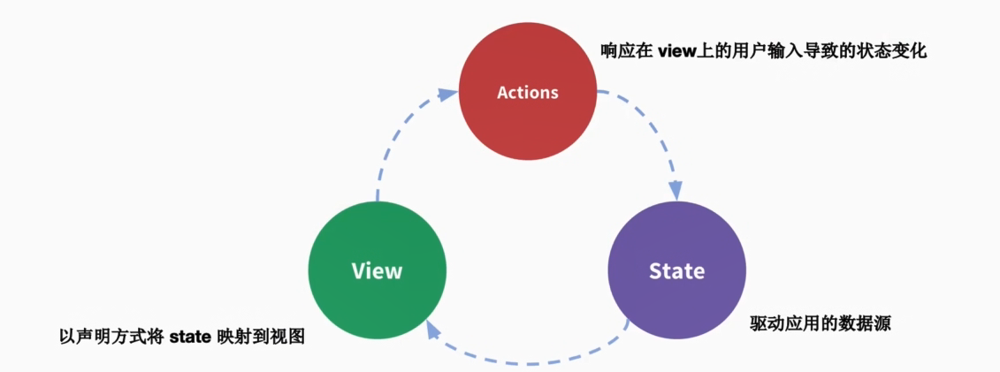
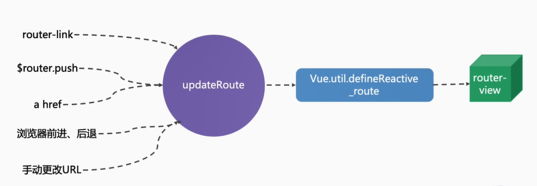
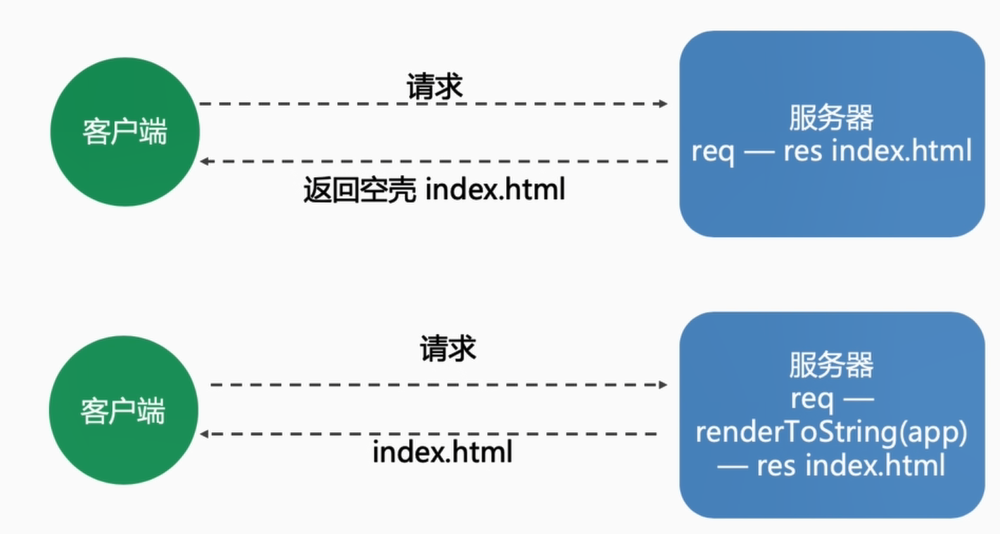

## vuex

### Vuex是一种状态管理模式




- state，驱动应用的数据源；
- view，以声明方式将 state 映射到视图；
- actions，响应在 view 上的用户输入导致的状态变化。


### Vux运行机制!


### 核心概念
- state --- `this.$store.state.xxx` 取值
- Getter  --- `this.$store.getters.xxx` 取值
- Mutation --- `this.$store.commit('xxx')` 赋值
- Action --- `this.$store.dispatch('xxx')` 赋值
- Module

### 底层原理
- State: 提供一个响应式数据
- Getter: 借助 Vue的计算属性computed来实现缓存
- Mutation: 更改 state方法
- Action: 触发mutation方法
- Module: Vue.set 动态添加到state到响应式数据中

简易源码
```js
import Vue from 'vue'
const Store = function Store(Options ={}){
    const {state = {}, mutations={} } = options;
    // 数据的响应式 改变
    this._vm = new Vue({
        data:{
            $$state:state,
        },
    })
    this._mutations = mutations;
}

Store.prototype.commit = function(type,payload){
    if(this._mutations[type]){
        this._mutations[type](this.state,payload)
    }
}

Object.defineProperties(Store.prototype,{
    state:{
        get: function(){
            return this._vm._data.$$state
        }
    }
});

export default {Store}
```

## Vuex最佳实践
### 核心概念
- state --- `this.$store.state.xxx`  --- mapState 取值
- Getter  --- `this.$store.getters.xxx` --- mapGetters 取值
- Mutation --- `this.$store.commit('xxx')` -- mapMutations 赋值
- Action --- `this.$store.dispatch('xxx')` mapActions 赋值
- Module

#### 使用常量替代 Mutation 事件类型
```js
// mutation-types.js
export const SOME_MUTATION = 'SOME_MUTATION'
```
```js
// store.js
import Vuex from 'vuex'
import { SOME_MUTATION } form './mutation-types'


const store = new Vuex.Store({
    state:{...},
    mutations:{
        // 可以使用 ES2015 风格的计算属性命名功能来使用一个常量作为函数名
        [SOME_MUTATION](state){
            // mutate state
        }
    }
})
```

#### Module
- 开启命令空间  namespaced: true
- 嵌套模块不要过深, 尽量偏平化
- 灵活应用  createNamespacedHelpers


## Vue Router

传统开发模式
- `www.xxx.com`  -- index.html
- `www.xxx.com/about`  -- about.html
- `www.xxx.com/xxx` --- xxx.html

单页面(SPA)开发模式
- `www.xxx.com`  -- index.html
- `www.xxx.com/about`  -- index.html
- `www.xxx.com/xxx` --- index.html

### 解决的问题
- 监听URL的变化, 并在变化前后执行相应的逻辑
- 不同的URL对应不同的组件
- 提供杜仲方式改变URL的API(URL的改变不能导致浏览器刷新)

### 使用方式
- 提供一个路由配置表, 不同URL对应不同组件的配置
- 初始化路由实例new VueRouter()
- 挂载到Vue实例上
- 提供一个路由占位, 用来挂载URL匹配到的组件


### 路由的类型
- Hash模式: 丑, 无法使用锚点定位
- History模式: 需要后端配合, IE9不兼容(可使用强制刷新处理)

### 路由底层原理



### SPA缺点
- 不利于SEO
  - 解决方案: 服务端渲染SSR
- 首屏渲染时间长
  - 预渲染 PreRendering
  - 适用于静态站点

### SSR
- 动态渲染
- 配置繁琐

### Nuxt
- 静态站点
- 动态渲染
- 简化配置

### SSR核心原理


流程图:



## UI组件库的对比

Element VS Ant Design VS ivieW

| <p></p> | 数量 | 单测 | admin | 背景 | 原型, 设计 |
| ------- | ---- | ---- | ----- | ---- | ---------- ||
| Element UI     | 46   | 81%  | vue-element-admin(社区) | 饿了么                     | Axure, Sketch |
| Ant Design Vue | 55   | 87%  | Pro(社区)               | 社区主导, 蚂蚁金服技术支持 | Axure, Sketch |
| iView          | 54   | 无   | iView-admin             | TalkingData                | 无            |

### vue开发工具
Vetur, ESLint, Prettier, Vue DevTools

#### Vetur(vscode的插件)
- 语法高亮
- 标签补全, 模板生成
- Lint检查
- 格式化

#### Eslint
- 代码规范
- 错误检查

#### Prettier
- 代码格式美化

#### Vue DevTools
- 集成Vuex
- 可远程调试
- 性能分析

### 单元测试
#### 重要性
- 保证研发质量
- 提高项目的稳定性
- 提高开发速度

#### 使用方式
- jest 或 mocha
- @vue/test-utils
- sinon

## 问题解答
1. Vuex是通过什么方式提供响应式数据的?

    - new Vue({})

2. 扩展简化版的min-vuex, 实现getters, 并实现Vuex的方式注入 $store

    - 计算属性computed 实现 getters 缓存
    - beforeCreate 中 混入 $store 的获取方式
    
    ```js
    import Vue from 'vue'
    function install(_Vue){
        Vue = _Vue;
        function vuexInit(){
            var options = this.$options;
            // store injection
            if(options.store){
                this.$store = typeof options.store === 'function'? options.store(): options.store;
            }else if(options.parent && options.$store){
                this.$store = options.parent.$store;
            }
        }
        Vue.mixin({beforeCreate: VueInit});
    }
    const Store = function Store(Options ={}){
        const {state = {}, mutations={} } = options;
        const computed = {};

        const store = this;
        store.getters = {};
        for(let [key, fn] of Object.entries(getters)){
            computed[key] = function(){
                return fn(store.state, store.getter)
            }
            Object.defineProperty(store.getters,key,{
                get: function(){return store._vm[key];},
            })
        }

        // 数据的响应式 改变
        this._vm = new Vue({
            data:{
                $$state:state,
            },
            computed
        })
        this._mutations = mutations;
    }

    Store.prototype.commit = function(type,payload){
        if(this._mutations[type]){
            this._mutations[type](this.state,payload)
        }
    }

    Object.defineProperties(Store.prototype,{
        state:{
            get: function(){
                return this._vm._data.$$state
            }
        }
    });

    export default {Store, install}
    ```

4. SPA的缺点有哪些?

    - SEO
    - 首屏渲染时间

5. 对于动态内容, 如果不使用SSR, 如何做SEO
    - 使用无头浏览器(phantomjs, headlessChrome)
