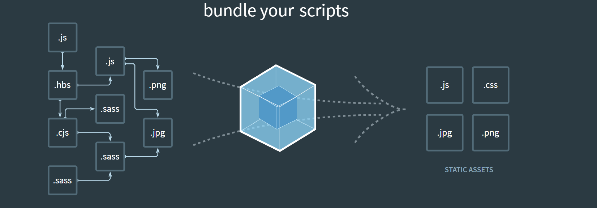

# Entry
Entry 用来指定 webpack 的打包入口



依赖图的入口是 entry

对于非代码比如图片, 字体依赖也会不断加入依赖图中

## Entry的用法
单入口:  entry 是一个字符串
```js
module.exports ={
    entry: './path/to/my/entry/file.js'
}
```
多入口: entry 是一个对象
```js
module.exports={
    entry:{
        app:'./src/app.js',
        adminApp:'./src/adminApp.js'
    }
}
```
# Output
Output 用来告诉 webpack 如何将编译后的文件输出到磁盘

## OutPut的用法
单入口配置:
```js
module.exports={}
    entry:'./path/my/entry/file.js',
    output:{
        filename:'bundle.js',
        path:__dirname+'/dist'
    }
```
多入口配置
```js
module.exports={
    entry:{
        app:'./src/app.js',
        search:'/src/search.js'
    },
    output:{
        filanem:'[name].js',   // ---> 通过占位符确保文件名称的唯一
        path:__dirname+'/dist'
    }
}
```
# Loaders
webpack 开箱即用 只支持 JS 和 JSON 两种文件类型, 通过 Loaders 去支持其他文件类型并且把他们转换成有效的模块, 并且可以添加到依赖图中

本身是一个函数, 接受源文件作为参数, 返回转换的结果

## 常见的 Loaders 有哪些?
| 名称          | 描述                       |
| ------------- | -------------------------- |
| babel-loader  | 转换ES6, ES7等JS新特性语法 |
| css-loader    | 支持.css文件的加载和解析   |
| less-loader   | 将less文件转换成css        |
| ts-loader     | 将ts转换成js               |
| file-loader   | 进行图片, 字体等的打包     |
| raw-loader    | 将文件以字符串的形式导入   |
| thread-loader | 多进程打包js和css          |

## loaders的用法
```js
const path = require('path')
module.exports = {
    output:{
        filename:'bundle.js'
    },
    module:{
        rules:[    
            {test:/\.txt$/, use:'raw-loader'}
        ]
    },
}
```
- `test`: 指定匹配规则
- `use`: 指定使用的 `loader` 名称

# Plugins
插件用于 bundle 文件的优化, 资源管理和环境变量注入

作用于整个构建过程

>loader无法完成的事情, 都可以交给Plugins来做

## 常见的  Plugins 有哪些?
| 名称                     | 描述                                       |
| ------------------------ | ------------------------------------------ |
| CommonsChunkPlugin       | 将chunks相同的模块代码提取成公共js         |
| cleanWebpackPlugin       | 清理构建目录                               |
| ExtractTextWebpackPlugin | 将css从 bunlde 文件提取成一个独立的css文件 |
| CopyWebpackPlugin        | 将文件或文件夹拷贝到构建的输出目录         |
| HtmlWebpackPlugin        | 创建html文件去承载输出的bundle             |
| UglifyjsWebpackPlugin    | 压缩js                                     |
| ZipWebpackPlugin         | 将打包的资源生成一个zip包                  |

## Pkugins的用法
```js
const path = require('path')
module.exports = {
    output:{ 
        filename:'bundle.js'
    },  
    plugins:[    //---> 放到 plugins 数组里
        new HtmlwebpackPlugin({
            template:'./src/index.html'
        })
    ]
}
```
# mode
mode 用来指定当前的构建环境是:  production, development 还是 none

设置 mode 可以使用 webpack 内置的函数, 默认值为 production

## mode的内置函数功能
| 选项          | 描述                                                                                                                                                                                                                         |
| ------------- | ---------------------------------------------------------------------------------------------------------------------------------------------------------------------------------------------------------------------------- |
| `development` | 设置`process.env.NODE_ENV`的值为 `development`. 开启`NamedChunksPlugin` 和 `NamedModulesPlugin`.                                                                                                                             |
| `production`  | 设置`process.env.NODE_ENV`的值为 `production`.开启`FLagDependencyUsagePlugin`, `FlagIncludedChunksPlugin`,`ModuleConcatenationPlugin`,`NoEmitOnErrorsPlugin`,`OccurrenceOrderPlugin`,`SideEffectsFlagPlugin`和`TerserPlugin` |
| `node`        | 不开启任何优化选项                                                                                                                                                                                                           |

# 资源解析
## 解析ES6
使用 `babel-loader`

`babel` 的配置文件是: `.babelrc`

webpack.config.js
```diff
const path = require('path')
module.exports = {
    output:{ 
        filename:'bundle.js',
        path:path.resolve(__dirname,'dist')
    },  

+   module:{
+       rules:[
+       {
+            test:/\.js$/,
+            use: 'babel-loader'
+       }
+        ]   
+     }

}
```
增加 ES6 的babel preset配置

`.babelrc`
```diff
{
    "presets":[
+        "@babel/preset-env"   // ---> 增加ES6的 babel preset 配置
    ],
    "plugins":[
        "@babel/proposal-class-properties"
    ]
}
```

## 解析 React JSX
`.babelrc`
```diff
{
    "presets":[
        "@babel/preset-env"   
+       "@babel/preset-react" // ---> 增加  React 的 babel preset 配置
    ],
    "plugins":[
        "@babel/proposal-class-properties"
    ]
}
```
## 解析CSS
css-loader 用于加载 .css文件, 并且转化成 commonjs 对象

style-loader 将样式通过 `<style>` 标签插入到 `head`中

```diff
const path = require('path')
module.exports = {
    output:{ 
        filename:'bundle.js',
        path:path.resolve(__dirname,'dist')
    },  

+   module:{
+       rules:[
+       {
+            test:/\.css$/,
+            use: ['style-loader','css-loader']
+       }
+        ]   
+     }

}
```
## 解析Less和Sass
less-loader用于将 less 转化成 css
```diff
const path = require('path')
module.exports = {
    output:{ 
        filename:'bundle.js',
        path:path.resolve(__dirname,'dist')
    },  

+   module:{
+       rules:[
+       {
+            test:/\.less$/,
+            use: [
                'style-loader',
                'css-loader',
                'less-loader'
            ]
+       }
+        ]   
+     }

}
```
## 解析图片
file-loader 用于处理文件
```diff
const path = require('path')
module.exports = {
    output:{ 
        filename:'bundle.js',
        path:path.resolve(__dirname,'dist')
    },  

+   module:{
+       rules:[
+       {
+            test:/\.(png|svg|jpg|gif)$/,
+            use: 'file-loader'
+       }
+        ]   
+     }

}
```
## 解析字体
file-loader 也可以用于处理字体
```diff
const path = require('path')
module.exports = {
    output:{ 
        filename:'bundle.js',
        path:path.resolve(__dirname,'dist')
    },  

+   module:{
+       rules:[
+       {
+            test:/\.(woff|woff2|eot|ttf|otf)$/,
+            use: 'file-loader'
+       }
+        ]   
+     }

}
```
## 使用 url-loader
url-loader 也可以处理图片和字体

可以设置较小资源自动 `base64`
```diff
const path = require('path')
module.exports = {
    output:{ 
        filename:'bundle.js',
        path:path.resolve(__dirname,'dist')
    },  

+   module:{
+       rules:[
+       {
+            test:/\.(png|svg|jpg|gif)$/,
+            use: [{
+                    loader:'url-loader',
+                    options:{
+                        limit:10240
+                    }
+                }]
+       }
+        ]   
+     }

}
```

# 文件监听
文件监听是在发现源码发生改变时, 自动重新构建出新的输出文件

webpack 开启监听模式, 有两种方式:
- 启动 webpack 命令时, 带上 --watch 参数
- 在配置 webpack.config.js 中设置 `watch: true`


## 文件监听使用
package.json
```diff
{
  "name": "hello-webpack",
  "version": "1.0.0",
  "description": "",
  "main": "index.js",
  "scripts":{
    "build":"webpack",
+    "watch":"webpack --watch"
},
  "keywords": [],
  "author": "",
  "license": "ISC",
  "devDependencies": {
    "webpack": "^5.11.1",
    "webpack-cli": "^4.3.0"
  }
}
```
唯一缺陷: 每次需要手动刷新浏览器

## 原理分析
轮询判断文件的最后编辑时间是否变化

某个文件发生了变化, 并不会立刻告诉监听者, 而是先缓存起来, 等 `aggregateTimeout`
```js
module.export={
    // 默认 false, 也就是不开启
    watch:true,
    // 只有开启监听模式, watchOptions 才有意义
    watchOptions:{
        // 默认为空, 不监听的文件或者文件夹, 支持正则匹配
        ignored:/node_modules/,
        // 监听到变化发生后等300ms再去执行, 默认300ms
        aggregateTimeout:300,
        // 判断文件是否发生变化是通过不停询问系统指定文件有没有变化实现, 是默认每秒问1000次
        poll:1000
    }
}
```
# 热更新: webpack-dev-server
1. WDS 不刷新浏览器
2. WDS 不输出文件, 而是放在内存中
3. 使用 `HotModuleReplacementPlugin` 插件
```diff
{
  "name": "hello-webpack",
  "version": "1.0.0",
  "description": "",
  "main": "index.js",
  "scripts":{
    "build":"webpack",
+   "dev":"webpack-dev-server --open"

},
  "keywords": [],
  "author": "",
  "license": "ISC",
  "devDependencies": {
    "webpack": "^5.11.1",
    "webpack-cli": "^4.3.0"
  }
}
```

webpack.config.js
```js
const path = require('path')
const webpack = require('webpack')

module.exports = {
    entry:{
        index:'./src/index.js',
        search:'./src/search.js'
    },
    output:{ 
        filename:'bundle.js',
        path:path.resolve(__dirname,'dist')
    },  
    mode:'development',
+   plugins:[
+       new webpack.HotModuleReplacementPlugin()
+   ],
+   devServer:{
+       contentBase:'./dist',
+       hot:true
+   }
}
```
# 热更新: 使用 webpack-dev-middleware
WDM 将 webpack 输出的文件传输给服务器

适用于灵活的定制场景
```js
const express = require('express');
const webpack = require('webpack');
const webpackDevMiddleware = require('webpack-dev-middleware');

const app = express()
const config = require('./webpack.config.js');
const compiler = webpack(config);

app.use(webpackDevMiddleware(compiler,{
    publicPath:config,
    output:publicPath
}));

app.listen(3000, function(){
    console.log('Example app listening port 3000!\n');
});
```
## 热更新的原理分析
Webpack Compile: 将 JS 编译成 Bundle

HMR Server: 将热更新的文件输出 HMR Runtime

Bundle server: 提供文件在浏览器的访问

HMR Runtime: 会被注入到浏览器, 更新文件的变化

bundle.js: 构建输出的文件

# 文件指纹
打包后输出的文件名的后缀

## 文件指纹如何生成
**Hash**: 和整个项目的构建相关, 只要项目文件有修改, 整个项目构建的has值就会更改

**Chunkhash**: 和 webpack 打包的 chunk 有关, 不同的 entry 会生成不同的chunkhash值

**Contenthash**: 根据文件内容来定义 hash, 文件内容不变, 则 contenthash 不变

## JS 的 文件指纹设置
设置  output 的 filename, 使用 [chunkhash],

```diff
module.exports = {
    entry:{
        index:'./src/index.js',
        search:'./src/search.js'
    },
    output:{ 
+        filename:'[name][chunkhash:8].js',
        path:path.resolve(__dirname,'dist')
    },  
    mode:'development'
}
```
## css的文件指纹设置
设置 MiniCssExtractPlugin 的 filename, 使用 [contenthash]
```diff
module.exports = {
    entry:{
        index:'./src/index.js',
        search:'./src/search.js'
    },
    output:{ 
        filename:'bundle.js',
        path:path.resolve(__dirname,'dist')
    },  
    plugins:[
+       new MiniCssExtractPlugin({
+            filename:'[name][contenthash:8].css'
+       });
    ]
}
```
## 图片的文件指纹设置
设置  file-loader 的 name, 使用 [hash]

| 占位符名称    | 含义                            |
| ------------- | ------------------------------- |
| [ext]         | 资源后缀名                      |
| [name]        | 文件名称                        |
| [path]        | 文件的相对路径                  |
| [folder]      | 文件所在的文件夹                |
| [contenthash] | 文件的内容hash, 默认是md5生成   |
| [hash]        | 文件内容的Hash, 默认是md5生成   |
| [emoji]       | 一个随机的指代文件的内容的emoji |

```diff
module.exports = {
    entry:{
        index:'./src/index.js',
        search:'./src/search.js'
    },
    output:{ 
        filename:'bundle.js',
        path:path.resolve(__dirname,'dist')
    },  
    mode:'development',
    module:{
        rules:[
            {
                test:/\.(png|svg|jpg|gif)$/,
                use:[{
                    loader:'file-loader',
+                   options:{
+                       name:'img/[name][hash:8].[ext]'
+                   }
                }]
            }
        ]
    }
}
```
# 代码压缩
HTML压缩

CSS压缩

JS压缩
## js文件的压缩
内置了 uglifyjs-webpack-plugin
## css文件的压缩
使用 optimize-css-webpack-plugin

同时使用cssnano
```diff
module.exports = {
    entry:{
        index:'./src/index.js',
        search:'./src/search.js'
    },
    output:{ 
        filename:'bundle.js',
        path:path.resolve(__dirname,'dist')
    },  
    mode:'development',
+   plugins:[
+       new OptimizeCSSAssetsPlugin({
+           assetNameRegExp:/\.css$/g,
+           cssProcessor: require('cssnano')
+    })
+   ],
}
```
## html 文件的压缩
修改 html-webpack-plugin, 设置压缩参数
```js
module.exports = {
    entry:{
        index:'./src/index.js',
        search:'./src/search.js'
    },
    output:{ 
        filename:'bundle.js',
        path:path.resolve(__dirname,'dist')
    },  
    mode:'development',
+   plugins:[
+       new HtmlWebpackPlugin({
+           template:path.join(__dirname,'src/search.html'),
+           filename:'search.html',
+           chunks:['search']
+           inject:true,
+           minify:{
+               html5:true,
+               collapseWhitespace:true,
+               preserverLineBreaks: false,
+               minifyCSS:true,
+               minifyJS: true,
+               removeComments:false,
+           }
+       })
+   ]
}
```
