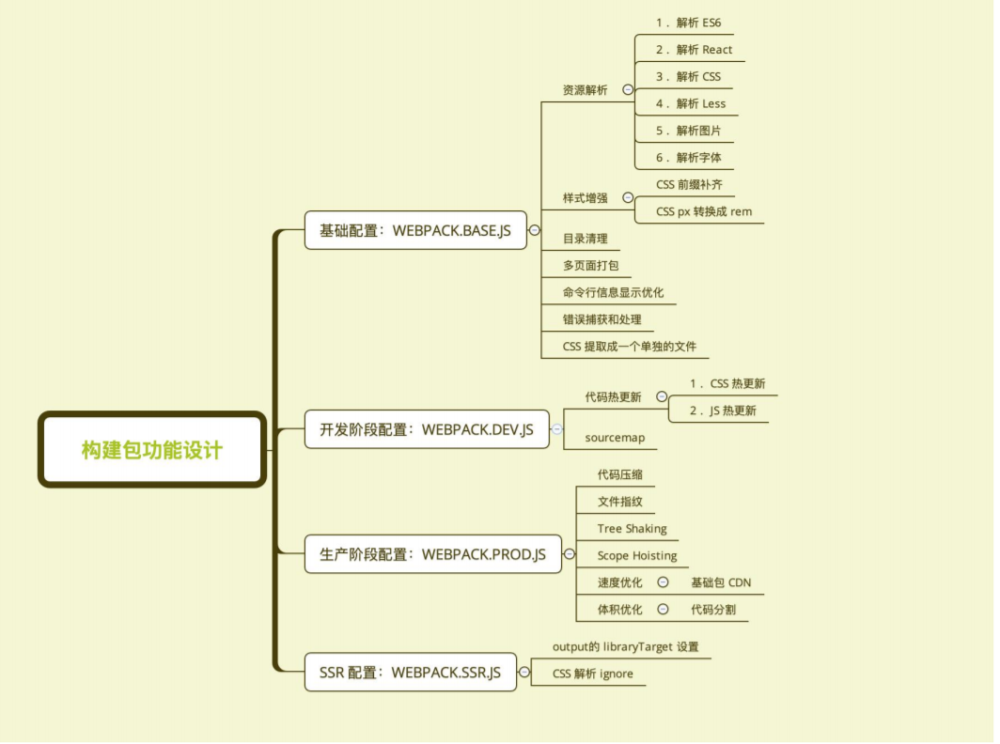
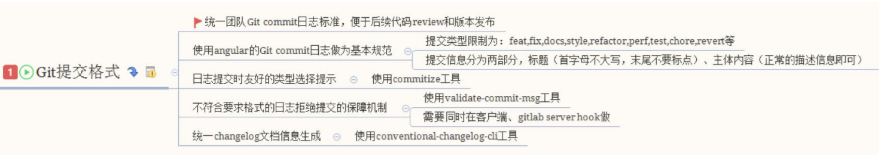

## 构建配置抽离成 npm的意义
### 通用性
- 业务开发者无需关注构建配置
- 统一团队构建脚本

### 可维护性
- 构建配置合理的拆分
- README 文档, ChangeLog文档等

### 质量
- 冒烟测试, 单元测试, 测试覆盖率
- 持续集成

## 构建配置管理的可选方案
- 通过多个配置文件管理不同环境的构建, webpack --config 参数进行控制
- 将构建配置设计成一个库, 比如: hjs-webpack, Neutino, webpack-blocks
- 抽成一个工具进行管理, 比如: create-react-app, kyt, nwb
- 将所有的配置放在一个文件, 通过 --env 参数控制分支选择


## 构建配置包设计
通过多个配置文件管理不同环境的 webpack 配置
- 基础配置: webpack.base.js
- 开发环境: webpack.dev.js
- 生产环境: webpack.prod.js
- SSR环境: webpack.ssr.js
- ...

抽离成一个npm包统一管理
- 规范: Git commit日志, README, ESLint 规范, Semver规范
- 质量: 冒烟测试, 单元测试, 测试覆盖率 和 CI

### 通过 webpack-merge 组合配置
```js
merge = require('webpack-merge')
merge(
    { a:[1],b:5,c:20,}
    { a:[2],b:10,d:421,}
    )
{a:[1,2],b:10,c:20,d:421}
```
合并配置: `module.exports  = merge(baseConfig, devConfig)`

### 功能模块设计


### 目录结构设计
lib 放置源代码

test放置测试代码

```bash
+ |-/test
+ |-/lib
+  | - webpack.dev.js
+  | - webpack.prod.js
+  | - webpack.ssr.js
+  | - webpack.base.js
+ |- README.md
+ |- CHANGELOG.md
+ |- .eslinrc.js
+ |- package.json
+ |- index.js
```
## 使用 ESLint 规范构建脚本
使用 eslint-config-airbnb-base

eslint --fix可以自动处理空格

```js
module.exports = {
    "parser":"babel-eslint",
    "extends":"airbnb-base",
    "env":{
        "browser":true,
        "node":true
    }
}
```
## 冒烟测试(smoke testing)
冒烟测试是指对提交测试的软件在进行详细深入的测试之前而进行的预测试, 这种预测试的主要目的是暴露导致软件需重新发布的基本功能失效等严重问题
## 冒烟测试执行
- 构建是否成功
- 每次构建完成 build目录是否有内容输出
  - 是否有JS, CSS等静态资源
  - 是否有HTML文件

### 判断构建是否成功
在示例项目里面运行构建, 看看是否有报错
### 判断基本功能是否整个
编写 mocha  测试用例
- 是否有JS, CSS等静态资源文件
- 是否有HTML文件

### 单元测试与测试覆盖率
单纯的测试框架, 需要断言库
- chai
- should.js
- expect
- better-assert

集成框架, 开箱即用

极简API
### 编写单元测试用例
- 技术选项: Mocha + Chai
- 测试代码: describe, it, except
- 测试命令: mocha add.test.js

add test.js
```js
const expect = require('chai').expect;
const add = require('../src/add')

describe('use expect: src/add.js', ()=>{
    if('add(1,2) === 3',()=>{
        expect('add(1,2).to.equal(3)')
    });
});
```
### 单元测试接入
1. 安装 mocha + chai

    ```bash
    npm i mocha chai -D
    ```
2. 新建 test 目录, 并增加 xxx.test.js 测试文件
3. 在package.json长的scripts字段增加 test 命令
   
   ```js
   "script":{
       "test":"node_modules/mocha/bin/_mocha"
   },
   ```
4. 执行测试命令

    ```bash
    npm run test
    ```
## 持续集成的作用
优点: 
- 快速发现错误
- 防止分支大幅偏离主干

核心措施是, 代码集成到主干之前, 必须通过自动化测试. 只要有一个测试用例失败, 就不能集成. 

### 接入 Travis CI
1. http://travis-ci.org/ 使用 Github 账号登录
2. 在 https://travis-ci.org/account/reppositeories 为项目开启
3. 项目根目录下新增 `.travis.yml`

### travis.yml 文件内容
- install 安装项目依赖
- script 运行测试用例

```yml
language: node_js
sudo: false
cache:
    apt: true
    directories:
        - node_modules
node_js: stable # 设置相应的版本
install:
    - npm install -D  # 安装构建器依赖
    - cd ./test/template-project
    - npm install -D  # 安装模板项目依赖
script:
    - npm test
```
## 发布到nppm
- 添加用户: npm adduser
- 升级版本
  - 升级补丁版本号: npm version patch
  - 升级小版本号: npm version minor
  - 升级大版本号: npm version major
- 发布版本: npm publish

## Git规范和Changelog生成
良好的Git commit 规范优势:
- 加快 Code Review 的 流程
- 根据 Git Commit 的元数据生成 Changelog
- 后续维护者可以知道 Feature 被修改的原因

### 技术方案


### 提交格式要求
```bash
<tpye>(<scope>):<subject>
<BLANK LINE>
<body>
<BLANK LINE>
<footer>
```
对格式的说明如下:
- type代表某次提交的类型, 比如是修复一个bug还是增加一个新的feature, 所有的type类型如下:
  - feat: 新增 feature
  - fix: 修复bug
  - docs: 仅仅修改了文档, 比如README, CHANGELOG, CONTRIBUTE等等
  - style: 仅仅修改了空格, 格式缩进, 逗号等等, 不改变代码逻辑
  - refactor: 代码重构, 没有加新功能或者修复bug
  - perf: 优化相关, 比如提升性能, 体验
  - test: 测试用例, 包括单元测试, 集成测试等
  - chore: 改变构建流程, 或者增加依赖库, 工具等
  - revert: 回滚到上一个版本

### 本地开发阶段增加 precommit 钩子
安装husky
```bash
npm install husky --save-dev
```
通过 commitmsg 钩子校验信息
```js
"scripts":{
    "commitmsg":"validate-commit-msg",
    "changelog":"conventional-changelog -p angular -i CHANGELOG.md -s -r 0"
},
"devDependencies":{
    "validate-commit-msg":"^2.11.1",
    "conventional-changelog-cli":"^1.2.0",
    "husky":"^0.13.1"
}
```
## 开源项目版本信息案例
- 软件的版本通常由 三位组成, 形如: X.Y.Z
- 版本是严格递增的, 此处是: 16.2.0 -> 16.3.0 -> 16.3.1
- 在发布重要版本时, 可以发布 alpha, rc 等先行版本
- alpha和rc等修饰版本的关键字后面可以带上次数和meta信息

### 遵守 semver 规范的优势
- 避免出现循环依赖
- 依赖冲突减少

### 语义化版本(Semantic Versioning)规范格式
- 主版本号: 当你做了不兼容的API修改
- 次版本号: 当你做了向下兼容的功能性新增
- 修订号: 当你做了向下兼容的问题修正
### 先行版本号
先行版本号可以作为发布正式版之前的版本, 格式是在修订版本号后面加上一个连接号(-), 再加上一连串以点(.)分割的标识符, 标识符可以由英文, 数字和连接号([0-9A-Za-z])组成

- alpha: 是内部测试版, 一般不向外部发布, 会有很多Bug. 一般只有测试人员使用
- beta: 也是测试版, 这个阶段的版本会一直加入新的功能, 在 Alpha版之后推出
- rc: Release-Candidate 系统平台上就是发行候选版本, RC版不会再加入新的功能了, 主要着重于除错.

