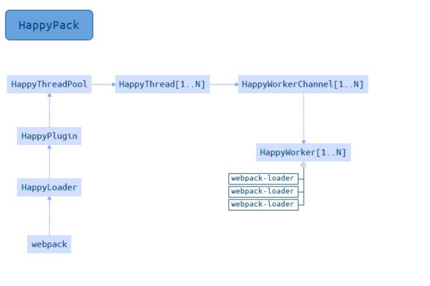

## 初级分析: 使用 webpack 内置的stats
stats: 构建的统计信息

package.json 中 使用 stats
```js
'script":{
    "build:stats":"webpack --env production --json > stats.json",
}
```
## 速度分析: 使用 speed-measure-webpack-plugin
代码示例:
```js
const SpeedMeasurePlugin = require('speed-measure-webpack-plugin');
const swp = new SpeedMeasurePlugin();

const webpackConfig = swp.wrap({
    plugin:[
        new MyPlugin(),
        new MyOtherPlugin()
    ]
});
```
可以看到每个loader和插件执行耗时
### 速度分析插件作用
1. 分析整个打包耗时
2. 每个插件和loader的耗时情况

## 体积分析 webpack-bundle-analyzer
代码示例
```js
const  BundleAnalyzerPlugin = require('webpack-bundle-analyzer').BundleAnalyzerPlugin;

module.exports = {
    plugins:[
        new BundleAnalyzerPlugin()
    ]
}
```
构建完成会在 8888 端口 展示大小

### 可以分析哪些问题?
- 依赖的第三方模块文件大小
- 业务里面的组件代码大小

## 速度的优化
1. 使用高版本的 webpack 和 Node.js
2. 多进程/多实例构建

### 使用 webpack4: 优化原因
1. v8带来的优化(for of代替forEach, Map和Set代替 Object, includes代替indexOf)
2. 默认使用更快的md4 hash算法
3. webpack AST可以直接从loader传递给AST, 减少解析时间
4. 使用字符串方法替代正则表达式

### 多进程/多实例构建: 资源并行解析可选方案

thread-loader 可选方案:
- parallel-webpack
- HappyPack

### 使用HappyPack解析资源
原理: 每次webpack解析一个模块, HappyPack会将它及它的依赖分配给worker线程中

代码示例
```js
exports.plugin ={
    new HappyPack({
        id:'jsx',
        threads:4,
        loaders:['babel-loader']
    }),
    new HappyPack({
        id:'styles',
        threads:2,
        loaders:['style-loader','css-loader','less-loader']
    })
}
```

工作流程:


### 使用 thread-loader 解析资源
原理: 每次 webpack 解析一个模块, thread-loader 会将它及它的依赖分配给 worker 线程中
```js
module.exports = swp.wrap({
    entry: entry,
    output:{
        path: path.join(__dirname, 'dist')
        filename: '[name]_[chunkhash:8].js'
    },
    mode:'production',
    module:{
        rules:[
            {
                test:/.js$/,
                use:[
                    {
                        loader:'thread-loader',
                        options:{
                            worker:3
                        }
                    },
                    'babel-loader'
                ]
            }
        ]
    }
    
})
```
## 多进程/多实例: 并行压缩
### 方法一: 使用 parallel-uglify-plugin 插件
```js
const ParallelUglifyPlugin = require('parallel-uglify-plugin')

module.exports = {
    plugins:[
        new ParallelUglifyPlugin({
            uglifyJS:{
                output:{
                    beautify:false,
                    comments:false,
                },
                compress:{
                    warnings: false,
                    drop_console: true,
                    collapse_vars: true,
                    reduce_vars:true
                }
            },
        }),
    ],
};
```
### 方法二: 使用 uglify-webpack-plugin 插件 开启 parallel 参数
```js
const UglifyPlugin = require('uglify-webpack-plugin')

module.exports = {
    plugins:[
        new UglifyPlugin({
            uglifyOptions:{
                warnings: false,
                parse:{},
                compress :{},
                mangle: true,
                output: null,
                toplevel: false,
                nameCache:null,
                ie8: false,
                keep_fnames:false
            },
            parallel:true
        }),
    ],
};
```
### 方法三: terser-webpack-plugin 开启 parallel 参数
```js
const TerserPlugin = require('terser-webpack-plugin')

module.exports = {
    optimizations:{
        minimizer:[
            new TerserPlugin({
                parallel:4
            })
        ],
    },
};
```
## 分包: 设置 Externals
- 思路: 将 react, react-dom 基础包 通过 cdn 引入, 不打入 bundle 中
- 方法: 使用 html-webpack-external-plugin

```js
const HtmlWebpackExternalsPlugin = require('html-webpack-externals-plugin');

plugin:[s:[]
    new HtmlWebpackExternalsPlugin({
        externals:[
            {
                module:'react',
                entry:'//11.url.cn/now/lib/15.1.0/react-with-addons.min.js?_bif=3123',
                global:'React'
            },{
                module:'react-dom',
                entry: '//11.url.cn/now/lig/15.1.0/react-dom.min.js?_bid=3123',
                global:'ReactDOM'
            }
        ]
    })
]
```
## 进一步分包: 预编译资源模块
- 思路: 将 react, react-dom, redux, react-redux 基础包和业务基础包打包成一个文件
- 方法: 使用DllPlugin进行分包, DIIReferencePlugin 对 manifest.json 引用

### 使用DLLPlugin分包
```js
const path = require('path')
const webpack = require('webpack')

module.exports = {
    context: process.cwd(),
    resolve:{
        extensions:['.js','.jsx','.json','.less', '.css']
        modules:[__dirname,'node_modules']
    },
    entry:{
        library:[
            'react',
            'react-dom',
            'redux',
            'react-dom'
        ]
    },
    output:{
        filename:'[name].dll.js',
        path: path.resolve(__dirname,'./build/library'),
        library:'[name]]'
    },
    plugins:[
        new webpack.DllPlugin({
            name:'[name]',
            path:'./build/library/[name].json'
        })
    ]
}
```
### 使用 DllReferencePlugin 引用 manifest.json 
在webpack.config.js 引入
```js
module.exports ={
    plugin:[
        new webpack.DllReferencePlugin({
            manifest: require('./build/library/manifest.json')
        })
    ]
}
```

## 缓存
- 目的: 提升二次构建速度
- 缓存思路:
  - babel-loader 开启缓存
  - terser-webpack-plugin 开启缓存
  - 使用 cache-loader 或者 hard-source-webpack-plugin


## 缩小构建目标
- 目的: 尽可能的少构建模块
- 比如: babel-loader 不解析  node_modules

```js
module.exports={
    rules:{
        test:/\.js$/,
        loader:'happypack/loader',
        exclude:'node_modules'
    }
}
```
## 减少文件搜索范围
- 优化 resolve.modules 配置(减少模块搜索层级)
- 优化 resolve.mainFields 配置
- 优化 resolve.extensions 配置
- 合理使用 alias 

## 图片压缩
- 要求: 基于 Node 库 的 imagemin或者 tinypng API
- 使用: 配置 image-webpack-loader

### Imagemin的优点分析
- 有很多定制选项
- 可以引入更多第三方优化插件, 例如 pngquant
- 可以处理多种图片格式
### Imagemin的压缩原理
- pngquant: 是一款PNG压缩器, 通过将图像转换为具有alpha通道(通常比24/32位PNG文件小60-80%)的更高效的8位PNG格式,可显著减小文件大小
- pngcrush: 其主要的是通常尝试不同的压缩级别和PNG过滤方法来降低PNG IDAT数据流的大小
- optipng: 其设计灵感来自于pngcrush. optipng可将图像文件重新压缩为更小尺寸, 而不会丢失任何信息
- tinypng: 也是将24位png文件转化为更小有索引的8位图片, 同时所有非必要的metadat也会被剥离掉

## tree shaking(摇树优化)复习
- 概念: 1个模块可能有多个方法, 只要其中的某个方法使用到了, 则整个文件都会被达到 bundle里面去, tree shaking 就是只把用到的方法打入bundle,没用到的方法会在 uglify 阶段就被擦除掉
- 使用: webpack 默认支持, 在.babelrc里设置 modules:false即可
  - production: mode 的情况下默认开启

要求: 必须是ES6的语法, CJS的方式不支持

### 无用的CSS 如何删除掉
- PurifyCSS:遍历代码, 识别已经用到的CSS class
- uncss: HTML需要通过jsdom加载, 所有的样式通过PostCSS解析, 通过document.querySelector来识别在html文件里面不存在的选择器

### 在 webpack 中如何使用 PurifyCSS?
使用 purgecss-webpack-plugin
- https://github.com/FullHuman/purgecss-webpack-plugin

需要 和 mini-css-extract-plugin 配合使用

### 构建体积优化: 动态 Polyfill

| 方案                           | 优点                                    | 缺点                                                                                                               | 是否采用 |
| ------------------------------ | --------------------------------------- | ------------------------------------------------------------------------------------------------------------------ | -------- |
| babel-polyfill                 | React16官方推荐                         | 1. 包体积200k+, 难以单独抽离Map,Set<br/> 2. 项目里React时单独引用的cdn, 如果要用它,需要单独构建一份放在react前加载 | X        |
| babel-plugin-transform-runtime | 能只polyfill用到的类或方法,相对体积较小 | 不能polyfill原型上的方法,不适用于业务项目的复杂开发环境                                                            | X        |
| 自己写MAp, Set的polyfill       | 定制化高, 体积小                        | 1. 重复造轮子, 容易在日后年久失修称为坑. <br/>2. 即使体积小, 依然所有用户都要加载                                  | X        |
| polyfill-service               | 只给用户返回需要的polyfill, 社区维护    | 部分国内奇葩浏览器UA可能无法识别(但可以降级返回所需所有polyfill)                                                   | √        |

### Polyfill Service原理
识别 User Agent, 下发不同的Polyfill
### 如何使用动态 Polyfill Service
polyfill.io 官方提供的服务
```html
<script src="https://cdn.polyfill.io/v2/polyfill.min.js"></script>
```
    
## 体积优化策略总结
- Scope Hoisting
- Tree-shaking
- 公共资源分离
- 图片压缩
- 动态Polyfill