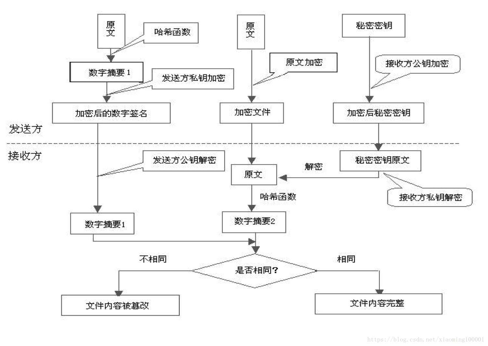

### 三、HTTP VS HTTPS

##### HTTP特点：

1. 无状态：协议对客户端没有状态存储，对事物处理没有“记忆”能力，比如访问一个网站需要反复进行登录操作
2. 无连接：HTTP/1.1之前，由于无状态特点，每次请求需要通过TCP三次握手四次挥手，和服务器重新建立连接。比如某个客户机在短时间多次请求同一个资源，服务器并不能区别是否已经响应过用户的请求，所以每次需要重新响应请求，需要耗费不必要的时间和流量。
3. 基于请求和响应：基本的特性，由客户端发起请求，服务端响应
4. 简单快速、灵活
5. 通信使用明文、请求和响应不会对通信方进行确认、无法保护数据的完整性

**下面通过一个简单的抓包实验观察使用HTTP请求传输的数据：**

###### 结果分析：HTTP协议传输数据以明文形式显示

###### 针对无状态的一些解决策略：

###### 场景：逛电商商场用户需要使用的时间比较长，需要对用户一段时间的HTTP通信状态进行保存，比如执行一次登陆操作，在30分钟内所有的请求都不需要再次登陆。

1. 通过Cookie/Session技术
2. HTTP/1.1持久连接（HTTP keep-alive）方法，只要任意一端没有明确提出断开连接，则保持TCP连接状态，在请求首部字段中的Connection: keep-alive即为表明使用了持久连接

#### HTTPS特点：

基于HTTP协议，通过SSL或TLS提供加密处理数据、验证对方身份以及数据完整性保护

通过抓包可以看到数据不是明文传输，而且HTTPS有如下特点：

1. 内容加密：采用混合加密技术，中间者无法直接查看明文内容
2. 验证身份：通过证书认证客户端访问的是自己的服务器
3. 保护数据完整性：防止传输的内容被中间人冒充或者篡改

> **混合加密：** 结合非对称加密和对称加密技术。客户端使用对称加密生成密钥对传输数据进行加密，然后使用非对称加密的公钥再对秘钥进行加密，所以网络上传输的数据是被秘钥加密的密文和用公钥加密后的秘密秘钥，因此即使被黑客截取，由于没有私钥，无法获取到加密明文的秘钥，便无法获取到明文数据。
>
>
> **数字摘要：** 通过单向hash函数对原文进行哈希，将需加密的明文“摘要”成一串固定长度(如128bit)的密文，不同的明文摘要成的密文其结果总是不相同，同样的明文其摘要必定一致，并且即使知道了摘要也不能反推出明文。
>
>
> **数字签名技术：** 数字签名建立在公钥加密体制基础上，是公钥加密技术的另一类应用。它把公钥加密技术和数字摘要结合起来，形成了实用的数字签名技术。

- 收方能够证实发送方的真实身份；
- 发送方事后不能否认所发送过的报文；
- 收方或非法者不能伪造、篡改报文。

非对称加密过程需要用到公钥进行加密，那么公钥从何而来？其实公钥就被包含在数字证书中，数字证书通常来说是由受信任的数字证书颁发机构CA，在验证服务器身份后颁发，证书中包含了一个密钥对（公钥和私钥）和所有者识别信息。数字证书被放到服务端，具有服务器身份验证和数据传输加密功能。