## 汇总篇地址
https://forum.huawei.com/enterprise/zh/thread-331003.html

## 什么是防火墙
墙，始于防，忠于守。自古至今，墙予人以安全之意。

防火墙，顾名思义，阻挡的是火，此词起源于建筑领域，正是用来隔离火灾，阻止火势从一个区域蔓延到另一个区域。

引入到通信领域，防火墙也正是形象化地体现了这一特点：防火墙这一具体设备，通常用于两个网络之间的隔离。当然，这种隔离是高明的，隔离的是“火”的蔓延，而又保证“人”的穿墙而过。这里的“火”是指网络中的各种攻击，而“人”是指正常的通信报文。

那么，用通信语言来定义，防火墙主要用于保护一个网络区域免受来自另一个网络区域的网络攻击和网络入侵行为。因其隔离、防守的属性，灵活应用于**网络边界**、**子网隔离**等位置，具体如企业网络出口、大型网络内部子网隔离、数据中心边界等等。

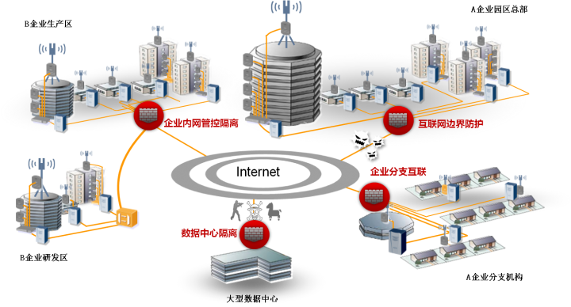

从上文可以看到, 防火墙与路由器,交换机是由区别的. 路由器用来连接不同的网络，通过路由协议保证互联互通，确保将报文转发到目的地；交换机则通常用来组建局域网，作为局域网通信的重要枢纽，通过二层/三层交换快速转发报文；而防火墙主要部署在网络边界，对进出网络的访问行为进行控制，安全防护是其核心特性。路由器与交换机的本质是转发，防火墙的本质是控制。

## 防火墙的昨,今,明

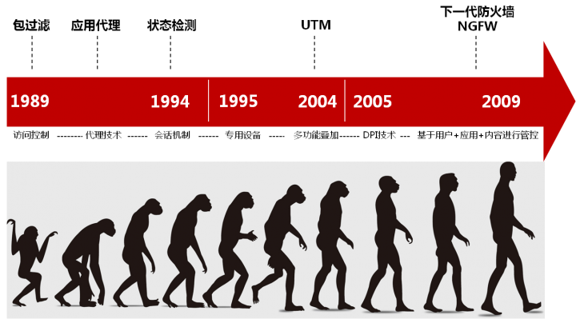

**1989年至1004年**
- 1989年产生了包过滤防火墙, 实现简单的访问控制,我们称之为第一代防火墙。
- 随后出现了代理防火墙，在应用层代理内部网络和外部网络之间的通信，属于第二代防火墙。代理防火墙安全性较高，但处理速度慢，而且对每一种应用开发一个对应的代理服务是很难做到的，因此只能对少量的应用提供代理支持。
- 1994年CheckPoint公司1发布了第一台基于状态检测技术的防火墙，通过动态分析报文的状态来决定对报文采取的动作，不需要为每个应用程序都进行代理，处理速度快而且安全性高。状态检测防火墙被称为第三代防火墙。

**1995年至2004年**

- 在这一时期,状态检测防火墙已经成为趋势。除了访问控制功能之外，防火墙上也开始增加一些其他功能，如VPN。
- 同时，一些专用设备也在这一时期出现了雏形。例如，专门保护Web服务器安全的WAF（Web Application Firewall，Web应用防火墙）设备。
- 2004年业界提出了UTM（United Threat Management，统一威胁管理）的概念，将传统防火墙、入侵检测、防病毒、URL过滤、应用程序控制、邮件过滤等功能融合到一台防火墙上，实现全面的安全防护。

**2005年至今**

- 2004年后，UTM市场得到了快速的发展，UTM产品如雨后春笋般涌现，但面临新的问题。首先是对应用层信息的检测程度受到限制，举个例子，假设防火墙允许“男人”通过，拒绝“女人”通过，那么是否允许来自星星的都教授（外星人）通过呢？此时就需要更高级的检测手段，这使得DPI（Deep Packet Inspection，深度报文检测）技术得到广泛应用。其次是性能问题，多个功能同时运行，UTM设备的处理性能将会严重下降。
- 2008年Palo Alto Networks公司2发布了下一代防火墙，解决了多个功能同时运行时性能下降的问题。同时，还可以基于用户、应用和内容来进行管控。
- 2009年Gartner3对下一代防火墙进行了定义，明确下一代防火墙应具备的功能特性。随后各个安全厂商也推出了各自的下一代防火墙产品，防火墙进入了一个新的时代。

### 从发展历史,看到以下三个最主要的特点
1. 访问控制越来越精确. 从最初的简单访问控制, 到基于会话的访问控制, 再到下一代防火墙基于应用, 用户和内容来做访问控制,都是为了实现更有效更精确地访问控制
2. 防护能力越来越强, 从早期地隔离功能,到逐渐增加了入侵检测, 防病毒, URL过滤, 应用程序控制,邮件过滤等功能, 防护手段越来越多, 防护的范围也越来越广
3. 性能越来越高. 随着网络中业务流量爆炸式增长，对性能的需求也越来越高，各个防火墙厂商通过对硬件和软件架构的不断改进，使防火墙的处理性能与业务流量相匹配。

## 安全区域
安全区域(Security Zone), 简称为区域(Zone). 安全区域是一个或多个接口的集合，是防火墙区别于路由器的主要特性。防火墙通过安全区域来划分网络、标识报文流动的“路线”，当报文在不同的安全区域之间流动时，才会触发安全检查1。

我们都知道，防火墙通过接口来连接网络，将接口划分到安全区域后，通过接口就把安全区域和网络关联起来。通常说某个安全区域，就可以表示该安全区域中接口所连接的网络。接口、网络和安全区域的关系所下图所示。

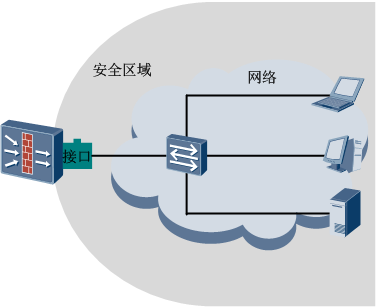

通过把接口划分到不同的安全区域中, 就可以在防火墙上划分处不同的网络.如下图所示，我们把接口1和接口2放到安全区域A中，接口3放到安全区域B中，接口4放到安全区域C中，这样在防火墙上就存在了三个安全区域，对应三个网络.

华为防火墙产品上默认已经为大家提供了三个安全区域，分别是Trust、DMZ和Untrust，光从名字看就知道这三个安全区域很有内涵，下面强叔就为大家逐一介绍：

- Trust区域，该区域内网络的受信任程度高，通常用来定义内部用户所在的网络。
- DMZ区域2，该区域内网络的受信任程度中等，通常用来定义内部服务器所在的网络。
- Untrust区域，该区域代表的是不受信任的网络，通常用来定义Internet等不安全的网络。

在网络数量较少、环境简单的场合中，使用默认提供的安全区域就可以满足划分网络的需求。当然，在网络数量较多的场合，您还可以根据需要创建新的安全区域。

如下图所示，假设接口1和接口2连接的是内部用户，那我们就把这两个接口划分到Trust区域中；接口3连接内部服务器，将它划分到DMZ区域；接口4连接Internet，将它划分到Untrust区域。

由此我们可以得知，不同网络间互访时报文在防火墙上所走的路线。例如，当内部网络中的用户访问Internet时，报文在防火墙上的路线是从Trust区域到Untrust区域；当Internet上的用户访问内部服务器时，报文在防火墙上的路线是从Untrust区域到DMZ区域。

除了在不同网络之间流动的报文之外，还存在从某个网络到达防火墙本身的报文（例如我们登录到防火墙上进行配置），以及从防火墙本身发出的报文，如何在防火墙上标识这类报文的路线呢？

如下图所示，防火墙上提供了Local区域，代表防火墙本身。凡是由防火墙主动发出的报文均可认为是从Local区域中发出，凡是需要防火墙响应并处理（而不是转发）的报文均可认为是由Local区域接收。

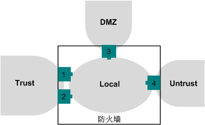

现在我们就可以把经过防火墙的流量和防火墙本身的流量都标识出来了，前面介绍过，不同的网络受信任的程度不同，在防火墙上用安全区域来表示网络后，怎么来判断一个安全区域的受信任程度呢？在华为防火墙上，每个安全区域都有一个唯一的安全级别，用1～100的数字表示，数字越大，则代表该区域内的网络越可信。对于默认的安全区域，它们的安全级别是固定的：Local区域的安全级别是100，Trust区域的安全级别是85，DMZ区域的安全级别是50，Untrust区域的安全级别是5。

级别确定之后，安全区域就被分成了三六九等，高低有别。报文在两个安全区域之间流动时，我们规定：**报文从低级别的安全区域向高级别的安全区域流动时为入方向（Inbound），报文从由高级别的安全区域向低级别的安全区域流动时为出方向（Outbound）。** 报文在两个方向上流动时，将会触发不同的安全检查。下图标明了Local区域、Trust区域、DMZ区域和Untrust区域间的方向。

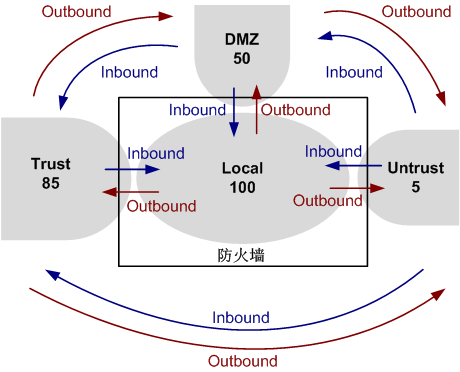

通过安全区域，防火墙上划分出了等级森严、关系明确的网络，防火墙成为连接各个网络的节点。以此为基础，防火墙就可以对各个网络之间流动的报文进行安全检查和实施管控策略。

下面给出了防火墙部署在企业内部的真实环境组网图。从图中我们可以看出，企业内部网络中的用户、服务器，以及位于外部的Internet，都被划分到不同的安全区域中了，防火墙对各个安全区域之间流动的报文进行安全检查。

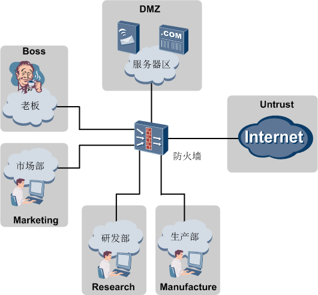

1. 默认情况下，报文在不同的安全区域之间流动时，才会触发安全检查，在同一个安全区域中流动时，不会触发安全检查。同时，华为的防火墙也支持对同一个安全区域内经过防火墙的流量进行安全检查，更加灵活实用。
2. DMZ（Demilitarized Zone）起源于军方，是介于严格的军事管制区和松散的公共区域之间的一种部分管制的区域。防火墙引用了这一术语，指代一个与内部网络和外部网络分离的安全区域。

## 状态检测和会话机制

### 状态检测防火墙产生的背景
请大家先看一个简单的网络环境，如下图所示，PC和Web服务器位于不同的网络，分别与防火墙相连，PC与Web服务器之间的通信受到防火墙的控制。

当PC需要访问Web服务器浏览网页时，在防火墙上必须配置如下的一条规则，允许PC访问Web服务器的报文通过。

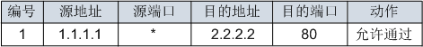

在这条规则中，源端口处的*表示任意的端口，这是因为PC在访问Web服务器时，它的操作系统决定了所使用的源端口，例如，对于WINDOWS操作系统来说，这个值可能是1024~65535范围内任意的一个端口。这个值是不确定的，所以这里设定为任意端口。

配置了这条规则后，PC发出的报文就可以顺利通过防火墙，到达Web服务器。然后Web服务器将会向PC发送回应报文，这个报文也要穿过防火墙才能到达PC。在状态检测防火墙出现之前，包过滤防火墙还必须配置如下所示的规则2，允许反方向的报文通过

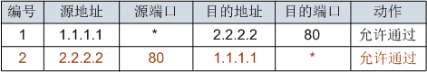

在规则2中，目的端口也设定为任意端口，因为我们无法确定PC访问Web服务器时使用的源端口，要想使Web服务器回应的报文都能顺利穿过防火墙到达PC，只能将规则2中的目的端口设定为任意端口。

如果PC位于受保护的网络中，这样处理将会带来很大的安全问题。规则2将去往PC的目的端口全部开放，外部的恶意攻击者伪装成Web服务器，就可以畅通无阻地穿过防火墙，PC将会面临严重的安全风险。

接下来让我们看一下状态检测防火墙怎么解决这个问题。还是以上面的网络环境为例，首先我们还是需要在防火墙上设定规则1，允许PC访问Web服务器的报文通过。当报文到达防火墙后，防火墙允许报文通过，同时还会针对PC访问Web服务器的这个行为建立会话（Session），会话中包含了PC发出的报文信息，如地址和端口等。

当Web服务器回应给PC的报文到达防火墙后，防火墙会把报文中的信息与会话中的信息进行比对，发现报文中的信息与会话中的信息相匹配，并且符合协议规范对后续包的定义，则认为这个报文属于PC访问Web服务器行为的后续回应报文，直接允许这个报文通过，如下图所示。

而恶意攻击者即使伪装成Web服务器向PC发起访问，由于这类报文不属于PC访问Web服务器行为的后续回应报文，防火墙就不会允许这些报文通过。这样就解决了包过滤防火墙大范围开放端口带来的安全风险，同时也保证了PC可以正常访问Web服务器。

总结一下，包过滤防火墙只根据设定好的静态规则来判断是否允许报文通过，它认为报文都是无状态的孤立个体，不关注报文产生的前因后果。而状态检测防火墙的出现正好弥补了包过滤防火墙的这个缺陷，状态检测防火墙使用基于连接状态的检测机制，将通信双方之间交互的属于同一连接的所有报文都作为整体的数据流来对待。在状态检测防火墙看来，同一个数据流内的报文不再是孤立的个体，而是存在联系的。为数据流的第一个报文建立会话，数据流内的后续报文直接根据会话进行转发，提高了转发效率。

接着我们就来进一步了解一下会话，会话是通信双方的连接在防火墙上的具体体现，代表两者的连接状态，一条会话就表示通信双方的一个连接。防火墙上多条会话的集合就叫做会话表（Session table），先看一个标准的会话表项：

http  VPN:public --> public 1.1.1.1:2049-->2.2.2.2:80

我们重点介绍这个表项中的关键字段：http表示协议，1.1.1.1表示源地址，2049表示源端口，2.2.2.2表示目的地址，80表示目的端口。我们是如何区分源和目的呢？其实通过“-->”符号就可以直观区分，符号前面的是源，符号后面的是目的。

源地址、源端口、目的地址、目的端口和协议这五个元素是会话的重要信息，我们将这五个元素称之为“五元组”。只要这五个元素相同的报文即可认为属于同一条流，在防火墙上通过这五个元素就可以唯一确定一条连接。

需要注意的是，会话是动态生成的，但不是永远存在的。如果长时间没有报文匹配，则说明通信双方已经断开了连接，不再需要该条会话了。此时，为了节约系统资源，防火墙会在一段时间后删除会话，该时间称为会话的老化时间。

光说不练假把式，下面强叔就使用eNSP模拟器来搭建一个简单的网络环境，验证防火墙上的状态检测机制。网络拓扑如下

防火墙上只配置了一条规则：允许PC访问Web服务器的报文通过。在PC上使用HttpClient程序访问Web服务器，发现可以成功访问：

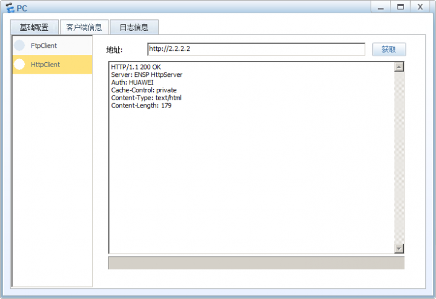

在防火墙上使用`display firewall session table`命令查看会话表的信息，发现已经建立一条会话：

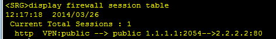

说明状态检测机制工作正常，防火墙收到Web服务器返回给PC的报文后，发现该报文可以匹配到该条会话，即使没有配置允许反方向报文通过的规则，防火墙也允许其通过。

## 安全策略篇

防火墙的基本作用是保护特定网络免受“不信任”的网络的攻击，但是同时还必须允许两个网络之间可以进行合法的通信。安全策略的作用就是对通过防火墙的数据流进行检验，符合安全策略的合法数据流才能通过防火墙。

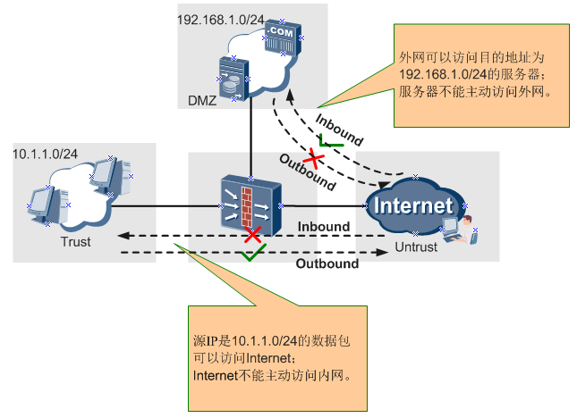

如上图所示，可以在不同的域间方向应用不同的安全策略进行不同的控制。

安全策略是由匹配条件和动作（允许/拒绝）组成的控制规则，可以基于IP、端口、协议等属性进行细化的控制。例如下边这条安全策略控制源IP是1.1.1.1的流量可以访问目的地址为2.2.2.2的Web服务器。

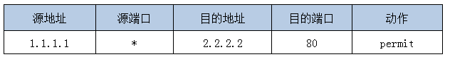

缺省情况下，所有域间的所有方向都禁止报文通过1，可以根据需求配置允许哪些数据流通过防火墙的安全策略。

1. 对于路由、ARP等底层协议一般是不受安全策略控制的，直接允许通过。当然这和具体产品实现有关，产品间可能有差异。

另外再说一下，除了经过防火墙转发的数据流，设备本身与外界互访的数据流也同样受安全策略的控制哦！例如当登录设备、网管与设备对接时，需要配置登录PC/网管所在安全区域与Local域之间的安全策略。

同时为了灵活应对各种组网情况，华为防火墙还支持配置域内策略，也就对同一个安全区域内经过防火墙的流量进行安全检查。当然缺省情况下是允许所有域内报文通过防火墙的。

有人可能要问了，缺省域间不允许数据流通过，我要逐条为允许通过的数据流配置安全策略也太繁琐了？比如我只想控制少数IP发起的流量不能经过防火墙，其他IP的流量都可以经过防火墙，有什么好办法吗？

当然有，防火墙出于安全考虑缺省情况拒绝所有流量经过，但是这个缺省情况是可以修改的，这就是 **“缺省包过滤”**。如果流量没有匹配到任何安全策略，将按缺省包过滤的动作进行处理。因此实现上述需求可只配置拒绝流量通过的安全策略，缺省包过滤改为permit。

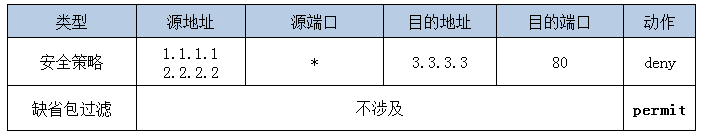

### 安全策略的应用方向

既然一个域间有`Inbound`和`Outbound`两个方向，那是否需要为访问的双向流量同时配置安全策略呢？No，对于同一条数据流，在访问发起的方向上应用安全策略即可，反向报文不需要额外的策略。这点和路由器、交换机包过滤不一样，主要原因就是防火墙是状态检测设备，对于同一条数据流只有首包匹配安全策略并建立会话，后续包都匹配会话转发。

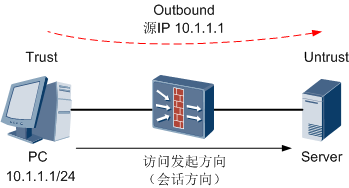

### 安全策略的匹配
防火墙将流量的属性与安全策略的条件进行匹配, 如果所有条件都匹配,则此流量成功匹配安全策略. 如果其中有一个条件不匹配, 则未匹配安全策略

同一域间或域内应用多条安全策略，策略的优先级按照配置顺序进行排列，越先配置的策略优先级越高，越先匹配报文。如果报文匹配到一条策略就不再继续匹配剩下的策略，如果没有匹配到任何策略就按缺省包过滤处理。所以配置策略还是有一定讲究的，要先细后粗。

举个具体的例子：企业FTP服务器地址为10.1.1.1，办公区IP段为`10.2.1.0/24`，要求禁止两台临时办公PC（10.2.1.1、10.2.1.2）访问FTP服务器。如下这样配置有什么问题？

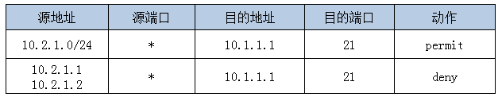

这样配置将无法实现“禁止两台临时办公PC（10.2.1.1、10.2.1.2）访问FTP服务器”的需求，因为这两个IP已经命中了第一条宽泛的策略，无法再命中第二条策略。所以两条策略需要调换顺序。

#### 安全策略发展史
有同学可能要问了，啥安全策略，不就是包过滤吗？那你可out了，随着防火墙产品的推陈出新，包过滤也逐渐进化，已经发展成为可以做深度内容检查的“安全策略”。策略匹配条件也已经在“五元组”的基础上增加了用户、应用等匹配条件，还增加了内容安全检测处理。

下图展现了安全策略的发展历程，大家可以看到NGFW中已经实现了基于“七元组”的安全策略。细粒度的安全管控使藏匿于流量中的危险分子无所遁形。

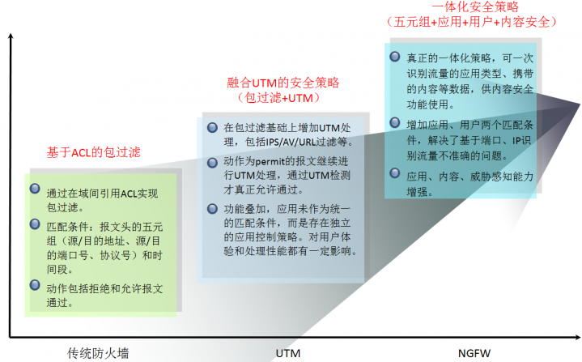

### 基于ACL的包过滤
包过滤的处理过程是先获取需要转发数据包的报文头信息，然后和设定的ACL规则进行比较，根据比较的结果对数据包进行转发或者丢弃。实现包过滤的核心技术是访问控制列表ACL。

因此包过滤只能基于IP地址、端口号等控制流量是否可以通过防火墙，无法准确识别应用。

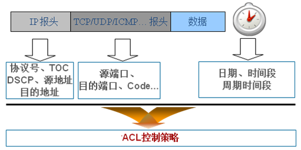

基于ACL的包过滤的配置方式是先配置好包含多条数据流规则（rule）的ACL，其中每条rule包含数据流的匹配条件和permit/deny动作，然后ACL再被域间包过滤引用。一个域间只能引用一个ACL。

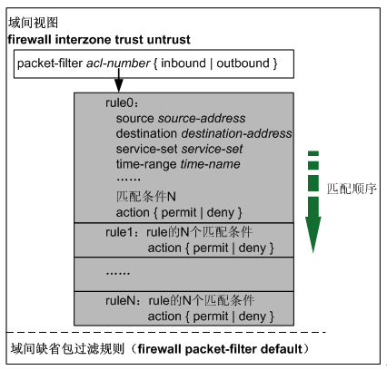

### 发展中期的UTM设备安全策略
随着USG2000/5000系列UTM产品的推出，“安全策略”这个概念被提出。之所以不叫包过滤了，是因为策略中集成了UTM检测功能，配置方式也由ACL方式变为Policy方式。

通过下边这个界面可以直观的看到安全策略的组成：包过滤+UTM。不启用UTM功能时就是原始的包过滤；动作为permit的安全策略可以引用IPS、AV等UTM策略，对流量进一步进行UTM检测，通过检测的流量才能真正通过防火墙。

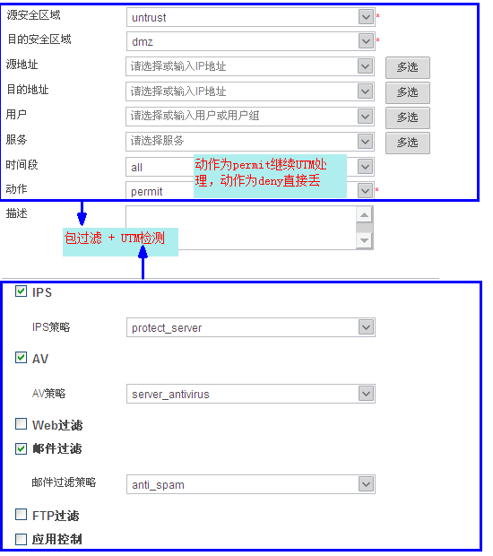

另外配置方式上也变为Policy方式，即在配置安全策略时直接指定匹配数据流的多种条件以及动作，配置更简单。

此时的安全策略已经有一体化安全处理的雏形了，将防火墙包过滤功能和内容安全功能进行了融合，但是还有一定局限性。

了解UTM的同学们应该知道，UTM更多的是体现功能集成，将传统防火墙、入侵防御设备、反病毒设备等集成到一个硬件。UTM设备的多个安全功能之间的紧密度不高，报文匹配安全策略的匹配条件后需要逐一进入各个UTM模块进行检测和处理，如果同时开启多个安全功能，设备性能往往大幅下降。

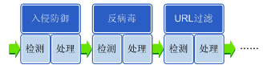

另外基于应用的管控需要配置额外的应用控制策略，不能直接将应用类型作为策略的匹配条件。例如需要禁止员工使用IM应用，此时要额外配置禁止IM应用的“应用控制策略”然后再在安全策略引用生效。也就是应用识别与管控需要进入另外一个模块处理。

### NGFW的一体化安全策略
到了NGFW阶段，对一体化、应用识别与管控、高性能等要求更高。安全策略充分体现了这些特质，通过应用、用户、内容、威胁等多个维度的识别将模糊的网络环境映射为实际的业务环境，从而实现精准的访问控制和安全检测。

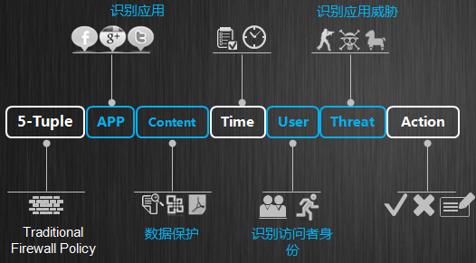