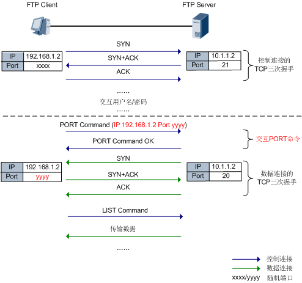
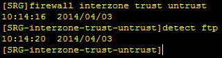
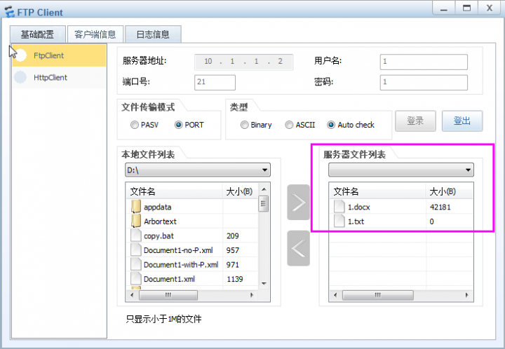
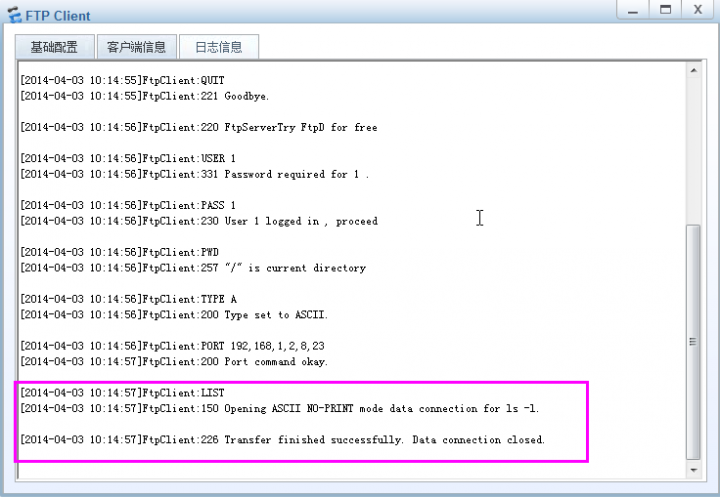
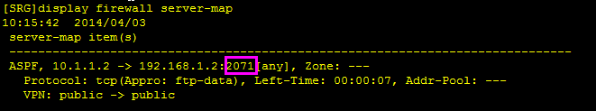
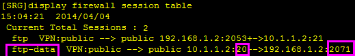
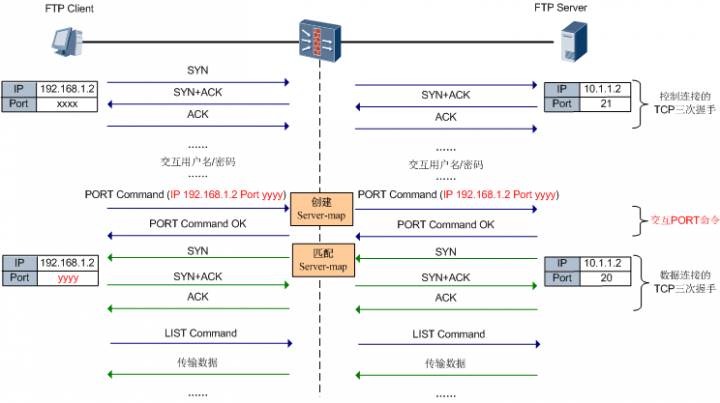

## 安全策略篇

防火墙的基本作用是保护特定网络免受“不信任”的网络的攻击，但是同时还必须允许两个网络之间可以进行合法的通信。安全策略的作用就是对通过防火墙的数据流进行检验，符合安全策略的合法数据流才能通过防火墙。

如上图所示，可以在不同的域间方向应用不同的安全策略进行不同的控制。

安全策略是由匹配条件和动作（允许/拒绝）组成的控制规则，可以基于IP、端口、协议等属性进行细化的控制。例如下边这条安全策略控制源IP是1.1.1.1的流量可以访问目的地址为2.2.2.2的Web服务器。

缺省情况下，所有域间的所有方向都禁止报文通过1，可以根据需求配置允许哪些数据流通过防火墙的安全策略。

1. 对于路由、ARP等底层协议一般是不受安全策略控制的，直接允许通过。当然这和具体产品实现有关，产品间可能有差异。

另外再说一下，除了经过防火墙转发的数据流，设备本身与外界互访的数据流也同样受安全策略的控制哦！例如当登录设备、网管与设备对接时，需要配置登录PC/网管所在安全区域与Local域之间的安全策略。

同时为了灵活应对各种组网情况，华为防火墙还支持配置域内策略，也就对同一个安全区域内经过防火墙的流量进行安全检查。当然缺省情况下是允许所有域内报文通过防火墙的。

有人可能要问了，缺省域间不允许数据流通过，我要逐条为允许通过的数据流配置安全策略也太繁琐了？比如我只想控制少数IP发起的流量不能经过防火墙，其他IP的流量都可以经过防火墙，有什么好办法吗？

当然有，防火墙出于安全考虑缺省情况拒绝所有流量经过，但是这个缺省情况是可以修改的，这就是 **“缺省包过滤”**。如果流量没有匹配到任何安全策略，将按缺省包过滤的动作进行处理。因此实现上述需求可只配置拒绝流量通过的安全策略，缺省包过滤改为permit。

### 安全策略的应用方向

既然一个域间有`Inbound`和`Outbound`两个方向，那是否需要为访问的双向流量同时配置安全策略呢？No，对于同一条数据流，在访问发起的方向上应用安全策略即可，反向报文不需要额外的策略。这点和路由器、交换机包过滤不一样，主要原因就是防火墙是状态检测设备，对于同一条数据流只有首包匹配安全策略并建立会话，后续包都匹配会话转发。

### 安全策略的匹配
防火墙将流量的属性与安全策略的条件进行匹配, 如果所有条件都匹配,则此流量成功匹配安全策略. 如果其中有一个条件不匹配, 则未匹配安全策略

同一域间或域内应用多条安全策略，策略的优先级按照配置顺序进行排列，越先配置的策略优先级越高，越先匹配报文。如果报文匹配到一条策略就不再继续匹配剩下的策略，如果没有匹配到任何策略就按缺省包过滤处理。所以配置策略还是有一定讲究的，要先细后粗。

举个具体的例子：企业FTP服务器地址为10.1.1.1，办公区IP段为`10.2.1.0/24`，要求禁止两台临时办公PC（10.2.1.1、10.2.1.2）访问FTP服务器。如下这样配置有什么问题？

这样配置将无法实现“禁止两台临时办公PC（10.2.1.1、10.2.1.2）访问FTP服务器”的需求，因为这两个IP已经命中了第一条宽泛的策略，无法再命中第二条策略。所以两条策略需要调换顺序。

#### 安全策略发展史
有同学可能要问了，啥安全策略，不就是包过滤吗？那你可out了，随着防火墙产品的推陈出新，包过滤也逐渐进化，已经发展成为可以做深度内容检查的“安全策略”。策略匹配条件也已经在“五元组”的基础上增加了用户、应用等匹配条件，还增加了内容安全检测处理。

下图展现了安全策略的发展历程，大家可以看到NGFW中已经实现了基于“七元组”的安全策略。细粒度的安全管控使藏匿于流量中的危险分子无所遁形。

### 基于ACL的包过滤
包过滤的处理过程是先获取需要转发数据包的报文头信息，然后和设定的ACL规则进行比较，根据比较的结果对数据包进行转发或者丢弃。实现包过滤的核心技术是访问控制列表ACL。

因此包过滤只能基于IP地址、端口号等控制流量是否可以通过防火墙，无法准确识别应用。

基于ACL的包过滤的配置方式是先配置好包含多条数据流规则（rule）的ACL，其中每条rule包含数据流的匹配条件和permit/deny动作，然后ACL再被域间包过滤引用。一个域间只能引用一个ACL。

### 发展中期的UTM设备安全策略
随着USG2000/5000系列UTM产品的推出，“安全策略”这个概念被提出。之所以不叫包过滤了，是因为策略中集成了UTM检测功能，配置方式也由ACL方式变为Policy方式。

通过下边这个界面可以直观的看到安全策略的组成：包过滤+UTM。不启用UTM功能时就是原始的包过滤；动作为permit的安全策略可以引用IPS、AV等UTM策略，对流量进一步进行UTM检测，通过检测的流量才能真正通过防火墙。

另外配置方式上也变为Policy方式，即在配置安全策略时直接指定匹配数据流的多种条件以及动作，配置更简单。

此时的安全策略已经有一体化安全处理的雏形了，将防火墙包过滤功能和内容安全功能进行了融合，但是还有一定局限性。

了解UTM的同学们应该知道，UTM更多的是体现功能集成，将传统防火墙、入侵防御设备、反病毒设备等集成到一个硬件。UTM设备的多个安全功能之间的紧密度不高，报文匹配安全策略的匹配条件后需要逐一进入各个UTM模块进行检测和处理，如果同时开启多个安全功能，设备性能往往大幅下降。

另外基于应用的管控需要配置额外的应用控制策略，不能直接将应用类型作为策略的匹配条件。例如需要禁止员工使用IM应用，此时要额外配置禁止IM应用的“应用控制策略”然后再在安全策略引用生效。也就是应用识别与管控需要进入另外一个模块处理。

### NGFW的一体化安全策略
到了NGFW阶段，对一体化、应用识别与管控、高性能等要求更高。安全策略充分体现了这些特质，通过应用、用户、内容、威胁等多个维度的识别将模糊的网络环境映射为实际的业务环境，从而实现精准的访问控制和安全检测。

## ASPF: 隐形通道

### FTP协议
FTP协议是一个典型的多通道协议, 在其工作工程中,FTP Client 和 FTP Server 之间建立两条链接; 控制连接和数据连接. 控制连接用来传输FTP指令和参数, 其中就包括建立数据连接所需要的信息; 数据连接用来获取目录及传输数据. 数据连接使用的端口号是在控制连接中临时协商的

根据数据连接的发起方式FTP协议分为两种工作模式: 主动模式(PORT模式)和被动模式(PASV模式). 主动模式中, FTP Server 主动向FTP CLient 发起数据连接; 被动模式中, FTP Server被动接受FTP Client发起的数据连接.

模式在一般的FTP客户端中都是可以设置的, 这里我们以主动模式为例进行讲解, 主动模式的协议交互流程如下:

首先FTP客户端向FTP服务器的21端口发起连接建立控制通道, 然后通过PORT明林那个协商客户端使用的数据传输端口号. 协商成功后,服务器主动向客服端的这个端口号发起数据连接. 而且每次数据传输都会协商不同的端口号

而我们配置的安全策略仅开发了FTP协议, 也就是21端口. 当FTP客户端向服务器发起控制连接时建立了如下会话

而服务器向客户端发起数据连接的源/目的端口分别是 20 和 临时协商的端口号 yyyy, 显示不是这条连接的后续报文, 无法命中此会话转发. 因此会出现可以验证用户密码, 但是无法获取目录列表的现象

有同学可能想到了，在服务器到客户端的方向也配置安全策略就行了吧？对，这是一种方法，但是这样必须开放客户端的所有端口有安全隐患。要是有一种方法可以自动记录数据连接就好了！

别急，万能的防火墙都能实现。这就是本期要出场的神秘人物ASPF（Application Specific Packet Filter）。**ASPF是针对应用层的包过滤，其原理是检测通过设备的报文的应用层协议信息，记录临时协商的数据连接，使得某些在安全策略中没有明确定义要放行的报文也能够得到正常转发**。

记录临时协商的数据连接的表项称为Server-map表1，这相当于在防火墙上开通了“隐形通道”，使得像FTP这样的特殊应用的报文可以正常转发。当然这个通道不是随意开的，是防火墙分析了报文的应用层信息之后，提前预测到后面报文的行为方式，所以才打开了这样的一个通道。

1. Server-map表在防火墙转发中非常重要，不只是ASPF会生成，NAT Server、SLB等特性也会生成Server-map表，后续在其他帖子中强叔还会提及。

说了这么多ASPF怎么配置呢，很简单，在域间配置一条命令即可`detect protocol`。

FTP访问成功：

此时查看Server-map，可以看到已经自动生成了维护FTP数据连接的表项：

Server-map表中记录了FTP服务器向FTP客户端的2071端口号发起的数据连接，服务器向客户端发起数据连接时将匹配这个Server-map表转发，而无需再配置反向安全策略。

数据连接的第一个报文匹配Server-map表转发后，防火墙将生成这条数据连接的会话，该数据连接的后续报文匹配会话表转发，不再需要重新匹配Server-map表项

Server-map表项由于一直没有报文匹配，经过一定老化时间后就会被删除。这种机制保证了Server-map表项这种较为宽松的通道能够及时被删除，保证了网络的安全性。当后续发起新的数据连接时会重新触发建立Server-map表项。

本期以FTP协议的主动模式为例做了讲解，FTP的被动模式、其他多通道协议类似，不再一一讲解。总之就是配置了ASPF可以生成动态维护临时协商的数据连接的表项，既简化了安全策略的配置又确保了安全性。最后以一张图作为结束。

