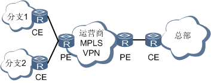
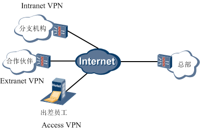
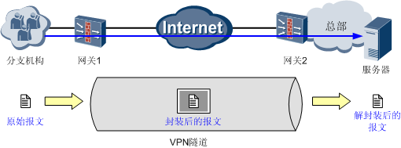
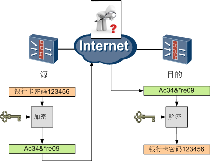
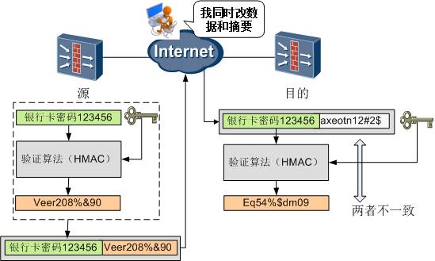
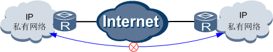
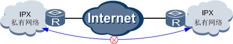
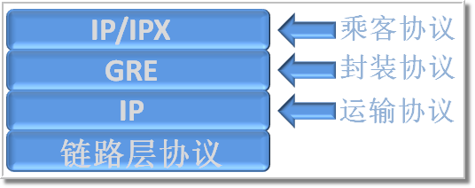

## VPN
VPN是指在公用网络上建立一个私有的、专用的虚拟通信网络。

VPN网络和VPN技术通常是如何分类的呢？

根据建设单位不同分类:

这种分类根据VPN网络端点设备（关键设备）由运营商提供，还是由企业自己提供来划分。
- 租用运营商VPN专线搭建企业VPN网络:目前主要指租用运营商MPLS VPN专线，比如联通、电信都提供MPLS VPN专线服务。跟传统的租用传输专线（比如租用E1、SDH专线）相比，MPLS VPN专线的优势主要在于线路租用成本低。 

    
- 用户自建企业VPN网络：目前最常用的就是**基于Internet建立企业VPN网络**，具体技术包括GRE、L2TP、IPSec、SSL VPN等。这种方案企业只需要支付设备购买费用和上网费用，没有VPN专线租用费用；另外企业在网络控制方面享有更多的主动权、更方便企业进行网络调整。**强叔要分享的正是这类VPN**。

    

根据组网方式不同分类:
- 远程访问VPN(Access VPN): 适合出差员工VPN拨号接入的场景。员工可以在任何能够接入公网的地方，通过远程拨号接入企业内网，从而访问内网资源。
  
  

- 局域网到局域网的VPN（也称为网关到网关的VPN）：它适用于公司两个异地机构的局域网互连。 

    

根据应用场景不同分类:
- 远程访问VPN: Access VPN 面向出差员工. 允许出差员工跨越公用网络远程接入公司内部网络。
- Intranet VPN（企业内部虚拟专网）：Intranet VPN通过公用网络进行企业内部各个网络的互连。
- Extranet VPN（扩展的企业内部虚拟专网）：Extranet VPN是指利用VPN将企业网延伸至合作伙伴处，使不同企业间通过公网来构筑VPN。Intranet VPN 和Extranet VPN的不同点主要在于访问公司总部网络资源的权限有区别。 

按照VPN技术实现的网络层次进行分类： 

- 基于数据链路层的VPN：L2TP、L2F、PPTP。其中L2F和PPTP已经基本上被L2TP替代了，强叔不再关注这两种技术了。
- 基于网络层的VPN：GRE、IPSec。
- 基于应用层的VPN：SSL。

基于Internet的VPN技术有一个共同点就是必须解决VPN网络的安全问题： 

- 出差员工的地理接入位置不固定，其所处位置往往不受企业其他信息安全措施的保护，所以需要对出差员工进行严格的接入认证，并且对出差员工可以访问的资源和权限进行精确控制。接入认证涉及身份认证技术。
- 合作伙伴需要根据业务开展的情况，灵活进行授权，限制合作伙伴可以访问的网络范围、可以传输的数据类型。此时推荐对合作伙伴进行身份认证，认证通过后进行可以通过策略配置等对合作伙伴的权限进行限制。
- 另外分支机构、合作伙伴和出差用户与公司总部之间的数据传输都必须是安全的。都涉及数据加密和数据验证技术。

下面简单讲解一下VPN用到的几个关键技术点：

### 1. 隧道技术
隧道技术是VPN的基本技术，类似于点到点连接技术。它的基本过程就是在数据进入源VPN网关后，将数据“封装”后通过公网传输到目的VPN网关后再对数据“解封装”。“封装/解封装”过程本身就可以为原始报文提供安全防护功能，所以被封装的数据包在互联网上传递时所经过的逻辑路径被称为“隧道”。不同的VPN技术封装/解封装的过程完全不同，具体封装过程在每个协议中详细介绍。

### 2. 身份认证技术
主要用于移动办公的用户远程接入的情况, 通过对用户的身份进行认证, 确保接入内部网络的用户是合法用户,而非恶意用户

不同的VPN技术能够提供的用户身份认证方法不同:
- GRE不支持身份认证技术。
- L2TP：依赖PPP提供的认证（比如CHAP、PAP、EAP）。接入用户的用户名和密码本地认证也可以通过RADIUS服务器认证。认证通过以后再给用户分配内部的IP地址，通过此IP地址对用户进行授权和管理。
- IPSec：通过IKEv2拨号时，支持进行EAP认证。接入用户的用户名和密码可以本地认证可以通过RADIUS服务器认证。认证通过以后再给用户分配内部的IP地址，通过此IP地址对用户进行授权和管理。另外IPSec还支持数据源认证，在下面的数据验证技术里进行说明。
- SSL VPN：支持本地认证、证书认证和服务器认证。主要是对服务器进行身份认证，确认Web网页的合法性。

### 3. 加密技术
加密技术就是把能读懂的报文变成无法读懂的报文，也就是把明文变成密文，这样即便是有黑客获取了报文也无法知道其真实含义。加密对象有数据报文和协议报文之分，能够实现协议报文和数据报文都加密的协议安全系数更高。
- GRE和L2TP协议本身不提供加密技术，所以通常结合IPSec协议一起使用，使用IPSec的加密技术。
- IPSec：支持数据报文和协议报文加密。IPSec一般采用对称密钥算法加密数据。对称加密算法采用相同的密钥加密和解密数据。

    
- SSL VPN：支持数据报文和协议报文加密。SSL VPN采用公钥体制进行加密。公钥体制加密跟对称密钥加密的差别在于加密和解密的所用的密钥是不同的密钥。采用公钥进行加密，私钥进行解密。公钥和私钥一一对应。

### 4. 数据验证技术
数据验证技术就是对收到的报文进行验货. 对于伪造的, 被篡改的数据进行丢弃.那么验证是如何实现的呢？它采用一种称为“摘要”的技术。“摘要”技术主要采用HASH函数将一段长的报文通过函数变换，映射为一段短的报文。在收发两端都对报文进行验证，只有摘要一致的报文才被认可。
- GRE: 本身指提供简单的校验和验证和关键字验证, 但可结合IPSec协议一起使用, 使用IPSec的数据验证技术
- L2TP: 本身不提供数据验证技术, 但可结合IPSec协议一起使用,使用IPSec的数据验证技术
- IPSec: 支持对数据及逆行完整性验证和数据源验证, 在IPSec的数据验证和加密通常一起使用, 对加密后的报文HMAC(Keyed-Hash Message Authentication Code)生成摘要, 提供数据的安全性. 那么验证是如何实现的呢？它采用一种称为“摘要”的技术。“摘要”技术主要采用HASH函数将一段长的报文通过函数变换，映射为一段短的报文。在收发两端都对报文进行验证，只有摘要一致的报文才被认可。

    

- SSL VPN：支持对数据进行完整性验证和数据源验证。SSL VPN采用公钥体制，利用Hash算法生成摘要，再用私钥加密摘要生成数字签名。利用公钥进行解密。利用公钥和私钥的一一的关系可以对数据源进行认证。

下面强叔总结一下GRE、L2TP、IPSec和SSL VPN常用的安全技术和使用的场景：

## GRE
被Internet互联以后的私有网络就面临着以下几个痛苦：
1. 私有IP网络之间无法直接通过Internet互通.

    这个不用强叔多说，私有网络中使用的都是私有地址，而在Internet上传输的报文必须使用公网地址。

    

2. 异种网络（IPX、AppleTalk）之间无法通过Internet直接进行通信。

    这个痛苦是先天性造成的，IPX和IP本就不是同一种网络协议，因此IP网络不转发IPX报文，这倒也情有可原。 

    

3. 私网之间部署的动态路由无法跨越Internet。

   …

### GRE
GRE（General Routing Encapsulation）即通用路由封装协议.其实说穿了也很简单，GRE用的就是当下流行的“马甲”技术。既然私有网络发出的报文由于种种原因不能在Internet上进行传输，那何不给这些报文穿上能让Internet识别的“马甲”（GRE封装），再让它在Internet上传输。反正对于Internet而言，它是只认“马甲”不认人。这种“马甲”技术在网络中的专用术语就是“封装”。

但凡一种网络封装技术，其基本的构成要素都可以分为3个部分：乘客协议、封装协议、运输协议，GRE也不例外。

- 乘客协议：为了便于理解封装技术，我们用邮政系统打个比方。乘客协议就是我们写的信，信的语言可以是汉语、英语、法语等，具体如何解释由写信人、读信人自己负责。 
- 封装协议：封装协议可以理解为信封，可能是平信、挂号或者是EMS，这对应于多种封装协议。
- 运输协议：运输协议就是信的运输方式，可以是陆运、海运或者空运，这对应于不同的运输协议。

OK，理解了这个以后，我们再来看看GRE中都用到了哪些协议。 

