## VPN
VPN是指在公用网络上建立一个私有的、专用的虚拟通信网络。

VPN网络和VPN技术通常是如何分类的呢？

根据建设单位不同分类:

这种分类根据VPN网络端点设备（关键设备）由运营商提供，还是由企业自己提供来划分。
- 租用运营商VPN专线搭建企业VPN网络:目前主要指租用运营商MPLS VPN专线，比如联通、电信都提供MPLS VPN专线服务。跟传统的租用传输专线（比如租用E1、SDH专线）相比，MPLS VPN专线的优势主要在于线路租用成本低。 

    
- 用户自建企业VPN网络：目前最常用的就是**基于Internet建立企业VPN网络**，具体技术包括GRE、L2TP、IPSec、SSL VPN等。这种方案企业只需要支付设备购买费用和上网费用，没有VPN专线租用费用；另外企业在网络控制方面享有更多的主动权、更方便企业进行网络调整。**强叔要分享的正是这类VPN**。

    

根据组网方式不同分类:
- 远程访问VPN(Access VPN): 适合出差员工VPN拨号接入的场景。员工可以在任何能够接入公网的地方，通过远程拨号接入企业内网，从而访问内网资源。
  
  

- 局域网到局域网的VPN（也称为网关到网关的VPN）：它适用于公司两个异地机构的局域网互连。 

    


根据应用场景不同分类:
- 远程访问VPN: Access VPN 面向出差员工. 允许出差员工跨越公用网络远程接入公司内部网络。
- Intranet VPN（企业内部虚拟专网）：Intranet VPN通过公用网络进行企业内部各个网络的互连。
- Extranet VPN（扩展的企业内部虚拟专网）：Extranet VPN是指利用VPN将企业网延伸至合作伙伴处，使不同企业间通过公网来构筑VPN。Intranet VPN 和Extranet VPN的不同点主要在于访问公司总部网络资源的权限有区别。 


按照VPN技术实现的网络层次进行分类： 

- 基于数据链路层的VPN：L2TP、L2F、PPTP。其中L2F和PPTP已经基本上被L2TP替代了，强叔不再关注这两种技术了。
- 基于网络层的VPN：GRE、IPSec。
- 基于应用层的VPN：SSL。

基于Internet的VPN技术有一个共同点就是必须解决VPN网络的安全问题： 

- 出差员工的地理接入位置不固定，其所处位置往往不受企业其他信息安全措施的保护，所以需要对出差员工进行严格的接入认证，并且对出差员工可以访问的资源和权限进行精确控制。接入认证涉及身份认证技术。
- 合作伙伴需要根据业务开展的情况，灵活进行授权，限制合作伙伴可以访问的网络范围、可以传输的数据类型。此时推荐对合作伙伴进行身份认证，认证通过后进行可以通过策略配置等对合作伙伴的权限进行限制。
- 另外分支机构、合作伙伴和出差用户与公司总部之间的数据传输都必须是安全的。都涉及数据加密和数据验证技术。

下面简单讲解一下VPN用到的几个关键技术点：

### 1. 隧道技术
隧道技术是VPN的基本技术，类似于点到点连接技术。它的基本过程就是在数据进入源VPN网关后，将数据“封装”后通过公网传输到目的VPN网关后再对数据“解封装”。“封装/解封装”过程本身就可以为原始报文提供安全防护功能，所以被封装的数据包在互联网上传递时所经过的逻辑路径被称为“隧道”。不同的VPN技术封装/解封装的过程完全不同，具体封装过程在每个协议中详细介绍。


### 2. 身份认证技术
主要用于移动办公的用户远程接入的情况, 通过对用户的身份进行认证, 确保接入内部网络的用户是合法用户,而非恶意用户

不同的VPN技术能够提供的用户身份认证方法不同:
- GRE不支持身份认证技术。
- L2TP：依赖PPP提供的认证（比如CHAP、PAP、EAP）。接入用户的用户名和密码本地认证也可以通过RADIUS服务器认证。认证通过以后再给用户分配内部的IP地址，通过此IP地址对用户进行授权和管理。
- IPSec：通过IKEv2拨号时，支持进行EAP认证。接入用户的用户名和密码可以本地认证可以通过RADIUS服务器认证。认证通过以后再给用户分配内部的IP地址，通过此IP地址对用户进行授权和管理。另外IPSec还支持数据源认证，在下面的数据验证技术里进行说明。
- SSL VPN：支持本地认证、证书认证和服务器认证。主要是对服务器进行身份认证，确认Web网页的合法性。

### 3. 加密技术
加密技术就是把能读懂的报文变成无法读懂的报文，也就是把明文变成密文，这样即便是有黑客获取了报文也无法知道其真实含义。加密对象有数据报文和协议报文之分，能够实现协议报文和数据报文都加密的协议安全系数更高。
- GRE和L2TP协议本身不提供加密技术，所以通常结合IPSec协议一起使用，使用IPSec的加密技术。
- IPSec：支持数据报文和协议报文加密。IPSec一般采用对称密钥算法加密数据。对称加密算法采用相同的密钥加密和解密数据。

    
- SSL VPN：支持数据报文和协议报文加密。SSL VPN采用公钥体制进行加密。公钥体制加密跟对称密钥加密的差别在于加密和解密的所用的密钥是不同的密钥。采用公钥进行加密，私钥进行解密。公钥和私钥一一对应。


### 4. 数据验证技术
数据验证技术就是对收到的报文进行验货. 对于伪造的, 被篡改的数据进行丢弃.那么验证是如何实现的呢？它采用一种称为“摘要”的技术。“摘要”技术主要采用HASH函数将一段长的报文通过函数变换，映射为一段短的报文。在收发两端都对报文进行验证，只有摘要一致的报文才被认可。
- GRE: 本身指提供简单的校验和验证和关键字验证, 但可结合IPSec协议一起使用, 使用IPSec的数据验证技术
- L2TP: 本身不提供数据验证技术, 但可结合IPSec协议一起使用,使用IPSec的数据验证技术
- IPSec: 支持对数据及逆行完整性验证和数据源验证, 在IPSec的数据验证和加密通常一起使用, 对加密后的报文HMAC(Keyed-Hash Message Authentication Code)生成摘要, 提供数据的安全性. 那么验证是如何实现的呢？它采用一种称为“摘要”的技术。“摘要”技术主要采用HASH函数将一段长的报文通过函数变换，映射为一段短的报文。在收发两端都对报文进行验证，只有摘要一致的报文才被认可。

    

- SSL VPN：支持对数据进行完整性验证和数据源验证。SSL VPN采用公钥体制，利用Hash算法生成摘要，再用私钥加密摘要生成数字签名。利用公钥进行解密。利用公钥和私钥的一一的关系可以对数据源进行认证。

下面强叔总结一下GRE、L2TP、IPSec和SSL VPN常用的安全技术和使用的场景：


## GRE
被Internet互联以后的私有网络就面临着以下几个痛苦：
1. 私有IP网络之间无法直接通过Internet互通.

    这个不用强叔多说，私有网络中使用的都是私有地址，而在Internet上传输的报文必须使用公网地址。

    

2. 异种网络（IPX、AppleTalk）之间无法通过Internet直接进行通信。

    这个痛苦是先天性造成的，IPX和IP本就不是同一种网络协议，因此IP网络不转发IPX报文，这倒也情有可原。 

    

3. 私网之间部署的动态路由无法跨越Internet。

   …


### GRE
GRE（General Routing Encapsulation）即通用路由封装协议.其实说穿了也很简单，GRE用的就是当下流行的“马甲”技术。既然私有网络发出的报文由于种种原因不能在Internet上进行传输，那何不给这些报文穿上能让Internet识别的“马甲”（GRE封装），再让它在Internet上传输。反正对于Internet而言，它是只认“马甲”不认人。这种“马甲”技术在网络中的专用术语就是“封装”。


但凡一种网络封装技术，其基本的构成要素都可以分为3个部分：乘客协议、封装协议、运输协议，GRE也不例外。

- 乘客协议：为了便于理解封装技术，我们用邮政系统打个比方。乘客协议就是我们写的信，信的语言可以是汉语、英语、法语等，具体如何解释由写信人、读信人自己负责。 
- 封装协议：封装协议可以理解为信封，可能是平信、挂号或者是EMS，这对应于多种封装协议。
- 运输协议：运输协议就是信的运输方式，可以是陆运、海运或者空运，这对应于不同的运输协议。

OK，理解了这个以后，我们再来看看GRE中都用到了哪些协议。 


从图中我们可以很清晰的看到，GRE能够承载的协议包括IP协议、IPX协议，GRE所使用的运输协议是IP协议。
了解了GRE的一些基本概念和应用以后，下面强叔将为大家讲解一下GRE的封装原理。

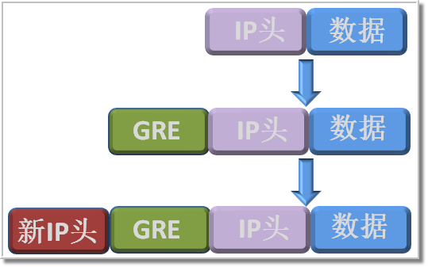

GRE的封装过程可以细分成两步，第一步是在私有数据中添加GRE头，第二步是在GRE头前面再加上新的IP头。加上新的IP头以后，就意味着这个私有网络的报文在经过层层封装以后就可以在Internet上传输了。

从产品实现的角度来讲，上述的封装操作是通过一个逻辑接口来实现的，这个逻辑接口就是鼎鼎有名的Tunnel接口。Tunnel即隧道，从名字就可以看出来这个逻辑接口就是为隧道而生。由于Tunnel接口是一个通用的隧道接口，所以GRE协议在使用这个接口的时候，我们会要求将这个接口的封装协议设置为GRE协议。

下面强叔将结合Tunnel接口介绍一下防火墙对GRE流量的转发过程，见下图。

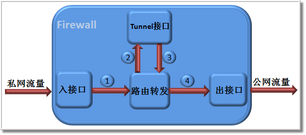

1. 企业的私网流量到达防火墙的入接口，防火墙查询路由表对此流量进行转发。
2. 防火墙根据路由查找结果，将此流量引导到Tunnel接口进行GRE封装。
3. 封装后的GRE报文再次查找路由进行流量转发。
4. 防火墙根据路由查找结果，找到出接口，并将流量发送到Internet。

这就是防火墙对私网流量进行GRE封装和转发的全过程，很简单吧。

有些小伙伴肯定在想了，强叔这里只介绍了封装过程，那隧道对端是如何解封装的？

其实解封装也很简单。首先隧道对端在接收到报文以后，先根据该报文目的地址判断是不是发给自己的，在

明确报文是发给自己以后，再去判断这个报文是不是GRE报文。怎么判断呢？在封装原理那幅图中我们可以看

到封装后的GRE报文会有个新的IP头，这个新的IP头中有个Protocol字段，字段中标识了内层协议类型，如果这

个Protocol字段值是47，就表示这个报文是GRE报文。

#### GRE隧道的配置方法

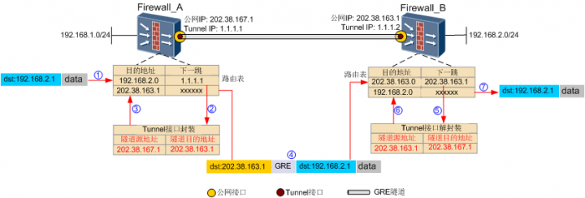

GRE隧道的配置也很简单，可以分为两个步骤。
1. 配置Tunnel接口的封装参数（配置数据以Firewall_A为例）。 

    ```bash
    interface Tunnel 1

    ip address 1.1.1.1 24

    tunnel-protocol gre

    source 202.38.167.1

    destination 202.38.163.1
    ```
    首先设置Tunnel接口的封装类型为GRE，然后指定GRE隧道的源和目的就OK了。GRE隧道中大家容易产生疑惑的地方在配置Tunnel接口的IP地址。有很多小伙伴会有这么几个问题。
    
    a．Tunnel接口的IP地址是否必须配置？

    b．隧道两端的Tunnel接口IP地址是否有所关联？

    c． Tunnel接口使用的是公网IP地址还是私网IP地址？

    首先Tunnel接口的IP地址必须配置，如果不配置IP地址，Tunnel接口就无法UP起来。其次，从GRE的封装过程来看，Tunnel接口的IP地址并没有参与报文封装，所以隧道两端的Tunnel接口没有任何关联，各配各的。再者，既然Tunnel接口不参与封装，所以也就没有必要用公网地址了，配置成私网就可以了。

2. 配置路由，将要进行GRE封装的流量引流到Tunnel接口。

    把流量引入到GRE隧道有两种方法，一种是静态路由，一种是动态路由。

    - 静态路由配置： `ip route-static 192.168.2.0 24 Tunnel 1`

    - 动态路由配置：如果私网内部使用的是动态路由（例如OSPF），则只要把私网地址和Tunnel接口地址一起通过OSPF发布出去即可。
        ```bash
        ospf 1

        area 0

        network 1.1.1.0 0.0.0.255

        network 192.168.2.0 0.0.0.255
        ```

        此时有一个特殊的地方需要注意，就是如果GRE隧道对应的公网接口也使用了OSPF，那我们就需要用一个新的OSPF进程来发布私网地址和Tunnel接口地址。

GRE的配置很简单，强叔就不多说了。结合平时遇到的一些GRE问题，强叔再做一些扩展。

有些小伙伴可能会有担忧，说如果Internet上的恶意有用户伪装成Firewall_A向Firewall_B发送GRE报文，那伪装者不就可以访问Firewall_B中的资源了呢？那么Firewall_A和Firewall_B在建立GRE隧道时，是如何做到互信的呢？下面强叔讲一下GRE的安全机制。

防火墙配置了GRE隧道，并不是说防火墙收到所有的GRE报文它都会进行处理。它只处理与本防火墙建立GRE隧道的对端设备发过来的GRE报文。具体做法就是建立GRE隧道的两台设备要设置一个“密钥”，这个密钥就是身份凭证，密钥信息被封装在GRE报文的头部。当一端收到一个GRE报文以后，都会检查该密钥，只有在密钥一致时，才认为是隧道对端发过来的GRE报文。“身份校验”不通过，该GRE报文会被丢弃。下图就是一个GRE报文，其中GRE报文头中的key字段为1表示用户设置了身份验证功能，下面的GRE key：0x0001e240是用户配置的密钥值。

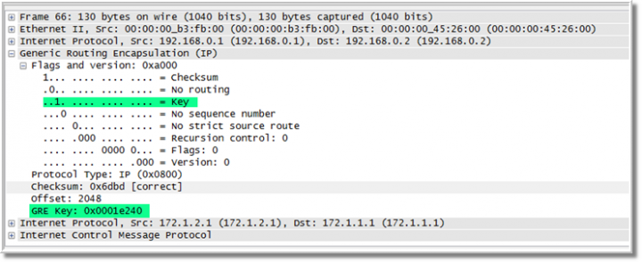

虽然身份校验机制可以保证GRE隧道两端可以实现互信，但是如果报文在Internet传输途中被其他用户恶意篡改，这又该怎么办？这里我们还得用到GRE头中的另一个字段checksum。GRE封装报文时，会根据报文信息计算校验和，并将这个校验和插入到checksum字段中。

当隧道对端收到该报文时，对端也会根据报文信息计算校验和，并与报文中携带的校验和进行比较，如果校验结果一致，则接受此报文；如果不一致，则丢弃。下图中checksum为1，表示启用了校验和功能，下面checksum:0x6dbd是校验和对应的值。

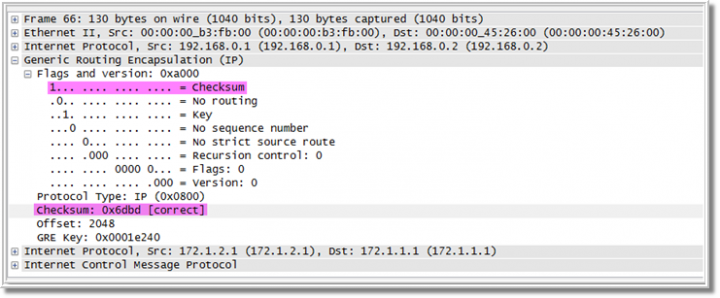

GRE的安全机制可以实现隧道两端的互信，并保证报文传输的完整性。但是这里还有一个问题，就是如果隧道对端设备出现故障时，隧道本端如何感知的呢？

GRE隧道是一种无状态类型的隧道，所谓的无状态类型是指隧道本端并不维护与对端的状态。换句话说假如隧道对端出现故障，那隧道本端是感受不到的。为了解决这个问题，GRE隧道提供了一种保活机制（keepalive）。GRE隧道源会周期性的向隧道对端发送keepalive报文，以检测隧道对端状态。如果GRE隧道对端出现问题，则隧道源的Tunnel接口状态会被置为Down，即本端关闭GRE隧道。这就避免了因对端不可达而造成的数据黑洞。GRE的Keepalive功能是单向的，对端是否支持或启用Keepalive功能不影响本端的Keepalive功能。实际配置时，建议隧道两边都配置上保活功能。

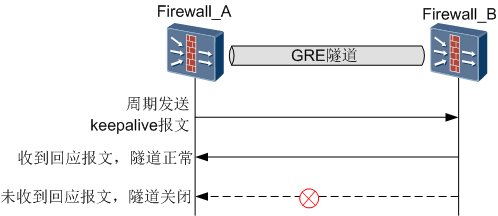

小伙伴们看到这里觉得是不是有了GRE隧道就万事大吉了，其实不然。强叔要告诉大家的是GRE自身有个缺陷，就是GRE技术不带有安全加密功能。没有加密功能的GRE报文，只能说是穿了个透明的马甲，它所要传输的数据别人可以看得一清二楚。所以我们在实际使用时，很少单纯使用GRE，而是经常与IPSec技术联用。由于IPSec技术具备很强的加密功能，就解决了GRE的安全性问题。这也就是我们经常听到的GRE over IPSec技术

## L2TP VPN
那个时代个人用户和企业用户大都通过电话线上网，当然企业分支机构和出差用户一般也通过“电话网络（学名叫PSTN（Public Switched Telephone Network）/ISDN（integrated services digital network））”来访问总部网络，人们将这种基于PSTN/ISDN的VPN命名为VPDN（Virtual Private Dial Network）。

在传统的基于PSTN/ISDN的L2TP VPN中，运营商在PSTN/ISDN和IP网络之间部署LAC（在VPDN里称为NAS，Network Access Server），集中为多个企业用户提供L2TP VPN专线服务，配套提供认证和计费功能。当分支机构和出差员工拨打L2TP VPN专用接入号时，接入modem通过PPP协议与LAC建立PPP会话，同时启动认证和计费。认证通过后LAC向LNS发起L2TP隧道和会话协商，企业总部的LNS出于安全考虑，再次认证接入用户身份，认证通过后分支机构和出差员工就可以访问总部网络了。

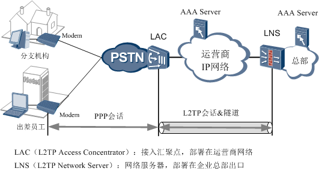

说明：LAC和LNS是L2TP协议里的概念，NAS是VPDN里的概念，在L2TP VPN中LAC实际上就是NAS。 

随着IP网络的普及，PSTN/ISDN网络逐渐退出数据通信领域。企业和个人用户都可以自由通过以太网直接接入Internet了，此时L2TP VPN也悄悄地向前“迈了两小步”――看似只有两小步，但这两小步却让L2TP VPN这个过气明星留在了风云变化的IP舞台上。（强叔感叹，在通信领域，不学习、不进步只能被拍死在沙滩上啊！）
现在L2TP VPN常用场景如下图所示。

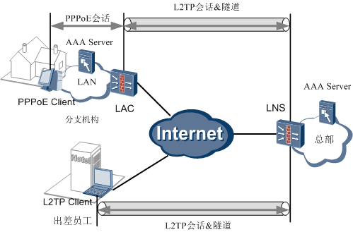

- 两小步之一――PPP屈尊落户以太网：这是拨号网络向以太网演进过程中的必经之路，并非专门为L2TP VPN设计，但L2TP VPN确实是最大的受益者。分支机构用户安装PPPoE Client，在以太网上触发PPPoE拨号，在PPPoE Client和LAC（PPPoE Server）之间建立PPPoE会话。LAC和LNS之间的L2TP VPN建立过程没有变化。
- 两小步之二――L2TP延伸到用户PC：这种场景下，PC可以通过系统自带的L2TP客户端或第三方L2TP客户端软件直接拨号与LNS建立L2TP VPN。L2TP Client摒弃了LAC这位“掮客”跟总部直接建立合作关系，看来这种事情在哪里都会发生啊！

这两种场景跟初始L2TP VPN场景相比有一个共同特征，就是企业借用了“运营商管道（Internet）” 自建VPN，避开了运营商VPN专线业务收费。为区分这两种L2TP VPN，前者（基于LAC拨号的L2TP VPN）被称为NAS-Initiated VPN，后者（客户端直接拨号的L2TP VPN）被称为Client-Initiated VPN。

## L2TP Client-Initiated VPN
VPN客户端的作用就是帮助用户在PC或PAD或手机上触发建立一条直通公司总部网络的隧道，实现用户自由访问总部网络的意愿。

都教授要借助L2TP客户端穿越“虫洞”进入公司网络，必然要先通过“门神”LNS的身份检查（检查手段毫不含糊，用户名称、密码、主机名称、隧道验证应有尽有）。LNS为通过验证的用户发放特别通行证（公司内网IP地址），对试图混入的人说bye-bye。Client-Initiated VPN配置中体现的就这样一个简单的思路（本例仅给出本地认证配置）：

#### L2TP Client

- 对端IP地址
- 登录用户（PPP用户）名称
- 登录用户（PPP用户）密码
- 主机名称（可选，也叫隧道名称。Windows自带的L2TP客户端无法配置隧道名称。）
-  PPP认证模式（PAP/CHAP/EAP，有些客户端默认CHAP）
- 隧道验证（可选，有些客户端不支持）

前三项是必配内容，后三项可能会因客户端不同有所取舍。 

#### LNS
```bash
L2tp enable
l2tp domain suffix-separator @     
interface LoopBack0  
 ip address 192.168.5.1 255.255.255.0

interface Virtual-Template1 
 ppp authentication-mode chap   
 ip address unnumbered interface LoopBack0  
 remote address pool         
l2tp-group 1          
 undo tunnel authentication  
 allow l2tp virtual-template 1 remote client1 //指定VT接口和对端主机名称 。对端使用Windows自带的L2TP客户端时不指定对端主机名称。  
 tunnel name LNS         //本端隧道名称 
 tunnel timer hello 0 
aaa
local-user l2tp@radius password cipher %$%$y>z_1xG|mINC.~+P.b()4+"v%$%$  //本地用户名、密码  
local-user l2tp@radius service-type ppp  
domain radius
ip pool 0 10.21.80.1 10.21.80.254
```
VT接口大家感觉比较陌生吧？它是用于二层协议通信的逻辑接口，比如PPP和L2TP协议通信、PPP和Ethernet协议通信，都会用到它，所以在L2TP VPN中要开启VT接口所在安全区域跟L2TP物理接口所在安全区域之间的包过滤，保证PPP和L2TP协议通信畅通无阻。


思想是神经元活动的结果，配置最终体现到一系列的消息交互中。配置不太复杂，但消息交互可不太简单。为了让大家一目了然，并方便跟下期的NAS-Initiated VPN做对比，强叔画了一张简图，然后对着这张图对L2TP Client与LNS之间的消息交互进行深入剖析。

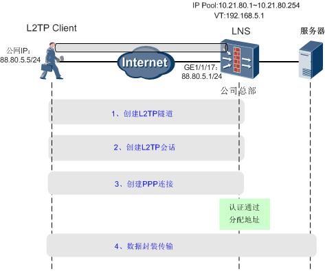
结合抓包情况来讲解一下Client-Initiated VPN建立的完整过程：


### 阶段1 建立L2TP隧道（控制连接）：3条消息协商进入虫洞时机
L2TP Client和LNS通过交互三条消息协商隧道ID、UDP端口（LNS用1701端口响应Client隧道建立请求）、主机名称、L2TP的版本、隧道验证（Client不支持隧道验证时LNS的隧道验证要关闭，例如WIN7操作系统）等参数。

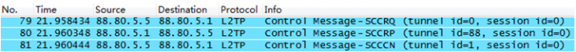

仅给出隧道ID协商过程：
#### 步骤一
Client：LNS兄，用88作为Tunnel ID跟我通信吧。

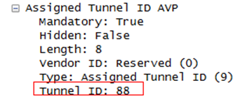

#### 步骤2

LNS：OK。Client，用1作为Tunnel ID跟我通信。

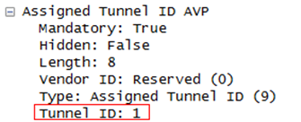

#### 步骤3
Client：OK。

### 阶段2 建立L2TP会话：3条消息唤醒虫洞门神

L2TP Client和LNS通过交互三条消息协商Session ID，建立L2TP会话。跟“门神”对上话了，才可能提交身份认证材料呀！

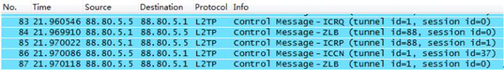

注：ZLB表示目前空闲，没有消息要发送。

Session ID协商过程
#### 步骤一
Client：LNS，采用1作为Session ID跟我通信吧。

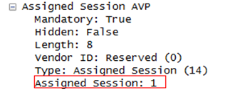

#### 步骤二
LNS：OK。Client，采用37作为Session ID跟我通信吧。

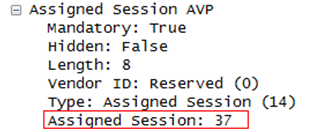

#### 步骤三
Client:Ok
### 阶段三 创建PPP连接：身份认证，发放特别通行证
1. LCP协商。LCP协商是两个方向分开协商的，主要协商MRU大小。

    **说明：MRU 是PPP的数据链路层参数，类似以太网中的MTU。如果PPP链路一端设备发送的报文载荷大于对端的 MRU，这个报文在传送时就会被分片。**

    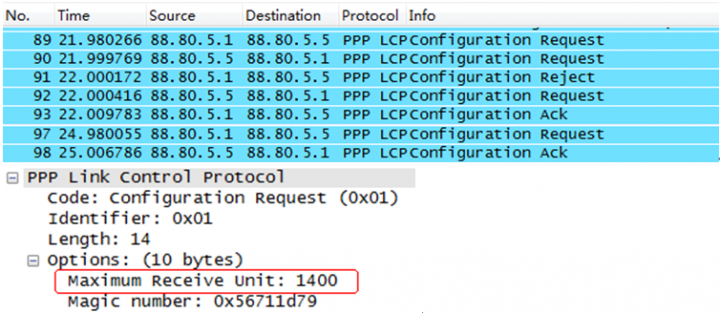

2. PPP验证。

    验证方式包括CHAP、PAP、EAP（高端防火墙不支持），CHAP或PAP可以在本地认证、也可在AAA服务器上认证；EAP只能在AAA服务器上进行认证。EAP认证比较复杂，我们等到IPSec部分再详解，此处仅给出最常用的CHAP验证过程：

    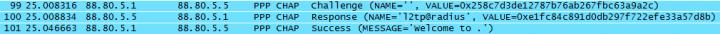

    经典的三次握手过程：
    #### 步骤一
    LNS：Client，发给你一个“挑战（Challenge）”，用它来加密你的密码吧。

    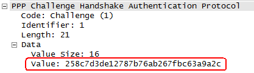

    #### 步骤二
    Client：OK，把我的用户名和加密后的密码发给你，请验证。

    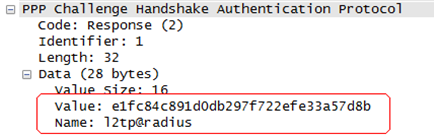

    #### 步骤三
    LNS：验证通过，欢迎来到PPP的世界。

    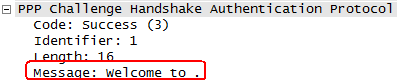

    LNS（或AAA服务器）上配置的用户名和密码是用来验证Client的，当然要求“本人”和“签证”完全一致，即要求L2TP Client和LNS上配置的用户名和密码完全一致。**这里详解一下什么叫用户名完全一致**：

    - 如果在LNS上配置的签证为username（没有domain），则L2TP Client登录的用户名也要是username。
    - 如果在LNS上配置的签证为fullusername（username@default或username@domain），则L2TP Client登录的用户名也要是username@default或username@domain。

    这是很多人问过的问题，道理很简单，但却是大家干活时常犯的错误。
    **讲了半天domain的问题，大家会不会问划分domain有何意义？**

    对于大企业来说，往往会按部门来划分多个domain， LNS（或AAA服务器）都支持根据domain给不同部门创建不同的地址池，也就是不同部门的网段可以通过地址池规划分开，这样方便后续部署不同的访问控制策略。
3. IPCP协商，成功后分配IP地址。

    分配给Client的IP地址是10.21.80.2，后续交互的报文都是由10.21.80.2??Client的私网地址发出的。

    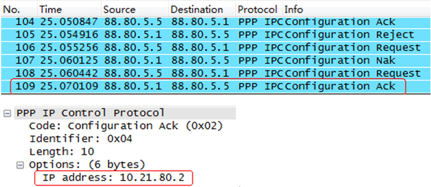


    **看到这里大家会不会问VT接口地址、地址池地址和总部网络地址如何规划？注意以下两点即可：**

    1. 首先，VT接口地址和地址池地址可以规划在同一网段，也可以不在同一网段。如果在同一网段，请将两者配置为不重叠的地址，即VT接口地址不能包含在地址池地址中。
    2. 其次，建议把地址池地址和总部网络地址规划为不同的网段。如果万不得已，将地址池地址和总部网络地址配置为同一网段后，则必须在LNS连接总部网络的接口上开启ARP代理功能，并且开启L2TP虚拟转发功能，保证LNS可以对总部网络服务器发出的ARP请求进行应答。

    假设LNS连接总部网络的接口是GigabitEthernet1/1/16，开启ARP代理功能和L2TP虚拟转发功能的配置如下： 
    ```bash
    interface GigabitEthernet1/1/16
    ip address 192.168.0.1 255.255.255.0
    arp-proxy enable     //开启ARP代理功能
    virtual-l2tpforward enable     //开启L2TP虚拟转发功能
    ```

**总结一下Client-Initiated VPN的特点：**

- L2TP VPN跟GRE VPN有很大不同。GRE VPN没有隧道协商过程，是没有控制连接的隧道，是没有状态的隧道，所以也无法查看隧道、检查隧道状态。但L2TP VPN是有控制连接的隧道，可以查看到隧道和会话。（IPSec VPN表现的更好，后续再讲）
- 对于Client-Initiated VPN来说Client和LNS之间存在一条L2TP隧道，隧道中只有一条L2TP会话，PPP连接就承载在此L2TP会话上。（这一点跟NAS-Initiated VPN不同，需要关注一下）

L2TP Client

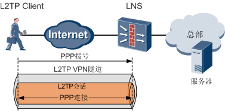

### 阶段4 数据封装传输：穿越虫洞，访问地球
想把都教授如何穿越虫洞的过程讲清楚很困难，但是把L2TP客户端的数据如何穿越L2TP隧道达到总部网络的过程讲清楚不太难，这就涉及到了L2TP数据报文的封装过程。这个过程跟GRE报文穿“马甲”脱“马甲”的过程很相似，不同的是马甲的样式有点变化：

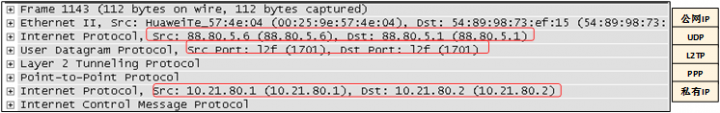

说明：本例中是两个Client之间通信，所以私有IP地址为两个内网地址。

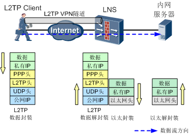

至此，L2TP Client可以畅通无阻访问总部网络了，就像都教授穿过虫洞回到温暖的家。但有一个疑问，Client发出的报文进入隧道到达总部服务器没有问题了，但从总部服务器到Client的回程报文是如何进入隧道返回Client的？我们似乎并没有配置什么路由将回程报文引导到隧道呀？查看LNS路由表，发现了一个有趣的现象：LNS为获得私网IP地址的Client自动下发了一条主机路由。

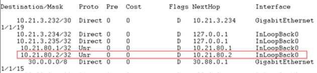

这条自动生成的主机路由协议类型为UNR（User Network Route），下一跳为Client本身的地址，出接口是InLoopBack0。这条路由就是LNS上虫洞的入口，指引去往Client的报文进入虫洞，回程报文就不愁找不到隧道入口了。看来在虫洞建立时，L2TP就已经为都教授的来去自如做好了充分准备，那还有什么可担心的呢？

上文我们只使用了一个Client来讲解，实际环境中会有多个Client同时穿过虫洞访问总部网络。如果Client已经不满足只访问总部网络，还想访问其他的Client，即Client之间实现相互访问，L2TP能做到吗？别忘了，LNS是连接多个虫洞的中转站，通过LNS来转发，两个Client之间也可以自如访问。当然，前提是双方要知道LNS为对方分配的IP地址。


## L2TP NAS-Initiated VPN
Client-Initiated VPN可以让企业出差员工像都教授一样穿越“虫洞”，来去自如地访问总部网络。而企业分支机构用户就没有这么幸运，他们一般通过拨号网络接入Internet，面对浩瀚的Internet海洋，没有能力找到“虫洞”的入口，只能望洋兴叹。即使拨号网络演进到以太网，也只是解决了本地接入Internet的问题，无法访问总部网络。难道分支机构用户注定与总部网络无缘了吗？

幸好LAC横空出世，帮助分支机构解决了这一难题。一方面，LAC作为PPPoE Server，分支机构用户作为PPPoE Client与LAC建立PPPoE连接，让PPP欢快地跑在以太网上；另一方面，LAC作为LNS的“中介”，为分支机构提供“虫洞”的入口，在分支机构用户看来，通过LAC这扇传送门就可以到达总部网络。

因为在VPDN里LAC还有一个别名叫做NAS，所以这种L2TP VPN也称为NAS-Initiated VPN。可能把NAS-Initiated VPN改为LAC-Initiated VPN大家更习惯一些，因为组网图中明明标的是LAC，却非得叫一个已经搁置不用的“曾用名”，这对于后来者而言确实有点不明所以。

NAS-Initiated VPN的建立过程有点小复杂，为了便于记忆强叔给大家画了一张简图，方便后续对着这张图一一道来。

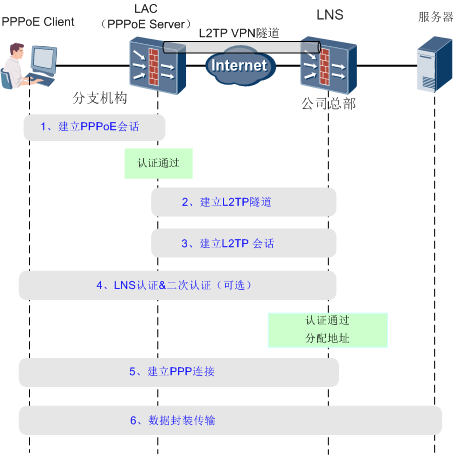

为了复习一下PPPoE的相关知识，我们用一台防火墙作为PPPoE Client，模拟PC的PPPoE Client：


#### 阶段1 拨号口对VT口的呼唤：建立PPPoE连接
PPP屈尊落户以太网变为PPPoE后，为了在以太网上模拟PPP的拨号过程，PPPoE发明了两个虚拟接口??Dialer接口和VT接口。Dialer接口用于PPPoE Client侧，VT接口用于PPPoE Server（即LAC）侧，在这两个接口上配置PPPoE相关参数。

##### PPPoE Client
```bash
interface dialer 1
dialer user user1
dialer-group 1
dialer bundle 1
ip address ppp-negotiate       //协商模式下实现IP地址动态分配
ppp chap user user1  //PPPoE Client的用户名
ppp chap password cipher Password1   //PPPoE Client的密码
dialer-rule 1 ip permit
interface GigabitEthernet0/0/1
pppoe-client dial-bundle-number 1   //在物理接口上启用PPPoE Client并绑定dial-bundle
```
#### PPPoE Server(LAC)
```bash
interface Virtual-Template 1
ppp authentication-mode chap
interface GigabitEthernet 0/0/1
pppoe-server bind virtual-template 1        //在物理接口上启用PPPoE Server并绑定VT接口

aaa
local-user user1 password Password1
 local-user user1 service-type ppp

注：在L2TP中，用户的IP地址都是由总部（LNS或AAA服务器）统一进行分配的，所以LAC上不需要配置地址池（即使配置了地址池，在L2TP隧道已经建立的情况下，也会优先使用总部的地址池进行地址分配），而普通的PPPoE拨号则必须在PPPoE Server上配置地址池。
```
通过抓包来分析PPPoE连接的建立过程：

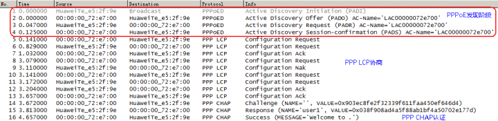

这里重点介绍PPPoE发现阶段的协商过程，PPPoE Client和PPPoE Server之间通过交互PADI、PADO、PADR和PADS报文，确定对方以太网地址和PPPoE会话ID：
#### 步骤一
PPoE Client：广播广播，我想接入PPPoE，谁来帮帮我？

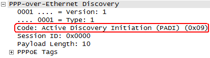

#### 步骤二
	
PPPoE Server：PPPoE Client，找我呀，我可以帮助你！

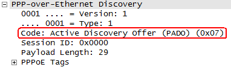
#### 步骤三
PPPoE Client：太好了，PPPoE Server，我想跟你建立PPPoE会话。

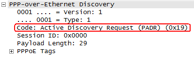

#### 步骤四
	
PPPoE Server：没问题，我把会话ID发给你，我们就用这个ID建立PPPoE会话吧。

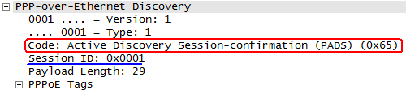


### 阶段2 建立L2TP隧道：3条消息协商进入虫洞时机

LAC和LNS通过交互三条消息协商L2TP隧道，这个过程我们在“Client-Initiated VPN”一篇中已经介绍过了，这里再复习一遍。首先来看一下LAC和LNS的具体配置：
#### LAC
```bash
l2tp-group 1
 tunnel authentication   //避免假冒LAC接入LNS
tunnel password cipher Password1
 tunnel name lac
 start l2tp ip 1.1.1.2 fullusername user1      //指定隧道对端地址
l2tp enable
```
#### LNS
```bash
interface Virtual-Template 1
 ppp authentication-mode chap
 ip address 172.16.0.1 255.255.255.0
 remote address pool
l2tp-group 1
 tunnel authentication   //避免假冒LAC接入LNS
 tunnel password cipher Password1
 tunnel name lns
allow l2tp virtual-template 1 remote lac     //允许远端接入
l2tp enable

aaa
 local-user user1 password Password1
 local-user user1 service-type ppp
 ip pool 0 172.16.0.2
```
抓包信息如下

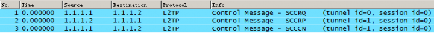

隧道ID协商过程：

#### 步骤一
	
LAC：LNS，使用1作为Tunnel ID跟我通信吧。

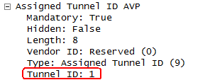

#### 步骤二
LNS：OK。LAC，你也用1作为Tunnel ID跟我通信。

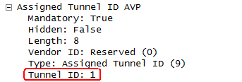

#### 步骤三
LAC:OK

### 阶段3 建立L2TP会话：3条消息唤醒虫洞门神
LAC和LNS通过交互三条消息协商Session ID，建立L2TP会话。同样，我们再复习一遍这个过程。

Session ID协商过程：
#### 步骤一
LAC：LNS，使用4作为Session ID跟我通信吧。

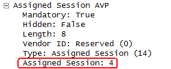

#### 步骤二
LNS：OK。LAC，你也使用4作为Session ID跟我通信吧。

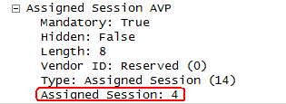

### 阶段4-5  LNS冷静接受LAC：LNS认证，分配IP地址

1. LNS认证&二次认证（可选）

    LAC将用户信息发给LNS进行验证，但LNS清醒认识到LAC“中介”的本来面目，对此LNS有三种态度：

    - lLAC代理认证：相信LAC是可靠的，直接对LAC发来的用户信息进行验证。

    - 强制CHAP认证：不相信LAC，要求重新对用户进行“资格审查”（强制重新对用户进行CHAP验证）。

    - LCP重协商：不仅不相信LAC，还对
    
    **后两种方式统称为LNS二次认证，若LNS配置二次认证而PPPoE Client不支持二次认证，将会导致L2TP VPN无法建立。** 两种二次认证的共同特征是LNS都绕过了LAC直接验证PPPoE Client提供的用户信息，可以为VPN业务提供了更高的安全保障。 

    #### LAC代理认证 *
    缺省, 不用配置

    

    LNS直接对LAC发来的用户信息进行验证，验证通过即成功建立PPP连接。
    #### 强制CHAP认证 **
    ```bash
    l2tp-group 1

    mandatory-chap
    ```
    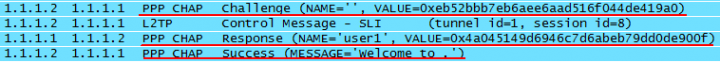

    LNS重新对用户进行CHAP验证，LNS发送挑战，PPPoE Client使用挑战将用户名和加密后的密码发给LNS，LNS验证通过成功建立PPP连接。

    #### LCP重协商 ***
    ```bash
    interface virtual-template 1
    ppp authentication-mode chap   //重协商后的验证方式在VT下指定
    l2tp-group 1
    mandatory-lcp
    ```

    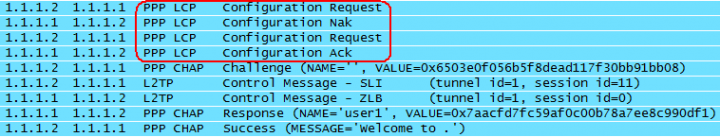

    *代表优先级，三种方式同时配置时LCP重协商优先级最高。

2. 分配IP地址

    通过PPP IPCP协商，LNS为PPPoE Client分配IP地址。

    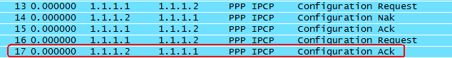

    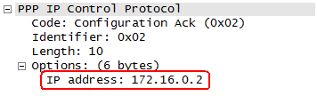

    关于地址池地址的规划问题，我们在“Client-Initiated VPN”一篇中也讲过。同样，建议把地址池地址和总部网络地址规划为不同的网段。如果地址池地址和总部网络地址配置为同一网段，则必须在LNS连接总部网络的接口上开启ARP代理功能，并且开启L2TP虚拟转发功能，保证LNS可以对总部网络服务器发出的ARP请求进行应答。

    假设LNS连接总部网络的接口是GigabitEthernet0/0/1，开启ARP代理功能和L2TP虚拟转发功能的配置如下：
    ```bash
    interface GigabitEthernet0/0/1

    ip address 192.168.0.1 255.255.255.0 

    arp-proxy enable             //ARP代理功能

    virtual-l2tpforward enable         //开启L2TP虚拟转发功能
    ```
    总结一下NAS-Initiated VPN的特点：

    NAS-Initiated VPN场景中，一对LAC和LNS的连接可存在多条隧道；一条隧道中可承载多条会话。接入用户1与LNS之间建立PPP连接1和L2TP会话1，接入用户2与LNS之间建立PPP连接2和L2TP会话2。

    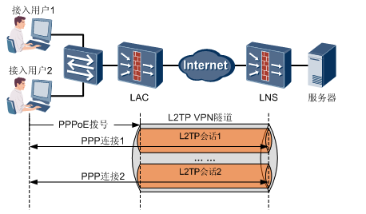

    当其中一个用户拨号后，触发LAC和LNS之间建立隧道。只要此用户尚未下线，则其余用户拨号时，会在已有隧道基础上建立会话，而并非重新触发建立隧道

### 阶段6 一路畅通：数据封装传输
PPPoE Client访问总部服务器的报文到达LAC后，LAC为报文穿上三层“马甲”，即L2TP头、UDP头和公网IP头，然后发送到LNS。LNS收到报文后，脱去这三层“马甲”，将报文转发至服务器

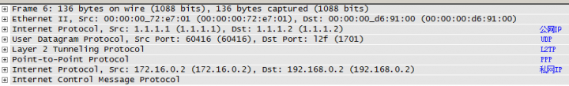

报文封装和解封装的过程如下图所示：

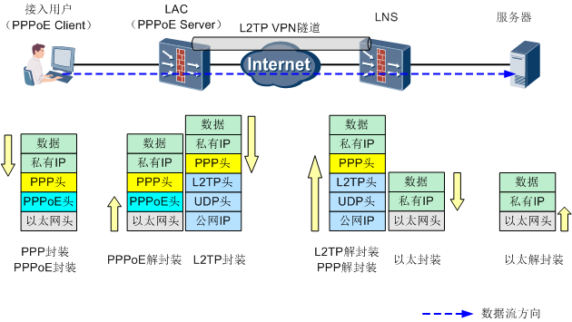

借助于LAC的力量，分支机构员工使用PPPoE Client就可以畅通无阻访问总部网络。但是从总部服务器到PPPoE Client的回程报文是如何进入隧道返回的呢？还记得我们在“Client-Initiated VPN”一篇中介绍过的UNR路由吧，NAS-Initiated VPN也是这样处理的。LNS会为获得IP地址的PPPoE Client自动下发了一条UNR路由，下一跳为PPPoE Client本身的地址，出接口是InLoopBack0，这条路由将指引回程报文进入隧道。回程报文进入隧道后被封装上公网IP地址，然后LNS将会以该公网IP地址为目的地址再次查找路由，将封装后的回程报文送往LAC。

NAS-Initiated VPN场景中，分支机构用户必须拨号才能使用L2TP VPN，报文还要封装成PPPoE，太麻烦了。况且拨号网络逐渐消失，以太网一统江湖，分支机构用户就不能直接在以太网***问总部网络吗？当然可以，人类偷懒的需求才是科技进步的原动力。下期强叔就为大家介绍LAC-Auto-Initiated VPN，由LAC自动拨号到LNS，省去了分支机构员工拨号的过程，堪称最省事的L2TP VPN，敬请期待。

## LAC-Auto-Initiated VPN
LAC-Auto-Initiated VPN也叫做LAC自动拨号VPN，顾名思义，在LAC上配置完成后，LAC会自动向LNS发起拨号，建立L2TP隧道和会话，不需要分支机构用户拨号来触发。对于分支机构用户来说，访问总部网络就跟访问自己所在的分支机构网络一样，完全感觉不到自己是在远程接入。但是这种方式下LNS只对LAC进行认证，分支机构用户只要能连接LAC即可以使用L2TP隧道接入总部，与NAS-Initiated VPN相比安全性要差一些。

LAC-Auto-Initiated VPN的配置也不复杂，以下面这个组网为例：

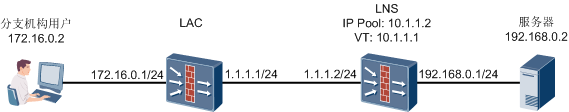

LAC和LNS上的配置如下：

#### LAC
```bash
interface Virtual-Template 1
 ppp authentication-mode chap
 ppp chap user lac
 ppp chap password cipher Password1
 ip address ppp-negotiate 
 call-lns local-user lac binding l2tp-group 1   //LAC向LNS发起拨号
l2tp-group 1
 tunnel authentication
tunnel password cipher Password1
 tunnel name lac
 start l2tp ip 1.1.1.2 fullusername lac      //指定隧道对端地址
l2tp enable
ip route-static 192.168.0.0 255.255.255.0 Virtual-Template 1          //配置去往总部网络的静态路由，此处与Client-Initiated VPN以及NAS-Initiated VPN不同，LAC上必须配置该条路由，指引分支机构用户访问总部网络的报文进入L2TP隧道
```

#### LNS
```bash
interface Virtual-Template 1
 ppp authentication-mode chap
 ip address 10.1.1.1 255.255.255.0
 remote address pool 1
l2tp-group 1
tunnel authentication
 tunnel password cipher Password1
 tunnel name lns
allow l2tp virtual-template 1 remote lac     //允许远端接入
l2tp enable
aaa
local-user lac password Password1
  local-user lac service-type ppp
ip pool 1 10.1.1.2
ip route-static 172.16.0.0 255.255.255.0 Virtual-Template 1          //配置去往分支机构网络的静态路由，如果LAC上配置了源NAT，则无需配置该条路由，详细情况后文介绍
```
LAC-Auto-Initiated VPN的建立过程与Client-Initiated VPN类似，只不过在LAC-Auto-Initiated VPN中，LAC取代了Client-Initiated VPN中L2TP Client的角色。

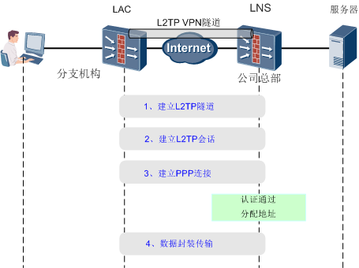

各个阶段的建立过程与Client-Initiated VPN的建立过程大同小异，大家可以温习VPN篇 L2TP Client-Initiated VPN，强叔在这里就不多说了。需要注意的一点是，在阶段3中，LNS只对LAC进行验证，验证通过后为LAC的VT接口分配IP地址，而不是为分支机构用户分配IP地址。虽然LNS不为分支机构分配IP地址，但是并不代表分支机构的IP地址可以随意配置。

为了保证分支机构网络与总部网路之间正常访问，请为分支机构网络和总部网络规划各自独立的私网网段，要求二者的网段地址不能重叠。

总结一下LAC-Auto-Initiated VPN的特点：

LAC-Auto-Initiated VPN场景中，LAC和LNS之间建立一条永久的隧道，且仅承载一条永久的L2TP会话和PPP连接。L2TP会话和PPP连接只存在于LAC和LNS之间。

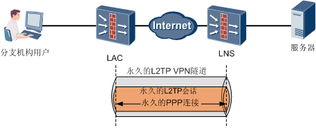

LAC-Auto-Initiated VPN的PPP封装和L2TP封装仅限于LAC和LNS之间的报文交互：

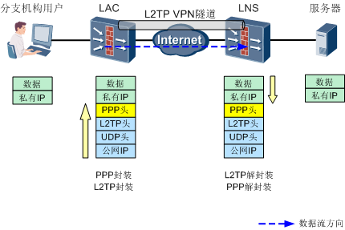

另外，还有一个需要重点关注的问题是回程报文如何进入隧道。与Client-Initiated VPN以及NAS-Initiated VPN不同，在LAC-Auto-Initiated VPN中，LNS只下发了一条目的地址为LAC的VT接口地址的UNR路由，并没有去往分支机构网络的路由。对此LNS振振有词：“我只对我分配出去的IP地址负责，所以保证可以到达对端LAC的VT接口。分支机构网络的地址不是我分配的，我甚至都不知道它们的地址是什么，因此只能说抱歉。”

那么如何解决这个问题呢？最简单方法就是在LNS手动配置一条去往分支机构网络的静态路由，指引回程报文进入隧道：
```bash
ip route-static 172.16.0.0 255.255.255.0 Virtual-Template 1
```
除了配置静态路由之外，还有没有其他方法呢？强叔突然灵光一现，还记得我们之前讲过的NAT吧！既然LNS只认他分配的IP地址，那我们就在LAC上配置源NAT功能，把分支机构用户访问总部网络报文的源地址都转换成VT接口的地址，即easy-IP方式的源NAT。LNS收到回程报文后，发现目的地址是LAC的VT接口的IP地址，就会按照UNR路由进入隧道转发，这样就无需在LNS上配置静态路由了。

字不如图，下面强叔就以实际组网为例，介绍一下LAC上配置了源NAT后，分支机构用户访问总部服务器时的报文封装与解封装全过程：

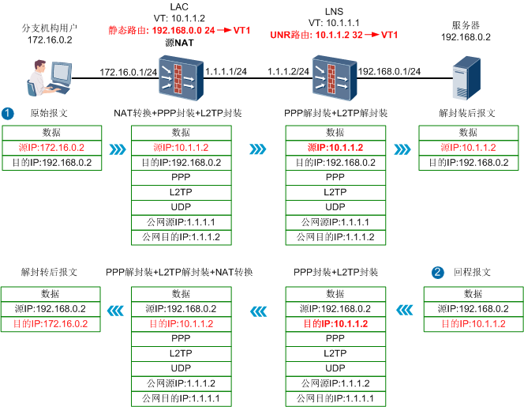

1.  LAC收到分支机构用户访问总部服务器的原始报文后，根据目的地址查找路由，命中我们手动配置的静态路由，将报文发送至VT接口。
2.  LAC在VT接口对原始报文进行NAT转换，将源地址转换成VT接口的地址，然后为报文封装PPP头、L2TP头和公网地址。LAC根据公网目的地址查找路由，将封装后的报文发送至LNS。
3.  LNS收到报文后，剥离掉PPP头、L2TP头，根据目的地址查找路由（此处为直连路由），然后将报文发送至总部服务器。
4.  LNS收到总部服务器的回程报文后，根据目的地址查找路由，命中LNS自动下发的UNR路由，将报文发送至VT接口。
5.  报文在VT接口封装PPP头、L2TP头和公网地址，LNS根据公网目的地址查找路由，将封装后的报文发送至LAC。
6.  LAC收到报文后，剥离掉PPP头、L2TP头，将报文的目的地址转换成分支机构用户的地址，然后将报文发送至分支机构用户。

在LAC上配置easy-IP方式源NAT的示例如下（假设在LAC上连接分支机构网络的接口属于Trust区域，VT接口属于Untrust区域）：
```bash
nat-policy interzone trust untrust outbound  
 policy 1    
  action source-nat  
  policy source 172.16.0.0 0.0.0.255
    easy-ip Virtual-Template 1
```

至此，强叔用三期的篇幅介绍了三种L2TP VPN，下面我们再来对这三种L2TP VPN做一下总结：

| 项目           | Client-Initiated VPN                                                              | NAS-Initiated VPN                                                                             | LAC-Auto-Initiated VPN                                                       |
| -------------- | --------------------------------------------------------------------------------- | --------------------------------------------------------------------------------------------- | ---------------------------------------------------------------------------- |
| 协商方式       | L2TP Client和LNS协商建立L2TP隧道和L2TP会话、建立PPP连接                           | 接入用户使用PPPoE拨号触发LAC和LNS之间协商建立L2TP隧道和L2TP会话，接入用户和LNS协商建立PPP连接 | LAC主动拨号，和LNS协商建立L2TP隧道和L2TP会话、建立PPP连接                    |
| 隧道和会话关系 | 每个L2TP Client和LNS之间均建立一条L2TP隧道，每条隧道中仅承载一条L2TP会话和PPP连接 | LAC和LNS的连接可存在多条L2TP隧道，一条L2TP隧道中可承载多条L2TP会话                            | LAC和LNS之间建立一条永久的L2TP隧道，且仅承载一条永久的L2TP会话和PPP连接      |
| 安全性         | LNS对L2TP Client进行PPP认证（PAP或CHAP），安全性较高                              | LAC对接入用户进行认证，LNS对接入用户进行二次认证（可选），安全性最高                          | LAC不对用户进行认证，LNS对LAC配置的用户进行PPP认证（PAP或CHAP），安全性低    |
| 回程路由配置   | LNS上会自动下发UNR路由，指导回程报文进入L2TP隧道，无需手动配置                    | LNS上会自动下发UNR路由，指导回程报文进入L2TP隧道，无需手动配置                                | LNS上需要手动配置目的地址为网段的静态路由，或者在LAC上配置easy-IP方式的源NAT |


## IPSec
作为新一代的VPN技术，IPSec可以在Internet上建立安全稳定的专用线路。与GRE和L2TP相比，IPSec更加安全，能够保证总舵与分舵之间消息的安全传输。

### 两大绝技
要说这IPSec可不简单，它不是一个单一的招式，而是一整套招法。IPSec巧妙借用了密码学门派所擅长的易容障眼之法，融会到自创的AH（Authentication Header，验证头）和ESP（Encapsulating Security Payload，封装安全载荷）两大绝技中，既可改头换面瞒天过海，也能验明正身完璧归赵。即便消息被截获了也没人能看懂，被篡改了也能及时发现。

#### 一: 加密
IPSec借用了易容术的巧妙之处，一方传递消息之前，先使用加密算法和加密密钥，将消息改头换面，该过程称为加密；另一方收到消息后，使用相同的加密算法和加密密钥，逆向将消息恢复为真实面貌，该过程称为解密。而消息在传递过程中绝不以真容示人，令窃密者一无所获。

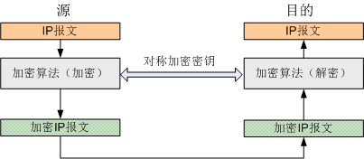

总舵和分舵使用相同的密钥来加密和解密，这种方式也叫对称加密算法，主要包括DES、3DES和AES

| 项目     | DES                      | 3DES                            | AES                          |
| -------- | ------------------------ | ------------------------------- | ---------------------------- |
| 全称     | Data Encryption Standard | Triple Data Encryption Standard | Advanced Encryption Standard |
| 密钥长度 | 56位                     | 168位                           | 128位、192位、256位          |
| 安全级别 | 低                       | 中                              | 高                           |

#### 二: 验证
一方传递消息之前，先使用验证算法和验证密钥对消息进行处理，得到签字画押的文书，即签名。然后将签名随消息一同发出去。另一方收到消息后，也使用相同的验证算法和验证密钥对消息进行处理，同样得到签名，然后比对两端的签名，如果相同则证明该消息没有被篡改。

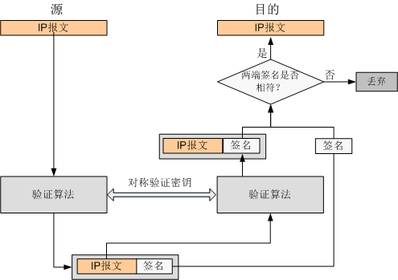

除了对消息的完整性进行验证，IPSec还可以对消息的来源进行验证，即验明消息的正身，保证消息来自真实的发送者。

通常情况下，验证和加密配合使用，加密后的报文经过验证算法处理生成签名。常用的验证算法有MD5和SHA系列。
| 项目     | MD5              | SHA1                    | SHA2                                                      |
| -------- | ---------------- | ----------------------- | --------------------------------------------------------- |
| 全称     | Message Degest 5 | Secure Hash Algorithm 1 | Secure Hash Algorithm 2                                   |
| 签名长度 | 128位            | 160位                   | SHA2-256:256位<br/>SHA2-384:384位<br/>SHA2-512:512位<br/> |


IPSec的两大绝技中，AH只能用来验证，没有加密的功能，而ESP同时具有加密和验证的功能，AH和ESP可以单独使用也可以配合使用。

### 安全封装
IPSec设计了两种封装模式：

#### 隧道模式
在隧道模式下，AH头或ESP头到原始IP头之前，另外生成一个新的报文头放到AH头或ESP头之前：


隧道模式使用新的报文头来封装消息，可以保护一个网络的消息，适用于两个网关之间通信，是比较常用的封装模式。总舵和分舵内部私网之间的信息经过加密和封装处理后，在外看来只是总舵和分舵的公开身份（公网地址），即当铺和票号之间的通信，不会被人怀疑。

#### 传输模式
在传输模式中，AH头或ESP头入到IP头与传输层协议头之间：


传输模式不改变报文头，隧道的源和目的地址就是最终通信双方的源和目的地址，通信双方只能保护自己发出的消息，不能保护一个网络的消息。所以该模式只适用于两台主机之间通信，不适用于天地会总舵和分舵内部私网之间通信。

### 互信盟友
IPSec中通信双方建立的连接叫做安全联盟SA（Security Association），顾名思义，通信双方结成盟友，使用相同的封装模式、加密算法、加密密钥、验证算法、验证密钥，相互信任亲密无间。

安全联盟是单向的逻辑连接，为了使每个方向都得到保护，总舵和分舵的每个方向上都要建立安全联盟。总舵入方向上的安全联盟对应分舵出方向上的安全联盟，总舵出方向上的安全联盟对应分舵入方向上的安全联盟。


为了区分这些不同方向的安全联盟，IPSec为每一个安全联盟都打上了唯一的标识符，这个标识符叫做SPI（Security Parameter Index）。

建立安全联盟最直接的方式就是分别在总舵和分舵上人为设定好封装模式、加密算法、加密密钥、验证算法、验证密钥，即手工方式建立IPSec安全联盟。

#### 初显神威
了解到IPSec的强大威力后，天地会陈总舵主决定先在总舵和一个分舵之间使用手工方式部署IPSec隧道，对总舵和分舵内部网络之间传递的消息进行保护，验证IPSec隧道的安全效果。


为了让加密、验证、安全联盟的配置关系更清晰，IPSec为手工方式定义了四个步骤：
1.  定义需要保护的数据流
    
    只有总舵和分舵内部网络之间交互的消息才被IPSec保护，其他消息不受保护。

2.  配置IPSec安全提议

    总舵和分舵根据对方的提议，决定能否成为盟友。封装模式、ESP、加密算法和验证算法均在安全提议中设置。

3.  配置手工方式的IPSec安全策略

    指定总舵和分舵的公网地址、安全联盟标识符SPI，以及加密密钥和验证密钥。

4.  应用IPSec安全策略

手工方式的IPSec配置关系如下图所示：


天地会总舵和分舵的关键配置和解释如下：

| 配置项                | 天地会总舵                                                                                                                                                                                                                                                                             | 天地会分舵                                                                                                                                                                                                                                                                             |
| --------------------- | -------------------------------------------------------------------------------------------------------------------------------------------------------------------------------------------------------------------------------------------------------------------------------------- | -------------------------------------------------------------------------------------------------------------------------------------------------------------------------------------------------------------------------------------------------------------------------------------- |
| ACL                   | **acl number 3000**<br/> rule 5 permit ip source 192.168.0.0 0.0.0.255 destination 172.16.0.0 0.0.0.255                                                                                                                                                                                | **acl number 3000**<br/> rule 5 permit ip source 172.16.0.0 0.0.0.255 destination 192.168.0.0 0.0.0.255                                                                                                                                                                                |
| **IPSec安全提议**     | **ipsec proposal pro1**<br/> transform esp<br/> encapsulation-mode tunnel<br/> esp authentication-algorithm sha1<br/> esp encryption-algorithm aes                                                                                                                                     | **ipsec proposal pro1** <br/>transform esp <br/> encapsulation-mode tunnel <br/>esp authentication-algorithm sha1 <br/> esp encryption-algorithm aes                                                                                                                                   |
| **IPSec安全策略**     | **ipsec policy policy1 1 manual**<br/> security acl 3000<br/> proposal pro1<br/> tunnel local 1.1.1.1<br/> tunnel remote 2.2.2.2<br/> sa spi inbound esp 54321<br/>sa spi outbound esp 12345<br/> sa string-key inbound esp huawei@123<br/> sa string-key outbound esp huawei@456<br/> | **ipsec policy policy1 1 manual**<br/> security acl 3000<br/> proposal pro1<br/> tunnel local 2.2.2.2<br/> tunnel remote 1.1.1.1<br/> sa spi inbound esp 12345<br/>sa spi outbound esp 54321<br/> sa string-key inbound esp huawei@456<br/> sa string-key outbound esp huawei@123<br/> |
| **应用IPSec安全策略** | **interface GigabitEthernet0/0/1**<br/> ip address 1.1.1.1 255.255.255.0<br/> ipsec policy policy1                                                                                                                                                                                     | **interface GigabitEthernet0/0/0**<br/>ip address 2.2.2.2 255.255.255.0<br/> ipsec policy policy1                                                                                                                                                                                      |


注：除了上述IPSec的配置之外，防火墙安全策略也需要配置，允许总舵和分舵之间建立安全联盟，以及允许总舵私网和分舵私网之间互访。

部署完成后，总舵内部网络向分舵内部网络发出ping消息，分舵内部网络回复ping消息，天地会在Internet上模拟官府设卡检查，发现两个方向的ping消息都已经被IPSec安全联盟保护。两个方向上IPSec安全联盟的标识符SPI分别为0x3039（十进制12345）以及0xd431（十进制54321），与上文配置相符。


分析报文的内容，发现ping消息已经被加密，面目全非无法辨识，这样即使该消息真的被官府查获，也不能获取到任何有价值的信息。

为了对比ESP和AH的作用，天地会又使用IPSec中的另一绝技AH来建立安全联盟。AH只有验证功能，没有加密的功能，官府从查获到的消息中看到私网报文头和ping消息真容。因此，**如果要实现加密，还是要使用ESP，或者AH和ESP配合使用**


## IPSec携手IKE 
### 密钥管家IKE登场
上回说到手工方式的IPSec VPN帮助天地会解决了总舵和分舵之间秘密通信的问题，但随着分舵数量的增加新的问题又出现了。手工方式下防火墙的加密和验证所使用的密钥都是手工配置的，为了保证IPSec VPN的长期安全，需要经常修改这些密钥。分舵数量越多，密钥的配置和修改工作量越大。随着天地会的壮大，IPSec VPN的维护管理工作越来越让人吃不消了。
为了降低IPSec VPN管理工作量，天地会总舵主再访高人寻求灵丹妙药。灵丹已练，妙药天成――原来IPSec协议框架中早就考虑了这个问题――智能的密钥管家IKE（Internet Key Exchange）协议可以帮助解决这个问题。IKE综合了三大协议：ISAKMP（Internet Security Association and Key Management Protocol）、Oakley协议和SKEME协议。ISAKMP主要定义了IKE伙伴（IKE Peer）之间合作关系（IKE SA，跟IPSec SA类似）的建立过程。Oakley协议和SKEME协议的核心是DH（Diffie-Hellman）算法，主要用于在Internet上安全地分发密钥、验证身份，以保证数据传输的安全性。有了IKE加盟，IPSec VPN的安全和管理问题不再困扰天地会，各地分舵申请建立VPN的流程终于可以进入“实施”状态了。

### 揭开ISAKMP本来面目
IKE协议的终极目标是通过协商在总舵和分舵之间动态建立IPSec SA，并能够实时维护IPSec SA。为建立IPSec SA而进行的IKE协商工作是由ISAKMP报文来完成的，所以在部署IKE之前，强叔先领大家认识一下ISAKMP报文。ISAKMP报文封装如下：


####  IP报文头

- 源地址src：本端发起IKE协商的IP地址，可能是接口IP地址，也可能是通过命令配置的IP地址。
- 目的IP地址Dst：对端发起IKE协商的IP地址，由命令配置。

#### UDP报文头
IKE协议使用端口号500发起协商、响应协商。在总舵和分舵都有固定IP地址时，这个端口在协商过程中保持不变。当总舵和分舵之间有NAT设备时（NAT穿越场景），IKE协议会有特殊处理（后续揭秘）
#### ISAKMP报文头
- Initiator’s Cookie（SPI）和responder’s Cookie（SPI）：在IKEv1版本中为Cookie，在IKEv2版本中Cookie为IKE的SPI，唯一标识一个IKE SA。
- Version：IKE版本号1。
- Exchange Type：IKE定义的交互类型2。交换类型定义了ISAKMP消息遵循的交换顺序。
- Next Payload：标识消息中下一个载荷的类型。一个ISAKMP报文中可能装载多个载荷，该字段提供载荷之间的“链接”能力。若当前载荷是消息中最后一个载荷，则该字段为0。
- Type Payload：载荷类型，ISAKMP报文携带的用于协商IKE SA和IPSec SA的“参数包”。载荷类型有很多种，不同载荷携带的“参数包”不同。不同载荷的具体作用我们后面会结合抓包过程逐一分析。

说明：
1.IKE诞生以来，有过一次大的改进。老的IKE被称为IKEv1，改进后的IKE被称为IKEv2。二者可以看做是父子关系，血脉相承，基本功能不变；但青胜于蓝，后者有了长足的进步。
2. IKEv1版本中可以在交换类型字段查看协商模式，阶段1分为两种模式：主模式和野蛮模式，阶段2采用快速模式。主模式是主流技术，野蛮模式是为解决现实问题而产生的。IKEv2版本中定义了查看创建IKE SA和CHILD SA（对应IKEv1的IPSec SA）的IKE_SA_INIT、IKE_AUTH（创建第一对CHILD SA）、CREATE_CHILD_SA（创建后续的CHILD SA）。

IKEv1和IKEv2的精华之处正是本文的重点，各位看官莫急，容强叔一一道来。

### IKEv1小试牛刀
IKE最适合于在总舵和众多分舵之间建立IPSec VPN的场景，分舵越多IKE的优势越能凸显。为了讲解方便，这里仅给出总舵和一个分舵之间建立IPSec VPN的组网图。


相比手工方式，IKE方式仅增加了两步：配置IKE安全提议和IKE对等体。IKE安全提议主要用于配置建立IKE SA用到的加密和验证算法。IKE对等体主要配置IKE版本、身份认证和交换模式。


说明：两条红色命令表示本例采用了IKEv1版本主模式。缺省同时开启IKEv1和IKEv2，关闭IKEv2后采用IKEv1版本进行协商。

配置完成之后，总舵和分舵之间有互访数据流时即可触发建立IPSec VPN隧道，下面强叔通过抓包来为大家详解一下IKEv1的精妙之处。
### IKEv1 招式拆解
IKEv1版本分两个阶段来完成动态建立IPSec SA的任务：
- **阶段1-建立IKE SA**：阶段1采用主模式或野蛮模式协商。
- **阶段2-建立IPSec SA**：阶段2此采用快速模式协商。

下面先介绍主模式+快速模式下的IPSec SA建立过程。

#### 阶段1-建立IKE SA（主模式）
主模式下IKEv1采用3个步骤6条ISAKMP消息建立IKE SA。下面以网关A主动发起IKE协商为例进行讲解。


##### 1. 协商IKE安全提议
协商分两种情况:
- 发起方的IKE Peer中引用了IKE Proposal
- 发起方的IKE peer中没有引用IKE Proposal

二种情况下响应方都会在自己配置的IKE安全提议中寻找与发送方相匹配的IKE安全提议, 如果没有匹配的安全提议则协商失败. IKE Peer双方安全提议匹配的原则为协商双方有相同的加密算法、认证算法、身份认证方法和DH组标识（不包括IKE SA生存周期）。

**说明**：通过IKEv1协议协商建立IPSec安全联盟时，采用本地生存周期和对端生存周期中较小的一个，不必保证隧道两端设备配置的生存周期相同（sa duration）。
通过抓包可以看出ISAKMP消息的SA载荷中携带用于协商的IKE安全提议。以消息1为例：


##### 2. 使用DH算法交换密钥材料, 并生成密钥
网关A和B利用ISAKMP消息的Key Exchange和nonce载荷交换彼此的密钥材料。Key Exchange用于交换DH公开值，nonce用于传送临时随机数。由于DH算法中IKE Peer双方只交换密钥材料，并不交换真正的共享密钥，所以即使黑客窃取了DH值和临时值也无法计算出共享密钥，这一点正是DH算法的精髓所在。从抓包中可以看到IKE Peer双方交换密钥材料，以消息3为例：


密钥材料交换完成后, IKE Peer双方结合自身配置的身份验证方法各自开始复杂的密钥计算过程(预共享密钥或数字证书都会参与到密钥计算过程中), 最终会产生三个密钥:
- SKEYID_a：ISAKMP消息完整性验证密钥――谁也别想篡改ISAKMP消息了，只要消息稍有改动，响应端完整性检查就会发现！
- SKEYID_e：ISAKMP消息加密密钥――再也别想窃取ISAKMP消息了，窃取了也看不懂！

**以上两个密钥保证了后续交换的ISAKMP信息的安全性!**

- SKEYID_d：用于衍生出IPSec报文加密和验证密钥――最终是由这个密钥保证IPSec封装的数据报文的安全性！

**整个密钥交换和计算过程在IKE SA超时时间的控制下以一定的周期进行自动刷新, 避免了密钥长期不变带来的安全隐患.**

##### 3. 身份认证
IKE Peer通过两条ISAKMP消息(5,6)交换身份信息, 进行身份认证. 目前有两种身份认证技术比较常用:
- 预共享密钥方式(pre-share): 设备的身份信息为ip地址或名称
- 数字证书方式: 设备的身份信息为证书和通过证书密钥加密的部分信息Hash值(俗称签名)

以上身份信息都由SKEYID_e 进行加密, 所以在抓包中我们只能看到标识为“Encrypted”的ISAKMP消息，看不到消息的内容（身份信息）。以消息5为例：


预共享密钥是最简单、最常用的身份认证方法。这种方式下设备的身份信息可以用IP地址或名称（包括FQDN和USER-FQDN两种形式）来标识。当IKE Peer两端都有固定IP地址的时候，一般都用IP地址作为身份标识；当一端为动态获取IP地址的时候，没有固定IP地址的一端只能用名称来标识。本篇强叔给大家展示的案例为前者，后者晚些再讲。

**这里有个小问题提醒大家关注：**

总舵收到分舵1发来的身份信息后，需要用密钥（SKEYID_a和SKEYID_e）进行完整性验证和解密，只有先找到正确的预共享密钥才能计算出这两个密钥。但总舵网关为每个IKE Peer都配置了一个预共享密钥。怎么找呢？此时只能根据IKE Peer发来的ISAKMP报文的源IP地址（src）来查找预共享密钥，只要报文源地址与本端IKE Peer视图下remote-address命令配置的IP地址一致，就认为该视图下配置的pre-shared-key是分舵1的预共享密钥。

以上是IPSec协议内部处理过程，不需要大家操心。**大家只要记住在IKE Peer两端都有固定IP地址的场景下，remote-address命令配置的IP地址要跟对端发起IKE协商的IP地址保持一致即可。这个IP地址的作用不仅仅是指定了隧道对端的IP地址，还参与了预共享密钥的查找。**

阶段1协商完成后，进入阶段2。

#### 阶段2-建立IPSec SA
在阶段2中IKEv1采用快速交换模式通过3条ISAKMP消息建立IPSec SA。由于快速交换模式使用IKEv1阶段1中生成的密钥SKEYID_e对ISAKMP消息进行加密，所以我们抓到的报文都是加密的，看不到载荷里面的具体内容。故下面只能文字介绍一下每一步的作用。

下面以网关A发起IPSec协商为例进行讲解


1. **发起方发送IPSec安全提议、被保护的数据流（ACL）和密钥材料给响应方**。
2. **响应方回应匹配的IPSec安全提议、被保护的数据流，同时双方生成用于IPSec SA的密钥**。

    IPSec对等体两端协商IPSec安全提议的过程跟协商IKE安全提议的过程类似，不再赘述。

    **IKEv1不协商ACL规则，建议两端设备配置的ACL规则互为镜像，避免IPSec SA协商失败。**

    IPSec对等体两端交换密钥材料（SKEYID_d、SPI和协议1、nonce等参数），然后各自进行密钥计算生成用于IPSec SA加密验证的密钥，这样可以保证每个IPSec SA都有自己独一无二的密钥。由于IPSec SA的密钥都是由SKEYID_d衍生的，一旦SKEYID_d泄露将可能导致IPSec VPN受到侵犯。为提升密钥管理的安全性，**IKE提供了PFS（完美向前保密）功能**。启用PFS后，在进行IPSec SA协商时会进行一次附加的DH交换，重新生成新的IPSec SA密钥，提高了IPSec SA的安全性。

    说明：1、协议指AH和/或ESP协议。

3. **发起方发送确认结果**。

    协商完成发送方开始发送IPSec(ESP)报文

    

    检查IPSec VPN状态信息

    以总舵显示信息为例:
    - 在总舵和分舵上查看IKE SA的建立情况。
        ```bash
        <FW_A> display ike sa
        current ike sa number: 2
        ---------------------------------------------------------------------
        conn-id    peer                    flag          phase vpn
        ---------------------------------------------------------------------
        40129      2.2.3.2                 RD|ST         v1:2  public
        40121      2.2.3.2                 RD|ST         v1:1  public
        ```
        这里统一显示了IKE SA（v1:1）和IPSec SA（v1:2）的状态，RD表示SA状态为READY。IKE Peer之间只有一个IKE SA，IKE SA是双向逻辑连接（不区分源和目的）。
    - 在总舵和分舵上查看IPSec SA的建立情况
    
        ```bash
        <FW_A> display ipsec sa brief
        current ipsec sa number: 2
        current ipsec tunnel number: 1
        ---------------------------------------------------------------------
        Src Address     Dst Address     SPI        Protocol  Algorithm
        ---------------------------------------------------------------------
        1.1.1.1         2.2.3.2         4090666525 ESP       E:DES;A:HMAC-MD5-96;
        2.2.3.2         1.1.1.1         2927012373 ESP       E:DES;A:HMAC-MD5-96;
        ```
        IPSec SA是单向的（区分源和目的），两个方向的IPSec SA共同组成一条IPSec隧道。
    
        **说明：一般来说一条数据流对应一个IPSec SA。但当IPSec同时采用了ESP+AH封装时，一条数据流会对应两个IPSec SA。**
    - 在总舵和分舵上查看会话表。
    
        ```bash
        <FW_A > display firewall session table
        11:01:45  2014/07/08
        Current Total Sessions : 6
        esp  VPN:public --> public 1.1.1.1:0-->2.2.3.2:0
        icmp  VPN:public --> public 172.16.2.2:7264-->192.168.0.2:2048
        icmp  VPN:public --> public 172.16.2.2:7520-->192.168.0.2:2048
        icmp  VPN:public --> public 172.16.2.2:7776-->192.168.0.2:2048
        icmp  VPN:public --> public 172.16.2.2:8032-->192.168.0.2:2048
        icmp  VPN:public --> public 172.16.2.2:8288-->192.168.0.2:2048
        防火墙会为IPSec VPN建立了会话表（1.1.1.1:0-->2.2.3.2:0）。
        ```
**下面简单介绍一下野蛮模式**

配置命令exchange-mode aggressive即可将IKEv1的协商模式改为野蛮模式。抓包看一下野蛮模式的情况：


野蛮模式只用了3条ISAKMP消息就完成了阶段1的协商过程, 阶段2仍旧是快速模式不变


发起方和响应方把IKE安全提议、密钥相关信息和身份信息一股脑地全放在一个ISAKMP消息中发送给对方，IKE协商效率提高了。但由于身份信息是明文传输，没有加密和完整性验证过程，IKE SA的安全性降低了。**既然这样不够安全，为什么野蛮模式还会出现？**

在IPSec VPN出现的早期，由于主模式+预共享密钥身份认证方式下，IPSec需要通过对端的IP地址来在本地查找预共享密钥（主模式中已经详细解释了这个问题）。这种密钥查找方式在对端没有固定IP地址的情况下（比如IPSec NAT穿越场景，网络出口动态获取IP地址场景）行不通。此时，野蛮模式可以“野蛮”地解决这个问题。野蛮模式中“身份信息”没有加密，IPSec就直接用对端发送来的身份信息来查找预共享密钥即可。所以在IPSec VPN应用初期，野蛮模式主要用于解决没有固定IP地址的节点部署IPSec VPN的问题。**现在，IPSec VPN解决这个问题有很多方法，不安全的野蛮模式已经不是最好的选择了。**具体方法待后续再呈现给大家

### IKEv2应运而生
IKEv1似乎已经很完美了, 但用得久了仍旧会发现不尽人意之处
- 协商建立IPSec SA得时间太长

    - IKEv1主模式协商一对IPSec SA，需要6（协商IKE SA）+3（协商IPSec SA）=9条消息。
    - IKEv1野蛮模式协商一对IPSec SA，需要3（协商IKE SA）+3（协商IPSec SA）=6条消息。
- 不支持远程用户接入

    - IKEv1不能对远程用户进行认证。若想支持远程用户接入，只能借助L2TP，通过PPP来对远程用户进行AAA认证。

这些问题怎么解决呢？办法总比问题多！IKEv2中完美的解决了这些问题。

IKEv2相比IKEv1： 

- 协商建立IPSec SA的速度大大提升
正常情况IKEv2协商一对IPSec SA只需要2（协商IKE SA）+2（协商IPSec SA）=4条消息。后续每建立一对IPSec SA只会增加2条消息。
- 增加了EAP（Extensible Authentication Protocol）方式的身份认证。
IKEv2通过EAP协议解决了远程接入用户认证的问题，彻底摆脱了L2TP的牵制。目前IKEv2已经广泛应用于远程接入网络中了。今天强叔只介绍IKEv2的基本协商过程，EAP认证留待后续再讲。

IKEv2的配置思路与IKEv1完全相同，只是细节稍有不同：


说明：红色命令与IKEv1不同。缺省情况下，防火墙同时开启IKEv1和IKEv2协议。本端发起协商时，采用IKEv2，接受协商时，同时支持IKEv1和IKEv2。可以不关闭IKEv1。

IKEv2协商IPSec SA的过程跟IKEv1有很大差别

#### 1. 初始交换4条消息同时搞定IKE SA和IPSec SA。

初始交换包括IKE安全联盟初始交换（IKE_SA_INIT交换）和IKE认证交换（IKE_AUTH交换）。


**第一个消息对（IKE_SA_INIT）**：负责IKE安全联盟参数的协商，包括IKE Proposal，临时随机数（nonce）和DH值。


SA载荷主要用来协商IKE Proposal。


KE（Key Exchange）载荷和Nonce载荷主要用来交换密钥材料。


IKEv2通过IKE_SA_INIT交换后最终也生成三类密钥：
- SK_e：用于加密第二个消息对。
- SK_a：用于第二个消息对的完整性验证。
- SK_d：用于为Child SA（IPSec SA）衍生出加密材料。

**第二个消息对（IKE_AUTH）**：负责身份认证，并创建第一个Child SA（一对IPSec SA）。

目前三种身份认证技术比较常用：

- 预共享密钥方式（pre-share）：设备的身份信息为IP地址或名称。
- 数字证书方式：设备的身份信息为证书和通过证书私钥加密的部分消息Hash值（签名）。
- EAP方式：采用EAP认证的交换过程属于扩展交换的内容，将在后面讲解。

以上身份信息都通过SKEYID_e加密。

创建Child SA时，当然也要协商IPSec安全提议、被保护的数据流。IKEv2通过TS载荷（TSi和TSr）来协商两端设备的ACL规则，最终结果是取双方ACL规则的交集（这点跟IKEv1不同，IKEv1没有TS载荷不协商ACL规则）。
当一个IKE SA需要创建多对IPSec SA时，例如两个IPSec对等体之间有多条数据流的时候，需要使用创建子SA交换来协商后续的IPSec SA。


#### 2. 子SA交换2条消息建立一对IPSec SA。


子SA交换必须在IKE初始交换完成之后才能进行，交换的发起者可以是IKE初始交换的发起者，也可以是IKE初始交换的响应者。这2条消息由IKE初始交换协商的密钥进行保护。

IKEv2也支持PFS功能，创建子SA交换阶段可以重新进行一次DH交换，生成新的IPSec SA密钥。


### IKEv1和IKEv2大PK
IKEv1和IKEv2的细节写了这么多，现在总结一下二者的异同点吧： 

| 功能项               | IKEv1                                                                                                                                                       | IKEv2                                                    |
| -------------------- | ----------------------------------------------------------------------------------------------------------------------------------------------------------- | -------------------------------------------------------- |
| IpSec SA建立过程     | 分两个阶段, 阶段1分两种模式: 主模式和野蛮欧式, 阶段2为快速模式<br/> 主模式+快速模式需要9条信息建立IPSec SA。<br/>野蛮模式+快速模式需要6条信息建立IPSec SA。 | 不分阶段,最少4条信息即可建立IPSec SA.                    |
| **ISAKMP**           | 两者支持得载荷类型不同                                                                                                                                      | 两者支持得载荷类型不同                                   |
| **认证方法**         | 预共享密钥<br/>数字证书<br/>数字信封（较少使用）                                                                                                            | 预共享密钥<br/>数字证书<br/>EAP<br/>数字信封（较少使用） |
| **IKE SA完整性算法** | 不支持                                                                                                                                                      | 支持                                                     |
| **PES**              | 支持                                                                                                                                                        | 支持                                                     |
| **远程接入**         | 通过L2TP over IpSec来实现                                                                                                                                   | 支持                                                     |

显然IKEv2以其更加快捷、更加安全的服务胜出，长江后浪推前浪又成为了没有任何悬念的事实。 

### IPSec协议框架总结
安全协议(AH和ESP), 加密算啊(DES, 3DES, AES), 验证算法(MD5,SHA1,shA2), IKE, DH,好多的缩写，大家搞清楚他们之间的关系了么？强叔做了一下总结，看看能否帮助大家：

- 安全协议(AH和ESP) -- IP报文的完全封装. 此'马甲'并非一般的马甲, 是**交织了'加密'和'验证'算法的刀枪不入的'软猬甲'**

    

   说明：AH封装的验证范围实际要还更大一些，包括新的IP头。

- 加密算法（DES、3DES、AES）――IPSec报文的易容之术。IPSec数据报文采用对称加密算法进行加密，但只有ESP协议支持加密，AH协议不支持。另外，IKE协商报文也会进行加密。
- 验证（MD5、SHA1、SHA2）――IPSec报文的验明正身之法。加密后的报文经过验证算法处理生成数字签名，数字签名填写在AH和ESP报文头的完整性校验值ICV字段发送给对端；在接收设备中，通过比较数字签名进行数据完整性和真实性验证。
- IKE――手握密钥管理大权的贴心管家。IPSec使用IKE协议在发送、接收设备之间安全地协商密钥、更新密钥。
- DH算法――贴心管家的铁算盘。DH被称为公共密钥交换方法，它用于产生密钥材料，并通过ISAKMP消息进行交换，并最终在收发两端计算出加密密钥和验证密钥。

这些概念一一梳理过来，强叔不得不感叹IPSec协议设计者的强大――这么多新的老的协议、算法拼接起来如此天衣无缝，自此Internet的险恶被屏蔽在隧道之外！为了方便大家记忆这些缩写，强叔用一张简图概括之：


## 模板方式IPSec安全策略
跟IKE方式IPSec安全策略一样，模板方式IPSec安全策略也要依靠IKE协商IPSec隧道。模板方式IPSec安全策略最大的改进就是不要求对端IP地址固定：**可以严格指定对端IP地址（单个IP），可以宽泛指定对端IP地址（IP地址段）也可以干脆不指定对端IP（意味着对端IP可以是任意IP）**。

模板方式IPSec安全策略就好像一员猛将，根本不把对端IP放在眼里，什么固定IP、动态地址、私网IP统统不在话下。只管放马过来，来多少都照单全收。正因为这种大将风范，模板方式IPSec安全策略特别适用于天地会总舵，用于响应众多分舵的协商请求。且分舵数量越多越明显：
- 采用IKE方式IPSec策略, 总舵需要配置N个IPSec策略, N个IKE对等体. N=分舵数量
- 采用模板方式IPSec策略. 总舵需要配置1个IPSec策略, 一个IKE对等体. 与N的取值无关

总之, 模板方式IPSec安全策略的两大优点令他在IPSec阵营中始终保持明星地位:
- 对对端要求甚少, 由固定IP或者没有无所谓
- 配置简单,只要配置一个IKE Peer即可

但明星也是有缺点的，这个缺点也可以说是模板方式IPSec安全策略“不拘小节”的地方：模**板方式IPSec安全策略只能响应对端发起的协商请求，不能主动发起协商**。

至此强叔已经介绍了三种IPSec安全策略：手工方式IPSec安全策略、IKE方式IPSec安全策略、模板方式IPSec安全策略。**这三种IPSec安全策略都可以配置在一个IPSec安全策略组中**。所谓IPSec安全策略组就是一组名称相同的IPSec安全策略。在一个IPSec安全策略组中最多只能存在一个模板方式IPSec安全策略，且其序号必须最大，即优先级最小。否则接入请求被模板接收了，优先级低的IKE方式IPSec策略则无法施展。切记！

### 分舵接入IP便, 模板接收只等闲

总舵跟分舵1和分舵2之间建立IPSec VPN的组网图如下所示。本图中分舵1和分舵2的出接口采用动态方式获取公网IP地址。要求在分舵1跟总舵、分舵2跟总舵之间建立IPSec隧道，分舵1跟分舵2之间也可以通过IPSec通信。


模板方式IPSec安全策略配置流程如下：


分舵2的配置与分舵1类似，请参考分舵1的配置。IKE安全提议和IPSec安全提议采用缺省配置（每个版本的缺省配置可能不同，请配置时注意）。


部署完成后进行验证：
1. 在总舵IPSec网关上可以查看到总舵跟分舵1和分舵2都正常建立了第一阶段和第二阶段安全联盟。
2. 分舵1、分舵2、总舵可以互相通信。

问题：若在接口上应用IPSec策略时不配置auto-neg参数，分舵1跟分舵2可以直接通信吗？

1. 在分舵1和分舵2的网关取消接口上应用的IPSec策略后，重新应用时不配置auto-neg参数。由分舵1的PC2 ping分舵2的PC3，无法ping通。
2. 查看分舵1上安全联盟的建立情况。

    ```bash
    <FW_B> display ike sa
    current ike sa number: 2
    ---------------------------------------------------------------------
    conn-id    peer                    flag          phase vpn
    ---------------------------------------------------------------------
    40022      1.1.1.1                RD|ST         v2:2  public
    7           1.1.1.1                RD|ST         v2:1  public
    ```

分舵1跟总舵之间的安全联盟正常建立。

3. 查看分舵2上安全联盟的建立情况。

    ```bash
    <FW_C> display ike sa
    current sa Num :0
    ```
**分舵2跟总部之间没有建立安全联盟。原因在于总部配置了模板方式IPSec安全策略，只能响应协商。所以分舵1到总舵的安全联盟正常创建了，而总舵到分舵2的安全联盟没法建立。在分舵1跟分舵2上应用IPSec安全策略时带上auto-neg参数后，IPSec安全联盟自动创建。**由于分舵1到总舵、总舵到分舵2之间的安全联盟都已创建好，所以分舵1跟分舵2可以通信。同样总舵可以ping通分舵。
模板方式IPSec安全策略与IKE方式IPSec安全策略都需要通过IKE来协商IPSec隧道。协商的过程一样，这里强叔就不多说了。本篇重点讲讲模板方式IPSec安全策略的“特色”之处。

### 模板神功露破绽，个性化接入化圆满（仅USG9000系列防火墙支持）
IPSec模板中只能引用一个IKE Peer。而一个IKE Peer中只能配置一个预共享密钥，因此所有与之对接的对端都必须配置相同的预共享密钥。于是问题来了，只要有一个IPSec网关的预共享密钥泄露，则所有其他网关的IPSec安全都受到威胁。

那么在总舵跟多个分舵对接的点到多点的组网中，分舵可以配置不同的预共享密钥吗？既然预共享密钥跟密钥生成和身份认证相关，只要把预共享密钥与设备身份挂钩就可以。预共享密钥认证方式下可以采用本地IP地址或设备名称进行身份认证。那通过IP地址来指定预共享密钥或通过设备名称来指定预共享密钥就可以为每个接入对端配置 **“个性化的预共享密钥”**了。
- 在总舵通过对端IP地址为每个分舵指定个性化预共享密钥

**此方式适用于分舵出口IP地址固定的情况。将总舵在ike peer下面配置的remote-address和pre-shared-key删掉，改为在全局下为每个分舵配置remote-address和pre-shared-key就成，这样既保留模板的先进性，又巧妙规避了模板的局限性。**


- 在总舵通过对端设备名称指定预共享密钥

    **当分舵出口没有固定IP地址时，可以通过设备名称来标识身份（ike local-name），此时总舵在全局下为每个分舵配置remote-id和pre-shared-key即可。**


### IP变化不打紧，域名映射获真身
分舵用动态IP地址接入的情况，IKE方式IPSec安全策略是否真的束手无策呢？
强叔闭目打坐通过对数通知识的融会贯通、举一反三，也找到了一个可以帮助IKE方式IPSec安全策略解决问题的方法：对端IP地址不固定，当然也就无法配置remote-address，但总部可以通过其他方式间接获知IP地址，比如通过域名。即总部可以用指定remote-domain代替remote-address；分部配置DNS获得域名和IP地址之间的映射关系，开启DDNS保证映射关系能够实时更新。**当然配置动态域名的方式也适用于模板方式IPSec策略。**


此方案的局限在于动态接入方必须有固定域名，另外增加了DNS和DDNS的配置，有点小复杂，所以强叔至今的感受是“不得不用时才会使用”。
模板方式IPSec安全策略很强大吧？实际场景中，他并不是孤军作战的，只有模板方式IPSec安全策略和IKE方式IPSec安全策略联合作战才能全线告捷：

| 场景                                  | 总舵                                                | 分舵                             |
| ------------------------------------- | --------------------------------------------------- | -------------------------------- |
| 总舵IP地址固定+分舵IP地址固定         | IKE方式IPSec策略或模板方式IPSec策略                 | IKE方式IPSec策略                 |
| 总舵IP地址固定+分舵IP地址动态获取     | IKE方式IPSec策略（指定对端域名）或模板方式IPSec策略 | IKE方式IPSec策略                 |
| 总舵IP地址动态获取+分舵IP地址动态获取 | IKE方式IPSec策略（指定对端域名）或模板方式IPSec策略 | IKE方式IPSec策略（指定对端域名） |

## PSec遭遇NAT
但Internet的江湖远非如此平静，天地会又面临新的问题。有的分舵连动态的公网IP都没有，只能先由网络中的NAT设备进行地址转换，然后才能访问Internet，此时分舵能否正常访问总舵？另外，分舵除了访问总舵之外，还有访问Internet的需求，有些分舵在网关上同时配置了IPSec和NAT，两者能否和平共处？
### IPSec隧道途径NAT设备，NAT穿越力保畅通无阻
先来看网络中存在NAT设备的情况,如下图所示，分舵网关B的出接口IP是私网地址，必须经过NAT设备进行地址转换，转换为公网IP之后才能与总舵网关A建立IPSec隧道。


我们都知道，IPSec是用来保护报文不被修改的，而NAT却专门修改报文的IP地址，看起来两者水火不容，我们来详细分析一下。首先，协商IPSec的过程是由ISAKMP消息完成的，而ISAKMP消息是经过UDP封装的，源和目的端口号均是500，NAT设备可以转换该消息的IP地址和端口，因此ISAKMP消息能够顺利的完成NAT转换，成功协商IPSec安全联盟。但是数据流量是通过AH或ESP协议传输的，在NAT转换过程中存在问题。下面分别看一下AH和ESP报文能否通过NAT设备。

- AH协议

    因为AH对数据进行完整性检查，会对包括IP地址在内的整个IP包进行Hash运算。而NAT会改变IP地址，从而破坏AH的Hash值。因此AH报文无法通过NAT网关。

- ESP协议

    ESP对数据进行完整性检查，不包括外部的IP头，IP地址转换不会破坏ESP的Hash值。但ESP报文中TCP的端口已经加密无法修改，所以对于同时转换端口的NAT来说，ESP没法支持。

为了解决这个问题，必须在建立IPSec隧道的两个网关上同时开启NAT穿越功能（对应命令行**nat traversal**）。**开启NAT穿越功能后，当需要穿越NAT设备时，ESP报文会被封装在一个UDP头中，源和目的端口号均是4500。有了这个UDP头就可以正常进行转换**。

根据NAT设备所处的位置和地址转换功能的不同，我们从下面三个场景来分别介绍：

#### 场景一：NAT转换后的分舵公网地址未知，总舵使用模板方式
该场景中，NAT设备位于分舵网络之外，分舵网关B接口GE0/0/1的私网IP地址，经过NAT设备转换后变为公网IP地址。由于天地会无从获知经过NAT设备转换后的分舵公网IP地址，也就无法在总舵网关A上明确指定对端分舵的公网地址。因此，总舵网关A必须使用模板方式来配置IPSec，同时总舵和分舵的网关上都要开启NAT穿越功能。

总舵既然使用了模板方式，那就无法主动访问分舵，只能由分舵主动向总舵发起访问。


总舵和分舵网关的关键配置如下：


下面以第二种场景为例，分别介绍一下采用IKEv1和IKEv2时是如何进行NAT穿越。

- IKEv1协商穿越大揭秘

    1. 开启NAT穿越时，IKEv1协商第一阶段的前两个消息会发送标识NAT穿越（NAT Traversal，简称NAT-T）能力的Vendor ID载荷（主模式和野蛮模式都是）。用于检查通信双方是否支持NAT-T。
    
        

        当双方都在各自的消息中包含了该载荷时，才会进行相关的NAT-T协商。

    2. 主模式消息3和消息4（野蛮模式消息2和消息3）中发送NAT-D（NAT Discovery）载荷。NAT-D载荷用于探测两个要建立IPSec隧道的网关之间是否存在NAT网关以及NAT网关的位置。

        

        通过协商双方向对端发送源和目的的IP地址与端口的Hash值，就可以检测到地址和端口在传输过程中是否发生变化。若果协商双方计算出来的Hash值与它收到的Hash值一样，则表示它们之间没有NAT。否则，则说明传输过程中对IP或端口进行了NAT转换。
    
        第一个NAT-D载荷为对端IP和端口的Hash值，第二个NAT-D载荷为本端IP和端口的Hash值。
    3. 发现NAT网关后，后续ISAKMP消息（主模式从消息5、野蛮模式从消息3开始）的端口号转换为4500。
       ISAKMP报文标识了“Non-ESP Marker”。

       
    4. 在第二阶段会启用NAT穿越协商。在IKE中增加了两种IPSec报文封装模式：UDP封装隧道模式报文（UDP-Encapsulated-Tunnel）和UDP封装传输模式报文（UDP-Encapsulated-Transport）。通过为ESP报文封装UDP头，当封装后的报文通过NAT设备时，NAT设备对该报文的外层IP头和增加的UDP头进行地址和端口号转换。UDP报文端口号修改为4500。

    

- IKEv2协商穿越大揭秘

    1. 开启NAT穿越后，IKE的发起者和响应者都在IKE_SA_INIT消息对中包含类型为NAT_DETECTION_SOURCE_IP和NAT_DETECTION_DESTINATION_IP的通知载荷。这两个通知载荷用于检测在将要建立IPSec隧道的两个网关之间是否存在NAT，哪个网关位于NAT之后。如果接收到的NAT_DETECTION_SOURCE通知载荷没有匹配数据包IP头中的源IP和端口的Hash值，则说明对端位于NAT网关后面。如果接收到的NAT_DETECTION_DESTINATION_IP通知载荷没有匹配数据包IP头中的目的IP和端口的Hash值，则意味着本端位于NAT网关之后。

    

    2. 检测到NAT网关后，从IKE_AUTH消息对开始ISAKMP报文端口号改为4500。报文标识“Non-ESP Marker”

        

        IKEv2中也使用UDP封装ESP报文，当封装后的报文通过NAT设备时，NAT设备对该报文的外层IP头和增加的UDP头进行地址和端口号转换。UDP报文端口号修改为4500。

        

在第二种场景中，配置完成后PC1可以ping通PC2。在总舵网关A上查看IKE SA和IPSec SA的建立情况：
```bash
<FW_A> display ike sa
current ike sa number: 2
---------------------------------------------------------------------
conn-id    peer                    flag          phase vpn
---------------------------------------------------------------------
40014      2.2.2.10:264             RD            v1:2  public
40011      2.2.2.10:264             RD            v1:1  public
```
在总舵网关A上查看会话：
```bash
<FW_A> display firewall session table
Current Total Sessions : 2 
  udp  VPN:public --> public 2.2.2.10:2050-->1.1.1.1:4500
  udp  VPN:public --> public 2.2.2.10:2054-->1.1.1.1:500
```
在分舵网关B上查看会话：
```bash
Current Total Sessions : 2
  udp  VPN:public --> public 172.16.0.1:4500-->1.1.1.1:4500
  udp  VPN:public --> public 172.16.0.1:500-->1.1.1.1:500   //刚开始协商时端口号还是500
```
因为中间NAT设备上配置了源NAT转换，所以分舵网关B上只有分舵到总舵方向的会话，没有总舵到分舵方向的会话。

### IPSec与NAT同处一墙，不同流量泾渭分明
前面讲了IPSec穿越NAT的情况，当IPSec和NAT同时配置在一台防火墙上时，由于两者处理的流量不同，只要保证两种流量互不干扰，便可相安无事。如下图所示，分舵网关B上同时配置了IPSec和NAT，IPSec用于保护分舵跟总舵通信的流量，NAT处理的是分舵访问Internet的流量。


按理说两种流量应该是泾渭分明，互不相干。其实不然，在防火墙处理流程中，NAT在上游，IPSec在下游，所以IPSec流量难免会受到NAT的干扰。IPSec流量一旦命中NAT策略就会进行NAT转换，转换后的流量不会匹配IPSec中的ACL，也就不会进行IPSec处理。

解决这个问题的方法就是在NAT策略中配置一条针对IPSec流量不进行地址转换的策略，该策略的优先级要高于其他的策略，并且该策略中定义的流量范围是其他策略的子集。这样的话，IPSec流量会先命中不进行NAT转换的策略，地址不会被转换，也就不会影响下面IPSec环节的处理，而需要进行NAT处理的流量也可以命中其他策略正常转换。

NAT策略的配置如下：
```bash
nat-policy interzone trust untrust outbound                                         
policy 0   //需要IPSec保护的流量不进行NAT转换
 action no-nat
 policy source 172.16.1.0 mask 24
 policy destination 192.168.0.0 mask 24
policy 5     //访问Internet的流量进行NAT转换
action source-nat                                                             
policy source 172.16.1.0 mask 24                                               
address-group 1
```
若分舵网关B上还配置了NAT Server，配置NAT Server时生成的反向Server-map表也干扰IPSec流量。分舵中的服务器访问总舵时，流量会命中反向Server-map表，然后进行地址转换，转换后的流量不会匹配IPSec中的ACL，也就不会进行IPSec处理。

## IPSec引入数字证书
在前面两篇贴子中，天地会总舵和分舵的网关进行身份认证时都是使用预共享密钥方式。单从配置过程来说，该方式配置简单，只需在总舵和分舵的网关上配置相同的密钥即可。但随着分舵数量越来越多，总舵和每个分舵之间形成的对等体都要配置预共享密钥。如果所有对等体都使用同一个密钥，存在安全风险；而每个对等体都使用不同的密钥，又不便于管理和维护。

分舵数量日益增长，天地会亟需一个新的身份信息认证方案来代替预共享密钥方式，降低管理成本。既然天地会的总舵和分舵都是以合法生意（如当铺和票号）作为掩护，不如直接向官府的刑部申请为当铺和票号发放身份凭证，标明当铺和票号的身份信息。因为刑部是公正的、可信赖的官府部门，所以盖着刑部大印的身份凭证也就是可信任的，总舵和分舵就可以直接通过身份凭证来验证双方的身份。

这个身份凭证就叫做数字证书，简称证书，是由第三方机构颁发的代表设备身份信息的“身份证”。通过引入证书机制，总舵和分舵可以简单便捷地进行身份认证。在详细介绍证书的实现原理和获取方法之前，我们先来了解一下公钥密码学和PKI框架的知识。

### 公钥密码学公私分明，PKI框架深不可测
在Internet危机四伏，IPSec闪亮登场一篇中，我们提到过对称密码学，即总舵和分舵使用相同的密钥来加密和解密。与之对应的是非对称密码学，即加密和解密数据使用不同的密钥，也叫做公钥密码学。目前较常用的公钥密码学算法有RSA（Ron Rivest、Adi Shamirh、LenAdleman）和DSA（Digital Signature Algorithm）。

公钥密码学中使用了两个不同的密钥：一个可对外界公开的密钥称为“公钥”；只有所有者知道的密钥称为“私钥”。这一对密钥的特点是，使用公钥加密的信息只能用相应的私钥解密，反之使用私钥加密的信息也只能用相应的公钥解密。

利用公钥和私钥的这个特点，就可以实现通信双方的身份认证。例如，某个分舵网关使用自己的私钥对信息进行加密（数字签名），而总舵网关使用分舵网关对外公开的公钥进行解密。因为其他人没有该分舵网关的私钥，所以只要总舵使用对应的公钥可以解密信息就确定信息是由该分舵发出来的，从而实现身份认证功能。

了解公钥密码学的基本概念后，如何在实际环境中应用公钥密码学理论呢？PKI（Public Key Infrastructure）正是一个基于公钥密码学理论来实现信息安全服务的基础框架，数字证书是其核心组成部分，而IKE借用了PKI中的证书机制来进行对等体的身份认证。

PKI框架中包括以下两个重要角色：
- 终端实体（EE，End Entity）：证书的最终使用者，例如总舵和分舵的网关。
- 证书颁发机构（CA，Certificate Authority）：是一个权威的、可信任的第三方机构（类似刑部），负责证书颁发、查询以及更新等工作。

通常情况下，终端实体生成公私密钥对，并将公钥、实体信息发送给CA进行证书申请。CA审核实体身份，根据实体的公钥和实体信息制作证书，然后为实体颁发证书。通过这一过程，总舵和分舵网关就可以从CA获取到代表自己身份的证书。

CA生成的证书中包含了大量的信息，我们来看一个常见的证书结构：


图中各个字段的简要解释如下:
- 版本:即使用X.509的版本，目前普遍使用的是v3版本（0x2）。
- 序列号：该序列号在CA服务范围内唯一。
- 签名算法：CA签名使用的算法。
- 颁发者：CA的名称。
- 有效期：包含有效的起、止日期，不在有效期范围的证书为无效证书。
- 主题：证书所有者的名称。
- 公钥信息：对外公开的公钥。
- 扩展信息：通常包含了使用者备用名称、使用者密钥标识符等可选字段。
- 签名：CA的签名信息，又叫CA的指纹信息。

本篇中所提到的证书分为两种类型：网关自身的证书称为本地证书，代表网关的身份；而CA“自签名”的证书称为CA证书，又叫根证书，代表了CA的身份。

上面简单介绍了证书涉及的几个重要概念，大家先有一个初步了解，关于公钥密码学和PKI框架的详细介绍后续会给出。下面我们来看一下如何为总舵和分舵的网关获取到证书。

### 证书重要取之有道，在线离线灵活选择
PKI框架中的CA用来处理证书的申请、颁发业务，总舵和分舵的网关可以通过下面两种方式从CA获取证书：
- 在线方式（带内方式）

    网关和CA通过证书申请协议交互报文，在线申请证书，申请到的证书直接保存到网关的存储设备中（Flash或CF卡），常用的证书申请协议有SCEP（Simple Certification Enrollment Protocol）和CMP（Certificate Management Protocol）。该方式适用于网关支持SCEP或CMP的情况，同时依赖于网关与CA之间网络的连通状态。
- 离线方式（带外方式）
首先，网关生成证书请求文件，我们将该文件通过磁盘、电子邮件等方式将该文件发送给CA。然后，CA根据证书请求文件为网关制作证书，同样通过磁盘、电子邮件等方式将证书返回。最后，我们将证书上传到网关的存储设备中。该方式适用于网关不支持SCEP或CMP的情况，或者网关与CA之间无法通过网络互访的情况。

上述两种方式可根据网关的实际情况灵活选择。下面以离线方式为例，介绍天地会总舵和分舵的网关获取证书的过程。


离线方式申请证书的流程如下图所示：


1. 创建公私密钥对

    首先, 在网关FWA和FWB上创建各自的公私密钥对，在申请证书时会用到公钥信息。创建过程中，系统会提示输入公钥的位数，位数的长度范围从512到2048。公钥的长度越大，其安全性就越高，但计算速度相对来说比较慢。这里我们要求最高的安全性，所以输入2048。

    在网关FWA上创建公私密钥对：
    ```bash
    [FWA] rsa local-key-pair create

    The key name will be: FWA_Host

    The range of public key size is (512 ~ 2048).

    NOTES: If the key modulus is greater than 512,

        It will take a few minutes.

    Input the bits in the modulus[default = 512]:2048

    Generating keys...

    .................................................+++

    ...............................................+++

    ..............++++++++

    .++++++++
    ```
    在网关FWB上创建公私密钥对：
    ```bash
    [FWB] rsa local-key-pair create

    The key name will be: FWB_Host

    The range of public key size is (512 ~ 2048).

    NOTES: If the key modulus is greater than 512,

        It will take a few minutes.

    Input the bits in the modulus[default = 512]:2048

    Generating keys...

    .................................................+++

    ...............................................+++

    ..............++++++++

    .++++++++
    ```
2. 配置实体信息

    申请证书时，网关FWA和FWB必须向CA提供能够证明自己身份的信息，实体信息代表的就是网关的身份信息，包括：通用名称（Common Name）、FQDN（Fully Qualified Domain Name）名称、IP地址、电子邮箱地址等。其中，通用名称是必须配置的，而其他几项是可选配置的。

    上述信息都将会包含在证书中，在IKE对等体中配置ID类型时，就可以根据证书中包含的实体信息来决定使用哪种ID类型来进行认证。

    实体信息配置完成后，还需要在PKI域中引用实体信息。下面给出网关FWA和FWB上实体信息和PKI域的配置情况：

    
3. 生成证书请求文件

    接下来就可以在网关FWA和FWB上生成证书请求文件，生成的证书请求文件以“PKI域名.req”的名字保存在网关FWA和FWB的存储设备中，FWA生成的证书请求文件名字是**fwa.req**，FWA生成的证书请求文件名字是**fwb.req**。

    ```bash
    [FWA] pki request-certificate domain fwa pkcs10

    Creating certificate request file...

    Info: Create certificate request file successfully.

    [FWB] pki request-certificate domain fwb pkcs10

    Creating certificate request file...

    Info: Create certificate request file successfully.
    ```
    在FWA上查看生成的证书请求文件，可以看到里面包含了上面配置的通用名称、FQDN名称、IP地址和电子邮箱地址，以及FWA的公钥信息。
    ```bash
    [FWA] display pki cert-req filename fwa.req

    Certificate Request:                                                           

        Data:                                                                      

            Version: 0 (0x0)                                                       

            Subject: CN=fwa                                                        

            Subject Public Key Info:                                               

                Public Key Algorithm: rsaEncryption                                

                RSA Public Key: (2048 bit)                                         

                    Modulus (2048 bit):                                            

                        00:ae:68:50:18:e7:55:32:7a:0e:61:b6:6e:47:45:              

                        ec:fb:29:d9:1b:4a:9d:6b:b0:00:b0:65:c8:fc:5b:              

                        b4:68:d7:90:7d:96:f7:1d:e4:62:43:06:bc:d0:a3:              

                        5b:b4:fa:30:a3:19:7e:6f:7c:05:6b:47:0c:a2:42:              

                        1b:c4:82:f7:5b:0a:73:a1:0a:8b:00:dd:37:aa:5e:              

                        21:02:56:b2:e6:55:31:08:8f:71:03:13:92:b9:c1:              

                        51:7e:51:04:e2:ca:85:2e:45:97:bb:9a:0e:ed:61:               

                        03:97:d2:1e:44:b2:9f:ff:b9:b1:1d:5d:65:7e:fc:              

                        e6:13:c3:1e:71:81:d0:fe:a0:60:71:a4:8a:40:93:              

                        92:e3:b3:b6:cf:56:f1:30:b2:fc:53:31:bd:9d:6f:              

                        3c:33:1e:4a:a5:6f:83:c7:45:26:8d:c6:9c:84:85:              

                        b5:8f:b9:e3:86:86:59:ad:9b:58:63:a1:3d:7b:81:              

                        d7:43:14:3d:98:4a:a2:cb:82:2c:fa:ca:91:32:b1:              

                        e0:09:de:fa:a8:d6:fc:ea:8e:7e:36:8f:fb:86:31:              

                        1e:bc:5e:01:71:6b:b4:23:86:7b:05:c1:63:7a:f5:              

                        bc:a7:9b:a1:da:ff:4f:26:2d:33:44:06:72:f1:7b:              

                        84:d5:a8:49:1d:be:b4:0e:9c:94:85:34:7b:e5:bb:              

                        8a:49                                                      

                    Exponent: 65537 (0x10001)                                      

            Attributes:                                                             

            Requested Extensions:                                                  

                X509v3 Subject Alternative Name:                                   

                    IP Address:1.1.1.1, DNS:fwa.tdh.com, email:fwa@tdh.com         

        Signature Algorithm: md5WithRSAEncryption                                  

            4b:a6:fc:91:2a:77:e3:30:02:bb:e4:0f:1a:bf:d2:a1:ad:81:                 

            3e:44:51:81:b1:26:2d:2e:83:7c:0c:29:70:3c:6a:8a:7a:1a:                 

            27:c8:a4:8d:3b:8f:dc:a7:d7:df:10:be:4c:96:1f:f5:db:96:                 

            4d:e9:28:82:b9:2d:9b:e6:6d:22:52:ca:50:07:c2:7a:2b:17:                 

            c7:49:7a:a6:a5:7c:cc:82:02:15:14:ca:9c:69:39:eb:fb:44:                  

            3a:c9:75:d9:f5:b6:bf:b1:45:e4:e7:f4:db:df:eb:3d:6b:74:                 

            ac:14:e9:51:af:b1:c8:d6:c1:19:48:bc:27:c1:37:59:41:38:                 

            9c:1f:9a:7e:c7:fe:20:c9:e8:1d:94:55:ff:85:3e:8c:5a:f5:                  

            f3:ff:9b:18:36:b1:25:2b:4d:60:2e:13:7b:be:91:c0:a1:1f:                 

            6c:5c:1a:f6:3a:5b:e7:87:2b:43:7f:d8:f6:2b:c8:b1:df:7d:                 

            c8:40:df:07:f9:52:4c:8b:ba:b0:10:f3:34:00:00:74:0b:ae:                 

            c1:7a:9c:dd:de:26:26:28:30:de:e8:6c:dc:0a:c6:8f:27:27:                 

            c6:0d:5e:8e:68:a8:8d:cc:eb:91:9c:59:3d:1e:f3:f3:58:72:                 

            16:bf:cc:f5:df:71:bc:51:fb:98:83:c5:2b:17:73:d7:0a:6c:                 

            f7:93:76:f4
    ```

4. CA根据证书请求文件制作证书

    证书请求文件生成后，可以将该文件通过磁盘、电子邮件等方式将该文件发送给CA，由CA为网关FWA和FWB制作证书。除了网关FWA和FWB的证书之外，CA还会提供自身的证书，即CA证书。CA将制作好的FWA和FWB的证书同自身的证书一道通过磁盘、电子邮件等方式返回。

    CA制作证书的过程在此不详细介绍，常用的Windows Server操作系统就可以作为CA来申请和颁发证书。
5. 导入证书

    经过CA的处理，最终我们获取到了网关FWA的证书fwa.cer，网关FWB的证书fwb.cer，以及CA本身的证书ca.cer。下图展示了网关FWA的证书fwa.cer的内容：

    

    将fwa.cer和ca.cer上传到FWA的存储设备中，将fwb.cer和ca.cer上传到FWB的存储设备中，然后还需要将证书分别导入到FWA和FWB上。

    在FWA上导入CA证书和本地证书：
    ```bash
    [FWA] pki import-certificate ca filename ca.cer

    Info: Import file successfully.

    [FWA] pki import-certificate local filename fwa.cer

    Info: Import file successfully.
    ```
    在FWB上导入CA证书和本地证书
    ```bash
    [FWB] pki import-certificate ca filename ca.cer

    Info: Import file successfully.

    [FWB] pki import-certificate local filename fwb.cer

    Info: Import file successfully.
    ```
### 证书入主对等体，身份认证更便利
导入证书后，网关FWA和FWB都是有“身份”的设备了，在IKE对等体中引入证书，FWA和FWB就可以通过证书来认证对方的身份。

前面提到过，使用证书进行身份认证时，可以根据证书中包含的实体信息来决定使用哪种ID类型。目前可以在IKE对等体中使用DN（Distinguished Name）、FQDN、User-FQDN和IP四种ID类型。这四种ID类型对应的证书中字段以及FWA和FWB上的取值如下表所示。

| ID类型    | 对应证书中的字段 | FWA的取值                                   | FWB的取值                                   |
| --------- | ---------------- | ------------------------------------------- | ------------------------------------------- |
| DN        | Subject          | 本端ID：/CN=fwa<br/>对端ID：/CN=fwb         | 本端ID：/CN=fwb<br/>对端ID：/CN=fwa         |
| FQDN      | DNS              | 本端ID：fwa.tdh.com<br/>对端ID：fwb.tdh.com | 本端ID：fwb.tdh.com<br/>对端ID：fwa.tdh.com |
| User-FQDN | email            | 本端ID：fwa@tdh.com<br/>对端ID：fwb@tdh.com | 本端ID：fwb@tdh.com<br/>对端ID：fwa@tdh.com |
| IP        | IP Address       | 本端ID：1.1.1.1<br/>对端ID：3.3.3.3         | 本端ID：3.3.3.3<br/>对端ID：1.1.1.1         |

下面以ID类型是DN为例，介绍网关FWA和FWB的关键配置：


采用证书方式的IKE协商过程与采用预共享密钥方式的IKE协商过程大致相同，不同之处在于采用证书方式时，两端交互身份信息的ISAKMP消息（主模式是第5、6条ISAKMP消息；野蛮模式是第1、2条ISAKMP消息）中多了证书载荷和签名载荷，具体协商过程不再赘述。

## IPSec兼容并济吸纳百家，GRE和L2TP改头换面深藏不漏
### 分舵通过GRE over IPSec接入总舵
如下图所示，总舵网关FWA和分舵网关FWB已经建立了GRE隧道，现需要在GRE隧道之外再封装IPSec隧道，对总舵和分舵的通信进行加密保护。


前面我们介绍过，IPSec有两种封装模式：传输模式和隧道模式。IPSec对GRE隧道进行封装时，这两种模式的封装效果也不尽相同。
- 传输模式

    在传输模式中, AH头或ESP头被插入到新的IP头与GRE头之间

    

    传输模式不改变GRE封装后的报文头, IPSec隧道的源和目的地址就是GRE疯转后的源和目的地址

- 隧道模式

    在隧道模式中,AH头或ESP头别插入到新的IP头之前,另外再生成一个新的报文头放到AH头或ESP头之前

    

    隧道模式使用新的IPSec报文头来封装经过GRE封装后的消息，封装后的消息共有三个报文头：原始报文头、GRE报文头和IPSec报文头，Internet上的设备根据最外层的IPSec报文头来转发该消息。

    封装GRE报文头时，源和目的地址可以与IPSec报文头中的源和目的地址相同，即使用公网地址来封装；也可以使用私网地址封装GRE报文头，例如，创建Loopback接口并配置私网地址，然后在GRE中借用Loopback接口的地址来封装。

在GRE over IPSec中，无论IPSec采用传输模式还是隧道模式，都可以保护两个网络之间通信的消息。这是因为GRE已经进行了一次封装，原始报文就可以是两个网络之间的报文。

**注意：隧道模式与传输模式相比多增加了新的IPSec报文头，导致报文长度更长，更容易导致分片。如果网络环境要求报文不能分片，推荐使用传输模式。**

下面以隧道模式下ESP封装为例，来对总舵和分舵之间的GRE隧道进行加密保护。首先给出总舵网关FWA和分舵网关FWB的关键配置。 