## 源NAT
源NAT技术通过对报文的源地址进行转换, 使大量私网用户可以利用少量公网IP上网, 大大减少了对公网ip地址的需求

下图示意了源NAT转换的过程：当上网流量到达防火墙时，报文的私网源IP将被转换为公网IP；当回程报文到达防火墙时，报文的公网目的IP将被转换为私网IP。整个NAT转换过程对于内、外网主机来说是完全透明的。

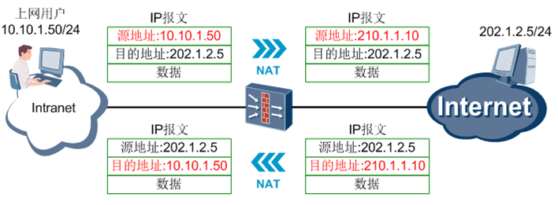

在介绍各种源NAT功能的特点和异同前，先介绍一下“NAT地址池”。NAT地址池是一个虚拟的概念，它形象地把“公网IP地址的集合”比喻成一个“放IP地址的池子或容器”，防火墙在应用源NAT功能时就是从地址池中挑选出一个公网IP，然后对私网IP进行转换。**挑选哪个公网IP是随机的，和配置时的顺序、IP大小等因素都没有关系**。

例1 创建一个NAT地址池（以eNSP中的USG5500系列为例）
```bash
nat address-group 1 202.169.1.2 202.169.1.5
```
下面通过一个例子来说明地址池的使用方法。如下图所示，内网用户群（10.10.2.1-10.10.2.10）最初都在一个区域内，有两个公网IP（210.1.1.10和210.1.1.11）可用于做NAT转换，由于无需对这些用户进行区分，所以可将2个公网IP放在同一地址池内。上网流量到达防火墙后，将从地址池中随机选取一个公网IP做NAT转换。

网络运行一段时间后，需要对用户进行区分，使用户群1（10.10.2.1-10.10.2.5）和用户群2（10.10.2.6-10.10.2.10）以不同的公网IP上网。由于NAT转换是随机选取公网IP的，所以2个公网IP在同一地址池内是无法满足此要求的。此时可将2个公网IP分别放在不同的地址池内，并指定用户群1使用地址池1做NAT转换，用户群2使用地址池2做NAT转换。这样，两个用户群做NAT转换后的IP就是不同的了。

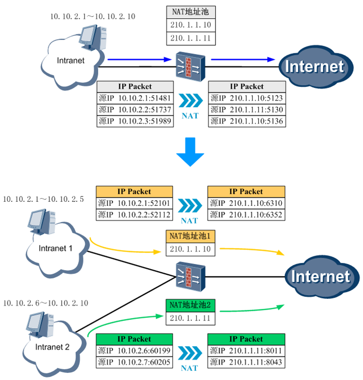

华为防火墙支持的源NAT功能如下表所示，且听强叔一一道来他们的特点和异同。

| 源NAT类型                                 | 私网IP和公网IP的数量对应关系 | 是否转换端口            |
| ----------------------------------------- | ---------------------------- | ----------------------- |
| NAT No-PAT                                | 一对一                       | 否                      |
| NAPT                                      | 多对一                       | 多对多                  | 是 |
| 出接口地址方式（easy-ip）                 | 多对一                       | 是                      |
| Smart NAT（仅高端防火墙USG9000系列支持）  | 一对一（预留IP做多对一转换） | 否 （预留IP做端口转换） |
| 三元组NAT （仅高端防火墙USG9000系列支持） | 多对一 多对多                | 是                      |

### NAT No-PAT
“No-PAT”表示不进行端口转换，所以NAT No-PAT只转换IP地址，故也称为“一对一IP地址转换”。我们使用如下组网进行演示：


在FW上配置源NAT模式，选择为no-pat；将公网IP地址202.30.1.1和202.30.1.2加入NAT地址池1；配置NAT策略，即对流量设置各种要求项，只有完全匹配上这些要求的流量才能利用NAT地址池1中的IP做NAT转换（**如果要针对源IP设置NAT策略，那么应该是做源NAT转换前的IP**）。

例2 配置NAT No-PAT
```bash
# 
nat address-group 1 202.30.1.1 202.30.1.2
#
nat-policy interzone trust untrust outbound
policy 1
action source-nat
policy source 192.168.0.0 0.0.0.255
address-group 1 no-pat  # 使用地址池1做NAT No-PAT转换    
```
这里强叔要强调两个配置：**安全策略和黑洞路由**。

安全策略和NAT策略在字面上长的挺像，但是二者各司其职：**安全策略检验是否允许流量通过，NAT策略检验是否对流量进行NAT转换**。由于防火墙检验流量是否符合安全策略的操作发生在检查NAT策略之前，所以如果**要针对源IP设置安全策略，则该IP应该是做源NAT转换前的IP**。

例三 配置安全策略
```bash
policy interzone trust untrust outbound
policy 1
action permit
policy source 192.168.0.0 0.0.0.255
```
黑洞路由是一个让路由“有来无回”的路由，它的效果就是让设备丢弃命中该路由的报文。针对地址池中的公网IP必须配置黑洞路由，目的是防止产生路由环路。

例四 配置黑洞路由
```bash
ip route-static 202.30.1.1 255.255.255.255 NULL0
ip route-static 202.30.1.2 255.255.255.255 NULL0
```
从PC1上ping PC2，在FW上查看会话表和Server-map表。

从会话表中可以看到PC1（`192.168.0.2`）的IP进行了NAT转换（**中括号[]内的是NAT转换后的IP和端口**），而端口没有转换。

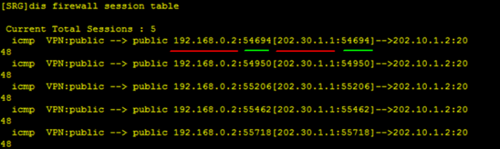

从Server-map表中可以看到NAT类型是No-PAT、NAT转换前后的IP地址，由于端口没有转换，所以并没有显示端口信息。这里可以注意到正、反向Server-map表中的目的IP均为any，也就是说只要Server-map表没有老化，理论上任何外网主机只要知道NAT转换后的IP，都可以主动访问内网主机的公网IP。

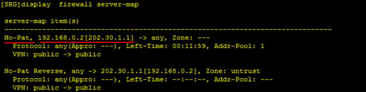

我们再从PC1上ping Server 2，在FW再上查看会话表和Server-map表。各位发现了吗？做NAT转换后的公网IP还是202.30.1.1，而不是202.30.1.2。这说明：**做源NAT时，虽然选择哪个公网IP是随机的，但是这个公网IP由私网源IP决定，和目的IP无关。** 只要私网源IP不变、地址池相关配置不变，同一个私网源IP就会固定的转换为同一个公网IP。

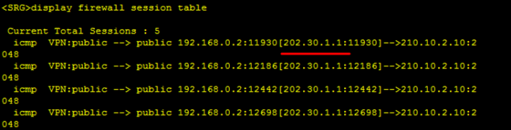

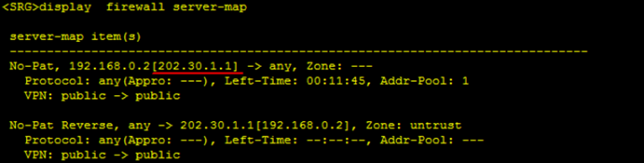

### NAPT
NAPT表示网络地址端口转换，即同时对IP地址和端口号进行转换，也可称为PAT（PAT不是只转换端口号的意思，而是IP、端口号同时转换）。NAPT是最常用的源NAT技术之一，他可以实现用少量公网IP满足大量私网用户上网的需求。

NAPT和NAT No-PAT在配置上的区别仅在于选择不同的源NAT模式：NAPT的nat-policy在指定NAT地址池时，不配置命令关键字“no-pat”，其他配置都是类似的。

例五 NAPT和NAT No-PAT配置上的差一点
```bash
nat-policy interzone trust untrust outbound
policy 1
address-group 1   //不配置 no-pat
```
从PC1上ping PC2，在FW上查看会话表。可以看到源IP和源端口都做了NAT转换，而且端口号是顺序转换的。

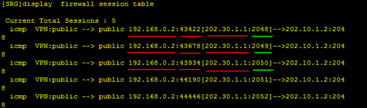

再看Server-map表，没有显示信息？没错，NAPT就是没有Server-map表！原因其实很好理解，NAPT主要用于让大量用户上网，如果每个连接都建立Server-map表，则会占用大量的设备资源。


从PC1上ping Server 2，在FW上查看会话表。我们发现NAPT也是由源IP决定转换后的公网IP，且端口顺序转换。端口从2048开始转换的现象说明：对于不同的连接来说， NAT处理过程是彼此独立的。只要五元组不完全相同，就不用担心NAT转换冲突的问题（对于现在的网络通信来说，五元组完全一致的情况发生概率非常小）。

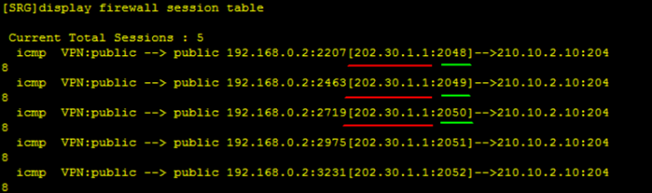

### 出接口地址方式（easy-ip）
出接口地址方式是利用出接口的公网IP做源NAT转换，适用于公网IP非常少或接口动态获取IP的场景（**仅中低端防火墙支持接口动态获取IP**）。

easy-ip的NAT转换方式和NAPT一样，都是同时转换IP和端口。但是在具体配置上，高端防火墙和中低端防火墙是不一样的：

- 高端防火墙需要配置NAT地址池，并将出接口IP配置在地址池中。实际上就是配置NAPT功能，只不过出接口IP和NAT地址池中的IP一样了。
- 中低端防火墙不需要配置NAT地址池，而是在NAT策略中指定做easy-ip转换。


我们使用如下组网进行演示。easy-ip无需配置NAT地址池，只需在NAT策略中指定利用哪个接口做easy-ip。安全策略的配置可以参考上面的NAT No-PAT，easy-ip不用配置黑洞路由。

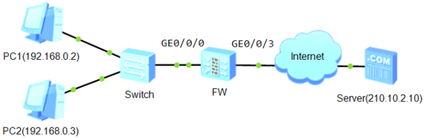

例6 配置easy-ip
```bash
#
nat-policy interzone trust untrust outbound
policy 1 
action source-nat 
source-address 192.168.0.0 0.0.0.255                
easy-ip GigabitEthernet0/0/3     //源NAT转换后的公网IP为接口GE0/0/3的IP  
```
分别从PC1和PC2上ping Server，查看到会话表如下所示（部分PC1的会话已老化，GE0/0/3的IP是210.10.2.1/24）。可以看到源IP和端口都做了NAT转换，且转换后的端口是顺序增大的。这说明：虽然源IP不同，但是NAT转换都走同一个流程，所以端口号顺序增大。此外，和NAPT一样，easy-ip也是没有Server-map表的

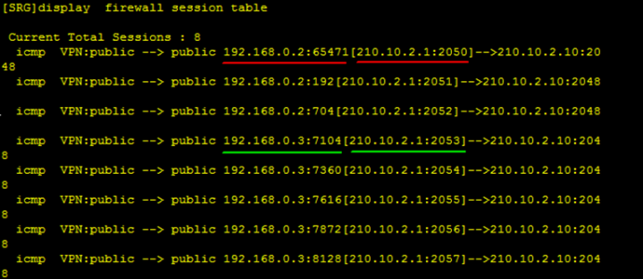

### Smart Nat
Smart NAT为何称为“聪明的NAT”？这要从他和NAT No-PAT、NAPT的关联性说起：

我们假设Smart NAT使用的地址池中包含N个IP，其中一个IP被指定为预留地址，另外N-1个地址构成地址段1（section 1）。进行NAT转换时，Smart NAT会先使用section 1做NAT No-PAT类型的转换，当section 1中的IP都被占用后，才使用预留IP做NAPT类型的转换。

其实Smart NAT可以理解为是对NAT No-PAT功能的增强，他防止了用户数量激增导致大量用户不能上网的情况，即克服了NAT No-PAT的缺点??只能让有限的用户上网，当用户数量大于地址池中IP数量时，后面的用户将无法上网，只能等待公网IP被释放（会话老化）。Smart NAT预留一个公网IP做NAPT后，无论有多少新增用户需要上网，都能满足其需求。
由于eNSP不支持高端防火墙，所以我们通过一个实际的组网来看下Smart NAT的实现过程。

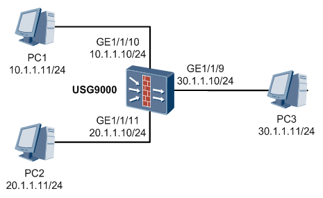

Smart NAT的配置和NAT No-PAT的配置几乎完全一致，区别只是在地址池中指定了一个IP作为预留IP，下面给出关键配置：

例一  配置 Smart NAT
```bash
# 
nat address-group 1
node no-pat // 模式要选择  no-pat
smart-nopat 30.1.1.21   // 预留一个IP做NAPT
section 1 30.1.1.20 30.1.1.20  // section中不能包含预留ip
#
policy interzone trust untrust outbound
policy 1
action permit 
policy source 10.1.1.0 0.0.0.255
policy source 20.1.1.0 0.0.0.255

# 
nat-policy interzone trust untrust outbound
policy 1
action source-nat
address-group 1
policy source 10.1.1.0 0.0.0.255
policy source 20.1.1.0 0.0.0.255
```

先从PC2上ping PC3，再从PC1上ping PC3（请注意这个顺序），在USG9000上查看会话表（**中括号[]内的是NAT转换后的IP和端口**）。可以看到PC2（20.1.1.11）只转换了IP，没有转换端口，也就是说做了NAT No-PAT转换。而PC1（10.1.1.11）的IP和端口都进行了转换，且转换后的IP就是预留IP（30.1.1.21），所以说他做了NAPT转换。

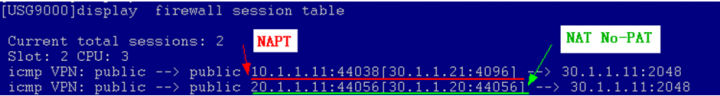

我们再看Server-map表，结果也符合NAT No-PAT和NAPT功能的特点：只有NAT No-PAT类型的表项，NAPT转换没有Server-map表。

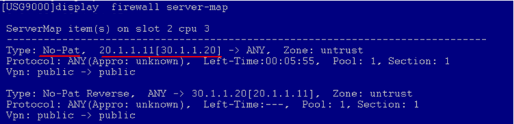

### 三元组 NAT
三元组NAT中的"三元" 是指: 源 ip, 源port和协议类型

三元组NAT功能的产生基于这样一个是实施:现今大部分网络主机都处在NAT设备后, 而P2P应用(如QQ, BT) 是人们最常用的软件之一. 当NAT遇到P2P的时候，产生的不是完美的“NAT-P2P”，而是……你可能下载不了BT资源、无法和女神聊QQ了。T_T
事实上，当有NAT设备存在时，如果要保证内网用户正常使用P2P软件，往往还需要其他网络设备来配合。而华为高端防火墙USG9000系列可以完美地解决这个问题：通过使用三元组NAT功能，防火墙可以在做NAT网关的同时，支持P2P业务的正常交互，完全不需要其他设备！

为了引出三元组NAT的特点，我们先通过下图来看看P2P业务的一般交互流程。PC1和PC2是两台运行P2P业务的客户端，他们运行P2P应用时首先会和P2P服务器进行交互（登录、认证等操作），服务器会记录客户端的地址和端口。当PC2需要下载文件时，服务器会将拥有该文件的客户端的地址和端口发送给PC2（例如PC1的地址和端口），然后PC2会向PC1发送请求，并从PC1上下载文件。

如果PC1是内网主机，在防火墙上做NAT转换，此时P2P服务器记录的就是PC1做NAT转换后的地址和端口。也许有人会问：PC1做NAT转换后的地址和端口不会变化吗？答案是会变化，但是PC1会定期向服务器发送报文（用于认证等），服务器也就记录了最新的NAT后地址和端口，所以可以保证PC2能够成功访问PC1。

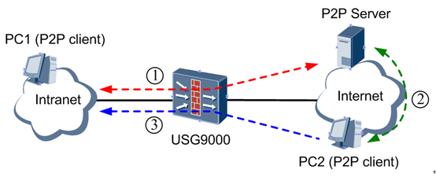

上述过程看起来似乎没有问题，但是对于防火墙来说，这里有两个问题：
1. PC1没有主动访问过PC2，一般来说，防火墙不会允许PC2主动访问PC1。
2. PC1访问服务器时，NAT后的地址和端口只能被服务器用来访问PC1，其他主机（例如PC2）不能利用这个地址和端口访问PC1，请求报文在防火墙上将被丢弃。

三元组NAT可以完美地解决上述两个问题，依靠的正是以下两个特点：
1. 支持外网主动访问
    
    无论内网主机是否主动访问过某个外网主机，只要外网主机知道内网主机NAT转换后的地址和端口，就可以主动向该内网主机发起访问。
2. 动态对外端口一致性
    
    内网主机做NAT转换后的地址和端口将在一段时间内保持不变，在此时间内段，内网主机固定地使用此NAT后地址和端口访问任意外网主机，任意外网主机也可以通过此NAT后地址和端口访问内网主机。

从实现原理角度讲，三元组NAT是通过`Server-map`表使外网主机可以主动访问内网主机，并保证NAT转换关系在一段时间内保持不变。下面通过一个例子来说明会更容易理解（我们还是用实际设备来组网）。

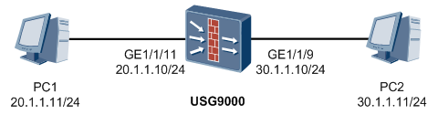

三元组NAT和NAT No-PAT在配置上的区别仅在于选择不同的源NAT模式，下面给出关键配置：

例2 配置三元组NAT
```bash
#
 nat address-group 1 
  mode full-cone global   //做三元组NAT转换，global表示Server-map表不限制域间关系 
  section 1 30.1.1.20 30.1.1.20 
# 
nat-policy interzone trust untrust outbound 
 policy 1
  action source-nat 
  address-group 1  
  policy source 20.1.1.0 0.0.0.255  
```  
从PC1上ping PC2，在会话表中可以看到源IP和端口都做了NAT转换。

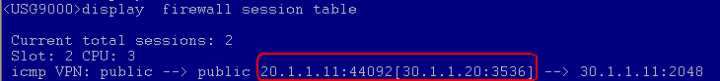

再看Server-map表，可以看到类型是FullCone（全圆锥），即三元组NAT的Serverv-map表（关于FullCone的内容，请见下面的附录内容）。在`Server-map`表没有老化前，三元组的源`Server-map`表项（FullCone Src）作用是：内网主机访问任意外网主机（ANY）时，NAT转换后的地址和端口都是`30.1.1.20:3536`。目的Server-map表项（FullCone Dst）的作用是：任意外网主机（ANY）都可以通过`30.1.1.20:3536`来访问内网主机20.1.1.11。通过这两条Server-map表项即实现了“外网主机可以主动访问内网主机，并保证NAT转换关系在一段时间内保持不变”的要求。

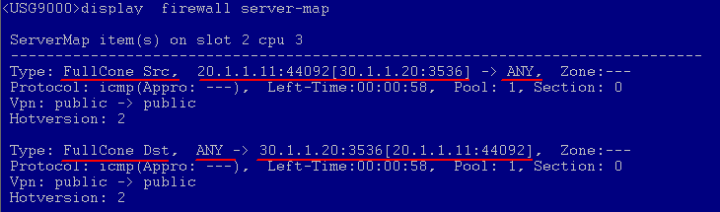


由于实验室环境限制，此处无法通过P2P应用来验证三元组NAT的另一个特点：PC1没有访问过的主机可以通过30.1.1.20:3536主动访问PC1。实际上，如果有一台P2P客户端PC3，他是可以通过30.1.1.20:3536成功访问PC1的。

### 相关名词介绍
Full Cone(全圆锥)是4种NAT端口映射方式中的一种，其他3种分别为：Restricted Cone（受限圆锥）、Port Restricted Cone（端口受限圆锥）和Symmetric（对称型）。


全圆锥NAT的模型是：内网主机做NAT转换后的地址和端口在一段时间内保持不变，不会因为目的地址不同而不同，所以内网主机可以使用相同的NAT后三元组（源IP、源端口、协议）访问不同外网主机。当NAT后三元组确定后，外网主机也都可以通过该三元组访问内网用户。（题外话：之所以叫“全圆锥”，应该就是根据“一对多”的模型命名的吧。）


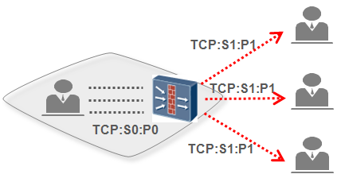

对称型NAT的模型是：内网主机会根据不同的目的地址做NAT转换，NAT转换后的地址和端口一般是不相同的。由于对不同外网主机呈现不同的三元组（源IP、源端口、协议），所以外网主机只能通过访问对应的NAT后三元组才能进入内网，即需要限定目标用户和端口，因此对称型NAT也称为五元组NAT（源IP、源端口、目的IP、目的端口、协议）。
华为防火墙除了支持全圆锥NAT，也支持对称型NAT，NAPT功能即为五元组NAT。

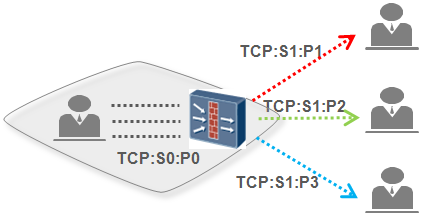

## NAT Server 服务器映射
源NAT是对私网用户访问公网的报文的源地址进行转换，而服务器对公网提供服务时，是公网用户向私网发起访问，方向正好反过来了。于是，NAT转换的目标也由报文的源地址变成了目的地址。针对服务器的地址转换，我们赋予了它一个形象的名字――NAT Server（服务器映射）。

下面来看下防火墙上的NAT Server是如何配置和实现的。

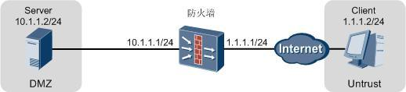

在防火墙上配置如下命令，就能将上图中服务器的私网地址10.1.1.2映射成公网地址1.1.1.1。

```bash
[FW] nat server global 1.1.1.1 inside 10.1.1.2
```
但是，如果一台服务器同时存在多种协议和端口的服务项，按照上述配置会将服务器上所有服务项都发布到公网，这无疑会带来很大的安全风险。华为防火墙支持配置指定协议的NAT Server，只将服务器上特定的服务项对公网发布，从而避免服务项全发布带来的风险。例如，我们可以按如下方式配置，将服务器上80端口的服务项映射为9980端口供公网用户访问。

```bash
[FW] nat server protocol tcp global 1.1.1.1 9980 inside 10.1.1.2 80
```
这里将80端口映射为9980端口,而不是直接映射为80端口是因为, 一些地区的运营商会阻断新增的80,8080,8080端口的业务, 从而导致服务器无法访问


小伙伴们是否还记得《[安全策略篇 ASPF：隐形通道》](http://forum.huawei.com/enterprise/thread-333959.html)中提到的Server-map表，NAT server配置完成之后，也会生成Server-map表来保存映射关系。不过与ASPF Server-map表项的动态老化不同的是，NAT Server的Server-map表项是静态的，只有当NAT Server配置被删除时，对应的Server-map表项才会被删除。


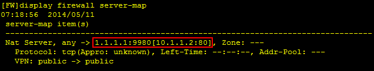

上图就是NAT Server的Server-map表项。图中红框标注的字段就记录着服务器私网地址端口和公网地址端口的映射关系。`[]` 内为服务器私网地址和端口、`[]`外为服务器公网地址和端口。我们将表项翻译成文字就是：任意客户端（any）向（->）1.1.1.1:9980发起访问时，报文的目的地址和端口都会被转换成10.1.1.2:80。具体的流程如下：

当客户端通过1.1.1.1:9980访问服务器时，防火墙收到报文的首包后，首先是查找并匹配到Server-map表项，将报文的目的地址和端口转换为10.1.1.2:80。然后根据目的地址判断出报文在哪两个安全区域间流动，报文通过域间安全策略检查后，防火墙会建立如下的会话表，并将报文转发到私网。


之后，服务器对客户端的请求做出响应。响应报文到达防火墙后匹配到上面的会话表，防火墙将报文的源地址和端口转换为1.1.1.1:9980，而后发送至公网。后续客户端继续发送给服务器的报文，防火墙都会直接根据会话表对其进行地址和端口转换，而不会再去查找Server-map表项了。

在防火墙的前后抓包，能很清楚地看到NAT Server的效果：

A、转换客户端发往服务器的报文的目的地址和端口。


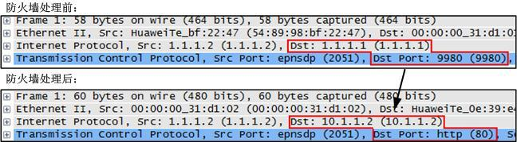

B、转换服务器响应客户端的报文的源地址和端口


## NAT Server
### 一正一反，出入自如
所谓入，是指公网用户访问私网服务器；所谓出，是指私网服务器主动访问公网。下面强叔就要向大家展示下防火墙配置NAT Server后，如何做到公网用户和私网服务器之间的出入自如。以下内容继续围绕基础篇中的组网和配置来展开。

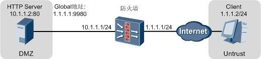

```bash
[FW] nat server protocol tcp global 1.1.1.1 9980 inside 10.1.1.2 80
```
在基础篇中强叔展示给大家的Server-map表项其实还隐藏了一部分，完整的表项应该是这样的：

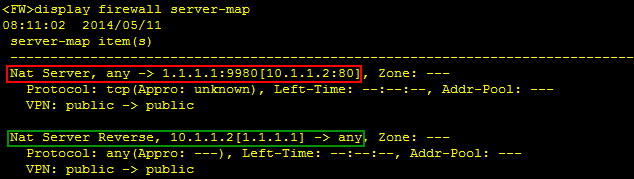

`Nat Server, any -> 1.1.1.1:9980[10.1.1.2:80]`为正向Server-map表项，其作用为入。在公网用户访问服务器时对报文的目的地址做转换。

`Nat Server Reverse, 10.1.1.2[1.1.1.1] -> any`为反向Server-map表项，其作用为出。当私网服务器主动访问公网时，可以直接使用这个表项将报文的源地址由私网地址转换为公网地址，而不用再单独为服务器配置源NAT策略。这就是防火墙NAT Server做的非常贴心的地方了，一条命令同时打通了私网服务器和公网之间出入两个方向的**地址转换**通道。

请注意强叔此处的用词，通道前面加上了“地址转换”四个字。没错，不论是正向还是反向Server-map表项，都仅能实现地址转换而已，并不能像ASPF的Server-map表项一样打开一个可以绕过安全策略检查的临时通道。因此，公网用户要能访问私网服务器或者服务器要能访问公网，还需要配置正确的域间安全策略。

### 去反存正，自断出路
顾名思义，去反存正就是删除反向Server-map表项。配置NAT Server时带上no-reverse参数就能让生成的Server-map表项只有正向没有反向。

```bash
[FW] nat server protocol tcp global 1.1.1.1 9980 inside 10.1.1.2 80 no-reverse     
```

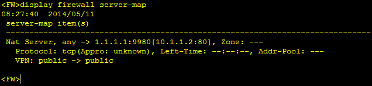

没有了反向Server-map表项，也就相当于断去了服务器到公网的出路。那何时需要自断出路呢？首先，让我们来看看下面这个案例。

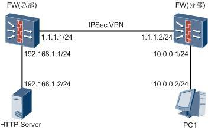

上图中总部有一台服务器需要提供给公网用户访问，于是在总部防火墙上配置了如下的NAT Server：
```bash
[FW] nat server protocol tcp global 1.1.1.1 9980 inside 192.168.1.2 80                     
```
同时，总部和分支之间通过IPSec VPN实现互访。总部防火墙IPSec的部分配置如下：
```bash
#                                      
acl number 3000      //*定义需要进行IPSec封装的数据流*//   
rule 5 permit ip source 192.168.1.0 0.0.0.255 destination 10.0.0.0 0.0.0.255  
#                                      
ipsec policy map1 10 manual  
 security acl 3000    //*引用acl，只有符合acl3000的数据流才会被送入IPSec隧道封装*// 
 proposal tran1
 …    
```
因为总部192.168.1.0/24网段员工需要访问公网，所以还配置了如下的源NAT策略：
```bash
#                                      
nat-policy interzone trust untrust outbound 
  policy 5 
  action source-nat 
  policy source 192.168.1.0 mask 24 
  easy-ip GigabitEthernet0/0/1  
```
不过仅配置这条源NAT策略是不够的。因为这条源NAT策略会将trust区域中192.168.1.0/24网段发往untrust区域的所有报文的源地址都转换成GE0/0/1接口的地址1.1.1.1。熟悉IPSec的小伙伴们应该知道，报文源地址如果变成了1.1.1.1，就不会匹配到ACL 3000，也就不会进入IPSec隧道进行封装，这样总部就别想通过IPSec VPN和分部之间通信了。所以，除了上面这条源NAT策略，还需要配置一条对总部访问分部的流量不做源地址转换的NAT策略，具体如下：
```bash
# 
nat-policy interzone trust untrust outbound 
  policy 0 
  action no-nat
  policy source 192.168.1.0 mask 24   
  policy destination 10.0.0.0 mask 24  
```
注意：上面两条源NAT策略，policy0的匹配条件要比policy5更加严格，所以配置完成后需要确认策略列表中policy0在policy5之上。否则报文匹配到条件宽松的policy5后就直接做了源地址转换，而不会再匹配到policy0了。

配置完成后，我们发现了一个很奇怪的现象：分部的员工可以访问总部服务器的私网地址192.168.1.2，总部192.168.1.0/24网段的员工也能正常和分部的10.0.0.0/24网段通信。但总部的服务器却无法访问分部10.0.0.0/24网段的资源，删除NAT Server配置后就能正常访问。

很明显，问题就出在NAT Server上，但因为总部的服务器需要提供给公网用户访问，我们不能随意将NAT Server配置去掉，那该如何解决这个问题呢？下面就让强叔来给小伙伴们分析下根因所在并给出解决办法。

总部Server ping分部PC时，总部的防火墙上可以看到这样一条会话：
```bash
<FW> display firewall session table source inside 192.168.1.2 
  icmp  VPN:public --> public 192.168.1.2:512[1.1.1.1:512]-->10.0.0.2:2048 
```
可以看出，防火墙将报文的源地址由192.168.1.2转变成了1.1.1.1。但我们明明已经配置了一条对192.168.1.0/24网段发往10.0.0.0/24网段的报文不做源地址转换的NAT策略啊，为什么源地址还是被转换了呢？

我们先使用`display nat-policy all`命令来查看和确认下源NAT策略的命中情况：

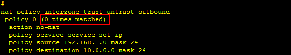

结果显示，确实没有报文命中源NAT策略。

接下来，让我们取消NAT Server的配置，再次从总部Server ping分部的PC1，并查看源NAT策略的命中情况。这时你会发现，有报文命中源NAT策略了！

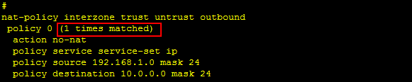

所以，肯定是配置NAT Server时引入的什么东东先把地址给转换了，导致匹配不到源NAT策略。说到这里，再联想下真言的前八个字，相信小伙伴们已经知道问题所在了吧。没错，幕后的“黑手”正是NAT Server生成反向Server-map表项：
```bash
Nat Server Reverse, 192.168.1.2[1.1.1.1] -> any, Zone: ---                              
```
防火墙的报文处理流程中，**反向Server-map表项是比源NAT策略优先匹配的**，报文匹配到反向Server-map表项后，源地址被转换为1.1.1.1。这样，报文就不再匹配源NAT策略了。

找到问题的根因所在，解决办法也就有了。配置NAT Server时加上`no-reverse`参数，不生成反向Server-map表项就可以了。
```bash
[FW] nat server protocol tcp global 1.1.1.1 9980 inside 192.168.1.2 80 no-reverse           
```
当然，`no-reverse`参数不仅限于这个场景中使用，后面我们还会提到它。小伙伴们只需要记住配置了这个参数后，就不会生成反向Server-map表项这一结论，再根据遇到的具体问题灵活运用即可。

### 一分为二，源进源回
防火墙作为出口网关，双出口、双ISP接入公网时，配置`NAT Server`通常需要一分为二，让一个私网服务器向两个ISP发布两个不同的公网地址供访问。一分为二的方法有两种：

第一种是将接入不同ISP的公网接口规划在不同的安全区域中，配置`NAT Server`时，带上zone参数，使同一个服务器向不同安全区域发布不同的公网地址
```bash
[FW] nat server zone untrust1 protocol tcp global 1.1.1.1 9980 inside 10.1.1.2 80            

[FW] nat server zone untrust2 protocol tcp global 2.2.2.2 9980 inside 10.1.1.2 80  
```


第二种是将接入不同ISP的公网接口规划在同一个安全区域中，配置NAT Server时，带上no-reverse参数，使同一个服务器向同一个安全区域发布两个不同的公网地址。
```bash
[FW] nat server protocol tcp global 1.1.1.1 9980 inside 10.1.1.2 80 no-reverse              

[FW] nat server protocol tcp global 2.2.2.2 9980 inside 10.1.1.2 80 no-reverse  
```

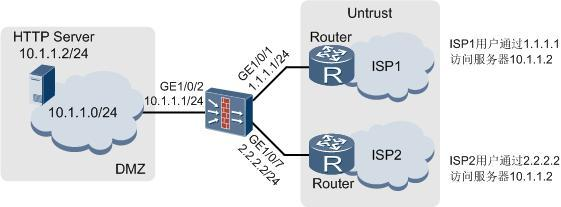

看到这里小伙伴们就要问了，强叔强叔，上一期中你不是讲过no-reverse参数是用来除去反向Server map表项自断出路的吗，这里怎么又用到了呢？莫急莫急，且听强叔给你慢慢道来。

首先，我们来看下不带no-reverse参数直接配置上面两条命令会发生什么？

答案是不带no-reverse参数这两条命令压根就不能同时下发。

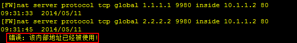

我们再尝试着逆向思考下，假如这两条命令能同时下发，会发生什么？

将上面的两条命令分别在两台防火墙上配置，然后查看各自生成的Server map表项。

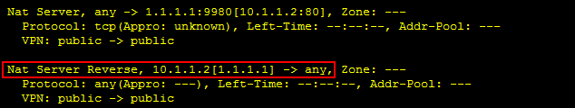

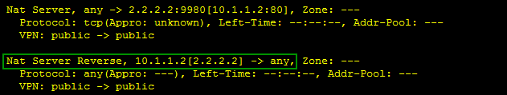

很容易看出来，一台防火墙上的反向Server map表项是将报文的源地址由10.1.1.2转换为1.1.1.1，另一台防火墙上的反向Server map表项是将报文的源地址由10.1.1.2转换为2.2.2.2。试想下，如果这两个反向Server map表项同时出现在一台防火墙上会发生什么？――防火墙既可以将报文的源地址由10.1.1.2转换为1.1.1.1，又可以转换为2.2.2.2。于是乎，防火墙凌乱了~这就是两条命令不带no-reverse参数同时下发会带来的问题。如果配置时带上no-reverse参数，就不会生成反向Server map表项。没有了反向Server map表项，上述的问题也就不复存在了。

此外，一分为二时还会存在报文来回路径不一致的问题。例如，公网用户通过防火墙发布给ISP1的公网地址1.1.1.1访问服务器，服务器的响应报文到达防火墙后，防火墙根据目的地址查找路由表，可能会将响应报文由ISP2发送出去，这样就会导致访问速度过慢或无法访问。

为了避免这个问题，还需要在防火墙上增加一些的配置，保证报文的源进源回，即请求报文从某条路径进入，响应报文依然沿着同样的路径返回。

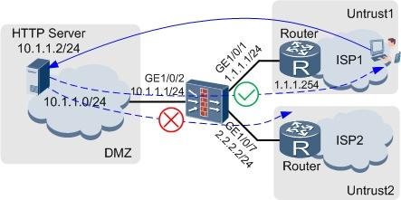

USG9000系列防火墙源进源回功能是通过在公网接口下配置`redirect-reverse`命令来实现的。例如上图中接入ISP1的公网接口GE1/0/1的源进源回功能配置如下：
```bash
[FW] interface GigabitEthernet 1/0/1  
[FW-GigabitEthernet1/0/1] redirect-reverse next-hop 1.1.1.254  
```
配置完成后，如果请求报文从GE1/0/1进入，则响应报文也强制从GE1/0/1发出，而不再是通过查找路由表来确定出接口。


USG2000/5000系列防火墙源进源回功能配置思路与USG9000系列相同，配置命令为`reverse-route next-hop next-hop-address`。

USG6000系列防火墙源进源回功能是通过`reverse-route enable`命令开启后，还需要在接口下使用`gateway`命令配置网关。
```bash
[FW] interface GigabitEthernet 1/0/1 
[FW-GigabitEthernet1/0/1] gateway 1.1.1.254 
[FW-GigabitEthernet1/0/1] reverse-route enable
```

### 虚实变换，合二为一
为了让小伙伴们能明白“虚实”二字的含义，需要大家随着强叔穿越到未来的双机热备站，提前了解一点双机热备的知识。

如下图所示的双机热备组网中，两台防火墙并不是直接使用GE0/0/1接口的实IP地址与公网通信，而是将GE0/0/1接口加入一个VRRP备份组，使用VRRP备份组的虚拟IP地址与公网通信。配置虚拟IP地址的同时，防火墙会自动为其生成一个虚MAC地址。

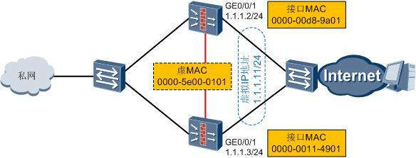

让我们再回到NAT站，强叔这里所说的 “实”指的就是物理接口的实MAC地址，“虚”指的就是虚MAC地址。

明白“虚实”的含义后，接下来强叔就要讲讲“虚实”在对NAT Server配置的影响。

首先，小伙伴们需要知道这样一个结论：当NAT Server公网地址与公网接口的地址在同一个网段时，防火墙会发送NAT Server公网地址的免费ARP请求报文。我们使用如下组网进行演示：

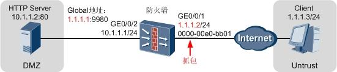

NAT Server的配置如下：
```bash
[FW] nat server protocol tcp global 1.1.1.1 9980 inside 10.1.1.2 80                       
```
在图示处抓包，可以看到防火墙发送的NAT Server公网地址的免费ARP请求报文。报文中携带的1.1.1.1的MAC地址为0000-00e0-bb01，正是公网接口GE0/0/1的MAC地址。

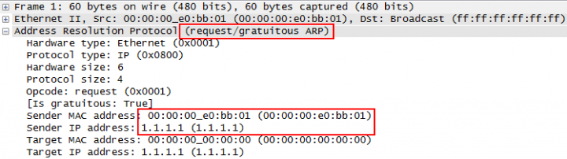

我们在eNSP上模拟了前面的双机热备组网，并在FW1（主设备）上配置了NAT Server：
```bash
[FW1] nat server protocol tcp global 1.1.1.1 9980 inside 10.1.1.2 80
```
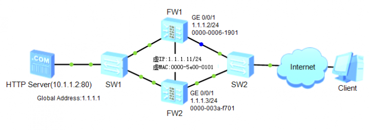

命令一下发，设备就打印如下的IP地址冲突日志：
```bash
2014-05-11 10:02 FW1%%01ARP/4/DUP_IPADDR(l): Receive an ARP packet with 
duplicate ip address 1.1.1.1 from GigabitEthernet0/0/1, source MAC is 0000-003a-f701!
```
日志中显示冲突源的MAC地址为0000-003a-f701，这个正是FW2的GE0/0/1接口的MAC。稍作分析，就能明白为什么会发生IP地址冲突了。

FW1上配置了NAT Server后，由于公网地址为1.1.1.1，和GE0/0/1接口的地址（1.1.1.2/24）在同一个网段，FW1会发送1.1.1.1的免费ARP请求报文。报文中携带的1.1.1.1的MAC地址为GE0/0/1接口的MAC 0000-0006-1901。同时，因为FW1和FW2处于双机热备状态，FW1上NAT Server的配置会同步到FW2上，而FW2 GE0/0/1接口的地址（1.1.1.3/24）和NAT Server公网地址也在同一个网段，这样FW2也会发送1.1.1.1的免费ARP请求报文。报文中携带的1.1.1.1的MAC地址为GE0/0/1接口的MAC 0000-003a-f701。于是，同一广播域中有两个MAC地址对应着同一个IP地址1.1.1.1，产生了IP地址冲突。

同时，由于FW1和FW2同时发送免费ARP请求报文，上行设备学习到的1.1.1.1的MAC也会在0000-0006-1901和0000-003a-f701之间不停的切换。如下图就是Client上查看到的ARP表项。

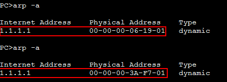

这样，从Client***问1.1.1.1时，Client的网卡会时而用0000-0006-1901来封装报文，时而用0000-003a-f701来封装报文。如果用0000-0006-1901来封装报文，则报文会被发往FW1（主设备），业务访问正常。如果用0000-003a-f701来封装报文，则报文会被发往FW2（备设备）。由于FW2作为备设备时是不处理业务的，报文到达FW2后就会被丢弃。于是就会出现业务时通时不通的情况。

在配置命令中加上`vrrp`关键字就能解决这个问题。我们按如下命令重新配置：
```bash
[FW1] nat server protocol tcp global 1.1.1.1 9980 inside 10.1.1.2 80 vrrp 1      
```           
首先，设备上不再打印IP地址冲突日志了。在防火墙和上行交换机之间抓包我们会发现，只有主用防火墙会发送免费ARP报文，且报文中携带的1.1.1.1的MAC地址变成了0000-5e00-0101，VRRP备份组1的虚MAC地址。Client访问1.1.1.1时，网卡会使用0000-5e00-0101来封装报文。这样就能保证报文永远都是向主用设备转发了。是为虚实变换之间，合二为一也。

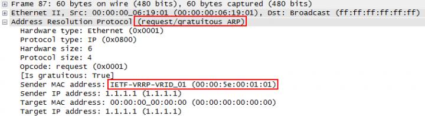

## 双向NAT
如果需要同时改变报文的源地址和目的地址，就可以配置“源NAT+NAT server”，华为防火墙称此类NAT配置为双向NAT。这里要注意：双向NAT不是一个单独的功能，他仅仅是源NAT和NAT Server的组合。这里“组合”的含义是针对同一条流（例如外网主机访问内网服务器的流量），在其经过防火墙时同时转换报文的源地址和目的地址。大家千万不能理解为“防火墙上同时配置了源NAT和NAT Server就是双向NAT”，这是不对的，因为源NAT和NAT Server可能是为不同流配置的。

之前介绍源NAT功能时，强叔为了更利于大家理解相关概念和原理，都是按照内网用户访问外网资源的思路进行组网设计和验证的。实际上，源NAT还可以根据报文的源地址和目的地址所在安全区域进行分类：
### 1. 域间NAT
报文的源地址和目的地址属于不同的安全区域, 按照转换报文的方向,又可以分为以下两类:
####   1. NAT Inbound(外网访问内网)
报文由低安全级别的安全区域向高安全级别的安全区域方向传输时，基于源地址进行的转换。一般来说，NAT Inbound都会和NAT Server配合使用。
####   2. NAT OutBound(内网访问外网)
报文由高安全级别的安全区域向低安全级别的安全区域方向传输时, 基于源地址进行的转换. 之前介绍的 '内网用户访问外网资源'场景大多使用NAT Outbound

### 2. 域内NAT(内网访问内网)
报文的源地址和目的地址属于相同的安全区域。一般来说，域内NAT都会和NAT Server配合使用，单独配置域内NAT的情况较少见

**当域间NAT或域内NAT和NAT Server一起配合使用时，就实现了双向NAT。** 当然，上述内容的一个大前提就是：合理设置安全区域的级别并规划网络――内网设备属于Trust域（高级别），内网服务器属于DMZ域（中级别），外网设备属于Untrust域（低级别）。
双向NAT从技术和实现原理上讲并无特别之处，但是他和应用场景有着强相关性。究竟什么时候需要配置双向NAT？配置后有什么好处？不配置双向NAT行不行？这都是实际规划和部署网络时需要思考的问题，且听强叔一一道来。

#### 1. NAT Inbound + NAT Server
下图示意了一个最常见的场景：外网PC访问内网服务器，防火墙做服务器的网关。这个时候我们一般会用到的NAT技术是…（画外音：“强叔，我知道，是NAT Server！这个场景不就是NAT Server的典型场景吗？”）没错，大家果然认真看了强叔之前的贴子！但是强叔下面要讲的是如何在这个场景中应用双向NAT，以及这么做的好处，大家接着看吧

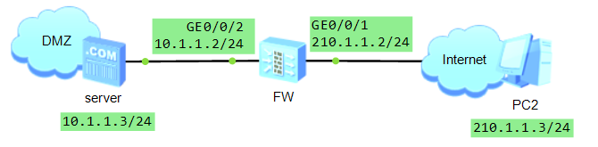

server以公网IP对外提供服务，防火墙上配置NAT Server，这个大家肯定没有疑问。同时，防火墙上配置NAT Inbound，令PC以私网IP访问server，这个大家可能有疑问，别着急，我们先来看看具体配置。
例1 配置NAT Inbound+NAT Server
```bash
#
 nat address-group 1 10.1.1.20 10.1.1.25  //地址池中的IP为私网IP ，且和server的私网IP同网段
 nat server 0 global 210.1.1.15 inside 10.1.1.3
#
nat-policy interzone dmz untrust inbound
 policy 1
  action source-nat
  policy destination 10.1.1.3 0  //由于防火墙先做NAT Server转换，再做源NAT转换，所以此处的目的IP是NAT Server转换后的IP
  address-group 1
```
这里NAT Server的配置和以前见过的类似，但是源NAT的配置和以前见过的不一样：以前地址池中配置的都是公网地址，而这次配置的却是私网地址。
我们通过下图再来看一下报文的地址转换过程：PC访问server的流量经过防火墙时，目的地址（server的公网地址）通过NAT Server转换为私网地址，源地址（PC的公网地址）通过NAT Inbound也转换为私网地址，且和server的私网地址同网段，这样就同时转换了报文的源地址和目的地址，即完成了双向NAT转换。当server的回应报文经过防火墙时，再次做双向NAT转换，报文的源地址和目的地址均转换为公网地址。

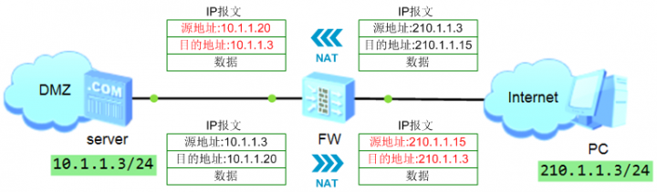

从PC上ping server，通过防火墙上的会话表和Server-map表可以更清楚的看到双向NAT转换：PC的地址通过NAT Inbound转换为私网地址，而server的地址也按照NAT Server的Server-map表转换为私网地址。

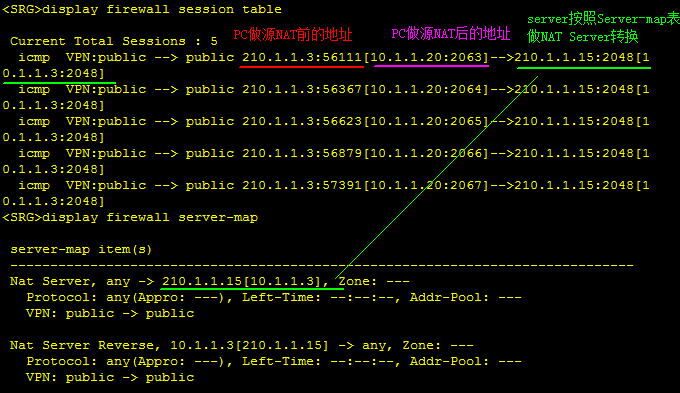

好了，我们回过头来看为什么要配置NAT Inbound吧。如果不配置NAT Inbound，行不行？行！不配置NAT Inbound并不影响PC访问server。那配置NAT Inbound有什么好处？好处就是**server上可以不用设置网关**，当然，前提条件是地址池中的地址需要和server的私网地址同网段。当server回应PC时，server发现自己的地址和目的地址在同一网段，这时server就不会去查路由，而是发送ARP广播报文询问目的地址对应的MAC地址。由于目的地址是地址池中的地址，所以他没有对应的MAC地址，但是防火墙此时挺身而出，防火墙将自己与server直连接口的MAC地址发给server，告诉server“把回应报文给我吧”，所以回应报文将转发到防火墙上。由于server回应报文是通过二层转发，而不是三层转发，所以server上不用配置网关。也许有人说“配置网关还是挺方便的，不用配置NAT Inbound这么麻烦吧”如果只有一台服务器时，的确感受不到有什么好处，但是如果有几十台甚至上百台服务器需要配置或修改网关时，我们就会发现配置NAT Inbound是多么方便了。
如果对之前的组网做一点改变，增加一个Trust区域，该域内的PC2要访问server时，我们该如何配置双向NAT呢？和之前相比，报文的源地址所在安全域发生了变化，原来是Untrust域到DMZ域的报文（Inbound方向），现在变成了Trust域到DMZ域的报文（Outbound方向），所以双向NAT也变化为NAT Outbound+NAT Server，它的转换原理和NAT Inbound+NAT Server完全一样，只不过源NAT的转换方向发生了改变而已。


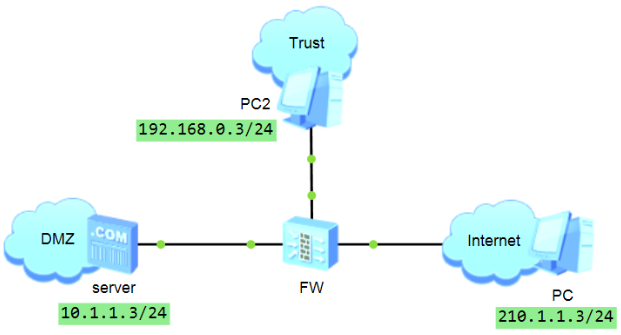


#### 2. 域内NAT + NAT Server
域内NAT的场景多见于小型网络, 如下图中的PC和server 通过交换机与防火墙相连, 管理员在规划网络时 "偷懒",将PC和server 置于同一安全区域, 并分配相同网段地址

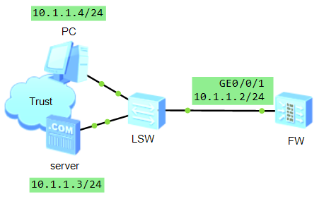

此时，如果希望PC像外网用户一样通过公网地址访问server，就要在防火墙上配置NAT Server。到此就配置完了吗？我们通过下图来看看吧：如果只配置了NAT Server，报文到达防火墙后转换目的地址，server回应报文时发现自己的地址和目的地址在同一网段，这就和之前分析的组网是同样情况了――server通过二层转发报文，回应报文经交换机直接转发到PC，不会经过防火墙转发！

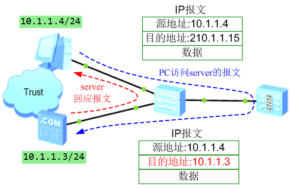

所以，如果希望提高内网的安全性，让回应报文也经过防火墙，就需要配置域内NAT。下面列出了关键的配置步骤。地址池中的地址可以是公网地址，也可以是私网地址，关键是不能和server的私网地址在同一网段。域内NAT的配置和域间NAT几乎完全一样，只不过前者应用在域内做NAT转换，后者应用在域间做NAT转换。

例2 配置域内NAT+NAT Server
```bash
#
 nat address-group 1 210.1.1.20 210.1.1.20
 nat server 0 global 210.1.1.15 inside 10.1.1.3
#
nat-policy zone trust  //注意是域内NAT
 policy 1
  action source-nat
  policy destination 10.1.1.3 0  //此处的目的IP是NAT Server转换后的IP
  address-group 1
```
从PC上ping server，通过防火墙上的会话表和Server-map表可以看到：PC的地址通过域内NAT转换为公网地址，server的地址按照NAT Server的Server-map表转换为私网地址。双向NAT转换后，server回复报文时发现自己的地址和目的地址不在同一网段，此时就需要查路由，通过三层转发报文，所以回应报文需经过防火墙转发。

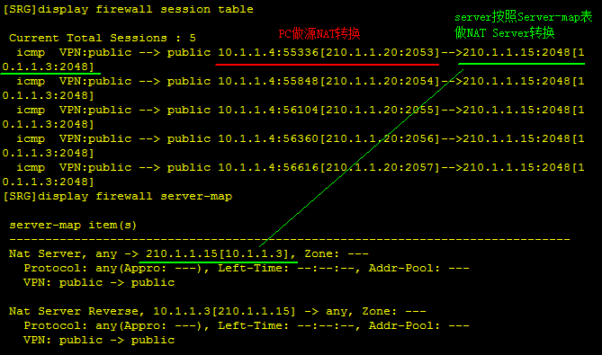

如果在上面组网的基础上做一个变化，将PC和server分开，通过不同的接口和防火墙相连，此时应该如何配置双向NAT呢？在这个组网中所有报文都需要经过防火墙转发，只配置NAT Server是可以的。如果要配置双向NAT，那么就是域内NAT+NAT Server，具体配置方法和上面是类似的，此处就不再介绍了。

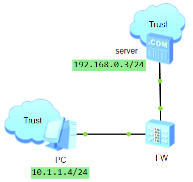

其实双向NAT的原理和配置并不复杂，关键是要想明白NAT转换的方向和转换后地址的作用，而不要纠结于转换后是公网地址还是私网地址。双向NAT并不是必配的功能，有时只配置源NAT或NAT Server就可以达到同样的效果，但是灵活应用双向NAT可以起到简化网络配置、方便网络管理的作用，也就达到了一加一大于二的效果！