## 双机备份
### 1. 双机部署提升网络可靠性
如左下图所示，防火墙部署在企业网络出口处，内外网之间的业务都会通过防火墙转发。如果防火墙出现故障，便会导致内外网之间的业务全部中断。由此可见，在这种网络关键位置上如果只使用一台设备的话，无论其可靠性多高，我们都必然要承受因设备单点故障而导致网络中断的风险。于是，我们在网络架构设计时，通常会在网络的关键位置部署两台（双机）或多台设备，以提升网络的可靠性。如右下图所示，当一台防火墙出现故障时，流量会通过另外一台防火墙所在的链路转发，保证内外网之间业务正常运行。

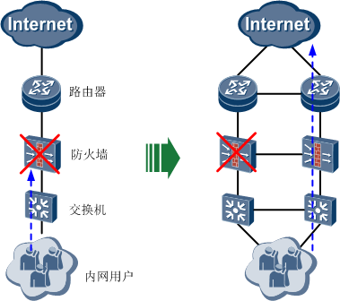

### 2. 路由器的双机部署只需考虑路由备份
如果是传统的网络转发设备（如路由器、三层交换机），只需要在两台设备上做好路由的备份就可以保证业务的可靠性。因为普通的路由器、交换机不会记录报文的交互状态和应用层信息，只是根据路由表进行报文转发，下面举个例子来说明。

如下图所示，两台路由器R1和R2与上下行设备R3和R4之间运行OSPF协议。正常情况下，由于以太网接口的缺省OSPF Cost值为1，所以在R3上看R1所在链路（R3―>R1―>R4―>FTP服务器）的Cost值为3。而由于我们在R2链路（R3―>R2―>R4―>FTP服务器）的各接口上将OSPF Cost值设置为10，所以在R3上看R2所在链路的Cost值为21。由于流量只会通过Cost值小的链路转发，所以FTP客户端与服务器间的业务就都只会通过R1转发。

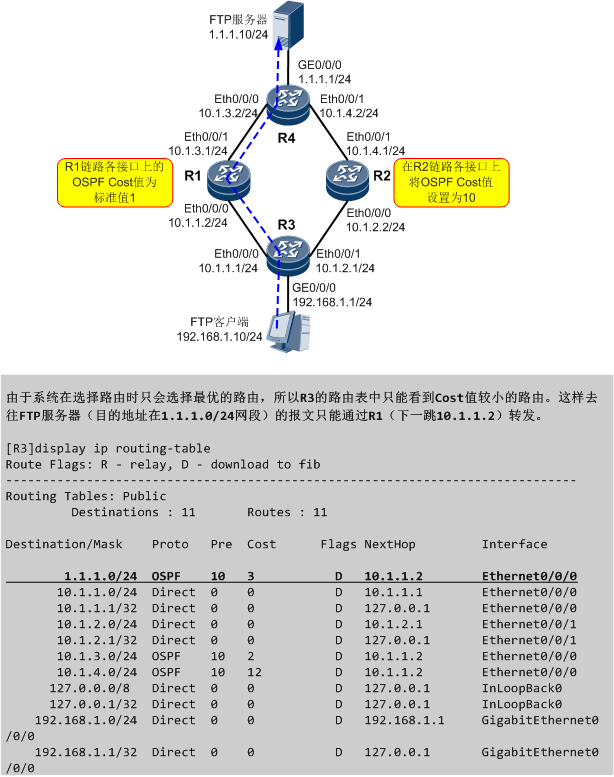

如下图所示，当R1出现故障时，R1所在链路Cost值变成无穷大，而在R3上看R2所在链路Cost值仍为21。这时网络的路由会重新收敛，流量会根据新的路由被转发到R2，所以R2会接替R1处理业务。业务从R1切换到R2的时间就是网络的路由收敛时间。如果路由收敛时间较短，则正在传输的业务不会中断。


### 3. 防火墙的双机部署还需考虑会话备份
如果将传统网络转发设备换成状态检测防火墙，情况就大不一样了。回忆一下强叔在“状态检测和会话机制”中讲到的内容：状态检测防火墙是基于连接状态的，他会对一条流量的首包（第一个报文）进行完整的检测，并建立会话来记录报文的状态信息（包括报文的源IP、源端口、目的IP、目的端口、协议等）。而这条流量的后续报文只有匹配会话才能够通过防火墙并且完成报文转发，**如果后续报文不能匹配会话则会被防火墙丢弃**。

下面举个例子来说明, 两台防火墙FW1和FW2部署在网络中, 与上下行设备R1和R2之间运行OSPF协议. 如左下图所示，正常情况下，由于FW1所在链路的OSPF Cost值较小，所以业务报文都会根据路由通过FW1转发（原理同前面的路由器的例子）。**这时FW1上会建立会话，业务的后续报文都能够匹配会话并转发**。

如右下图所示，当FW1出现故障时，业务会被上下行设备上的路由信息引导到FW2上（原理同前面的路由器的例子）。但由于FW2上没有会话，**业务报文因为找不到会话而被FW2丢弃，从而导致业务中断。** 这时用户需要重新发起访问请求（例如重新进行FTP下载），触发FW2重新建立会话，这样用户的业务才能继续进行。

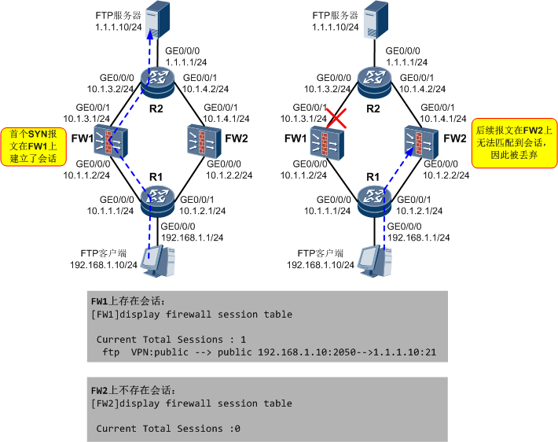

#### 4. 双机热备出手不凡，解决防火墙会话备份问题
那么如何解决两台防火墙会话备份的问题，使两台防火墙主备状态切换时，保证已经建立的业务不中断呢？这时防火墙双机热备功能就该出手相助了！

如坐下图所示, 防火墙双机热备功能最大的特点在于提供一条专门的 **备份通道(也称为心跳线),** 用于两台防火墙之间协商主备状态, 以及备份会话, Server-map表等重要的状态信息和配置信息. 双机热备功能启动后, 正常情况下, 两台防火墙会根据管理员的配置分别称为主用设备和备用设备. 成为**主用设备**的防火墙FW1会处理业务，并将设备上的会话、Server-map表等重要状态信息以及配置信息通过备份通道实时同步给**备用设备**FW2。成为备用设备的防火墙FW2不会处理业务，只是通过备份通道接收来自主用设备FW1的状态信息以及配置信息。

如右下图所示，当主用设备FW1发生故障时，两台防火墙会利用备份通道交互报文，重新协商主备状态。这时FW2会协商成为新的主用设备，处理业务；而FW1会协商成为备用设备，不处理业务。与此同时，业务流量也会被上下行设备的路由信息引导到新的主用设备FW2上。由于FW2在作为备用设备时已经备份了主用设备上的会话和配置等信息，因此业务报文就能够顺利的匹配到会话从而被正常转发。

以上两点就保证了备用设备FW2能够成功接替原主用设备FW1处理业务流量，成为新的主用设备，避免了网络业务中断。

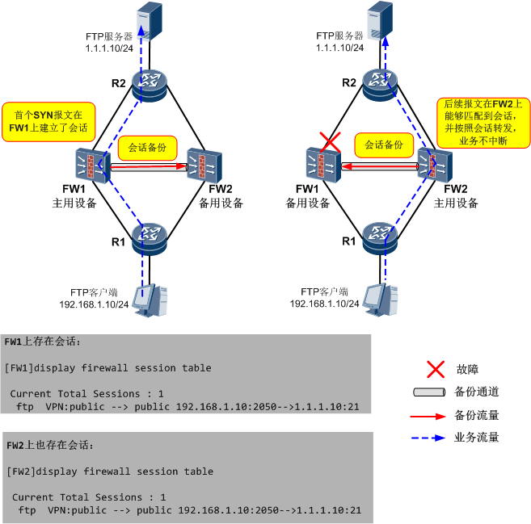

上面介绍的是**主备备份**方式的双机热备。在主备备份场景中，正常情况下备用设备不处理业务流量，处于闲置状态。如果小伙伴们不希望买来的设备闲置，或者只一台设备处理流量时压力较大，可以选择**负载分担**方式的双机热备。

如左下图所示, 在**负载分担**场景下, 两台防火墙均为主用设备, 都建立会话, 都处理业务流量. 同时两台防火墙又都相互作为对方的备用设备，接受对方备份的会话和配置信息。如右下图所示，当其中一台防火墙故障后，另一台防火墙会负责处理全部业务流量。由于这两台防火墙的会话信息是相互备份的，因此全部业务流量的后续报文都能够在其中一台防火墙上匹配到会话从而正常转发，这就避免了网络业务的中断。

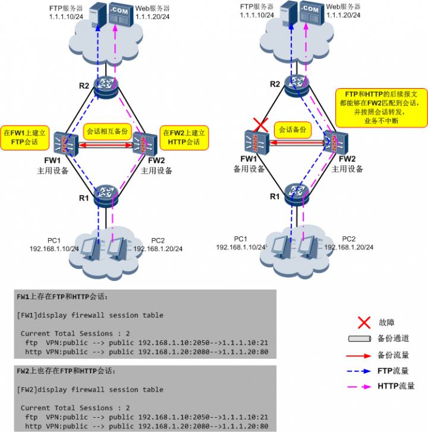

### 5. 总结
最后，强叔再来简单总结下本回所讲的内容。

为了提升网络可靠性，避免单点故障的风险，我们需要在网络关键节点处部署两台网络

设备。如果是路由器和交换机，我们只需要做好路由的备份即可。如果是防火墙，我们还必须在两台防火墙之间备份会话表等状态信息。

防火墙的**双机热备**功能提供一条专门的**备份通道**，用于两台防火墙之间协商主备状态，以及会话等状态信息的备份。双机热备主要包括主备备份和负载分担场景。**主备备份**是指正常情况下仅由主用设备处理业务，备用设备空闲；当主用设备接口、链路或整机故障时，备用设备切换为主用设备，接替主用设备处理业务。**负载分担**也可以称为“互为主备”，即两台设备同时处理业务。当其中一台设备发生故障时，另外一台设备会立即承担其业务，保证原来需要通过这台设备转发的业务不中断。

## VRRP 与 VGMP 的故事
### 1. VRRP的来龙去脉
在上期讲的路由器或防火墙可靠性组网（双机热备）中，流量被引导到主用还是备用设备都是由上下行设备的路由表决定的。这是因为**动态路由可以根据链路状态动态调整路由表，自动将流量引导到正确的设备上**。但如果上下行设备运行的是静态路由呢？静态路由可是无法动态调整的啊。

下面我们就来看一个例子：如下图所示，主机将Router设置为默认网关。这样当主机想访问外部网络时，就会先将报文先发送给网关，再由网关传递给外部网络，从而实现主机与外部网络的通信。正常的情况下，主机可以完全信赖网关的工作，但是当网关故障时，主机与外部的通信就会中断。

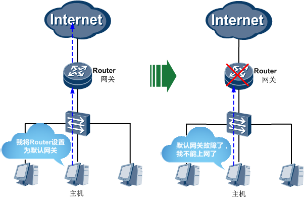

如下图所示，如果想要解决网络中断的问题，我们就需要添加多个网关（Router1和Router2）。但一般情况下主机不能配置动态路由，而且只会配置一个默认网关。如果我们把Router1设置成默认网关，那么当Router1出现故障时，流量无法被自动引导到Router2上。这时只有手工调整主机的默认网关为Router2，才能将主机的流量引导到Router2上。但是这样必然会导致主机访问外网的流量中断一段时间，从而影响用户业务的正常运行。而且大型网络中的主机是成百上千的，通过手动调整网络实现网关备份显然是不切实际的。

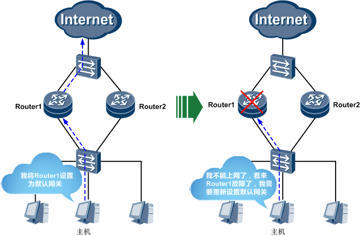

为了更好地解决由于网关故障引起的网络中断问题，网络开发者提出了VRRP协议。**VRRP是一种容错协议，它保证当主机的下一跳路由器（默认网关）出现故障时，由备份路由器自动代替出现故障的路由器完成报文转发任务，从而保持网络通信的连续性和可靠性。**

如下图所示，我们将局域网内的一组路由器（实际上是路由器的下行接口）划分在一起，形成一个VRRP备份组。**VRRP备份组**相当于一台**虚拟路由器**，这个虚拟路由器有自己的**虚拟IP地址和虚拟MAC地址**（格式：00-00-5E-00-01-{VRID}，VRID是VRRP备份组的ID）。所以，局域网内的主机可以将默认网关设置为VRRP备份组的虚拟IP地址。**在局域网内的主机看来，他们就是与虚拟路由器进行通信的**，然后通过虚拟路由器与外部网络进行通信。

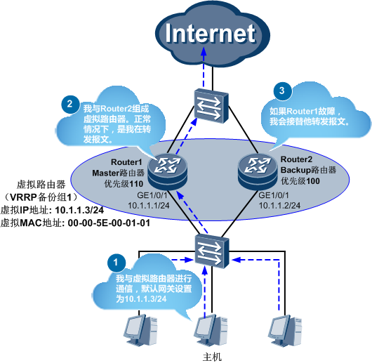

**VRRP备份组中的多个路由器会根据管理员指定的VRRP备份组优先级确定各自的VRRP备份组状态。优先级最高的VRRP备份组状态为Master，其余VRRP备份组状态为Backup。VRRP备份组的状态决定了路由器的主备状态。** VRRP备份组状态为Master的路由器称为**Master路由器**，VRRP备份组状态为Backup的路由器称为**Backup路由器**。当Master路由器正常工作时，局域网内的主机通过Master路由器与外界通信。当Master路由器出现故障时，一台Backup路由器（VRRP优先级次高的）将成为新的Master路由器，接替转发报文的工作，保证网络不中断。

### 2. 图解VRRP工作过程
1. 管理员在路由器上配置完VRRP备份组和优先级后，VRRP备份组会短暂的工作在Initialize状态。当VRRP备份组收到接口Up的消息后，会切换成Backup状态，等待定时器超时后再切换至Master状态。

    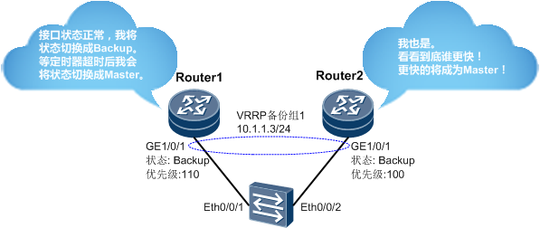

2. 在VRRP备份组的多个路由器中，**率先将VRRP备份组状态切换成Master的路由器将会成为Master路由器。VRRP备份组优先级越高的路由器，他的定时器长越短，越容易成为Master路由器。** 这个根据VRRP备份组优先级确定Master路由器的过程称为Master路由器选举。

    选举成功后，Master路由器会立即周期性（缺省为1秒）地向VRRP备份组中内的所有Backup路由器发送VRRP报文，以通告自己的Master状态和优先级。

    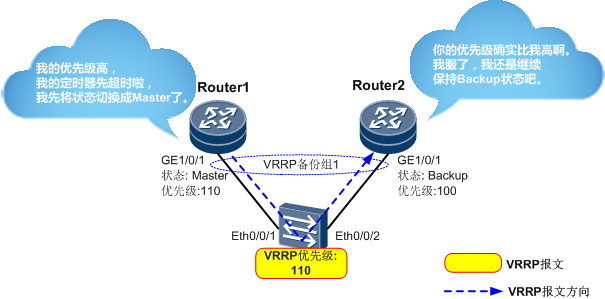

3. 同时Master路由器会发送免费ARP报文，将VRRP备份组的虚拟MAC地址通知给与它连接的交换机。下行的交换机的MAC表项会记录虚拟MAC地址与端口Eth0/0/1的对应关系。

    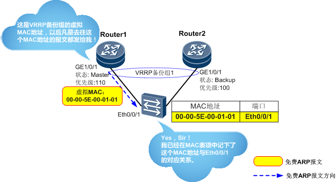

4. 由于内网的PC将网关设置为VRRP备份组1的虚拟IP地址，所以当内网PC访问Internet时，首先会在广播网络中广播ARP报文，请求虚拟IP地址对应的虚拟MAC地址。这时只有Master路由器会回应此ARP报文，将虚拟MAC地址回应给PC。

    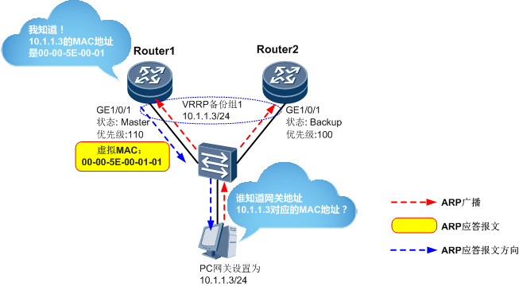

5. PC使用虚拟MAC地址作为目的MAC地址封装报文，然后将其发送至交换机。交换机根据MAC表记录的MAC地址与端口的关系，将PC发送的报文通过端口Eth0/0/1转发给Router1。

    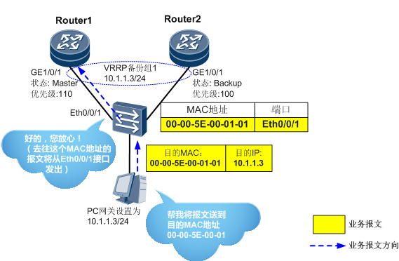

以上讲的是正常情况下，Master路由器和Backup路由器的状态建立和运行过程。下面将介绍Master路由器和Backup路由器的状态切换和运行过程。
1. 当Master路由器发生故障（Router1整机或接口GE1/0/1故障）时，他将无法发送VRRP报文通知Backup路由器。Backup路由器有这样一个机制：如果Backup路由器在定时器超时后仍不能收到Master路由器发送的VRRP报文，则认为Master路由器故障，从而将自身状态切换为Master。

    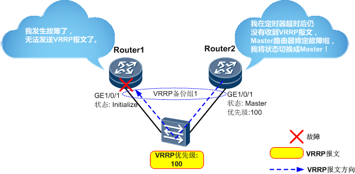

    还有一种情况：当Master路由器主动放弃Master地位（如Master路由器退出VRRP备份组）时，会立即发送优先级为0的VRRP报文，使Backup路由器快速切换成Master路由器。

2. 当VRRP备份组状态切换完成后，新的Master路由器会立即发送携带VRRP备份组虚拟MAC地址和虚拟IP地址信息的免费ARP报文，刷新与它连接的设备（下行交换机）中的MAC表项。下行的交换机的MAC表项会记录虚拟MAC地址与新的端口Eth0/0/2的对应关系。

    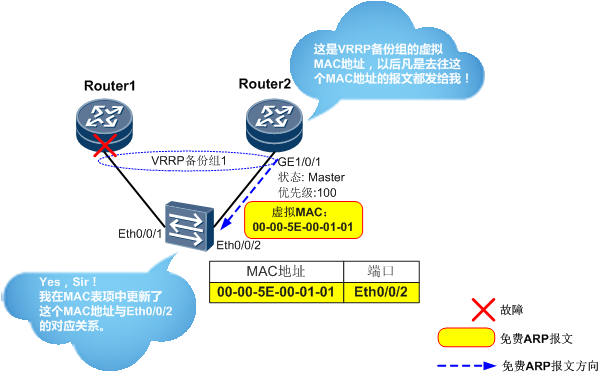

3. 当内网PC将报文发送给交换机后，交换机会将PC发送的报文通过端口Eth0/0/2转发给Router2。这样内网PC的流量就都通过新的Master路由器Router2转发了。这个过程对用户是完全透明的，内网PC感知不到Master路由器已经由Router1切换成Router2。

    

4. 当原Master路由器（现Backup路由器）故障恢复后，优先级会高于现在的Master路由器。这时如果配置了抢占功能，原Master路由器会将状态切换成Master，重新成为Master路由器；如果没有配置抢占功能，原Master路由器将仍然保持Backup状态。

    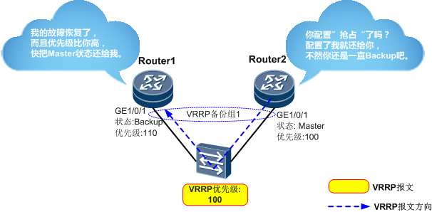

### 3. 多个VRRP状态相互独立产生问题
如下图所示，两台FW（作为内外网用户的网关）的下行接口加入VRRP备份组1，上行接口加入VRRP备份组2。正常情况下，FW1的VRRP备份组1的状态为Active，VRRP备份组2的状态为Active，所以FW1是VRRP备份组1中的Active路由器，也是VRRP备份组2的Active路由器。这样由我们上面讲的VRRP原理可知，内外网之间的业务报文都会通过FW1转发。

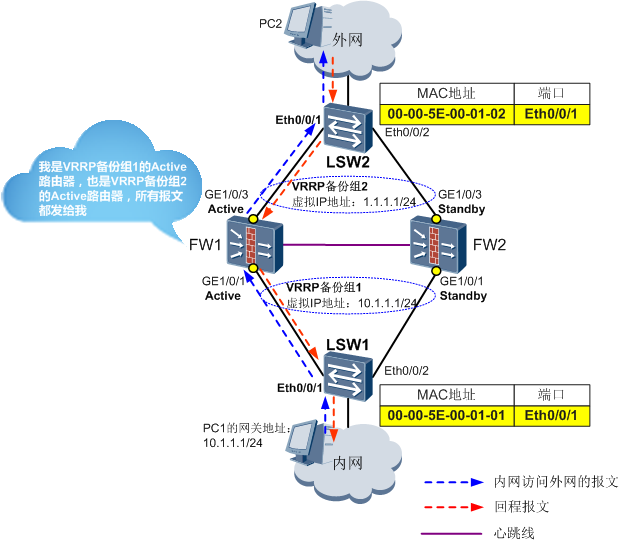

>【强叔问答】上面我们在讲解VRRP时提到的状态都是“Master”和“Standby”，这里为什么都变成“Active”和“Standby”了呢？
>
>答：防火墙在NGFW版本中统一将双机热备（原为“Master”和“Slave”）和VRRP（原为“Master”和“Standby”）的状态修改为“Active”和“Standby”。所以当你在某些文档中看到这些以前的状态请不要奇怪，按本文描述的“Active”和“Standby”理解即可。

如下图所示，当FW1的GE1/0/1接口故障时，VRRP备份组1发生状态切换：FW1的VRRP备份组1状态切换成Initialize，FW2的VRRP备份组1状态切换成Active。这样FW2成为VRRP备份组1中的Active路由器，并向LSW1发送免费ARP报文，刷新LSW1中的MAC表项。这时PC1访问PC2（内网访问外网）的报文就通过FW2转发了。

但是由于FW1与LSW2之间的链路是正常的，所以VRRP备份组2的状态是不变的，FW1仍然是VRRP备份组2中的Active路由器，而FW2仍是VRRP备份组2中的Standby路由器。因此PC2返回给PC1的回程报文依然会转发给FW1，而FW1的下行接口GE1/0/1是故障的，所以FW1只能丢弃此回程报文，这就导致了业务流量的中断。

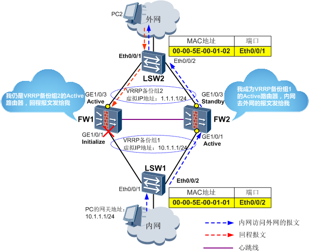

看完这个过程后，聪明的小伙伴们就会发现VRRP问题的所在了：VRRP备份组之间是相互独立的，当一台设备上出现多个VRRP备份组时，他们之间的状态无法同步。

这个问题是VRRP无法适应防火墙的致命因素，既然VRRP自身无法克服这两点，自然会有高手及时登场。一方唱罢，一方登场，这一点上IP江湖跟现实世界没什么不同！

### 4. VGMP的产生解决了VRRP的问题

为了解决多个VRRP备份组状态不一致的问题，华为防火墙引入VGMP（VRRP Group Management Protocol）来实现对VRRP备份组的统一管理，保证多个VRRP备份组状态的一致性。我们将防火墙上的所有VRRP备份组都加入到一个VGMP组中，由VGMP组来集中监控并管理所有的VRRP备份组状态。如果VGMP组检测到其中一个VRRP备份组的状态变化，则VGMP组会控制组中的所有VRRP备份组统一进行状态切换，保证各VRRP备份组状态的一致性。

VGMP 有状态和优先级两个基本属性，并且有三条基本运行原则：

- VGMP的状态决定了组内VRRP备份组的状态，也决定了防火墙的主备状态。
- VGMP组的状态是由两台防火墙的VGMP组通过比较优先级来决定的。优先级高的VGMP组状态为Active，优先级低的VGMP组状态为Standby。
- VGMP组会根据组内VRRP备份组的状态变化来更新自己的优先级。每个VRRP备份组的状态变成Initialize， VGMP组的优先级就会降低2。

了解并熟记了VGMP的基本原则后，下面我们一起来看VGMP如何解决VRRP问题。

如下图所示，我们在FW1上将VRRP备份组1和VRRP备份组2都加入状态为Active的VGMP组，在FW2上将VRRP备份组1和VRRP备份组2都加入状态为Standby的VGMP组。由于VGMP组的状态决定了组内VRRP备份组的状态，所以FW1上VRRP备份组1和2的状态都为Active，FW2上VRRP备份组1和2的状态都为Standby。这样FW1就是VRRP备份组1和VRRP备份组2中的Active路由器（也就是两台防火墙中的主用设备），而FW2就是他们的Standby路由器（也就是两台防火墙中的备用设备），所以上下行的业务流量都会被引导到主用设备FW1转发。

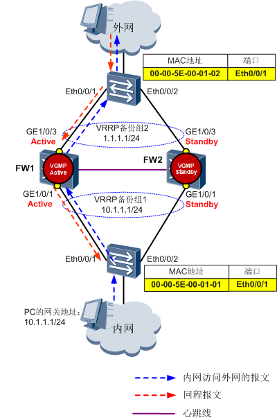

如下图所示，当FW1的接口故障时，VGMP组控制VRRP备份组状态统一切换的过程如下：
1. 当FW1的GE1/0/1接口故障时，FW1上的VRRP备份组1发生状态切换（由Active切换成Initialize）。 
2. FW1的VGMP组感知到这一故障后，会降低自身的优先级，然后与FW2的VGMP组比较优先级，重新协商主备状态。
3. 协商后，FW1的VGMP组状态由Active切换成Standby，FW2的VGMP组状态由Standby切换成Active。
4. 同时，由于VGMP组的状态决定了组内VRRP备份组的状态，所以FW1的VGMP组会强制组内的VRRP备份组2由Active切换成Standby状态，FW2的VGMP组也会强制组内的VRRP备份组1和2由Standby切换成Active状态。

    这样FW2就成为了VRRP备份组1和VRRP备份组2中的Active路由器，也就成了为两台防火墙中的主用设备；而FW1则成为了VRRP备份组1和VRRP备份组2中的Standby路由器，也就成为了两台防火墙中的备用设备。

5. FW2会分别向LSW1和LSW2发送免费ARP，更新他们的MAC转发表，使PC1访问PC2的上行报文和回程报文都转发到FW2。这样就完成了VRRP备份组状态的统一切换，并且保证业务流量不会中断。

    

### 5. 详解VGMP报文结构
看到以上内容大家应该明白，VGMP不仅完成了VRRP备份组的统一管理，还借势取代VRRP接管了对防火墙主备状态的管理权。那么这时问题来了：
- 两台防火墙的VGMP组是如何传递VGMP的优先级信息的？
- 两台防火墙的VGMP组的状态协商和切换过程，以及报文交互过程到底是怎样的呢？

在前面的VRRP图解中讲到两台路由器的VRRP备份组是通过VRRP报文来传递优先级信息的. 那么两台防火墙的VGMP组还是通过VRRP报文和机制来传递优先级信息的吗？这当然不太可能，新的领导自然有新的方法。**两台防火墙的VGMP组是通过VGMP报文来传递优先级信息的。** VGMP是华为的私有协议，他为了实现防火墙双机热备功能对VRRP报文进行了扩展和修改，并衍生出多种使用VGMP报文头封装的报文。理解VGMP报文和报文头是理解VGMP状态协商和切换的基础，所以让我们先看一下VGMP报文的结构。

**说明：本篇所讲到的VGMP报文结构适用于适用于USG2000/5000/6000系列防火墙和USG9000系列防火墙的V1R3版本。**

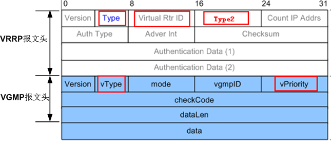

如上图所示, 从VGMP报文封装顺序中我们可以发现, VGMP报文时根植于VRRP报文的, 是由VRRP报文封装的, 但这个VRRP报文并不是标准的VRRP报文, 是经过华为扩展和修改的，具体有以下几点变化：
- 标准VRRP报文的“Type”字段只有“1”一个取值，我们增加了“2”取值。也就是说如果Type=1，就是标准的VRRP报文；如果Type=2，就是我们修改后的VRRP报文。
- 标准VRRP报文的“Virtual Rtr ID”字段代表VRRP备份组ID，而修改后的VRRP报文“Virtual Rtr ID”取值固定为“0”
- 修改后的VRRP报文中去掉了标准VRRP报文的“IP Address”字段。
- 标准VRRP报文中的“Priority”字段在VRRP报文头中被修改成“Type2”字段 。

    - 当Type2=1时，报文封装成**心跳链路探测报文**。心跳链路探测报文用于检测对端设备的心跳口能否正常接收本端设备的报文，以确定是否有心跳口可以使用。
    - 当Type2=5时，报文封装成**一致性检查报文**。一致性检查报文用于检测双机热备状态下的两台防火墙是否配置了相同的策略。
    - **当Type2=2时，VRRP报文才会进一步封装VGMP报文头，并根据VGMP报文头中“vType”字段继续分成以下三种报文：**
        - **VGMP报文（VGMP Hello报文）。VGMP Hello报文用于两台防火墙间的VGMP组协商主备状态。这也正是我们问题的答案所在。**
        - **HRP心跳报文（HRP Hello报文）。** HRP心跳报文用于探测对端设备是否处于工作状态。主用设备会每隔一段时间（缺省为1s）向备用设备发送HRP心跳报文，用来通知主用设备处于工作状态。如果备用设备在三个周期内没有收到HRP心跳报文，则认为主用设备故障，而自身切换成主用设备。
        - **HRP数据报文**。我们还需要在VGMP报文头后继续增加HRP报文头，才能封装成HRP数据报文。HRP数据报文用于主备设备之间的数据备份，包括命令行配置的备份和各种状态信息的备份。

看到这里大家是否会问, 在防火墙双机热备中VRRP报文是用来封装VGMP报文的, 那标准的VRRP报文还存在么, 它还有什么作用? 答案是 **标准VRRP报文仍旧存在，它还是用于VRRP备份组内部通信。只是其中的优先级字段（Priority）已经为固定值，无法配置，所以标准VRRP报文实际上已名存实亡。** 优先级字段失去作用导致标准VRRP报文已经无法控制VRRP备份组的状态选举了，只能在主备防火墙之间通告一下VRRP备份组的状态和虚拟IP地址了。这跟宪政体制下的“皇帝”的作用相似，保留名号，但没有管理国家的权利。而VGMP想要接管防火墙和VRRP备份组的状态管理，就意味着VGMP报文必须中要包含VGMP组优先级信息。我们再看一下VGMP报文头的结构：
- "mode" 字段表示是请求类型报文还是应答类型报文
- "vgmpID"字段表示VGMP组是Active组还是Standby组
- **"Priority" 字段表示VGMP组的优先级**
  - 这点表明VGMP备具备接替标准VRRP报文管理VRRP备份组和防火墙状态的物质基础。

综上所述，VGMP协议修改了标准的VRRP报文并定义好了各种使用VGMP报文头封装的报文，那么这些报文是通过什么渠道在两台防火墙之间传递的呢？上面我们讲到两台防火墙通过备份通道（心跳线）来传递备份数据，可见HRP数据报文是通过备份通道传输的。实际上以上所讲各种报文（除标准VRRP报文），包括**VGMP报文都是通过备份通道传输的**。

另外USG6000系列防火墙和USG2000/5000系列V3R1版本防火墙还支持将以上所讲的各种VGMP和HRP报文（除标准VRRP报文）封装成UDP报文，具体结构如下：


那么只使用VRRP封装的报文和使用UDP封装的报文有什么区别？前者是组播报文，不能跨越网段传输，不受安全策略控制；后者是单播报文，只要路由可达就可以跨越网段传输，但是受安全策略控制。具体点来说就是如果是组播报文，那么两台防火墙的心跳口之间就必须直连或通过二层交换机相连，但是不需要配置安全策略；如果是单播报文，那么两台防火墙的心跳口之间可以通过路由器这种三层设备相连，但是需要配置安全策略允许报文在local区域与心跳口所在安全区域间双向通过。

讲完VGMP的报文结构大家应该能回答“两台防火墙的VGMP组是如何传递VGMP的优先级信息的”这个疑问了吧？答案就是**两台防火墙的VGMP组通过备份通道（心跳线），利用VGMP报文来传递优先级信息**。

### 6. 防火墙VGMP组的缺省情况
如下图所示，每台防火墙提供两个VGMP组：Active组和Standby组。缺省情况下，Active组的优先级为65001，状态为Active；Standby组的优先级为65000，状态为Standby。主备备份情况下，主用设备启用Active组，所有成员（例如VRRP备份组）加入Active组；备用设备启用Standby组，所有成员加入Standby组。负载分担情况下，两台设备都启用Active组和Standby组，每台设备上的所有成员分别加入Active组和Standby组。FW1的Active组和FW2的Standby组形成一组“主备”，FW2的Active组和FW1的Standby组形成一组“主备”，两台防火墙互为“主备”，形成负载分担。

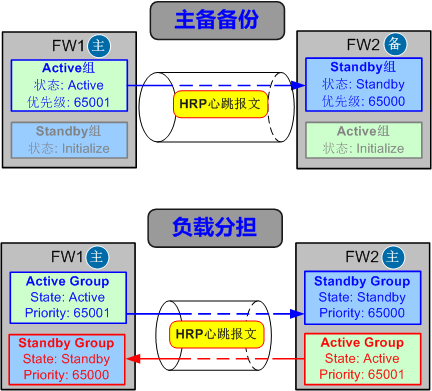

以上讲的是中低端防火墙USG2000/5000/6000系列的情况，由于高端防火墙存在接口板和业务板，所以高端防火墙的缺省优先级与中低端防火墙是不同的：

高端防火墙Master组的缺省优先级=45001+1000×（业务板个数＋接口板个数）。

Slave组的缺省优先级=45000+1000×（业务板个数＋接口板个数）。

**说明：这里说明的高端防火墙优先级算法以USG9000系列V1R3版本为例。而本篇的双机热备配置和状态切换过程以中低防火墙的USG2000/5000/6000系列为例。**

### 7. 主备备份双机热备状态形成过程
主备备份方式的双机热备是目前较常用的双机方式，配置和理解也比较简单，因此我们先从主备备份双机热备状态形成的过程来看

为了让大家能够真实地感受到VRRP和VGMP在防火墙上的存在，我们下面会先给出防火墙主备备份双机热备的配置，然后描述配置完成后双机热备状态形成的过程。

为了实现主备备份方式的双机热备，我们需要在FW1上启用Active组，并将FW1上的VRRP备份组都加入Active组；在FW2上启用Standby组，并将FW2上的VRRP备份组都加入Standby组。实现此操作的命令为`vrrp vrid virtual-router-id virtual-ip virtual-address [ ip-mask | ip-mask-length ] { active | standby }`。这条命令看似简单，但功能很强大，一条命令配置下去两件事轻松搞定：
- 由于是在接口视图下执行这条命令，所示实际上是将接口加入了VRRP备份组，同时指定了虚拟IP地址和掩码。
  
  当接口的IP地址与VRRP备份组的虚拟IP地址不在同一网段时，必须配置虚拟IP地址的掩码。
- **“active | standby”** 参数是将VRRP备份组加入Active或Standby组。

结合下面的图来给出我们建立主备方式双机热备的具体配置，如下表所示：

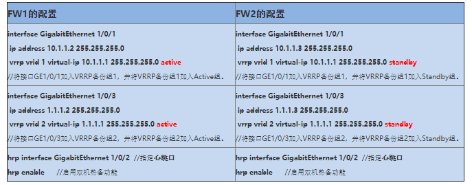

各种VGMP报文和HRP报文都是通过心跳口发送的，心跳口可以说是双机热备的“命脉”，要点多多，务必关注：

- 两台设备的心跳口必须加入相同的安全区域。
- 两台设备的心跳口的接口类型和编号必须相同。例如主用设备的心跳接口为GigabitEthernet 1/0/2，那么备用设备的心跳接口也必须为GigabitEthernet 1/0/2。
- 配置心跳口时如果不添加remote参数，则两台设备的心跳口需要直接相连或通过二层交换机相连，并且不需要配置安全策略。如果配置心跳口时添加remote参数（例如hrp interface GigabitEthernet 1/0/2 remote 10.1.1.2），那么两台设备的心跳口可以通过路由器相连，但是需要配置安全策略。因为不添加remote参数时，心跳口发送的报文是用VRRP报文封装的，是一种组播报文。组播报文不能跨越网段传输，且不受安全策略控制。添加remote参数后，从心跳口发送的各种报文将封装成UDP报文。UDP报文是一种单播报文，只要路由可达就可以跨越网段传输，但需要受到安全策略控制。安全策略的配置方法是允许报文在local区域与心跳口所在安全区域间双向通过。


如上图所示，配置完成后，主备备份方式的双机热备状态形成过程如下（图中序号与下文序号一致）：
1. 双机热备启用之后，FW1的Active组的状态会由Initialize切换成Active，FW2的Standby组的状态由Initialize切换成Standby。
2. 由于FW1的VRRP备份组都加入了Active组，而Active组的初始状态为Active，所以FW1的VRRP备份组1和VRRP备份组2的状态都为Active。同理FW2的VRRP备份组1和VRRP备份组2的状态都为Standby。
3. 这时FW1的VRRP备份组1和2会分别向上行和下行交换机发送免费ARP报文，将VRRP备份组的虚拟MAC地址通知给他们。其中00-00-5E-00-01-01是VRRP备份组1的虚拟MAC地址，00-00-5E-00-01-02是VRRP备份组2的虚拟MAC地址。
4. 上下行的交换机的MAC表项会分别记录虚拟MAC地址与端口Eth0/0/1的对应关系。这样当上下行的业务报文到达交换机后，交换机会将报文转发到FW1上，所以FW1成为了主用设备，FW2成为了备用设备。
5. 同时FW1的Active组还会通过心跳线定时向FW2的Standby组发送HRP心跳报文。

### 8. 主用设备接口故障后的状态切换过程
两台防火墙形成主备备份状态后, 如果主用设备的接口故障, 那么两台防火墙会发生主备状态切换, 具体过程如下:
1. 如下图所所示, 当主用设备的接口GE1/0/1故障后,FW1的VRRP备份组1的状态百年城Initialize.
2. FW1的Active组会感知到这一变化，将自身的优先级降低2（一个接口故障优先级降低2），并将自身状态切换成Active To Standby（图中简写为A To S）。Active To Standby是一种短暂的中间状态，用户是不可见的。
3. FW1的Active组会向对端发送VGMP请求报文，请求将状态切换成Standby。VGMP请求报文是一种VGMP报文，携带本端VGMP组调整后的优先级64999。

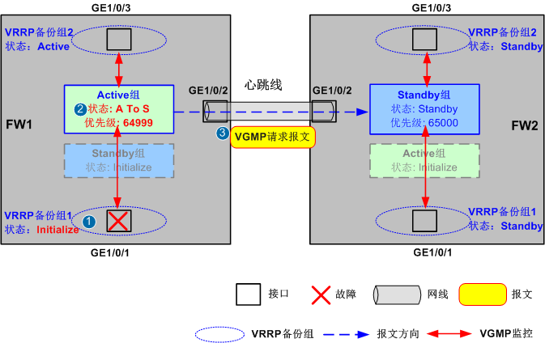

4. 如下图所示，FW2的Standby组收到FW1的Active组的VGMP请求报文后，将会与对端比较VGMP优先级。经过比较后发现本端的优先级65000高于对端的64999，因此FW2的Standby组会将自身状态切换成Active。
5. FW2的Standby组会向对端返回VGMP应答报文，允许对端进行状态切换。
6. 与此同时FW2的Standby组会强制组内的VRRP备份组1和2也将状态切换成Active。
7. FW2的VRRP备份组1和2会分别向下行和上行交换机发送免费ARP报文，更新他们的MAC转发表。

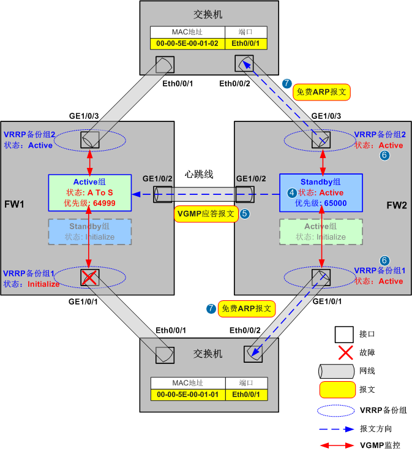

8. 如下图所示，FW1的Active组收到对端的VGMP确认报文后，会将自身状态切换成Standby。
9. FW1的Active组会强制组内的VRRP备份组将状态切换成Standby。由于VRRP备份组1内的接口故障，所以VRRP备份组1的状态为Initialize不变，只有VRRP备份组2的状态切换成Standby。
10. 与此同时，上下行交换机收到FW2的免费ARP报文后会更新MAC表项，记录虚拟MAC地址与端口Eth0/0/2的对应关系。这样当上下行的业务流量到达交换机后，交换机会将流量转发到FW2上。至此两台防火墙的主备状态切换完成，FW2成为新的主用设备，FW1成为新的备用设备。
11. 主备状态切换完成后，新的主用设备FW2会定时向新的备用设备FW1发送心跳报文。

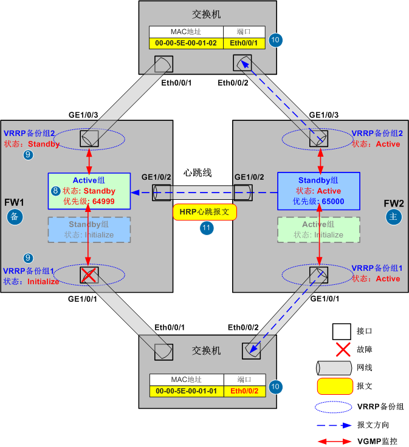

### 9. 主用设备整机故障后的状态切换过程
当主用设备**整机故障**后，主用设备的VGMP组将不会再发送HRP心跳报文。这时如果备用设备的VGMP组连续三次收不到主用设备的HRP心跳报文，那么他就会认定对端的VGMP组故障，从而将自身切换到主用状态。

### 10. 原主用设备故障恢复后的状态切换过程（抢占）
当原主用设备的**故障恢复**后，如果配置了抢占功能，那么原主用设备将重新抢占成为主用设备，具体过程如下文所示。如果没有配置抢占功能，则原主用设备依旧保持备份状态。
1. 如下图所示，原主用设备的接口GE1/0/1故障恢复后，VRRP备份组1的状态由Initialize切换成Standby。
2. FW1的Active组感知到这一变化后，会将自身的优先级升高2（一个接口故障恢复优先级升高2），升高到65001。FW1的Active组会与对端比较VGMP优先级，对端的优先级信息是从对端发送的HRP心跳报文中获取的。经过比较后发现本端的优先级65001高于对端的65000。这时如果配置了抢占功能，则会启动抢占延时。抢占延时结束后，FW1的Active组会将状态由Active To Standby切换成Standby To Active（图中简写为S To A）。Standby To Active是一种短暂的中间状态，用户是不可见的。
3. FW1的Active组会向对端发送VGMP请求报文，请求将状态切换成Active。VGMP请求报文是一种VGMP报文，携带本端VGMP组调整后的优先级65001。

    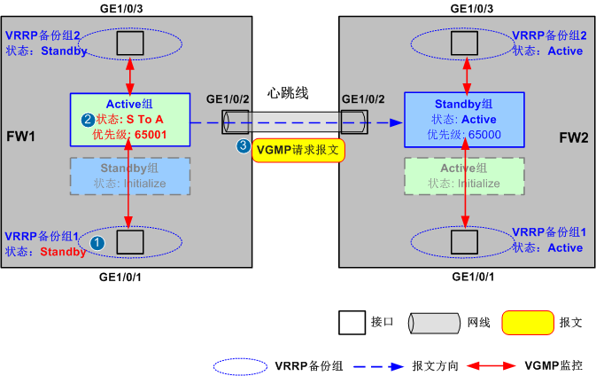

4. 如下图所示，FW2的Standby组收到FW1的Active组的VGMP请求报文后，将会与对端比较VGMP优先级。经过比较后发现本端的优先级65000低于对端的65001，因此FW2的Standby组会将自身状态切换成Standby。
5.  FW2的Standby组会向对端返回VGMP应答报文，允许对端将状态切换成Active。
6.  与此同时FW2的Standby组会强制组内的VRRP备份组1和2也将状态切换成Standby。

    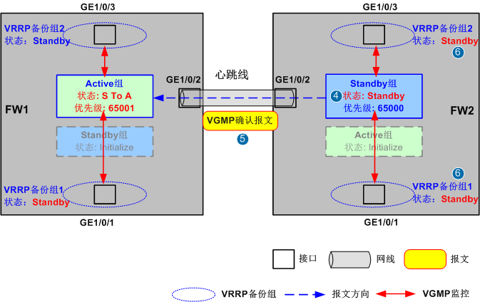

7. 如下图所示，FW1的Active组收到对端的VGMP确认报文后，会将自身状态切换成Active。
8. FW1的Active组会强制组内的VRRP备份组1和2也将状态切换成Active
9. FW1的VRRP备份组1和2会分别向下行和上行交换机发送免费ARP报文，更新他们的MAC转发表。上下行交换机收到免费ARP报文后会更新MAC表项，记录虚拟MAC地址与端口Eth0/0/1的对应关系。这样当上下行的业务报文到达交换机后，交换机会将报文转发到FW1上。至此两台防火墙的主备状态切换完成，FW1重新抢占成为主用设备，而FW2重新成为备用设备。
10. 主备状态切换完成后，主用设备FW1会定时向备用设备FW2发送心跳报文。

    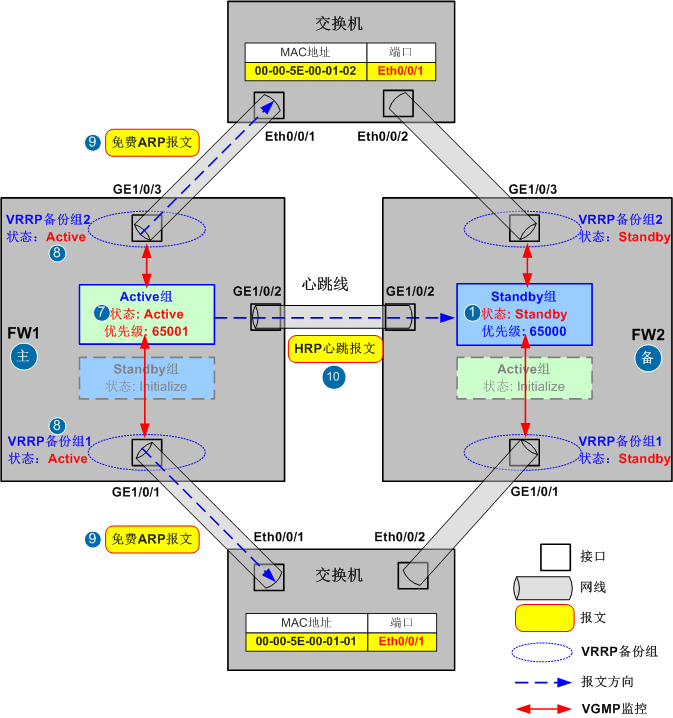

### 11. 负载分担双机热备状态形成和切换过程
以上我们描述的是主备备份方式的双机热备状态形成和切换过程，下面我们来看负载分担状态的情况。

如下图所示，为了实现负载分担方式的双机热备，我们需要在FW1和FW2上都启用Active组和Standby组，使FW1的Active组与FW2的Standby组进行通信，构成一组“主备”，FW2的Active组与FW1的Standby组进行通信，也构成一组“主备”。这样两台FW形成互为主备的状态，也就是负载分担状态。

结合下图给出负载分担方式的双机热备配置，如下表所示：

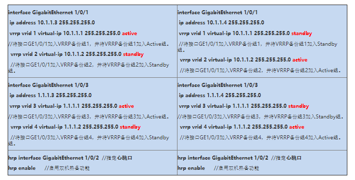

**由上表可以看到**：1、负载分担场景下，每个业务接口需要加入两个VRRP备份组，且这两个VRRP备份组要分别加入Active组和Standby组。例如GE1/0/1接口加入了备份组1和2，备份组1和2 分别加入了Active组和Standby组。2、两台防火墙的相同编号的VRRP备份组需分别加入Active组和Standby组。例如FW1的VRRP备份组1加入了Active组，FW2的VRRP备份组1加入了Standby组。

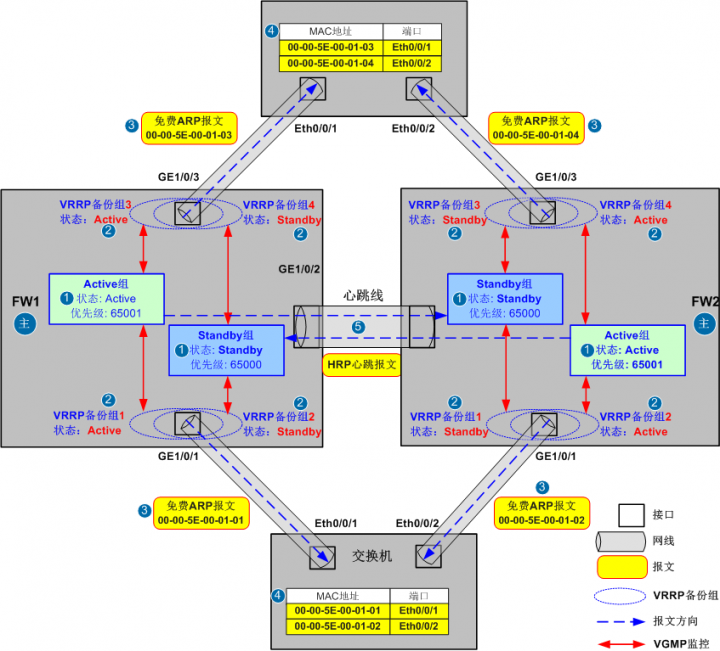

如上图所示，配置完成后，负载分担方式的双机热备状态形成过程如下：
1. FW1和FW2的Active组的状态会由Initialize切换成Active，Standby组的状态由Initialize切换成Standby。
2. 由于FW1的VRRP备份组1和3加入了Active组，而Active组的初始状态为Active，所以FW1的VRRP备份组1和VRRP备份组3的状态都为Active；由于FW1的VRRP备份组2和4加入了Standby组，而Standby组的初始状态为Standby，所以FW1的VRRP备份组2和VRRP备份组4的状态都为Standby；同理FW2的VRRP备份组1和VRRP备份组3的状态都为Standby，VRRP备份组4和VRRP备份组4的状态都为Active。
3. 这时FW1的VRRP备份组1和3会分别向下行和上行交换机发送送免费ARP报文，将VRRP备份组1和3的虚拟MAC地址通知给他们；FW2的VRRP备份组2和4会分别向下行和上行交换机发送送免费ARP报文，将VRRP备份组2和4的虚拟MAC地址通知给他们。
4. 下行交换机的MAC表项会记录VRRP备份组1的虚拟MAC地址（00-00-5E-00-01-01）与端口Eth0/0/1的对应关系，VRRP备份组2的虚拟MAC地址（00-00-5E-00-01-02）与端口端口Eth0/0/2的对应关系。这样当下行交换机下面的设备请求VRRP备份组1的虚拟MAC地址（将VRRP备份组1的虚拟IP设置为下一跳）时，交换机会将业务报文转发到FW1上；而请求VRRP备份组2的虚拟MAC地址（将VRRP备份组2的虚拟IP设置为下一跳）时，交换机会将业务报文转发到FW2上。同理上行交换机上面的设备请求VRRP备份组3的虚拟MAC地址（将VRRP备份组3的虚拟IP设置为下一跳）时，交换机会将业务报文转发到FW1上；而请求VRRP备份组4的虚拟MAC地址（将VRRP备份组4的虚拟IP设置为下一跳）时，交换机会将业务报文转发到FW2上。这样FW1和FW2都会转发业务报文，所以FW1和FW2都是主用设备，形成负载分担状态。
5. 负载分担状态形成后，FW1的Active组会定期向FW2的Standby组发送HRP心跳报文，FW2的Active组会定期向FW1的Standby组发送HRP心跳报文。

两台防火墙形成负载分担方式的双机热备后，如果其中一台防火墙的接口故障，那么他们将切换成主备备份状态，具体过程如下：

1. 如下图所示，当FW1的GE1/0/1接口故障时，FW1的VRRP备份组1和2的状态都会变成Initialize。
2. FW1的Active组与Standby组的优先级都会降低2。这时FW1的Active组的优先级变成64999低于FW2的Standby组的优先级65000， FW2的Standby组的优先级变成64998依旧低于FW2的Active组的优先级65001。这样经过VGMP组之间的状态协商后（具体原理和报文交互请看上面的主备备份方式），FW1的Active组的状态切换成Standby，FW2的Standby组的状态切换成Active。
3. FW1的Active组和FW2的Standby组会强制组内VRRP备份组也进行状态切换，所以FW2的VRRP备份组1和3的状态都切换成Active。
4.  FW2的VRRP备份组1和3会分别向下行和上行交换机发送免费ARP报文，更新他们的MAC转发表。
5.  下行交换机收到免费ARP报文后，会更新自身的MAC转发表，将VRRP备份组1的虚拟MAC地址（00-00-5E-00-01-01）修改成与Eth0/0/2对应。同理上行交换机会将VRRP备份组3的虚拟MAC地址（00-00-5E-00-01-03）修改成与Eth0/0/2对应。这样当上下行的业务报文到达交换机后，交换机会将报文都转发到FW2上。至此双机热备状态切换完成，时FW1成为备用设备，FW2成为主用设备，负载分担状态变成主备备份状态。
6.  负载分担切换成主备备份状态后，主用设备FW2会定时向备用设备FW1发送心跳报文。

    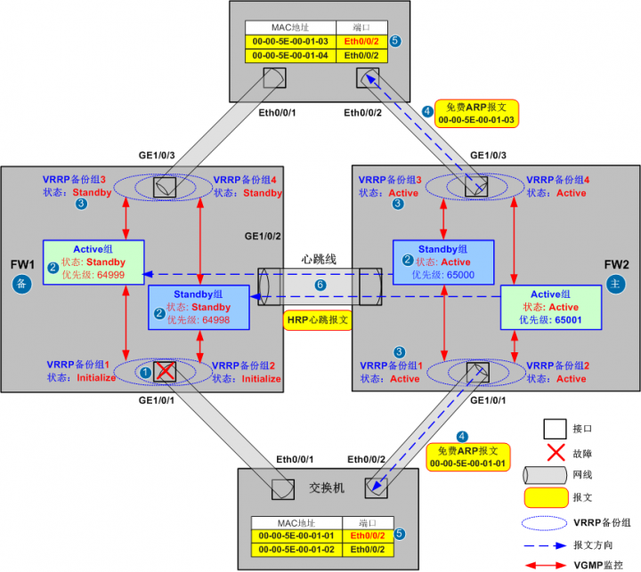

### 12. 总结
上面的内容应该可以完美地回答“两台防火墙的VGMP组的状态协商和切换过程，以及报文交互过程到底是怎样的呢？”这个问题了。 而由上面的例子可以看出，VGMP在双机热备中主要实现以下三个功能：
1. **故障监控**：VGMP组能够监控VRRP备份组状态变化，从而感知到VRRP组内接口的故障和恢复。（私下里嘀咕：VGMP组能不能直接监控接口故障呢，一定要通过VRRP备份组监控接口么？）
2. **状态切换**：VGMP组感知到VRRP备份组状态变化后，会调整自身的优先级，并与对端的VGMP组重新协商主备状态。（私下里嘀咕：这一点比较清楚了，本篇都是在讲状态如何切换和协商的。）
3. **流量引导**：两个VGMP组主备状态建立或者切换后，会强制组内VRRP备份组状态统一切换，然后由状态为Active的VRRP备份组发送免费ARP来引导流量通过自身转发。（私下里嘀咕：如果VGMP组能够直接监控接口的话，流量引导方式也是这样么？）

### 13 附录 VGMP状态机
**说明：本篇的VGMP状态机目前适用于USG2000/5000/6000系列防火墙和USG9000系列防火墙的V1R3版本。**

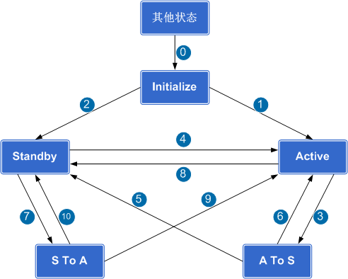

1. 启用双机热备功能后，各VGMP组进入Initialize（初始化）状态。
2. 启用Active组后，Active组的状态由Initialize切换成Active。
3. 启用Standby组后，Standby组的状态由Initialize切换成Standby。
4. 本端VGMP组监控的接口故障时，状态由Active切换成ActiveToStandby，并发送VGMP请求报文给对端设备的VGMP组。
5. 本端VGMP组收到对端的VGMP请求报文，发现自身优先级高，则将状态由Standby切换成Acitve，并发送VGMP确认报文给对端设备的VGMP组。
6. 本端VGMP组收到对端的VGMP确认报文，确认本端需要进行状态切换，则本端的VGMP组状态由ActiveToStandby切换成Standby。
7. 对端VGMP组确认本端的VGMP组不需要进行状态切换或连续三次没有回应本端的VGMP请报文，则本端的VGMP组状态由ActiveToStandby切换成Active。
8. 本端VGMP组监控的接口故障恢复后，如果本端VGMP组优先级高于对端且配置了抢占功能，则本端VGMP组状态由Standby切换成StandbyToAcitve，并向对端发送VGMP请求报文。
9.  本端VGMP组收到对端的VGMP请求报文，发现对端优先级高，则将状态由Active切换成Standby，并发送VGMP确认报文给对端设备的VGMP组。
10. 本端VGMP组收到对端的VGMP确认报文，确认本端需要进行状态切换，则本端的VGMP组状态由StandbyToAcitve切换成Active，完成抢占过程。
11. 对端VGMP组确认本端的VGMP组不需要进行状态切换或连续三次没有回应本端的VGMP请报文，则本端的VGMP组状态由StandbyToAcitve切换成Standby。


## VGMP招式详解
### 1. 防火墙连接路由器时的VGMP招式
如下图所示，两台防火墙上下行业务接口工作在三层，连接路由器。防火墙与路由器之间运行OSPF协议。由于上下行不是二层交换机，所以VGMP组无法使用VRRP备份组。这时VGMP组使用的故障监控招式是直接监控接口状态。方法是直接将接口加入VGMP组。当VGMP组中的接口故障时，VGMP组会直接感知到接口状态变化，从而降低自身的优先级。

VGMP组直接监控接口状态的配置步骤如下（以主备备份方式的双机热备为例）：

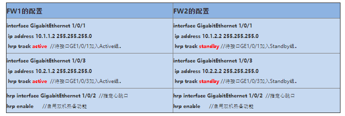

说明：如果是负载分担方式的双机热备，则需要在每个业务接口上执行hrp track active和hrp track standby，将业务接口分别加入Active组和Standby组。

【强叔问答】看到这里好奇的小伙伴们或许会问：不是将接口加入VGMP组，使VGMP组监控接口状态吗？为什么命令行是**hrp track**而不是**vgmp track**呢？这是因为上节讲到VGMP和HRP的报文都是由VRRP头和VGMP头封装的，区别只在于HRP报文还需要再封装一个HRP报文头。所以当初开发者设计命令时就统一使用了hrp这个参数，并流传至今。

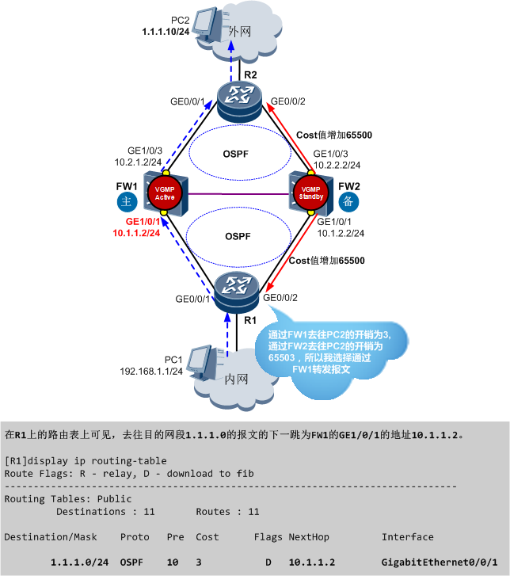

如上图所示，配置完成后，FW1的VGMP组状态为Active，FW1成为主用设备；FW2的VGMP组状态为Standby，FW2成为备用设备。在双机热备的第一篇中讲到，如果我们希望PC1访问PC2的流量通过FW1转发，那么我们就需要手工将FW2所在链路（R1?>FW2?>R2）的OSPF Cost值调大。但是如果上下行的路由器R1或R2我们不方便或不能配置时怎么办呢？这就需要用到防火墙VGMP组的流量引导功能，将流量自动引导到主用设备上来。这种组网采用的VGMP流量引导招式为**通过自动调整Cost值实现流量引导，即防火墙会根据VGMP组的状态自动调整OSPF的Cost值**（命令为`hrp ospf-cost adjust-enable`）。启用此功能后，如果防火墙上存在状态为Active的VGMP组，则防火墙会正常对外发布路由；如果防火墙上的VGMP组状态都为Standby，则防火墙会在发布路由时将Cost值增加65500（此为缺省值，可调整）。

**说明：如果是负载分担组网，由于两台防火墙上都存在状态为Active的VGMP组，所以都会正常对外发布路由。**

如上图所示，主用FW1（VGMP组状态为Active）会正常对外发布路由，备用设备FW2（VGMP组状态为Standby）会在对上下行设备发布路由时将Cost值增加65500。这样在R1上来看，通过FW1去往PC2的OSPF Cost值为1+1+1=3，通过FW2去往PC2的OSPF Cost值为65501+1+1=65503。因为路由器在转发流量时会选择开销（Cost值）更小的路径（R1?>FW1?>R2），所以内网PC1访问外网PC2的流量会通过主用设备FW1转发。

如下图所示，当FW1的业务接口故障后，两台防火墙的VGMP组会进行状态切换，具体切换过程请参见上篇的“主用设备接口故障后的状态切换过程”。状态切换后，FW2的VGMP组状态切换成Active，FW2成为主用设备；FW1的VGMP组状态切换成Standby，FW1成为备用设备。这时FW2正常对外发布路由，FW1发布的路由Cost值增加65500。而在R1上来看，通过FW1去往PC2的路径不通（因为接口故障），通过FW2去往PC2的路径可达且Cost值为3.，所以内网PC1访问外网PC2的流量会通过新的主用设备FW2转发。

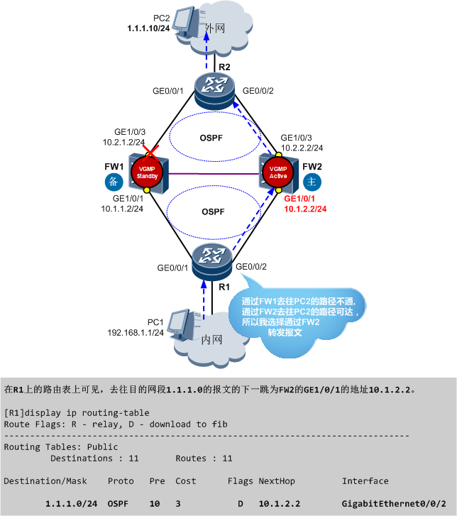

### 2. 防火墙透明接入，连接交换机时的VGMP招式
如下图所示，两台防火墙上下行业务接口都工作在二层，连接交换机。由于防火墙的业务接口工作在二层，没有IP地址，所以VGMP组无法使用VRRP备份组或者直接监控接口的状态。这时VGMP组使用的故障监控招式是**通过VLAN监控接口状态**。方法是将二层业务接口加入VLAN，VGMP组监控VLAN。当VGMP组中的接口故障时，VGMP组会通过VLAN感知到其中接口状态变化，从而降低自身的优先级。

VGMP组通过VLAN监控接口状态的配置步骤如下：

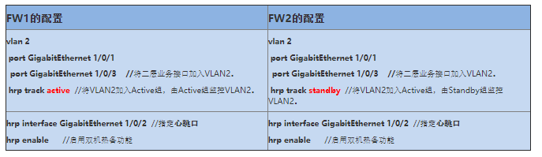


如上图所示, 配置完成后, FW1的VGMP组状态为Active, FW1称为主用设备;FW2的VGMP组状态为Standby，FW2成为备用设备。由于防火墙的业务接口工作在二层，防火墙本身不能运行OSPF协议，因此VGMP组无法通过控制OSPF Cost值的变化来引导上下行流量。这时VGMP可以**通过控制VLAN是否转发流量**的招式来保证流量引导到主用设备上。当VGMP组状态为Active时，组内的VLAN能够转发流量；当VGMP组状态为Standby时，组内的VLAN被禁用，不能转发流量。VGMP控制VLAN是否转发流量不需要单独配置，只需要按照上表将VLAN加入VGMP组即可。

如上图所示，主用设备FW1（VGMP组状态为Active）上的VLAN被启用，能够转发流量。备用设备FW2（VGMP组状态为Standby）上的VLAN被禁用，不能转发流量。因此PC1访问PC2的流量都从主用设备FW1转发。

如下图所示，当FW1的业务接口故障后，两台防火墙的VGMP组会进行状态切换，具体切换过程请参见上篇的“主用设备接口故障后的状态切换过程”。**当FW1的VGMP组状态由Active切换到Standby时，组内VLAN中的所有非故障接口都会Down然后Up一次。这会导致上下行交换机更新自身MAC转发表，将目的MAC地址改成与端口Eth0/0/2的映射，从而将流量引导到FW2上。** 这时由于FW2的VGMP组状态已经由Standby切换成Active，所以FW2的VLAN2能够正常转发流量。

**说明：当防火墙的业务接口工作在二层，连接二层设备时，不支持负载分担方式的双机热备。因为如果工作于负载分担方式，则两台设备上的VLAN都被启用，都能够转发流量，整个网络就会形成环路。**

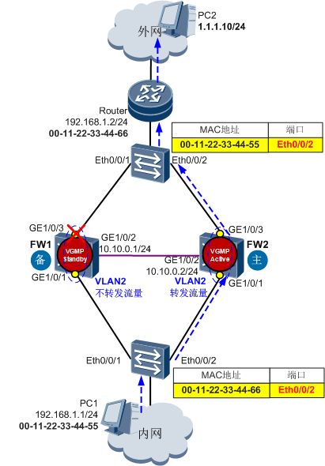

### 3. 防火墙透明接入，连接路由器时的VGMP招式
如下图所示，两台防火墙上下行业务接口都工作在二层，连接路由器。两台路由器之间运行OSPF。在此种组网中防火墙的VGMP组采用的故障监控和流量引导方式与上一种组网相同，即**通过VLAN监控接口状态实现故障监控，通过控制VLAN是否转发流量实现流量引导**。

故障监控的区别之处在于此种组网只支持负载分担方式的双机热备，不支持主备备份方式。因为如果工作于主备备份方式，备用设备上的VLAN被禁用，它的上下行路由器就无法进行通信，无法建立OSPF路由。这样当主备切换时，新的主用设备（原备用设备）的VLAN被启用，它的上下行路由器才开始新建OSPF路由。而OSPF路由的新建是需要一定时间的，所以会导致业务的暂时中断。此组网的双机热备配置步骤如下：

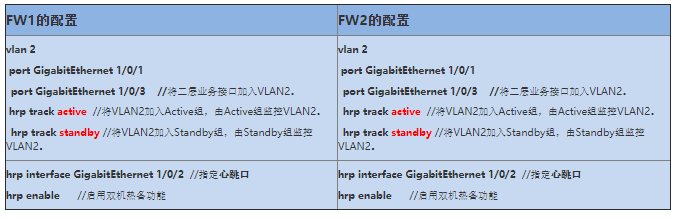

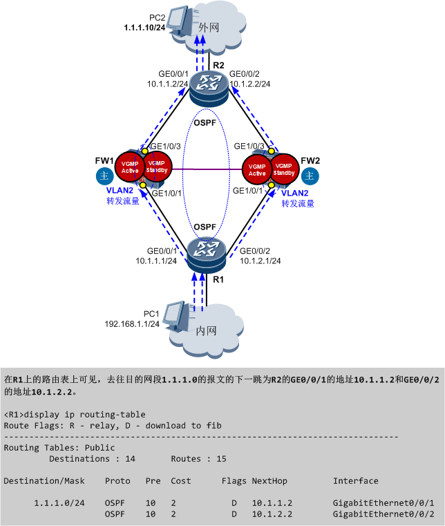

如上图所示，配置完成后，由于FW1和FW2上都存在状态为Active的VGMP组，所以FW1和FW2都是主用设备，他们的VLAN2都转发流量。这时在R1的路由表上也可以看到去往PC2的流量可以分别通过FW1和FW2转发。

如下图所示，当FW1的业务接口故障后，两台防火墙的VGMP组会进行状态切换，双机热备状态也会由负载分担变成主备备份，具体切换过程请参见上篇的“负载分担双机热备状态形成和切换过程”。**当FW1的VGMP组状态由Active切换到Standby时，组内VLAN中的所有接口都会Down然后Up一次。这会导致上下行路由器的路由变化并收敛（从下图的路由表中可以看到），从而将流量引导到FW2上。** 这时由于FW2的VGMP组状态已经由Standby切换成Active，所以FW2的VLAN2能够正常转发流量。

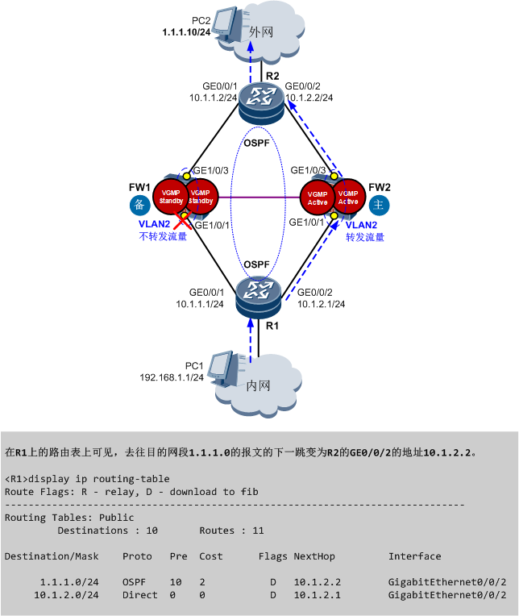

### 4. VGMP组监控远端接口的招式
上面描述的是VGMP组应对各种双机热备组网的招式，其中VGMP组监控的是防火墙本身的接口。下面我们再来学习两个VGMP组监控远端接口的招式。远端接口是指链路上其他设备的接口。需要注意的是这两种VGMP监控远端接口的招式只能用于防火墙业务接口工作在三层的组网，因为只有业务接口工作在三层才有IP地址，才能对远端设备发送IP-Link和BFD的探测报文。

- **通过IP-Link监控远端接口状态**：方法是建立IP-Link探测远端接口， 然后VGMP组监控IP-Link状态。当IP-Link探测的接口故障时，IP-Link的状态变成Down，VGMP组感知到IP-Link的状态变化，从而降低自身的优先级。

    如下图所示，我们需要在FW1上使用IP-Link1探测R1的GE1/0/1接口（非直连的远端接口），然后将IP-Link1加入Active组，由Active组监控IP-Link1的状态。

    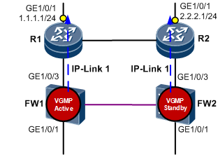

    具体配置如下表所示（配置的前提条件是已配置完成双机热备功能）：

    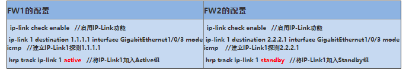

- **通过BFD监控远端接口状态：** 方法是通过BFD探测远端接口， VGMP组监控BFD状态。当BFD探测的远端接口故障时，BFD的状态变成Down，VGMP组感知到BFD的状态变化，从而降低自身的优先级。

    如下图所示，我们需要在**FW1上**使用BFD会话10探测R1的GE1/0/1接口（非直连的远端接口），然后将BFD会话1加入**Active**组，由组监控BFD会话1的状态。

    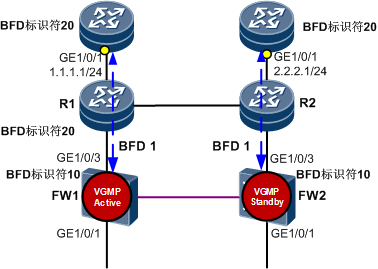

    具体配置如下表所示（配置的前提条件是已配置完成双机热备功能）：

    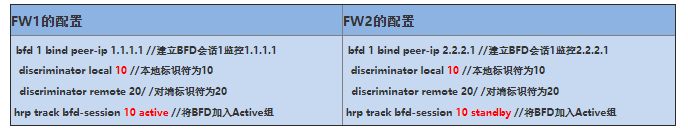


### 5. 总结
综上所述，尽管VGMP组监控和流量引导招式五花八门，但都遵循以下两条准则：
- 每当VGMP组监控的一个接口故障时，无论是直接监控还是间接监控，无论是监控防火墙本身的接口还是远端接口，VGMP组的优先级都会降低2。
- 只有主用设备（VGMP组状态为Active）才会将流量引导到本设备上，备用设备（VGMP组状态为Standby）则是想办法拒绝将流量引导到本设备上。

最后，我们总结下双机热备各种典型组网与VGMP故障监控和流量引导招式的关系，具体如下表所示：

| 双机热备组网                                       | 故障监控招式                                                                       | 流量引导招式                                                                                                                                            |
| -------------------------------------------------- | ---------------------------------------------------------------------------------- | ------------------------------------------------------------------------------------------------------------------------------------------------------- |
| 防火墙业务接口工作在三层, 连接二层交换机(上篇讲到) | 通过VRRP备份组监控接口<br/>通过IP-Link监控接口（可选）<br/>通过BFD监控接口（可选） | 主用设备会向连接的交换机发送免费ARP报文，更新交换机的MAC转发表。                                                                                        |
| 防火墙业务接口工作在三层, 连接路由器               | 直接监控接口<br/>通过IP-Link监控接口（可选）<br/>通过BFD监控接口（可选）           | 主用设备正常对外发布路由，备用设备发布的路由Cost值增加65500。                                                                                           |
| 防火墙业务接口工作在二层(透明模式),连接二层交换机  | 通过VLAN监控接口                                                                   | 主用设备的VLAN能够转发流量，备用设备的VLAN被禁用。当主用设备切换成备用设备时，主用设备的VLAN中的接口会down然后up一次，触发上下行二层设备更新MAC转发表。 |
| 防火墙业务接口工作在二层（透明模式），连接路由器   | 通过VLAN监控接口                                                                   | 主用设备的VLAN能够转发流量，备用设备的VLAN被禁用。当主用设备切换成备用设备时，主用设备的VLAN中的接口会down然后up一次，触发上下行三层设备的路由收敛。    |


## HRP
### 1. 为什么需要HRP？
#### 1.  备份配置命令
防火墙通过执行命令（通过Web配置实际上也是在执行命令）来实现用户所需的各种功能。如果备用设备切换为主用设备前，配置命令没有备份到备用设备，则备用设备无法实现主用设备的相关功能，从而导致业务中断。

如下图所示，主用设备FW1上配置了允许内网用户访问外网的安全策略。如果主用设备FW1上配置的安全策略没有备份到备用设备FW2上，那么当主备状态切换后，新的主用设备FW2将不会允许内网用户访问外网（因为防火墙缺省情况下禁止所有报文通过）。


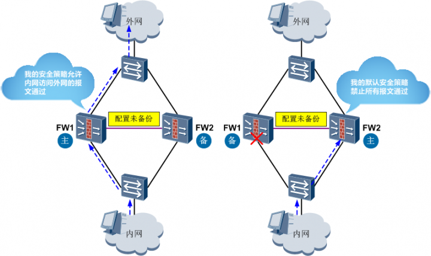

#### 2. 备份会话
防火墙属于状态检测防火墙，对于每一个动态生成的连接，都有一个会话表项与之对应。主用设备处理业务过程中创建了很多动态会话表项；而备用设备没有报文经过，因此没有创建会话表项。如果备用设备切换为主用设备前，会话表项没有备份到备用设备，则会导致后续业务报文无法匹配会话表，从而导致业务中断。

如下图所示，主用设备FW1上创建了PC1访问PC2的会话（源地址为10.1.1.10，目的地址为200.1.1.10），PC1与PC2之间的后续报文会按照此会话转发。如果主用设备FW1上的会话不能备份到备用设备FW2上，那么当主备状态切换后，PC1访问PC2的后续报文在FW2上匹配不到会话。这样就会导致PC1访问PC2的业务中断。

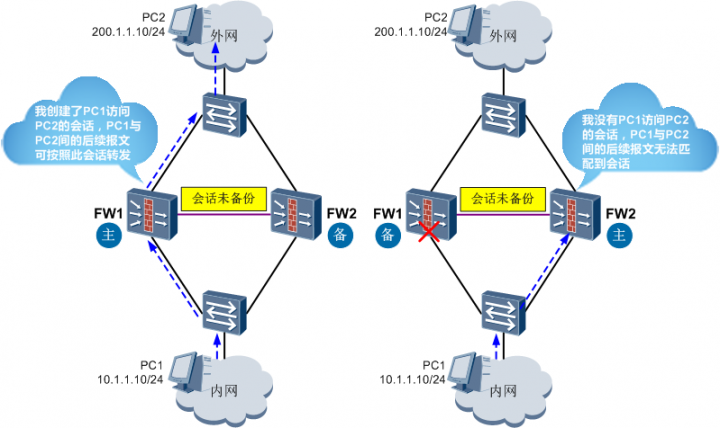

因此为了实现主用设备出现故障时备用设备能平滑地接替工作，必须在主用和备用设备之间备份关键配置命令和会话表等状态信息。为此华为防火墙引入了HRP（ Huawei Redundancy Protocol）协议，实现防火墙双机之间动态状态数据和关键配置命令的备份。

如下图所示，主用设备FW1上配置了允许内网用户访问外网的安全策略，所以FW1会允许内网PC1访问外网PC2的报文通过，并且会建立会话。由于在FW1和FW2上都使用了HRP协议（配置了双机热备中的HRP功能），因此主用设备FW1上配置的安全策略和创建的会话都会备份到备用设备FW2上。这样当主备状态切换后，由于备用设备上已经存在允许内网用户访问外网的安全策略以及PC1访问PC2的会话，所以PC1访问PC2业务报文不会被禁止或中断。

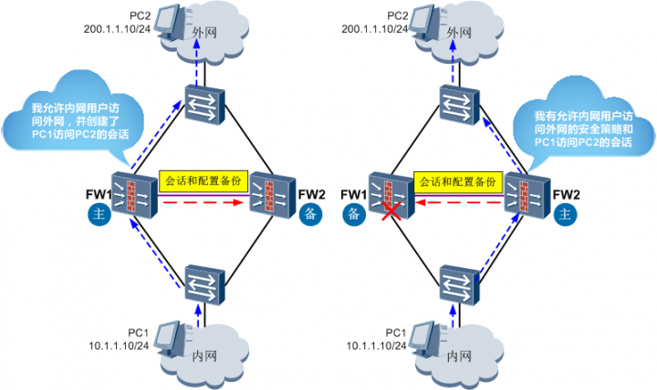

### 2. HRP是如何实现备份的？
防火墙通过心跳口（HRP备份通道）发送和接收HRP数据报文来实现配置和状态信息的备份。如下图所示，HRP数据报文从外到内依次封装了VRRP报文头、VGMP报文头和HRP报文头。其中VRRP报文头中Type=2，Type2=2。VGMP报文头中的“vType”字段对应为“HRP数据报文”的取值。


HRP报文头中的关键参数解释如下：
- Source Module ID和Source Sub Module ID表示本端防火墙哪些特性模块和子模块的数据需要备份。
- Dest Module ID和和Dest Sub Module ID表示需要向对端防火墙的哪些特性模块和子模块备份数据。

HRP数据备份的过程如下图所示：
1. FWA在发送HRP数据报文时，会将ASPF特性模块的ID写入HRP报文头的“Source Module ID”和“Dest Module ID”字段中，并将ASPF模块的配置和表项信息封装到HRP数据报文中。
2. FWA将HRP数据报文通过备份通道（心跳线）发送给FWB。
3. FWB收到HRP数据报文后，会根据HRP报文头中的“Source Module ID”和“Dest Module ID”字段将报文中的配置和表项信息发送到本端的ASPF特性模块，并进行配置与表项的下发。

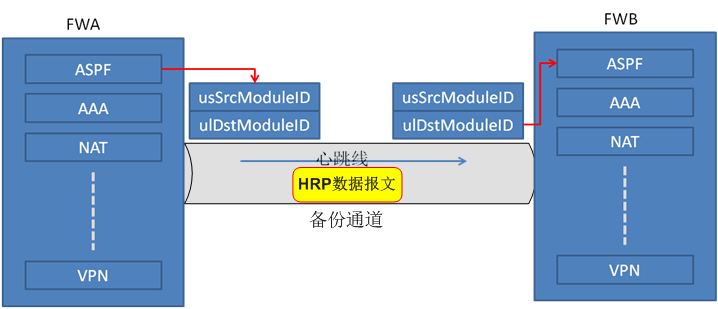

在前面双机热备的第二篇中我们讲到USG6000系列防火墙和USG2000/5000系列V3R1版本防火墙还支持将各种VGMP报文和HRP报文封装成UDP报文。当然这里介绍的HRP数据报文，以及下面讲的心跳链路探测报文和一致性检查报文都支持这种UDP方式的封装。这种方式的封装方法就是在VRRP报文头上再封装一个UDP头。HRP数据报文的UDP封装结构如下图所示。


UDP封装的好处前面我们也讲过：UDP封装后的报文是单播报文，只要路由可达就可以跨越网段传输，而且能够被安全策略控制。

### 3. HRP能够备份哪些配置与状态信息？

防火墙能够备份的配置如下（以HUAWEI USG6000系列 V100R001版本为例）：
- 策略：安全策略 、NAT策略 、带宽管理 、认证策略 、攻击防范 、黑名单 、ASPF
- 对象：地址 、地区、服务 、应用 、用户 、认证服务器 、时间段 、URL分类 、关键字组 、邮件地址组 、签名 、安全配置文件（反病毒 、入侵防御 、URL过滤 、文件过滤 、内容过滤 、应用行为控制 、邮件过滤）
- 网络：新建逻辑接口 、安全区域 、DNS 、IPSec 、SSL VPN 、TSM联动
- 系统：管理员 、日志配置

    **说明：一般情况下，display、reset、debugging命令都不支持备份。**

**根据上面的描述我们可以看到，防火墙的网络基本配置如接口地址和路由等都不能够备份，这些配置需要在双机热备状态成功建立前配置完成。而上面支持备份的配置可以在双机热备状态成功建立后，只在主用设备上配置。**

防火墙能够备份的状态信息如下：
- 会话表
- SeverMap表
- IP监控表
- 分片缓存表
- GTP表
- 黑名单
- PAT方式端口映射表
- NO-PAT方式地址映射表

### 4. HRP的备份方向是怎样的？什么是配置主和配置从设备？

**在主备备份组网下，配置命令和状态信息都由主用设备备份到备用设备。**

**在负载分担组网下，配置命令只能由“配置主设备”备份到“配置备设备”。状态信息则是两台设备相互备份的。**

>那么什么是配置主和配置备设备呢？
>
>在负载分担组网下，两台防火墙都是主用设备（都有状态为Active的VGMP组）。因此如果允许两台主用设备之间能够相互备份命令，那么可能就会造成两台设备命令相互覆盖或冲突的问题。所以为了方便管理员对两台防火墙配置的统一管理，避免混乱，我们引入配置主和配置从设备的概念。我们定义**负载分担组网下，发送备份配置命令的防火墙称为配置主设备（命令行提示符前有HRP_A前缀），接收备份配置命令的防火墙称为配置从设备（命令行提示符前有HRP_S前缀）。**

>那么在负载分担组网下，如何确定配置主和配置备设备呢？
>
>**在负载分担组网下，最先建立双机热备状态的防火墙会成为配置主设备。也就是最先启用双机热备功能的防火墙会成为配置主设备。**

### 5. HRP的几种备份方式有什么区别？
双机热备的HRP支持以自动备份、手工批量备份和快速备份三种方式。这三种备份方式的描述和区别下面我们一一来介绍。

#### 1. 自动备份

自动备份功能（命令为`hrp auto-sync [ config | connection-status ]`）缺省为开启状态，能够自动实时备份配置命令和周期性地备份状态信息，适用于各种双机热备组网。

- 启用自动备份功能后，主用（配置主）设备上每执行一条可以备份的命令时，此配置命令就会被立即同步备份到备用（配置备）设备上。

    如果在主用（配置主）设备上执行不可以备份的命令，则该命令仅在主用（配置主）设备上执行。

    对于可以备份的配置命令，只能在主用（配置主）设备上配置，备用（配置备）设备上不能配置。对于不可以备份的配置命令，备用（配置备）设备上可以配置。关于哪些配置命令可以备份或不可以备份请参见“3  HRP能够备份哪些配置与状态信息？”。
- 启用自动备份功能后，主用设备会周期性的将可以备份的状态信息备份到备用设备上。即主用设备的状态信息建立后不会立即备份，需要经过一个周期后才会备份到备用设备。

    **自动备份不会备份以下类型的会话（只快速会话备份支持）：**
    - 到防火墙自身的会话，例如管理员登录防火墙时产生的会话
    - 未完成3次握手的TCP半连接会话
    - 只为UDP首包创建，而不被后续包匹配的会话
    
#### 2. 手工批量备份
**手工批量备份需要管理员手工触发，每执行一次手工批量备份命令（`hrp sync [ config | connection-status ]`），主用设备就会立即同步一次配置命令和状态信息到备用设备。因此手工批量备份主要适用于主备设备之间配置不同步，需要手工同步的场景。** 我们可以在防火墙上配置一致性检查功能，检查两台防火墙的配置是否同步。一致性检查功能需要用到HRP一致性检查报文，这个我们最后会讲到。

- 执行手工批量备份命令后，主用（配置主）设备会立即同步一次可以备份的配置命令到备用（配置备）设备。
- 执行手工批量备份命令后，主用设备会立即同步一次可以备份的状态信息到备用设备，而不必等到自动备份周期的到来。

#### 3.  快速备份
**快速会话备份功能（命令为`hrp mirror session enable`），适用于负载分担的工作方式，以应对报文来回路径不一致的场景。为了保证状态信息的及时同步，快速备份功能只是备份状态信息，不备份配置的命令。配置命令的备份由自动备份功能实现。**

启用快速备份功能后，主用设备会**实时**的将可以备份的状态信息（包括上面提到的自动备份不支持的会话）都同步到备用设备上。即在主用设备状态信息建立的时候**立即**将其**实时**备份到备用设备。

**综上所示，三种备份方式的使用方式通常是：自动备份（`hrp auto-sync [ config | connection-status ]`）默认开启，不要关闭；如果主备设备之间配置不同步，需要执行手工批量备份的命令（`hrp sync [ config | connection-status ]`）；如果是负载分担组网，一般需要开启快速会话备份功能（`hrp mirror session enable`）。**

下面来讲解为什么快速会话备份特别适用于负载分担组网？

负载分担组网下，由于两台防火墙都是主用设备，都能转发报文，所以可能存在报文的来回路径不一致的情况，即来回两个方向的报文分别从不同的防火墙经过。这时如果两台防火墙的状态信息没有及时相互备份，则回程报文会因为没有匹配到状态信息而被丢弃，从而导致业务中断。

为防止上述现象发生，需要在负载分担组网下配置快速会话备份功能，使两台防火墙能够实时的相互备份状态信息，使回程报文能够查找到相应的状态信息表项，从而保证内外部用户的业务不中断。

下面举个例子来说明。如下图所示，FW1和FW2形成双机热备的负载分担组网。内网PC访问外网Server的报文通过FW1转发，并建立会话。由于来回路径不一致，Server返回给PC的回程报文转发到FW2。这时如果只启用了自动备份功能，则FW1的会话还没有来得及备份到FW2上。这就导致回程报文无法在FW2上匹配会话而被FW2丢弃，从而造成业务中断。这时如果启用了会话快速备份功能，则FW1上产生的会话会立即备份到FW2上。这样回程报文就能在FW2上匹配到会话，从而被正常转发到PC。


## 6. 什么是心跳链路探测报文？与HRP心跳报文有什么区别？
两台防火墙之间备份的数据是通过防火墙的心跳口发送和接收的，是通过心跳链路（备份通道）传输的。心跳口必须是状态独立且具有IP地址的接口，可以是一个物理接口GE，也可以是为了增加带宽，由多个GE接口捆绑而成的一个逻辑接口Eth-Trunk（通常情况下，备份数据流量约为业务流量的20%～25%，请根据备份数据量的大小选择捆绑GE接口的数量）。

如下图所示，我们经常会配置多个心跳口（多个GE或者多个Eth-Trunk接口），从而形成多条心跳链路，以保证备份数据的可靠传输。两台防火墙通过心跳口相互发送心跳链路探测报文，来检测对端设备的心跳口能否正常接收本端设备的报文，以确定是否有心跳口可以使用。心跳链路探测报文也是由VRRP报文头封装的，当VRRP报文头中Type=2，Type2=2时，报文封装成心跳探测链路报文。

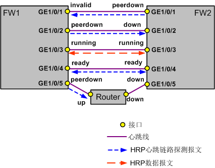

如上图所示，心跳接口有五种状态（执行命令`display hrp interface`可以查看）：

- **invalid**：当本端防火墙上的心跳口配置错误时显示此状态（物理状态up，协议状态down），例如指定的心跳口为二层接口或未配置心跳接口的IP地址。
- **down**：当本端防火墙上的心跳口的物理与协议状态均为down时，则会显示此状态。
- **peerdown**：当本端防火墙上的心跳口的物理与协议状态均为up时，则心跳口会向对端对应的心跳口发送心跳链路探测报文。如果收不到对端响应的报文，那么防火墙会设置心跳接口状态为peerdown。但是心跳口还会不断发送心跳链路探测报文，以便当对端的对应心跳口up后，该心跳链路能处于连通状态。
- **ready**：当本端防火墙上的心跳口的物理与协议状态均为up时，则心跳口会向对端对应的心跳口发送心跳链路探测报文。如果对端心跳口能够响应此报文（也发送心跳链路探测报文），那么防火墙会设置本端心跳接口状态为ready，随时准备发送和接受心跳报文。这时心跳口依旧会不断发送心跳链路探测报文，以保证心跳链路的状态正常。
- **running**：当本端防火墙有多个处于ready状态的心跳口时，防火墙会选择最先配置的心跳口形成心跳链路，并设置此心跳口的状态为running。状态为running的接口负责发送和HRP心跳报文、HRP数据报文、HRP一致性检查报文和VGMP报文。

这时其余处于ready状态的心跳口处于备份状态，当处于running状态的心跳口或心跳链路故障时，其余处于ready状态的心跳口依次（按配置先后顺序）接替当前心跳口处理业务。如上图所示，由于两台防火墙心跳接口的配置顺序与接口编号顺序相同，所以先配置的处于ready状态的心跳口GE1/0/3成为running状态，而后配置的处于ready状态的心跳口GE1/0/4处于备份状态。

下面我们来看一种特殊情况：两台防火墙的心跳口配置顺序不一致时的情况。如下图所示，两台防火墙的GE1/0/2、GE1/0/3、GE1/0/4接口都是能够正常工作的心跳口（处于ready状态）。由于FW1先配置GE1/0/3为心跳口，而FW2先配置GE1/0/2为心跳口，所以FW1的GE1/0/3 心跳口状态为running，而FW2的GE1/0/2心跳口状态为running。这样FW1的HRP数据报文会从GE1/0/3发送，而FW2的HRP数据报文会从GE1/0/2发送。虽然HRP数据报文的发送和接收接口不一致，但这并不会影响双机热备的正常工作。

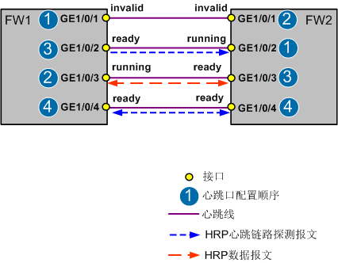

最后来总结下心跳链路探测报文和HRP心跳报文的区别。心跳链路探测报文用于检测对端设备的心跳口能否正常接收本端设备的报文，以确定心跳口是否可用的。只要本端心跳接口的物理和协议状态up就会向对端心跳口发送心跳链路探测报文进行探测。HRP心跳报文是用于探测和感知对端设备（VGMP组）是否正常工作的。HRP心跳报文只有主用设备的VGMP组通过状态为running的心跳口发出

### 7. HRP一致性检查报文能够检查哪些内容？是如何实现的？
HRP一致性检查报文用于检测双机热备状态下的两台防火墙的**双机热备配置**是否一致以及**策略配置**是否相同。双机热备配置的一致性检查包括两台防火墙是否监控了相同的业务接口，是否配置了相同的心跳接口等。策略配置一致性检查主要检查两台防火墙是否配置了相同的策略，包括安全策略、带宽策略、NAT策略、认证策略和审计策略。HRP一致性检查报文也是由VRRP报文头封装的，当VRRP报文头中Type=2，Type2=5时，报文封装成HRP一致性检查报文。

HRP一致性检查的实现原理如下：
1. 执行一致性检查命令（`hrp configuration check { all | audit-policy | auth-policy | hrp | nat-policy | security-policy | traffic-policy }`）后，执行此命令的设备会发送一致性检查请求报文给对端，并且同时收集自身的相关模块的配置信息摘要。
2. 对端设备收到请求后，会收集自身相关模块的配置信息摘要，然后封装到一致性检查报文中返回给本端设备。
3. 本端设备会对比自身的配置摘要和对端设备的配置摘要，并记录比较信息。客户可以执行命令`display hrp configuration check`查看一致性检查结果。例如下面的结果表示双机热备配置一致。

    ```bash
    HRP_A[FWA] display hrp configuration check hrp

    Module     State  Start-time          End-time            Result

    hrp        finish 2008/09/08 14:21:56 2008/09/08 14:21:56 same configuration
    ```