## 就近选路——缺省路由有备无患，明细路由近路建功
### 1. 缺省 VS 明细
1. 什么是缺省路由，缺省路由是属于静态路由吗？

    其实缺省路由是一种特殊的路由，可以通过静态路由配置，也可以是动态路由生成，如OSPF和IS-IS。所以确切的说，缺省路由不属于静态路由。在路由表中，缺省路由以目的网络为0.0.0.0、子网掩码为0.0.0.0的形式出现。下面为路由表中的缺省路由。

    ```bash
    [FW] display ip routing-table                                                    
    Route Flags: R - relay, D - download to fib                                   
    ------------------------------------------------------------------------------ 
    Routing Tables: Public  
            Destinations : 1       Routes : 2                   
    Destination/Mask    Proto    Pre  Cost       Flags NextHop         Interface      
     0.0.0.0/0          Static     60    0           RD     10.1.1.2          GigabitEthernet2/2/21 
                        Static     60    0           RD     10.2.0.2          GigabitEthernet2/2/17
    ```

    如果数据报文的目的地址不能与任何路由相匹配，那么系统将使用缺省路由转发该数据报文。

2. 什么是明细路由？

    明细路由是相对来说的，相对缺省路由，在路由表中的其他路由都属于明细路由，如10.1.0.0/16、192.168.1.0/24相对缺省路由都属于明细路由。相对有10.1.0.0/16这条汇总路由，10.1.1.0/24、10.1.2.0/24、10.1.3.0/24这三条路由都属于它的明细路由。明细路由与路由协议类型无关，可以是静态路由配置的，也可以是动态路由协议生成的。
3. 报文是如何查找路由表的？

    可能大家都知道，报文查找路由表时是按照最长匹配原则进行查找，什么意思呢？举个例子，路由表中有10.1.0.0/16、10.1.1.0/24和0.0.0.0/0三条路由，当目的地址为10.1.1.1/30的报文查找路由表时，最终匹配的路由将是10.1.1.0/24这条路由，因为前面的24位与这个报文的目的地址一致，为匹配路由中最长。如果是目的地址为192.168.1.1/30的报文查找路由表，则只能匹配0.0.0.0/0这条缺省路由了，因为报文的目的地址不能与任何明细路由相匹配，最终系统将使用缺省路由转发该报文。

    从上面的问题中我们可以了解到，当路由表中有明细路由时，报文是先匹配明细路由，如果没有明细路由再查找缺省路由。

4. 多条缺省路由间是如何选路的？

    我们先来看下面一个组网，在防火墙上我们配置两条缺省路由，一个下一跳指向R1，一个下一跳指向R2，现在我们在PC上ping目标网络上的两个服务器地址。

    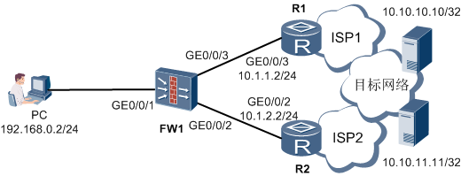

    两条缺省路由在防火墙上配置如下：
    ```bash
    [FW] ip route-static 0.0.0.0 0 10.1.1.2
    [FW] ip route-static 0.0.0.0 0 10.1.2.2
    ```
    通过在FW1的GE0/0/3接口上抓包发现报文都是从GE0/0/3接口进行转发，截图如下：

    
    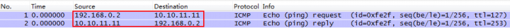

    为什么出现这种情况呢？两条缺省路由不进行负载分担吗？事实上，多条缺省路由在选路的时候是根据源IP地址+目的IP地址的HASH算法来算出报文具体走哪条链路的，这种算法主要是看报文的源IP地址和目的IP地址，地址不同，计算出的结果也会不相同。这种算法下，等价缺省路由之间转发报文的机会是均等的。举个例子，如果报文的源IP地址相同，目的地址是相邻的，如10.1.1.1和10.1.1.2，那么选路的时候，将会各分担一条流进行转发。然而，由于网络中访问流量的源和目的地址是随机的，所以HASH计算结果完全不可控。这个时候虽然多条缺省路由是等价路由，也有可能出现所有报文都从一条链路转发的情况。这个结果也印证了上面举例中报文都从GE0/0/3接口转发的原因。

    好了，前面说的都是一些基础知识，现在让我们来看看缺省路由+明细路由的就近选路方式是如何就近选路的。先看一个简单的网络环境，如下图所示。

    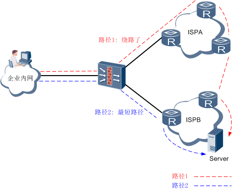

    当企业内网用户访问外网服务器Server时，报文途经防火墙有两条路径，正常情况下，企业一般会在出口防火墙上配置两条缺省路由，每个ISP一条。在前面我们说过缺省路由的选路是通过源IP+目的IP的HASH算法来决定数据报文的转发路径，这就有可能导致到ISPB的Server流量经过HASH算法计算后从图中的路径1进行转发了，这样从路径1到ISPA，再经过ISPA到ISPB，绕一大圈后才能到能最终目的地，严重影响了转发效率和用户体验。

    那有什么办法让报文不绕道呢？通过配置明细路由即可达到要求，前面我们也说过，报文是优先匹配明细路由的，没有匹配的明细路由再去查找缺省路由的。就上面的组网，我们可以配置到Server的明细路由，下一跳指向ISPB，这样报文匹配到这条明细路由后就不会绕道转发了，而是选择明细路由指定的链路，从图中看，选择的是两条路径中的最短路径，这就是我们所说的就近选路了。我们也可以通过第一个组网验证一下。我们在防火墙上配置如下两条静态路由：
    ```bash
    [FW] ip route-static 10.10.10.10 255.255.255.255 10.1.1.2(下一跳为R2地址)

    [FW] ip route-static 10.10.11.11 255.255.255.255 10.1.2.2(下一跳为R3地址)
    ```
    通过在FW1的GE0/0/3接口上抓包发现只有去往10.10.10.10的报文。

    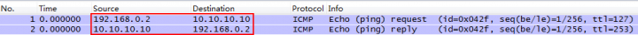
    在FW1的GE0/0/2接口上抓包发现有去往10.10.11.11的报文。
    

     这就证明，报文是优先查找刚配置的两条明细路由。然而在实际组网环境中，Internet上的Server是非常多的，作为管理员在出口网关防火墙上配置那么多的明细路由是不现实的，那有没有一种方便快捷的方法配置明细路由呢？这就要我们的ISP路由功能出场了。那什么是ISP路由呢？

### 2. ISP路由
ISP路由，从名字来看有一个ISP，其实也是它的由来。每个ISP都会有自己的公网知名网段，如果把这个ISP的所有公网知名网段都像上面说的一样配置成明细路由，那么去往这个ISP的所有报文都不会绕路转发了。那如何把ISP的公网知名网段变成明细路由呢？

首先管理员需要先收集ISP内的所有公网网段（网上都能够搜索到），然后把地址网段编辑到后缀为. csv的文件中（我们称之为ISP地址文件），编辑要求按如下图所示：

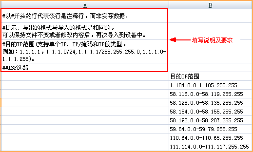

编辑地址文件完成后，我们需要把后缀为.csv的ISP地址文件上传到防火墙的指定路径上，比如cfcard中。上传的方法有很多，比如SFTP、FTP、TFTP等。

ISP地址文件上传到防火墙后，通过设置出接口和下一跳，可以让ISP地址文件中的每个IP地址网段都生成一条ISP路由。

下面我们通过一个实验组网检验下ISP路由选路的效果，组网如下图所示：

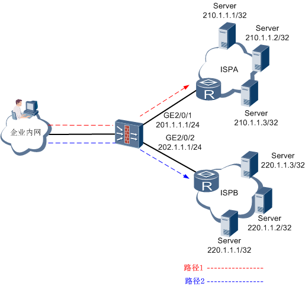

在此组网中，ISPA和ISPB内的地址网段我们分别编辑在ispa.csv与ispb.csv文件中。

首先我们通过SFTP、FTP、TFTP等方式上传两个csv文件到防火墙的指定路径中。其中高端防火墙路径为cfcard:/isp/；下一代防火墙为hda1:/isp/。

完成csv文件上传后，通过相关命令设置相应出接口和下一跳，启动ISP路由功能。以高端防火墙为例配置命令如下：

```bash
[FW] isp set filename ispa.csv GigabitEthernet 2/0/1 next-hop 201.1.1.2
```
此外, 我们还可以通过Web配置方式来配置ISP路由,则这种方式更为简单, 上传CSV文件和导入欸之通过异步就可以完成. 我们以USG9000为例，导入方式如下：

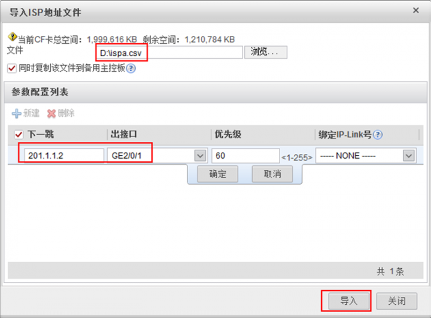

spb.csv的导入方法与ispa.csv一致，只是出接口和下一跳改成GE2/0/2和202.1.1.2。

导入完成后，防火墙会生存如下路由：
```bash
Destination/Mask    Proto  Pre  Cost    Flags NextHop         Interface       
      210.1.1.1/32  ISP    60   0      D   201.1.1.2         GigabitEthernet2/0/1 
      210.1.1.2/32  ISP    60   0      D   201.1.1.2         GigabitEthernet2/0/1 
      210.1.1.3/32  ISP    60   0      D   201.1.1.2         GigabitEthernet2/0/1 
      220.1.1.1/32  ISP    60   0      D   202.1.1.2         GigabitEthernet2/0/2  
      220.1.1.2/32  ISP    60   0      D   202.1.1.2         GigabitEthernet2/0/2  
      220.1.1.3/32  ISP    60   0      D   202.1.1.2         GigabitEthernet2/0/2 
```
内网用户访问属于ISPA的Server时, 报文匹配路由表后从 GigabitEthernet2/0/1 接口进行转发; 同理，访问ISPB的Server时，会从GigabitEthernet2/0/2接口进行转发。这样总是能保证从最短的路径转发到目标网络。

从上面的路由表来看，ISP路由与静态路由非常相似，在路由表中，除了协议类型为ISP外，表中其它内容与静态路由完全一样，且两种路由之间是可以互相覆盖的，如静态路由先配置，后再导入ISP路由后，路由表中此条路由的协议类型会从static变成ISP，反之亦然。但在应用中ISP路由与静态路由还是有如下区别：
1. 静态路由是手动一条一条配置, 配置文件中能够显示出来; ISP路由只能通过上面所述的方式集体导入, 且配置文件中无法显示出ISP路由
2. 静态路由可以逐条删除、增加；ISP路由只能从ISP地址文件中把地址网段删除、增加，而不能通过命令删除或增加单条ISP路由。

上面说的是管理员如何构建ISP路由的过程，实际上，防火墙在出厂的设置中已经内置了中国移动、中国电信、中国联通和中国教育网4个ISP的公网知名网段，只需要管理员执行导入即可启动ISP路由。

总结就近选路方式，其实就是三种路由的PK结果：
- 缺省等价路由让经过防火墙的所有报文都能匹配路由转发，但无法保证报文转发选择最短链路（通过源IP地址+目的IP地址的HASH算法来选择报文转发出口）。
- 明细路由保证访问不同ISP服务器的报文都从连接相应ISP的链路转发，达到就近访问效果，但是明细路由的手工大批量配置是困扰企业网络管理员的一个难题。
- ISP路由则填补了明细路由难以手工大批量配置的缺点，分分钟就能搞定一个ISP所有地址网段的明细路由配置。

## 策略路由选路
### 1. 策略路由的概念
所谓策略路由，顾名思义，即是根据一定的策略进行报文转发。而策略是人为制定的，因此策略路由是一种比传统的按照目的地址选路更灵活的选路机制。在防火墙上配置策略路由后，防火墙首先会根据策略路由配置的规则对接收的报文进行过滤，匹配成功则按照一定的转发策略进行报文转发。其中“配置的规则”即是需要定义匹配条件，一般是通过ACL来定义匹配条件；而“一定的转发策略”则是需要根据匹配条件执行相关的动作。由此可以推断策略路由由以下两部分组成，如下：
-  匹配条件（通过ACL定义）
   -  用于区分将要做策略路由的流量。匹配条件包括：报文源IP地址、目的IP地址、协议类型、应用类型等，不同的防火墙可以设置的匹配条件略有不同。在一条策略路由规则中，可以包含多个匹配条件，各匹配条件之间是“与”的关系，报文必须同时满足所有匹配条件，才可以执行后续定义的转发动作。    
- 动作   
   - 对符合匹配条件的流量采取的动作，包括指定出接口和下一跳。       
    - 当有多条策略路由规则时，防火墙会按照匹配顺序，先寻找第一条规则，如果满足第一条策略路由规则的匹配条件，则按照指定动作处理报文。如果不满足第一条规则的匹配条件，则会寻找下一条策略路由规则。如果所有的策略路由规则的匹配条件都无法满足，报文按照路由表进行转发，策略路由的匹配是在报文查找路由表之前完成，也就是说策略路由比路由的优先级高。如下图所示。

    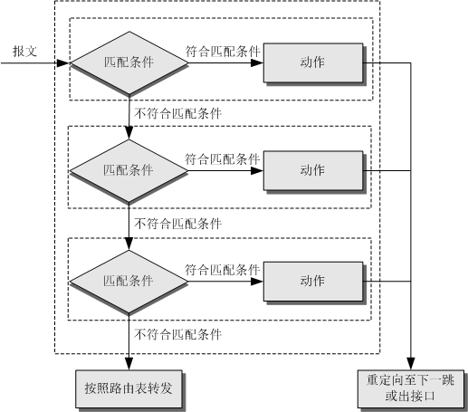

    此外，如果策略路由指定的出接口或下一跳Down或不可达，那么报文将以报文中的目的地址为依据来查找路由表进行转发。

### 2. 基于目的IP地址的策略路由
我们通过一个组网环境来验证这种策略路由的效果，组网如下。

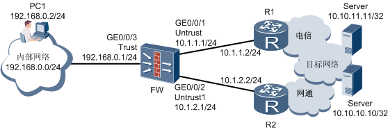

组网中FW为企业出口网关，通过两条链路连接到Internet，其中经过R1的链路为电信的线路；经过R2的链路为网通的线路。现在我们要让企业用户访问10.10.11.11/32这个Internet服务从电信线路转发，而10.10.10.10/32这个服务从网通线路转发。

如果在FW上配置两条缺省路由，企业用户在访问10.10.11.11/32和10.10.10.10/32这两个服务时，经过验证发现都是经过R1这条链路进行转发的，这个我们在上一期就近选路中就说过，缺省路由的选路是通过源IP地址+目的IP地址的HASH算法来计算报文选择的出口链路，无法控制访问10.10.11.11/32的流量从电信线路转发，访问10.10.10.10/32的流量从网通线路转发的要求。

下面我们在FW上配置策略路由，看看实验效果如何，配置如下(我们以USG2000/5000系列防火墙为例)：
1. 根据报文目的地址设置匹配条件

    ```bash
    acl number 3000
     rule 5 permit ip destination 10.10.11.11 0
    acl number 3001
     rule 5 permit ip destination 10.10.10.10 0
    ```
2. 配置策略路由

    ```bash
    policy-based-route test permit node 10
       if-match acl 3000 //应用匹配条件
        apply ip-address next-hop 10.1.1.2        //配置动作，重定向至电信下一跳
        policy-based-route test permit node 20
        if-match acl 3001    //应用匹配条件
        apply ip-address next-hop 10.1.2.2        //配置动作，重定向至网通下一跳  
    ```
3. 应用策略路由

    ```bash
    interface GigabitEthernet0/0/3
    ip address 192.168.0.1 255.255.255.0
    ip policy-based-route test     //在入接口应用策略路由
    ```
    配置完成后, 我们在在PC上ping 10.10.11.11 和 10.10.10.10 两个地址, 能正常ping通. 同时在FW上查看会话表达的详细信息, 显示如下:
    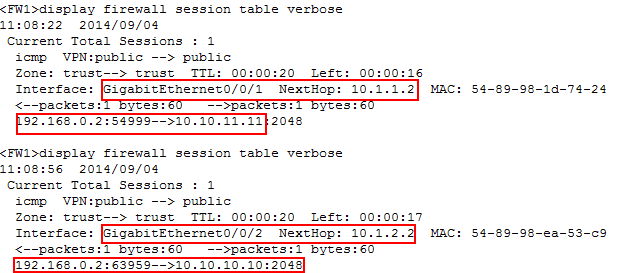

    通过显示信息可以看到去往10.10.11.11的报文是从FW的GE0/0/1接口转发的，下一跳为R1与FW相连的接口地址；而去往10.10.10.10的报文是从FW的GE0/0/2接口转发的，下一跳为R2与FW相连的接口地址，从而达到访问10.10.11.11/32的流量从电信线路转发，而访问10.10.10.10/32的流量从网通线路转发的要求。

    看到这里，可能大家会说，在上一篇介绍的就近访问也能达到这个要求，对！的确是如此。因为就近选路中缺省路由+明细路由的选路方式是根据目的地址进行报文的转发，而上面配置的策略路由也是以报文目的地址为条件制定转发策略，所以能够完成同样的需求。但策略路由更多的体现在人为的控制方面，而传统的按目的地址路由只能由系统内置的HASH算法或者是系统的内部实现来决定报文的转发。

    事实上，传统的路由只能根据报文的目的地址为用户提供比较单一的路由方式，它更多的是解决网络报文的转发问题，而不能提供更灵活的服务。策略路由则不同，它使网络管理者不仅能够根据目的地址，而且能够根据报文源IP地址、协议类型、应用类型或者其它条件来选择转发路径，所以说策略路由有着比传统路由协议对报文的更强控制能力。

### 3. 基于源IP地址的策略路由
如果说上面的应用与就近访问方式还有一些交集，那我们来看看策略路由选路的另外一个应用。大家都知道，光纤到户是目前网络的发展方向，但光纤的费用在今天的中国并不便宜，于是很多地方都采用了光纤加ADSL的方式，然而这样就出现了两条速度不同的线路接入互联网。通过策略路由可以让一部分优先级较高的用户***纤，另一部分级别低的用户机走ADSL。我们还是以事实为依据，模拟组网环境如下。

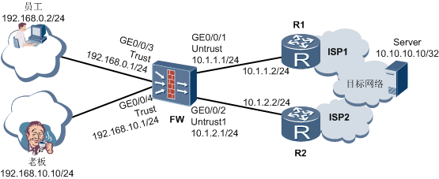

组网中FW为企业出口网关，通过从不同的ISP连接了两条链路到Internet，其中经过R1的链路带宽速率较高，假设为10Mbit/s；经过R2的链路带宽速率较小，为2Mbit/s。为保证企业老板访问Internet的效果，让其访问流量从经过R1的链路进行转发，而员工的访问流量从经过R2的链路转发。

想要完成上述要求，通过目的地址查找路由的方式是无法完成的，而通过策略路由设置源IP地址为匹配条件很轻松就能解决此问题。在FW上的配置如下(我们以USG2000/5000系列防火墙为例)：

1. 根据报文源IP地址设置匹配条件
    ```bash
    acl number 3000
      rule 5 permit ip source 192.168.10.0 0.0.0.255
    acl number 3001
      rule 5 permit ip source 192.168.0.0 0.0.0.255
    ```
2. 配置策略路由

    ```bash
    policy-based-route boss permit node 10
      if-match acl 3000          //应用匹配条件
        apply ip-address next-hop 10.1.1.2          //配置动作，重定向下一跳为R1
        policy-based-route employee permit node 10
      if-match acl 3001          //应用匹配条件
        apply ip-address next-hop 10.1.2.2         //配置动作，重定向下一跳为R2    
    ```
3. 应用策略路由

    ```bash
    interface GigabitEthernet0/0/3
    ip address 192.168.0.1 255.255.255.0
    ip policy-based-router employee // 在入接口应用策略路由
    interface GigabitEthernet0/0/4
    ip address 192.168.10.1 255.255.255.0
    ip policy-based-router boss // 在入接口应用策略路由
    ```
    配置完成后，分别在老板和员工的PC上ping Internet上的Server地址10.10.10.10，并在FW上查看会话表详细信息，显示如下：

    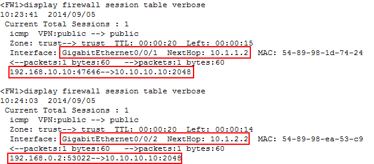

    显示信息中，老板（192.168.10.10）访问Server的流量是从R1（10.1.1.2）的链路进行转发的；而员工（192.168.0.2）访问Server的流量是从R2（10.1.2.2）的链路转发的。从而完成了优先级较高的用户走高速链路，而低级别用户从低速链路转发的需求。

### 4. 基于应用的策略路由
防火墙的策略路由能与应用识别功能相结合，以流量的应用类型为匹配条件，实现基于应用的策略转发，这就是我们所熟知的基于应用的策略路由。

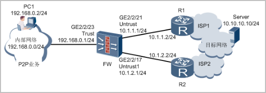

组网环境中，FW为企业出口网关，通过从ISP1和ISP2获得两条链路与Internet相连，其中ISP2提供的链路上下行的带宽对称，链路状态稳定，为企业正常业务流量主要转发链路；ISP1提供的链路上下行的带宽不对称，网速较慢，但租用价格低廉，可提供给一些大流量应用（图中为P2P）转发的链路。

我们通过“比特精灵”工具模拟P2P业务，在Server上模拟P2P服务器，在企业用户PC1上模拟P2P客户端，同时使用Ping模拟正常业务。

现在FW上配置基于应用的策略路由，让P2P应用的流量从GE2/2/21出接口转发，而正常的流量直接通过路由从GE2/2/17出接口转发，配置命令如下(我们以USG9000系列防火墙为例)：
1. 根据报文源IP地址设置匹配条件

    ```bash
    acl number 3000
    rule 5 permit ip source 192.168.0.0 0.0.0.255
    ```
2. 配置策略路由

    ```bash
    traffic classifier p2p operator or
    if-match acl 3000 category p2p  // 对用户的P2P应用设置为匹配条件
    traffic behavior p2p
    redirect ip-nexthop 10.1.1.2 interface GigabitEthernet2/2/21 // 重定向出接口 和下一跳
    ```
3. 应用策略路由

    ```bash
    interface GigabitEthernet2/2/23
    ip address 192.168.0.1 255.255.255.0
    traffic policy p2p inbound  // 在入接口应用策略路由
    ```
配置完成后, 我们在pc1上开启 "比特精灵" 客服端下载功能, 截图如下:

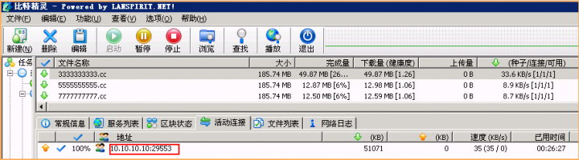

然后我们在FW上查看会话表，显示如下：

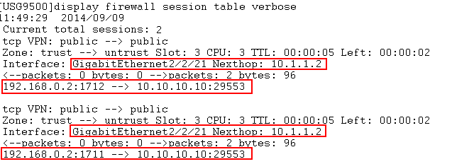

通过显示信息可以看到，访问的目的地址和端口与“比特精灵”客户端上的显示一致，都是10.10.10.10:29553，并且这部分流量是从出接口为GE2/2/21、下一跳为10.1.1.2的链路进行转发的，与策略路由重定向的出接口和下一跳一致，说明基于P2P应用的策略路由应用成功。

下面我们在PC1上ping 10.10.10.10这个Server的地址。

此时，我们再在FW上查看会话表，显示如下：

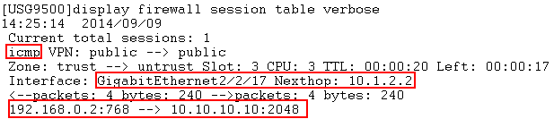

显示信息中显示这部分流量是从出接口GE2/2/17、下一跳为10.1.2.2的链路进行转发的。说明我们的正常业务流量是从ISP2提供的链路进行转发的，达到了预期要求。

综合上面几个策略路由选路的应用，可以看到策略路由选路的灵活应用关键在于匹配条件的灵活多样，不同场景匹配不同的条件，如上面的三个应用包含的匹配条件分别为目的IP地址、源IP地址和应用类型。此外，还有许多匹配条件会比较常用，如用户、协议类型等，因为配置方法基本相同，这里就不一一介绍。

### 5. 旁路组网下的策略路由选路
在现网中，策略路由的另外一种应用却不得不提，就是防火墙旁挂企业出口时，通过策略路由引流到防火墙进行安全防护。当然此时的策略路由不是在防火墙上进行配置的，但这种应用场景在许多企业出口和数据中心出口都经常用到，为此，我们也对这种应用做一个介绍。

首先我们还是通过实际组网环境来验证这种场景，如下图所示。

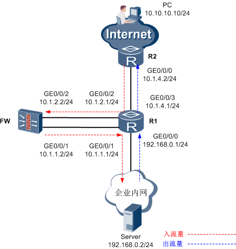

组网中企业出口为路由器R1，防火墙FW旁挂在出口路由器R1上。当外网用户访问内网服务器时，流量从出口路由器引流到防火墙进行安全防护后，再转发到内网服务器。

此组网中，策略路由是在出口路由器R1上配置的，路由器策略路由的配置思路与上面介绍的防火墙的策略路由配置思路一致，都是先定义匹配条件（本地为目的IP地址）、设置动作（重定向出接口或下一跳），然后在入接口上应用。此组网中的防火墙除了对引入的流量进行安全防护外，还需要把流量回注到出口路由器R1上。安全防护的内容强叔在前面的帖子中已经介绍过，这里主要说下回注的问题。回注其实很简单，这里介绍静态路由和OSPF两种回注方法。

- 静态路由配置方法:

    如下表为采用静态路由配置方式的配置命令, 其中只列出策略路由和静态路由的配置

    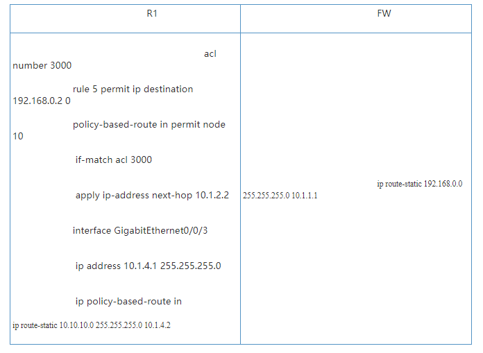

- OSPF路由配置方法

    当接入用户网络较多时考虑使用此种配置方式，方便管理员维护。       

    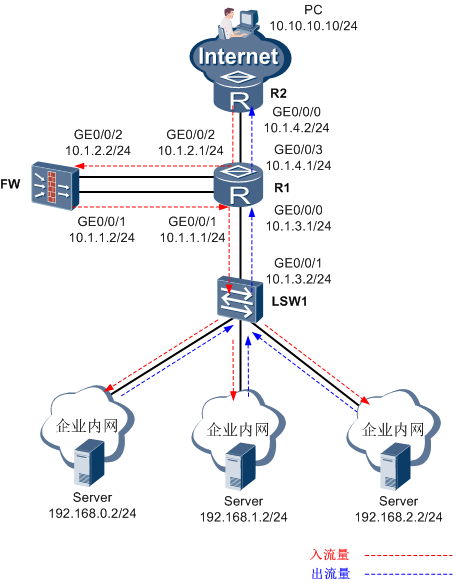

     如下表为采用OSPF配置方式的配置命令，其中只列出策略路由和OSPF的配置。    

     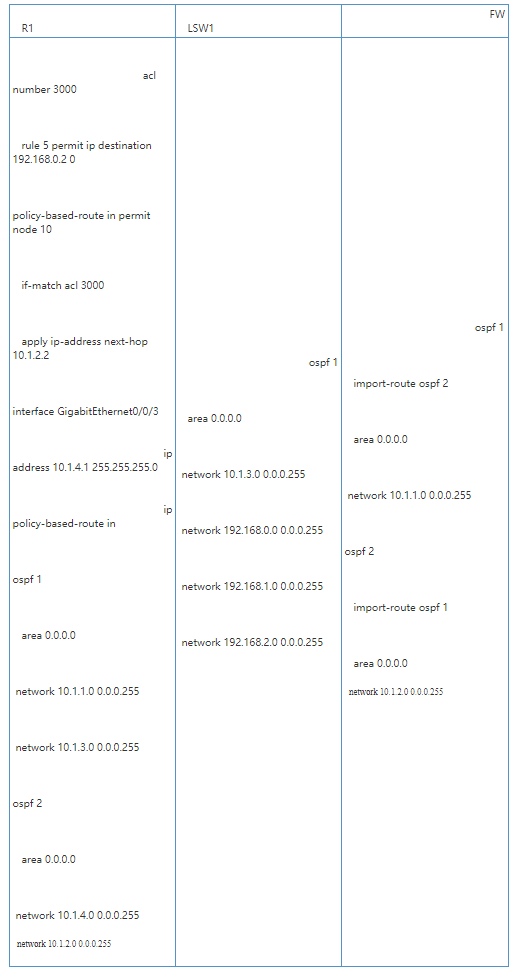

     通过OSPF回注的配置相对复杂一些，是使用OSPF双进程，双进程在R1上对上下行流量进行隔离，当流量通过策略路由引流到FW后，再在FW上通过OSPF两个进程互相引入，可以使OSPF两个进程中的路由能够互相学习到。       
     
     R1上策略路由完成了流量的引流，FW上静态路由或OSPF完成了流量的回注。配置完成后，通过在外网PC（10.10.10.10）上Tracert内网Server的地址192.168.0.2，可以看到如下路线（以静态路由组网配置为

     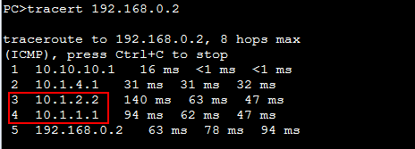

     路径信息中显示，访问流量经过FW后，再回到R1，最后到目标Server，达到了预期访问效果。       
     
     策略路由选路其实就是对符合匹配条件的流量进行选路，重新选定出接口和下一跳。这就要求管理员对网络现状有充分的了解，能根据网络现状选择合适的匹配条件。比如清楚的知道多条出口链路的优异，就能让企业重要客户或重要业务的流量从优先级高的链路进行转发。所以说灵活的应用策略路由，为管理员规划网络提供了更多的手段。