## 状态检测和会话机制补遗

### TCP
首先来看一下TCP协议. 我们都知道，建立一个TCP连接，通信双方需要三次握手：

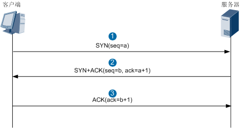

判断一个TCP连接的主要标志就是SYN报文，我们也把SYN报文称为TCP连接的首包。对于TCP协议，防火墙只有收到SYN报文，并且SYN报文通过了包括安全策略在内的各项安全机制的检查后，才会建立会话，后续的TCP报文匹配会话直接转发。如果防火墙没有收到SYN报文，只收到了SYN+ACK或ACK等后续报文，是不会创建会话的，并且会将这些报文丢弃。

下面我们就祭出eNSP模拟器，在防火墙上模拟一个典型的TCP协议的会话：HTTP会话。网络拓扑如下：

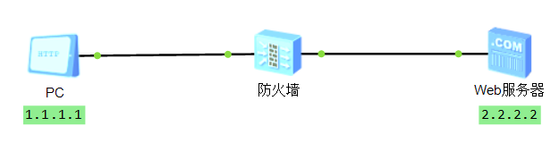

PC访问Web服务器，然后在防火墙上使用**display firewall session table verbose** 命令可以看到会话正常建立，这里我们使用了verbose参数，通过这个参数可以看到会话的更多信息：

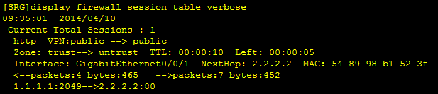

除了我们上次介绍过的五元组信息之外，还有一些之前没见过的信息，我们简单介绍一下：
- Zone：表示报文在安全区域之间流动的方向，图中的信息表示报文是从Trust区域流向Untrust区域。
- TTL：表示该条会话的老化时间，这个时间到期后，这条会话也将会被清除。
- Left：表示该条会话剩余的生存时间。
- Interface：表示报文的出接口，报文从这个接口发出。
- NextHop：表示报文去往的下一跳的IP地址，本网络拓扑中是Web服务器的IP地址。
- MAC：表示报文去往的下一跳的MAC地址，本网络拓扑中是Web服务器的MAC地址。
- <--packets:4 bytes:465：表示会话反方向上的报文统计信息，即Web服务器向PC发送报文的个数和字节数。
- -->packets:7 bytes:452：表示会话正方向上的报文统计信息，即PC向Web服务器发送报文的个数和字节数。

    >在这里强叔要特意提一下，会话中“<--”和“-->”这两个方向上的报文统计信息非常重要，可以帮助我们定位网络故障。通常情况下，我们查看会话时发现只有“-->”方向有报文的统计信息，“<--”方向上的统计信息都是0，那就说明PC发往Web服务器的报文顺利通过了防火墙，而Web服务器回应给PC的报文没有通过防火墙，双方的通信是不正常的。有可能是防火墙丢弃了Web服务器回应给PC的报文、或者是防火墙与Web服务器之间的网络出现故障、或者是Web服务器本身出现故障。这样我们就缩小了故障的范围，有利于快速定位故障。当然，凡事都有例外，在特殊的网络环境中，如果其中一个方向的报文统计信息是0，双方的通信也有可能是正常的，这种特殊的网络环境是什么呢？这里先卖个关子，下面我们会讲到。
 
前面我们说过，如果防火墙没有收到SYN报文，只收到了SYN+ACK或ACK等后续报文，是不会创建会话的，并且会将这些报文丢弃。在正常情况下这样处理是没有问题的，但是在报文来回路经不一致的环境中，就会出现问题。


如上图所示，内部网络访问外部网络的报文直接通过路由器到达外部网络，而外部网络的回应报文，先经过路由器转发到防火墙，由防火墙处理后再转发到路由器，最后由路由器发送到内部网络。也就是防火墙无法收到SYN报文，只收到了SYN+ACK报文。这种通信双方交互的报文不同时经过防火墙的情况，叫做报文来回路经不一致。在这种网络环境中，防火墙收到SYN+ACK报文后，由于没有相应的会话，就会丢弃SYN+ACK报文，导致内部网络和外部网络之间的通信中断。

这种情况下该怎么办呢？别担心，防火墙早已经考虑到这个问题了，我们可以关闭防火墙的状态检测功能。关闭状态检测功能后，对于TCP协议，除了SYN报文之外，SYN+ACK、ACK报文就都可以建立会话了，这样就不会导致通信中断。


下面我们使用eNSP来模拟一个报文来回路径不一致的网络环境，我们让PC访问Web服务器的报文通过路由器直接到达Web服务器，让Web服务器回应给PC的报文将会先转发到防火墙，然后再发送到PC。网络拓扑如下：


首先执行如下命令，开启Trust安全区域到Untrust安全区域的安全策略，允许Web服务器回应给PC的报文通过：

```bash
firewall packet-filter default permit interzone trust untrust direction outbound
```

然后我们先不关闭状态检测功能，让PC访问Web服务器，发现无法成功访问，在防火墙上也无法查看到会话信息：


此时在防火墙上使用 **display firewall statistic system discard** 命令查看丢包的情况，发现存在**Session miss**丢包：

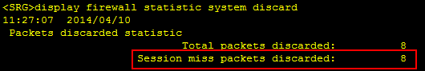

这表示防火墙因为无法找到会话而将报文丢弃。因为防火墙只收到了服务器回应的SYN+ACK报文，没有收到SYN报文，也就没有相应的会话，所以SYN+ACK报文被丢弃。

接下来我们使用 **undo firewall session link-state check** 命令关闭状态检测功能，然后再让PC访问Web服务器，发现可能访问成功，在防火墙上也可以查看到会话信息：

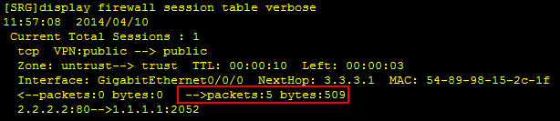

在会话信息中，“<--”方向的统计信息是0，只有“-->”方向存在统计信息，这就说明只有服务器回应的SYN+ACK报文经过了防火墙。由此我们得出结论，关闭状态检测功能后，防火墙收到SYN+ACK报文后也会建立会话，PC和Web服务器之间的通信不会中断。

在报文来回路径不一致的网络环境中，我们在防火墙上关闭状态检测功能后，会话中的一个方向上的报文统计信息是0，此时双方的通信也是正常的，这就是我们上面所说的特殊的网络环境。可见在实际的网络环境中，我们还是要具体情况具体分析。

### UDP
接下来我们看一下UDP协议。UDP协议不同于TCP协议，它是没有连接状态的协议。对于UDP协议，防火墙收到UDP报文后，无论状态检测功能是开启还是关闭状态，只要UDP报文通过了包括安全策略在内的各项安全机制的检查，防火墙都会建立会话。

### ICMP
然后是ICMP协议。一提到ICMP协议，我们首先就会想到Ping。Ping用来测试网络中的另一台设备是否可达，是我们在日常维护中经常会用到的操作。执行Ping操作的一方会发送Ping回显请求报文（Echo request），收到该请求报文后，响应一方会发送Ping回显应答报文（Echo reply）。

对于Ping报文，在开启状态检测功能时，防火墙只有收到Ping回显请求报文，并且Ping回显请求报文通过了包括安全策略在内的各项安全机制的检查后，才会建立会话；如果防火墙没有收到Ping回显请求报文，只收到了Ping回显应答报文，是不会创建会话的，并且会将Ping回显应答报文丢弃。在关闭状态检测功能时，防火墙收到Ping回显请求报文和Ping回显应答报文，都会创建会话。下面是在报文来回路径不一致的网络环境中，防火墙上关闭了状态检测功能后，Ping回显应答报文生成的会话信息：

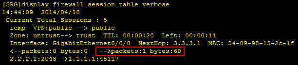

而对于其他类型的ICMP报文，无论状态检测功能是开启还是关闭状态，只要这些报文通过了包括安全策略在内的各项安全机制的检查，防火墙都会转发报文，不建立会话。

最后我们再来总结一下防火墙对TCP、UDP和ICMP协议的报文创建会话的情况，如下表所示。当然，**前提还是这些报文要通过防火墙上包括安全策略在内的各项安全机制的检查**，然后才能执行这些动作。

| 协议 | 协议               | 开启状态检测功能     | 关闭状态检测功能    |
| ---- | ------------------ | -------------------- | ------------------- |
| TCP  | SYN报文            | 创建会话,转发报文    | 创建会话, 转发报文  |
| TCP  | SYN + ACK, ACK报文 | 不创建会话, 丢弃报文 | 创建会话, 转发报文  |
| UDP  | UDP                | 创建会话, 转发报文   | 创建会话,转发报文   |
| ICMP | Ping回显请求报文   | 创建会话,转发报文    | 创建会话, 转发报文  |
| ICMP | Ping回显应答报文   | 不创建会话,丢弃报文  | 创建会话, 转发报文  |
| ICMP | 其他ICMP报文       | 不创建会话,转发报文  | 不创建会话,转发报文 |

另外, 还有一些特殊得报文, 防火墙转发这些报文时不会创建会话, 这些特殊得报文包括:
- RAW IP(即 IP Protocol字段没有值) 报文不创建会话
- OSPF, RIP和ISIS路由协议报文不创建会话
- IGMP(组播)报文不创建会话
- 二层模式下目的MAC为Unkown MAC而需要在VLAN内广播的报文不创建会话

## 当安全策略遇上OSPF
今天，强叔就使用华为防火墙USG9000（软件版本为V300R001）来实际验证一把，看一看当安全策略遇上OSPF路由协议时，会发生什么事情。

需要说明一点，本篇验证的是防火墙本身参与到OSPF路由计算的场景，即验证防火墙接口所在安全区域与Local区域之间是否需要开启安全策略。而防火墙本身不参与OSPF路由计算，只是二层转发OSPF路由报文的场景中，如果防火墙的接口属于不同的安全区域，则需要开启安全区域之间的安全策略，允许OSPF路由报文通过。

我们使用一台USG9000防火墙和两台路由器搭建一个简单的网络环境，网络拓扑如下图所示：

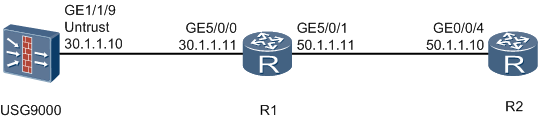

根据下表中的数据，在USG9000上配置接口的IP地址、将接口加入安全区域、开启OSPF功能，以及在路由器R1和R2上配置接口的IP地址、开启OSPF功能。具体配置过程在这里不再赘述。 


默认情况下，防火墙上没有开启GE1/1/9接口所在的Untrust区域和Local区域之间的安全策略，这两个区域之间不允许报文通过。我们在防火墙上使用**display ospf peer**命令查看OSPF的邻接关系：

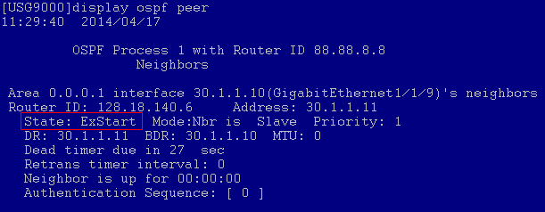

在路由器R1上使用**display ospf peer**命令查看OSPF的邻接关系：

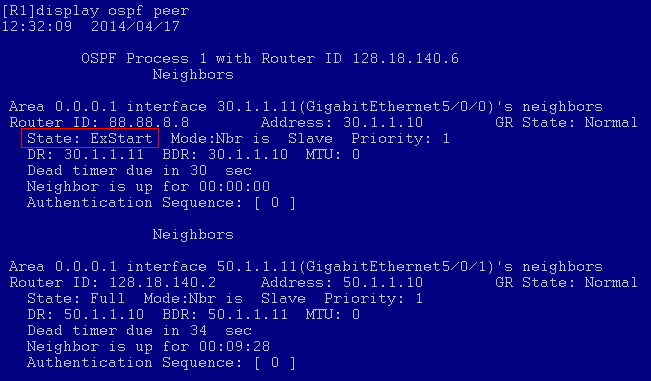

在USG9000和R1上看到的OSPF邻接状态都为ExStart，我们根据下面的OSPF邻接关系建立过程示意图，发现OSPF邻接关系没建立起来，因为USG9000和R1之间没有成功交换DD（Database Description）报文。

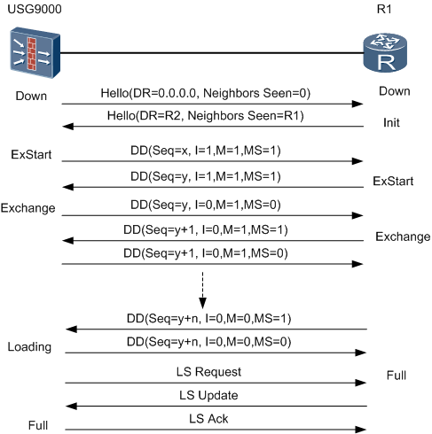

此时，我们怀疑有可能是USG9000丢弃了DD报文。在USG9000上使用**display firewall statistic system discarded**命令查看丢包信息：

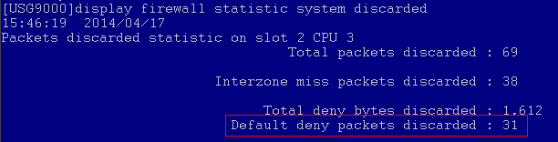

上面的信息表示缺省包过滤将报文丢弃，而且被丢弃报文的个数还在不断增长，说明OSPF模块在不断地尝试发送DD报文，但都被安全策略模块丢弃了。

接下来我们在USG9000上开启Local区域和Untrust区域之间的安全策略，允许OSPF报文通过。注意，因为USG9000既要发送DD报文又要接收DD报文，所以Inbound和Outbound方向上的安全策略都要开启。如下：

强叔提示：这里为了精确匹配OSPF协议，我们使用了系统提供的**ospf**服务集，如果防火墙中没有提供这个服务集，我们可以自己创建一个服务集，协议号设置为89即可。

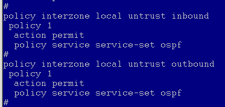

然后分别在USG9000和R1上使用**display ospf peer**命令查看OSPF的邻接关系（可能需要等待几分钟的时间才会出现下面的结果，或者可以使用**reset ospf process**命令重启OSPF进程，就可以很快看到结果）：

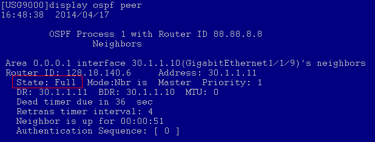

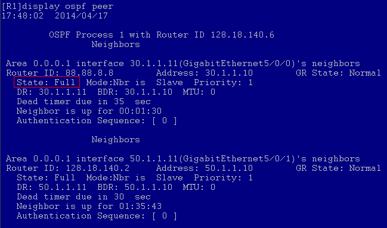

此时可以看到OSPF邻接建立成功，同时USG9000上已经存在了通过OSPF路由协议学习到的去往50.1.1.0这个网段的路由：
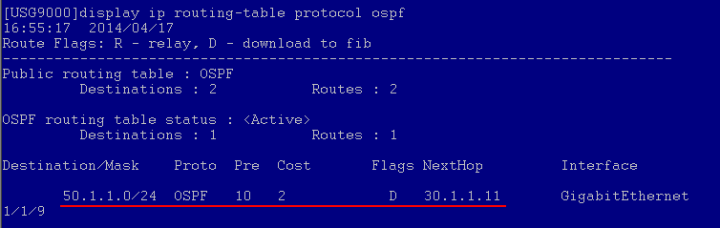

我们来总结一下，对于防火墙USG9000来说，需要开启接口所在安全区域和Local区域之间的安全策略，允许OSPF报文通过，这样防火墙才能和相连的设备正常建立邻接关系。

实际上，我们可以从另外一个角度来考虑这个问题：单播报文和组播报文。对于防火墙来说，一般情况下，单播报文是要经过安全策略的检查，所以需要开启安全策略允许报文通过；而组播报文不经过安全策略的检查，也就不需要开启相应的安全策略。

那么在OSPF中，哪些报文是单播哪些报文是组播呢？不同的网络类型，OSPF报文的发送形式也不相同，如下表所示。

强叔提示：我们可以在接口上执行**ospf network-type**命令来修改OSPF的网络类型。 

| 网络类型 | Hello | Database Description | Link State Request | Link State Update | Link State ACk |
| -------- | ----- | -------------------- | ------------------ | ----------------- | -------------- |
从表中可以看出，网络类型是Broadcast类型时，OSPF报文中的DD报文和LSR报文是单播报文，需要开启安全策略；网络类型是P2P时，OSPF报文都是组播报文，因此无需开启安全策略。NBMA和P2MP类型也是同理。

**最后再次提醒，上面的验证结论基于华为防火墙USG9000 V3R1版本，并不适用于其他型号的防火墙产品。**

## 华为防火墙NAT地址复用专利技术
在《源NAT》一节，强叔提到：“防火墙在应用源NAT功能时就是从地址池中挑选出一个公网IP，然后对私网IP进行转换。**挑选哪个公网IP是随机的，和配置时的顺序、IP大小等因素都没有关系。** ”这其实就是我们看到的外部招式，所谓内功心法不外露的。

那么在进行源NAT时，究竟是怎样从地址池中挑选出公网IP地址资源进行分配的呢？

请允许强叔引入Hash算法的概念，这应该是大家常听说的一种广泛应用于程序编写的方法。一句话解释，就是把一种任意长度的信息进行压缩映射，成为某一固定长度的信息。例如，把3000个私网IP映射成100个公网IP，也就是从地址池挑选出公网IP地址资源进行分配的过程，资料中也偶尔会提到的“基于源地址Hash”。

Hash的具体规则或者说算法是什么呢？很灵活，自行设定，但是根据要达成的目标和计算结果，可以优选。在这里，我们使用的算法也比较简单取模运算。
估计很多不写代码兄弟的数学都已经还给老师了，但是提起求余运算应该都知道，思路如下：

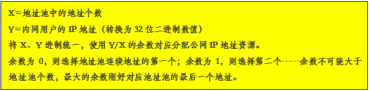

**示例如下:**
```bash
内网用户10.1.1.1-10.10.10.1，NAT地址池202.169.1.1-202.169.1.5
X=5
Y=10.1.1.1
10.1.1.1----->00001010 00000001 00000001 00000001----->167837953
```
不用计算可目测余数为3，选择地址池的第四个资源即202.169.1.4。

至此，内网用户的源IP地址已经可以全部被分配了对应的地址池中的公网IP地址资源，并且保证了每个内网的IP地址每次访问外部网络时始终转换为同一个公网IP地址。

下一步，我们来研究下如何分配端口资源。

其实强叔对于将复杂一点的数学运算表达清楚没有太多信心，决定到最后不得已的时候再引出来，下面端口分配先从防火墙的实现原理讲起，定性区分出端口分配带来的影响。

在《源NAT》一节中，我们已介绍了NAPT情况建立的会话表。

例如，内网10.1.1.1和10.1.1.2用户分别ping 220.180.20.50服务器，在USG上通过公网地址202.169.1.1进行NAT转换，查询会话表显示如下：
```bash
<USG9000> display firewall session table
 Current total sessions:                
 Slot: 5 CPU: 1 
 icmp VPN: public --> public 10.1.1.1:1280[202.169.1.1:10298] --> 220.180.20.50:2048  
 icmp VPN: public --> public 10.1.1.2:1280[202.169.1.1:6103] --> 220.180.20.50:2048  
```

由于内网不同用户的IP地址和端口必不相同，仅使用“源地址+源端口”二元组信息在USG上即可标识一条数据流，来建立正向NAT地址转换。**而进行反向地址还原时，使用“源地址+源端口+目的地址+目的端口+协议”五元组信息唯一标识一条数据流。**

那么，**根据会话表实现机制，只要内网不同用户访问“目的地址+目的端口+协议”三元组中的任一参数不同时，即使将地址池中同一公网地址的同一端口同时分配给内网多个用户时，也不会产生冲突。**

示例如下:

| 编号 | 内网源地址 | 内网源端口 | NAT地址     | NAT端口 | 目的地址      | 目的端口 | 协议 |
| ---- | ---------- | ---------- | ----------- | ------- | ------------- | -------- | ---- |
| 1    | 10.1.1.1   | 80         | 202.169.1.1 | 8080    | www.baidu.com | 80       | http |
| 2    | 10.1.1.2   | 80         | 202.169.1.1 | 8080    | www.sohu.com  | 80       | http |

因此，只要内网不同用户访问“目的地址+目的端口+协议”三元组中的任一参数不同时，唯一的NAT地址和端口可以反复利用，不受65535端口的限制。此时无论端口如何分配，都不会产生问题。

围观兄弟接下来肯定就有问题等着强叔了：在地址池**只有一个公网IP**情况下，如果访问**相同**的“目的地址+目的端口+协议”三元组时怎么办？现实可能就是这么残酷……

在内网不同用户访问相同的“目的地址+目的端口+协议”三元组时，不能被分配给相同的NAT地址和端口资源，这是因为一旦完全相同，访问的目的主机会发现出现同样的“源地址+源端口”访问本主机的同一“目的地址+端口+协议”，目的主机无法正确回应甚至可能会判定为受到攻击。

关键点来了！因此，保证内网不同用户、访问相同的“目的地址+目的端口+协议”三元组时，不能被分配到相同地址的相同端口资源是关键。这就要引入冲突检测机制。

其实在分配端口的法则上，我们仍然使用Hash算法，使得在内存占用合理情况下、尽可能保证被分配到相同公网地址的用户、其被分配的端口尽量不一致，简化的基本思路如下：


**这就保证了，不同内网户访问相同的 “目的地址+目的端口+协议”三元组，不会被分配到相同的NAT地址的端口资源。而且会话表是会实时老化的，被分配过的端口在会话表老化后会重新被利用，因此，概率上端口也不会受到限制。**

除非最极端的情况发生：超过64k的内网用户，同一时刻、向外网同一目的主机的同一端口、采用同样协议发起链接。不过兄弟们觉不觉得很面熟，这看起来就是发起了传统而典型的DDoS攻击了吧-_-

## 配置NAT后为什么要同时配置黑洞路由
在NAT篇和拍案惊奇系列中，强叔多次提到配置NAT的同时要配置黑洞路由，避免路由环路，很多人对此不太理解，今天强叔就来为大家详细介绍其中缘由。

首先我们用eNSP模拟一个典型的源NAT环境：
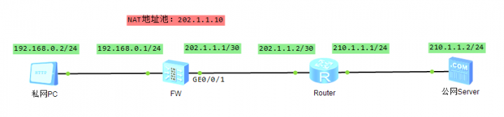

NAT地址池地址是202.1.1.10，防火墙与路由器互联接口地址的掩码是30位，与NAT地址池地址**不在同一网段**。防火墙上配置了一条缺省路由，下一跳是202.1.1.2，这样就能把私网PC访问公网Server的报文送到路由器。为了保证公网Server的回程报文能够顺利到达防火墙，路由器上还要配置了一条到NAT地址池地址的路由。另外，防火墙上的NAT策略和安全策略也都配置完成了，在此不再赘述。

正常情况下，私网PC访问公网上的服务器Server，生成会话表，源地址也进行了转换，一切都没有问题。

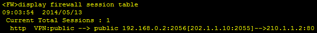

此时，如果公网上的一台PC，主动访问防火墙上的NAT地址池地址，会发生什么情况呢？

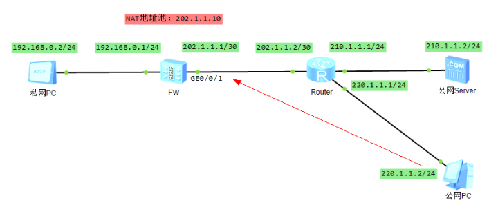

我们在公网PC上执行**ping 202.1.1.10**命令，发现不能ping通：

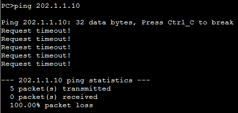

显然，这是正常的结果。因为NAT地址池只有在转换私网地址的时候才会用到，也就是说，私网PC必须先发起访问请求，防火墙收到该请求后才会为其转换地址，NAT地址池地址并不对外提供任何单独的服务。所以当公网PC主动访问NAT地址池地址时，报文到达防火墙后，无法匹配会话表，防火墙肯定就会把报文丢弃了。

但实际情况远没有这么简单，我们在防火墙的GE0/0/1接口抓包，然后再次在公网PC上执行ping 202.1.1.10命令，这次我们使用-c参数，只发送一个ping报文：

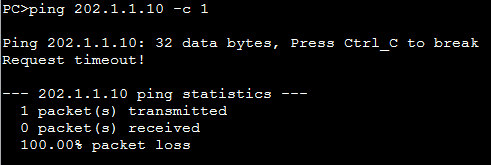

GE0/0/1接口上的抓包信息如下：

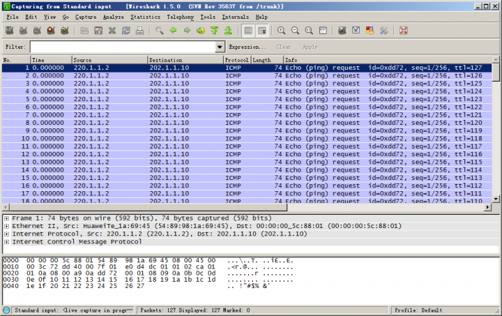

嚯！不看不知道，一看吓一跳，居然抓到了这么多ICMP报文。经过分析发现，报文的TTL值逐一递减，直到变为1。我们都知道，TTL是报文的生存时间，每经过一台设备的转发，TTL的值减1，当TTL的值为0时，就会被设备丢弃。这说明公网PC主动访问NAT地址池地址的报文，在防火墙和路由器之间相互转发，直到TTL变成0之后，被最后收到该报文的那台设备丢弃。


我们来梳理一下整个过程:
1. 路由器收到公网PC访问NAT地址池地址的报文后，发现目的地址不是自己的直连网段，因此查找路由，发送到防火墙。
2. 防火墙收到报文后，该报文不属于私网访问公网的回程报文，无法匹配到会话表，同时目的地址也不是自己的直连网段（防火墙没有意识到该报文的目的地址是自己的NAT地址池地址），只能根据缺省路由来转发。因为报文从同一接口入和出，相当于在同一个安全区域流动，缺省情况下也不受安全策略的控制，就这样报文又从GE0/0/1接口送出去了。
3. 路由器收到报文后，查找路由，还是发送至防火墙，如此反复。这个可怜的报文像皮球一样被两台设备踢来踢去，最终被残忍丢弃，憾别网络。。。。。

下面我们来看一下配置了黑洞路由的情况。首先在防火墙上配置一条目的地址是NAT地址池地址的黑洞路由，为了避免这条黑洞路由影响其他业务，我们将掩码配置成32位，精确匹配202.1.1.10这个地址：
```bash
[FW] ip route-static 202.1.1.10 32 NULL 0
```
然后在防火墙的GE0/0/1接口上开启抓包，在公网PC上执行**ping 202.1.1.10 -c 1**命令，还是只发送一个ping报文，查看抓包信息：

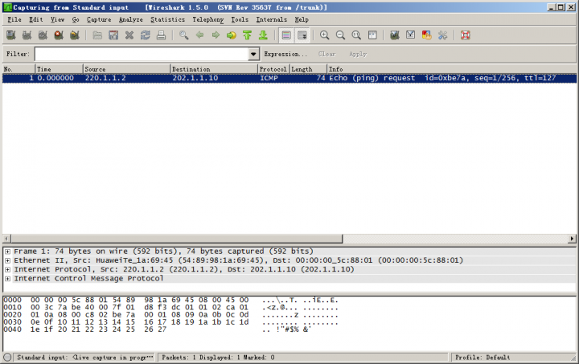

只抓到了一个ICMP报文，说明防火墙收到路由器发送过来的报文后，匹配到了黑洞路由，直接将报文丢弃了。此时就不会在防火墙和路由器之间产生路由环路，即使防火墙收到再多的同类报文，都会送到黑洞中，一去不复返。并且，这条黑洞路由不会影响正常业务，私网PC还是可以正常访问公网Server。

到这里大家可能会问了，没有配置黑洞路由时，报文最终也会被丢弃，没啥问题啊？上面我们只是用了一个ping报文来演示这个过程，试想一下，如果公网上的捣乱分子利用成千上万的PC主动向NAT地址池地址发起大量访问，无数的报文就会在防火墙和路由器之间循环转发，占用链路带宽资源，同时防火墙和路由器将会消耗大量的系统资源来处理这些报文，就可能导致无法处理正常的业务。

所以，**当防火墙上NAT地址池地址和公网接口地址不在同一网段时，必须配置黑洞路由，避免在防火墙和路由器之间产生路由环路。**

那么如果NAT地址池地址和公网接口地址在同一网段时，还会有这个问题吗？我们再来验证一下。

首先，将防火墙和路由器互联的两个接口的掩码修改为24位，这样接口地址和NAT地址池地址就在同一网段了，然后去掉黑洞路由的配置，接下来在防火墙的GE0/0/1接口抓包，在公网PC执行**ping 202.1.1.10 -c 1**命令，查看抓包信息：

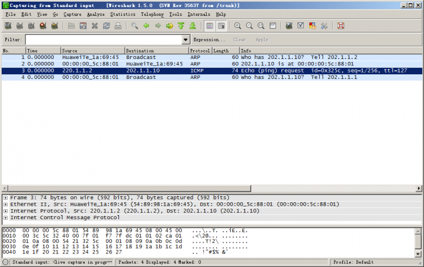

我们发现，只抓到了三个ARP报文和一个ICMP报文，公网PC访问NAT地址池地址的报文没有在防火墙和路由之间相互转发。梳理整个过程：
1. 路由器收到公网PC访问NAT地址池地址的报文后，发现目的地址属于自己的直连网段，发送ARP请求，防火墙会回应这个ARP请求，前两个ARP报文就是来完成了这一交互过程的。然后路由器使用防火墙告知的MAC地址封装报文，发送至防火墙。
2. 防火墙收到报文后，发现报文的目的地址和自己的GE0/0/1接口在同一网段，直接发送ARP请求报文（第三个ARP报文），寻找该地址的MAC地址（防火墙依然没有意识到该报文的目的地址是自己的NAT地址池地址）。但是网络中其它设备都没有配置这个地址，肯定就不会回应，最终防火墙将报文丢弃。

所以说，在这种情况下不会产生路由环路。但是如果公网上的捣乱分子发起大量访问时，防火墙将发送大量的ARP请求报文，也会消耗系统资源。所以，**当防火墙上NAT地址池地址和公网接口地址在同一网段时，建议也配置黑洞路由，避免防火墙发送ARP请求报文，节省防火墙的系统资源。**

下面是配置黑洞路由后的抓包信息，可以看到，防火墙没有再发送ARP请求报文：

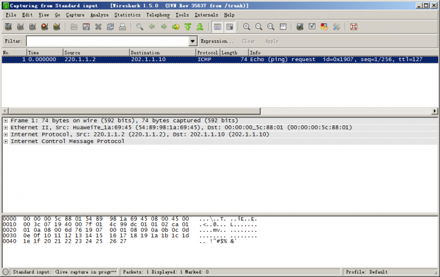

还有一种极端情况，我们配置源NAT时，可以直接把公网接口地址作为转换后地址（easy-ip方式），也可以把公网接口地址配置成地址池地址。这样，NAT转换使用的地址和公网接口地址就是同一个地址了。在这种情况下，需要配置黑洞路由吗？我们来分析一下整个流程：防火墙收到公网PC的报文后，**发现是访问自身的报文**，这时候就取决于公网接口所属安全区域和Local安全区域之间的安全策略，安全策略允许通过，就处理；安全策略不允许通过，就丢弃。不会产生路由环路，也不需要配置黑洞路由。

看到这里，聪明的小伙伴肯定会问，NAT Server有没有这个问题啊？强叔告诉大家，NAT Server也存在路由环路的问题，不过发生路由环路的前提条件比较特殊，要看NAT Server是怎样配置的。下面是一个典型的NAT Server组网环境，我们先来看一下NAT Server的Global地址和公网接口地址不在同一网段的情况。

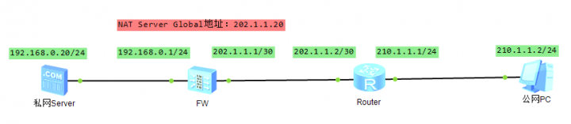

如果我们在防火墙上配置了一条粗狂型的NAT Server, 将私网Server全部发布到公网, 如:
```bash
[FW] nat server global 2002.1.1.20 inside 192.168.0.20
```
公网PC访问202.1.1.20的报文, 目的地址都会被转换成192.168.0.20, 然后发送给私网Server, 这个时候自然不会产生路由环路.

但是如果我们配置了一条精细化的NAT Server, 只把特定的端口发布到公网上，如：
```bash
[FW] nat server protocol tcp 202.1.1.20 80 inside 192.168.0.20 80
```
此时如果公网PC不按常理出牌, 没有访问202.1.1.20的80端口, 而是使用ping命令访问202.1.1.20, 防火墙收到该报文后, 既无法匹配Server-map表, 也无法匹配会话表, 就只能查找路由转发, 从GE0/0/1接口发出去. 而路由器收到报文后, 还是要送到防火墙,这样依然会产生路由环路

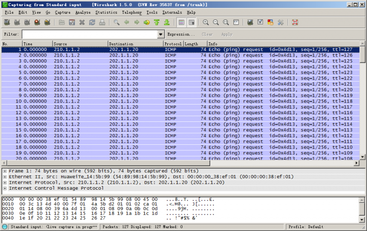

所以，**当防火墙上配置了特定协议和端口的NAT Server并且NAT Server的Global地址和公网接口地址不在同一网段时，必须配置黑洞路由，避免在防火墙和路由器之间产生路由环路。**

如果NAT Server的Global地址和公网接口地址在同一网段, 防火墙收到公网PC的ping报文后, 会发送ARP请求报文, 这个过程就和前面讲过的NAT的情况是一样的。同理，**当防火墙上配置了特定协议和端口的NAT Server并且NAT Server的Global地址和公网接口地址在同一网段时，建议也配置黑洞路由，避免防火墙发送ARP请求报文，节省防火墙的系统资源。**

同样，我们配置NAT Server时，也可以把公网接口地址配置成Global地址。此时，防火墙收到公网PC的报文后，如果能匹配上Server-map表，就转换目的地址，然后转发到私网；如果不能匹配上Server-map表，就会**认为是访问自身的报文**，由公网接口所属安全区域和Local安全区域之间的安全策略决定如何处理。不会产生路由环路，也不需要配置黑洞路由。

讲到这里，相信大家一定明白了配置黑洞路由的原因，是不是感觉内功又提升了啊~~我们再总结一下，对于源NAT来说
- 如果NAT地址池地址与公网接口地址不在同一网段，必须配置黑洞路由；
- 如果NAT地址池地址与公网接口地址在同一网段，建议也配置黑洞路由。

对于配置了特定协议和端口的NAT Server来说：

- 如果NAT Server的Global地址与公网接口地址不在同一网段，必须配置黑洞路由；
- 如果NAT Server的Global地址与公网接口地址在同一网段，建议也配置黑洞路由。

#### 【扩展阅读】
除了防止路由环路、节省设备的系统资源，其实黑洞路由还有一个作用，那就是在防火墙上引入到OSPF中，发布给路由器。

我们知道，当NAT地址池地址或NAT Server的Global地址与防火墙和路由器互联接口的地址不在同一网段时，需要在路由器上配置到NAT地址池地址或NAT Server的Global地址的静态路由，保证路由器可以把去往NAT地址池地址或NAT Server的Global地址的报文发送到防火墙。

如果防火墙和路由器之间运行OSPF协议，那么就可以通过OSPF协议来学习路由，减少手动配置的工作量。但是NAT地址池地址和NAT Server的Global地址不同于接口地址，无法在OSPF中通过network的方式发布出去，那么路由器如何才能学习到路由呢？

此时就可以通过在防火墙的OSPF中引入静态路由的方式，把黑洞路由引入到OSPF中，然后通过OSPF发布给路由器。这样，路由器就知道了去往NAT地址池地址或NAT Server的Global地址的报文都要发送到防火墙上（注意，是发送到防火墙，而不是发送到黑洞中）。

以NAT Server的组网为例，NAT Server的Global地址和公网接口地址不在同一网段，防火墙和路由器都运行OSPF协议，在防火墙上的OSPF中引入静态路由：
```bash
#
ospf 100
 import-route static
 area 0.0.0.0
  network 202.1.1.0 0.0.0.3
#
```

这时路由器就可以学习到去往NAT Server的Global地址的路由：

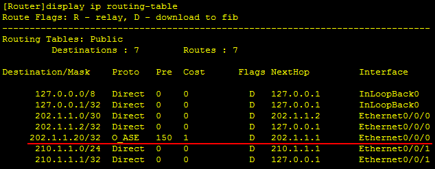

## 防火墙报文处理流程简介
### 华为大同：全系列状态检测防火墙报文处理流程
状态检测与会话机制是华为防火墙对报文处理的关键点：即防火墙收到报文后，何时、如何创建会话、命中会话表的报文被如何转发。那么可以此关键点为界线延伸，我们将报文经防火墙处理分为查询会话表前、中、后三个阶段，参见如下USG5500报文处理全景图。友情提醒：图很复杂，对三个阶段有印象即可，重点看图下的文字拆解吧。

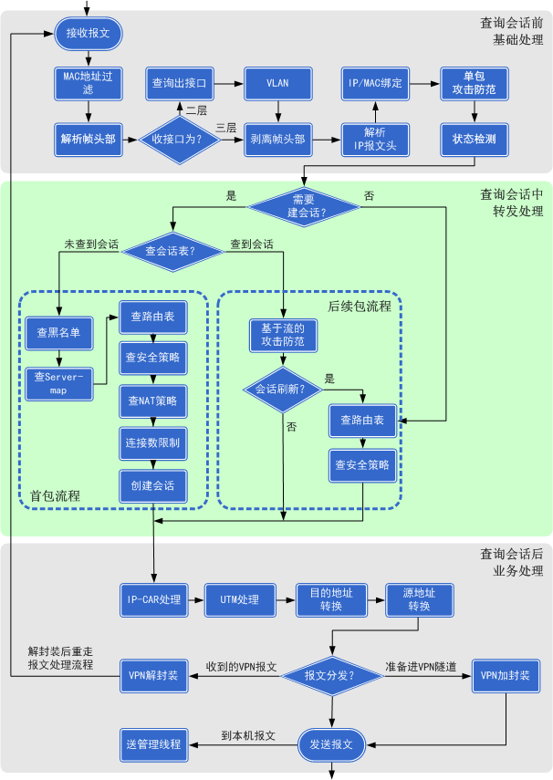

我们来进一步介绍下每个阶段的目的和处理过程。
#### 1. 查询会话之前的处理过程：基础处理。

这个阶段的主要目的是解析出报文的帧头部和IP报文头部，并根据头部当中的信息进行一些基础的安全检测（单包攻击防范）。

#### 2. 查询会话的处理过程：转发处理，关键是会话建立。

这个阶段到了防火墙对报文转发处理的核心。建立会话表，根据会话表转发报文，是状态检测防火墙的精髓。此部分要梳理清楚思路，耗费很多笔墨，还请小伙伴们耐心观看。


报文到此阶段，防火墙最先判断该报文是否要创建会话。
1. OSPF、IGMP组播报文等一些协议报文是不创建会话的，那么这些报文就会去直接查路由和安全策略。
1. 而TCP首包、UDP等报文都需要创建会话，那么判断该报文要创建会话后，接下来马上查询会话表中是否已经创建了该报文的会话。
 - A. 对于会话表中不存在匹配任一表项的报文，防火墙判断该报文为某一流量的首包，进行**首包处理流程**。
 - B. 对于会话表中存在匹配表项的报文，防火墙判断该报文为某一流量的后续包，进行**后续包处理流程**。

这也是强叔在《状态检测和会话机制》一节中提到的“为数据流的第一个报文建立会话，数据流内的后续报文直接根据会话进行转发，提高了转发效率。”

##### 首包处理流程要点：
1. 先使该报文与黑名单匹配，若报文源地址命中黑名单，则此报文被丢弃，不再继续后续流程。
2. 查询该报文是否命中正反向Server-map表，**若报文命中Server-map表，记录Server-map表中的信息**。

    防火墙上配置NAT Server、NAT No-pat、三元组NAT、ASPF等功能，会生成Server-map表：

    - NAT Server：配置完成后防火墙上直接生成Server-map表。若报文匹配该Server-map表，刚记录Server-map表中转换后目的IP地址和端口信息，并根据该记录继续后续流程。

    - NAT No-pat：匹配该NAT No-pat策略的报文，会触发生成Server-map表。后续报文（这里的后续报文不是首包/后续包概念中的后续包，是这个业务的后续报文）查询该Server-map表，记录转换后目的IP地址和端口信息，并根据该记录继续后续流程。

    - 三元组NAT：匹配该三元组NAT策略的报文，会触发生成Server-map表。后续报文（同上）查询该Server-map表，记录转换后目的IP地址和端口信息，并根据该记录继续后续流程。这块还要分情况对待，匹配Server-map表的报文受不受安全策略控制是由firewall endpoint-independent filter enable命令决定的
    - ASPF：在安全域间或域内，针对特定业务配置ASPF功能后，防火墙会对业务报文进行检测，检测到的报文会触发生成Server-map表。后续报文（同上）查询该Server-map表，命中该表的报文，不再进行安全策略匹配，直接按该表信息创建新会话。

3. 继续根据（2）的记录结果，查询命中哪条路由，优先查询策略路由。若未命中策略路由，则查询正向路由表，决定报文的下一跳和出接口。
4. 查询是否命中安全策略，已知报文入接口源地址、判断出报文出接口后，可以查询到该出入接口所在安全区域的安全策略配置，若报文没有匹配到安全策略或匹配到安全策略中定义为“阻断”的规则，则报文被丢弃，不再继续后续流程；若报文匹配安全策略中定义为“允许”的规则，则继续后续流程。
5. 查询是否命中源NAT策略，若报文匹配到一条源NAT策略，则记录NAT转换后的源IP地址和端口信息。
6. 顺利通过安全策略匹配检查后，终于走到这一步：根据上述记录结果，创建会话。

##### 后续包处理流程：
很简单，判断会话是否需要刷新。当为首包创建会话的各表项和策略（如路由表、安全策略）变化时，会话需要刷新。若需要则继续查询路由、查询安全策略，若不需要直接进行后续阶段处理。
- 强叔在开篇中提到防火墙与路由器的区别，对于路由器来说可说是使出浑身解数（通过路由表）将报文转发出去，而对于防火墙来说要作为守护神坚决阻挡非法报文（只有通过各种安全检查建立会话表才可能被转发）。所以防火墙丢弃一些报文是正常的处理流程，包括第一阶段的解决IP报文头、单包攻击，第二阶段的黑名单、安全策略，第三阶段的UTM处理、限流等等，是报文的主要丢弃点。
- 进行故障定位时，防火墙上是否创建了指定某条流量的会话，是定位要考虑的关键界线。若未创建会话，则考虑是报文是否到达设备、接口丢包、命中黑名单或安全策略、无路由、或NAT等配置出现问题；而存在会话，则向后续的安全业务处理阶段考虑。

#### 3. 查询（或创建或刷新）会话的处理过程：进行实质各安全业务处理、及之后的报文去向。
报文在首包处理流程中经一通查询、创建会话后，就与后续包处理流程殊途同归了，即都进入第3阶段。

此阶段首先进行基于IP的限流、IPS等UTM业务处理，报文顺利通过检查之后，到了实质性的地址转换：根据已创建的会话表，进行目的地址转换、源地址转换。

这个目的地址转换、源地址转换对应配置就是NAT Server、源NAT策略等NAT功能，对应报文则是在第2阶段首包流程中已经经过一通查询并创建了会话表。

那么，如果想要在此阶段能够准确地对报文进行源地址转换，有两个常见的points需要关注：
1. 报文在前面流程中是否命中了Server-map表，尤其是反向Server-map表，若已经命中，那么报文会根据反向Servermap表进行源地址转换，不会再往后匹配源NAT策略了。
2. 报文在后续流程中是否计划要进行VPN加封装，如果在此时定义该条数据流进行了NAT转换，那么后续就无法进入VPN协商流程了。

而按计划进行目的地址转换问题不大，一般是配置NAT Server，其报文处理优先级很高，报文走入歧途可能性就小。

最后，该转换转换，该过滤过滤，一切安全业务流程顺利通过后，报文终于到了分发十字路口：
- 如ping、OSPF等路由协议报文是要到防火墙本身，会被上送至管理层面处理；
- 如VPN报文（防火墙为隧道终点，收到VPN报文）就会被解封装、并在解封装后重走一次上述1、2、3流程；
- 如准备进入VPN隧道的报文（防火墙为VPN隧道起点）就会被进行VPN封装等等。
### 求同存异：集中式与分布式防火墙差异对报文处理流程影响 
防火墙大同的报文处理流程介绍完毕，我们来看一下集中式与分布式架构的区别会导致哪些差异。
- 对于集中式低端防火墙，来往报文会被上送至一个集中的CPU模块（可能由多个CPU组成）进行处理。

    集中式防火墙一般为盒式设备，可以插接多种扩展接口卡，但设备的总机性能恒定，即取决于该设备配置的CPU模块处理能力。上述介绍的USG5500产品报文处理流程即为其全部流程。

- 对于分布式高端防火墙，对报文的处理就会比较复杂，有多种情况，上述介绍的报文处理流程是其中一个最核心的子集―SPU板业务处理流程。

分布式防火墙一般为框式设备，以USG9000来说，由两块标配主控板MPU、交换网板SFU、接口板LPU、业务板SPU组成，其中LPU与SPU的槽位可混插，客户按需购买。相比集中式防火墙，分布式防火墙由各种单板组成，每种单板各司其责。
- 主控板MPU：主要负责系统的控制和管理工作，包括路由计算、设备管理和维护、设备监控等。
- 交换网板SFU：主要负责各板之间数据交换。
- 接口板LPU：主要负责接收和发送报文，以及QoS处理等。
- 业务板SPU：主要负责防火墙的安全业务处理，包括安全策略、NAT、攻击防范、VPN等。设备总机性能随插接SPU板的数量增加而线性增加，这是分布式防火墙的特性和价值所在。

那么我们来看一下，各类报文在分布式高端防火墙上是如何被处理的：


已经提到①②是防火墙业务处理的核心，也正是防火墙的安全防护价值所在。③④多用于设备管理、定位故障；⑤⑥多用于网络互联如路由学习。

还有一个更复杂的问题：当一台分布式防火墙配置多个业务板时，报文经过接口板处理后，会被送至哪个业务板呢？如上图中的①②③④报文都会经业务板处理，那么会被送至SPU1还是SPU2呢？
这时会有选择“由哪块SPU板进行业务处理”的动作，即USG9000产品文档中提到的hash选板。默认配置是根据报文的源+目地址经过运算选择。----由于配置了多个SPU板，业务可能在防火墙多个业务板分别建立会话。
例如，以PC访问Web服务器来说，假设PC发往Web服务器在业务板SPU1上建立了会话，而Web服务器的回应报文可能会由业务板SPU2处理。一句话就是请求报文与回应报文有可能被分配到防火墙的不同业务板处理。那么可能会产生一个问题：由于请求报文基于业务板SPU1建立了会话，而回应报文查不到反向会话被丢弃。实际上，USG9000在建立业务板的会话表时，同时会进行hash预测，准确预测回应报文会被哪块业务板处理，在该业务板上同步建立起一条反向会话，保证回应报文能够被正确转发。当然，正反向会话间会定时同步，保证同步老化、统计报文信息等等。


### 配置实例：与防火墙报文处理流程相关的配置技巧
下面我们以实例来说明，熟悉防火墙报文处理流程，不需要再死记配置限制，而是根据逻辑直接判断如何正确配置。
#### 例1，当安全策略遇上NAT Server。
在eNSP模拟器上，PC1（1.1.1.2）----防火墙USG5500----FTP服务器（192.168.1.2）简单组网，在防火墙上配置NAT Server，将FTP服务器地址转化为与PC同一网段的地址，配置如下：
```bash
[USG5500] nat server 0 global 1.1.1.5 inside 192.168.1.2
```
若希望PC1及其他多个PC能且只能访问该FTP服务器，应该如何配置严格的安全策略？实际是基于固定的目的地址配置安全策略问题。

分析：根据防火墙报文处理流程，先进行NAT Server转换、查询Server-Map表，再进行安全策略处理。那么，该固定的目的地址，应配置为该FTP服务器的真实地址（即inside地址）。
```bash
[USG5500] dis cu | include policy 
policy interzone trust untrust inbound   
 policy 0        
  policy destination 192.168.1.2 0.0.0.0   
```
验证如下:
1. 关闭防火墙所有域间缺省包过滤, 只保留上述在 trust与 untrust域间配置的该条安全策略
2. 在PC远程访问FTP服务器, 可以成功看到FTP服务器的文件列表

    

3. 查看防火墙USG5500会话表，可以看到FTP服务器已经做了NAT Server，且FTP控制通道与数据通道均已建立。

    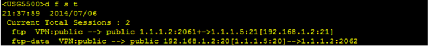

    结论：根据防火墙报文处理流程，先查询Server-Map表，根据查询的记录结果再进行安全策略处理。当需求为允许多个外网客户端访问经过NAT Server转换的服务器时，安全策略配置允许到达的目的地址为该服务器的内网真实地址，而非NAT Server的global地址。


#### 例2，当源NAT遇上NAT Server。
某公司分部与总部通过Internet进行IPSec互联：
- 总部用户（192.168.1.0/24）访问Internet时经过源NAT转换、而与分部通信时不进行源NAT转换
- 总部部署了一台HTTP Server（192.168.1.2）对外提供服务时配置了NAT Server

分部可以访问总部HTTP Server的私网地址，总部192.168.1.0/24网段也能正常和分部的10.0.0.0/24网段通信。总部HTTP Server却无法访问分部10.0.0.0/24网段的资源，删除NAT Server后就能正常访问。

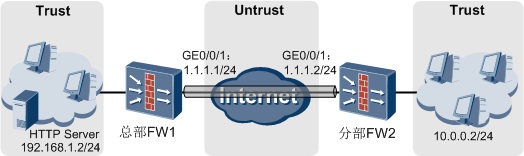

FW（总部）关键配置如下：
```bash
#
acl number 3000
  rule 5 permit ip source 192.168.1.0 0.0.0.255 destination 10.0.0.0 0.0.0.255
#  
ipsec policy map1 10 manual
security acl 3000
proposal tran1
#
nat-policy interzone trust untrust outbound
  policy 0      //访问分部的流量不做源地址转换//
  action no-nat
  policy source 192.168.1.0 mask 24
  policy destination 10.0.0.0 mask 24  
policy 5      //总部员工上网进行源NAT转换//
  action source-nat
  policy source 192.168.1.0 mask 24
  easy-ip GigabitEthernet0/0/1
#
nat server protocol tcp global 1.1.1.1 9980 inside 192.168.1.2 80
```
分析：防火墙上涉及HTTP Server的配置如下：
1. NAT Server，将HTTP Server的私网192.168.1.2：80映射成为1.1.1.1：9980
2. 源NAT，策略定义192.168.1.0网段去往分部不进行源NAT转换

查看防火墙的Server-map表：

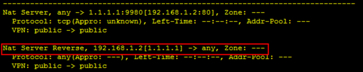

NAT Server转换成功，生成正反向Server-map表。且按照反向Server-map表含义，当该HTTP Server主动访问网络时，亦进行NAT Server转换。根据防火墙报文处理流程，优先查询正反向Server-map表，命中反向Server-map表后，不再匹配源NAT策略。因此总部HTTP Server却无法访问分部10.0.0.0/24网段的资源。

这个问题的解决办法是，配置NAT Server时增加no-reverse参数，要求不生成反向Server-map表，这样总可以继续查询NAT策略，使该HTTP Server可以正常访问分部资源。

结论：**上述报文处理流程第3阶段时已进行提醒，进行源NAT处理时，注意报文在前面流程中是否命中了Server-map表，尤其不要忽略反向Server-map表，如果已经命中，此时源NAT处理不会再生效**。

## 证书浅析
### 根基--公钥密码学
在介绍证书之前，我们先来了解一些密码学的基本概念，包括对称密码学和非对称密码学，为理解证书的实现原理打好基础

首先，一提到加密，我们自然会想到通信双方使用**相同的算法和密钥去加密和解密数据**。加密和解密过程中用到的密钥是双方都知道的，即双方的“共享密钥”。这种加密方式称为**对称密码学**，也叫做单钥密码学。

如下图所示，A向B发送数据，A使用双方事先协商好的算法和密钥来加密数据，B使用相同的算法和密钥来解密数据。反之同理，B向A发送数据时，B加密数据而A解密数据，双方使用的都是相同的算法和密钥。

>注意：我们用“算法[密钥]”来表示使用该算法和密钥对数据进行加密或解密处理，下文中出现的类似表达方式含义相同。

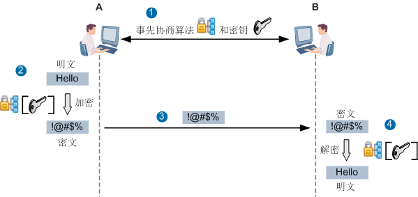

对称密码学的优点是效率高，开销小，适合加密大量的数据。但对称密码学要求通信双方事先协商好密钥，这就要求在协商过程中必须做好保密，密钥只能让使用的人知道，不能泄露。另外，如果通信方数量庞大，比如A需要和数百个对象通信，为了安全起见，就需要在A上维护数百个不同的共享密钥，这就为密钥更新和管理带来诸多不便。

为了解决对称密码学面临的问题，公钥密码学横空出世，开创了密码学的新方向。**公钥密码学使用了两个不同的密钥：一个可对外界公开，称为“公钥”；一个只有所有者知道，称为“私钥”。** 这一对密钥具有如下特点：
- 用公钥加密的信息只能用相应的私钥解密，反之用私钥加密的信息也只能用相应的公钥解密，即用其中任一个密钥加密的信息只能用另一个密钥进行解密。
- 要想由一个密钥推出另一个密钥，在计算上是不可能的。

由于公钥密码学使用了两个不同的密钥，所以属于非对称密码学，也称为双钥密码学。目前常用的公钥密码学算法有以下几种：
- RSA（Rivest, Shamir and Adleman），这个由三位发明者名字命名的算法是当前最著名、应用最广泛的公钥密码学算法。RSA可实现**数据加解密、真实性验证和完整性验证**。
- DSA（Digital Signature Algorithm），中文名称叫数字签名算法，可实现签名功能。本篇对DSA不做过多的介绍，大家可以自行查阅相关资料。
- DH（Diffie-Hellman），也是由发明者名字命名的一种密钥交换算法，通信双方通过一系列的数据交换，最终计算出密钥，以便用于以后的报文加密。在IPSec中就用到了DH算法，使得建立IPSec隧道的两端网关设备可以计算出密钥，而不必担心密钥泄露，我们在IPSec篇中对此进行过介绍。

#### 数据加解密
下面我们就以RSA算法为例，介绍通信双方如何实现数据加解密功能。如下图所示，A和B各自生成自己的公钥和私钥，并且相互交换了双方的公钥（至于双方是通过什么途径来交换公钥，我们先留个伏笔，后面会讲到）。A要向B发送数据，**A使用B的公钥加密数据然后发送给B，B收到后使用自己的私钥解密数据。** 因为其他人没有B的私钥，即使截获报文也无法解密，这就保证了数据传输的安全性。B向A发送数据时，过程同理。

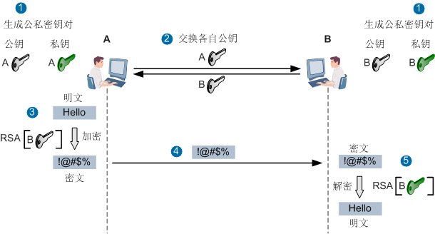

与对称密码学相比，公钥密码学加密数据的计算非常复杂，而且开销大、速度较慢，所以不适用于加密大量数据的场景。在实际使用中，**通信双方通常会使用公钥密码学来交换密钥素材，双方最终计算出密钥，而用对称密码学来加密实际的数据**，两者配合使用，保证了加密速度和安全性。

如下图所示，A向B发送数据，A使用B的公钥把加密算法和密钥素材加密后发给B，B收到后使用自己的私钥解密，这样就得到了算法和密钥素材（B也可以将自己要采用的算法和密钥素材发给A，即双方通过协商方式来确定算法和密钥素材），双方根据密钥素材计算出密钥。然后就可以通过对称密码学的机制，使用相同的算法和密钥对数据进行加密和解密

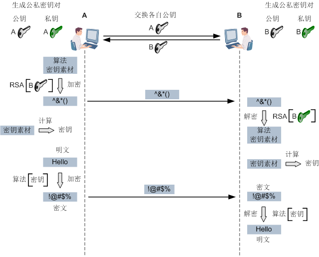

#### 真实性验证
除了加解密，RSA还能实现真实性验证，即身份认证功能，这也是利用了公钥密码学中由任一个密钥加密的信息只能用另一个密钥进行解密这一原理。

如下图所示，A要认证B的身份，首先A向B发送数据（例如一串字符串），B用自己的私钥将数据加密，然后发送给A。A用自己所持有的B的公钥解密，将解密后的数据和原始数据进行对比，如果一致，说明数据的确是由B发过来的。因为B的私钥只能由B持有，因此A可以通过判断对方是否持有私钥来判断对方是否就是B，进而实现了对B的身份认证，这就是使用公钥密码学来进行身份认证的理论基础。

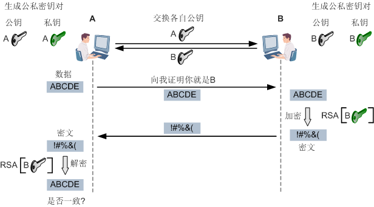

加解密功能是数据发送方使用接收方的公钥加密，接收方使用自己的私钥解密。而身份认证功能是被认证方使用自己的私钥进行加密，认证方使用被认证方的公钥进行解密。

#### 完整性验证
使用私钥加密公钥解密这种方式，还能实现完整性验证，即签名功能。所谓签名，就是在数据的后面再加上一段内容，可以证明数据没有被修改过，那怎么样生成签名呢？

发送方可以用自己的私钥加密数据，然后连同数据一起发给接收方。但是，由于公钥密码学计算复杂、速度慢的原因，通常发送方一般不直接使用私钥加密数据，而是先将原始数据经过某种计算得出一段较短的数据，然后发送方使用自己的私钥加密这段新的数据，这和直接加密原始数据的效果是一样的，而且还兼顾了安全和处理速度。这种计算方式是通过HASH密码学来实现的。

HASH密码学可以将任意长的字符串通过哈希计算出固定长度字符串，并且该计算是单向运算，无法逆推。最重要的是，**原字符串任意字符的变化都会导致不同的计算结果**。HASH计算后得出的信息通常称为原字符串的摘要信息，也可以称为指纹信息。**通过对比摘要信息，就可以判断数据是否被修改，所以HASH密码学通常用于保证数据的完整性。** 常见的HASH算法有MD（Message Digest algorithm）系列、SHA（Secure Hash Algorithm）系列等，之前在IPSec篇中我们也都配置过这些算法。

如下图所示，A向B发送数据之前，先使用HASH算法将数据进行HASH计算，得出摘要信息。然后使用自己的私钥将摘要信息加密，形成签名，最后将数据和签名一并发给B。B收到后，使用相同的HASH算法也对数据进行HASH计算，得到摘要信息；然后B使用A的公钥对签名进行解密，得到另一个摘要信息。B将两个摘要信息进行对比，如果两者一致，就说明数据确实是从A发过来的，并且没有被修改过，这样既验证了A的身份又实现了数据完整性保护。


>注意：为了便于讲解，图中A发给B的信息没有加密，实际情况下，A会使用通过计算得出的密钥将信息加密后再发给B，B使用相同的密钥解密后再进行处理。

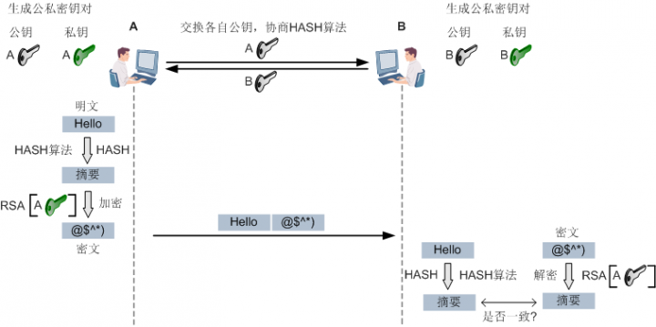

我们花费了一些笔墨介绍公钥密码学的原理，相信大家对公钥密码学已经有了初步的了解。必须强调一点，公钥密码学能够保证安全的重要前提是**私钥必须得到安全妥善的保存**，不能被泄露。接下来我们便要解决前面留下的问题，即通信双方是通过什么途径来获取到对方的公钥。

通常情况下，通信双方在每次通信时都把自己的公钥发给对方，这是最直接的方法。但是这种方法存在安全问题，因为谁都可以生成公钥和私钥，仅凭一个公钥，我们无法判断收到的公钥到底是不是对方的。除非对方把公钥和身份信息同时发送过来，并且有绝对可信的第三方做担保，证明这个公钥确实是发送方的。也就是说，通信双方就需要一个安全可信的载体来交换公钥，这个载体就是证书。

### 载体 ---证书
证书，也叫做数字证书，是网络世界中的“身份证”。证书将持有者的身份信息和公钥关联到一起，保证公钥确实是这个证书持有者的，通过证书就可以确认持有者的身份。证书由权威的、公正的、可信任的第三方机构颁发，我们把证书的颁发机构称为CA（Certificate Authority），相当于现实生活中的公安局。

#### 证书属性
公钥是通过证书来向外界公开分发的，证书中必然会含有持有者的公钥信息。除此之外，证书中还包括哪些信息呢？下图展示了一个遵循X.509 v3版本规范的证书格式，我们简要介绍一下其中的关键信息。

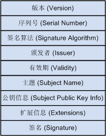

- 签名算法：生成该证书的签名时所使用的HASH密码学算法和公钥密码学算法。
- 颁发者：谁颁发了这个证书，即CA的名称。
- 主题：该证书时颁发给谁的，即证书持有者的名称。
- 公钥信息：证书持有者的公钥信息。
- 签名：CA对该证书的签名，又叫做CA的指纹信息。

下图展示了证书中签名的形成过程，操作都是在证书颁发之前，也就是在CA上来进行的。首先，CA使用签名算法中的HASH密码学算法（如SHA1）生成证书的摘要信息，然后使用签名算法中的公钥密码学算法（如RSA），配合CA自己的私钥对摘要信息进行加密，最终形成签名。

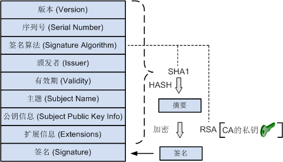

#### 证书颁发
通常情况下，为网络中的设备（PC、防火墙等）申请证书时，我们先要在设备上生成公私密钥对，然后将公钥以及设备信息提供给CA，CA根据这些信息来生成证书。当然，也可以由CA来帮助设备生成公私密钥对，并为设备生成证书。然后将CA生成的公私密钥对和证书导入到设备中，省去了设备自己生成公私密钥对的过程。

CA生成证书后，会把证书以文件的形式颁发给使用者。常见的证书存储格式如下表所示。

| 证书格式 | 证书存储格式                                      |
| -------- | ------------------------------------------------- |
| DER      | 二进制编码, 后缀名 .der/.cer/.crt<br/> 不包含私钥 |
| PEM      | BASE 64编码, 后缀名 .pem/.cer/.crt<br/>不包含私钥 |
| PKCS #12 | PKCS编码 后缀名 .p12<br/>包含私钥                 |

注意：**公私密钥对必须成对出现才能保证公钥密钥学正常运转**，所以如果CA同时为设备生成了公私密钥对和证书，就需要将公私密钥对（主要是其中的私钥）和证书同时颁发给设备，颁发时需要根据不同情况选择证书的存储格式。例如，颁发给PC时就要选择PKCS #12格式，将私钥和证书同时颁发；颁发给防火墙时，因为防火墙只支持DER/PEM格式，所以要选择DER/PEM，同时还必须将公私密钥对以单独文件的形式颁发给防火墙。


#### 证书验证
证书颁发给使用者后，使用者就会拿着证书到处证明自己的身份。如果我们收到了一个这样的证书，怎么才能判断这个证书就是合法的，不是伪造的呢？还记得前面我们介绍过的HASH密码学吗，我们可以利用HASH密码学原理，通过证书中的签名来验证证书的真伪。

例如，A收到了B发过来的证书，想要验证这个证书的真伪，此时A首先需要获取到为B颁发证书的那个CA的公钥，用这个公钥解密证书中的签名，得到摘要信息；然后A使用证书中签名算法里面的HASH密码学算法对证书进行HASH计算，也得到一个摘要信息。A将两个摘要信息进行对比，如果两者一致，就说明证书确实是由这个CA颁发的（能用CA的公钥解密说明该CA确实持有私钥），并且没有被篡改过，该证书没有问题。当然，也会同时检查证书是否在有效期内。

到这里大家可能会有疑问，为A颁发证书的那个CA的公钥又该如何获取呢？答案还是证书，从CA的证书获取。也就是说，**CA除了给别人颁发证书外，它本身也有自己的证书，证书中包含CA的公钥**。A使用CA的证书验证B的证书的过程如下图所示

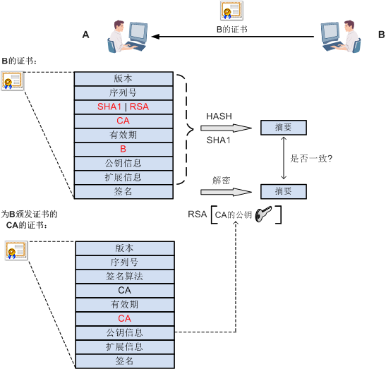

再进一步，如何判断为B颁发证书的这个CA的证书真伪以及是否被篡改过？答案是用CA自己的公钥来验证自己的签名，即用CA证书中的公钥解密该证书中的签名，得到摘要信息；然后使用CA证书中签名算法里面的HASH密码学算法对该证书进行HASH计算，得到另一个摘要信息，两者一致，说明该CA证书是真实的，没有被篡改过。 此时有一个新的问题，假设黑客伪造了CA证书，证书中的签名是黑客用自己的私钥来签名，而公钥就是黑客自己的公钥，那么对该CA证书的验证也能通过。所以上述验证过程的前提是CA证书必须是在可信任的机构获取的，保证没有被伪造。

如果通信双方要互相验证对方的证书，那就要分别获取到为对方颁发证书的CA的证书。如下图所示，A如果要验证B的证书，则A必须先获取为B颁发证书的CA的证书，用CA的证书验证B的证书；B如果要验证A的证书，则B必须先获取为A颁发证书的CA的证书，用CA的证书验证A的证书。如果A和B是由同一个CA颁发的证书，那么两者获取到的CA的证书是相同的，如果A和B是由两个不同的CA颁发的证书，那么两者获取到的CA的证书是不同的。

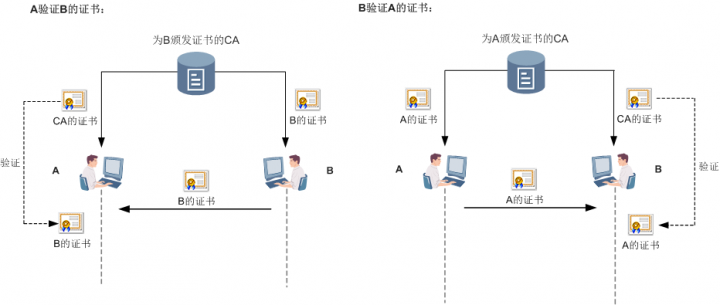

对于证书的使用方法，下面我们再进行一下总结：
1. 通信双方各自持有自己的证书，当一方需要向另一方证明身份时，就把自己的证书发送过去。双方不用事先保存对方的证书，只在验证时接收对方发送过来的证书即可。
2. 一方验证另一方证书的真伪时，必须事先获取到为另一方颁发证书的CA的证书，用这个CA证书来验证对方的证书。

>注意：因为不同的CA会颁发不同证书，所以在证书的世界中，每个人可能会持有多个证书。同理，每个人也会获取到多个不同的CA证书。在这种情况下，一方收到另一方发过来的证书时，会根据证书中颁发者的名称，在自己的系统中查找对应的CA证书，找到后就用这个CA证书来验证。如果没有找到，那就说明事先没有获取到CA证书，也就无法判断对方发送过来的证书的真伪。

上面我们介绍了证书的很多内容, 但还是有一个前提条件没有解决, 那就是如何从CA获取证书?我们可以通过PKI（Public Key Infrastructure）框架来实现证书的生成、管理和维护，但是搭建一个PKI环境比较复杂。其实我们可以向网上的专业证书颁发机构申请证书，例如Verisign、Geotrust、Globalsign等。

我们还可以利用平时常用的资源，搭建我们自己的CA环境。比如，常用的Windows Server操作系统就可以作为CA来颁发证书，具体的配置方法在网上都可以搜索到，此处不再赘述。这里强叔想为大家介绍一个开源的第三方证书管理软件XCA，通过这个软件来帮助设备生成公私密钥对，然后为设备生成并颁发证书。

下面我们就结合证书的具体应用，介绍XCA的使用方法。

### 应用 ---IPSec VPN和SSL VPN

#### 证书在IPSec中的应用
在IPSec引入数字证书，身份认证简单便捷一篇中，我们已经介绍过了IPSec隧道两端网关设备使用证书进行身份认证的配置，在这里就不做过多介绍了。需要注意的是，当时两台网关设备是从同一个CA申请的证书，所以两台设备上安装的CA证书也是相同的；如果两台网关设备从不同的CA申请证书，那就需要在两台网关设备上分别安装为对方颁发证书的那个CA的证书。
#### 证书在SSL VPN中的应用
在远程接入IPSec现短板，SSL VPN登上历史舞台一篇中，我们分析了客户端和服务器（即防火墙设备）建立SSL连接的过程，其中包括了两个阶段：首先是客户端对服务器进行身份认证，然后是服务器对客户端进行身份认证。

下图展示了在SSL VPN连接建立过程中，不同类型的证书的安装和使用方法。由于客户端和服务器都是由XCA颁发的证书，所以两者获取到的CA的证书是相同的。另外，由于我们使用了XCA生成的证书替换了服务器内置的证书，所以还需要将XCA为服务器生成的公私密钥对导入到服务器中

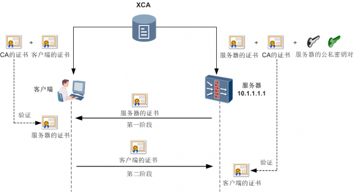

##### 第一阶段：客户端验证服务器的身份
我们先来看一下第一个阶段。在这个阶段中，服务器将自己的证书发送给客户端，客户端需要用为服务器颁发证书的CA的证书来验证这个证书。但是，客户端在自己的系统上没有找到CA的证书，无法验证服务器证书的真伪，所以浏览器会提示警告框。

我们可以先忽略这个警告，等出现登录页面后，在页面左侧下载CA证书并安装到客户端的系统中，就可以验证服务器证书的真伪，后续客户端登录时就不会再出现警告框了。

可见，服务器向CA申请好证书后，将自己的证书连同CA的证书一块内置到系统中。当服务器需要被客户端验证时，就会将自己的证书发给客户端；同时，在登录页面上提供CA证书，供客户端下载使用。

当然，我们也可以替换掉服务器内置的证书，使用我们自己认可的CA，如XCA为服务器颁发新的证书。下面介绍如何使用XCA软件来生成CA证书和服务器的证书。

操作步骤如下：

1. 从http://sourceforge.net/projects/xca/下载并安装XCA软件，具体过程略。
2. 在“File”菜单中创建一个新的数据库，输入数据库的名字，然后设置该数据库的密码，使用这个数据库来保存密钥对和证书的信息。
3. 在“Private  Keys”页签，生成CA的公私密钥对。

  

  参考上述步骤，生成服务器的公私密钥对，密钥对的Name为10.1.1.1，即用服务器的IP地址标识，其他参数不变。

4. 在“Certificate”页签，生成CA的证书。

    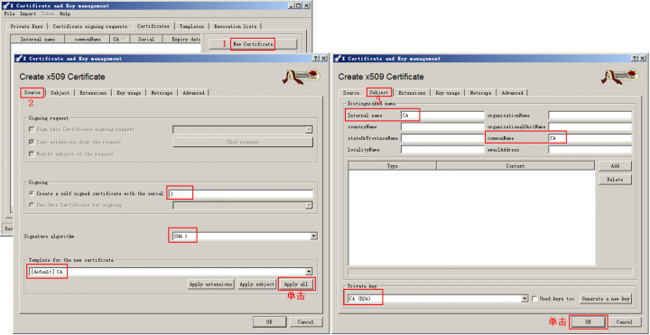

    然后为该CA证书生成CRL，即设置该证书的有效期。

5. 参考上述步骤，生成服务器的证书，与CA证书生成过程中有差异的参数取值如下表所示。

    注意：服务器证书的CN字段取值必须与服务器IP地址一致的要求，否则在客户端上无法验证通过，所以我们这里将证书的名称设置为10.1.1.1。

    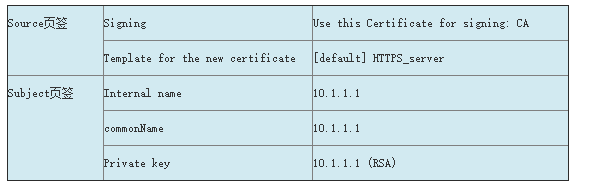

6. 以PEM格式导出CA证书CA.crt和服务器证书10.1.1.1.crt，保存文件备用。

    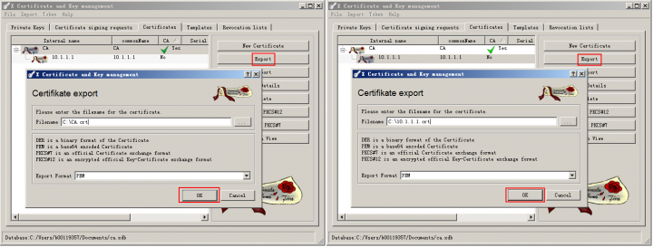

7. 导出服务器的公私密钥对10.1.1.1.pem，保存文件备用。为了保证密钥对的安全，导出时要设置密码。

    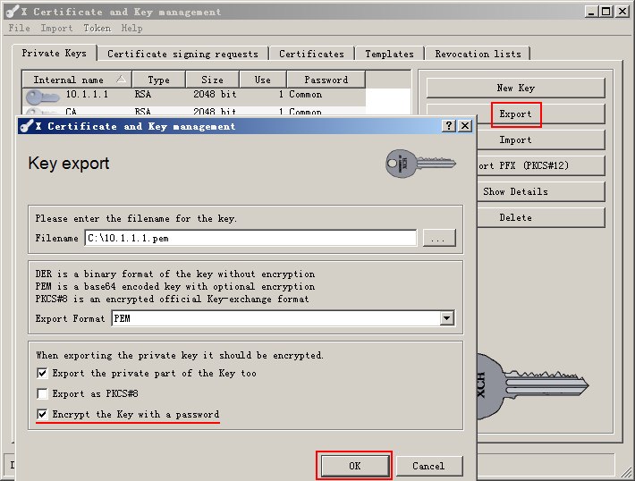

8. 将CA证书CA.crt发送至客户端，在客户端上双击CA.crt，按照提示将该证书存储到“受信任的根证书颁发机构”中。
9. 将服务器的公私密钥对文件10.1.1.1.pem上传至服务器，然后执行如下命令导入公私密钥对，password处输入导出时设置的密码。

    >注意：在SSL握手过程的第3次通信中，客户端会使用服务器的公钥将随机数pre-master-key加密后发给服务器，要求服务器上必须存在私钥才能解密。
    ```bash
    [Server] pki import rsa-key-pair 10.1.1.1 pem 10.1.1.1.pem password huawei
    ```
10. 在服务器上安装自己的证书10.1.1.1.crt。

    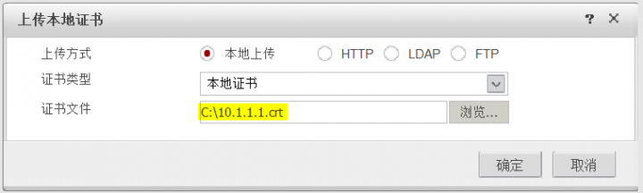

11. 配置服务器使用10.1.1.1.crt来向客户端证明自己的身份。

    

完成上述操作后，当客户端访问服务器的登录页面时，就可以用XCA的CA证书来验证服务器发送过来的证书。由于服务器的证书也是由XCA颁发的，所以验证通过，浏览器不会提示警告框。

##### 第二阶段：服务器验证客户端的身份
下面来看一下第二个阶段，即服务器使用证书方式对客户端进行身份认证的过程。在这个阶段中，客户端要向服务器发送自己的证书，服务器使用为客户端颁发证书的CA的证书来验证客户端的证书。下面我们就以服务器使用证书匿名认证方式认证客户端为例，介绍使用XCA软件为客户端生成证书的过程。

操作步骤如下（省略了与第一阶段相似的部分截图）：
1. 在“Private  Keys”页签，生成客户端的公私密钥对，密钥对的Name为Client
2. 在“Certificate”页签，按照下表中的参数取值，生成客户端的证书。

  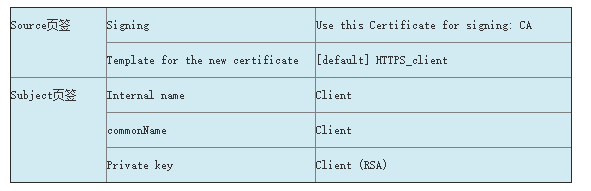

3. 以PEM格式导出CA证书**CA.crt**，以PKCS #12格式导出客户端的证书Client.p12（因为PKCS #12格式的证书中包含了私钥，所以导出时需要设置密码），保存文件备用。
    >注意：本步骤中导出的CA证书要安装到服务器（防火墙）上，格式必须为PEM或DER，而客户端证书要安装到客户端（PC）上，格式必须为PKCS #12。

4. 将客户端证书发送至客户端，在客户端上双击Client.p12，按照提示安装即可，安装过程中需要输入导出该证书时设置的密码

    安装成功后，在Windows操作系统的MMC控制台中，可以看到客户端的证书，以及在第一阶段的步骤8中安装的CA证书。客户端证书中包含私钥，所以图标比CA证书的图标多了一个“钥匙”的标志，如下图所示。

    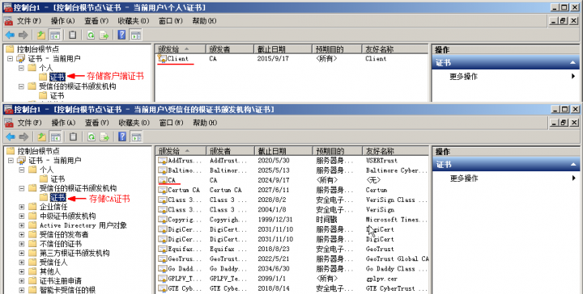

5. 在服务器上安装CA的证书**CA.crt**，该CA证书在第一阶段的步骤6中已经导出。

    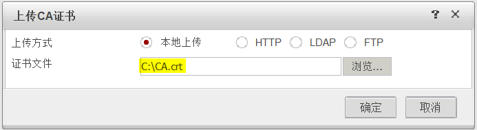

6. 配置服务器使用CA.crt来验证客户端的身份。

    

完成上述操作后，客户端使用浏览器访问服务器的登录页面时，就可以在浏览器中选择自己的证书来进行身份认证，成功登录到服务器上。