## 单包攻击及防御
### 什么是DoS攻击?
Dos是Denial Of Service的简称, 即拒绝服务,造成DoS攻击, 其目的是使计算机或网络无法提供正常的服务.

那么， “拒绝服务”是什么意思呢？下面我们就打个形象的比喻。

街边有一个小餐馆为大家提供餐饮服务，但是这条街上有一群地痞总是对餐馆搞破坏，比如：霸占着餐桌不让其他客人吃饭也不结账、或者堵住餐馆的大门不让客人进门，甚至骚扰餐馆的服务员或者厨师不让他们正常干活，这样餐馆就没有办法正常营业了，这就是“拒绝服务”。Internet中的计算机或者服务器就像是这个餐馆一样，为Internet用户提供互联网资源，如果黑客想要对这些计算机或者服务器进行DoS攻击的话，也使用消耗计算机或服务器性能、抢占链路带宽等手段！

最常见的DoS攻击就是我们常常提到的单包攻击。这类攻击一般都是以个人为单位的黑客发动的，攻击报文也比较单一，虽然破坏力强大，但是只要掌握了攻击的特征，防御起来还是比较容易的。

防火墙支持的单包攻击包括以下三大类

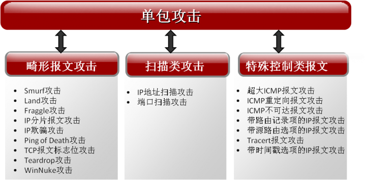

- 畸形报文攻击：通常指攻击者发送大量有缺陷的报文，从而造成主机或服务器在处理这类报文时系统崩溃。
- 扫描类攻击：是一种潜在的攻击行为，并不具备直接的破坏行为，通常是攻击者发动真正攻击前的网络探测行为。   
- 特殊控制报文攻击：也是一种潜在的攻击行为，不具备直接的破坏行为，攻击者通过发送特殊控制报文探测网络结构，为后续发动真正的攻击做准备。

单包攻击防御是防火墙具备的最基本的防范功能，华为全系列防火墙都支持对单包攻击的防御。下面强叔就带大家认识几种典型的单包攻击，一起了解下华为防火墙是如何防范这些攻击的。

### Ping of Death 攻击及防御
操作系统处理数据包的大小是有限制的, IP报文的长度字段为16位, 即IP报文的最大长度位65535, 如果遇到大小超过65535的报文, 会出现内存分配错误, 从而使接收方的计算机系统崩溃. Ping of Death 攻击就是攻击者不断的通过ping命令向攻击目标发送超过65535的报文. 就可以使目标计算机的TCP/IP堆栈崩溃, 致使接收方系统崩溃.

防火墙在处理Ping of Death攻击报文时，是通过判定数据包的大小是否大于65535字节，如果数据包大于65535字节，则判定为攻击报文，直接丢弃。

### Land 攻击及防御
Land攻击是指攻击者向受害者发送伪造的TCP报文，此TCP报文的源地址和目的地址同为受害者的IP地址。这将导致受害者向它自己的地址发送回应报文，从而造成资源的消耗。

防火墙在处理Land攻击报文时，通过检查TCP报文的源地址和目的地址是否相同，或者TCP报文的源地址是否为环回地址，如果是则丢弃。

### IP地址扫描攻击
IP地址扫描攻击是攻击者运用ICMP报文(如ping和Tracert命令)探测目标地址, 或者使用TCP/UDP报文对一定地址发起连接, 通过判断是否有应答报文,以确定哪些目标系统确实存活着并且连接在目标网络上.

防火墙对收到的TCP, UDP,ICMP报文进行检测, 当某源IP地址连续发送报文的目的IP地址与前一个报文的目的IP地址不同时,则记为一次异常, 当异常次数超过预定义的阈值时, 则认为该源ip的行为为ip地址扫扫描行为,防火墙会将该源IP地址加入黑名单。

可以看出，IP地址扫描攻击并没有直接造成什么恶劣后果，它只是一种探测行为，通常是为了后续发动破坏性攻击做准备，尽管如此，这种行为我们防火墙也不会放过的。

从以上几种攻击及防御手段，我们可以发现，单包攻击一般都具有明显的特征，所以防火墙在防御单包攻击时，只要匹配了攻击特征，就可以很容易防御。

#### 配置建议

防火墙支持的单包攻击防御种类繁多，在现网使用过程中，哪些需要配置，或者哪些不建议配置一直困扰着大家。下面强叔就为大家列举一下，哪几种攻击建议开启，哪几种攻击的防御不建议开启？ 

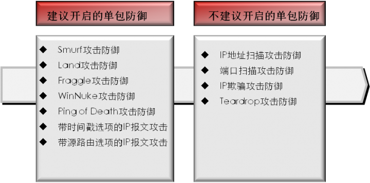

建议开启的单包攻击防御一般是现网比较常见的攻击，这种攻击开启以后，防火墙可以很好的进行防御，对性能等方面没有影响。而扫描类攻击在防御过程中比较消耗防火墙的性能，所以不建议开启。

其实，单包攻击在现网中所占的比例并不高，现网中最主流，也让人们最头疼的攻击其实是DDoS攻击。DDoS攻击种类比较多，华为防火墙支持的DDoS攻击包括SYN Flood、UDP Flood、ICMP Flood等流量型攻击，以及HTTP Flood、HTTPS Flood、DNS Flood等应用层攻击

## 流量型攻击之 SYN Flood及防御

在现网中单包攻击只占了很小一部分比例，更多的攻击还是集中在流量型攻击和应用层攻击。本期强叔将继续为大家讲解一下现网上常见的流量型攻击

过去，攻击者所面临的主要问题是网络带宽，由于较小的网络规模和较慢的网络速度的限制，攻击者无法发出过多的请求。虽然类似“Ping of Death”的攻击类型只需要较少量的包就可以摧毁一个没有打过补丁的操作系统，但大多数的DoS攻击还是需要相当大的带宽，而以个人为单位的黑客们很难消耗高带宽的资源。为了克服这个缺点，DoS攻击者开发了分布式的攻击。
木马成为黑客控制傀儡的工具，越来越多的计算机变成了肉鸡，被黑客所利用，并变成了他们的攻击工具。黑客们利用简单的工具集合许多的肉鸡来同时对同一个目标发动大量的攻击请求，这就是DDoS(Distributed Denial of Service)攻击。

### SYN Flood的攻击和防御

最初的SYN Flood攻击类似于协议栈攻击，在当年的攻击类型中属于技术含量很高的“高大上”。当年由于系统的限制以及硬件资源性能的低下，称霸DDoS攻击领域很久。它与别人的不同在于，你很难通过单个报文的特征或者简单的统计限流防御住它，因为它“太真实”、“太常用”。
SYN Flood具有强大的变异能力，在攻击发展潮流中一直没有被湮没，这完全是他自身的优秀基因所决定的：

1. 单个报文看起来很“真实”，没有畸形。
2. 攻击成本低，很小的开销就可以发动庞大的攻击。

#### TCP三次握手
SYN flood是基于TCP协议栈发起的攻击, 在了解SYN flood攻击和防御原理之前, 还是要从TCP连接建立的过程开始说起. 在TCP/IP协议中，TCP协议提供可靠的连接服务，无论是哪一个方向另一方发送数据前，都必须先在双方之间建立一条连接通道，这就是传说中的TCP三次握手。

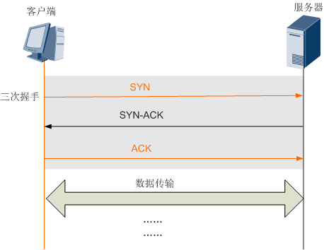

1. 第一次握手：客户端向服务器端发送一个SYN（Synchronize）报文，指明想要建立连接的服务器端口，以及序列号ISN
2. 第二次握手：服务器在收到客户端的SYN报文后，将返回一个SYN+ACK的报文，表示客户端的请求被接受，同时在SYN+ACK报文中将确认号设置为客户端的ISN号加1。 ACK即表示确认（Acknowledgment）
3. 第三次握手：客户端收到服务器的SYN-ACK包，向服务器发送ACK报文进行确认，ACK报文发送完毕，三次握手建立成功

如果客服端在发送了SYN报文后出现了故障, 那么服务器在发出SYN + ACK应答报文后是无法收到客户端的ACK报文的, 即第三次握手无法完成. 这种情况下服务器端一般会重试，向客户端再次发送SYN+ACK，并等待一段时间。如果一定时间内，还是得不到客户端的回应，则放弃这个未完成的连接。这也是TCP的重传机制。

SYN Flood攻击正是利用了TCP三次握手的这种机制。攻击者向服务器发送大量的SYN报文请求，当服务器回应SYN+ACK报文时，不再继续回应ACK报文，导致服务器上建立大量的半连接，直至老化。这样，服务器的资源会被这些半连接耗尽，导致正常的请求无法回应

防火墙对SYN Flood攻击, 一般会采用TCP代理和探测两种方式进行防御

### TCP代理
TCP代理是指我们的防火墙部署在客户端和服务器中间，当客户端向服务器发送的SYN报文经过防火墙时，防火墙代替服务器与客户端建立三次握手。一般用于报文来回路径一致的场景

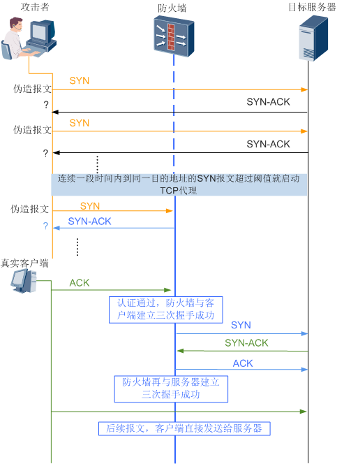

1. 防火墙收到SYN报文，对SYN报文进行拦截，代替服务器回应SYN+ACK报文。
2. 如果客户端不能正常回应ACK报文，则判定此SYN报文为非正常报文，防火墙代替服务器保持半连接一定时间后，放弃此连接。
3. 如果客户端正常回应ACK报文，防火墙与客户端建立正常的三次握手，则判定此SYN报文为正常业务报文，非攻击报文。防火墙立即与服务器再建立三次握手，此连接的后续报文直接送到服务器。

整个TCP代理的过程对于客户端和服务器都是透明的。

TCP代理过程中，防火墙会对收到的每一个SYN报文进行代理和回应，并保持半连接，所以当SYN报文流量很大时，对防火墙的性能要求非常的高。

了解了攻击原理，再学习防御原理，是不是觉得很容易理解。讲了这么多，大家对SYN Flood的攻击以及TCP代理防御是不是有了一定的认识。其实，TCP代理的本质就是利用防火墙的高性能，代替服务器承受半连接带来的资源消耗，由于防火墙的性能一般比服务器高很多，所以可以有效防御这种消耗资源的攻击。

但是TCP代理只能应用在报文来回路径一致的场景中，如果来回路径不一致，代理就会失败。可是在现网中，报文来回路径不一致的场景也是很常见的，那这种情况下如果发生了SYN Flood攻击，防火墙要怎么防呢？
不用担心，我们还有第二个杀手锏：TCP源探测！

#### TCP源探测
TCP源探测是防火墙防御SYN Flood攻击的另一种方式，没有报文来回路径必须一致的限制，所以应用普遍。

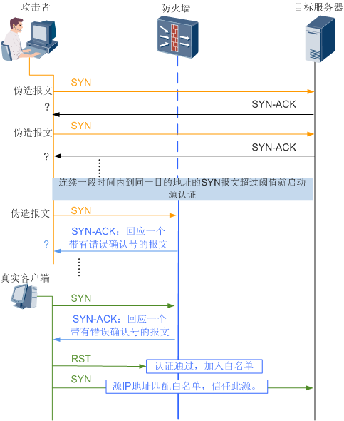

1. 当防火墙收到客户端发送的SYN报文时，对SYN报文进行拦截，并伪造一个带有错误序列号的的SYN+ACK报文回应给客户端。
2. 如果客户端是虚假源，则不会对错误的SYN+ACK报文进行回应。
3. 如果客户端是真实源发送的正常请求SYN报文，当收到错误的SYN+ACK报文时，会再发出一个RST报文，让防火墙重新发一个正确的SYN+ACK报文；防火墙收到这个RST报文后，判定客户端为真实源，则将这个源加入白名单，在白名单老化前，这个源发出的报文都认为是合法的报文，防火墙直接放行，不在做验证。

这里，我们再回头对比一下TCP源探测和TCP代理两种方式，会发现TCP源探测对客户端的源只做一次验证通过后，就加入白名单，后续就不会每次都对这个源的SYN报文进行验证，这样大大提高了TCP源探测的防御效率和防御性能，可以有效缓解防火墙性能压力。

讲了这么多，大家是不是就会觉得TCP源探测对于SYN Flood已经是一个完美的防御方案了呢？它会不会也有什么弱点呢？

很长一段时间里，SYN Flood在防火墙TCP代理和TCP源探测双重防御的压制下，得到了遏制。但是随着木马被广泛植入到更多的肉鸡，一个初级黑客简单操作就可以操纵动则上G流量的时候， SYN Flood变得更加嗜血。TCP代理和TCP源探测方式说到底都是使用防火墙牺牲自身的CPU不断的来解决问题。但是一旦海量低开销的SYN Flood攻击报文同时蜂拥而至时，这种伤敌一千自损八百的方式将走向另外一个极端，防火墙很有可能成为瓶颈。华为防火墙在不断提升自身性能的同时，还是可以承担一定的开销。但是传统的防御手段都是反弹，也就是说如果攻击流量是1G的话，防火墙的反弹流量也有1G，这样就相当于有2G的“攻击”流量在互联网上占据着带宽，我们在防御的过程中不自觉的放大了垃圾流量，拥塞了链路。

TCP提供可靠的传输层，其中可靠性的保障之一就是确认从另一端收到的数据。但是数据和确认在传输过程中都有丢弃的可能，所以TCP通过在发送时设置一个定时器来解决这个问题。如果定时器到达设置的时间了，还是没有收到某个数据的确认报文，则TCP就会重传这个数据。华为专业AntiDDoS设备正是利用了TCP这种重传的机制，推出“首包丢弃”功能与“TCP源探测”结合的防御方式，以应对超大流量的SYN Flood攻击。当SYN报文蜂拥而至时，专业AntiDDoS设备会将收到的第一个报文记录并直接丢弃，然后等待第二个重传报文。收到重传报文后，再对重传报文进行源探测。

## 流量型攻击之UDP Flood及防御
讲UDP Flood之前，强叔还是先从UDP协议讲起。在讲SYN Flood的时候，我们知道了TCP协议是一种面向连接的传输协议。但是UDP协议与TCP协议不同， UDP是一个无连接协议。使用UDP协议传输数据之前，客户端和服务器之间不建立连接，如果在从客户端到服务器端的传递过程中出现数据的丢失，协议本身并不能做出任何检测或提示。因此，通常人们把UDP协议称为不可靠的传输协议。

既然UDP是一种不可靠的网络协议，那么还有什么使用价值或必要呢？

其实不然，在有些情况下UDP协议可能会变得非常有用。因为UDP具有TCP所望尘莫及的速度优势。虽然TCP协议中植入了各种安全保障功能，但是在实际执行的过程中会占用大量的系统开销，无疑使传输速度受到严重的影响。反观UDP，由于排除了信息可靠传递机制，将安全和排序等功能移交给上层应用来完成，极大降低了执行时间，使传输速度得到了保证

正是UDP协议的广泛应用，为黑客们发动UDP Flood攻击提供了平台。UDP Flood属于带宽类攻击，黑客们通过僵尸网络向目标服务器发起大量的UDP报文，这种UDP报文通常为大包，且速率非常快，通常会造成以下危害：

- 消耗网络带宽资源，严重时造成链路拥塞。
- 大量变源变端口的UDP Flood会导致依靠会话转发的网络设备，性能降低甚至会话耗尽，从而导致网络瘫痪。

防火墙对UDP Flood的防御并不能像SYN Flood一样，进行源探测，因为它不建立连接。那应该怎么防御呢？

最初防火墙对UDP Flood的防御方式就是限流，通过限流将链路中的UDP报文控制在合理的带宽范围之内。

防火墙上针对UDP Flood的限流有三种：
- 基于目的IP地址的限流：即以某个IP地址作为统计对象，对到达这个IP地址的UDP流量进行统计并限流，超过部分丢弃。
- 基于目的安全区域的限流：即以某个安全区域作为统计对象，对到达这个安全区域的UDP流量进行统计并限流，超过部分丢弃。
- 基于会话的限流：即对每条UDP会话上的报文速率进行统计，如果会话上的UDP报文速率达到了告警阈值，这条会话就会被锁定，后续命中这条会话的UDP报文都被丢弃。当这条会话连续3秒或者3秒以上没有流量时，防火墙会解锁此会话，后续命中此会话的报文可以继续通过。

限流虽然可以有效缓解链路带宽的压力，但是这种方式简单粗暴，容易对正常业务造成误判。为了解决这个问题，防火墙又进一步推出了针对UDP Flood的指纹学习功能。

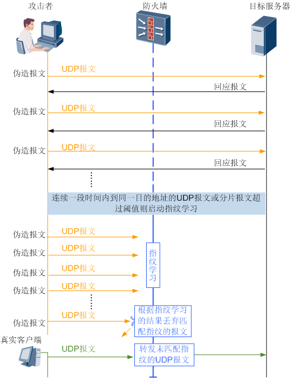

仔细分析，不难发现，UDP Flood攻击报文具有一定的特点，这些攻击报文通常都拥有相同的特征字段，比如都包含某一个字符串，或整个报文内容一致。这些字段来自于DDoS工具自带的默认字符串，所以防火墙是通过收集这些字符串来检测UDP Flood。这种防御算法在现网使用很多，主要因为黑客为了加大攻击频率，快速、长时间挤占攻击目标所在网络带宽，在使用攻击工具实现时直接在内存存放一段内容，然后高频发送到攻击目标，所以攻击报文具有很高的相似性。而正常业务的UDP报文一般每个报文负载内容都是不一样的，这样可以减少误判。

从下面的抓包中可以看出，到达相同目的IP地址的两个UDP报文的载荷是完全一样的，如果防火墙收到大量的类似这样的UDP报文，那么就有可能是发生了UDP Flood攻击。

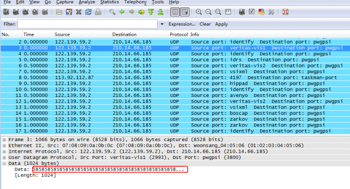

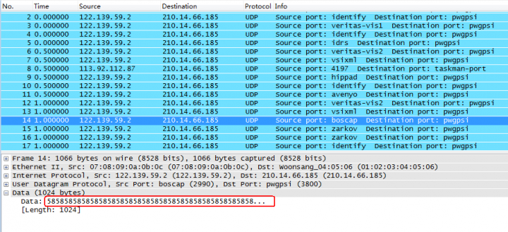

指纹学习是通过分析客户端向服务器发送的UDP报文载荷是否有大量的一致内容，来判定这个UDP报文是否异常。防火墙对到达指定目的地的UDP报文进行统计，当UDP报文达到告警阈值时，开始对UDP报文的指纹进行学习。如果相同的特征频繁出现，就会被学习成指纹，后续命中指纹的报文判定这是攻击报文，作为攻击特征进行过滤。

## 应用层攻击及防御
### DNS Flood
通常情况下，我们在上网访问网页的时候，输入的网址都是域名，比如 www.huawei.com，这个请求的域名会发送到DNS缓存服务器，以请求其对应的IP地址。如果DNS缓存服务器上有此域名和IP地址的映射关系，DNS缓存服务器就会将查询到得IP地址返回给客户端。

当DNS缓存服务器查找不到该域名与IP地址对应关系时，它会向授权DNS服务器发出域名查询请求。为了减少Internet上DNS的通信量，DNS缓存服务器会将查询到的域名和IP地址对应关系存储在自己的本地缓存中。后续再有主机请求该域名时，DNS缓存服务器会直接用缓存区中的记录信息回应，直到该记录老化，被删除

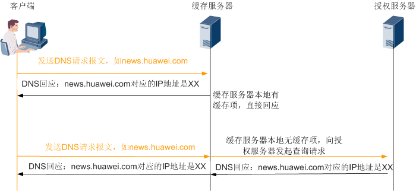

常见的DNS Flood攻击一般都是攻击者向DNS服务器发送大量的不存在的域名解析请求，导致DNS缓存服务器不停向授权服务器发送解析请求，最终导致DNS缓存服务器或者DNS授权服务器瘫痪，影响对正常请求的回应。

我们先从DNS协议本身讲起。DNS服务器支持TCP和UDP两种协议的查询方式，但是大多数的查询都是使用UDP查询的，我们都知道，UDP提供无连接服务，传输速度快，可以降低服务器的负载。

也有特殊情况需要通过TCP方式查询，其中之一，就是DNS服务器可以设定使用TCP连接。当客户端向DNS服务器发起查询请求时，DNS回应报文里有一个TC标志位，如果TC标志位置1，就表示需要通过TCP方式查询。我们的防火墙就是利用这一机制对DNS Flood攻击进行防御。

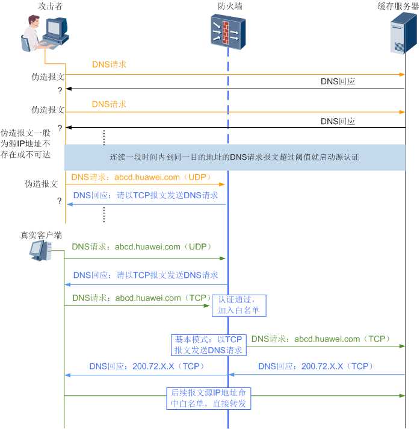

上图中，当发生DNS Flood攻击时，防火墙收到DNS请求，会代替DNS服务器响应DNS请求，并将TC标志位置1，要求DNS客户端以TCP方式发送DNS请求。

- 如果客户端是真实源，会继续以TCP方式发送DNS请求。

- 如果客户端是虚假源，则不会再以TCP方式发送DNS请求。

我们再来看一组真实客户端正常响应防火墙源探测的抓包信息：

1. 客户端向DNS服务器以UDP方式发送查询请求。
    
    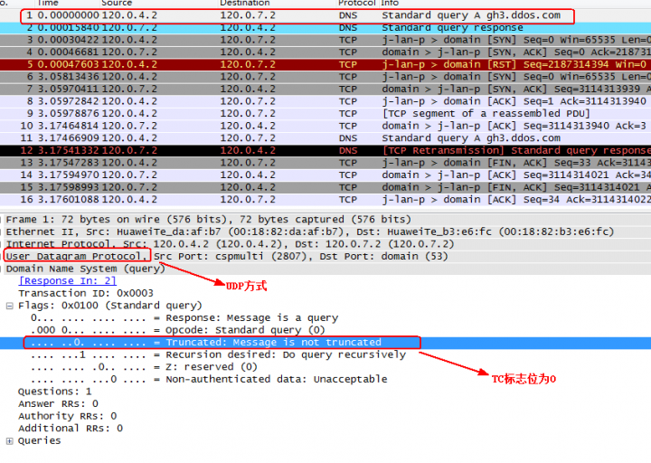

2. 防火墙将TC标志位置1，让客户端以TCP方式发送请求。

    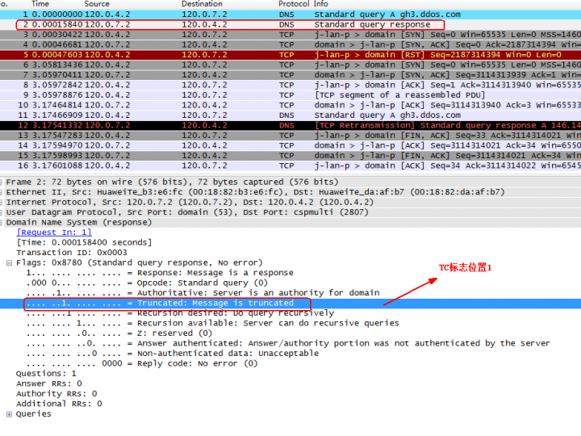

3. 客户端以TCP方式发送DNS请求。

    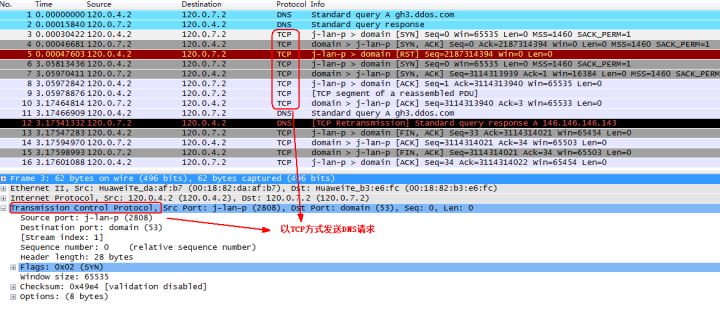

这种方式可以很好的防御针对缓存服务器的DNS请求攻击，但是在现网使用过程中，并不是所有场景都适用。因为在源探测过程中，防火墙会要求客户端通过TCP方式发送DNS请求，但是并不是所有的客户端都支持以TCP方式发送DNS请求，所以这种方式在使用过程中也有限制。如果有正常客户端不支持以TCP方式发送DNS请求，使用此功能时，就会影响正常业务。

### HTTP Flood
说完了DNS Flood攻击，强叔再给大家讲讲另一种常见的应用层攻击：HTTP Flood。近几年，HTTP Flood攻击所占比例呈逐年上升趋势，不可小觑。

常见的HTTP Flood攻击，一般指黑客通过代理或僵尸主机向目标服务器发起大量的HTTP报文，这些请求涉及数据库操作的URI或其它消耗系统资源的URI，目的是为了造成服务器资源耗尽，无法响应正常请求。

防火墙对于HTTP Flood的防御，主要依靠HTTP协议所支持的重定向方式，譬如说客户端向服务器请求www.sina.com，服务器可以返回一个命令，让客户端改为访问www.sohu.com。这种重定向的命令在HTTP协议栈中是合法的。我们防火墙的防御机制就是利用这个技术点，来探测HTTP客户端是否为真实存在的主机。

HTTP报文的正常重定向过程是这样的

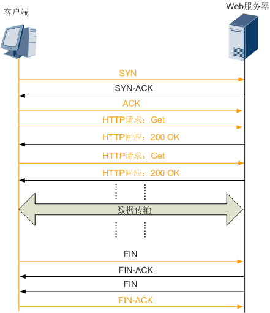

防火墙正是利用了HTTP报文的这种重定向机制，在防御HTTP Flood攻击过程中，向客户端重定向一个其他的URI

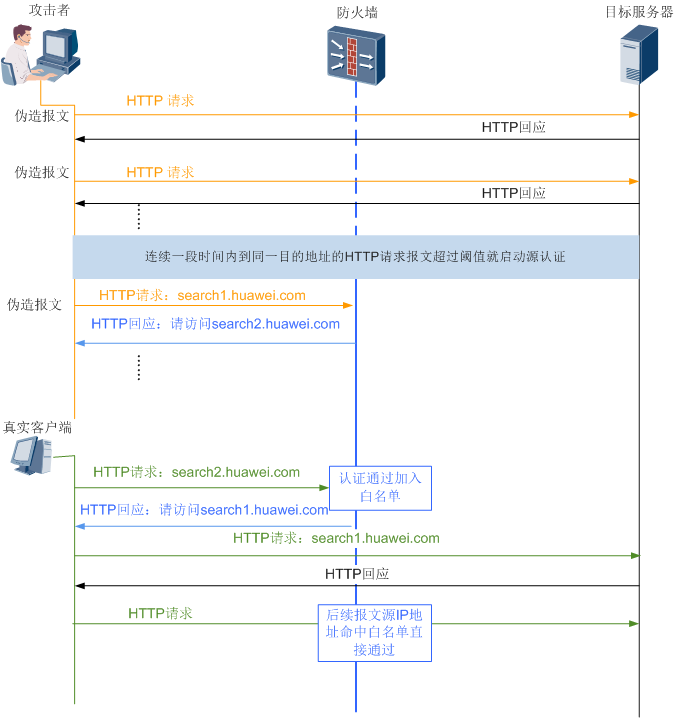

上图可以看出，当客户端访问search1.huawei.com的时候，防火墙重定向了一个search2.huawei.com地址给客户端让它访问：

- 如果客户端是虚假源，在收到防火墙发送的重定向地址后，不会重新发送HTTP请求。
- 如果客户端是真实源，则会对防火墙的重定向报文进行响应，并重新向search2.huawei.com地址发送请求。这样，防火墙收到search2.huawei.com请求后，即可判定这个客户端是真实源，并将这个客户端加入白名单。
 
虽然在整个过程中，客户端需要自动重定向两次，但是时间是很短的，不会影响客户体验。

我们再看一组真实客户端正常响应防火墙重定向请求的抓包信息：
1. 客户端请求包含URI为“/index.html”的页面。

    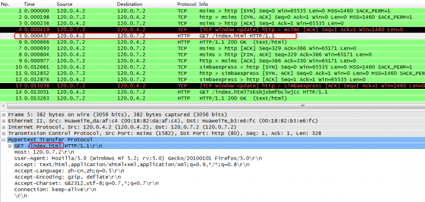

2. 防火墙对请求报文进行确认，并重定向一个新的URI“/index.html?sksbjsbmfbclwjcc”给客户端

    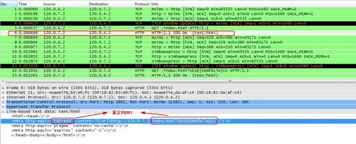

3. 客户端重新请求包含URI为“/index.html?sksbjsbmfbclwjcc”的页面。

    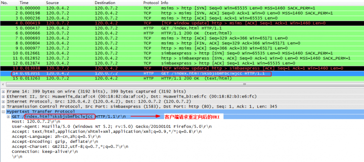

4. 防火墙对包含新URI的请求进行确认，并将地址重新定向成包含URI为“/index.html”的页面。认证通过，后续客户端可以直接和服务器进行通信。整个过程对于用户来说是透明的，重定向操作由客户端浏览器自动完成。

    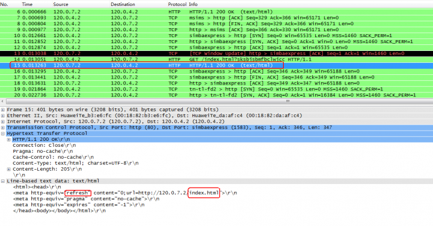

该模式可有效阻止来自非浏览器客户端的访问，如果僵尸工具没有实现完整的HTTP协议栈，不支持自动重定向，无法通过认证。而浏览器支持自动重定向，可以通过认证。这种防御方式在使用过程中，要确认客户端是否支持重定向。比如，常见的机顶盒就不支持自动重定向。所以在使用这种防御方式时，一定要确认所在的网络是否有机顶盒等客户端的正常业务，如果有，就不能使用此功能，否则会影响正常业务。

### 关于阈值怎么配置？
在这几期介绍的攻击防范中，大家对于Flood类攻击的阈值配置一直存在着疑惑，这里强叔给大家统一说明一下配置原则。

告警阈值配置要合理，如果配置过大，来攻击的时候就会防不住；如果配置过小，可能会把正常业务误判为攻击报文进行处理。

但是每个网络的流量模型都不同，所以配置阈值之前，需要有个前提准备，就是要大概了解这个网络正常情况下的每种类型报文的基本流量模型。这个值可能是管理员的一个经验值，也可以通过监测一段时间后通过工具学习得知。比如，我们想配置SYN Flood防御功能，配置告警阈值前，要先了解没有发生攻击的情况下网络中SYN报文的最大速率是多少，然后再配置SYN Flood防御的告警阈值，一般可以配置为正常流量时的1.2 ~2倍。配置完告警阈值后，还要连续多观察几天，看这个阈值对正常业务是否有影响，如果有影响，要及时调整成更大的值。
