## 什么是 NGFW

NGFW的全称是Next-Generation Firewall, 即下一代防火墙

Gartner认为, NGFW必须具备以下能力:

### 1. 传统防火墙的功能
NGFW是新环境下传统防火墙的替代产品,必须前向兼容传统防火墙的基本功能, 包括包过滤,协议状态检测,NAT,VPN等

### 2. IPS与防火墙的深度集成
NGFW要支持IPS功能, 且实现与防火墙功能的深度融合, 实现 1+1 > 2的效果. Gartner特别强调IPS与防火墙的'集成'而不仅仅是'联动'

### 3. 应用感知与全栈可视化
具备应用感知能力, 并能够基于应用实施精细化的安全管控策略和层次化的带宽管理手段,是NGFW引进的最重要的能力. 传统的状态检测防火墙工作在二到四层,不会对报文的载荷进行检查. NGFW能对七层检测, 可以清楚地呈现网络中的具体业务, 并进行管控

### 4. 利用防火墙以外的信息, 增强管控能力
防火墙能够利用其他IT系统提供的用户信息, 位置信息,漏洞和网络资源信息等, 帮助改进和优化安全策略. 例如, 通过集成用户认证系统, 实现基于用户的安全策略, 以应对移动办公场景下,IP地址变化带来的管控难题

## 为什么需要NGFW
防火墙从诞生那一天起，就是紧跟着网络演进的步伐亦步亦趋的。NGFW的出现，正是来自时代的呼唤。


传统防火墙时代，互联网的功能刚刚从互联互通发展到以静态网页浏览、Email、FTP下载为主的信息共享时代。网络办公与休闲之间的应用界限还比较清晰。网络流量主要是上述“存储-转发”类的应用，应用和端口、协议之间还有着相对清晰的映射关系。端口和协议是主要管控对象，防火墙基于端口来过滤网络流量就够了。


此后，以QQ为代表的IM、P2P、VoIP、游戏、网络视频等等新应用迭出，更有一枚不同寻常的苹果激发了移动互联网时代的到来。这一路发展下来，当真是突飞猛进。今天，互联网已经渗透到生活的方方面面，成为一种“生活必需品”了。

互联网的发展，不仅丰富了人们的沟通和生活（好像有点眼熟），也提升了工作效率。不过，网络毕竟是无边界的，工作与生活也没那么容易分开了。要是有员工在上班时间玩玩游戏，看看视频，或者跟同学好友聊天闲谈，就不仅是影响工作效率了。带宽滥用、敏感信息泄露、针对应用的攻击等等都成为威胁企业网络安全的重要问题。就像每个美丽的城市都有不堪入目的小巷一样，移动互联网和社交网络中的热门应用多隐藏着漏洞，恶意软件和互联网犯罪日益猖獗，给企业带来新的威胁。

简而言之，网络中可能包括协作类应用、即时消息、电话会议、流媒体、文件共享、在线存储、VoIP、P2P、游戏、娱乐等等各种应用。**企业必须正确区分合法应用、风险应用和带宽占用类应用，保证正常业务的带宽，限制甚至阻断社交媒体和游戏娱乐类应用，并消除潜在的威胁。** 这一切都落在了防火墙的肩上，这是时代对防火墙提出的新要求。

传统的状态检测防火墙显然不能承担这个重任。

一方面，传统防火墙的协议识别技术，仅检查报文的五元组，根据TCP/UDP报文的端口号来识别应用，此之谓端口识别是也。端口识别技术虽然检测效率很高，但随互联网的发展，适用的范围却越来越小了。因为许多传统和新兴应用采用了各种端口隐藏技术来逃避检测。

最常用的方法是使用非知名端口，如使用8000端口进行HTTP通信、使用80端口进行Skype通信、在2121端口上开启FTP服务等等。因此，仅通过端口识别技术已经不能真正判断流量中的应用类型了。更有些应用使用随机端口通信，甚至采用加密方式传输数据。要识别这些协议，端口识别技术却是束手无策了。

另一方面，一个协议可以用于多个应用软件，一个应用软件也可能使用多个协议。协议和应用之间的关系错综复杂纠缠不清――唉一声，贵圈真乱。

一种协议可以用于多个应用软件。这是一个普遍现象，尤其以标准协议最为常见：开发者总是以标准协议为基础，开发应用软件。最典型的就是HTTP协议。随着Web 2.0的发展，企业IT系统Web化趋势明显，使用HTTP协议的应用软件更是数不胜数，几乎遍布互联网应用的所有领域。再比如P2P协议，利用P2P协议的下载软件多不胜举――因此，协议识别的结果不能直接用于应用控制，否则极有可能误伤良民。

同样的，一种应用软件可能使用多种协议来进行通信。例如，迅雷软件使用了HTTP协议、BT协议、ED2K协议、FTP协议、迅雷私有协议等多种协议。这几种协议都可以用来下载文件，分别用于下载不同类型的资源。――因此，应用识别一定要包括所有关联协议的流量，否则就难免有漏网之鱼。


流量从简单到复杂，应用跟端口的关系日趋复杂化，企业管理员发现，网络中的流量看不清了，简直是一团混沌。企业迫切需要流量可视化，并针对应用实施管控策略。可以说，这是NGFW最核心的诉求，也是NGFW的根本。


## NGFW的主要功能
从Gartner正式定义NGFW到现在，6年了，NGFW的概念已经深入人心，你要是没有NGFW你都不好意思跟人家打招呼。但是Gartner在定义中只约束了NGFW的必备能力（归纳起来就是4各方面：集成传统防火墙、集成IPS、集成外部智能、应用感知和可视化），不同的安全厂商对NGFW的理解略有不同，并且产品化的路径通常是基于现有的产品来发展，这就使得不同厂商的NGFW功能各不相同。

同时,随着移动化, 社交化, 云和大数据的发展, ICt网络环境持续变化, NGFW要适应这些变化,需要更多的能力. 在这个背景下, 不同的安全厂商都在试图重新定义NGFW.

- 全面的威胁防护。华为不仅实现了防火墙和IPS的深度集成，还将网关防病毒（AV，Anti-Virus）、反垃圾邮件（AS，Anti-Spam）、URL过滤、数据防泄露（DLP）等功能也集成到了NGFW中。在APT防御场景下，这些功能可以有效地帮助斩断Kill Chain――当然这都是后话了，我们留到第三季再讲，如果还有第三季的话。
- 多维度管控。传统状态检测防火墙主要是基于五元组来实现策略控制。华为NGFW除了支持基于应用的管控，还支持跟第三方认证服务器配合，实现基于用户的管控。并且，还可以根据位置信息和终端类型制定策略。这样，全方位立体化的管控策略就诞生了。我们来看一张表。

    | 管控维度 | 支持能力                | 举例         |
    | -------- | ----------------------- | ------------ |
    | WHo      | 用户/用户组             | 张三丰       |
    | When     | 时间段                  | Worktime     |
    | where    | 安全区域                | Trust        |
    | Where    | 地区                    | 武当山       |
    | Where    | d           地址/地址组 | 192.168.10.3 |
    | Where    | 终端设备                | Honor 6 Plus |
    | What     | 服务/服务组             | imap         |
    | What     | 应用/应用组             | 电驴         |
    | How      | 接入方式                | 无线802.1x   |


- 简化管理. 管控能力增强, 同时也意味着管理复杂度的提高. 华为创新的Smart Policy技术，让NGFW更加智能。安全管理员可以使用系统默认的基础模板，实现策略的快速部署；NGFW根据网络流量分析，给出安全策略的优化建议；此外，还可以识别冗余和失效的安全策略，帮助精简策略，简化管理。
- 提升网络体验。一方面，通过带宽管理功能，可以限制低价值流量，保证关键业务带宽，优先转发时延敏感流量；通过用户配额管理功能，可以限制用户每日/每月上网流量总额或者每日上网时长。另一方面，通过智能选路技术，不仅可以根据运营商地址库选路、智能DNS、透明DNS选择最合适的ISP出口，还可以根据链路质量、带宽、权重、优先级等属性选择最佳链路，实现负载均衡――而且，支持根据IPSec隧道质量选路。

### NGFW VS UTM
熟悉UTM的同学都知道，在IDC的定义中，UTM也是在传统状态检测防火墙的基础上，集成了AV、IPS、AS等功能。既然都是用一台设备来提供IPS、AV等多种安全功能，NGFW跟UTM有什么不同呢？

如前所述，应用感知和可视化是NGFW的核心诉求，而UTM通常是没有应用感知能力的。另外一个关键点是产品定位和性能的问题。Gartner认为NGFW是面向大中型企业的安全产品，而UTM面向的是SMB市场，仅适用于1000人以下的中小企业和分支机构――他们追求的是功能丰富和易用，而对性能要求不高。

从UTM产品的表现来看，很多产品启用IPS和AV之后性能下降非常严重，有些甚至低至启用之前的20%。性能上不去，功能再丰富也是白搭。IDC在定义UTM的时候，也是很隐晦地说，UTM需要在一个盒子中集成这个那个功能，但是并不一定全部启用。至于NGFW，启用IPS和AV后性能下降不能超过50%。

NGFW怎么做到的呢？引擎和检测方式是两个关键点。

先说引擎。UTM是把以前多个盒子的功能，放在了一个盒子里面。物理上，盒子少了；但是逻辑上仍然是全串行处理，一个盒子里面还是多个盒子的处理流程，每一个安全检测都由一个单独的引擎来处理，每一个报文流都要经过多次检测，每一次检测都必然增加了网络延迟。

华为为NGFW产品全新研发了高性能的智能感知引擎（Intelligent Awareness Engine ，简称IAE），实现一体化检测，一体化处理。对于上送的流量，IAE引擎首先识别出准确的协议和应用，然后由对应的协议解码模块深度解码，并把解码以后的字段和内容分类检测。不同类型的内容，检测项也不尽相同，但是多种检测是并行的，速度更快。


当然，NGFW性能的提升离不开硬件平台的支持。IAE引擎内置了硬件卸载的能力，将占用大量CPU计算资源的操作，提交给华为独有的硬件平台来处理，减轻CPU负担，提升这些操作的性能。

再说检测方式。很多UTM产品的文件检测仍然是基于文件的，比如病毒检查，设备要先接收并缓存文档，再扫描。这种方式很大程度上是沿用了PC机上的处理机制，并不适用于防火墙这样的网关产品。缓存需要耗内存，并带来延迟。同时因为难以缓存大文件，只能放过，大文件的安全检测是一个无法弥补的安全漏洞。

华为NGFW产品采用了基于流的文件处理机制，能够接收文件片段并执行安全检测。前面说过，IAE引擎的安全检测是并行的，这样，文件传输时延小，整体性能更高，用户体验也比较好。


对于很多UTM产品来说，当网络流量超过防火墙处理能力时，文件流检测可能就被放过了，也就是内容安全检测被bypass了。要性能，就得承担风险。要安全，性能就会下降。企业管理员要在安全与性能之间去平衡。有些企业购买UTM后并没能够启用其中的很多功能，就是因为无法忍受性能的下降。

防火墙的性能下降影响时延敏感业务和协同类应用的客户感知，进而影响企业的服务水平和生产力。现在，大型企业对安全和性能的需求是同等重要的。企业不能容忍传统防火墙安全能力的落后，也无法忍受NGFW性能低下成为网络瓶颈。NGFW的使命，就是弥补传统防火墙在应用感知等方面的不足，并提供足够的性能。

## 反病毒特性原理
### 病毒初探
提到病毒，大家马上就会想到人类世界的病毒，这些病毒寄生在人体内，轻则损坏健康，如流感病毒；重则危害生命，如近期爆发的MERS病毒。同样，网络世界中也存在病毒，网络世界中的病毒是一种恶意代码，附着在应用程序或文件中，一般通过邮件或文件共享等协议进行传播。这些病毒具有破坏性、隐蔽性、传染性等特点，严重威胁主机系统和网络安全。可见，无论是人类世界的病毒还是网络世界的病毒，都需要有应对方法才能确保安全。

对于人类世界的病毒，我们可以通过药物来处理；对于网络世界的病毒，我们可以在主机上安装杀毒软件，也可以在防火墙上部署反病毒功能。防火墙上提供的反病毒特性和主机上的杀毒软件在功能上是互补和协作的关系，由于部署位置和病毒检测机制的不同，两者可以同时使用，更好地保障主机和网络的安全。


### 病毒载体识别
防火墙要想检测病毒，前提是必须能识别出报文中的文件。传统防火墙只关注报文的网络层信息，像我们在第一季技术贴中介绍过的NAT、IPSec等特性，无论是转换IP地址还是封装新的IP地址，都只是在网络层这个层面做文章。传统防火墙就好比是外科医生，检测深度有限，对报文应用层信息中携带的文件无能为力。

而对于NGFW来说，天生就拥有应用识别这一强大的基因，能够识别报文的应用层信息，这就为检测病毒打好了基础。NGFW更像是内科医生，深度检测使病毒无所遁形，正所谓“流量穿墙过，病毒不放行”。

病毒一般通过邮件或文件共享等协议进行传播，下面我们就来看看都有哪些文件传输协议：
- FTP

    最常见的文件传输协议，FTP协议中存在客户端和服务器两种角色，客户端可以从服务器下载文件，也可以向服务器上传文件。所以对于FTP来说，文件（病毒）传播的方向有下载和上传两种。
- HTTP

    浏览网页时常用到的协议，也可以传输文件。HTTP协议传输文件时也有两个方向，客户端即浏览器可以向服务器上传文件，也可以从服务器下载文件。
- SMTP

    最常用的邮件传输协议，用于电子邮件从客户端传输到邮件服务器，以及从某一个邮件服务器传输到另一个邮件服务器。通过SMTP协议发送邮件是一个“推”的过程，所以文件传输方向就只有上传（发送邮件）这一个方向。
- POP3

    邮局协议第三版，用于客户端从邮件服务器读取邮件。通过POP3协议读取邮件是一个“拉”的过程，所以文件传输方向就只有下载（接收邮件）这一个方向。
- IMAP

    交互式邮件存取协议，可用于客户端从邮件服务器收发邮件，还支持客户端直接对邮件服务器上的邮件进行操作，因此IMAP协议的文件传输方向包括下载（接收邮件）和上传（发送邮件）两个方向。
- NFS

    网络文件系统, 常用于Linux系统中的一种文件共享协议, 文件的传输方式包括上传和下载两种
- SMB

    常用于Windows操作系统的一种文件共享协议, 文件的传输方向也包括上传和下载两种

### 病毒检测
解决了病毒载体的识别问题后，接下来就是如何判断一个文件是否为病毒文件，NGFW采用的是特征对比的方式。NGFW提取文件特征与病毒特征库中的特征进行匹配，如果特征一致，则认为该文件为病毒文件；如果特征不一致，则认为该文件为正常文件。病毒特征库中的特征是否全面、精准、有效，决定着病毒检测的效果。网络世界中，每天都在产生新的病毒，原有的病毒也会出现变种，所以必须**定期更新特征库**，才能够更好地保证网络安全。

下面我们再来看看反病毒特性的内部处理流程。按理说，反病毒的处理流程应该很简单，发现病毒然后阻断病毒就可以了呀。但是，就像人生充满了意外一样，病毒的处理过程也包含很多例外的情况。比如，有时候不需要对某条流量检测病毒、有时候识别出来的文件并不是病毒，需要放行等等。我们要积极面对人生的意外，NGFW也要考虑各种例外情况。


处理流程的简要介绍如下:
1. 经过应用协议识别后, 流量已经显出真容, 如果流量的类型属于上面介绍过的七种文件传输协议, 进行下一环节处理; 否则不进行病毒检测
2. 流量是否命中白名单(包括域名, URL, 源/目的IP地址或IP地址段规则), 如果没有命中,进行下一环节处理；如果命中，则不进行病毒检测。如果想对某个IP的流量不进行病毒检测，就可以把该IP地址添加到白名单中 
3. 对流量中的文件进行病毒检测, 将文件特征与病毒特征库中的特征进行匹配. 检测病毒时, NGFW还支持高位特征(启发式)检测模式, 即发现文件存在潜在危险, 就认为改文件时病毒文件. 该模式宁可错杀三千，绝不漏过一个，能够消除安全隐患，但会降低病毒检测的性能，且存在误报风险，一般情况下不建议开启。
4. 检测到病毒后, NGFW会判断该病毒文件是否属于病毒例外, 如果不属于病毒例外, 进行下一环节处理; 如果属于病毒例外,则直接放行
5. 接下来判断病毒文件的应用是否属于应用例外, 这里的应用指的是承载于HTTP协议的一些应用，如网盘、云盘等，通过应用例外可以为应用配置不同于HTTP协议的处理动作。如果属于应用例外，按照应用例外定义的动作进行处理；如果不属于应用例外，则按照协议定义的动作进行处理。

协议及其支持的处理动作如下表所示:


NGFW对不同协议支持的动作差异情况,这里再解释一下:
1. NFS协议只有告警动作，没有阻断动作，是因为阻断文件后，NFS文件系统变慢，用户体验很差，所以NGFW对NFS协议就只保留了告警动作。
2. SMTP和POP3协议没有阻断动作，是因为病毒检测应该只限于邮件中的附件，不能影响用户正常阅读邮件内容的权利，所以NGFW对SMTP和POP3协议没有做阻断动作，而是提供宣告或删除附件动作。
3. IMAP协议没有阻断动作，除了不能影响用户阅读邮件之外，还因为IMAP协议工作原理是连续收取所有邮件，如果一封邮件检测出病毒被阻断，将会影响后续邮件的接收。另外，IMAP协议也没有宣告和删除附件动作，是因为IMAP协议不同于SMTP和POP3协议，对于SMTP和POP3协议，NGFW可以通过代理方式运用小手段“篡改”邮件内容；而对于IMAP协议，修改邮件内容实现起来难度较大，所以NGFW就没有提供宣告和删除附件动作。

### 反病毒配置逻辑
学习了反病毒特性的实现原理后, 接下来我们介绍反病毒的配置. 反病毒特性涉及多个功能模块, 需要这些模块之间相互配合协作.


反病毒特性的主体配置是反病毒配置文件和安全策略。反病毒配置文件中定义了协议、传输方向和动作，以及病毒例外和应用例外；安全策略中定义了匹配条件（对哪些流量进行病毒检测）、动作（必须为允许），然后引用反病毒配置文件。其它几个功能模块的作用如下：
- A: 升级特征库可以提升病毒检测能力和检测效率
- B: 推送信息的设置将会影响邮件正文中添加的提示信息，NGFW提供了缺省的提示信息，也可以通过设置推送信息来定制个性化的信息。
- C: 文件过滤特性中的全局参数包括最大解压层树, 最大解压文件大小等, 合理设置这些参数将会提高病毒检测效率. 文件过滤也是内容安全中的一个特性
- D: 查看威胁日志，如果发现某个文件被误报为病毒文件，实际上该文件是安全的，此时可以将该病毒的ID填写到病毒例外中，后续NGFW再检测到这个文件时就会直接放行。
- E: 在反病毒配置文件中开启抓包功能后，可以在威胁日志中下载病毒数据包，进一步分析病毒特征。

接下来我们看一下反病毒配置文件的配置界面（以USG6000 V100R001C30SPC100版本为例）。对于内容安全的一系列特性，我们一般采用Web界面来配置，因为Web界面直观便捷，不用记忆很多命令。使用Web界面无法配置的功能，才使用命令行来配置。


反病毒配置文件的配置界面分为3个区域，1是基本配置区域，在该区域中指定协议、传输方向和动作；2是病毒例外配置区域，在该区域中添加病毒ID；3是应用例外配置区域，在该区域中添加应用例外和动作。有一点需要注意，Web界面上不支持配置白名单，所以反病毒的白名单只能用命令行来配置。

### 一 阻断FTP协议传输的病毒文件
如下图所示，NGFW位于FTP客户端和服务器之间，我们在NGFW上配置反病毒功能，对FTP客户端向FTP服务器上传的文件进行病毒检测，发现病毒后及时阻断。


配置如下反病毒配置文件，指定协议、方向和动作，然后在安全策略中引用该配置文件。


配置完成后，我们使用EICAR文件模拟病毒文件来验证反病毒功能。EICAR文件是欧洲反计算机病毒协会为测试反病毒功能提供的文件，让用户在不使用真正病毒的情况下来测试反病毒功能。需要注意的是，在验证之前请务必确认当前版本是否支持EICAR文件检测，这里我们使用USG6000 V100R001C30SPC100版本，支持EICAR文件检测

首先，我们在记事本中输入字符串`X5O!P%@AP[4\PZX54(P^)7CC)7}$EICAR-STANDARD-ANTIVIRUS-TEST-FILE!$H+H*`，另存为eicar.com文件。然后在FTP客户端上向FTP服务器上传eicar.com文件，发现eicar.com文件无法上传，在NGFW上的威胁日志中可以看到eicar.com文件被阻断的日志，符合预期结果。

如果已经明确知道eicar.com文件不是病毒，需要放行处理，此时可以在威胁日志中获取病毒ID（16424404），填写到病毒例外中，如下图所示：


在FTP客户端上再次执行上传操作，发现可以上传成功，文件没有被阻断，说明病毒例外配置生效。

上述配置的命令行脚本如下:
```bash
#
profile type av name profile_av_ftp
 ftp-detect direction upload
 exception av-signature-id 16424404
#
security-policy
 rule name policy_av
  source-zone trust
  destination-zone untrust
  source-address 192.168.0.0 mask 255.255.255.0
  profile av profile_av_ftp
  action permit
#
```
### 二 阻断SMTP协议传输的病毒文件
如下图所示，NGFW位于邮件客户端和服务器之间。我们在NGFW上配置反病毒功能，对邮件客户端A发送给B的邮件进行病毒检测。如果在邮件附件中发现病毒，允许病毒文件通过，同时在邮件正文中添加发现病毒的提示信息


配置如下反病毒配置文件，指定协议、方向和动作，然后在安全策略中引用该配置文件。


同时，我们通过设置推送信息来定制个性化的提示信息，该信息将会显示在邮件正文中。

配置完成后，邮件客户端A向B发送一封邮件，邮件的附件为eicar.com文件。B收到邮件时，附件中仍然带有eicar.com文件，但是在邮件正文中会看到如下提示信息：


上述配置的命令行脚本如下：
```bash
#
profile type av name profile_av_smtp
smtp-detect action declare
# 
security-policy
 rule name policy_av 
  source-zone trust
  destination-zone untrust
  source-address 192.168.0.0 mask 255.255.255.0
  profile av profile_av_smtp
  action permit
#
```
如果邮件客户端B收到一封邮件，正文中有两条提示信息，这是怎么回事呢？很有可能是因为邮件在传输中经过了两台NGFW，这两台NGFW都部署了反病毒特性。比如一台NGFW上配置了针对SMTP协议的宣告动作，另一台NGFW上配置了针对POP3协议的删除附件动作，这样就会在邮件中看到两条提示信息。

### 三 阻断SMB协议传输的病毒文件
如下图所示，NGFW位于PC和文件服务器之间。我们在NGFW上配置反病毒功能，对PC向文件服务器上传的文件进行病毒检测。


本示例中，我们同时验证文件最大解压层数对病毒检测的影响。在文件过滤特性的全局参数中设置文件的最大解压层数为3层，超过最大解压层数时的动作为允许通过，如下图所示：


配置如下反病毒配置文件，指定协议、方向和动作，然后在安全策略中引用该配置文件。


我们将eicar.com文件压缩4次制作成eicar.zip文件，在PC上将eicar.zip文件拷贝到文件服务器上。发现可以拷贝成功，eicar.zip文件没有被NGFW阻断，说明超过最大解压层数3层时，NGFW允许文件通过。

接下来我们将最大解压层数设置为5层，再次执行拷贝操作，发现无法拷贝，eicar.zip文件被NGFW阻断，说明文件最大解压层数不超过5层时NGFW会对文件进行病毒检测，符合预期结果。

上述配置的命令行脚本如下：
```bash
#
 file-detect decompress depth 5
#
profile type av name profile_av_smb
smb-detect direction upload
# 
security-policy
 rule name policy_av
  source-zone trust
  destination-zone untrust
  source-address 192.168.0.0 mask 255.255.255.0
  profile av profile_av_smb
  action permit
#
```
上面我们使用自制的EICAR文件验证了NGFW对FTP、SMTP和SMB协议的病毒检测功能。如果NGFW能够连接到Internet，我们还可以在内网的PC上直接访问EICAR文件的官方网址`http://www.eicar.org/85-0-Download.html`，在网页上下载多种格式的EICAR文件，以此来验证NGFW对HTTP协议的病毒检测功能。

## IPS特性原理
### IPS和IDS
提到IPS，就不能回避另一个概念，入侵检测系统IDS（Intrusion Detection System）。IDS与IPS虽然只有一字之差，但两者功能区别很大。

IDS的主要作用是监控网络状况，发现入侵行为并记录事件，但是不会对入侵行为采取动作，是一种侧重于风险管理的安全机制。通常情况下，IDS设备会以旁路的方式接入网络中，与防火墙联动，发现入侵行为后通知防火墙进行阻断。


IPS是入侵防御系统的简称，从字面意思来看，这一概念包括两个部分的含义：发现入侵行为，阻断入侵行为。与IDS不同的是，IPS会实时阻断入侵行为，是一种侧重于风险控制的安全机制。


本篇重点介绍NGFW上的IPS特性，关注如何防御入侵行为。在只需要入侵检测的场景中，我们也可以将NGFW配置成IDS设备，只检测入侵行为。

防御入侵的前提是要先识别入侵行为，网络中的报文多种多样，如何发现隐藏于其中的入侵行为呢？与反病毒特性相似，IPS也采用了特征对比的方式，通过签名来判断入侵行为。
### 签名
签名用来描述网络入侵行为的特征，IPS通过比较报文特征和签名来检测和防御入侵行为。除了特征之外，签名中还包含处理动作，以及一些必要的信息，下面给出了一个典型的签名：


该签名描述了针对IE浏览器漏洞的攻击行为，签名中的信息含义如下表所示。


上面我们以一个签名为例介绍了签名中的信息含义, 实际上, NGFW提供了IPS特征库(签名库),里面包含了针对各种已知攻击行为的签名信息. 由于这些签名都是事先定义好的, 可以直接使用, 所以叫做**预定义签名**. 网络攻击层出不穷, 为了识别出新的攻击行为, 必须**定期更新IPS特征库**, 才能够更好地防御攻击行为, 保证网络安全.

使用预定义签名可以识别出绝大部分地攻击行为并进行防御, 可以满足一般场景中地安全需求, 是明枪易躲暗箭难防，还是有一些预定义签名覆盖不到的情况。例如，针对某个漏洞的攻击行为已经出现，但是IPS特征库中还没有更新相应的签名；安全厂商还未知晓的零日漏洞（0Day），其漏洞信息和利用方法就已经在黑客圈里传播。这两种情况都是因为IPS特征库中没有相应的预定义签名来识别攻击行为，所以IPS无法防范此类攻击行为。

为此，NGFW提供了**自定义签名**，弥补预定义签名未及时更新而导致的无法识别和防御上述攻击行为的问题。使用自定义签名来临时防御这些利用未知漏洞进行攻击的行为，待升级IPS特征库后，再使用IPS特征库中相应的预定义签名来防御。

自定义签名需要手工定义攻击行为的特征，对网络管理员技能要求很高。比如针对0Day漏洞，管理员需要了解漏洞的原理和利用方法，掌握攻击报文的特征，才能够精确地配置自定义签名。如果配置不当会导致签名无效，无法防御攻击行为，甚至影响正常业务。因此，**一般情况下不建议配置自定义签名**。

自定义签名的配置过程也比较复杂，需要配置的内容很多，自定义签名中包含的配置项如下图所示。


自定义签名中可以配置多条规则，规则之间是“或（OR）”的关系，只要报文命中其中一条规则便命中了此签名。规则中可以配置多条检查项，检查项之间是“与（AND）”的关系，只有报文命中所有检查项时，才算是命中了此规则。下面给出了自定义签名中几个关键配置项的介绍。


### 签名过滤器和例外签名
IPS特征库中包含了针对各种攻击行为的海量签名信息，但是在实际网络环境中，业务类型可能比较简单，不需要使用所有的签名，大量无用的签名也容易影响对常用签名的调测。此时我们可以使用签名过滤器将常用的签名过滤出来。

签名过滤器是若干签名的集合，我们根据特定的条件如严重性、协议、威胁类型等，将IPS特征库中适用于当前业务的签名筛选到签名过滤器中，后续就可以重点关注这些签名的防御效果。通常情况下，对于筛选出来的这些签名，在签名过滤器中会沿用签名本身的缺省动作。特殊情况下，我们也可以在签名过滤器中为这些签名统一设置新的动作，操作非常便捷。

IPS特征库中预定义签名的动作无法修改，不能按需调整，考虑到各种例外情况，NGFW提供了例外签名功能。例外签名的优先级高于签名过滤器，使用例外签名可以为特定的签名单独设置动作。例如，发现某些正常的业务报文命中签名被误阻断，可以将该签名加入到例外签名中，然后调整动作为放行。

了解签名过滤器和例外签名的概念之后，下面我们来看看IPS特性的内部处理流程。


处理流程地简要介绍如下:
1. NGFW会首先进行IP分片报文重组以及TCP流重组，可以有效检测出逃避入侵防御检测的攻击行为。经过应用协议识别后，各种应用的流量已经被识别出来，然后NGFW对流量进行IPS检测，将报文特征与IPS特征库中的签名进行匹配。
2. 报文命中签名后，NGFW首先会判断该签名是否属于例外签名，如果属于例外签名，执行例外签名的动作；否则进入下一环节处理。
3. 接下来，NGFW判断该签名是否属于签名过滤器，如果属于签名过滤器，执行签名过滤器的动作（当签名过滤器的动作为“采用签名的缺省动作”时，如果报文命中了多个签名，以最严格的动作为准）；否则进入下一环节处理。
4. 如果报文命中的签名既不属于例外签名也不属于签名过滤器，则不会进行IPS处理，直接放行。


签名的信息很多，我们往往不知道根据什么条件来筛选，针对这个问题，NGFW提供了几个典型入侵防御场景适用的签名过滤器。这些签名过滤器已经集成到缺省的入侵防御配置文件中，可以在安全策略中直接引用。这几个缺省入侵防御配置文件的介绍如下表所示。


最后，我们来对比一下IPS特性和上一篇介绍过的反病毒特性。两者都是基于特征检测方式，检测效果依赖于特征库的更新。IPS特性关注所有协议，侧重于报文内容级别的检测；反病毒特性针对特定协议（FTP/HTTP/SMTP/POP3/IMAP/NFS/SMB），侧重文件级别的检测。单就病毒检测这一块来说，两者功能有重叠，IPS特性中也包括病毒检测，但是检测力度和支持情况不如反病毒特性。IPS特性和反病毒特征是相互补充的关系，不存在取代关系。

## IPS特性配置
介绍IPS特性的配置之前，强叔必须先提醒一点，IPS的配置不是一件“一劳永逸”的事情，其防御效果也不能一蹴而就。网络中的威胁是千变万化的，完成IPS初始配置后，还要持续不断地调整和维护IPS配置，增强防御效果。

下面给出了部署IPS特性后的通用调测思路。IPS配置完成后，通过监控攻击行为、分析威胁日志等手段，发现防御策略不合理的地方，进而对IPS配置做出调整，如修改签名过滤器、升级IPS特征库，必要的时候还可以使用例外签名和自定义签名


入侵和防御之间的战斗是长期的过程，网络管理员不能懈怠，必须密切关注网络安全形势，监控和分析网络中的入侵行为，不断调整和优化IPS防御策略，这样才能在最大程度上保证网络的安全性。
### IPS与周边特性逻辑关系
IPS特性的配置涉及多个功能模块，需要这些模块之间相互配合协作，如下图所示。


IPS特性的主体配置是入侵防御配置文件和安全策略。入侵防御配置文件中定义了签名过滤器和例外签名；安全策略中定义了匹配条件（对哪些流量进行IPS检测）、动作（必须为允许），然后引用入侵防御配置文件。其它几个功能模块的作用如下：

- A: 升级特征库可以识别出更多的入侵行为，升级特征库只会更新预定义签名，不会影响自定义签名。
- B: 配置自定义签名，弥补预定义签名未及时更新而导致的无法识别和防御某些攻击行为的问题，增强网络安全性。
- C: 在入侵防御配置文件中开启抓包功能后，可以在威胁日志中下载包含入侵特征的数据包，进一步分析该入侵行为。
- D: 查看威胁日志，获取签名ID加入到例外签名中，后续命中该签名的入侵行为，将会按照例外签名中的动作进行处理。

### Web配置界面展示
下面给出了入侵防御配置文件的Web配置界面（以USG6000 V100R001C30SPC100版本为例），并对界面上的配置项进行简要解释。


入侵防御配置文件的配置界面分为3个区域，1是基本配置区域，在该区域中设置入侵防御配置文件的名称和描述，以及开启抓包功能；2是签名过滤器配置区域，在该区域中可以创建多个签名过滤器，匹配时NGFW会依次查找签名过滤器，当报文命中某个签名过滤器中的签名时，就会对报文执行该签名过滤器的动作；3是例外签名配置区域，在该区域中添加例外签名并设置动作。


### IPS配置实例
下面我们进入实战部分，来看两个具体的配置实例。配置之前，必须保证IPS特征库已经成功加载，同时建议将IPS特征库升级至最新的版本。

#### 使用预定义签名防御针对IE浏览器的攻击行为
如下图所示，NGFW位于PC和Web服务器之间，PC上安装了Windows操作系统，并且使用IE浏览器访问Web服务器。Windows操作系统本身不是很安全，使用IE浏览器访问Web服务器就更容易遭到攻击。因此在NGFW上配置IPS功能，保护PC免受来自网络的攻击行为。


配置如下入侵防御配置文件，通过对象和操作系统这两个属性来筛选出适用的签名，然后在安全策略中引用该配置文件。


入侵防御配置文件创建或修改后，**必须在Web界面上执行“提交”操作才能生效**。提交过程所需时间较长，请耐心等待，建议完成所有入侵防御配置文件的配置后再统一进行提交。

完成上述配置后，我们使用“Microsoft Internet Explorer Memory Corruption Vulnerability (CVE-2014-1815)”这个针对Windows操作系统上IE浏览器的漏洞来验证防御效果，该漏洞的签名已经包含在预定义签名中，签名的缺省动作为告警。

首先，我们将利用该漏洞的恶意代码制作成HTML文件，放置于Web服务器上，这样就相当于将这台Web服务器模拟成Internet上恶意的Web服务器。然后在PC上使用IE浏览器访问含有恶意代码的Web页面，可以正常访问。

接下来我们在NGFW上查看威胁日志，可以看到相应的日志信息。由于该签名的动作是告警，所以NGFW没有阻断报文，只是记录日志，符合预期结果。


上述配置的命令行脚本如下：
```bash
#
profile type ips name protect_pc
 signature-set name windows
  os windows
  target client
  severity low medium high
  protocol all
  category all
#
security-policy 
 rule name policy_ips
  source-zone trust
  destination-zone untrust
  source-address 192.168.0.0 mask 255.255.255.0
  profile ips protect_pc
  action permit
#
```
#### 使用自定义签名防御针对Web服务器的注入攻击行为
如下图所示，某企业内网中部署了Web服务器供Internet上的用户访问。Web服务器上提供了论坛功能，用来发布产品消息，与用户、合作伙伴在线交流。NGFW位于内网服务器和Internet之间，NGFW上运行IPS功能，保护Web服务器的安全。


企业的网络管理员对Web服务器进行安全检查时，发现论坛的SQL数据库中多出了几个可疑的管理员账号，论坛数据时常会被修改。管理员查阅了论坛厂商的安全公告，没有发现漏洞信息，将IPS特征库升级至最近版本后，还是存在攻击行为。由此判断，Web服务器上的论坛程序很有可能遭到了利用零日漏洞（0Day）的攻击。

为了保证Web服务器的安全性又不影响业务正常运行，管理员决定分析攻击特征，使用自定义签名来防御攻击行为。管理员在Web服务器上进行抓包，经过一段时间的抓包后，发现如下可疑访问：


分析抓包信息可知，该报文是典型的SQL注入攻击报文。由于论坛的login.asp页面存在缺陷，攻击者可以在访问请求中插入SQL语句并在数据库中执行，绕过论坛的安全检查。这两条exec语句用来创建一个新的SQL数据库管理员账号并提升权限。

获得攻击行为的特征之后，就可以创建自定义签名了，首先配置自定义签名的基本特征。


然后配置自定义签名规则。规则中配置了一条检查项，匹配HTTP协议的URI字段，值为`“login.asp\?id=\d+;exec”`，其中id=后面使用了正则表达式，表示匹配任意整数值。该检查项的作用是匹配HTTP请求中针对`login.asp`页面的exec注入攻击，只要URI中包含该值，就会命中此检查项。


自定义签名创建或修改后，**必须在Web界面上执行“提交”操作才能生效。** 提交过程所需时间较长，请耐心等待，建议完成所有自定义签名的配置后再统一进行提交。

接下来检查新创建的自定义签名是否包含在签名过滤器中。本实例使用default配置文件（对应default签名过滤器），在default配置文件的“查看签名过滤结果”提示框中输入自定义签名的名称，可以查询到结果，说明该自定义签名已经包含在default签名过滤器中。如果使用了其他的配置文件，也可以使用该方法进行查询，保证自定义签名包含在签名过滤器中。


完成上述配置后，如果攻击者再次对论坛进行SQL注入攻击，就会被NGFW阻断，并生成日志信息，而正常的访问不会受到影响。


上述配置的命令行脚本如下：
```bash
# 
ips signature-id 1
 name Anti_SQL_Injection
 protocol HTTP
 target server
 action block
  rule name rule1
   condition 1 field HTTP.URI operate pmatch value login.asp\?id=\d+;exec
#
security-policy 
 rule name policy_ips
  source-zone untrust
  destination-zone trust
  destination-address 192.168.0.0 mask 255.255.255.0
  profile ips default
  action permit
#
```

## URL过滤
Internet上提供了丰富的资源，它就像水和空气一样，已经成为生存的必需品。我们通过Internet搜索信息、浏览新闻、观看视频，这些资源在Internet上都有一个唯一的网址。网址的学名叫做统一资源定位符（Uniform Resource Locator），简称URL。URL是通向Internet上资源的最直接的通道，有了URL就可以快速访问相应的资源。
### URL格式
从本质上说，URL是一串或长或短的字符串，由几部分字段组成，下面给出了一个典型的URL：


其中各个字段的含义如下:
- Protocol字段表示协议, 通常为HTTP或HTTPS, NGFW支持对这两种协议进行URL过滤. 这里我们先以HTTP协议为例，HTTPS协议的情况有些特殊，需要额外的SSL解密配置，我们在后文中介绍。
- Host字段表示Web服务器的域名或IP地址。如果Web服务器使用非标准端口（非80端口，如8080），则Host字段还应包含端口号，如www.example.com:8080。
- Path字段表示Web服务器上的目录或文件名，以斜杠“/”隔开。
- Parameter字段表示传递给网页的参数，通常用于从数据库中动态查询数据。

上述这四个字段组成了一个完整的URL，NGFW在对URL进行过滤时，就是对这一串字符串进行检查和匹配。通常情况下，Parameter字段的取值情况比较复杂，针对该字段进行过滤的管理成本很高，所以一般就是针对Host和Path字段来进行过滤。

关于URL大小写的问题，这里顺带说明一下。URL格式规范中提到，Protocol字段和Host字段不区分大小写，Path字段和Parameter字段是否区分大小写取决于Web服务器上的设置。而对于NGFW来说，对URL进行过滤时，这些字段都是不区分大小写的，这一点在配置的时候需要注意。

Internet上存在海量的网址，如何精确定义这些网址并按需过滤呢？NGFW采用了分门别类的思想，依托于华为安全服务中心提供的网址分类服务，将海量的网址归属到不同的类型中，实现基于分类的URL过滤。

### 基于分类的URL过滤
#### 预定义分类
目前，华为网址分类服务已经收录了45个大类、137个小类的URL，总条目超过8500万条URL，且仍在不断扩充中。下面的表格给出了当前所有大类的明细，并以大类中的“下载”为例，给出了其下包含的小类。


上述这些URL已经预先划分好归类，所以也叫做URL预定义分类。NGFW收到用户访问网站的请求时，在预定义分类中查询用户所访问的URL，找到后就能够确定该条URL属于哪一个分类。

预定义分类中包含的URL条目数量巨大，不便于管理和维护，逐条查找时也会影响效率。为此，NGFW在使用预定义分类时采用了“两步走”的方式。第一步，把常用的URL条目提取出来，先在这些URL条目中进行查询；如果没有查询到，再进行第二步，通过华为安全服务中心提供的网址分类服务来进行查询。“两步走”方式的查询过程如下图所示。


1. NGFW出厂时默认带有一个URL预定义分类库文件，里面包含了常见的一些URL条目。NGFW启动时会自动加载该文件，在缓存中形成URL热点库。
2. 企业用户在浏览器中输入URL，访问Internet上的网站。
3. NGFW从企业用户的访问请求中提取出URL，并在URL热点库中查询，这个过程是“两步走”中的第一步，也叫做**本地缓存查询**。如果查询到URL所属分类，则按照该分类的处理动作响应；如果未查询到，则进入下一环节处理。
4. NGFW向华为安全服务中心（sec.huawei.com）发起**远程查询**，这个过程是“两步走”中的第二步。华为安全服务中心提供的预定义分类的URL条目更多，查询到该URL所属的分类信息后，NGFW根据查询结果执行相应的处理动作。这里的sec.huawei.com表面上是一个网站，NGFW与该网站“接头”然后进行远程查询，具体过程我们在下面详细介绍。
5. NGFW将远程查询结果添加到URL热点库中，即URL热点库中可查询到该条URL所属的分类。URL热点库就这样经过不断的“学习”后，成为体现国家/区域特色以及企业业务特征的URL热点库，后续就可以减少远程查询次数，加快URL过滤的处理速度。
6. 为了保证NGFW异常断电或者重启后学习的结果不丢失，NGFW定期将缓存中的URL热点库保存到URL热点库文件中。每次NGFW启动后都会自动加载该文件，保证了NGFW能够使用最新的URL热点库。

对于远程查询，下面我们再展开介绍一下。远程查询时，其实华为安全服务中心只是充当“接口人”的角色，这一过程还需要其他几个服务器角色参与，包括URL调度服务器（UCDB）和URL查询服务器（UCSS）。所以远程查询的过程是NGFW、华为安全服务中心、URL调度服务器和URL查询服务器配合的结果，如下图所示。


远程查询的具体步骤这里就不详细介绍了，有一点需要注意，由于华为安全服务中心会根据NGFW所在的国家/地区，为NGFW分配URL调度服务器的IP地址和端口号，所以NGFW上要事先设置所在的国家/地区。

另外，NGFW进行远程查询时，要与华为安全服务中心、URL调度服务器和URL查询服务器正常通信，安全策略的配置必不可少，下表给出了NGFW上应开启的安全策略。

| 源设备 | 源IP地址 | 源端口 | 目的设备         | 目的IP地址 | 目的端口 | 协议 |
| ------ | -------- | ------ | ---------------- | ---------- | -------- | ---- |
| NGFW   | Any      | Any    | 华为安全服务中心 | Any        | 80       | TCP  |
| NGFW   | Any      | Any    | URL调度服务器    | Any        | 12612    | TCP  |
| NGFW   | Any      | Any    | URL查询服务器    | Any        | 12600    | TCP  |

华为安全服务中心（sec.huawei.com）的IP地址是变动的，URL调度服务器、URL查询服务器的IP地址是动态分配的，因此在安全策略中，这三者的目的IP地址需要设置为Any。

远程查询在URL分类识别的准确性和实效性方面，比本地缓存查询更强大，而且在查询过程中能够生成体现国家/区域特色以及企业业务特征的URL热点库。但是远程查询需要购买License才能使用，需要额外的开销。在实际使用中，如果有条件的话，建议部署远程查询功能，以便获得更好的URL过滤效果。

无论是本地缓存查询，还是远程服务器查询，最终的目的都是要获取到URL所属的分类，因为NGFW对URL进行过滤时，是根据其所属分类来定义动作的。目前NGFW支持的动作包括：
- 允许: 允许用户访问请求的URL. 对于允许动作, 话可以配置" 重标记报文优先级", 便于其他网络设备根据修改后的DSCP优先级对不同分类的URL流量采取差异化处理
- 告警: 允许用户访问请求的URL, 同时记录日志
- 阻断: 禁止用户访问请求的URL, 同时记录日志. NGFW会阻断拥护访问请求，并向用户推送一个网页说明无法访问的原因。推送的网页内容可自由定制。

这里还要考虑一种异常情况，本地缓存查询或者远程查询时，查询的结果可能是一条URL属于多个不同的分类，如果这些分类的动作不一样，应该以哪个分类的动作为准呢？NGFW提供了两种动作模式，可以解决这个异常情况：
- 严格模式: 最终动作取所属分类中最严格的动作, 例如URL属于两个分类, 动作分别为"告警" 和 " 阻断", 此时执行"阻断"
- 松散模式: 最终动作取所属分类中最宽松的动作. 例如URL属于两个分类, 动作分别为 "告警" 和 "阻断", 此时执行“告警”。 

Internet上每天都有大量的新网址产生，华为网址分类服务收录这些新网址的速度可能满足不了个别企业的需求；另外，有些企业对URL过滤的需求比较简单，仅仅需要针对特定的URL来过滤，不想购买远程查询服务。为了满足上述需求，NGFW提供了自定义分类的功能。

#### 自定义分类
自定义分类指的是管理员在NGFW上手动录入URL条目，并根据实际需要将URL划分到不同的分类中，以满足不同场景下的需求。

自定义分类在NGFW上有两种体现形式：
- 以单独的分类形式体现

    管理员可以在NGFW上创建新的分类, 并在分类中添加相关的URL条目. NGFW进行URL过滤时, 对URL条目执行该新建分类的动作
- 以预定义分类中的自定义URL条目形式体现

    管理员可以在预定义分类中添加新的URL条目，这些URL条目就归属于此预定义分类。NGFW进行URL过滤时，对URL条目执行该预定义分类的动作。

添加自定义分类的URL条目时，NGFW提供了两种添加方式，按整体URL（URL规则）添加和按域名部分（Host规则）添加。回忆一下我们在前面介绍过的URL格式，URL规则的匹配范围主要是Host+Path+Parameter字段，而Host规则只匹配Host字段。可见，URL规则的匹配范围大于Host规则，如果Path或Parameter字段中也含有Host字段的值，那么在匹配的时候就可能出现误命中，影响最终的处理动作。所以在配置时应根据实际情况选择添加方式，以便获得预期的处理结果。

自定义分类中URL条目的配置方式非常灵活，可以将字符串和通配符（`*`）组合使用，演变出多种匹配方式。需要注意的是，通配符（`*`）只能放在字符串的前面或者后面，不能放在字符串中间。另外，添加URL条目时不需要输入`http://`或者`https://`。下表给出了按整体URL（URL规则）添加时的匹配方式。


NGFW对自定义分类中的URL条目进行匹配时, 不同的匹配方式存在优先级顺序, 由高至低: 精确匹配 > 后缀匹配 > 关键字匹配. 这个优先级顺序决定URL过滤的动作是否符合预期, 影响URL过滤效果.

例如，`“www.example.com/news”`这条URL同时符合以下几个自定义分类：
- 精确匹配: `www.example.com/news`
- 前缀匹配: `www.example.com/*`
- 关键字匹配: \*example\*

则最终的查询结果以精确匹配规则“www.example.com/news”对应的分类为准。
另外，在同一种匹配方式下，匹配的规则长度越长优先级越高。例如，以下两个自定义分类都是前缀匹配方式：
- 前缀匹配: `www.example.com/news/*`
- 前缀匹配：`www.example.com/*`

则“www.example.com/news/index.html”这条URL会被认定属于“www.example.com/news/*”对应的分类。如果匹配的规则长度也相同，则最终以动作模式（严格模式或松散模式）的处理结果为准，动作模式我们在预定义分类中介绍过，这里就不赘述了。

基于分类的URL过滤最重要的就是获得URL所属的分类，无论是预定义分类的本地缓存查询和远程查询，还是自定义分类的各种匹配方式，确定URL所属分类的过程都比较繁琐。如果仅仅想简单粗暴地对某条URL执行允许或阻断动作，而不关心其所属的分类，该如何实现呢？在这种情况下，基于黑白名单的URL过滤应运而生。

### 基于黑白名单的URL过滤
基于黑白名单的URL过滤，简称URL黑白名单，是基于分类的URL过滤的一个补充。NGFW对URL黑白名单的处理更加简单直接：命中URL黑名单的请求被阻断，命中URL白名单的请求被放行。

URL黑白名单中URL条目的配置方式与自定义分类相同，也是将字符串和通配符（*）组合使用，同样可以针对整个URL进行过滤，或者仅针对Host字段进行过滤。

#### 整体处理流程
通过前面对基于分类的URL过滤、基于黑白名单的URL过滤的介绍，我们对URL过滤功能已是管中窥豹可见一斑。这里我们再把URL过滤的所有环节都串起来，看一看URL过滤的整体处理流程，如下图所示。


各个环节的简要介绍如下：
1. 企业用户发起HTTP连接请求。数据流匹配了动作为允许并且含有URL过滤功能的安全策略后，进入URL过滤处理流程。
2. NGFW从HTTP连接请求中提取URL。
3. NGFW在白名单中查询URL，如果匹配白名单，放行该请求；如果未匹配白名单，则进行下一环节处理。
4. NGFW在黑名单中查询URL，如果匹配黑名单，阻断该请求；如果未匹配黑名单，则进行下一环节处理。
5. NGFW在自定义分类中查询URL，如果匹配自定义分类，按照自定义分类的动作处理该请求（如果是在预定义分类中新增的URL，按照该URL所属的预定义分类的动作处理该请求）；如果未匹配自定义分类，则进行下一环节处理。
6. NGFW在本地缓存的URL热点库中查询URL所属分类，如果在URL热点库中查询到对应的分类，按照该分类的动作处理该请求；如果在URL热点库中没有查询到对应的分类，则进行下一环节处理。
7. NGFW检查远程查询功能是否可用，如果远程查询功能不可用，按照管理员配置的缺省动作处理该请求；如果远程查询功能可用，则进行下一环节处理。
8. NGFW向华为安全服务中心发起远程查询，如果华为安全服务中心返回了对应的分类，则按照该分类的动作处理该请求（当华为安全服务器中心无法确定该URL属于哪一个分类时，会将该URL归类到“其他”类中，NGFW根据“其他”类的动作处理该请求）；如果连接华为安全服务中心失败或者查询超时，则按照管理员配置的远程查询超时动作处理该请求。

了解URL过滤整体的处理流程非常重要，有助于我们针对不同的URL过滤需求，精确配置自定义分类、黑白名单以及相应的动作，保证URL过滤的准确性。

下表给出了URL过滤的几个例子以及简单的配置思路，这里我们只用了文字来描述，相关的配置将在下一篇中详细介绍。
| 需求                               | 配置思路                                    |
| ---------------------------------- | ------------------------------------------- |
| 只允许访问指定的几个网站           | 白名单+所有分类全部阻断动作+缺省阻断动作    |
| 只禁止访问指定的几个网站           | 黑名单+所有分类全部允许动作+缺省允许动作    |
| 对于某个网站，只允许访问某几个页面 | 白名单（允许访问的页面）+黑名单（整个网站） |

我们在URL格式一节中介绍过，NGFW支持对HTTP和HTTPS协议进行URL过滤。HTTP协议中的数据是不加密的，NGFW可以直接提取其中的URL信息；而HTTPS协议中的数据是加密的，NGFW必须先解密数据后才能获得其中的URL信息。下面我们就来介绍针对HTTPS协议的URL过滤。


### 针对HTTPS协议的URL过滤
对于HTTP协议，NGFW可以很轻松地从用户的访问请求中提取出URL信息，然后进行URL过滤处理。但是，对于HTTPS协议来说，URL的提取就没有这么简单了。当用户访问使用HTTPS的网站时，用户先和网站建立SSL连接，然后才进行应用层数据的传输。而且，应用层数据都是经过加密的，如下图所示。


对于加密后的信息，NGFW无法提取URL信息，也就无法进行URL过滤处理。那么针对HTTPS协议，如何也能实现URL过滤功能呢？答案是解密，NGFW将HTTPS协议解密之后就可以提取其中的URL。

我们在第一季技术贴中介绍过SSL连接建立的过程以及证书认证的原理，这里就用到了这两方面的知识。简言之，NGFW通过替换证书来建立客户端与NGFW、NGFW与HTTPS服务器端的两个SSL连接，如下图所示。NGFW以“代理人”的身份坐镇其中，对客户端访问HTTPS服务器的报文进行解密。解密之后就可以提取URL信息，进行URL过滤处理，允许通过的报文会加密后发送至HTTPS服务器。


NGFW通过SSL解密策略来实现对HTTPS协议的加密和解密，关于SSL解密策略的配置方法请参考产品手册。需要注意的是，加密和解密过程比较消耗性能，而且对于需要双向认证的HTTPS协议，如网上银行，NGFW是不支持进行SSL解密的。

## URL过滤特性配置
URL过滤特性的配置看似简单，实则暗藏玄机。企业用户的业务特征和上网控制策略决定了URL过滤的需求；而URL过滤的整体处理流程决定了如何选择配置项来满足需求。

下面我们再来温习一下URL过滤的整体处理流程，流程中灰色的部分是我们在配置时要重点关注的配置项。对这些配置项进行灵活合理的组合搭配，就可以满足不同场景对URL过滤的需求。

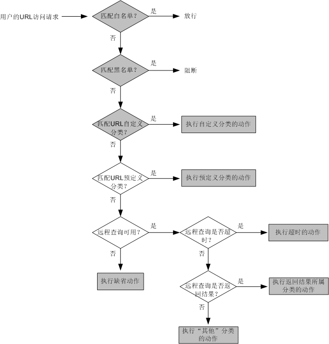

实际环境中URL的信息组成情况比较复杂, 有些网站的子网站以二级域名方式体现, 如下如中的示例1所示; 有些网站的子网站则以目录方式体现, 如下图中的示例2所示: 还有一些URL的参数部分包含另一个网站的地址, 如下图中的示例3所示

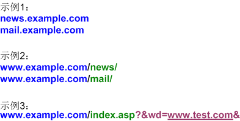

另外，某些网站的网页中还可能会链接其他网站的资源。例如，有一些购物类网站的页面中经常会引用其他网站的图片，是否对图片资源所属网站进行管控，决定能否完整地查看该购物类网站的网页。

上述这些情况都可能会影响最终的过滤效果，因此在配置URL过滤时，要对网站的URL信息进行分析，了解网站整体架构和网页中包含的内容信息，全面考虑各种影响因素，才能更好地实现URL过滤效果。

### URL过滤与周边特性逻辑关系
URL过滤特性的配置涉及多个功能模块，需要这些模块之间相互配合协作，如下图所示。

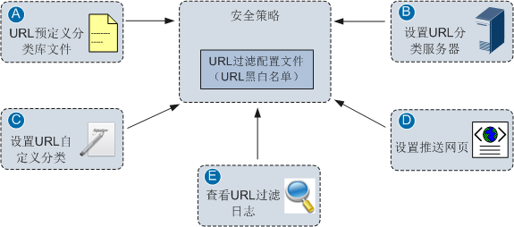

URL过滤特性的主体配置是URL过滤配置文件和安全策略。URL过滤配置文件中定义了URL黑白名单，以及针对分类的动作；安全策略中定义了匹配条件（对哪些流量进行URL过滤）、动作（必须为允许），然后引用URL过滤配置文件。其它几个功能模块的作用如下：

- A: NGFW出厂时默认带有一个URL预定义分类库文件，并且在启动时会自动加载该文件。如果NGFW没有加载该文件，请管理员手动加载。
- B: 设置URL分类服务器参数，包括NGFW所在的国家/地区、查询超时后的处理动作等，使得NGFW可以通过华为安全服务中心进行远程查询。远程查询需要购买License才能使用。
- C: 设置URL自定义分类，作为预定义分类的补充。管理员可以在NGFW上创建单独的分类，并在分类中添加相关的自定义URL条目；也可以在现有的预定义分类中添加自定义URL条目。
- D: 推送信息的设置将会影响NGFW阻断用户的URL访问请求后向用户推送的网页内容。NGFW提供了缺省的网页内容，也可以通过设置推送信息来定制个性化的内容。NGFW支持为黑名单阻断、预定义阻断、自定义阻断、缺省动作阻断等推送网页。
- E: 查看URL过滤日志，检查URL过滤结果是否符合预期，根据日志调整URL过滤的配置。


### Web配置界面展示
下面给出了URL过滤配置文件的Web配置界面（以USG6000 V100R001C30SPC100版本为例），并对界面上的配置项进行简要解释。

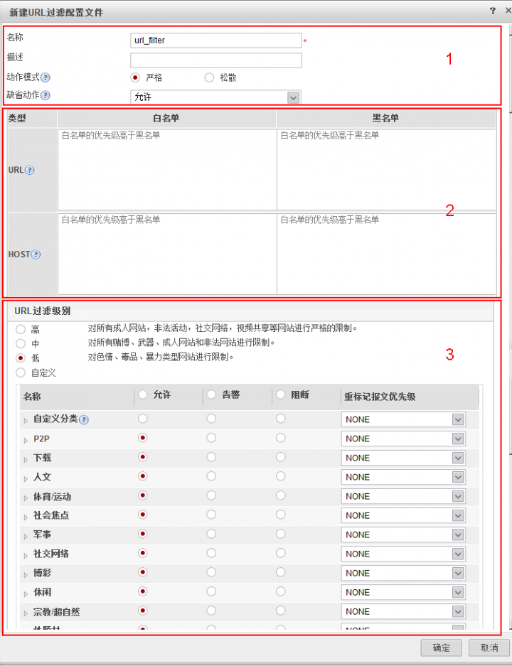

URL过滤配置文件的配置界面分为3个区域，1是基本配置区域，在该区域中设置URL过滤配置文件的名称和描述，以及动作模式和缺省动作；2是URL黑白名单配置区域，URL黑白名单只对于当前配置文件生效；3是URL过滤级别配置区域，在该区域设置URL预定义分类和自定义分类对应的处理动作。

对于URL预定义分类，NGFW提供了三个缺省的URL过滤级别，定义了各个分类的处理动作。管理员可直接使用这三个过滤级别，简化配置。

高：对所有非法网站、社交网络、视频共享等网站进行严格的限制。

中：对所有赌博、武器网站和非法网站进行限制。

低：对暴力类型的网站进行限制。

管理员也可以手动调整URL预定义分类中各个分类的动作，实现差异化的管控需求。配置时需要注意，处理动作始终以小类为准，管理员可以设置大类的处理动作，让所有小类都继承；也可以单独设置每个小类的处理动作。下面给出了一个调整大类和小类动作的操作示意图。

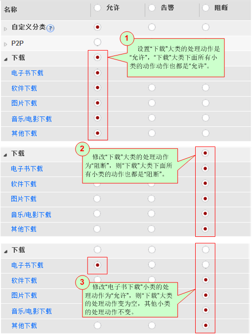

对于URL自定义分类，其处理动作需要管理员逐一手工设置，默认的处理动作为允许。

### URL过滤配置实例
下面我们进入实战部分，来看几个具体的配置实例。配置之前，必须保证URL预定义分类库文件已经加载，同时建议部署远程查询功能。

如下图所示，NGFW部署在企业用户与Web服务器之间，NGFW上配置URL过滤功能，限制企业用户可访问的网站或网页资源，规范企业用户的上网行为。这里我们以HTTP协议为例，如果是针对HTTPS协议进行URL过滤，还需要在NGFW上配置SSL解密策略。

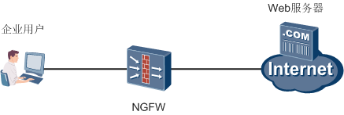

#### 举例1：使用URL预定义分类允许/阻断用户访问请求
某企业要求对员工的上网行为进行管控，允许访问搜索、门户类网站，不允许访问求职招聘类网站。企业管理员在NGFW上配置URL过滤功能，使用已经存在的URL预定义分类，实现上述需求。

首先，配置URL过滤配置文件，将预定义分类中的求职招聘类的动作设置为阻断，将搜索/门户类的动作设置为允许，如下图所示。这里仅仅是用这两个分类来示意配置过程，实际应用时，可以根据需求设置其他分类的动作。

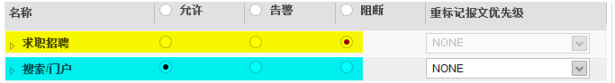

URL过滤配置文件创建或修改后，**必须在Web界面上执行“提交”操作才能生效**。提交过程所需时间较长，请耐心等待，建议完成所有URL过滤配置文件的配置后再统一进行提交。

然后，在安全策略中引用该配置文件，同时设置推送信息来定制个性化的网页，当NGFW阻断用户的URL访问请求后，将会向用户推送该网页。

完成上述配置后，企业内部员工访问www.baidu.com，该网站属于搜索类网站，可以正常访问。而当员工访问www.51job.com时，由于该网站属于求职招聘类网站，所以访问请求被NGFW阻断，同时员工的浏览器中可以看到NGFW推送的提示网页。

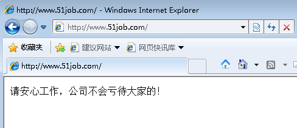

如果URL过滤的结果不符合预期，访问请求被误阻断或误放行，对于预定义分类来说，最可能的原因就是该网站所属分类是否准确。此时我们可以先查看一下URL过滤日志，然后确定被误阻断或误放行的URL具体属于哪一个预定义分类。

在Web界面上的URL分类页签中，输入待查询的URL条目进行查询，就可以获知该URL是否属于预定义分类、具体属于哪一个分类。

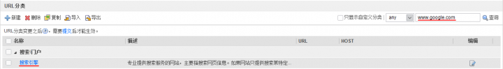

如果查询结果显示该URL不属于求职招聘类或搜索/门户类，此时可以调整该URL所属分类的动作，或者把该URL以自定义分类的形式添加到求职招聘类或搜索/门户类中，自定义分类的处理优先级比预定义分类高，会优先执行求职招聘类或搜索/门户类的动作。

如果没有查询到该URL属于哪个分类，说明NGFW缺省加载的URL预定义分类库文件中不包含该URL，假设没有使用远程查询功能，则会执行缺省动作。解决方法有两种，购买远程查询服务，或者使用自定义分类。

上述配置的命令行脚本如下：
```bash
#
profile type url-filter name profile_url_filter_example1
 category pre-defined subcategory-id 125 action block
 category pre-defined subcategory-id 126 action allow
 category pre-defined subcategory-id 190 action allow
#

security-policy
rule name policy_url_filter_example1
  source-zone trust
  destination-zone untrust
  source-address 192.168.0.0 mask 255.255.255.0
  profile url-filter profile_url_filter_example1
  action permit
#
```
#### 举例2：使用URL自定义分类允许/阻断用户访问请求
某企业要求对员工的上网行为进行管控，不允许访问特定的网站www.example1.com和www.example2.com。企业管理员在NGFW上配置URL过滤功能时，发现NGFW缺省加载的URL预定义分类库文件中不包含这两条URL，而且也没有使用远程查询功能，因此决定使用自定义分类来实现上述需求。

首先，创建自定义分类，添加URL条目。需要注意的是，NGFW对URL进行过滤时，不区分大小写，所以添加URL条目时全用小写字母即可。


然后，配置URL过滤配置文件，将自定义分类的动作设置成阻断。配置完成后，执行“提交”操作，并在安全策略中引用该配置文件。


完成上述配置后，企业内部员工访问www.example1.com和www.example2.com网站时，访问请求被NGFW阻断，同时员工的浏览器中可以看到NGFW推送的提示网页。

上述配置的命令行脚本如下：
```bash
#
url-filter category user-defined name user_define_url
 add url www.example1.com
 add url www.example2.com
#
profile type url-filter name profile_url_filter_example2
 category user-defined name user_define_url action block
#

security-policy
rule name policy_url_filter_example2
  source-zone trust
  destination-zone untrust
  source-address 192.168.0.0 mask 255.255.255.0
  profile url-filter profile_url_filter_example2
  action permit
#
```
### 举例3：只允许用户访问特定的网站，其他网站都不允许访问
某企业的主营业务是电子商务，只允许员工访问淘宝（www.taobao.com）网站，其他网站都不允许访问。企业管理员在NGFW上配置URL过滤功能，使用“白名单+所有分类全部阻断+缺省阻断”的思路来实现上述需求。

首先，配置URL过滤配置文件，在白名单中添加www.taobao.com，然后将所有分类的动作都设置成阻断，将缺省动作也设置成阻断。另外，如果使用了远程查询功能，将远程查询的超时动作也设置成阻断。配置完成后，执行“提交”操作，并在安全策略中引用该配置文件。


完成上述配置后，企业内部员工可以正常访问www.taobao.com网站，而无法访问其他的网站，访问其他网站时在浏览器中可以看到NGFW推送的提示网页。

如果淘宝网站存在abc.taobao.com这样的域名，无法命中上面设置的白名单，就会被误阻断。此时我们可以换一种方式，按域名（Host）方式来添加白名单，如下图所示。


企业内部员工再访问类似xxx.taobao.com这样的网站，就会命中白名单，从而能够正常访问。

这里之所以没有按整体URL的方式来添加白名单，是因为*.taobao.com在URL规则中表示后缀匹配，只能匹配以该字符串结尾的URL，像www.taobao.com/1.asp这样的URL就无法匹配了，因此不能按整体URL方式来添加白名单

还有一种情况需要注意，我们设置的*.taobao.com只是淘宝网站的主体页面，而淘宝网站的页面中会链接其他网站的各种图片、视频资源。按照上面的设置，这些网站会被阻断，所以就无法正常看到各类资源。如果要想完整地查看淘宝网站的页面内容，还需要把这些资源所属网站加入到白名单中。

上述配置的命令行脚本如下：
```bash
#
profile type url-filter name profile_url_filter_example3
 add whitelist host *.taobao.com
 category pre-defined subcategory-id 101 action block
 ……    //此处省略了一些配置脚本
 default action block
#
security-policy
rule name policy_url_filter_example3
  source-zone trust
  destination-zone untrust
  source-address 192.168.0.0 mask 255.255.255.0
  profile url-filter profile_url_filter_example3
  action permit
#
```
### 举例4: 不允许用户访问特定的网站, 其他网站不限制
某企业发现员工在工作时间内经常访问淘宝（www.taobao.com）、微博（www.weibo.com）网站，严重影响了工作效率，因此决定限制员工访问这两个网站，其他网站不进行限制。企业管理员在NGFW上配置URL过滤功能，使用“黑名单+所有分类全部允许+缺省允许”的思路来实现上述需求。

首先，配置URL过滤配置文件，在黑名单中添加URL条目，这里使用按域名（Host）方式来添加，保证类似`xxx.taobao.com`、`xxx.weibo.com`这样的网站也能命中黑名单。


然后将所有分类的动作都设置成允许，将缺省动作也设置成允许。另外，如果使用了远程查询功能，将远程查询的超时动作也设置成阻断。配置完成后，执行“**提交**”操作，并在安全策略中引用该配置文件。

完成上述配置后，企业内部员工无法访问`*.taobao.com`、`*.weibo.com`网站，但是可以访问其他的网站，URL过滤结果符合预期。

上述配置的命令行脚本如下：
```bash
#
profile type url-filter name profile_url_filter_example4
 add blacklist host *.taobao.com
 add blacklist host *.weibo.com
#
security-policy
rule name policy_url_filter_example4
  source-zone trust
  destination-zone untrust
  source-address 192.168.0.0 mask 255.255.255.0
  profile url-filter profile_url_filter_example4
  action permit
#
```
### 举例5: 允许用户访问某个网站旗下特定的子网站, 不能访问其他子网站
某企业希望对员工访问百度（www.baidu.com）网站的行为进行控制，只允许员工访问百度旗下的百度文库和百度百科，不允许员工访问百度旗下的其他子网站，如百度搜索、百度贴吧、百度网盘等。企业管理员在NGFW上配置URL过滤功能，使用“白名单+黑名单”的思路来实现上述需求。

首先，配置URL过滤配置文件，在白名单和黑名单中分别添加URL条目。配置完成后，执行“提交”操作，并在安全策略中引用该配置文件。


这里在白名单中添加URL条目时，可以按整体URL方式添加，也可以按域名（Host）方式添加；在黑名单中添加URL条目时，只能按域名（Host）方式添加，原因在上面的举例3中已经说明了。

完成上述配置后，企业内部员工可以访问百度旗下的`wenku.baidu.com`和`baike.baidu.com`网站，不能访问百度旗下的其他网站，URL过滤结果符合预期。

上述配置的命令行脚本如下：
```bash
#
profile type url-filter name profile_url_filter_example5
 add blacklist host *.baidu.com
 add whitelist host wenku.baidu.com
 add whitelist host baike.baidu.com
#
security-policy
rule name policy_url_filter_example5
  source-zone trust
  destination-zone untrust
  source-address 192.168.0.0 mask 255.255.255.0
  profile url-filter profile_url_filter_example5
  action permit
#
```
## 邮件过滤特性原理
相比于QQ、微信这样广泛使用的即时通信工具，电子邮件这一传统的通信方式似乎越来越小众化，我们现在很少使用邮件来传递消息。但是对于企业来说，邮件仍然是工作中不可或缺的沟通手段，很多企业也都部署了邮件服务器，通过邮件开展业务。

企业通过邮件开展业务的同时，也会面临一些难题。例如，不请自来的垃圾邮件充斥着邮箱，影响员工阅读正常邮件，降低了工作效率；机密信息可能会通过邮件泄露，企业利益受到损害。所以无论是出于提高员工工作效率还是保证信息安全的考虑，企业都需要对发送和接收邮件的行为进行管控。

NGFW提供了邮件过滤特性，包括垃圾邮件过滤和邮件内容过滤功能，双管齐下帮助企业破解上述难题。下面我们先来学习NGFW上的垃圾邮件过滤功能。

### 垃圾邮件过滤
垃圾邮件（SPAM）指的是未经用户许可强行发送到用户邮箱的电子邮件，内容一般是广告、宣传资料、***等，甚至带有病毒程序。大量的垃圾邮件不但消耗网络带宽，占用邮箱空间，还带来了安全隐患。NGFW作为企业的网关，必须坚决阻断垃圾邮件的传输。

NGFW使用RBL（Real-time Blackhole List）技术来过滤垃圾邮件，简述其原理就是NGFW获取邮件发送方SMTP服务器的IP地址，向RBL服务器发起查询。RBL服务器维护着实时黑名单列表，列表中的SMTP服务器都发送过垃圾邮件，NGFW根据RBL服务器的返回结果判断该IP地址是否属于垃圾邮件服务器，进而采取相应的处理动作。

垃圾邮件过滤的过程需要NGFW、DNS服务器和RBL服务器三者协同工作，如下图所示。

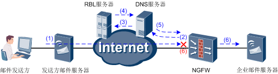

1. 发件人通过邮件服务器向企业邮件服务器发起SMTP连接。
2. NGFW解析出SMTP请求中邮件发送服务器的IP地址，并将此IP地址反转后和RBL服务器名称一起组合成一个“域名”，向DNS服务器发起查询。例如：发送方邮件服务器IP地址为1.2.3.4，RBL服务器为sbl.spa**aus.org，则NGFW将以“4.3.2.1.sbl.spa**aus.org”发起查询。
3. DNS服务器从查询报文中读取RBL服务器名称，解析出RBL服务器的IP地址，并将查询请求转发给RBL服务器。
4、RBL服务器在指定的区域中查询IP地址（1.2.3.4），并将查询结果返回给DNS服务器。如果此IP地址在RBL中，则返回应答码；否则返回NXDOMAIN。
5. DNS服务器将查询结果转发给NGFW。
6. NGFW根据查询结果处理SMTP请求：
   - 如果RBL服务器返回应答码，则该邮件被视为垃圾邮件。NGFW根据管理员预先设置的响应动作，转发SMTP连接请求并记录日志或者阻断SMTP连接。
   - 如果RBL服务器返回NXDOMAIN，NGFW转发SMTP连接请求。
   - 如果RBL查询超时，NGFW转发SMTP连接请求。

以上是一个完整的初始查询流程。为了提高效率，减少查询流量，NGFW会缓存RBL查询的结果。后续NGFW解析出发送方邮件服务器的IP地址后，首先在缓存中查询，查询不到再发起RBL查询。

对于NGFW来说，部署垃圾邮件过滤功能时，需要重点关注的是DNS服务器、RBL服务器以及应答码这三个配置项，下面分别对这三个配置项进行介绍。

#### DNS服务器
RBL查询过程使用的是标准的DNS查询报文, NGFW向DNS服务器发起查询, 也是由DNS服务器来返回查询结果, 所以DNS服务器的运行状态决定查询效果. 若想正常进行RBL查询, DNS服务器必须满足如下条件:
1. DNS服务器必须能够向NGFW开放查询

    有一些DNS服务器是不开放查询的（比如根服务器），有些DNS服务器基于安全考虑，也会限制仅响应指定客户端的查询请求（比如电信的DNS服务器不对网通用户开放），因此必须选用向NGFW开放查询的DNS服务器。

2. DNS服务器必须支持递归查询

  递归查询指的是DNS服务器收到查询请求后, 如果查不到记录, 则向另外的DNS服务器发出查询请求, 以此类推, 最终得到结果后转发给NGFW. 这也是RBL查询流程对DNS服务器的要求.

  DNS服务器的另一种查询方式是迭代查询。当DNS服务器1不能解析查询请求时，DNS服务器1只会将DNS服务器2的IP地址返回给NGFW，由NGFW重新向DNS服务器2重新查询，直到查询到记录为止。此时NGFW收到的是DNS服务器2的IP地址，而不是应答码。如果NGFW上的应答码配置不当（使用了“任意应答码”），就会导致正常邮件被当作垃圾邮件处理，产生误报。

3. DNS服务器必须没有被DNS劫持

  DNS劫持指的是ISP为引导用户访问其增值站点，对DNS服务器做了特殊配置，使得DNS服务器在应该返回NXDOMAIN时，篡改为其增值站点的的IP地址。这样，NGFW收到的查询结果就变成了DNS劫持后的IP地址，也会产生误报，所有正常邮件被当作垃圾邮件处理。

  如何判断一个DNS服务器是否符合上述要求呢? 我们可以使用nslookup命令（Windows系统）或dig命令（Linux系统）来探测DNS服务器，根据命令执行后的返回信息来判断该DNS服务器的运行状态。具体的操作过程在NGFW的产品文档或网络上都有详细的说明，此处就不赘述了。

#### RBL服务器 
设置好DNS服务器后，还需要确定使用哪个RBL服务器。网络上有很多的RBL服务提供商，他们提供的RBL侧重点和严格程度不尽相同；有的提供商还会提供多个RBL，用于收录不同种类的IP地址，该怎么选择呢？
对于企业管理员来说，应根据自己所在国家、经常收到的垃圾邮件源来选择合适的RBL服务提供商。下面给出了两个主流的RBL服务提供商，管理员可根据实际情况选用。

#### 中国反垃圾邮件联盟(CASA) `http://www.anti-spam.org.cn/`

| RBL  | 查询集                   | 应答码    | 备注                                                                                                                          |
| ---- | ------------------------ | --------- | ----------------------------------------------------------------------------------------------------------------------------- |
| CBL  | cbl.anti-spam.org.cn     | 127.0.8.2 | CBL主要面向中国国内的垃圾邮件情况，所甄选的黑名单地址也以国内的垃圾邮件反馈情况为主。CBL比国外的一些RBL服务器更适合中国国情。 |
| CBL+ | cblplus.anti-spam.org.cn | 127.0.8.2 | CBL和中国动态地址列表的合集。                                                                                                 |
| CBL- | cblless.anti-spam.org.n  | 127.0.8.2 | 相对CBL+, 特别去除了中国邮件服务器运营白名单                                                                                  |

#### Spa m h aus   `http://www.spa m h aus.org/`
| RBL | 查询集              | 应答码        | 备注                                                               |
| --- | ------------------- | ------------- | ------------------------------------------------------------------ |
| SBL | sbl.spa m h aus.org | 127.0.0.2-3   | 经过验证的垃圾邮件源及确实有垃圾邮件你发送行为的实时黑名单列表     |
| XBL | xbl.spa m h aus.org | 127.0.0.4-7   | 因安全问题(僵尸主机, 木马感染主机等)而发送垃圾邮件的实时黑名单列表 |
| PBL | pbl.spa m h aus.org | 127.0.0.10-11 | 不应该发送邮件的IP地址列表,包括动态地址.                           |
| ZEN | zen.spa m h aus.org | 127.0.0.2-11  | SBL,XBL和PBL和集合, 推荐使用                                       |

上述表格中的查询集指的就是RBL服务器的名称，需要在NGFW上配置。另外，还有应答码这一项也需要在NGFW上配置，下面我们来进一步了解应答码的概念和作用。

#### 应答码
应答码指的是RBL查询过程中RBL服务器返回的结果，通常是IP地址的形式，用来表示NGFW查询的IP地址已经被列入RBL中，即RBL服务提供商认为该IP地址对应的邮件服务器经常转发垃圾邮件。

同时，NGFW上也要设置正确的应答码，该IP地址发送的邮件才会被NGFW当作垃圾邮件处理。如果应答码设置错误，与RBL服务器返回的应答码不一致，NGFW将视此邮件为正常邮件，并正常转发SMTP连接请求。

在NGFW上有两种设置应答码的方式：

其一，获取RBL服务提供商的所有应答码并一一填写，或者也可以选择只填写一部分应答码，即表示只有返回这些应答码的查询，才被当作垃圾邮件处理。

其二，使用“任意应答码”，无需填写具体的应答码。NGFW会把所有查询结果为IP地址的邮件服务器判定为垃圾邮件发送源，在DNS服务器被劫持的情况下，这种方式将产生误报。

所以，建议还是要在NGFW上准确设置应答码，避免使用“任意应答码”方式，这样就可以保证即使DNS服务器被劫持，也不影响RBL查询效果。

上面简要介绍了RBL技术的实现原理，以及与NGFW相关的三个配置项。关于RBL技术，我们先前在华为悦读汇中已经进行过详细介绍，有兴趣的读者可以点击这里浏览。

由于RBL服务提供商收录IP地址的原则和技术方案或多或少都会有限制，通过RBL技术实现垃圾邮件过滤时，不可避免地带来了误报和漏报问题。对此，NGFW提供了本地白名单和黑名单功能，作为解决误报和漏报的辅助手段。

#### 白名单
白名单来解决误报问题, 如果发送方邮件服务器的IP地址命中白名单, 则NGFW放行邮件, 并记录日志, 不再进行其他检查.

企业管理员可以查看邮件过滤日志, 从日志中获取到被误阻断的邮件服务器的IP地址, 添加到白名单中.

#### 黑名单
黑名单用来解决漏报问题, 如果发送方邮件服务器的IP地址命中黑名单, 则NGFW直接阻断此邮件, 并记录日志

向黑名单中添加邮件服务器的IP地址时, 需要分析没有被过滤掉的垃圾邮件的转发路径, 从中获取发送该邮件的邮件服务器的IP地址. 具体来说，邮件在发送过程中，有可能需要经过多次中转。每一次中转，邮件服务器都会在邮件头中添加一个Received域，表明了邮件经过该服务器的转发，我们就是从邮件头来追溯邮件的转发路径。

邮件头中Received语句的基本表达格式是：From Server A by Server B，其中，Server A为发送邮件的邮件服务器，Server B为接收邮件的邮件服务器。一般情况下最后一个Received语句中的Server A就是发送垃圾邮件的邮件服务器。如下给出了Microsoft Outlook接收到的邮件的邮件头信息：

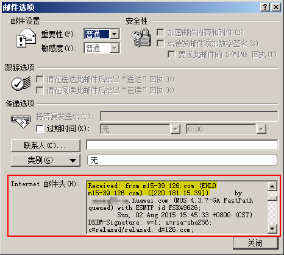

根据黑名单过滤的工作原理，我们需要确定的是向NGFW发起SMTP连接的邮件服务器，即在邮件转发路径中查找，处于NGFW保护范围内的企业邮件服务器是从哪个邮件服务器接收的邮件。以上图为例，邮件是从`m15-39.126.com(220.181.15.39)`发送到企业邮件服务器`xxx.huawei.com`的，如果想要NGFW阻止这封邮件，把`220.181.15.39`加入黑名单即可。

前面我们所介绍的RBL、黑白名单都属于基于IP地址的过滤技术，接下来我们学习基于邮件协议的邮件内容过滤技术，实现多样化的邮件管控需求。

### 邮件内容过滤
邮件内容过滤主要包括两个部分: 邮箱地址检查(含匿名邮件检测), 邮件附件控制. 其中, 邮件地址检查根据邮件的发件人和收件人邮箱地址来过滤邮件; 匿名邮件检测用来阻断发件人为空的邮件; 邮件附件控制通过限制邮件所写带的附件数量和每个附件的大小来过滤邮件

邮件内容过滤主要包括两个部分: 邮箱地址检查(含匿名邮件检测), 邮件附件控制. 其中, 邮箱地址检查根据邮件的发件人和收件人邮箱地址来过滤邮件; 匿名邮件检测用来阻断发件人为空的邮件; 邮件附件控制通过限制邮件所携带的附件数量和每个附件的大小来过滤邮件

#### 邮箱地址检查
邮箱地址检查指的是NGFW以代理方式检测SMTP、POP3和IMAP协议中的关键命令，从中提取发件人和收件人的邮箱地址，根据邮箱地址对邮件采取相应的动作。NGFW支持的动作包括：
- 允许: 允许邮件通过
- 阻断: 阻断邮件通过. 对于IMAP协议, 目前仅支持告警处理, 即允许邮件通过并记录日志, 无法阻断.

SMTP协议主要用于客户端向邮件服务器或者一个邮件服务器向另一个邮件服务器发送邮件，POP3和IMAP协议主要用于客户端从邮件服务器接收邮件。与此对应，NGFW基于控制方向（发送邮件和接收邮件）来对邮箱地址进行检查。所谓控制方向，其本质是邮件协议。控制发送邮件即针对SMTP协议，控制接收邮件即针对POP3和IMAP协议。

下面来看两个典型的应用场景。第一个场景，企业内网部署了邮件服务器，企业用户通过该服务器发送邮件，外网的邮件服务器也会向该邮件服务器发送邮件，如下图所示。

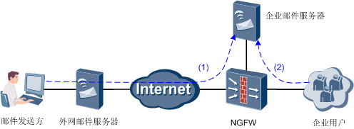

该场景中, 通过邮箱地址检查来实现发送邮件方向(SMTP协议)的邮件过滤需求
1. 对发件人的邮箱地址进行检查, 阻止外网的恶意用户向企业内网发送邮件
2. 对发件人的邮箱地址进行检查, 阻止特定的企业内网用户向外发送邮件

另外, 再检查发件人邮箱地址的基础上, 还可以同时针对收件人的邮箱地址进行检查, 实现更精确的过滤需求, 这里有一个极端情况需要注意, 如果一封邮件同时命中发件人邮箱地址和收件人邮箱地址的检查, 而两者的动作不一致, 则NGFW执行严格的阻断动作, 该邮件将被阻断

第二个场景,企业内网没有部署自己的邮件服务器, 而是使用某知名邮箱服务来收发邮件, 如下图所示.


该场景中，通过邮箱地址检查来实现接收邮件方向（POP3/IMAP协议）的邮件过滤需求。具体来说，可以对发件人的邮箱地址进行检查，阻止外网的恶意用户向企业内网发送邮件。

当然，如果企业内网部署了邮件服务器，也可以对发件人的邮箱地址进行检查，防止企业用户收到恶意用户发送的邮件，如下图所示。但是这种方式不能减少邮件服务器的资源浪费和带宽占用，没有场景一中第1个需求的防范效果好。

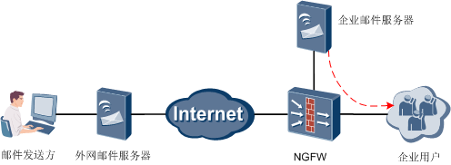

邮箱地址与上一篇我们介绍过的URL类似，本质上也是一串或长或短的字符串，那么NGFW如何对邮箱地址进行检查呢？针对邮箱地址，NGFW提供了四种匹配方式，包括前缀匹配、后缀匹配、精确匹配和关键字匹配，如下表所示。

| 匹配方式 | 效果 | 典型应用 |
| -------- | ---- | -------- ||
| 前缀匹配   | 匹配所有以指定字符串开头的邮箱地址。 | 用“username@”匹配来自username的所有邮箱地址，包括username@263.net、username@gmail.com等                     |
| 后缀匹配   | 匹配所有以指定字符串结尾的邮箱地址   | 用“@gmail.com”匹配所有Gmail邮箱。后缀匹配可以轻松实现针对域名的邮件过滤，最适合用于过滤来自指定公司的邮件。 |
| 精确匹配   | 匹配指定邮箱地址                     | 用“username@gmail.com”匹配username@gmail.com。                                                              |
| 关键字匹配 | 匹配包含指定字符串的邮箱地址         | 用“username@gmail”匹配所有包含“username@gmail”的邮箱地址，如username@gmail.com、username@gmail.net等。      |

邮箱地址检查功能的关键在于邮箱地址, 邮箱地址是否准确决定着过滤效果. 这里需要特别注意, **SMTP邮件服务器再转发邮件时不会校验发件人的邮箱地址, 邮件中的收件人邮箱地址时不可靠的, 所以邮箱地址检查存在一定的误报, 这是SMTP协议本身的缺陷**.

企业管理员使用邮箱地址检查功能时，请务必明确哪些人（邮箱地址）能不能发送邮件或者接收邮件、能向哪些人发送邮件，准确定义邮箱地址。

#### 匿名邮件检测
匿名邮件指的是没有发件人邮箱地址的邮件。上面我们讲过，在邮件的发送过程中，SMTP服务器并不校验发件人的邮箱，发件人可以伪造邮箱地址甚至不提供邮箱地址，这就产生了匿名邮件。

通常情况下，使用匿名方式发送邮件的动机是可疑的，邮件中可能包含无用或有害的信息，对企业来说，匿名邮件一般都和业务无关，应直接阻断。

NGFW提供了匿名邮件检测功能，类似于邮箱地址检查，只不过检查到发件人邮箱地址为空时，执行匿名邮件检测的动作，包括允许、阻断和告警。对于IMAP协议，目前不支持阻断动作，只支持告警动作。甚至不提供

#### 邮件附件控制
企业用户发送邮件时可以携带附件, 大量的附件不但占用带宽, 还存在信息泄漏的风险. 对此, NGFW提供了邮件附件控制功能, 可以控制邮件中所携带的附件的数量和每个附件的带下, 从而控制带宽占用，并在一定程度上避免大量信息通过邮件泄露出去。

企业管理员可以针对发送方向和接收方向分别设置附件个数上限和附件大小限制。其中，附件大小限制是针对邮件中的每一个附件而言的，只有一个附件超过阈值，此邮件就按照指定的处理动作处理。处理动作包括告警和阻断，对于IMAP协议，目前不支持阻断动作，只支持告警动作。

邮件附件控制功能只能实现非常粗粒度的过滤，NGFW还支持针对邮件的标题、正文、附件名称对邮件进行精细化的过滤，我们将在后续的内容安全特性中介绍。

下面给出了邮件过滤特性中各个模块的处理顺序, 以及相应的处理动作

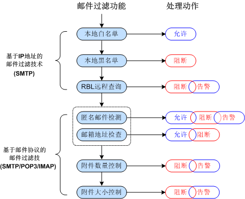

至此，邮件过滤特性的原理部分介绍完毕，我们在这里总结一下：
- 为了解决垃圾邮件泛滥的问题，NGFW提供了RBL技术，并辅助以本地白名单和黑名单解决误报和漏报问题。RBL、本地黑白名单都属于基于IP地址的邮件过滤技术，适用于SMTP协议。
- 为了满足更多样化的邮件管控需求，NGFW还提供了邮箱地址检查、匿名邮件检测和邮件附件控制功能，这些是基于SMTP/POP3/IMAP协议的邮件过滤技术。

## 邮件过滤特性配置
在NGFW上，垃圾邮件过滤和邮件内容过滤在配置上相对比较独立，设置好各自的参数后，统一归并到邮件过滤配置文件中。
### 邮件过滤与周边特性逻辑关系
与前面我们介绍过的AV、IPS、URL过滤特性相似，邮件过滤特性的配置也涉及多个功能模块，需要这些模块之间相互配合协作，如下图所示。

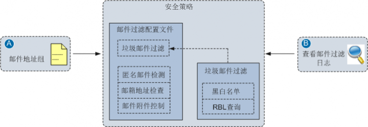

邮件过滤特性的主体配置是邮件过滤配置文件和安全策略。邮件过滤配置文件中定义了垃圾邮件过滤和邮件内容过滤两大功能；安全策略中定义了匹配条件（对哪些流量进行邮件过滤）、动作（必须为允许），然后引用邮件过滤配置文件。其它几个功能模块的作用如下：

- A 设置邮件地址组，定义邮箱地址的匹配方式和字符串，供邮箱地址检查功能使用。
- B 查看邮件过滤日志，检查是否存在将正常邮件误报为垃圾邮件的情况。如果存在误报，从日志中获取到被误阻断的邮件服务器的IP地址，添加到白名单中。

### Web配置界面展示
下面给出了邮件过滤配置文件的Web配置界面(以USG6000 V100R001C30SPC100版本为例), 并对界面上的配置项进行简要解释。

首先是垃圾邮件过滤的Web配置界面，界面中包括DNS服务器设置、白名单设置、黑名单设置以及RBL查询设置，如下图所示。RBL查询设置中可以配置多个RBL服务器，但同一时间只能启用一个RBL服务器。

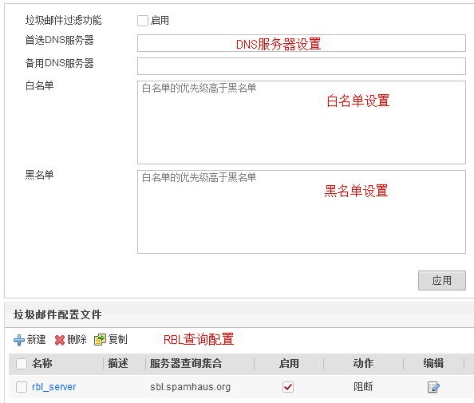

然后是邮件过滤配置文件的Web配置界面，如下图所示。


在邮件过滤配置文件的Web配置界面中，1是基本信息配置区域；2是开启垃圾邮件过滤区域，开启后，将按照垃圾邮件过滤的Web配置界面中设置的参数对垃圾邮件进行过滤；3是匿名邮件检测配置区域；4是邮箱地址检查配置区域；5是邮件附件控制配置区域。

### 邮件过滤配置实例
下面我们进入实战部分, 来看几个具体的配置实例

#### 举例1：检查发邮件邮箱地址，阻止外网恶意用户向企业内网发送邮件
如下图所示，某企业内网部署了邮件服务器，企业用户通过该服务器收发邮件。为了阻止外网恶意用户向内网用户发送邮件，企业管理员在NGFW上部署了邮件过滤特性，使用邮箱地址检查功能来过滤掉特定邮箱发送到企业内网的邮件。

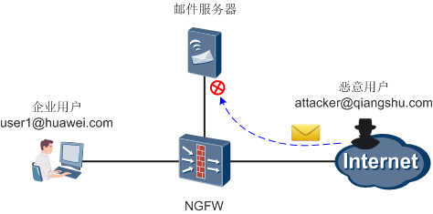

首先，创建邮件地址组，添加恶意用户的邮箱地址（这里以“attacker@qiangshu.com”为例），指定匹配方式为精确匹配。创建好的邮件地址组供邮件过滤配置文件引用。

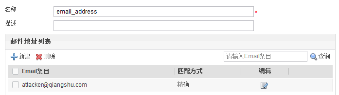

接下来，配置邮件过滤配置文件，对发送方向上的邮件的发件人邮箱地址进行检查，如果发件人的邮箱地址匹配邮件地址组中定义的邮箱地址，则阻断该邮件。

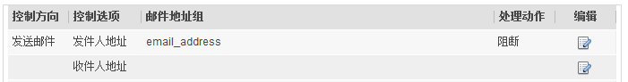

邮件过滤配置文件创建或修改后，**必须在Web界面上执行“提交”操作才能生效**。提交过程所需时间较长，请耐心等待，建议完成所有邮件过滤配置文件的配置后再统一进行提交。

最后，在安全策略中引用该配置文件。

完成上述配置后，恶意用户attacker@qiangshu.com向user1@huawei.com发送邮件时，邮件将被NGFW阻断，同时NGFW上会生成邮件过滤日志。而其他用户如user1@qiangshu.com则可以正常向user1@huawei.com发送邮件。

上述配置的命令行脚本如下：
```bash
#
mail-address-group name email_address
 pattern exact attacker@qiangshu.com
#
profile type mail-filter name email_filter_example1
 send-mail sender group name email_address
#
security-policy
 rule name policy_email_filter_example1
  source-zone untrust
  destination-zone dmz
  destination-address 192.168.1.0 mask 255.255.255.0
  profile mail-filter email_filter_example1
  action permit
#
```
#### 举例2: 实施邮件附件控制, 阻止企业内网用户向外发送携带附件的邮件
如下图所示，某企业内网部署了邮件服务器，企业用户通过该服务器收发邮件。为了避免信息泄露，保证企业知识产权，企业安规要求内网用户发送邮件时不能带有附件。企业管理员在NGFW上部署了邮件过滤特性，使用邮件附件控制功能过滤掉企业用户发出的带有附件的邮件。

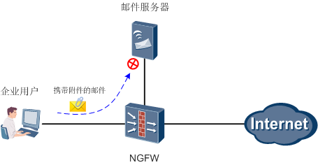

首先，配置邮件过滤配置文件，设置邮件附件控制功能中附件个数最大值为0，即不能发送带有附件的邮件。

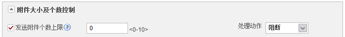

配置完成后，执行“**提交**”操作，并在安全策略中引用该配置文件。

完成上述配置后，企业内网用户向外发送带有附件的邮件时，邮件将被NGFW阻断，同时NGFW上会生成邮件过滤日志。而企业内网用户向外发送不带有附件的邮件时，则可以正常发送。

上述配置的命令行脚本如下：
```bash
#
profile type mail-filter name email_filter_example2
 send-mail attachment max-amount 0 action block
#
security-policy
 rule name policy_email_filter_example2
  source-zone trust
  destination-zone dmz
  source-address 192.168.0.0 mask 255.255.255.0
  profile mail-filter email_filter_example2
  action permit
#
```
#### 举例3：配置应用识别+URL过滤，禁止企业内网用户通过Web邮箱发送邮件
如下图所示，某企业没有部署自己的邮件服务器，而是使用Internet上的知名Web邮箱服务（如网易邮箱）来收发邮件。出于信息安全考虑，企业安规要求特定部门的员工只能通过Web邮箱接收邮件，不能向外发送邮件。

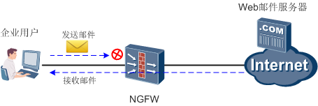

NGFW上的邮件过滤特性只支持SMTP,POP3和IMAP协议, 不支持HTTP协议(Web邮箱), 所以使用邮件过滤特性无法过滤Web邮箱的邮件。此时管理员可以综合运用应用识别+URL过滤功能，准确识别出Web邮箱的应用，然后基于URL过滤特性来阻断发送邮件的行为，实现上述需求。

首先，管理员需要分析员工使用网易Web邮箱收发邮件时的URL。管理员对员工与Web服务器之间交互的HTTP报文进行抓包，从HTTP POST报文中获取员工收发邮件时的URI信息。如下是员工发送邮件和回复邮件时使用的URI信息：

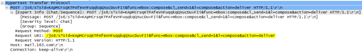


如下是员工接收邮件时使用的URI信息：

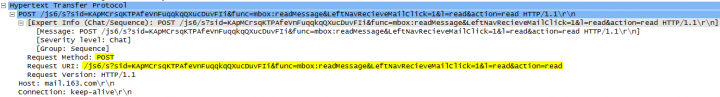

由报文中的URI信息可知，员工在发送或回复邮件时，使用的URL中都包含“action=deliver”字段；员工在接收邮件时，使用的URL中包含“action=read”字段。由此推断，“action”关键字表示的就是发送或接收邮件的动作，“action=deliver”即代表发送邮件动作。

这里为了保证过滤效果，还可以将“l=compose”字段也考虑进来，过滤掉包含这两个信息的URL，就可以阻断员工发送邮件的行为。

然后，创建URL自定义分类，使用关键字匹配方式，添加如下的URL条目：

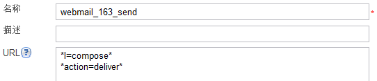

然后，配置URL过滤配置文件，将自定义分类的动作设置成阻断。配置完成后，执行“**提交**”操作，并在安全策略中引用该配置文件。配置安全策略时一定要精确定义匹配条件，指定受控部门员工的IP地址，并指定应用为Netease_Webmail和HTTP，以免影响非受控部门员工的正常收发邮件行为。

完成上述配置后，企业内部分指定部门的员工只能通过网易Web邮箱接收邮件，不能发送邮件。这里仅以网易Web邮箱为例来说明配置思路，如果使用的是其他的Web邮箱，也需要仔细分析URL信息，精确定义URL条目。

上述配置的命令行脚本如下：
```bash
#
url-filter category user-defined name webmail_163_send
 add url *l=compose*
 add url *action=deliver*
#
profile type url-filter name profile_url_filter_163_send
 category user-defined name webmail_163_send action block
#
security-policy
 rule name policy_email_filter_example3
  source-zone trust
  destination-zone untrust
  source-address 192.168.0.0 mask 255.255.255.0
  application app Netease_Webmail
  application app HTTP
  profile url-filter profile_url_filter_163_send
  action permit
#
```

## 文件过滤与内容过滤特性原理
一位伟人曾经说过：“最坚固的堡垒都是从内部攻破的。”而据国家计算机信息安全测评中心数据显示，互联网接入单位由于内部重要机密通过网络泄密而造成重大损失的事件中，只有1%是被黑客窃取造成的，而97%都是由于内部员工有意或者无意之间泄露而造成的。

传统防火墙对于内部员工这种看似“正常”的泄露机密的操作是无法防范的，因为这些操作既不是网络攻击，也不是入侵病毒。

为此，华为的NGFW针对机密数据泄露的防范推出了文件过滤和内容过滤功能，可以在一定程度上降低机密泄露的风险。

下面强叔就为大家一步步揭开文件过滤和内容过滤的神秘面纱。
### 文件过滤
文件过滤能够识别出通过NGFW的文件的真实类型, 并可以根据文件的真实类型对文件进行过滤. 那什么是文件的真实类型呢? 举个例子来说, 一个word文件`file.doc` 可以将文件名修改为file.exe, 但是它的真实文件类型仍然为doc。另外文件过滤同时也能够识别出文件的扩展名（后缀名）。当文件的真实类型无法识别时，NGFW还可以根据文件的扩展名对文件进行过滤。

那么文件过滤功能为什么能够降低机密数据泄露的风险呢？因为机密信息一般保存在文档中，而且文档还可以被压缩形成压缩文件。如下图所示，内部员工上传包含机密的文档到外网或者黑客从内网服务器窃取机密文档，都会导致公司机密或用户信息的泄露。所以通过文件过滤功能阻止内网用户上传文档文件和压缩文件到外网，以及阻止外网用户从内网服务器下载文档文件和压缩文件，可以大大降低机密信息泄露的风险。


文件过滤功能还可以降低病毒文件进入公司内部网络的风险。因为病毒常常包含在可执行文件中，且病毒的反检测和渗透防火墙的能力越来越强。所以阻止内网用户从外网下载可执行文件或阻断外网用户上传可执行文件到内网服务器，可以大大降低病毒进入内网的风险，如上图所示。

另外文件过滤功能还能够阻止占用带宽和影响员工工作效率的文件传输。因为公司员工下载大量与工作无关的视频和图片文件，会占用公司网络带宽，降低工作效率。所以如上图所示，阻止内网用户从外网下载视频、图片和压缩文件，可以保证正常业务的带宽和员工的工作效率。

文件过滤是对针对文件类型进行过滤，也就是会整体过滤掉某个类型的文件。然而在实际应用中，整体过滤掉一类文件虽然可以降低泄密风险，但也会妨碍正常的工作生活。所以这时我们就需要配合内容过滤功能，以便更精细的识别和过滤文件的内容。

### 内容过滤
内容过滤能够对用户上传和下载的文件内容中包含的关键字进行过滤。这里的“文件”可以是Word文档（DOC文件）的内容，也可以是用户发帖、发布微博的HTML文件内容。

下面我们来看下为什么内容过滤能够降低机密数据泄露的风险。如下图所示，通过NGFW的内容过滤功能，公司可以对内网用户对外发送的文档或邮件内容进行过滤，阻止内网用户发送包含公司机密信息的文档或邮件；还可以对内网用户发布的微博和帖子内容进行过滤，阻止内网用户发布包含公司机密信息的微博和帖子。另外通过内容过滤功能，还可以对外网用户从内网服务器下载的文件内容进行过滤，防止黑客窃取包含公司机密信息的文件。

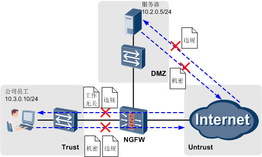

如上图所示, 内容过滤还可以降低员工浏览, 发布, 传播违规信息而给公司带来的法律风险. 具体做法是在内网用户的下载方向及服务器的上传方向过滤掉包含敏感信息等违规内容的文件. 另外内容过滤还能够阻止员工浏览、下载与工作无关的内容，提高工作效率。

### 实现原理
之所以将文件过滤和内容过滤一起来讲，一是这两个特性的应用场景相似且经常配合一起使用；二是因为这两个特性的实现原理有关联之处：他们都需要进行文件类型识别，而且文件过滤后才能进行内容过滤。

下面我们就来一起看下文件过滤和内容过滤的实现原理。 文件过滤和内容过滤的相关模块和总体处理过程如下图所示。

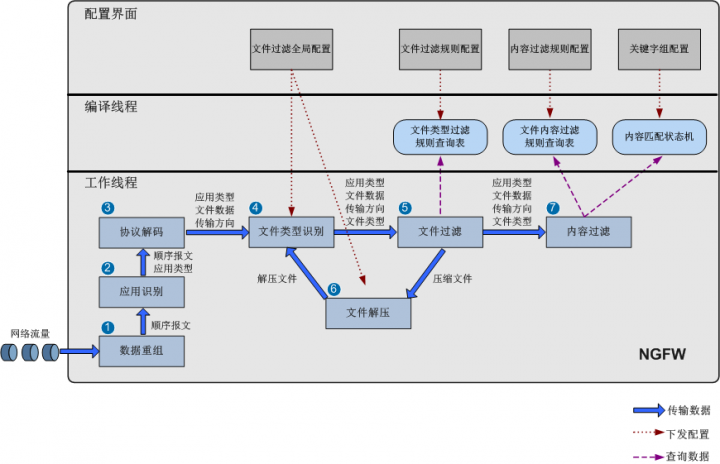

下面来分别介绍各模块的作用和实现原理
1. 数据重组

    数据重组模块负责将网络流量中的IP分片报文重组以及TCP流量组, 确保了报文的顺序以及应用层数据的连续性

2. 应用识别

    应用识别模块能够识别出承载文件的应用类型。文件过滤和内容过滤能够对以下应用承载的文件进行过滤。


    | 分类     | 应用                                                                                                                                                                                                                                                                              |
    | -------- | --------------------------------------------------------------------------------------------------------------------------------------------------------------------------------------------------------------------------------------------------------------------------------- |
    | 常用协议 | HTTP, FTP, SMTP, POP3, NFS, SMB, IMAP, RTMPT, FLASH格式的流媒体                                                                                                                                                                                                                   |
    | 文件共享 | 迅雷、AIMINI、K_JAVA、HOTFILE、126网盘、115客户端、115网盘、3A网盘、360软件管家、360云盘网页版、360云盘、139邮箱硬盘、139网络硬盘、1000EB、163网盘、16密盘、99盘网页版、119G网盘、ALIDISK、6DISK、CTDISK网盘、HOWFILE、HULKSHARE、BAYIMG、CNETDOWNLOAD、APPHIT、2SHARED、BABELGUM |

3. 协议解码

    协议解码负责对编码的协议报文数据进行解码，解析出数据流中的文件数据和文件传输方向（上传或下载）。

4. 文件类型识别

    文件类型识别模块负责根据文件数据识别出文件的真实类型和文件的后缀名（也叫扩展名），并会进行文件类型异常检测。文件类型异常检测流程如下图所示。

    文件类型异常检测流程的具体说明如下：
    
    1. 判断是否格式损坏文件,若'是'则执行'文件损坏时动作', '否'则进入下一步.

        - 允许: 不做任何处理, 允许文件通过
        - 告警: 记录文件异常日志, 允许文件通过
        - 阻断: 记录文件异常日志, 阻断文件通过
      
        需要注意的是对于格式损坏文件，无论动作如何，将不进行文件过滤和内容过滤检测。

    2. 判断是否识别出了文件的真实类型，若“否”则执行下一步；“是”则继续检测文件后缀类型与文件真实类型是否匹配，若“是”则直接输出，“否”则执行“文件扩展名不匹配时动作”。
    
        “文件扩展名不匹配时动作”与“文件损坏时动作”相同，有“允许”、“告警”和“阻断”三种动作。

        需要注意的是如果“文件扩展名不匹配时动作”为“允许”和“告警”，则会继续根据文件真实类型进行文件过滤和内容过滤检测。

    3. 判断是否存在文件后缀名, 若"是"则直接输出,"否"则执行"文件类型无法识别时动作"
    
        “文件类型无法识别时动作”与“文件损坏时动作”相同，有“允许”、“告警”和“阻断”三种动作。

        需要注意的是如果“文件类型无法识别时动作”为“允许”和“告警”，则会继续根据文件后缀名进行文件过滤，但无法进行内容过滤。

    文件类型异常检测流程中的动作都是由管理员在"文件过滤全局配置"界面中定义的.

5. 文件过滤

    文件过滤模块会将之前模块识别出的文件的应用类型、文件类型、传输方向与管理员配置的文件过滤规则查询表进行从上到下的匹配，例如下图所示。

    如果文件的所有参数都能够匹配一条文件过滤规则（例如下图中的标红规则），那么模块将执行此文件过滤规则的动作。如果未匹配到任何一条文件过滤规则，那么文件过滤模块会允许此文件通过。

    文件过滤的动作有两种：阻断和告警。如果动作为“阻断”，则模块会记录日志，并阻断文件的传输。阻断的文件将不会再进行内容过滤检测。如果动作为“告警”，则模块会记录日志，并允许文件通过。文件过滤允许通过的文件，如果有需要，还会继续进行内容过滤检测。   

    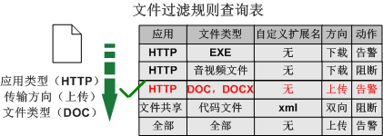

6. 文件解压

    如果文件类型时压缩文件, 那么在进行文件过滤检测后, 文件将会被送到文件解压模块进行解压缩, 解压出原始文件.

    在解压过程中，解压模块还会判断压缩文件是否超出最大解压层数或是否超出最大解压文件大小。如果超出，则解压失败，模块会分别执行“超出最大解压层数时动作”或“超出最大解压文件大小时动作”。这两种动作也是由管理员在“文件过滤全局配置”界面中定义的，也有“允许”、“告警”和“阻断”三种结果。这时无论动作执行结果如何，文件都不会再进行文件过滤和内容过滤检测。

    如果文件能够正常解压，那么解压后的文件将会再被送到文件类型识别模块进行文件类型识别和文件类型异常检测，然后识别出文件类型的解压文件还会再次进行文件过滤和内容过滤检测。

7. 内容过滤

    文件过滤模块允许文件通过后(未匹配规则或匹配规则但动作未"告罄")，如果配置了内容过滤功能，那么内容过滤模块会继续对文件进行检测。

    内容过滤模块是由多个子模块组成的，具体如下图所示。

    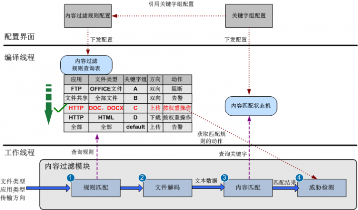

    内容过滤各模块的作用与检测流程具体如下：
    1. 规则匹配: 规则匹配模块会首先将之前模块识别出的文件的应用类型, 传输方向与管理员配置生成的内容过滤规则查询表进行匹配沛如果文件的所有参数都能够匹配其中一条内容过滤规则(如上图中红色字体的规则), 那么内容过滤的其他模块会继续对文件进行检测。如果未匹配到任何一条内容过滤规则，那么内容过滤模块会允许此文件通过。
    2. 文件解码：如果文件的参数能够匹配内容过滤规则，那么文件解码模块就会负责提取出此文件中的文本数据，用于后续进行内容匹配。这种设计是十分高效的，保证了不需要进行内容过滤的文件不用消耗性能和时间进行文件解码。
    3. 内容匹配：内容匹配模块负责将文件解码出的文本数据与内容匹配状态机中的关键字信息进行匹配，用于检测文件的文本数据中是否存在需要过滤的关键字，并记录每个关键字的匹配次数。如果内容匹配模块没有检测出文件中存在关键字，则整个内容过滤模块会允许文件通过。

        关键字是由管理员在“关键字组”界面配置的，是管理员希望检测并过滤的内容。

        配置关键字时有“预定义关键字”和“自定义关键字”两种方式。
        - 预定义关键字是系统默认存在的可以识别的关键字，包括：银行卡号、信用卡号、社会安全号、身份证号、机密关键字（包括“秘密”、“机密”、“绝密”）。
        - 自定义关键字是管理员自定义的需要识别的关键字，有文本和正则表达式两种定义方式。
            - 文本方式是使用文本的方式表示需要识别的关键字，例如管理员想要识别关键字“黄赌毒”，只需要自定义文本方式的关键字“黄赌毒”即可。文本方式配置简单，匹配精确。
            - 正则表达式方式是使用正则表达式的方式表示需要识别的关键字。与文本方式不同的是一个正则表达式可以表示多个关键字。例如正则表达式“abc.de”中的“.”可以匹配任意单个字符，所以“abc.de”可以表示“abcxde”、“abcyde”、“abc8de”等等。正则表达式方式匹配更加灵活和高效，但配置需要遵循正则表达式规则。
    4. 威胁检测：如果内容匹配模块在文件中识别出了关键字，则文件需要继续通过威胁检测模块进行处理。威胁检测模块会从内容过滤规则查询表中获取匹配的内容过滤规则的动作，并根据内容匹配模块的结果对文件进行处理。
    
        内容过滤规则有三种动作:
        - 告警:如果内容匹配模块检测出文件中存在关键字，则记录日志，但允许文件通过。
        - 阻断：如果内容匹配模块检测出文件中存在关键字，则记录日志，并阻断文件传输。
        - 按权重操作：前面提到的关键字组在配置时可以为其中的每个关键字都设置一个权重值。当动作为“按权重操作”时，威胁检测模块会将各个关键字的权重值按出现次数累加求和。然后模块会将权重值的和与内容过滤规则中的“告警阈值”和“阻断阈值”进行比较。
            - 如果权重值的和小于“告警阈值”，则模块会允许此文件通过。
            - 如果权重值的和大于等于“告警阈值”且小于“阻断阈值”，则模块会执行“告警”动作。
            - 如果权重值的和大于等于“阻断阈值”，则模块会执行 “阻断”动作。

          举个例子来说，管理员在配置关键字组时配置了关键字a的权重值为1，关键字b的权重值为2；在配置内容过滤规则时“动作”选择了“按权重操作”，“告警阈值”设置为2，“阻断阈值”设置为8。如果一个文件中在内容匹配模块检测出了三次关键字a和两次关键字b，这时威胁检测模块会计算出权重值的和为7=3×1+2×2。由于权重值的和7大于“告警阈值”2，小于“阻断阈值”8，威胁检测模块会执行“告警”动作。

## 文件过滤与内容过滤特性配置
### 文件过滤配置逻辑


如图所示，文件过滤的主体配置比较简单，就是先配置好文件过滤配置文件，然后在配置安全策略时引用文件过滤的配置文件。文件过滤配置文件的主要配置就是文件过滤规则。与文件过滤配置相关的其他两个模块如下：

- A: 文件在进行文件过滤和内容过滤检测前，需要进行文件异常类型检测。文件过滤全局配置的作用就是定义各种文件异常类型时的处理动作，包括“文件损坏时动作”、“文件扩展名不匹配时动作”和“文件类型无法识别时动作”。另外文件过滤全局配置还定义了压缩文件的最大解压层数和文件大小，以及超出时的动作。
- B: 当传输的文件命中了文件过滤配置文件中的文件过滤规则时，会产生内容日志。

### 文件过滤Web界面展示
下面给出了文件过滤全局配置的Web配置界面（以USG6000 V100R001C30SPC100版本为例），并对界面上的配置项进行简要解释。

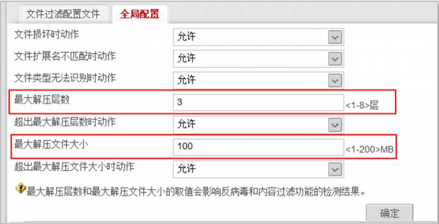

首先需要说的是文件过滤全局配置，不仅对文件过滤产生作用，还会对内容过滤和反病毒功能产生作用。

第二点要说明的就是管理员可以自己配置“最大解压层数”和“最大解压文件大小”，当文件的参数超过取值时，则执行相应的动作。

下面给出了文件过滤配置文件的Web配置界面，并对界面上的配置项进行简要解释。

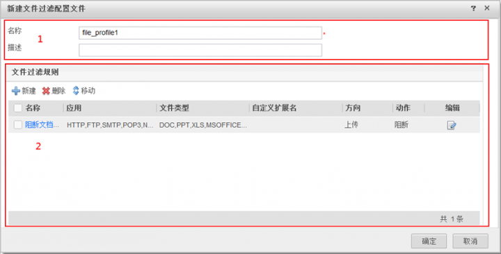

文件过滤配置文件的配置界面分为2个区域。

1. 基本配置区域：在该区域中设置文件过滤配置文件的名称和描述。
2. 文件过滤规则配置区域：在该区域中可以创建多条文件过滤规则，文件过滤规则的匹配顺序是从上到下的。

下面给出了文件过滤规则的Web配置界面，并对界面上的配置项进行简要解释。

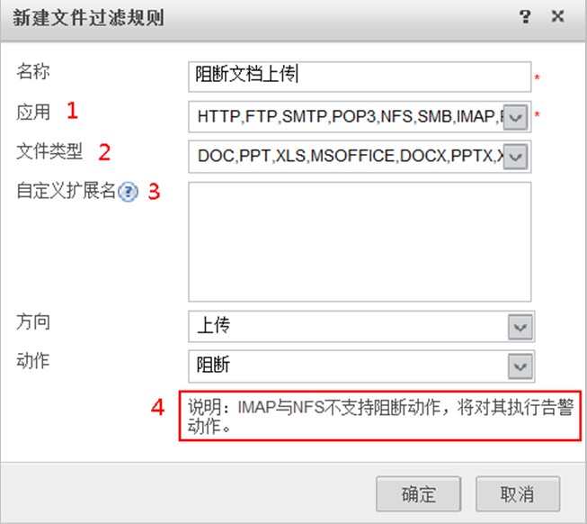

1. 选择想要进行文件过滤的应用。例如只想对通过FTP协议传输的文件的类型进行过滤，则这里选择FTP。文件过滤支持的应用类型如下表所示：

    | 分类     | 应用                                                                                                                                                                                                                                                                              |
    | -------- | --------------------------------------------------------------------------------------------------------------------------------------------------------------------------------------------------------------------------------------------------------------------------------- |
    | 常用协议 | HTTP, FTP, SMTP, POP3,NFS, SMB, IMAP, RTRTMPT, RTMPT, FLASH格式的流媒体                                                                                                                                                                                                           |
    | 文件共享 | 迅雷、AIMINI、K_JAVA、HOTFILE、126网盘、115客户端、115网盘、3A网盘、360软件管家、360云盘网页版、360云盘、139邮箱硬盘、139网络硬盘、1000EB、163网盘、16密盘、99盘网页版、119G网盘、ALIDISK、6DISK、CTDISK网盘、HOWFILE、HULKSHARE、BAYIMG、CNETDOWNLOAD、APPHIT、2SHARED、BABELGUM |

2. 选择想要进行过滤的文件类型。文件类型是设备能够识别的文件真实类型。文件过滤能够对以下文件类型进行过滤：

    | 分类       | 文件类型                                                                                                                                                                                                             |
    | ---------- | -------------------------------------------------------------------------------------------------------------------------------------------------------------------------------------------------------------------- |
    | 可执行文件 | EXE, MSI, RPM, OCX, A, ELF, DLL, PE, SYS                                                                                                                                                                             |
    | 文档文件   | DOC、PPT、XLS、MSOFFICE、DOCX、PPTX、XLSX、PDF、VSD、MPP、ODS、ODT、ODP、EML、UOF                                                                                                                                    |
    | 压缩文件   | RAR, TAR, ZIP, GZIP, CAB, BZ2, Z, 7ZIP, JAR                                                                                                                                                                          |
    | 音视频文件 | MDI、MOV、MPEG、AVI、RMVB、ASF、SWF、MP3、MP4、MDI                                                                                                                                                                   |
    | 图像文件   | PNG、TIF、WMF、BMP、GIF、JPEG                                                                                                                                                                                        |
    | 网页文件   | HTML、CHM、JS                                                                                                                                                                                                        |
    | 代码文件   | C、CPP、JAVA、VBS                                                                                                                                                                                                    |
    | 其余文件   | TORRENT、CRT、PL、SH、APK、BAT、CAT、CMD、DSM、DWG、FON、GBS、ICO、ILK、INF、ISO、LNK、MDB、NSF、OBJ、ODG、PDB、PGP、PIF、PSD、REG、RES、SLN、TDB、WSF、EDIF、ACCDB、VCPROJ、FLV、IZH、RTF、MKV、TTF、PCAP、CAP、ODB |
    | 加密文件   | DOC_ENC、PPT_ENC、XLS_ENC、OPC_ENC、ZIP_ENC、RAR_ENC、JAR_ENC、PDF_ENC                                                                                                                                               |

3. 自定义扩展名是文件类型的补充，当设备无法识别出文件真实类型时，将根据自定义扩展名进行文件过滤。
4. 文件过滤有告警和阻断两种动作。但是对于IMAP和NFS两种应用协议，只支持告警动作。

### 文件过滤配置实例
下面我们进入实战部分，来看几个具体的文件过滤配置实例。实例仅是演示文件过滤的配置方法和效果。
#### 举例1：阻止内网用户上传word类型文件
如下图所示，企业希望阻止内网用户上传word类型的文件到外网，以降低机密信息泄漏的风险。


配置如下文件过滤配置文件， “文件类型”选择“DOC，DOCX”，“方向”选择“上传”，“动作”选择“阻断”。

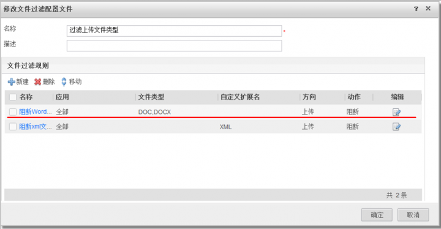

文件过滤配置文件创建或修改后，**必须在Web界面上执行“提交”操作才能生效**。提交过程所需时间较长，请耐心等待，建议完成所有文件过滤配置文件的配置后再统一进行提交。

最后，在安全策略中引用该配置文件。

完成上述配置后，内网用户上传到外网的word文件就会被NGFW阻断。例如，当用户使用FTP协议上传word文件admin.docx到外网时会显示如下信息：

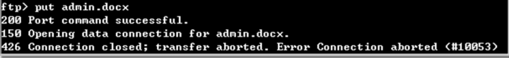

而这时NGFW上也会显示文件被阻断的日志信息：

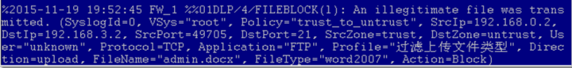

即使用户将word文件压缩，也会被NGFW识别并阻断。例如，用户将admin.docx压缩成admin.zip后上传，依旧会被阻断，如下所示。

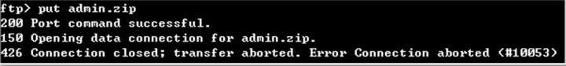

上述配置的命令行脚本如下：
```bash
#
profile type file-block name 过滤上传文件类型 
 rule name 阻断Word文件上传   
  file-type pre-defined name DOC DOCX  
  application all     

  direction upload  
  action block     
#
security-policy 
 rule name trust_to_untrust  
  source-zone trust 
  destination-zone untrust
  profile file-filter 过滤上传文件类型 
  action permit        
```

#### 举例2：使用自定义扩展名阻止内网用户上传xml类型文件
如下图所示, 企业希望阻止内网用户上传xml类型的文件到外网, 以降低机密信息泄漏的风险. 但是NGFW目前不支持识别xml类型文件, 所以管理员需要通过配置文件过滤的自定义扩展名来阻断后缀名为xml的文件

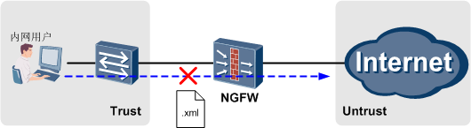

配置如下文件过滤配置文件，选择“自定义扩展名”为“XML”

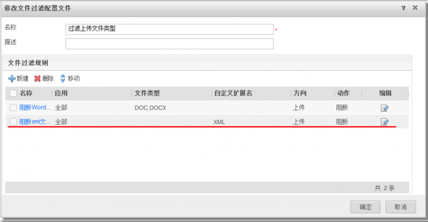

文件过滤配置文件创建或修改后, **必须在Web界面上执行“提交”操作才能生效**。提交过程所需时间较长，请耐心等待，建议完成所有文件过滤配置文件的配置后再统一进行提交。

最后，在安全策略中引用该配置文件。

完成上述配置后，内网用户上传到外网的后缀名为xml的文件就会被NGFW阻断，显示信息如下所示：

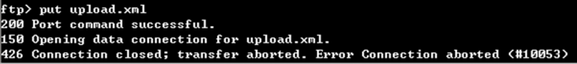

上述配置的命令行脚本如下：
```bash
#
profile type file-block name 过滤上传文件类型
 rule name 阻断xml文件上传 
  file-type user-defined name XML 
  application all  
  direction upload 
  action block  
#
security-policy  
 rule name trust_to_untrust 
  source-zone trust 
  destination-zone untrust 
  profile file-filter 过滤上传文件类型 
  action permit  
```
#### 内容过滤配置逻辑
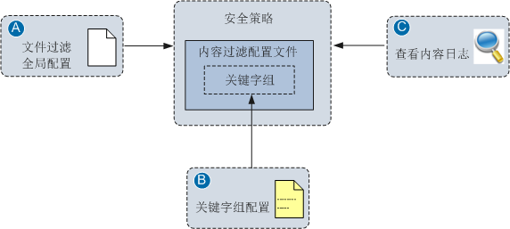

如上图所示，内容过滤的主体配置比较简单，就是先配置好内容过滤配置文件，然后在配置安全策略时引用内容过滤的配置文件。内容过滤配置文件的主要配置就是内容过滤规则，配置内容过滤规则时要引用关键字组。

与内容过滤配置相关的其他三个模块如下：
- A: 文件过滤全局配置作用已经在之前的文件过滤配置逻辑中讲解，在此不再赘述。
- B：配置关键字组的作用是定义需要过滤的关键字信息。内容过滤配置规则引用哪个关键字组，就会识别并过滤关键字组中的关键字。关键字组中存在系统预置的预定义关键字和管理员可以自定义的自定义关键字。
- C：当传输的文件命中了内容过滤配置文件中的内容过滤规则时，会产生内容日志。

#### 内容过滤Web界面展示
下面给出了内容过滤的关键字组的Web配置界面（以USG6000 V100R001C30SPC100版本为例），并对界面上的配置项进行简要解释。

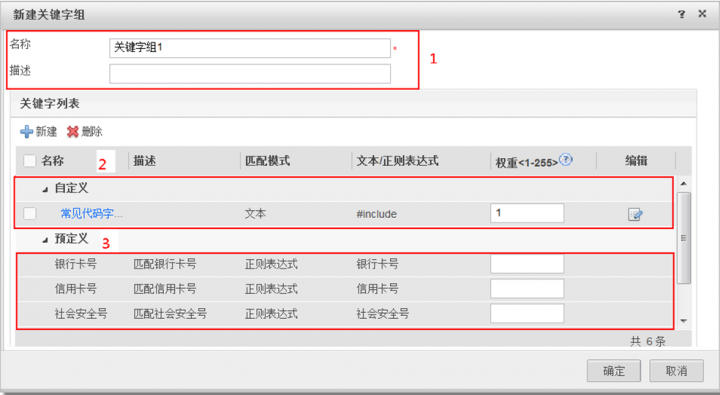

关键字组的配置界面分为3个区域。

1. 基本配置区域：在该区域中设置关键字组的名称和描述。
2. 自定义关键字列表：管理员自己定义的需要过滤的关键字信息。单击“新建”可以新建自定义关键字，有文本和正则表达式两种方式。
3. 预定义关键字列表：系统预置的关键字信息，必须输入“权重”值后才能生效。

下面给出了内容过滤配置文件的Web配置界面，并对界面上的配置项进行简要解释。

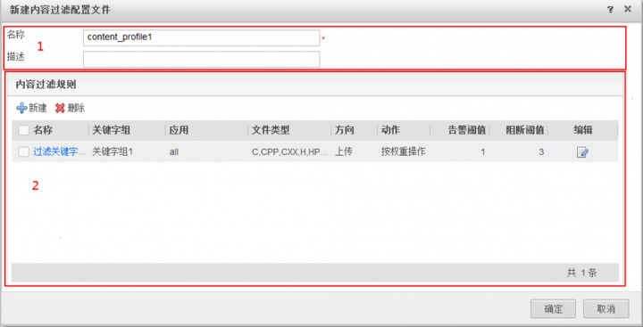

内容过滤配置文件的配置界面分为2个区域。

1. 基本配置区域：在该区域中设置内容过滤配置文件的名称和描述。

2. 内容过滤规则配置区域：在该区域中可以创建多条内容过滤规则，内容过滤规则的匹配顺序是从上到下的。

下面给出了内容过滤配置规则的Web配置界面，并对界面上的配置项进行简要解释。


1. 通过选择关键字组决定需要对哪些内容即关键字进行过滤。这里需要选择的是之前配置的关键字组。

2.  内容过滤支持的应用类型与文件过滤相同。

3.  内容过滤支持的文件类型比文件过滤略少，具体如下：


| 分类           | 文件类型                  |
| -------------- | ------------------------- |
| Office2003文件 | DOC、PPT、XLS             |
| Office2007文件 | DOCX、PPTX、XLSX          |
| 网页文件       | HTML                      |
| 代码文件       | C、CPP、CXX、H、HPP、JAVA |
| 文本文件       | TXT、TEXT/HTML            |

这里需要注意的是文件类型“TEXT/HTML”表示的是过滤应用协议本身的内容。例如，如果应用类型选择“FTP”，表示的是过滤FTP协议传输的文件名称；如果应用类型选择“HTTP”，表示的是网页显示的内容或用户在网页上发布的内容（发帖、微博等）；如果应用类型选择“SMTP”和“POP3”，表示的是过滤邮件的标题、正文和附件名称等内容。

4. 内容过滤的动作有三种，需要特别注意的是“按权重操作”。关键字组中每个关键字都存在一个权重值，当设备检测的文件中出现关键字时，设备会将这些关键字的权重值按出现次数累加。

    - 如果权重值的和小于“告警阈值”，则设备会允许此文件的传输。
    - 如果权重值的和大于等于“告警阈值”且小于“阻断阈值”，则设备会执行动作“告警”。
    - 如果权重值的和大于等于“阻断阈值”，则设备会执行动作“阻断”。

### 内容过滤配置实例
下面我们进入实战部分，来看几个具体的内容过滤配置实例。实例仅是演示内容过滤的配置方法和效果。
#### 举例1：阻止内网用户上传包含机密信息的Word文件
如下图所示，企业希望阻止内网用户上传包含“设计文档”内容的Word文件到外网，以降低机密信息泄漏的风险。

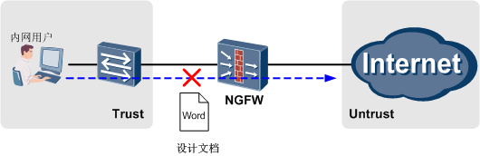

首先创建一个“关键字组1”，在其中创建自定义关键字“设计文档”，如下图所示。

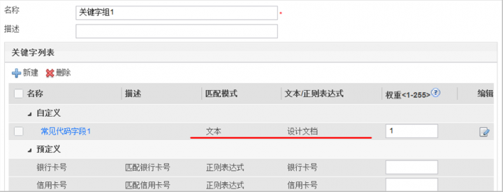

然后，配置如下内容过滤配置文件，“关键字组”选择之前配置的“关键字组1”，“文件类型”选择“DOC，DOCX”，“方向”选择“上传”，“动作”选择“阻断”。

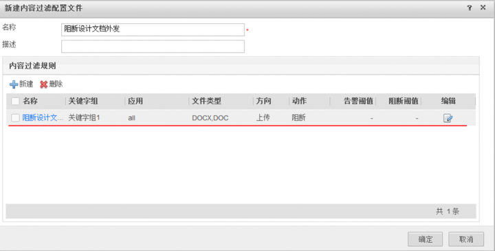

内容过滤配置文件创建或修改后，**必须在Web界面上执行“提交”操作才能生效**。提交过程所需时间较长，请耐心等待，建议完成所有内容过滤配置文件的配置后再统一进行提交。

最后，在安全策略中引用该配置文件。

完成上述配置后，内网用户上传到外网的包含“设计文档”内容的Word文件就会被NGFW阻断。例如，当用户使用FTP上传包含“设计文档”内容的Word文件test.docx到外网时会显示如下信息：

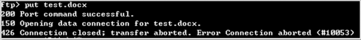

而这时NGFW上也会显示文件被阻断的日志信息：

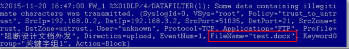

这时如果上传一个名为“设计文档”，但内容不包含“设计文档”的Word文件会怎么样呢？

答案是文件不会被阻断，如下图所示。

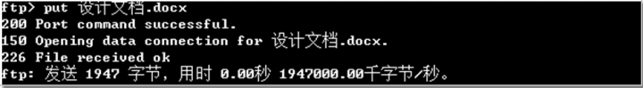

那么我们该如何阻断一个名为“设计文档”的Word文件呢？我们需要选择文件类型为“TEXT/HTML”，对应用协议本身的内容进行过滤，这样我们就能对各种应用协议传送的文件名称进行过滤了。

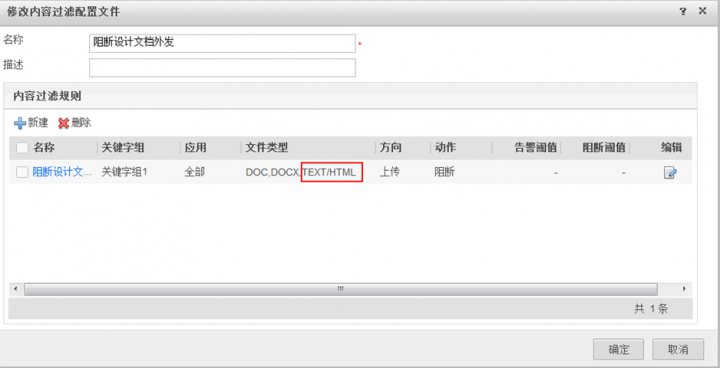

这时如果我们再上传名为“设计文档”的文件时，文件就会被阻断，并显示如下信息：

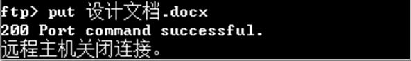

而这时NGFW上也会显示文件被阻断的日志信息：


上述配置的命令行脚本如下：
```bash
#
keyword-group name 关键字组1 
 user-defined-keyword name 常见代码字段1 
  expression match-mode text 设计文档             
  weight 1   
#
profile type data-filter name 阻断设计文档外发 
 rule name 阻断设计文档外发规则1
  keyword-group name 关键字组1  
  file-type name DOC DOCX TEXT/HTML  
  application all on upload 
  action block 
#
security-policy
 rule name trust_to_untrust  
  source-zone trust 
  destination-zone untrust 
  profile data-filter 阻断设计文档外发 
  action permit        
```
#### 举例2: 阻止内容用户在论坛发帖时泄漏机密信息
如下图所示, 企业希望阻止内网用户在外部论坛上发布包含"产品报价"内容的帖子, 以降低机密信息泄漏的风险


这里我们先在192.168.3.2这台服务器上搭建一个论坛服务器，然后在192.168.0.2这台设备上发帖。如下图所示，一般情况下，我们可以发布包含“产品报价”内容的帖子。


为了阻断发布包含“产品报价”内容的帖子，我们需要首先创建“关键字组2”，并在其中创建自定义关键字“产品报价”。

然后我们需要配置如下内容过滤配置文件，“关键字组”选择“关键字组2”，“应用”选择“HTTP”，“文件类型”选择“TEXT/HTML”，方向选择“上传”，“动作”选择“阻断”。


内容过滤配置文件创建或修改后，**必须在Web界面上执行“提交”操作才能生效**。提交过程所需时间较长，请耐心等待，建议完成所有内容过滤配置文件的配置后再统一进行提交。

最后，在安全策略中引用该配置文件。

完成上述配置后，内网用户向服务器发布包含“产品报价”内容的帖子就会被阻断，如下所示：


而这时NGFW上也会显示文件被阻断的日志信息：


上述配置的命令行脚本如下：
```bash
#
keyword-group name 关键字组2 
 user-defined-keyword name 产品报价
  expression match-mode text产品报价
  weight 1 
#
profile type data-filter name 阻断泄漏产品报价 
 rule name 阻断论坛发帖泄漏产品报价 
  keyword-group name 关键字组2  
  file-type name TEXT/HTML 
  application type HTTP 
  direction upload 
  action block
#
security-policy 
 rule name trust_to_untrust              
  source-zone trust 
  destination-zone untrust 
  profile data-filter 阻断泄漏产品报价 
  action permit        
```
通过以上两个内容过滤的实例，我们可以看出“TEXT/HTML”这个文件类型是我们在配置内容过滤经常用到的。最后，强叔又总结了下“TEXT/HTML”的热门用法，如下表所示。

| 过滤需求                       | 应用                         | 文件类型  | 方向 |
| ------------------------------ | ---------------------------- | --------- | ---- |
| 发布微博内容                   | HTTP                         | TEXT/HTML | 上传 |
| 发帖内容                       | HTTP                         | TEXT/HTML | 上传 |
| 网页注册提交内容               | HTTP                         | TEXT/HTML | 上传 |
| 搜索输入内容                   | HTTP                         | TEXT/HTML | 上传 |
| 浏览网页内容                   | HTTP                         | TEXT/HTML | 下载 |
| 网页上传文件的名称             | HTTP                         | TEXT/HTML | 上传 |
| 网页下载的名称                 | HTTP                         | TEXT/HTML | 下载 |
| 发送邮件的标题、正文和附件名称 | SMTP, HTTP(网页邮件)         | TEXT/HTML | 上传 |
| 接收邮件的标题, 正文和邮件名称 | POP3、IMAP、HTTP（网页邮件） | TEXT/HTML | 下载 |

## 应用（HTTP和FTP）行为控制篇
### 1 解读应用行为控制
#### 1.1 第一式 HTTP协议的行为控制
当用户使用HTTP协议日常上网的时候，可能触发的行为包括：
- GET操作
    - 其实就是浏览网页, 向Web服务器请求一个页面, 从打开浏览器输入想要访问的网址开始, 就意味着开始浏览器网页了
  - POST操作
    - 一般用于向服务器发送信息, 例如论坛发帖, 表单提交, 用户名/密码登录
  - 代理上网
    - 使用代理服务器访问特定网站。此时要求NGFW必须部署在用户和代理服务器之间，也就是说用户的请求要在抵达代理服务器之前被NGFW拿到。
  - 文件上传/下载
    - 此处以及下文出现的上传和下载，都是相对于终端上网用户而言。

NGFW如果检测到客户端有上述行为之一，便可以执行允许或禁止操作，实现细粒度的HTTP行为管控。此外，如果允许了某类行为，还可以针对数据传输的大小配置不同的管控动作，包括：
  -  POST操作的内容大小, 可以分别配置告警和阻断阈值
  - 文件上传/下载大小，可以分别配置告警和阻断阈值。NGFW只能对一条会话传输的文件进行大小控制，所以不适用于断点续传的场景，这是因为断点续传的关键技术是把文件切割成多份采用多条流传输。

#### 1.2 第二式 FTP协议的行为控制
FTP协议重点是对文件的操作，常见的用户行为包括：
- 文件上传
- 文件下载
- 文件删除

与HTTP协议类似, 当NGFW感知到客户端有上述行为之一, 便可以执行允许或禁止操作, 实现细粒度的FTP行为管控. 此外, 如果允许某类行为, 还可以征队文件传输的大小配置不同的管控动作,包括
- 文件上传大小，可以分别配置告警和阻断阈值。（同样不适用断点续传场景）
- 文件下载大小，可以分别配置告警和阻断阈值。（同样不适用断点续传场景）

可见，FTP和HTTP单纯从行为控制上看似没有太大的差别，无外乎都是对常见的行为采取允许或禁止操作，或者对传输的数据或文件大小进行告警或阻断。但事实上，招式看似简单，实则是NGFW十年磨一剑练就的看家功夫。光说不练假把式，连说带练才是全把式，接下来强叔就带着大家边验证，边揭开HTTP和FTP行为控制的真相。

### 2 配置与验证


> Server上开启了FTP和HTTP服务，FTP：123/123  Web：admin/admin
> 
> FTP客户端使用FileZilla

#### 2.1 FTP协议-Part1(上传, 下载, 删除)
##### 2.1.1 文件上传(命令字STOR)
配置应用行为控制前，使用FTP客户端可以正常上传文件，显示如下：


按如下参数配置应用行为控制：


配置应用行为控制后，使用FTP客户端无法正常上传文件，显示如下：


NGFW上报相关日志，详细如下：

>Mar 18 2015 05:55:00+08:00 wzh_M4 %%01APPCTL/4/BEHAVIORCTL(l)[62]:The application behavior control policy is matched. (SyslogId=3875868672, VSys="public", Policy="bc_ftp", SrcIp=45.2.1.99, DstIp=45.2.2.99, SrcPort=8840, DstPort=21, SrcZone=trust, DstZone=trust, User="unknown", Protocol=TCP, Application="FTP", Profile="ftp_upload", Direction=upload, Behavior="FTP File Upload", Action=Block)


##### 2.1.2 文件下载（命令字RETR）
配置应用行为控制前，使用FTP客户端可以正常下载文件，显示如下：


按如下参数配置应用行为控制：


配置应用行为控制后，使用FTP客户端无法正常下载文件，显示如下：


NGFW上报相关日志，详细如下：
>Mar 18 2015 06:04:23+08:00 wzh_M4 %%01APPCTL/4/BEHAVIORCTL(l)[63]:The application behavior control policy is matched. (SyslogId=3875868672, VSys="public", Policy="bc_ftp", SrcIp=45.2.1.99, DstIp=45.2.2.99, SrcPort=8855, DstPort=21, SrcZone=trust, DstZone=trust, User="unknown", Protocol=TCP, Application="FTP", Profile="ftp_download", Direction=download,Behavior="FTP File Download", Action=Block) 


#### 2.1.3 文件删除（命令字DELE）
配置应用行为控制前，使用FTP客户端可以正常删除文件，显示如下：


按如下参数配置应用行为控制：


NGFW上报相关日志，详细如下：

>Mar 18 2015 06:12:54+08:00 wzh_M4 %%01APPCTL/4/BEHAVIORCTL(l)[64]:The application behavior control policy is matched. (SyslogId=3875868672, VSys="public", Policy="bc_ftp", SrcIp=45.2.1.99, DstIp=45.2.2.99, SrcPort=8863, DstPort=21, SrcZone=trust, DstZone=trust, User="unknown", Protocol=TCP, Application="FTP", Profile="ftp_delete", Direction=download,Behavior="FTP File Deletion", Action=Block)


小结：从上传、下载和删除这几种实际操作来看，的确实现了阻断的效果，但有个奇怪的地方，似乎FTP客户端看到的结果是一样的，那NGFW究竟是如何对上述行为进行阻断的呢？

在FTP客户端所在的PC上使用抓包工具，以删除操作为例，得到如下结果：


在第一行中，是客户端（45.2.1.99）发出的FTP命令请求，带有命令字DELE 2delete；第二行是服务器（45.2.2.99）发出的reset报文。

>Reset报文，意味着TCP连接异常终止，是相对于正常释放TCP连接过程而言。在正常情况下，TCP连接是通过3次握手完成，而正常释放是通过4次握手完成，但有些情况，TCP连接无法按照正常的4次握手来释放连接，所以需要一种可以强制释放TCP连接的机制，这种机制就是TCP的reset报文。reset报文的特征是TCP报文头的标志字段中的reset位置1。

从逻辑上讲，NGFW如果检测客户端有delete行为，那么是也应该是由NGFW作出阻断动作，而FTP服务器没理由给客户端发reset报文，所以这里源IP为服务器的reset报文是不是有什么猫腻？带着这个疑问我们再去研究这个reset位置1的报文。如下图所示，找出报文的源MAC地址为ac:4e:91:5c:21:c1，而NGFW GE1/0/0接口的地址，恰恰也是这个。于此同时，在服务器上也进行同样的抓包操作，也收到了类似的reset报文（略）。而客户端和服务器，自始至终都是只收到了对端发送的reset报文，而从来没有发出过reset报文。

由于客户端和服务器中间再无其他网络设备，所以这里可以得出一个结论：这个reset报文的真实发出人，就是NGFW，只不过是披着对端的马甲（IP地址）而已。


最终真相浮出水面： NGFW检测到相应的FTP行为后，分别向客户端和服务器发送reset报文，不过这个时候NGFW要伪装一下身份，假借圣旨告诉通信双方「“我们”之前建立的TCP连接可以终止了，再会」。通信双方各自收到reset报文后，就终止了连接，就此，NGFW实现了阻断的目的。

#### 2.2 FTP协议-Part2（告警、阻断阈值）
以上我们把FTP协议的上传、下载和删除行为控制做了分析和验证，这只是一部分，上文已经说过，NGFW还可以设置告警和阻断的阈值，将FTP的行为控制再一次做了细分。
- 传输的文件小于告警阈值时，文件正常通过。
- 传输的文件大于等于告警阈值、小于阻断阈值时，文件正常通过，产生告警日志。
- 传输的文件大于等于阻断阈值时，文件被阻断，产生阻断日志。

这里再一次提到了阻断，都是阻断动作，难道有什么不同吗？答案肯定是不同的，不过在讲解之前，我们再温习一下FTP的连接过程。


无论是主动模式或者被动模式，都是通过控制通道传命令，而再建一条TCP连接传数据。所以，在检测到上传、下载或删除这些行为时，NGFW发送的reset报文，是针对整个连接的；而对于检测到超出阈值的行为，NGFW发送的reset报文，是针对当前这个数据连接的，整个TCP连接还在。以上我们可以用PC自带的FTP工具验证一下，只以上传为例。

对于前者，通过下图可以看到，整个连接已经中断，执行put命令提示中断，需要重新登录：


对于后者，通过下图可以看到，只是中断了数据连接，但仍然可以执行put命令：


最终结果：前者需要重新登录，后者不需要重新登录。看似相同的一个阻断动作，内部运用的方法却有着细微差异，单从这里就能看出NGFW的内功有多深厚了吧？

#### 2.3 HTTP协议
##### 以GTE操作为例
配置应用行为控制前，网页可以正常访问：


抓包结果显示Server收到终端用户的GET请求后，回复状态码200 OK，表示可以正常访问。

按如下参数配置应用行为控制：


配置应用行为控制后，网页无法访问：


NGFW上报相关日志，详细如下：

>Apr  7 2015 11:04:32+08:00 USG6600 %%01APPCTL/4/BEHAVIORCTL(l)[38]:The application behavior control policy is matched. (SyslogId=3875868672, VSys="public", Policy="http", SrcIp=45.2.1.99, DstIp=45.2.2.99, SrcPort=6964, DstPort=80, SrcZone=trust, DstZone=untrust, User="unknown", Protocol=TCP, Application="HTTP", Profile="http_get", Direction=download,Behavior="HTTP Web Browsing", Action=Block)


通过抓包分析（下图），我们看到了和FTP行为阻断类似的reset报文，即NGFW假借Server之名，向客户端发送TCP连接终止的信号，验证过程与FTP基本一致，不再赘述。


### 3 实战案例
需求背景：某企业理员希望限制Yahoo、Gmail等主流邮箱的附件上传操作，但是NGFW的邮件过滤功能不支持Web邮件。

解决思路：
1. 由于主流Web邮箱使用HTTPS协议，需要将其解密，还原为HTTP。可以使用前面URL过滤帖子中介绍的SSL解密功能。
2. 采用应用行为控制，限制HTTP文件上传。
3. 配置安全策略，只对应用为Web邮箱和电子邮箱的流量进行控制。

配置步骤:
1. 配置SSL解密功能

    

2. 配置应用行为控制配置文件，禁止HTTP协议的上传功能。

    

3. 配置安全策略，应用为Web邮箱和电子邮箱。

    

## 应用识别特性原理和配置
### 现状和问题
经过十多年的发展，互联网已经渗透到生活的方方面面，互联网上承载的应用也在发生着深刻的变化。从最初的网页浏览、Email、FTP下载，到目前的P2P、游戏、视频以及移动互联，丰富多彩的应用成为互联网的主流。

面对层出不穷的新兴应用，如何对其进行管控是管理员面临的最大问题，而管控的前提是必须先识别出各类应用的流量。传统的协议识别技术对此无能为力，这是因为传统的协议识别技术仅检查报文的五元组信息，根据TCP/UDP报文的端口号来识别应用。端口识别技术虽然检测效率很高，但适用的范围却越来越小。

一方面，当前端口使用技术日益复杂。最常见的是应用使用非知名端口，例如使用8080端口而不是默认的80端口进行HTTP通信；应用还会使用动态端口，例如多数P2P、VoIP应用会使用随机端口通信；多种应用会使用同一个端口，例如使用80端口来提供在线视频、IM、P2P等多种应用。因此，仅通过端口识别技术已经不能真正判断流量中的应用类型了。

另外，协议和应用之间的关系也有点纠缠不清。一个协议可以用于多个应用软件，一个应用软件也可能使用多个协议，增大了应用识别的难度。例如，P2P属于标准协议，存在于多种下载软件中，如比特精灵、迅雷、电驴、FlashGet等。这就要求协议识别的结果不能直接用于应用控制，否则极有可能误伤良民。


例如，迅雷应用软件使用HTTP、P2P、ED2K、FTP、迅雷协议等多个协议进行文件传输。这就要求应用识别一定要包括所有关联协议的流量，否则难免有漏网之鱼。


基于应用识别的现状和面临的问题，华为NGFW提供了业务感知（Service Awareness）技术，能够解决当今复杂的应用识别问题，精确识别各类应用。下面我们就来了解业务感知技术的实现原理。
#### 业务感知技术
面对网络中扑朔迷离的流量, 业务感知技术为什么而可以火眼金睛地是被出各类应用呢?其实说起来也简单, 既然传统地协议识别址只检测报文五元组信息不能识别应用, 那业务感知技术就费点力, 继续检测报文地应用层数据

不同地应用软件采用的协议自有其特征, 这些特征可能是特定的命令字活着特定的Bit序列。这些特征就构成了一个应用软件的“指纹”，只要我们提取到了各种应用软件的指纹，建立一个指纹库，就可以用来跟流量进行比对。 


这就是业务感知的第一板斧，**特征识别技术**，通过识别数据报文中的特征信息来确定业务所承载的应用。例如，HTTP协议中规定了GET、POST等请求方法，HTTP报文中也需要明确HTTP协议的版本，报文中的这些字段，就可以作为应用特征的一部分来利用。下图显示了HTTP报文中的POST命令和HTTP版本号。


有些应用协议通过多条通道来进行通信，如FTP、SIP、H.323等，称为多通道协议。多通道协议通过控制通道来协商通信参数，通过动态协商的数据通道来传输具体的数据。


使用特征识别技术，我们可以识别出控制通道，但是对数据通道就无能为力了，因为数据通道是动态协商出来的，而且没有任何的可资利用的特征。但是，既然数据通道是协商出来的，那么控制通道中自然记录了这个协商的过程，也必然包含数据通道的详细信息。那么，通过解析控制通道中的协商报文，提取出数据通道的IP地址和端口号，就可以预知通信双方将要在哪个数据通道上传输数据了。这就是业务感知的第二板斧，**关联识别技术**

下面以最常见的FTP协议来详细说明关联识别技术，其他应用比FTP复杂，但思路和方法是一样的。FTP客户端和FTP服务端首先通过三次握手建立控制通道，这个控制通道是可以通过特征识别技术检测出来的（如USER、PASS命令字）。在传输文件的时候，两端协商建立一个临时的数据通道，数据通道就没有特征可以识别了。

1. FTP客户端使用被动模式下载文件，首先要使用PASV命令字通知服务端。目的端口（21）和PASV命令字可以用作特征识别。

    

2. 服务端进入被动模式，并告诉客户端连接的数据通道端口号。如下图中，服务端响应报文的参数中，(10,177,31,123,211,195)即表示服务端的IP地址和端口号，其中，前4位是IP地址，后两位经计算得出端口号54211（211*256+195=54211）。

    

3. 客户端通过控制通道向服务端请求一个文件，服务端开放端口。接下来，客户端和服务端经过三次握手，建立一个新的TCP连接。如下图，红框内是控制通道内的请求和响应，蓝框内是新建数据通道的三次握手。这之后的499号报文就是FTP数据传输了，服务端使用的正是前面开放的54211端口。通过五元组，就识别出了FTP控制通道。

    

互联网上还有一些复杂的应用，很难选择特征关键字来作为识别的特征；更有很多加密应用，因为数据加密使得特征模糊化而无法识别。没有特征，特征识别和关联识别都失效了，怎么办？别急，业务感知还有第三板斧，**行为识别技术**。

行为识别技术比前两种更复杂，针对不同的应用，可利用的行为特征也不尽相同。要准确地识别一个应用，必须抓取海量的流量样本，分析提取出独特的行为特征，这才是行为识别最困难的地方。通常，上下行流量比例、报文发送频率、报文长度变化规律等等，都是可资利用的行为特征指标。行为识别技术通过综合考察和选择多种行为特征指标来实现精准的应用识别。

下面我们把应用识别技术与刑侦破案来做一下类比，如果说特征识别技术对应于犯罪嫌疑人的血型、指纹、DNA等生理特征的话，关联识别技术就对应于审讯和调查，而行为识别对应犯罪嫌疑人的作案手法，通常具有习惯性的行为特征，包括侵害对象、犯罪工具、作案地点、作案时间等等，如下表所示。

| 识别技术 | 犯罪嫌疑人                             | 应用                                               |
| -------- | -------------------------------------- | -------------------------------------------------- |
| 特征识别 | 指纹, 血型, DNA                        | 命令字, 特殊字符串                                 |
| 关联识别 | 落网者--(审讯和调查)-->在逃者          | 控制通道--(协商报文)-->数据通道                    |
| 行为识别 | 侵害对象, 犯罪工具, 作案地点, 作案世家 | 上下行流量比例, 报文发送频率, 报文长度变化规律.... |

上面简单介绍了业务感知的三种应用识别技术, 这三类识别技术分别适用于不同类型的协议, 综合运用多种技术才能达到较好的识别效果。

实际上，前几篇我们介绍过的反病毒、入侵防御、文件过滤和内容过滤等特性，其基础都是应用识别功能，只有先识别出来了具体的协议，NGFW才能根据识别结果进行下一步的处理。但是在前面我们没有详细介绍应用识别，这是因为NGFW上已经内置了应用识别特征库（预定义应用），识别过程由NGFW直接搞定。下面我们就来了解预定义应用的内容。

### 预定义应用
华为安全能力中心从海量的互联网应用中，分析并提取了6000+应用的特征，形成了应用识别特征库，并预定义应用的形式加载到NGFW上。这里要重点强调的是，互联网上新的应用层出不穷，已有应用的特征也会发生变化，所以必须**定期更新应用识别特征库**，才能够保证更好的识别效果。

NGFW上的预定义应用按照属性划分为5个大类和45个子类，如下图所示。


下面给出了预定义应用Skype_VoIP的示例：


NGFW使用下表所示的属性来描述一个预定义应用。

| 字段         | 含义                                                                                                                                       |
| ------------ | ------------------------------------------------------------------------------------------------------------------------------------------ |
| 名称         | 该预定义应用的名称                                                                                                                         |
| 描述         | 该预定义应用的简要介绍                                                                                                                     |
| 类别         | 该预定应用所属的大类                                                                                                                       |
| 子类别       | 该预定义应用所属的子类                                                                                                                     |
| 数据传输方式 | 该预定义应用的传输方式, 包括: <br/>服务器-客户端 <br/>浏览器<br/>网络</br>端到端<br/>未指定的<br/>                                         |
| 风险级别     | 风险ji'bie                                                                                    级别数值越大, 表示使用该应用带来的风险越高。 |

介绍完预定义应用，我们再来看一下端口映射。在传统防火墙上，端口映射主要用于识别非知名端口上提供的知名服务。打个比方，相当于是端口映射告诉防火墙，我这个端口上跑的是某某协议，它只不过是换了一个马甲，请防火墙明察。

在NGFW上，端口映射主要还是聚焦于非知名端口，但是作用范围却扩大了。以前端口映射只支持FTP、SMTP、HTTP、RTSP、H.323、SQLNET、MMS、PPTP、SIP、MGCP等几个协议，现在端口映射和业务感知两者一联手，端口映射可以支持所有的应用了。端口映射能够帮助业务感知快速识别应用，而不必等待数据包交互后才识别出应用来，还能节省NGFW的性能。

NGFW的应用识别特征库中包含了丰富的应用类型，能够涵盖互联网的绝大部分应用，但是没有任何一件事可以做到那么尽善尽美，肯定会有一些特殊的应用无法识别。为此，NGFW还提供了自定义应用，弥补预定义应用无法覆盖特殊应用的问题。

### 自定义应用
自定义应用需要管理员手工定义应用的特征，这就要求管理员要对应用的特征非常了解。而了解应用特征的主要方法是抓包，通过抓包分析，提取出应用的关键特征。一旦自定义应用的特征定义得过于宽泛，很可能会命中其他应用的类似流量；反之，如果特征定义得过于严格，可能有些流量就匹配不上了，就会产生误报与漏报。

应用识别的误报和漏报将会直接影响NGFW对该流量的处理，可能会得到与管理员预期不一致的结果。因此，一般情况下**不建议配置自定义应用**。实际网络环境中如果真的需要使用自定义应用，还需在充分了解应用特征的前提下，谨慎配置反复调测，以免影响正常业务。

自定义应用的配置过程比较复杂，需要配置的内容很多，包含的配置项如下图所示。


自定义应用中可以配置多条规则，各规则之间是“或（OR）”的关系，只要报文命中其中一条规则便属于该应用。下表给出了自定义应用中几个关键配置项的介绍。

| 配置项          | 说明                                                                                                                                                     |
| --------------- | -------------------------------------------------------------------------------------------------------------------------------------------------------- |
| 目的地址        | 对去往特定目的地址的流量进行应用识别                                                                                                                     |
| 协议            | 对特定协议的流量进行应用识别, 包括: <br/> TCP协议<br/>UDP协议<br/>任意协议                                                                               |
| 目的端口        | 对特定目的端口的流量进行协议识别                                                                                                                         |
| 检测方向        | 对特定方向的流量进行应用识别, 包括:  <br/>请求数据：检测去往服务器的数据<br/>响应数据：检测服务器响应的数据<br/>任意：既检测请求数据又检测响应数据       |
| 范围            | 对特定范围的流量进行应用识别, 包括: <br/>流：当关键字跨包出现时，请选择按流的范围进行检测<br/>包：当关键字出现在单个数据包内时，请选择按包的范围进行检测 |
| 匹配模式        | 当标识应用特征的关键字属于固定字段时, 可以选择"文本"; 当关键字不固定时, 请选择"正则表达式"                                                               |
| 文本/正则表达式 | 输入文本或正则表达式, 关于正则表达式的详细介绍请参考NGFW的产品文档，这里不再赘述。                                                                       |

无论使用预定义应用还是自定义应用，应用识别不是目的。识别出应用，针对不同的应用去设置不同的控制策略，以实现差异化的管控需求，这才是最终目的。目前，NGFW支持三种应用控制手段，如下表所示。

| 应用控制手段       | 典型应用场景                                           | 配置方法                     |
| ------------------ | ------------------------------------------------------ | ---------------------------- |
| 基于应用的访问控制 | 放行办公类应用, 阻断影响办公效率的视频类应用           | 以应用作为安全策略的匹配条件 |
| 基于应用的带宽管理 | 限制视频类应用的带宽为100M, 保证办公应用的带宽为200M   | 以应用作为带宽策略的匹配条件 |
| 基于应用的策略路由 | 指定用户通过ISP1访问视频类应用, 通过ISP2访问办公类应用 | 以应用作为策略路由的匹配条件 |

NGFW的业务感知技术特性原理部分就介绍到这里, 下面我们来看两个具体的配置实例

### 配置实例
在NGFW上，应用是作为安全策略、带宽策略和策略路由的匹配条件来使用的。使用预定义应用时，有一点需要特别注意：某些应用可以细分为多个子应用，若想阻断该应用，则需要阻断所有的子应用。

例如，Skype应用分为Skype_IM和Skype_VoIP，如果要阻断Skype应用，则需要同时阻断Skype_IM和Skype_VoIP。我们可以在应用的Web界面输入框中输入应用名称，点击“搜索”，即可查询到相关的应用，通过查看应用的描述信息可以得知该应用的关联应用。
#### 举例1：通过预定义应用+端口映射识别应用
如下图所示，NGFW部署在PC和FTP服务器之间，FTP使用非知名端口2121提供服务。管理员要求在NGFW上配置安全策略，阻断PC访问FTP服务器的报文。


首先，我们使用预定义应用来满足此需求。配置如下安全策略，阻断PC访问FTP服务器的报文：


在FTP服务器上获取的报文信息如下：


分析上述报文信息可知，由于PC访问的是非知名端口2121，一开始NGFW没有识别出来这就是FTP协议，所以PC和FTP服务器之间进行了TCP三次握手，建立了FTP控制通道。当PC使用USER命令向FTP服务器发送用户名时，NGFW上的业务感知功能通过特征识别技术检测到了USER命令字，识别出该流量就是FTP协议。

NGFW识别出FTP协议后，依照安全策略的配置，要进行阻断。此时FTP控制通道已经建立，如果直接生硬地阻断后续报文而不通知PC和FTP服务器，有辱TCP可靠连接的威名。在这里，NGFW采用了我们在“HTTP和FTP行为控制”一篇中介绍过的方式，分别向PC和FTP服务器发送RESET报文。即NGFW伪装身份，告诉通信双方之前建立的TCP连接可以终止了，以此实现阻断的目的。

然后，我们为FTP配置端口映射，再通过抓包分析一下报文交互过程。先在Web界面上为FTP配置端口映射，端口为2121，目的地址为192.168.1.2。


配置完成后，我们先将安全策略policy1上的命中次数统计信息清空，然后在PC上访问FTP服务器，同时我们分别在PC上和FTP服务器上抓包，在PC上获取的报文信息如下：


而在FTP服务器没有获取到任何报文信息。

由于我们为FTP配置了端口映射，NGFW直接将访问2121端口的流量识别为FTP应用，所以NGFW立即阻断了PC发送的建立TCP三次握手的SYN报文。PC尝试发送了三次SYN报文试图建立FTP控制通道，都被NGFW阻断了。在Web页面上的安全策略中也能够看到相应的统计信息，如下图所示：


这也进一步证明，配置端口映射能够帮助业务感知快速识别出FTP应用，而不必等待FTP数据包（USER命令字）交互后才识别出应用来。

上述配置的命令行脚本如下：
```bash
#
 port-mapping FTP port 2121 acl 2001
#
security-policy 
 rule name policy1
  source-zone trust
  destination-zone untrust
  source-address 192.168.0.2 mask 255.255.255.255
  application app FTP
  action deny
#
```
#### 举例2：通过自定义应用识别应用
如下图所示，NGFW作为网关部署在企业网络边界处，对内部网络访问Internet的流量进行安全管控。


企业管理员对网络进行安全检查时发现，内部服务器192.168.0.2会周期性向外发送可疑报文。进一步抓包分析发现，192.168.0.2会向Internet上的某个公网地址发送UDP报文，报文中携带了未知的数据，如下图所示：


管理员怀疑企业的重要信息被外发到Internet上，在检查192.168.0.2系统安全的同时，管理员还希望在NGFW上识别并阻断这类报文。如果后续网络中再出现类似的流量，NGFW要直接阻断报文，避免重要信息外发。为此，管理员使用自定义应用来实现应用识别的需求。

首先，配置自定义应用的基本属性，如下图所示：


接下来，配置自定义应用的规则。我们分析抓包信息可以看到，内部服务器192.168.0.2向外发送的UDP报文中，数据段部分都以固定的内容“%%%%”开头和结尾，因此这一字符串可作为报文的特征。配置自定义应用的规则时，我们使用正则表达式来描述该字符串就是.*\x25\x25\x25\x25.*\x25\x25\x25\x25，其中.*表示匹配任意字符，\x25是%的十六进制表示方式，如下图所示：


自定义应用创建或修改后，**必须在Web界面上执行“提交”操作才能生效**。提交过程所需时间较长，请耐心等待，建议完成所有自定义应用的配置后再统一进行提交。

最后，配置安全策略，引用自定义应用：


完成上述配置后，如果NGFW再次收到带有上述特征的报文，会直接识别为UD_Deny_UDP_packet应用，同时阻断该报文。

上述配置的命令行脚本如下：
```bash
#
sa
 user-defined-application name UD_Deny_UDP_packet
  category General sub-category General_UDP
  risk exploitable malware-vehicle data-leak bandwidth-consuming
  rule name rule1
   protocol udp
   signature context packet direction both regular-expression .*\x25\x25\x25\x25.*\x25\x25\x25\x25
#
security-policy 
 rule name policy1
  source-zone trust
  destination-zone untrust
  source-address 192.168.0.0 mask 255.255.255.0
  application app UD_Deny_UDP_packet
  action deny
#
```
这里给出的自定义应用的特征文本内容比较简单，仅仅是为了说明自定义应用的配置思路，并没有太多的实用价值。在实际网络环境中使用自定义应用时，还需仔细分析报文特征，精确配置自定义应用规则的特征，反复调测，以免影响正常业务。

## 安全策略部署指导
通过前面，我们把NGFW内容安全中的反病毒、入侵防御、URL过滤、邮件过滤、文件过滤、内容过滤、HTTP和FTP应用行为控制七大特性都介绍完毕了。部署这些特性的时候，它们必须依托于安全策略才能生效。我们在前几篇贴子中重点讲解了特性的实现原理和配置实例，涉及安全策略的部分只是在配置实例中简单带过，所用笔墨不多。本篇我们就来补上这块的内容，讲解安全策略的构成，以及调测维护方法。

### 一体化安全策略
在NGFW上，安全策略是控制流量转发以及对流量进行内容安全检测处理的一体化策略。这里的一体化主要体现在两个方面：其一，体现在内部处理上，通过智能感知引擎IAE（Intelligent Awareness Engine）对一条流量只进行一次检测，多业务并行处理，提高了设备的处理性能，如下图所示。


其二，体现在外部配置上，所有内容安全功能都可以通过在安全策略中引用安全配置文件来实现，降低了管理员的配置难度，如下图所示。


安全策略中包含很多种匹配条件，通过这些条件可以精确地识别出各类流量。如果一条流量同时符合多条安全策略中的匹配条件，此时应依照哪一条安全策略来对流量进行处理呢？这就涉及到安全策略的匹配顺序问题。

NGFW上支持配置多条安全策略，多个安全策略之间存在优先级关系（即匹配顺序），流量会按照从上到下的顺序进行匹配。如果流量匹配到了一条安全策略，NGFW就会按照该安全策略的动作对流量进行处理，不会再去匹配下一条安全策略。我们常说一条安全策略的优先级高，意思就是说该安全策略的匹配顺序在前。

如下图所示，NGFW上配置了3条安全安全策略，NGFW收到流量后，先匹配policy1，如果流量特征完全匹配policy1，则按照policy1的动作来处理；否则继续向下匹配policy2，以此类推。


我们注意到，policy2与policy1相比，条件更加精确，但是匹配顺序却位于policy1之后。这就会导致流量永远无法匹配到policy2，也就是说，源地址为192.168.0.2的流量就不会被阻断。

解决该问题的方法是调整策略之间的匹配顺序，将policy2挪到policy1之上，保证policy2先被匹配到。所以管理员在一开始配置安全策略的时候，就需要先配置匹配条件精确的安全策略，使其先匹配，然后再配置匹配条件宽泛的安全策略。

安全策略的匹配条件很多，内容安全功能也很多，在不同的网络环境中如何配置安全策略是个难题。NGFW贴心地提供了多个安全策略模板，针对企业常见的防护场景，快速创建相应的安全策略，如下图所示。


管理员可直接选择合适的模板，NGFW会自动配置相应的应用分类、时间段、动作以及内容安全防护措施。当然，任何环境下安全策略的配置都不能一蹴而就，管理员还需根据现网实际情况不断优化调整当前的安全策略。

管理员在部署实施安全策略时要考虑很多因素，这需要管理员具备深厚的专业知识并投入大量精力。另外，对已有安全策略进行调整时，管理员手动调整的方式不仅低效且容易出错，产生许多冗余无效的安全策略，不容易被发现；同时，由于应用也会携带一些安全风险，导致许多安全策略本身存在安全隐患。

针对这些问题，NGFW创新性的提供了智能策略（Smart Policy）功能，增强了安全策略的自动化管理能力。智能策略并不是一条具体的安全策略，而是安全策略调测运维的工具，包括策略冗余分析、策略命中分析和应用风险调优三大利器，下面我们逐一介绍。

### 策略冗余分析
策略冗余分析工具只分析**动作相同**的安全策略的匹配条件，将高优先级（匹配顺序在前）的安全策略依次与低优先级（匹配顺序在后）的策略进行遍历比较，如果符合以下两种情况的任意一种，便会认定为出现完全冗余：
- 所有匹配条件完全相同的安全策略，则低优先级的安全策略会被认定为完全冗余。
- 安全策略A的所有匹配条件被安全策略B完全包含，并且安全策略A的优先级低于安全策略B，则安全策略A会被认定为完全冗余。

如下图所示，经过策略冗余分析后，NGFW给出了分析结果：第2条安全策略和第4条安全策略完全冗余。这两条安全策略的匹配条件分别被第1条安全策略和第3条安全策略完全包含，而匹配顺序又分别在第1条安全策略和第3条安全策略之后，所以永远不会被匹配上。


针对冗余的安全策略，管理员可以选择两种处理方式：一是确认安全策略应该继续保留，则可以修改策略的匹配条件，避免冗余；二是确认安全策略确实冗余，即可删除该安全策略。

策略冗余分析可以在没有流量经过NGFW时进行静态分析，因此该操作可以在配置安全策略后立即开始。通过策略冗余分析，我们识别出了冗余策略，精简了安全策略的数量，那么保留下来的这些安全策略，在实际网络环境中是否都能起到作用呢？为此，智能策略提供了第二个工具：策略命中分析。

### 策略命中分析
策略命中分析的依据是流量是否匹配安全策略，因此在进行策略命中分析前，请尽量让NGFW正常运行（有流量经过）一段时间，以保证分析结果会更全面、准确。

下图给出了在特定时间段之内，策略命中分析结果示例。分析结果中列出的安全策略都没有被命中，也就是说，没有流量匹配到这些安全策略。究其原因，或者是安全策略的匹配条件配置有误，或者是网络中就没有相应的业务流量经过NGFW。


同样，针对未命中的安全策略，管理员可以选择两种处理方式：一是修改安全策略的匹配条件，使其能够被流量匹配上；二是直接删除安全策略。

通过策略命中分析，我们进一步优化精简了安全策略，清理了一些没有生效的安全策略。那么，有流量命中的那些安全策略是否就很完善呢，存在安全风险的流量是否也被允许通过了呢？为了解决这个问题，智能策略又提了另一个工具：应用风险调优。

### 应用风险调优
应用风险调优只针对**有流量命中且动作为允许**的安全策略，它能够识别安全策略中包含的应用类别，将基于服务（端口）的安全策略转换为基于应用的安全策略；还可以识别安全策略中包含的应用风险，并对相应的风险进行深度防护，即在安全策略中配置入侵防御、反病毒等配置文件。

关于应用风险，我们在应用识别一篇中也提到过，它是NGFW标识应用安全性的一个属性。NGFW为常用应用定义了相应的风险类型，而对于各类风险类型提供了相应的防护措施。如果安全策略中使用了某些应用作为匹配条件，却没有配置相应的防护措施（内容安全功能），或者配置的防护措施不全面，则应用风险调优工具会认为该安全策略存在应用风险，需要进一步优化调整。应用风险类型和防护措施的对应关系如下表所示。

| 风险分类           | 风险类型                             | 防护措施                  |
| ------------------ | ------------------------------------ | ------------------------- |
| 安全类风险         | 可被利用、承载恶意软件、具有躲避特征 | 入侵防御、反病毒、URL过滤 |
| 泄漏类风险         | 隧道协议、造成数据泄漏               | 文件过滤、内容过滤        |
| 办公效率下降类风险 | 造成工作效率下降、消耗网络带宽       | 带宽控制或禁用该应用      |

其中，对于安全类风险和泄漏类风险，NGFW提供了相应的防护措施。对于办公效率下降类风险，可配置带宽管理功能对相应的应用进行带宽控制，或在安全策略中禁止此类应用。关于带宽管理的内容我们将在后续贴子中详细介绍。

下图给出了应用风险分析结果的示例，从分析结果可知，应用风险调优工具认为这些安全策略中的应用作为匹配条件，允许相应的流量通过，但是并没有配置完善的防护措施。因此，这些安全策略存在不同程度的应用安全风险，需要进一步调整和完善。


接下来，管理员可以按照应用风险调优工具给出的调优建议来调整安全策略的配置，也可以手工调整。这里我们选取了一条存在应用安全风险的策略，单击“调优处理”按钮，弹出该条安全策略的调优处理界面，如下图所示。


在该界面上单击“调优建议”按钮，应用风险调优工具将对该条安全策略进行调优处理，处理后的界面如下图所示。


将上图与调优前的界面对比后可知，应用风险调优工具对该条安全策略的调优处理包括以下三个方面：
- 第一，将所有的应用都作为该安全策略的匹配条件。这里的应用包括原安全策略中已配置的应用，以及在已命中安全策略的流量中，NGFW识别出的所有应用。这样就使匹配条件中的应用类型更加真实和全面，也有助于企业管理员了解业务的流量构成。
- 第二，将所有的应用作为深度防护对象，为其配置策略防护动作，即在安全策略中配置内容安全功能。目前应用风险调优工具只支持引用缺省存在的安全策略配置文件（default），如需引用自定义配置文件请管理员后续手动修改该安全策略。
- 第三，不改变当前策略的配置，生成一条新的安全策略放在原有策略之前，优先级高于原有策略。这样操作能够起到策略备份的作用，如果调优后的安全策略影响业务运行，可以快速恢复原有安全策略。新的安全策略在现网运行一段时间之后，如果没有问题，后续再使用策略冗余分析工具来去掉原有安全策略。

应用风险调优工具能够帮助管理员快速完成带有应用风险的安全策略的调优处理，但是需要特别注意，应用风险调优工具给出了只是给出了通用的处理建议，最合适有效的处理方式还需管理员结合网络实际情况手工调整策略，自动调优和手工调整相辅相成，才能更好地消除安全风险，增强策略安全性。

综上所述，智能策略提供的策略冗余分析、策略命中分析和应用风险调优工具，能够有效减少管理员人工操作的劳动量，缩短调测时间，降低维护成本，不愧为安全策略调测运维之利器。

由于企业的网络环境千变万化，安全策略的时效性难以保证。我们建议企业管理员在部署安全策略时，循环使用智能策略的三大工具，提高安全策略的时效性，持续保护企业内网安全，如下图所示。


