## 什么是 NGFW

NGFW的全称是Next-Generation Firewall, 即下一代防火墙

Gartner认为, NGFW必须具备以下能力:

### 1. 传统防火墙的功能
NGFW是新环境下传统防火墙的替代产品,必须前向兼容传统防火墙的基本功能, 包括包过滤,协议状态检测,NAT,VPN等

### 2. IPS与防火墙的深度集成
NGFW要支持IPS功能, 且实现与防火墙功能的深度融合, 实现 1+1 > 2的效果. Gartner特别强调IPS与防火墙的'集成'而不仅仅是'联动'

### 3. 应用感知与全栈可视化
具备应用感知能力, 并能够基于应用实施精细化的安全管控策略和层次化的带宽管理手段,是NGFW引进的最重要的能力. 传统的状态检测防火墙工作在二到四层,不会对报文的载荷进行检查. NGFW能对七层检测, 可以清楚地呈现网络中的具体业务, 并进行管控

### 4. 利用防火墙以外的信息, 增强管控能力
防火墙能够利用其他IT系统提供的用户信息, 位置信息,漏洞和网络资源信息等, 帮助改进和优化安全策略. 例如, 通过集成用户认证系统, 实现基于用户的安全策略, 以应对移动办公场景下,IP地址变化带来的管控难题

## 为什么需要NGFW
防火墙从诞生那一天起，就是紧跟着网络演进的步伐亦步亦趋的。NGFW的出现，正是来自时代的呼唤。


传统防火墙时代，互联网的功能刚刚从互联互通发展到以静态网页浏览、Email、FTP下载为主的信息共享时代。网络办公与休闲之间的应用界限还比较清晰。网络流量主要是上述“存储-转发”类的应用，应用和端口、协议之间还有着相对清晰的映射关系。端口和协议是主要管控对象，防火墙基于端口来过滤网络流量就够了。

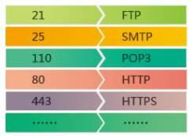

此后，以QQ为代表的IM、P2P、VoIP、游戏、网络视频等等新应用迭出，更有一枚不同寻常的苹果激发了移动互联网时代的到来。这一路发展下来，当真是突飞猛进。今天，互联网已经渗透到生活的方方面面，成为一种“生活必需品”了。

互联网的发展，不仅丰富了人们的沟通和生活（好像有点眼熟），也提升了工作效率。不过，网络毕竟是无边界的，工作与生活也没那么容易分开了。要是有员工在上班时间玩玩游戏，看看视频，或者跟同学好友聊天闲谈，就不仅是影响工作效率了。带宽滥用、敏感信息泄露、针对应用的攻击等等都成为威胁企业网络安全的重要问题。就像每个美丽的城市都有不堪入目的小巷一样，移动互联网和社交网络中的热门应用多隐藏着漏洞，恶意软件和互联网犯罪日益猖獗，给企业带来新的威胁。

简而言之，网络中可能包括协作类应用、即时消息、电话会议、流媒体、文件共享、在线存储、VoIP、P2P、游戏、娱乐等等各种应用。**企业必须正确区分合法应用、风险应用和带宽占用类应用，保证正常业务的带宽，限制甚至阻断社交媒体和游戏娱乐类应用，并消除潜在的威胁。** 这一切都落在了防火墙的肩上，这是时代对防火墙提出的新要求。

传统的状态检测防火墙显然不能承担这个重任。

一方面，传统防火墙的协议识别技术，仅检查报文的五元组，根据TCP/UDP报文的端口号来识别应用，此之谓端口识别是也。端口识别技术虽然检测效率很高，但随互联网的发展，适用的范围却越来越小了。因为许多传统和新兴应用采用了各种端口隐藏技术来逃避检测。

最常用的方法是使用非知名端口，如使用8000端口进行HTTP通信、使用80端口进行Skype通信、在2121端口上开启FTP服务等等。因此，仅通过端口识别技术已经不能真正判断流量中的应用类型了。更有些应用使用随机端口通信，甚至采用加密方式传输数据。要识别这些协议，端口识别技术却是束手无策了。

另一方面，一个协议可以用于多个应用软件，一个应用软件也可能使用多个协议。协议和应用之间的关系错综复杂纠缠不清――唉一声，贵圈真乱。

一种协议可以用于多个应用软件。这是一个普遍现象，尤其以标准协议最为常见：开发者总是以标准协议为基础，开发应用软件。最典型的就是HTTP协议。随着Web 2.0的发展，企业IT系统Web化趋势明显，使用HTTP协议的应用软件更是数不胜数，几乎遍布互联网应用的所有领域。再比如P2P协议，利用P2P协议的下载软件多不胜举――因此，协议识别的结果不能直接用于应用控制，否则极有可能误伤良民。

同样的，一种应用软件可能使用多种协议来进行通信。例如，迅雷软件使用了HTTP协议、BT协议、ED2K协议、FTP协议、迅雷私有协议等多种协议。这几种协议都可以用来下载文件，分别用于下载不同类型的资源。――因此，应用识别一定要包括所有关联协议的流量，否则就难免有漏网之鱼。

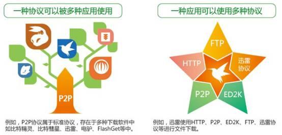

流量从简单到复杂，应用跟端口的关系日趋复杂化，企业管理员发现，网络中的流量看不清了，简直是一团混沌。企业迫切需要流量可视化，并针对应用实施管控策略。可以说，这是NGFW最核心的诉求，也是NGFW的根本。


## NGFW的主要功能
从Gartner正式定义NGFW到现在，6年了，NGFW的概念已经深入人心，你要是没有NGFW你都不好意思跟人家打招呼。但是Gartner在定义中只约束了NGFW的必备能力（归纳起来就是4各方面：集成传统防火墙、集成IPS、集成外部智能、应用感知和可视化），不同的安全厂商对NGFW的理解略有不同，并且产品化的路径通常是基于现有的产品来发展，这就使得不同厂商的NGFW功能各不相同。

同时,随着移动化, 社交化, 云和大数据的发展, ICt网络环境持续变化, NGFW要适应这些变化,需要更多的能力. 在这个背景下, 不同的安全厂商都在试图重新定义NGFW.

- 全面的威胁防护。华为不仅实现了防火墙和IPS的深度集成，还将网关防病毒（AV，Anti-Virus）、反垃圾邮件（AS，Anti-Spam）、URL过滤、数据防泄露（DLP）等功能也集成到了NGFW中。在APT防御场景下，这些功能可以有效地帮助斩断Kill Chain――当然这都是后话了，我们留到第三季再讲，如果还有第三季的话。
- 多维度管控。传统状态检测防火墙主要是基于五元组来实现策略控制。华为NGFW除了支持基于应用的管控，还支持跟第三方认证服务器配合，实现基于用户的管控。并且，还可以根据位置信息和终端类型制定策略。这样，全方位立体化的管控策略就诞生了。我们来看一张表。

    | 管控维度 | 支持能力                | 举例         |
    | -------- | ----------------------- | ------------ |
    | WHo      | 用户/用户组             | 张三丰       |
    | When     | 时间段                  | Worktime     |
    | where    | 安全区域                | Trust        |
    | Where    | 地区                    | 武当山       |
    | Where    | d           地址/地址组 | 192.168.10.3 |
    | Where    | 终端设备                | Honor 6 Plus |
    | What     | 服务/服务组             | imap         |
    | What     | 应用/应用组             | 电驴         |
    | How      | 接入方式                | 无线802.1x   |


- 简化管理. 管控能力增强, 同时也意味着管理复杂度的提高. 华为创新的Smart Policy技术，让NGFW更加智能。安全管理员可以使用系统默认的基础模板，实现策略的快速部署；NGFW根据网络流量分析，给出安全策略的优化建议；此外，还可以识别冗余和失效的安全策略，帮助精简策略，简化管理。
- 提升网络体验。一方面，通过带宽管理功能，可以限制低价值流量，保证关键业务带宽，优先转发时延敏感流量；通过用户配额管理功能，可以限制用户每日/每月上网流量总额或者每日上网时长。另一方面，通过智能选路技术，不仅可以根据运营商地址库选路、智能DNS、透明DNS选择最合适的ISP出口，还可以根据链路质量、带宽、权重、优先级等属性选择最佳链路，实现负载均衡――而且，支持根据IPSec隧道质量选路。

### NGFW VS UTM
熟悉UTM的同学都知道，在IDC的定义中，UTM也是在传统状态检测防火墙的基础上，集成了AV、IPS、AS等功能。既然都是用一台设备来提供IPS、AV等多种安全功能，NGFW跟UTM有什么不同呢？

如前所述，应用感知和可视化是NGFW的核心诉求，而UTM通常是没有应用感知能力的。另外一个关键点是产品定位和性能的问题。Gartner认为NGFW是面向大中型企业的安全产品，而UTM面向的是SMB市场，仅适用于1000人以下的中小企业和分支机构――他们追求的是功能丰富和易用，而对性能要求不高。

从UTM产品的表现来看，很多产品启用IPS和AV之后性能下降非常严重，有些甚至低至启用之前的20%。性能上不去，功能再丰富也是白搭。IDC在定义UTM的时候，也是很隐晦地说，UTM需要在一个盒子中集成这个那个功能，但是并不一定全部启用。至于NGFW，启用IPS和AV后性能下降不能超过50%。

NGFW怎么做到的呢？引擎和检测方式是两个关键点。

先说引擎。UTM是把以前多个盒子的功能，放在了一个盒子里面。物理上，盒子少了；但是逻辑上仍然是全串行处理，一个盒子里面还是多个盒子的处理流程，每一个安全检测都由一个单独的引擎来处理，每一个报文流都要经过多次检测，每一次检测都必然增加了网络延迟。

华为为NGFW产品全新研发了高性能的智能感知引擎（Intelligent Awareness Engine ，简称IAE），实现一体化检测，一体化处理。对于上送的流量，IAE引擎首先识别出准确的协议和应用，然后由对应的协议解码模块深度解码，并把解码以后的字段和内容分类检测。不同类型的内容，检测项也不尽相同，但是多种检测是并行的，速度更快。

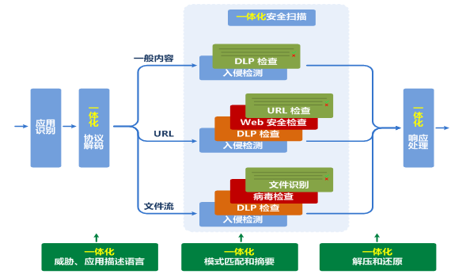

当然，NGFW性能的提升离不开硬件平台的支持。IAE引擎内置了硬件卸载的能力，将占用大量CPU计算资源的操作，提交给华为独有的硬件平台来处理，减轻CPU负担，提升这些操作的性能。

再说检测方式。很多UTM产品的文件检测仍然是基于文件的，比如病毒检查，设备要先接收并缓存文档，再扫描。这种方式很大程度上是沿用了PC机上的处理机制，并不适用于防火墙这样的网关产品。缓存需要耗内存，并带来延迟。同时因为难以缓存大文件，只能放过，大文件的安全检测是一个无法弥补的安全漏洞。

华为NGFW产品采用了基于流的文件处理机制，能够接收文件片段并执行安全检测。前面说过，IAE引擎的安全检测是并行的，这样，文件传输时延小，整体性能更高，用户体验也比较好。


对于很多UTM产品来说，当网络流量超过防火墙处理能力时，文件流检测可能就被放过了，也就是内容安全检测被bypass了。要性能，就得承担风险。要安全，性能就会下降。企业管理员要在安全与性能之间去平衡。有些企业购买UTM后并没能够启用其中的很多功能，就是因为无法忍受性能的下降。

防火墙的性能下降影响时延敏感业务和协同类应用的客户感知，进而影响企业的服务水平和生产力。现在，大型企业对安全和性能的需求是同等重要的。企业不能容忍传统防火墙安全能力的落后，也无法忍受NGFW性能低下成为网络瓶颈。NGFW的使命，就是弥补传统防火墙在应用感知等方面的不足，并提供足够的性能。

## 反病毒特性原理
### 病毒初探
提到病毒，大家马上就会想到人类世界的病毒，这些病毒寄生在人体内，轻则损坏健康，如流感病毒；重则危害生命，如近期爆发的MERS病毒。同样，网络世界中也存在病毒，网络世界中的病毒是一种恶意代码，附着在应用程序或文件中，一般通过邮件或文件共享等协议进行传播。这些病毒具有破坏性、隐蔽性、传染性等特点，严重威胁主机系统和网络安全。可见，无论是人类世界的病毒还是网络世界的病毒，都需要有应对方法才能确保安全。

对于人类世界的病毒，我们可以通过药物来处理；对于网络世界的病毒，我们可以在主机上安装杀毒软件，也可以在防火墙上部署反病毒功能。防火墙上提供的反病毒特性和主机上的杀毒软件在功能上是互补和协作的关系，由于部署位置和病毒检测机制的不同，两者可以同时使用，更好地保障主机和网络的安全。

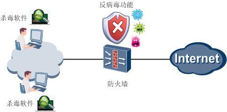

### 病毒载体识别
防火墙要想检测病毒，前提是必须能识别出报文中的文件。传统防火墙只关注报文的网络层信息，像我们在第一季技术贴中介绍过的NAT、IPSec等特性，无论是转换IP地址还是封装新的IP地址，都只是在网络层这个层面做文章。传统防火墙就好比是外科医生，检测深度有限，对报文应用层信息中携带的文件无能为力。

而对于NGFW来说，天生就拥有应用识别这一强大的基因，能够识别报文的应用层信息，这就为检测病毒打好了基础。NGFW更像是内科医生，深度检测使病毒无所遁形，正所谓“流量穿墙过，病毒不放行”。

病毒一般通过邮件或文件共享等协议进行传播，下面我们就来看看都有哪些文件传输协议：
- FTP

    最常见的文件传输协议，FTP协议中存在客户端和服务器两种角色，客户端可以从服务器下载文件，也可以向服务器上传文件。所以对于FTP来说，文件（病毒）传播的方向有下载和上传两种。
- HTTP

    浏览网页时常用到的协议，也可以传输文件。HTTP协议传输文件时也有两个方向，客户端即浏览器可以向服务器上传文件，也可以从服务器下载文件。
- SMTP

    最常用的邮件传输协议，用于电子邮件从客户端传输到邮件服务器，以及从某一个邮件服务器传输到另一个邮件服务器。通过SMTP协议发送邮件是一个“推”的过程，所以文件传输方向就只有上传（发送邮件）这一个方向。
- POP3

    邮局协议第三版，用于客户端从邮件服务器读取邮件。通过POP3协议读取邮件是一个“拉”的过程，所以文件传输方向就只有下载（接收邮件）这一个方向。
- IMAP

    交互式邮件存取协议，可用于客户端从邮件服务器收发邮件，还支持客户端直接对邮件服务器上的邮件进行操作，因此IMAP协议的文件传输方向包括下载（接收邮件）和上传（发送邮件）两个方向。
- NFS

    网络文件系统, 常用于Linux系统中的一种文件共享协议, 文件的传输方式包括上传和下载两种
- SMB

    常用于Windows操作系统的一种文件共享协议, 文件的传输方向也包括上传和下载两种

### 病毒检测
解决了病毒载体的识别问题后，接下来就是如何判断一个文件是否为病毒文件，NGFW采用的是特征对比的方式。NGFW提取文件特征与病毒特征库中的特征进行匹配，如果特征一致，则认为该文件为病毒文件；如果特征不一致，则认为该文件为正常文件。病毒特征库中的特征是否全面、精准、有效，决定着病毒检测的效果。网络世界中，每天都在产生新的病毒，原有的病毒也会出现变种，所以必须**定期更新特征库**，才能够更好地保证网络安全。

下面我们再来看看反病毒特性的内部处理流程。按理说，反病毒的处理流程应该很简单，发现病毒然后阻断病毒就可以了呀。但是，就像人生充满了意外一样，病毒的处理过程也包含很多例外的情况。比如，有时候不需要对某条流量检测病毒、有时候识别出来的文件并不是病毒，需要放行等等。我们要积极面对人生的意外，NGFW也要考虑各种例外情况。

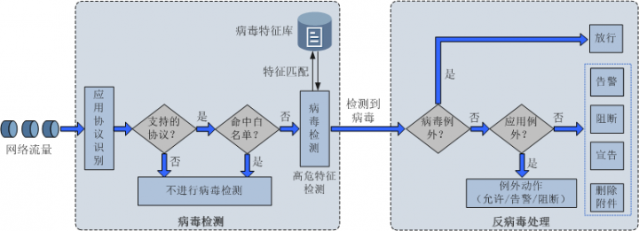

处理流程的简要介绍如下:
1. 经过应用协议识别后, 流量已经显出真容, 如果流量的类型属于上面介绍过的七种文件传输协议, 进行下一环节处理; 否则不进行病毒检测
2. 流量是否命中白名单(包括域名, URL, 源/目的IP地址或IP地址段规则), 如果没有命中,进行下一环节处理；如果命中，则不进行病毒检测。如果想对某个IP的流量不进行病毒检测，就可以把该IP地址添加到白名单中 
3. 对流量中的文件进行病毒检测, 将文件特征与病毒特征库中的特征进行匹配. 检测病毒时, NGFW还支持高位特征(启发式)检测模式, 即发现文件存在潜在危险, 就认为改文件时病毒文件. 该模式宁可错杀三千，绝不漏过一个，能够消除安全隐患，但会降低病毒检测的性能，且存在误报风险，一般情况下不建议开启。
4. 检测到病毒后, NGFW会判断该病毒文件是否属于病毒例外, 如果不属于病毒例外, 进行下一环节处理; 如果属于病毒例外,则直接放行
5. 接下来判断病毒文件的应用是否属于应用例外, 这里的应用指的是承载于HTTP协议的一些应用，如网盘、云盘等，通过应用例外可以为应用配置不同于HTTP协议的处理动作。如果属于应用例外，按照应用例外定义的动作进行处理；如果不属于应用例外，则按照协议定义的动作进行处理。

协议及其支持的处理动作如下表所示:

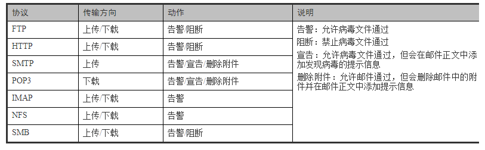

NGFW对不同协议支持的动作差异情况,这里再解释一下:
1. NFS协议只有告警动作，没有阻断动作，是因为阻断文件后，NFS文件系统变慢，用户体验很差，所以NGFW对NFS协议就只保留了告警动作。
2. SMTP和POP3协议没有阻断动作，是因为病毒检测应该只限于邮件中的附件，不能影响用户正常阅读邮件内容的权利，所以NGFW对SMTP和POP3协议没有做阻断动作，而是提供宣告或删除附件动作。
3. IMAP协议没有阻断动作，除了不能影响用户阅读邮件之外，还因为IMAP协议工作原理是连续收取所有邮件，如果一封邮件检测出病毒被阻断，将会影响后续邮件的接收。另外，IMAP协议也没有宣告和删除附件动作，是因为IMAP协议不同于SMTP和POP3协议，对于SMTP和POP3协议，NGFW可以通过代理方式运用小手段“篡改”邮件内容；而对于IMAP协议，修改邮件内容实现起来难度较大，所以NGFW就没有提供宣告和删除附件动作。

### 反病毒配置逻辑
学习了反病毒特性的实现原理后, 接下来我们介绍反病毒的配置. 反病毒特性涉及多个功能模块, 需要这些模块之间相互配合协作.

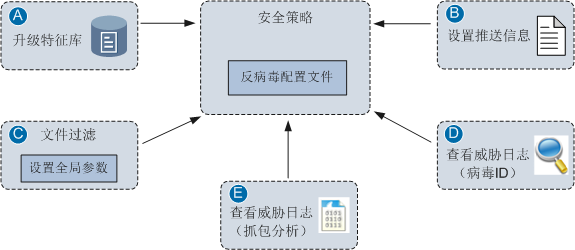

反病毒特性的主体配置是反病毒配置文件和安全策略。反病毒配置文件中定义了协议、传输方向和动作，以及病毒例外和应用例外；安全策略中定义了匹配条件（对哪些流量进行病毒检测）、动作（必须为允许），然后引用反病毒配置文件。其它几个功能模块的作用如下：
- A: 升级特征库可以提升病毒检测能力和检测效率
- B: 推送信息的设置将会影响邮件正文中添加的提示信息，NGFW提供了缺省的提示信息，也可以通过设置推送信息来定制个性化的信息。
- C: 文件过滤特性中的全局参数包括最大解压层树, 最大解压文件大小等, 合理设置这些参数将会提高病毒检测效率. 文件过滤也是内容安全中的一个特性
- D: 查看威胁日志，如果发现某个文件被误报为病毒文件，实际上该文件是安全的，此时可以将该病毒的ID填写到病毒例外中，后续NGFW再检测到这个文件时就会直接放行。
- E: 在反病毒配置文件中开启抓包功能后，可以在威胁日志中下载病毒数据包，进一步分析病毒特征。

接下来我们看一下反病毒配置文件的配置界面（以USG6000 V100R001C30SPC100版本为例）。对于内容安全的一系列特性，我们一般采用Web界面来配置，因为Web界面直观便捷，不用记忆很多命令。使用Web界面无法配置的功能，才使用命令行来配置。

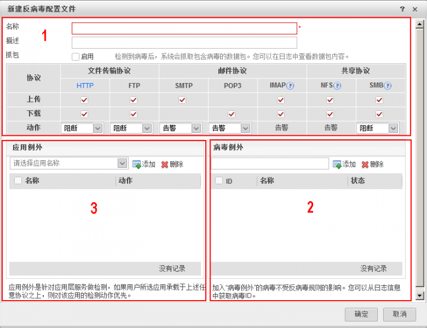

反病毒配置文件的配置界面分为3个区域，1是基本配置区域，在该区域中指定协议、传输方向和动作；2是病毒例外配置区域，在该区域中添加病毒ID；3是应用例外配置区域，在该区域中添加应用例外和动作。有一点需要注意，Web界面上不支持配置白名单，所以反病毒的白名单只能用命令行来配置。

### 一 阻断FTP协议传输的病毒文件
如下图所示，NGFW位于FTP客户端和服务器之间，我们在NGFW上配置反病毒功能，对FTP客户端向FTP服务器上传的文件进行病毒检测，发现病毒后及时阻断。

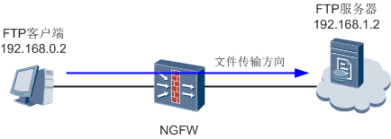

配置如下反病毒配置文件，指定协议、方向和动作，然后在安全策略中引用该配置文件。

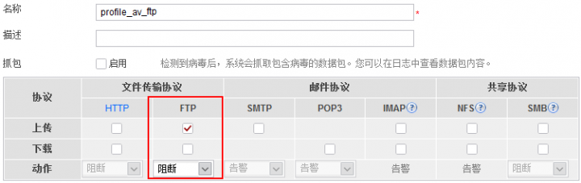

配置完成后，我们使用EICAR文件模拟病毒文件来验证反病毒功能。EICAR文件是欧洲反计算机病毒协会为测试反病毒功能提供的文件，让用户在不使用真正病毒的情况下来测试反病毒功能。需要注意的是，在验证之前请务必确认当前版本是否支持EICAR文件检测，这里我们使用USG6000 V100R001C30SPC100版本，支持EICAR文件检测

首先，我们在记事本中输入字符串`X5O!P%@AP[4\PZX54(P^)7CC)7}$EICAR-STANDARD-ANTIVIRUS-TEST-FILE!$H+H*`，另存为eicar.com文件。然后在FTP客户端上向FTP服务器上传eicar.com文件，发现eicar.com文件无法上传，在NGFW上的威胁日志中可以看到eicar.com文件被阻断的日志，符合预期结果。

如果已经明确知道eicar.com文件不是病毒，需要放行处理，此时可以在威胁日志中获取病毒ID（16424404），填写到病毒例外中，如下图所示：

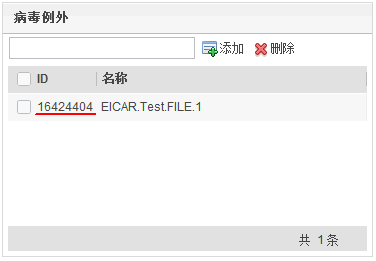

在FTP客户端上再次执行上传操作，发现可以上传成功，文件没有被阻断，说明病毒例外配置生效。

上述配置的命令行脚本如下:
```bash
#
profile type av name profile_av_ftp
 ftp-detect direction upload
 exception av-signature-id 16424404
#
security-policy
 rule name policy_av
  source-zone trust
  destination-zone untrust
  source-address 192.168.0.0 mask 255.255.255.0
  profile av profile_av_ftp
  action permit
#
```
### 二 阻断SMTP协议传输的病毒文件
如下图所示，NGFW位于邮件客户端和服务器之间。我们在NGFW上配置反病毒功能，对邮件客户端A发送给B的邮件进行病毒检测。如果在邮件附件中发现病毒，允许病毒文件通过，同时在邮件正文中添加发现病毒的提示信息

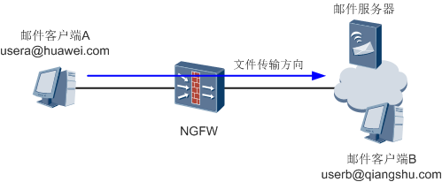

配置如下反病毒配置文件，指定协议、方向和动作，然后在安全策略中引用该配置文件。

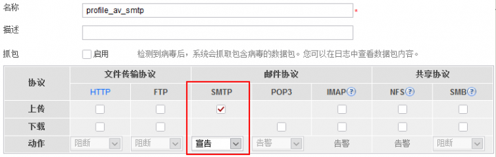

同时，我们通过设置推送信息来定制个性化的提示信息，该信息将会显示在邮件正文中。

配置完成后，邮件客户端A向B发送一封邮件，邮件的附件为eicar.com文件。B收到邮件时，附件中仍然带有eicar.com文件，但是在邮件正文中会看到如下提示信息：

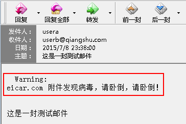

上述配置的命令行脚本如下：
```bash
#
profile type av name profile_av_smtp
smtp-detect action declare
# 
security-policy
 rule name policy_av 
  source-zone trust
  destination-zone untrust
  source-address 192.168.0.0 mask 255.255.255.0
  profile av profile_av_smtp
  action permit
#
```
如果邮件客户端B收到一封邮件，正文中有两条提示信息，这是怎么回事呢？很有可能是因为邮件在传输中经过了两台NGFW，这两台NGFW都部署了反病毒特性。比如一台NGFW上配置了针对SMTP协议的宣告动作，另一台NGFW上配置了针对POP3协议的删除附件动作，这样就会在邮件中看到两条提示信息。

### 三 阻断SMB协议传输的病毒文件
如下图所示，NGFW位于PC和文件服务器之间。我们在NGFW上配置反病毒功能，对PC向文件服务器上传的文件进行病毒检测。

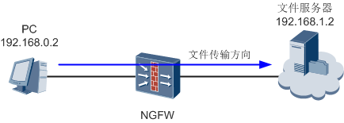

本示例中，我们同时验证文件最大解压层数对病毒检测的影响。在文件过滤特性的全局参数中设置文件的最大解压层数为3层，超过最大解压层数时的动作为允许通过，如下图所示：

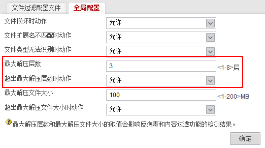

配置如下反病毒配置文件，指定协议、方向和动作，然后在安全策略中引用该配置文件。

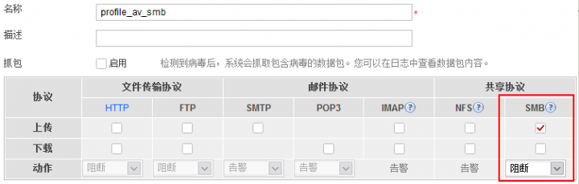

我们将eicar.com文件压缩4次制作成eicar.zip文件，在PC上将eicar.zip文件拷贝到文件服务器上。发现可以拷贝成功，eicar.zip文件没有被NGFW阻断，说明超过最大解压层数3层时，NGFW允许文件通过。

接下来我们将最大解压层数设置为5层，再次执行拷贝操作，发现无法拷贝，eicar.zip文件被NGFW阻断，说明文件最大解压层数不超过5层时NGFW会对文件进行病毒检测，符合预期结果。

上述配置的命令行脚本如下：
```bash
#
 file-detect decompress depth 5
#
profile type av name profile_av_smb
smb-detect direction upload
# 
security-policy
 rule name policy_av
  source-zone trust
  destination-zone untrust
  source-address 192.168.0.0 mask 255.255.255.0
  profile av profile_av_smb
  action permit
#
```
上面我们使用自制的EICAR文件验证了NGFW对FTP、SMTP和SMB协议的病毒检测功能。如果NGFW能够连接到Internet，我们还可以在内网的PC上直接访问EICAR文件的官方网址`http://www.eicar.org/85-0-Download.html`，在网页上下载多种格式的EICAR文件，以此来验证NGFW对HTTP协议的病毒检测功能。

## IPS特性原理
### IPS和IDS
提到IPS，就不能回避另一个概念，入侵检测系统IDS（Intrusion Detection System）。IDS与IPS虽然只有一字之差，但两者功能区别很大。

IDS的主要作用是监控网络状况，发现入侵行为并记录事件，但是不会对入侵行为采取动作，是一种侧重于风险管理的安全机制。通常情况下，IDS设备会以旁路的方式接入网络中，与防火墙联动，发现入侵行为后通知防火墙进行阻断。

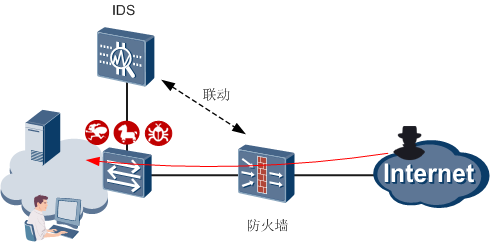

IPS是入侵防御系统的简称，从字面意思来看，这一概念包括两个部分的含义：发现入侵行为，阻断入侵行为。与IDS不同的是，IPS会实时阻断入侵行为，是一种侧重于风险控制的安全机制。

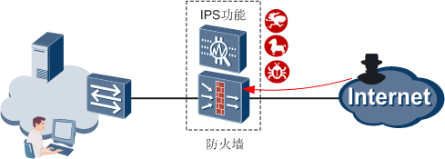

本篇重点介绍NGFW上的IPS特性，关注如何防御入侵行为。在只需要入侵检测的场景中，我们也可以将NGFW配置成IDS设备，只检测入侵行为。

防御入侵的前提是要先识别入侵行为，网络中的报文多种多样，如何发现隐藏于其中的入侵行为呢？与反病毒特性相似，IPS也采用了特征对比的方式，通过签名来判断入侵行为。
### 签名
签名用来描述网络入侵行为的特征，IPS通过比较报文特征和签名来检测和防御入侵行为。除了特征之外，签名中还包含处理动作，以及一些必要的信息，下面给出了一个典型的签名：

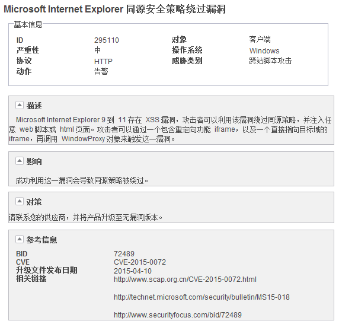

该签名描述了针对IE浏览器漏洞的攻击行为，签名中的信息含义如下表所示。

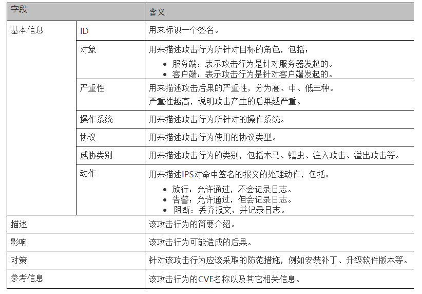

上面我们以一个签名为例介绍了签名中的信息含义, 实际上, NGFW提供了IPS特征库(签名库),里面包含了针对各种已知攻击行为的签名信息. 由于这些签名都是事先定义好的, 可以直接使用, 所以叫做**预定义签名**. 网络攻击层出不穷, 为了识别出新的攻击行为, 必须**定期更新IPS特征库**, 才能够更好地防御攻击行为, 保证网络安全.

使用预定义签名可以识别出绝大部分地攻击行为并进行防御, 可以满足一般场景中地安全需求, 是明枪易躲暗箭难防，还是有一些预定义签名覆盖不到的情况。例如，针对某个漏洞的攻击行为已经出现，但是IPS特征库中还没有更新相应的签名；安全厂商还未知晓的零日漏洞（0Day），其漏洞信息和利用方法就已经在黑客圈里传播。这两种情况都是因为IPS特征库中没有相应的预定义签名来识别攻击行为，所以IPS无法防范此类攻击行为。

为此，NGFW提供了**自定义签名**，弥补预定义签名未及时更新而导致的无法识别和防御上述攻击行为的问题。使用自定义签名来临时防御这些利用未知漏洞进行攻击的行为，待升级IPS特征库后，再使用IPS特征库中相应的预定义签名来防御。

自定义签名需要手工定义攻击行为的特征，对网络管理员技能要求很高。比如针对0Day漏洞，管理员需要了解漏洞的原理和利用方法，掌握攻击报文的特征，才能够精确地配置自定义签名。如果配置不当会导致签名无效，无法防御攻击行为，甚至影响正常业务。因此，**一般情况下不建议配置自定义签名**。

自定义签名的配置过程也比较复杂，需要配置的内容很多，自定义签名中包含的配置项如下图所示。

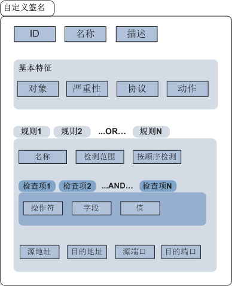

自定义签名中可以配置多条规则，规则之间是“或（OR）”的关系，只要报文命中其中一条规则便命中了此签名。规则中可以配置多条检查项，检查项之间是“与（AND）”的关系，只有报文命中所有检查项时，才算是命中了此规则。下面给出了自定义签名中几个关键配置项的介绍。


### 签名过滤器和例外签名
IPS特征库中包含了针对各种攻击行为的海量签名信息，但是在实际网络环境中，业务类型可能比较简单，不需要使用所有的签名，大量无用的签名也容易影响对常用签名的调测。此时我们可以使用签名过滤器将常用的签名过滤出来。

签名过滤器是若干签名的集合，我们根据特定的条件如严重性、协议、威胁类型等，将IPS特征库中适用于当前业务的签名筛选到签名过滤器中，后续就可以重点关注这些签名的防御效果。通常情况下，对于筛选出来的这些签名，在签名过滤器中会沿用签名本身的缺省动作。特殊情况下，我们也可以在签名过滤器中为这些签名统一设置新的动作，操作非常便捷。

IPS特征库中预定义签名的动作无法修改，不能按需调整，考虑到各种例外情况，NGFW提供了例外签名功能。例外签名的优先级高于签名过滤器，使用例外签名可以为特定的签名单独设置动作。例如，发现某些正常的业务报文命中签名被误阻断，可以将该签名加入到例外签名中，然后调整动作为放行。

了解签名过滤器和例外签名的概念之后，下面我们来看看IPS特性的内部处理流程。

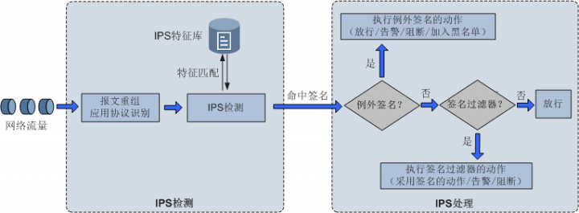

处理流程地简要介绍如下:
1. NGFW会首先进行IP分片报文重组以及TCP流重组，可以有效检测出逃避入侵防御检测的攻击行为。经过应用协议识别后，各种应用的流量已经被识别出来，然后NGFW对流量进行IPS检测，将报文特征与IPS特征库中的签名进行匹配。
2. 报文命中签名后，NGFW首先会判断该签名是否属于例外签名，如果属于例外签名，执行例外签名的动作；否则进入下一环节处理。
3. 接下来，NGFW判断该签名是否属于签名过滤器，如果属于签名过滤器，执行签名过滤器的动作（当签名过滤器的动作为“采用签名的缺省动作”时，如果报文命中了多个签名，以最严格的动作为准）；否则进入下一环节处理。
4. 如果报文命中的签名既不属于例外签名也不属于签名过滤器，则不会进行IPS处理，直接放行。


签名的信息很多，我们往往不知道根据什么条件来筛选，针对这个问题，NGFW提供了几个典型入侵防御场景适用的签名过滤器。这些签名过滤器已经集成到缺省的入侵防御配置文件中，可以在安全策略中直接引用。这几个缺省入侵防御配置文件的介绍如下表所示。

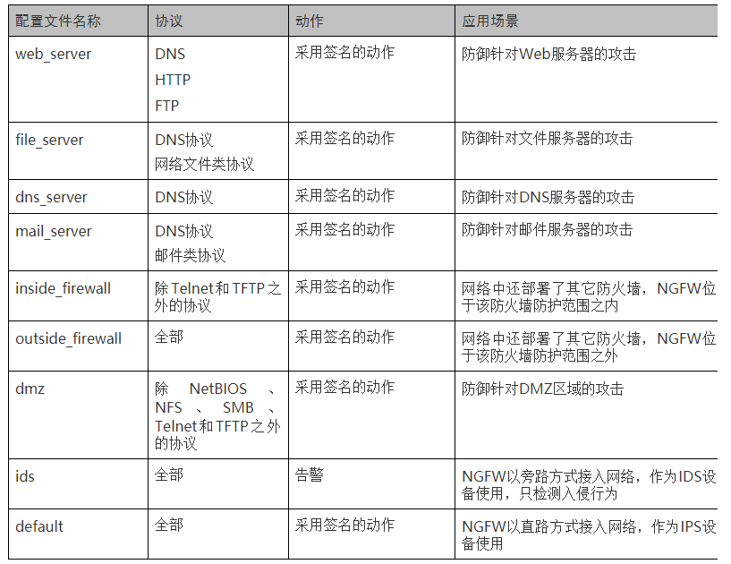

最后，我们来对比一下IPS特性和上一篇介绍过的反病毒特性。两者都是基于特征检测方式，检测效果依赖于特征库的更新。IPS特性关注所有协议，侧重于报文内容级别的检测；反病毒特性针对特定协议（FTP/HTTP/SMTP/POP3/IMAP/NFS/SMB），侧重文件级别的检测。单就病毒检测这一块来说，两者功能有重叠，IPS特性中也包括病毒检测，但是检测力度和支持情况不如反病毒特性。IPS特性和反病毒特征是相互补充的关系，不存在取代关系。

## IPS特性配置
介绍IPS特性的配置之前，强叔必须先提醒一点，IPS的配置不是一件“一劳永逸”的事情，其防御效果也不能一蹴而就。网络中的威胁是千变万化的，完成IPS初始配置后，还要持续不断地调整和维护IPS配置，增强防御效果。

下面给出了部署IPS特性后的通用调测思路。IPS配置完成后，通过监控攻击行为、分析威胁日志等手段，发现防御策略不合理的地方，进而对IPS配置做出调整，如修改签名过滤器、升级IPS特征库，必要的时候还可以使用例外签名和自定义签名


入侵和防御之间的战斗是长期的过程，网络管理员不能懈怠，必须密切关注网络安全形势，监控和分析网络中的入侵行为，不断调整和优化IPS防御策略，这样才能在最大程度上保证网络的安全性。
### IPS与周边特性逻辑关系
IPS特性的配置涉及多个功能模块，需要这些模块之间相互配合协作，如下图所示。

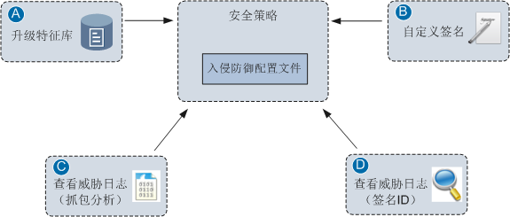

IPS特性的主体配置是入侵防御配置文件和安全策略。入侵防御配置文件中定义了签名过滤器和例外签名；安全策略中定义了匹配条件（对哪些流量进行IPS检测）、动作（必须为允许），然后引用入侵防御配置文件。其它几个功能模块的作用如下：

- A: 升级特征库可以识别出更多的入侵行为，升级特征库只会更新预定义签名，不会影响自定义签名。
- B: 配置自定义签名，弥补预定义签名未及时更新而导致的无法识别和防御某些攻击行为的问题，增强网络安全性。
- C: 在入侵防御配置文件中开启抓包功能后，可以在威胁日志中下载包含入侵特征的数据包，进一步分析该入侵行为。
- D: 查看威胁日志，获取签名ID加入到例外签名中，后续命中该签名的入侵行为，将会按照例外签名中的动作进行处理。

### Web配置界面展示
下面给出了入侵防御配置文件的Web配置界面（以USG6000 V100R001C30SPC100版本为例），并对界面上的配置项进行简要解释。

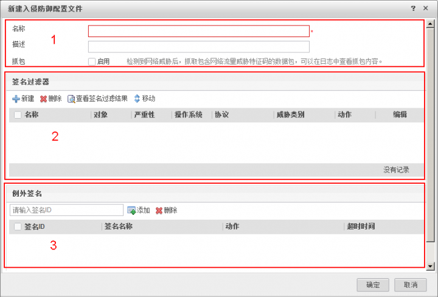

入侵防御配置文件的配置界面分为3个区域，1是基本配置区域，在该区域中设置入侵防御配置文件的名称和描述，以及开启抓包功能；2是签名过滤器配置区域，在该区域中可以创建多个签名过滤器，匹配时NGFW会依次查找签名过滤器，当报文命中某个签名过滤器中的签名时，就会对报文执行该签名过滤器的动作；3是例外签名配置区域，在该区域中添加例外签名并设置动作。


### IPS配置实例
下面我们进入实战部分，来看两个具体的配置实例。配置之前，必须保证IPS特征库已经成功加载，同时建议将IPS特征库升级至最新的版本。

#### 使用预定义签名防御针对IE浏览器的攻击行为
如下图所示，NGFW位于PC和Web服务器之间，PC上安装了Windows操作系统，并且使用IE浏览器访问Web服务器。Windows操作系统本身不是很安全，使用IE浏览器访问Web服务器就更容易遭到攻击。因此在NGFW上配置IPS功能，保护PC免受来自网络的攻击行为。

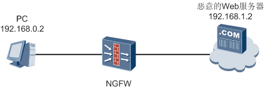

配置如下入侵防御配置文件，通过对象和操作系统这两个属性来筛选出适用的签名，然后在安全策略中引用该配置文件。

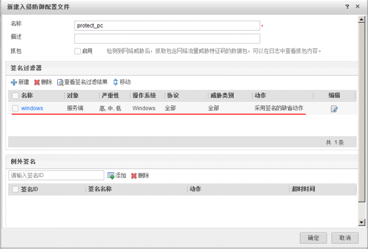

入侵防御配置文件创建或修改后，**必须在Web界面上执行“提交”操作才能生效**。提交过程所需时间较长，请耐心等待，建议完成所有入侵防御配置文件的配置后再统一进行提交。

完成上述配置后，我们使用“Microsoft Internet Explorer Memory Corruption Vulnerability (CVE-2014-1815)”这个针对Windows操作系统上IE浏览器的漏洞来验证防御效果，该漏洞的签名已经包含在预定义签名中，签名的缺省动作为告警。

首先，我们将利用该漏洞的恶意代码制作成HTML文件，放置于Web服务器上，这样就相当于将这台Web服务器模拟成Internet上恶意的Web服务器。然后在PC上使用IE浏览器访问含有恶意代码的Web页面，可以正常访问。

接下来我们在NGFW上查看威胁日志，可以看到相应的日志信息。由于该签名的动作是告警，所以NGFW没有阻断报文，只是记录日志，符合预期结果。

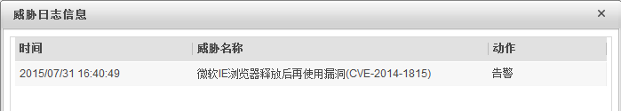

上述配置的命令行脚本如下：
```bash
#
profile type ips name protect_pc
 signature-set name windows
  os windows
  target client
  severity low medium high
  protocol all
  category all
#
security-policy 
 rule name policy_ips
  source-zone trust
  destination-zone untrust
  source-address 192.168.0.0 mask 255.255.255.0
  profile ips protect_pc
  action permit
#
```
#### 使用自定义签名防御针对Web服务器的注入攻击行为
如下图所示，某企业内网中部署了Web服务器供Internet上的用户访问。Web服务器上提供了论坛功能，用来发布产品消息，与用户、合作伙伴在线交流。NGFW位于内网服务器和Internet之间，NGFW上运行IPS功能，保护Web服务器的安全。

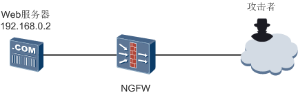

企业的网络管理员对Web服务器进行安全检查时，发现论坛的SQL数据库中多出了几个可疑的管理员账号，论坛数据时常会被修改。管理员查阅了论坛厂商的安全公告，没有发现漏洞信息，将IPS特征库升级至最近版本后，还是存在攻击行为。由此判断，Web服务器上的论坛程序很有可能遭到了利用零日漏洞（0Day）的攻击。

为了保证Web服务器的安全性又不影响业务正常运行，管理员决定分析攻击特征，使用自定义签名来防御攻击行为。管理员在Web服务器上进行抓包，经过一段时间的抓包后，发现如下可疑访问：

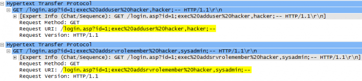

分析抓包信息可知，该报文是典型的SQL注入攻击报文。由于论坛的login.asp页面存在缺陷，攻击者可以在访问请求中插入SQL语句并在数据库中执行，绕过论坛的安全检查。这两条exec语句用来创建一个新的SQL数据库管理员账号并提升权限。

获得攻击行为的特征之后，就可以创建自定义签名了，首先配置自定义签名的基本特征。

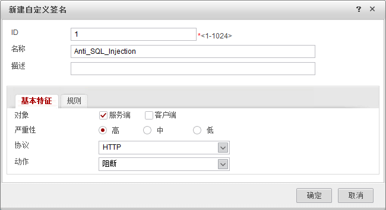

然后配置自定义签名规则。规则中配置了一条检查项，匹配HTTP协议的URI字段，值为`“login.asp\?id=\d+;exec”`，其中id=后面使用了正则表达式，表示匹配任意整数值。该检查项的作用是匹配HTTP请求中针对`login.asp`页面的exec注入攻击，只要URI中包含该值，就会命中此检查项。

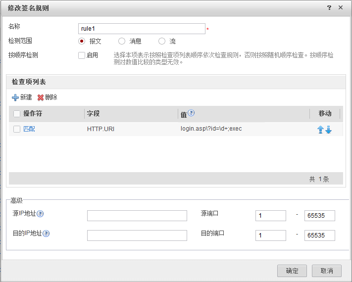

自定义签名创建或修改后，**必须在Web界面上执行“提交”操作才能生效。** 提交过程所需时间较长，请耐心等待，建议完成所有自定义签名的配置后再统一进行提交。

接下来检查新创建的自定义签名是否包含在签名过滤器中。本实例使用default配置文件（对应default签名过滤器），在default配置文件的“查看签名过滤结果”提示框中输入自定义签名的名称，可以查询到结果，说明该自定义签名已经包含在default签名过滤器中。如果使用了其他的配置文件，也可以使用该方法进行查询，保证自定义签名包含在签名过滤器中。

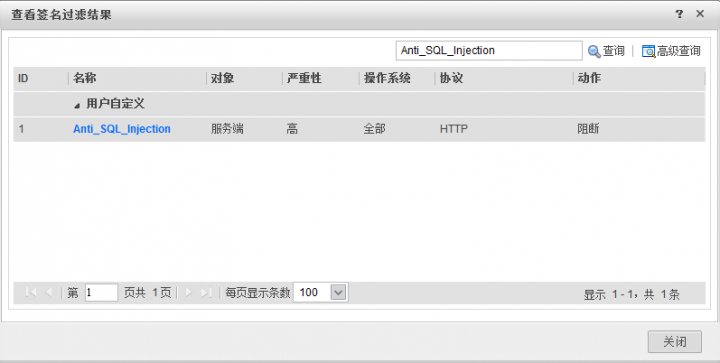

完成上述配置后，如果攻击者再次对论坛进行SQL注入攻击，就会被NGFW阻断，并生成日志信息，而正常的访问不会受到影响。

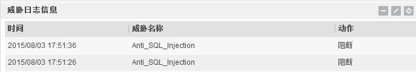

上述配置的命令行脚本如下：
```bash
# 
ips signature-id 1
 name Anti_SQL_Injection
 protocol HTTP
 target server
 action block
  rule name rule1
   condition 1 field HTTP.URI operate pmatch value login.asp\?id=\d+;exec
#
security-policy 
 rule name policy_ips
  source-zone untrust
  destination-zone trust
  destination-address 192.168.0.0 mask 255.255.255.0
  profile ips default
  action permit
#
```

## URL过滤
Internet上提供了丰富的资源，它就像水和空气一样，已经成为生存的必需品。我们通过Internet搜索信息、浏览新闻、观看视频，这些资源在Internet上都有一个唯一的网址。网址的学名叫做统一资源定位符（Uniform Resource Locator），简称URL。URL是通向Internet上资源的最直接的通道，有了URL就可以快速访问相应的资源。
### URL格式
从本质上说，URL是一串或长或短的字符串，由几部分字段组成，下面给出了一个典型的URL：

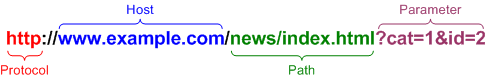

其中各个字段的含义如下:
- Protocol字段表示协议, 通常为HTTP或HTTPS, NGFW支持对这两种协议进行URL过滤. 这里我们先以HTTP协议为例，HTTPS协议的情况有些特殊，需要额外的SSL解密配置，我们在后文中介绍。
- Host字段表示Web服务器的域名或IP地址。如果Web服务器使用非标准端口（非80端口，如8080），则Host字段还应包含端口号，如www.example.com:8080。
- Path字段表示Web服务器上的目录或文件名，以斜杠“/”隔开。
- Parameter字段表示传递给网页的参数，通常用于从数据库中动态查询数据。

上述这四个字段组成了一个完整的URL，NGFW在对URL进行过滤时，就是对这一串字符串进行检查和匹配。通常情况下，Parameter字段的取值情况比较复杂，针对该字段进行过滤的管理成本很高，所以一般就是针对Host和Path字段来进行过滤。

关于URL大小写的问题，这里顺带说明一下。URL格式规范中提到，Protocol字段和Host字段不区分大小写，Path字段和Parameter字段是否区分大小写取决于Web服务器上的设置。而对于NGFW来说，对URL进行过滤时，这些字段都是不区分大小写的，这一点在配置的时候需要注意。

Internet上存在海量的网址，如何精确定义这些网址并按需过滤呢？NGFW采用了分门别类的思想，依托于华为安全服务中心提供的网址分类服务，将海量的网址归属到不同的类型中，实现基于分类的URL过滤。

### 基于分类的URL过滤
#### 预定义分类
目前，华为网址分类服务已经收录了45个大类、137个小类的URL，总条目超过8500万条URL，且仍在不断扩充中。下面的表格给出了当前所有大类的明细，并以大类中的“下载”为例，给出了其下包含的小类。

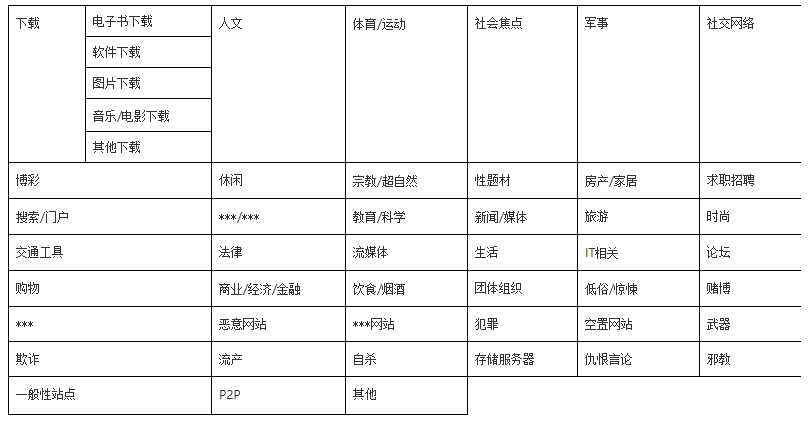

上述这些URL已经预先划分好归类，所以也叫做URL预定义分类。NGFW收到用户访问网站的请求时，在预定义分类中查询用户所访问的URL，找到后就能够确定该条URL属于哪一个分类。

预定义分类中包含的URL条目数量巨大，不便于管理和维护，逐条查找时也会影响效率。为此，NGFW在使用预定义分类时采用了“两步走”的方式。第一步，把常用的URL条目提取出来，先在这些URL条目中进行查询；如果没有查询到，再进行第二步，通过华为安全服务中心提供的网址分类服务来进行查询。“两步走”方式的查询过程如下图所示。

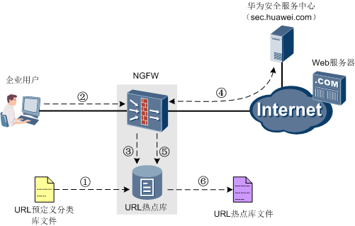

1. NGFW出厂时默认带有一个URL预定义分类库文件，里面包含了常见的一些URL条目。NGFW启动时会自动加载该文件，在缓存中形成URL热点库。
2. 企业用户在浏览器中输入URL，访问Internet上的网站。
3. NGFW从企业用户的访问请求中提取出URL，并在URL热点库中查询，这个过程是“两步走”中的第一步，也叫做**本地缓存查询**。如果查询到URL所属分类，则按照该分类的处理动作响应；如果未查询到，则进入下一环节处理。
4. NGFW向华为安全服务中心（sec.huawei.com）发起**远程查询**，这个过程是“两步走”中的第二步。华为安全服务中心提供的预定义分类的URL条目更多，查询到该URL所属的分类信息后，NGFW根据查询结果执行相应的处理动作。这里的sec.huawei.com表面上是一个网站，NGFW与该网站“接头”然后进行远程查询，具体过程我们在下面详细介绍。
5. NGFW将远程查询结果添加到URL热点库中，即URL热点库中可查询到该条URL所属的分类。URL热点库就这样经过不断的“学习”后，成为体现国家/区域特色以及企业业务特征的URL热点库，后续就可以减少远程查询次数，加快URL过滤的处理速度。
6. 为了保证NGFW异常断电或者重启后学习的结果不丢失，NGFW定期将缓存中的URL热点库保存到URL热点库文件中。每次NGFW启动后都会自动加载该文件，保证了NGFW能够使用最新的URL热点库。

对于远程查询，下面我们再展开介绍一下。远程查询时，其实华为安全服务中心只是充当“接口人”的角色，这一过程还需要其他几个服务器角色参与，包括URL调度服务器（UCDB）和URL查询服务器（UCSS）。所以远程查询的过程是NGFW、华为安全服务中心、URL调度服务器和URL查询服务器配合的结果，如下图所示。


远程查询的具体步骤这里就不详细介绍了，有一点需要注意，由于华为安全服务中心会根据NGFW所在的国家/地区，为NGFW分配URL调度服务器的IP地址和端口号，所以NGFW上要事先设置所在的国家/地区。

另外，NGFW进行远程查询时，要与华为安全服务中心、URL调度服务器和URL查询服务器正常通信，安全策略的配置必不可少，下表给出了NGFW上应开启的安全策略。

| 源设备 | 源IP地址 | 源端口 | 目的设备         | 目的IP地址 | 目的端口 | 协议 |
| ------ | -------- | ------ | ---------------- | ---------- | -------- | ---- |
| NGFW   | Any      | Any    | 华为安全服务中心 | Any        | 80       | TCP  |
| NGFW   | Any      | Any    | URL调度服务器    | Any        | 12612    | TCP  |
| NGFW   | Any      | Any    | URL查询服务器    | Any        | 12600    | TCP  |

华为安全服务中心（sec.huawei.com）的IP地址是变动的，URL调度服务器、URL查询服务器的IP地址是动态分配的，因此在安全策略中，这三者的目的IP地址需要设置为Any。

远程查询在URL分类识别的准确性和实效性方面，比本地缓存查询更强大，而且在查询过程中能够生成体现国家/区域特色以及企业业务特征的URL热点库。但是远程查询需要购买License才能使用，需要额外的开销。在实际使用中，如果有条件的话，建议部署远程查询功能，以便获得更好的URL过滤效果。

无论是本地缓存查询，还是远程服务器查询，最终的目的都是要获取到URL所属的分类，因为NGFW对URL进行过滤时，是根据其所属分类来定义动作的。目前NGFW支持的动作包括：
- 允许: 允许用户访问请求的URL. 对于允许动作, 话可以配置" 重标记报文优先级", 便于其他网络设备根据修改后的DSCP优先级对不同分类的URL流量采取差异化处理
- 告警: 允许用户访问请求的URL, 同时记录日志
- 阻断: 禁止用户访问请求的URL, 同时记录日志. NGFW会阻断拥护访问请求，并向用户推送一个网页说明无法访问的原因。推送的网页内容可自由定制。

这里还要考虑一种异常情况，本地缓存查询或者远程查询时，查询的结果可能是一条URL属于多个不同的分类，如果这些分类的动作不一样，应该以哪个分类的动作为准呢？NGFW提供了两种动作模式，可以解决这个异常情况：
- 严格模式: 最终动作取所属分类中最严格的动作, 例如URL属于两个分类, 动作分别为"告警" 和 " 阻断", 此时执行"阻断"
- 松散模式: 最终动作取所属分类中最宽松的动作. 例如URL属于两个分类, 动作分别为 "告警" 和 "阻断", 此时执行“告警”。 

Internet上每天都有大量的新网址产生，华为网址分类服务收录这些新网址的速度可能满足不了个别企业的需求；另外，有些企业对URL过滤的需求比较简单，仅仅需要针对特定的URL来过滤，不想购买远程查询服务。为了满足上述需求，NGFW提供了自定义分类的功能。

#### 自定义分类
自定义分类指的是管理员在NGFW上手动录入URL条目，并根据实际需要将URL划分到不同的分类中，以满足不同场景下的需求。

自定义分类在NGFW上有两种体现形式：
- 以单独的分类形式体现

    管理员可以在NGFW上创建新的分类, 并在分类中添加相关的URL条目. NGFW进行URL过滤时, 对URL条目执行该新建分类的动作
- 以预定义分类中的自定义URL条目形式体现

    管理员可以在预定义分类中添加新的URL条目，这些URL条目就归属于此预定义分类。NGFW进行URL过滤时，对URL条目执行该预定义分类的动作。

添加自定义分类的URL条目时，NGFW提供了两种添加方式，按整体URL（URL规则）添加和按域名部分（Host规则）添加。回忆一下我们在前面介绍过的URL格式，URL规则的匹配范围主要是Host+Path+Parameter字段，而Host规则只匹配Host字段。可见，URL规则的匹配范围大于Host规则，如果Path或Parameter字段中也含有Host字段的值，那么在匹配的时候就可能出现误命中，影响最终的处理动作。所以在配置时应根据实际情况选择添加方式，以便获得预期的处理结果。

自定义分类中URL条目的配置方式非常灵活，可以将字符串和通配符（`*`）组合使用，演变出多种匹配方式。需要注意的是，通配符（`*`）只能放在字符串的前面或者后面，不能放在字符串中间。另外，添加URL条目时不需要输入`http://`或者`https://`。下表给出了按整体URL（URL规则）添加时的匹配方式。

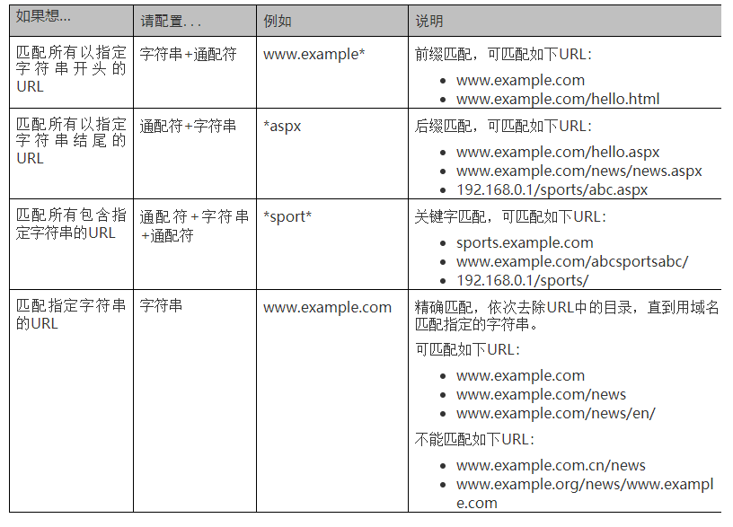

NGFW对自定义分类中的URL条目进行匹配时, 不同的匹配方式存在优先级顺序, 由高至低: 精确匹配 > 后缀匹配 > 关键字匹配. 这个优先级顺序决定URL过滤的动作是否符合预期, 影响URL过滤效果.

例如，`“www.example.com/news”`这条URL同时符合以下几个自定义分类：
- 精确匹配: `www.example.com/news`
- 前缀匹配: `www.example.com/*`
- 关键字匹配: \*example\*

则最终的查询结果以精确匹配规则“www.example.com/news”对应的分类为准。
另外，在同一种匹配方式下，匹配的规则长度越长优先级越高。例如，以下两个自定义分类都是前缀匹配方式：
- 前缀匹配: `www.example.com/news/*`
- 前缀匹配：`www.example.com/*`

则“www.example.com/news/index.html”这条URL会被认定属于“www.example.com/news/*”对应的分类。如果匹配的规则长度也相同，则最终以动作模式（严格模式或松散模式）的处理结果为准，动作模式我们在预定义分类中介绍过，这里就不赘述了。

基于分类的URL过滤最重要的就是获得URL所属的分类，无论是预定义分类的本地缓存查询和远程查询，还是自定义分类的各种匹配方式，确定URL所属分类的过程都比较繁琐。如果仅仅想简单粗暴地对某条URL执行允许或阻断动作，而不关心其所属的分类，该如何实现呢？在这种情况下，基于黑白名单的URL过滤应运而生。

### 基于黑白名单的URL过滤
基于黑白名单的URL过滤，简称URL黑白名单，是基于分类的URL过滤的一个补充。NGFW对URL黑白名单的处理更加简单直接：命中URL黑名单的请求被阻断，命中URL白名单的请求被放行。

URL黑白名单中URL条目的配置方式与自定义分类相同，也是将字符串和通配符（*）组合使用，同样可以针对整个URL进行过滤，或者仅针对Host字段进行过滤。

#### 整体处理流程
通过前面对基于分类的URL过滤、基于黑白名单的URL过滤的介绍，我们对URL过滤功能已是管中窥豹可见一斑。这里我们再把URL过滤的所有环节都串起来，看一看URL过滤的整体处理流程，如下图所示。

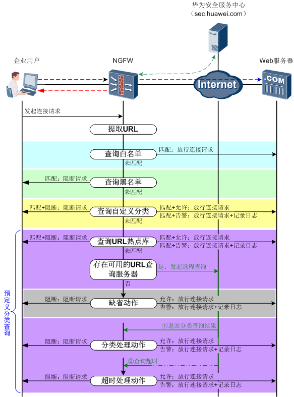

各个环节的简要介绍如下：
1. 企业用户发起HTTP连接请求。数据流匹配了动作为允许并且含有URL过滤功能的安全策略后，进入URL过滤处理流程。
2. NGFW从HTTP连接请求中提取URL。
3. NGFW在白名单中查询URL，如果匹配白名单，放行该请求；如果未匹配白名单，则进行下一环节处理。
4. NGFW在黑名单中查询URL，如果匹配黑名单，阻断该请求；如果未匹配黑名单，则进行下一环节处理。
5. NGFW在自定义分类中查询URL，如果匹配自定义分类，按照自定义分类的动作处理该请求（如果是在预定义分类中新增的URL，按照该URL所属的预定义分类的动作处理该请求）；如果未匹配自定义分类，则进行下一环节处理。
6. NGFW在本地缓存的URL热点库中查询URL所属分类，如果在URL热点库中查询到对应的分类，按照该分类的动作处理该请求；如果在URL热点库中没有查询到对应的分类，则进行下一环节处理。
7. NGFW检查远程查询功能是否可用，如果远程查询功能不可用，按照管理员配置的缺省动作处理该请求；如果远程查询功能可用，则进行下一环节处理。
8. NGFW向华为安全服务中心发起远程查询，如果华为安全服务中心返回了对应的分类，则按照该分类的动作处理该请求（当华为安全服务器中心无法确定该URL属于哪一个分类时，会将该URL归类到“其他”类中，NGFW根据“其他”类的动作处理该请求）；如果连接华为安全服务中心失败或者查询超时，则按照管理员配置的远程查询超时动作处理该请求。

了解URL过滤整体的处理流程非常重要，有助于我们针对不同的URL过滤需求，精确配置自定义分类、黑白名单以及相应的动作，保证URL过滤的准确性。

下表给出了URL过滤的几个例子以及简单的配置思路，这里我们只用了文字来描述，相关的配置将在下一篇中详细介绍。
| 需求                               | 配置思路                                    |
| ---------------------------------- | ------------------------------------------- |
| 只允许访问指定的几个网站           | 白名单+所有分类全部阻断动作+缺省阻断动作    |
| 只禁止访问指定的几个网站           | 黑名单+所有分类全部允许动作+缺省允许动作    |
| 对于某个网站，只允许访问某几个页面 | 白名单（允许访问的页面）+黑名单（整个网站） |

我们在URL格式一节中介绍过，NGFW支持对HTTP和HTTPS协议进行URL过滤。HTTP协议中的数据是不加密的，NGFW可以直接提取其中的URL信息；而HTTPS协议中的数据是加密的，NGFW必须先解密数据后才能获得其中的URL信息。下面我们就来介绍针对HTTPS协议的URL过滤。


### 针对HTTPS协议的URL过滤
对于HTTP协议，NGFW可以很轻松地从用户的访问请求中提取出URL信息，然后进行URL过滤处理。但是，对于HTTPS协议来说，URL的提取就没有这么简单了。当用户访问使用HTTPS的网站时，用户先和网站建立SSL连接，然后才进行应用层数据的传输。而且，应用层数据都是经过加密的，如下图所示。

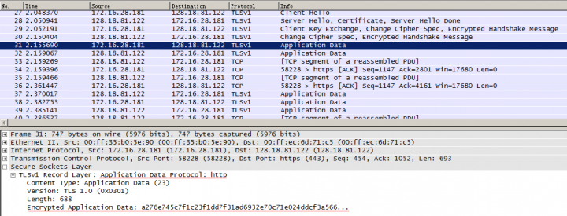

对于加密后的信息，NGFW无法提取URL信息，也就无法进行URL过滤处理。那么针对HTTPS协议，如何也能实现URL过滤功能呢？答案是解密，NGFW将HTTPS协议解密之后就可以提取其中的URL。

我们在第一季技术贴中介绍过SSL连接建立的过程以及证书认证的原理，这里就用到了这两方面的知识。简言之，NGFW通过替换证书来建立客户端与NGFW、NGFW与HTTPS服务器端的两个SSL连接，如下图所示。NGFW以“代理人”的身份坐镇其中，对客户端访问HTTPS服务器的报文进行解密。解密之后就可以提取URL信息，进行URL过滤处理，允许通过的报文会加密后发送至HTTPS服务器。

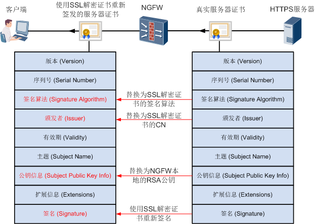

NGFW通过SSL解密策略来实现对HTTPS协议的加密和解密，关于SSL解密策略的配置方法请参考产品手册。需要注意的是，加密和解密过程比较消耗性能，而且对于需要双向认证的HTTPS协议，如网上银行，NGFW是不支持进行SSL解密的。