## 用户与认证基础

内控的主要手段就是对企业内部员工进行权限控制和行为审计，杜绝非法操作。由于IP地址动态变化，传统防火墙以IP地址作为管控对象已经无法满足精细化管控的需求，根据用户帐号管控才是王道。华为NGFW支持通过多种认证方式获取用户信息，并基于用户配置安全策略、审计策略等安全功能，基本过程如下：

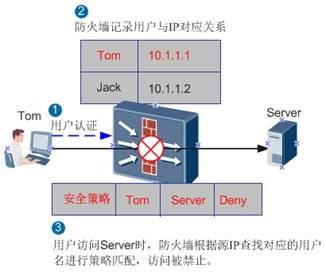

从上图可以看出实施基于用户的管控, 有两个关键因素:
1. 在 NGFW 上部署认证功能, 将流量的源IP识别为用户. 当用户地址变化时, 更新IP地址和用户的对应关系.
2. 在各类策略中引用用户, 这就要求NGFW上需要有一套用户组织结构, 方便企业管理员分级, 分层对用户行为进行监控和管理.


为了让大家先有个直观的认识，首先来介绍一下NGFW上的用户组织结构。

### 用户组织结构
NGFW中的用户组织结构是实际企业中组织结构的映射，是基于用户进行权限管控的基础。用户组织结构分为按部门进行组织的树形维度、按跨部门群组进行组织的横向维度。

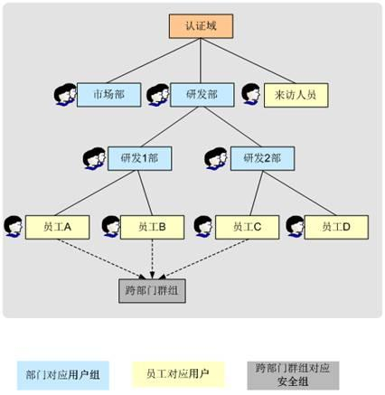

用户组织结构中涉及如下三个概念：

#### 认证域
树形组织结构的树根，就是大家已经很熟悉的AAA中的domain。NGFW缺省存在default认证域，可以根据需求新建认证域。

每个认证域是一个独立的树形组织结构，类似于AD/LDAP等认证服务器上的域结构。各认证域的用户账号独立，不同认证域的账号允许重名。

#### 用户组/用户
认证域的下级就是用户组、用户，可以理解为企业的部门、员工。这里的用户与大家熟悉的其他数通产品AAA的local-user是不同的，local-user是扁平结构的，NGFW的用户组织结构是树形的，方便分级控制，而且用户的属性更丰富。

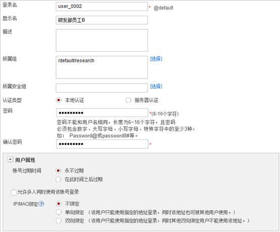

#### 安全组
对应横向组织结构的跨部门群组。当需要基于部门以外的维度对用户进行管理可以创建跨部门的安全组。

另外当企业通过第三方认证服务器存储组织结构时，服务器上也存在类似的横向群组，为了基于这些群组配置策略，NGFW上也需要创建安全组与服务器上的组织结构保持一致。

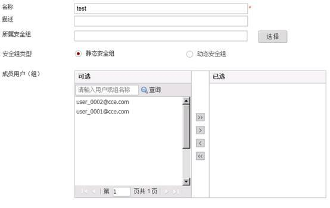

NGFW如此划分组织结构，一方面是与企业实际组织结构对应，另一方面是为了与认证服务器对应，以便更好地支撑服务器认证。当企业部署了认证服务器时，需要将服务器上的组织结构导入NGFW才能基于用户配置各类策略。

例如AD服务器上的组织单元对应NGFW的用户组，安全组对应NGFW的静态安全组。

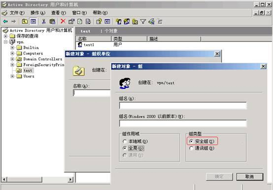

再例如Sun ONE LDAP服务器中，组织单元对应NGFW的用户组，静态组对应NGFW的静态安全组，动态安全组对应NGFW的动态安全组。

静态安全组组好理解，就是在安全组中加入固定的用户成员；动态安全组定义了一个过滤条件，所有匹配条件的用户都是该组的成员。所以称之为动态组，是因为每次读取其组员名单时，要动态计算过滤条件。下图中就显示了Sun ONE LDAP服务器动态组的过滤条件，用户ID包含“user”的用户都属于该动态组。过滤条件由一些属性过滤语句组成，LDAP服务器上每个条目都有很多属性及其属性值，后续讲服务器认证时还将会详细介绍。

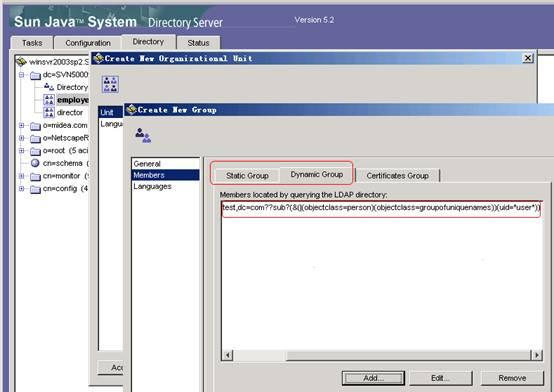

所有用户/用户组/安全组信息都保存在设备内部数据库中，不体现在配置文件中。

### 认证类型
认证的主要目的是将IP识别为用户，NGFW既支持直接对用户认证，也支持从已经部署好的认证系统中同步用户上线信息（单点登录SSO）。

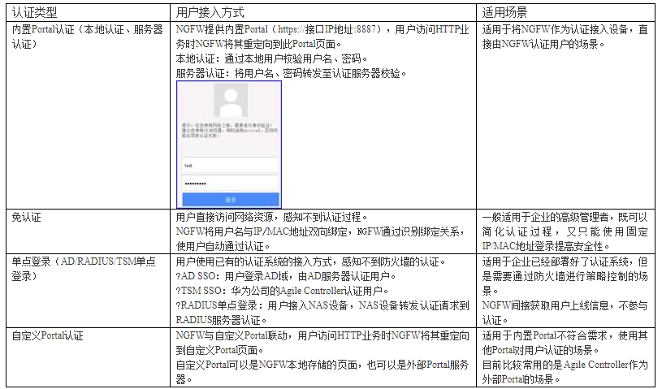

以上认证方式的实现过程可以简单用一张图概括：

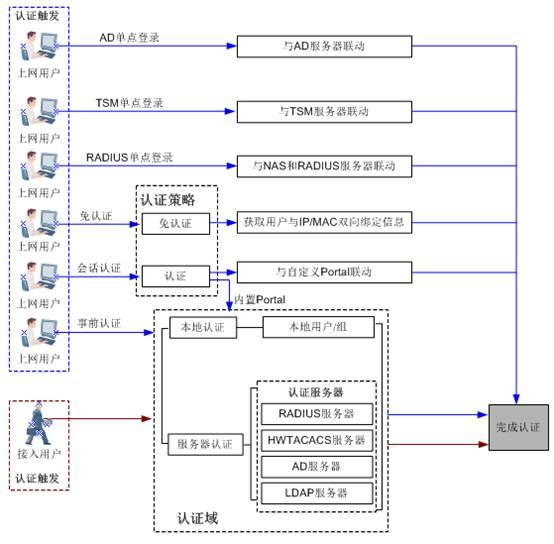

说明：

上图中出现了几个概念，这里先简单解释下，强叔后续在详细介绍各种认证方式时都会详解，莫急～

**会话认证、事前认证**：NGFW只支持对HTTP流量重定向，例如用户访问http://www.baidu.com时NGFW向用户推送Portal页面，用户通过认证后才能继续访问，这种认证叫会话认证。对于FTP等非HTTP流量NGFW不支持重定向，此时用户需要事先访问Portal页面进行认证，然后才能访问业务，这种认证叫事前认证。

**上网用户、接入用户**：用户的组织结构及创建方式都是一样的，只是按业务类型将用户划分成两类，上网用户指的是企业内部网络中访问网络资源的用户，用户访问网络资源时NGFW对其进行认证；接入用户指的是通过VPN接入NGFW的用户，接入过程中NGFW对其进行认证。

接入用户VPN接入成功后，下一步就是访问网络资源，此时又相当于上网用户，这之间有着剪不断理还乱的关系，强叔在讲完上网用户的各类认证方式后会专门开一篇介绍。

#### 认证策略
讲到这里有的人可能要问了，VPN认证我们都熟悉，协议实现中已经定义好了哪个环节对用户进行认证，用户在客户端侧必须先认证才能接入VPN。但是这个上网认证，NGFW是怎么控制要对哪些流量进行认证的呢？认证策略闪亮登场！

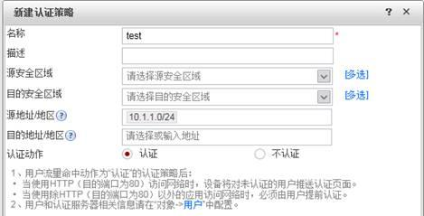

认证策略是用户认证、基于用户的策略管控的入口条件：
- 匹配认证策略的流量必须经过NGFW的身份认证才能通过NGFW。当用户访问HTTP业务时NGFW会向用户推送Portal页面要求进行认证；当用户访问非HTTP业务时，用户需要主动访问Portal页面进行认证。认证后NGFW记录源IP与用户名的对应关。
- 用户流量必须匹配认证策略，基于用户的策略配置才生效。

NGFW存在一条缺省的认证策略default，动作为不认证。当需要进行身份认证时，按需配置动作为认证的认证策略。

为了避免用户误配置认证策略，NGFW还贴心地直接将一些不需要受认证策略控制的流量直接Bypass，以下流量即使匹配了认证策略也不会要求进行认证：

- 访问设备本身或设备本身发起的流量

- DHCP、BGP、OSPF、LDP报文

- 触发认证的第一条HTTP业务数据流对应的DNS报文不受认证策略控制，用户认证通过上线后的DNS报文受认证策略控制。

在内部实现上，认证策略的处理位于安全策略之前获取用户信息，否则安全策略中的用户匹配条件就无法匹配了。所以当发现流量无法通过防火墙时，除了检查安全策略还要检查是否误配置了认证策略。

下边我们看一个小例子：

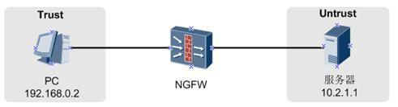

缺省包过滤已经放开，但是PC却无法访问服务器，查看流量统计发现UM_FIRST_PROCCESS_FAIL模块存在丢包，UM模块就是用户管理模块，据此可以判定流量被认证策略丢包。
```bash
[FW-diagnose] display firewall statistic acl source-ip 192.168.0.2
Current Show sessions count: 1
Protocol(ICMP) SourceIp(192.168.0.2) DestinationIp(10.2.1.1)
SourcePort(1) DestinationPort(2048) VpnIndex(public)
                 RcvnFrag RcvFrag     Forward     DisnFrag    DisFrag 
 Obverse(pkts) : 4           0           0           4           0  
 Reverse(pkts) : 0           0           0           0           0  
 Discard detail information:
  UM_FIRST_PROCCESS_FAIL:     4
```
查看认证策略的配置，发现配置了源IP是192.168.0.2的流量需要进行认证才能通过NGFW。如果确认该流量不需要认证，删除认证策略即可。


上述例子中的问题，对非HTTP流量尤为明显，因为此时NGFW不会向用户推送Portal页面，管理员往往很难想到是认证策略的问题。还是那句话，一旦配置了认证策略，匹配认证策略的流量必须通过会话或事前认证的方式进行身份认证。

#### 在线用户
用户访问网络资源前，首先需要经过NGFW的认证，目的是识别这个用户当前在使用哪个IP地址。对于通过认证的用户，NGFW还会检查用户的属性（用户状态、账号过期时间、IP/MAC地址绑定、是否允许多人同时使用该账号登录），只有认证和用户属性检查都通过的用户，该用户才能上线，称为在线用户。

NGFW上的在线用户表记录了用户和该用户当前所使用的地址的对应关系，对用户实施策略，也就是对该用户对应的IP地址实施策略

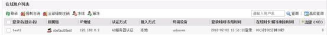

用户上线后，如果在线用户表项超时时间内（缺省30分钟）没有发起业务流量，则该用户对应的在线用户表项将被删除。当该用户下次再发起业务访问时，需要重新进行认证。

##  内置Portal认证
内置Portal认证适用于将NGFW作为认证接入设备，直接由NGFW认证用户的场景。根据认证触发过程不同将内置Portal认证分为会话认证和事前认证两类。

- **会话认证**：当用户访问HTTP（80端口）的网页时，流量匹配认证策略，NGFW将HTTP业务重定向至内置Portal页面，用户通过认证后才能继续访问网页。

- **事前认证**：当用户访问FTP等非HTTP业务时，用户只能事先访问内置Portal页面进行认证，通过认证后再访问业务。

内置Portal页面的缺省地址是https://接口IP地址:8887，管理员可以修改。

本篇主要以下图为例讲解比较常用的会话认证过程：

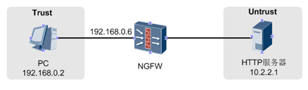

1. 配置认证策略，控制流量必须通过认证才能经过NGFW

    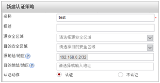

2. 配置本地用户

    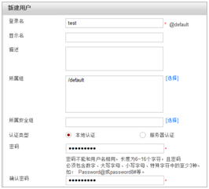

    对应脚本如下:
    ```bash
    auth-policy
    ?rule name test
    ? source-address 192.168.0.2 32
    ? action auth
    user-manage user test
    password *********
    ```

3. 用户通过浏览器访问`http://10.2.2.1/test.html`时，被重定向至Portal页面要求进行认证。

    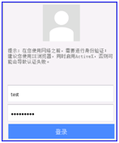


4. 用户输入用户名、密码后，用户在NGFW上线，用户可以正常上网。

    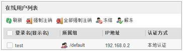

    认证前后抓包对比，可以看到认证前用户访问网页时被重定向至https://192.168.0.6:8887。

    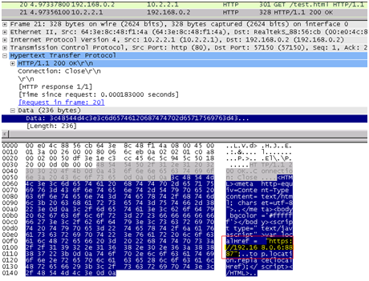

    用户通过认证后，用户访问网页成功。

    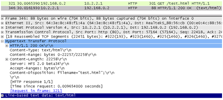

    另外，用户认证成功后缺省显示如下页面，用户需要重新输入需要访问的网页地址。可以通过user-manage redirect [ url url ]命令配置认证后跳转的页面，不指定url代表跳转到认证前访问的网页。

    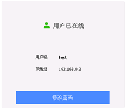

    配置内置Portal认证时，安全策略的配置也很关键，下表给出了与内置Portal认证有关的安全策略。第一条是允许用户访问NGFW内置Portal页面的安全策略；第二条是允许用户上网时解析域名的DNS报文通过NGFW的安全策略，因为解析域名后才能发起HTTP连接，进而触发重定向认证。NGFW对触发认证的第一条HTTP连接对应的DNS报文不进行认证，直接透传。

    | 源设备 | 源IP地址 | 源端口 | 目的设备  | 目的IP地址  | 目的端口 | 协议 |
    | ------ | -------- | ------ | --------- | ----------- | -------- | ---- |
    | 用户   | Any      | Any    | NGFW      | 192.168.0.6 | 8887     | TCP  |
    | 用户   | Any      | Any    | DNS服务器 | Any         | 53       | DNS  |

#### 本地认证和服务器认证
以上讲了内置Portal认证的基本过程，根据NGFW校验用户名、密码的方式内置Portal认证又可分为本地认证和服务器认证：
- 本地认证：通过本地用户校验用户名、密码。
- 服务器认证：将用户名、密码转发至认证服务器校验。NGFW支持RADIUS、HWTACACS、LDAP、AD和SecurID服务器认证。

NGFW根据用户名中携带的“@”后的字符串将用户“分流”到对应的认证域中，根**据认证域中配置的认证方式对用户进行本地或服务器认证**。如果用户名中没有携带“@”，则属于缺省的default认证域。

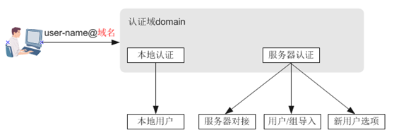

上一节的内置Portal认证就是以本地认证为例讲解的，比较简单，只需配置本地用户即可。

以下重点围绕服务器对接、用户/组导入、新用户选项三个概念介绍服务器认证。
##### 【认证服务器对接】
服务器认证的重点是NGFW与认证服务器的对接，对接成功后认证服务器才能接收NGFW转发的用户名、密码。

本文以比较常用的微软的AD服务器为例讲解对接过程，LDAP服务器其实与AD服务器类似，都是以目录的形式存储用户信息。

让我们先看下AD服务器长什么样？AD服务器是以域名为顶级节点的树形目录结构，域名下级有组织单位（部门）和用户。

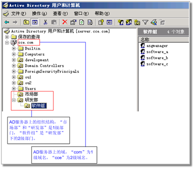

但是一看NGFW上AD服务器对接参数就有点傻眼了，各种字段怎么与AD服务器对应啊？

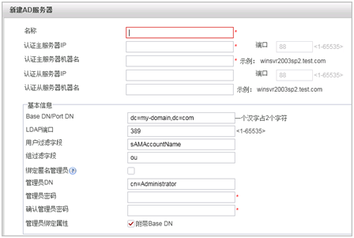

这就需要借助AD/LDAP服务器查看工具，一探究竟目录树的内部结构。使用微软的AD Explorer工具连接到AD服务器上可以看到AD服务器的每一个条目都是由一些列属性、对应的属性值组成的。常用的属性如下表所示：

| 属性                           | 说明                                                                                                                                     |
| ------------------------------ | ---------------------------------------------------------------------------------------------------------------------------------------- |
| DC(域控制器)                   | 代表域名,可以分多级                                                                                                                      |
| OU(组织单位)                   | 相当于分级组织的部门                                                                                                                     |
| CN(通用名称)                   | 除域, 组织单位以外的对象名称, 例如组名称, 用户名称等                                                                                     |
| Distinguished Name(DN, 区别名) | 唯一标识某个节点在目录树上的位置，相当于从第一级域名到该节点所在位置的路径。 例如下图中组织单位employee的DN为OU=employee,DC=cce,DC=com。 |
| sAMAccountName                 | 用户的登录名，也就是用户登录使用的帐号。NGFW将sAMAccountName作为用户过滤字段，取sAMAccountName的取值作为NGFW上的用户登录名。             |

借助AD Explorer可以非常方便地完成AD服务器对接配置

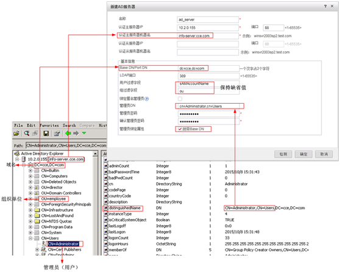

以上介绍了AD服务器对接过程。NGFW与其他LDAP服务器对接的常用属性如下，不具体展开介绍了。
| 项目                 | Sun ONE LDAP属性 | Open LDAP属性 |
| -------------------- | ---------------- | ------------- |
| 域名                 | DC               | DC            |
| 组织单位(组过滤字段) | OU               | OU            |
| 区别名(DN)           | DN               | DN            |
| 用户ID(用户过滤字段) | UID              | CN            |

##### 【用户/组导入】
不是认证服务器校验用户名、密码吗？为啥还要将服务器的用户导入到NGFW呢？这是因为NGFW需要在策略中引用用户或用户组进行权限控制。将认证服务器上的组织结构导入NGFW，用户在NGFW上对应的用户所属组上线，享有用户或用户组的权限。

NGFW支持从AD服务器、Sun ONE LDAP服务器、Open LDAP服务器和TSM服务器（即华为公司的Agile Controller）导入用户。其他类型服务器的用户只能通过CSV文件导入。

从服务器导入用户/组需要配置服务器导入策略：

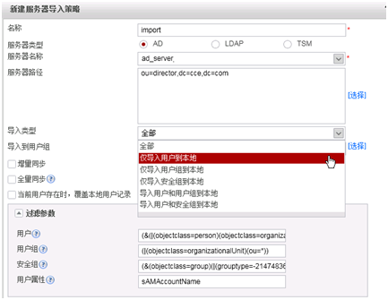

上图中的参数都比较好理解，解释几个重点参数：

- **导入类型**：根据权限控制方式可选择不同导入类型，例如需要同时基于用户组（部门）和用户配置策略，则选择“导入用户和用户组到本地”；仅通过用户所属用户组（部门）配置策略，则选择“仅导入用户组到本地”。

- **导入到用户组**：指的是将服务器上用户导入到NGFW的位置。对于AD/LDAP服务器导入，该组只能是与服务器上用户域名同名的认证域或default认证域下的组。对于TSM（Controller）导入只能是default认证域下的组。

    什么叫“与服务器上用户域名同名的认证域”呢？，例如AD服务器的域名是DC=cce,DC=com，那么NGFW上与其同名的认证域就是 cce.com。

- **过滤参数**：用于从AD/LDAP服务器过滤需要导入到NGFW的信息，在执行导入操作时，服务器会根据该过滤条件搜索满足条件的用户/用户组/安全组信息，发送给NGFW。


**一般情况下，NGFW为各种服务器预置的过滤参数已经可以满足需要。如果管理员非常了解AD/LDAP服务器的过滤语法，可以根据需要修改。**

过滤参数是由一系列属性以及运算符组成的过滤语句，ou、cn已经介绍过分别代表服务器上的组织单位、用户名称，现在介绍一下新出现的objectClass、groupType。

在AD/LDAP服务器中，一个条目必须包含一个objectClass属性，且至少需要赋予一个值。每个值都相当于一个数据存储的模板，类似于软件中的Class，模板中规定了属于这个objectClass的条目的必选属性和可选的属性。


例如，AD服务器上的用户的objectClass包含top、person、organizationalPerson、user。
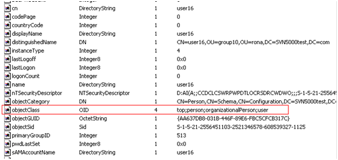

通过在过滤参数中指定objectClass，确定了NGFW在AD服务器的搜索范围。

看完了objectClass再来看groupType，在上一篇“用户与认证基础”中，介绍过NGFW的安全组对应AD服务器的安全组、LDAP服务器的静态组/动态组。其中AD服务器的安全组分为本地域安全组、全局安全组和通用安全组，每个安全组使用groupType属性标识组类型。下图的group3的组类型是本地域安全组。

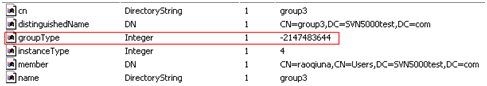

除属性外，过滤参数中还有=（等于）、>=（大于等于）、<=（小于等于）、*（通配符）、&（与）、|（或）、!（非）等运算符。

现在我们再回过头来看AD服务器的4个缺省过滤参数的含义：
| 属性     | 说明                                                                                                                                                                                             |
| -------- | ------------------------------------------------------------------------------------------------------------------------------------------------------------------------------------------------ |
| 用户     | `(&(|(objectclass=person)(objectclass=organizationalPerson))(cn=*)(!(objectclass=computer)))`搜索objectClass包含person或organizationalPerson但不包含computer，且cn属性有值的条目作为NGFW的用户。 |
| 用户组   | `(|(objectclass=organizationalUnit)(ou=*))` 搜索objectClass为organizationalUnit或ou属性有值的条目作为NGFW的用户组。                                                                              |
| 安全组   | `(&(objectclass=group)(|(grouptype=-2147483640)(grouptype=-2147483644)(grouptype=-2147483646)))` 搜索本地域安全组、全局安全组和通用安全组作为NGFW中的安全组。                                    |
| 用户属性 | `(&(objectclass=group)(|(grouptype=-2147483640)(grouptype=-2147483644)(grouptype=-2147483646)))` 搜索本地域安全组、全局安全组和通用安全组作为NGFW中的安全组。                                    |

前边已经提到，确实有定制需求时才会修改上述的过滤参数，例如查询AD服务器上所有**姓张且邮件地址中包含163的用户**，用户的过滤语句为：(&(sn=张*)(mail=163*))

##### [新用户选项]
新用户指的是通过了认证服务器的认证，但是在NGFW不存的用户。之所以提出这个概念，还是因为用户需要在NGFW的某个用户组上线，然后享有这个组的权限。因此当用户不在本地时，需要通过认证域下的新用户选项功能指定其所属组。

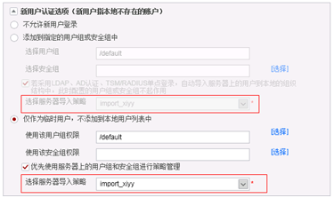

从上图可以看到，分为不允许新用户登录、将用户加入本地、作为临时用户上线三个选项，都比较好理解。只解释一下“选择服务器导入策略”这个参数
- 当选择"添加到指定的用户组或安全组中"时, 如果配置"选择服务器导入策略", 则通过服务器导入策略自动将用户及其组织结构导入到NGFW
    
    此种方式的应用场景是已经将服务器上整个组织结构导入到NGFW, 有基于具体用户控制权限的需求。当发现有新用户时，自动导入用户
- 当选择“仅作为临时用户，不添加到本地用户列表中”时，如果配置“选择服务器导入策略”，则用户在NGFW上与服务器对应的所属组上线。

    此种方式的应用场景是仅将服务器上的组织单位或安全组导入到NGFW，基于用户所属组控制权限。所有通过认证的用户对于NGFW来说都是新用户，通过选择导入策略使新用户在与服务器对应的所属组上线，使用该组权限。

光说不练假把式，下边给出两个配置示例。
#### 示例一: AD服务器认证

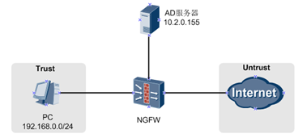

用户访问Internet时必须经过NGFW认证，NGFW转发认证请求至AD服务器认证。
1. 配置认证策略，控制用户访问Internet需要认证。

    

2.  配置AD服务器对接

    

    配置完成后，单击检测可以使用AD服务器上存在的用户名、密码检测AD服务器连通性。

3. 创建认证域，只能使用default认证域或与服务器同名的认证域。这里以服务器同名认证域cce.com为例。

    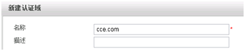

4. 配置导入策略。

    只将用户组导入用户，基于用户组控制用户权限。
    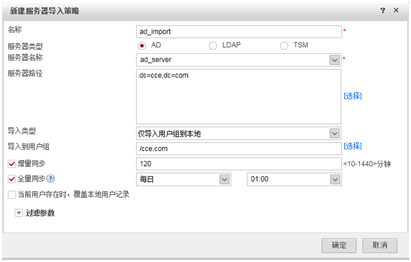

5. 配置认证域的认证服务器, 新用户选项

    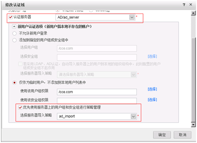

    以上配置对应脚本如下：
    ```bash
    ad-server template ad_server???????????

    ?ad-server authentication 10.2.0.155 88??????

    ?ad-server authentication base-dn dc=cce,dc=com

    ?ad-server authentication manager cn=administrator,cn=users Admin@123

    ?ad-server authentication host-name info-server.cce.com

    ?ad-server authentication ldap-port 389??????

    ?ad-server user-filter sAMAccountName????????

    ?ad-server group-filter ou?

    #

    auth-policy

    ?rule name test

    ? source-zone trust

    ? destination-zone ?untrust

    ? source-address 192.168.0.0 24

    ? action auth

    #?

    user-manage import-policy ad_import from ad

    ?server template ad_server

    ?server basedn dc=cce,dc=com

    server searchdn dc=cce,dc=com

    ?destination-group /cce.com

    ?user-attribute sAMAccountName

    ?user-filter (&(|(objectclass=person)(objectclass=organizationalPerson))(cn=*)(!(objectclass=computer)))

    ?group-filter (|(objectclass=organizationalUnit)(ou=*))

    ?import-type group?????????

    ?sync-mode incremental schedule interval 120

    sync-mode full schedule daily 01:00

    #

    aaa

    authentication-scheme ad

    ??authentication-mode ad

    #

    ?domain cce.com

    authentication-scheme ad

    ? ad-server ad_server

    ? service-type internetaccess

    ? new-user add-temporary group /cce.com auto-import ad_import

    ?
    ```
    完成上述配置后，用户访问Internet时将被NGFW重定向至Portal页面，**用户输入用户名@cce.com、密码进行认证**

    上述步骤省略了允许NGFW访问AD服务器、允许用户访问Portal页面、允许上网时解析域名的DNS报文通过NGFW的安全策略配置，实际使用注意配置。

#### 示例二：Sun ONE LDAP服务器认证、动态安全组控制权限
NGFW通过Sun ONE LDAP服务器对用户进行认证，并且基于Sun ONE LDAP服务器中的动态组控制用户权限，符合安全组过滤条件的用户的权限相同。

这里以如下动态组举例，用户ID包含“user”的用户都属于test组。

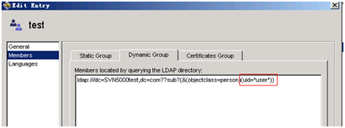

在Sun ONE LDAP上创建动态组的步骤比较简单，动态组的过滤条件是由用户属性组成的语句，具体步骤可以查阅Sun ONE LDAP对应的文档。

NGFW配置如下:
1. 配置认证策略, 控制用户访问Internet 需要认证


    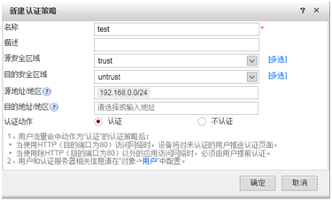

2. 配置LDAP服务器对接

    通过LDAP Browser软件连接到Sun ONE LDAP服务器可以清晰地看到服务器的属性

    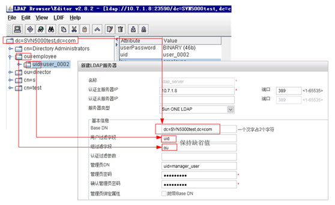

3. 配置导入策略将安全组导入NGFW。

    

     **注意使用动态安全组功能时，服务器导入类型不能包含用户，用户只能作为临时用户动态地在其所属动态安全组上线。**

    导入到本地的动态安全组如下图所示，有的防火墙版本不支持导入服务器中的过滤条件，此时就要手动配置过滤条件了。

    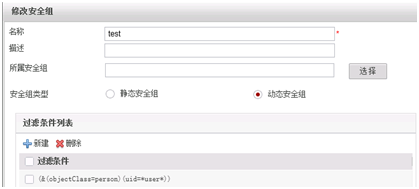

4. 配置认证域地认证服务器, 新用户选项

    只能使用 default认证域或与服务器同名地认证域, 这里以 default 认证域为例

    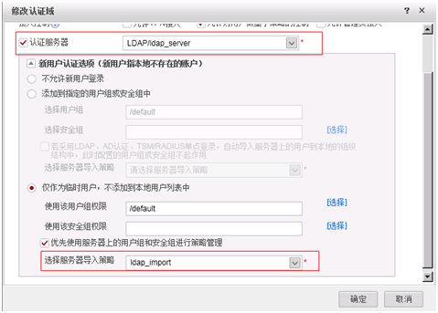

    **使用动态安全组功能时，新用户选项必须配置为临时用户，并指定服务器导入策略。即使NGFW上的动态安全组是手动创建的也必须指定导入策略，导入策略的导入的类型可以随意配置。**

    以上配置对应脚本如下：
    ```bash
    ldap-server template ldap_server
    ?ldap-server authentication 10.7.1.8 389???????????
    ?ldap-server authentication base-dn dc=svn5000test,dc=com?????????
    ?ldap-server authentication manager uid=manager_user Admin@123
    ?ldap-server group-filter ou
    ?ldap-server user-filter uid
    ?ldap-server server-type sun-one
    undo ldap-server authentication manager-with-base-dn enable
    #
    auth-policy
    ?rule name test
    ? source-zone trust
    ? destination-zone ?untrust
    ? source-address 192.168.0.0 24
    ? action auth
    #?
    user-manage import-policy ldap_import from ldap
    ?server template ldap_server
    ?server basedn dc=svn5000test,dc=com
    server searchdn dc=svn5000test,dc=com
    user-attribute uid
    ?user-filter (&(|(objectclass=person)(objectclass=organizationalPerson))(uid=*))
    ?group-filter (|(objectclass=organizationalUnit)(ou=*))
    (|(objectclass=organizationalUnit)(ou=*))
    security-group-filter (&(objectclass=groupofuniquenames)(!(memberURL=*)))
    ?import-type security-group?????????
    ?sync-mode incremental schedule interval 120
    sync-mode full schedule daily 01:00
    #
    aaa
    authentication-scheme ldap
    ??authentication-mode ldap
    #
    ?domain default
    authentication-scheme ldap
    ? ldap-server ldap_server
    ? service-type internetaccess
    ? new-user add-temporary group /cce.com auto-import ldap_import
    ```

完成上述配置后，用户在test安全组上线。

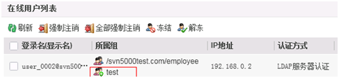

内部的处理过程：用户认证时NGFW依次将用户ID与每个动态安全组的过滤条件拼装成过滤器，然后根据过滤器到认证域对应的LDAP服务器上查找是否存在该用户，如果存在，则用户属于这个动态安全组。

抓包可以清楚地看到NGFW将uid=user_0002与动态安全组的过滤条件拼接成过滤器，然后向LDAP服务器发起查询操作，LDAP服务器返回查询结果。

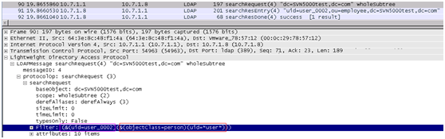

除了Sun ONE LDAP服务器，NGFW还支持向AD服务器查询是用户是否属于动态安全组，区别在于AD服务器上不支持动态安全组这个对象，因此只能在NGFW上手动创建而不支持导入。


## 外部Portal认证
上一回说到了NGFW通过 “https://接口IP地址:8887” 提供了内置Portal认证页面，然后NGFW通过本地认证、服务器认证方式认证用户。有的同学可能问了，那NGFW支持与外部Portal服务器联动吗？No problem， NGFW支持自定义Portal页面地址，这个地址可以是本地页面地址，也可以是外部Portal服务器地址。当然使用外部Portal服务器的前提是，NGFW可以与Portal服务器正常联动、进行过配套开发，目前最常用的Portal服务器就是华为公司的Agile Controller。

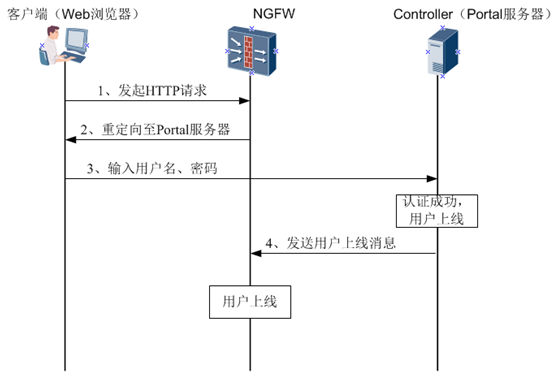

NGFW主要起到将用户业务访问重定向到Controller 的作用，具体认证过程在Controller完成，NGFW被动获取用户上线消息。用户上线后，NGFW可以对用户进行策略控制。

用户下线也同理，Controller通知NGFW用户下线。


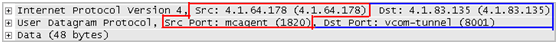

Controller通过Portal服务器的1820端口向NGFW的8001端口发送用户上下线消息，传输协议是UDP，数据通过AES128或3DES算法加密。

>说明: 熟悉华为交换机、AC等设备的同学可能已经发现了，NGFW的外部Portal认证过程与这些设备的认证过程不同，更简单一些。对于交换机或AC，Portal服务器转发认证请求至交换机或AC，然后由交换机或AC向Controller的RADIUS服务器组件发起RADIUS认证请求，而防火墙没有这个过程，认证直接由Controller完成

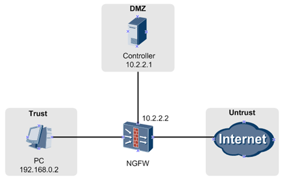

1. 重定向至Protal服务器

   1. 创建Portal认证模板，配置Portal认证页面地址为Controller服务器的Portal页面地址。
        ```bash
        user-manage portal-template controller
        ? portal-url http://10.2.2.1:8080/portal
        ```
    2. 配置认证策略，引用Portal认证模板。用户访问HTTP业务时将被NGFW重定向至Controller服务器的Portal页面。
        ```bash
        auth-policy
        rule name test
        ? source-address 192.168.0.2 32
        ? action auth portal-template controller
        ```
    3. 配置安全策略, 具体命令略
        | 源IP地址    | 源端口 | 目的IP地址 | 目的端口                           | 协议 | 作用                                        |
        | ----------- | ------ | ---------- | ---------------------------------- | ---- | ------------------------------------------- |
        | 192.168.0.2 | Any    | 10.2.2.1   | 8080和8445(访问8080后自动跳转8445) | TCP  | 允许用户访问ControllerPortal页面            |
        | 192.168.0.2 | Any    | Any        | 53                                 | DNS  | 允许解析域名地DNS报文则用户无法发起HTTP连接 |

2. Controller将用户上线消息发送给NGFW

    1. 在Controller上添加NGFW作为上网行为管理设备

        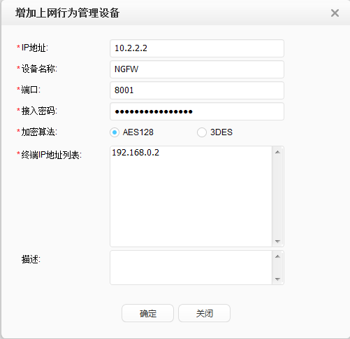

        8001端口是NGFW接收用户上线消息的缺省端口。
    2. 在NGFW上添加Controller（TSM服务器）。
    
        ```bash
        tsm-server template controller
        tsm-server ip-address 10.2.2.1
        tsm-server port 8084
        tsm-server encryption-mode aes128 shared-key Admin@123456432
        ```
        加密模式及密钥必须与Controller上配置保持一致

        其中, 8084端口用户NGFW导入Controller的用户数据时, Controller接收导入请求的端口
    3. 在NGFW上配置单点登录参数, 以接收Controller的用户上线消息。
        ```bash
        user-manage single-sign-on tsm port 8001（缺省就是UDP 8001端口）
        user-manage single-sign-on tsm enable
        ```
        如果修改NGFW的端口，注意Controller上同步修改上网行为管理设备的端口。
    4. 配置安全策略, 具体命令略

        | 源IP地址 | 源端口 | 目的IP地址 | 目的端口 | 协议 | 作用                                   |
        | -------- | ------ | ---------- | -------- | ---- | -------------------------------------- |
        | 10.2.2.1 | Any    | 10.2.2.2   | 8001     | UDP  | 允许Controller向NGFW发送用户上线消息。 |

3. 将Controller的部门信息导入NGFW, 以进行权限控制

    1. 配置导入策略, 这里假设将Controller的部门guest导入NGFW

        ```bash
        user-manage import-policy controller_import from tsm
        ?server template controller
        ?server basedn root\guest
        destination-group /default
        import-type group?????????
        ?time-interval 120
        ```
        这里import-type 设置为 group, 也就是只导入 Controller上的部门信息. 另外注意NGFW只支持将Controller的用户导入到default域
    2. 配置安全策略, 具体命令略
    
        | 源IP地址 | 源端口 | 目的IP地址 | 目的端口 | 协议 | 作用                               |
        | -------- | ------ | ---------- | -------- | ---- | ---------------------------------- |
        | 10.2.2.2 | Any    | 10.2.2.1   | 8084     | TCP  | 允许NGFW连接Controller导入用户组。 |
    3. 手动执行导入策略, 然后执行 display命令查看到部门guest已经导入NGFW
        
        ```bash
        execute user-manage import-policy controller_import

        display user-manage group

        Group Name??? ???????Vsys

        ---------------------------------------------

        /default/guest???? ?root
        ```
    4. 配置default认证域的新用户选项
        
        上一步中只导入了用户组，用户并不在NGFW上存储，因此每个上线用户对于NGFW来说都是新用户。配置新用户时选择“仅作为临时用户，不添加到本地用户列表中”，并指定导入策略，使用户在NGFW上与Controller对应的所属组上线。这样后续在NGFW上基于用户组配置安全策略控制用户权限。
        ```bash
        aaa
        domain default??
        ??service-type internet-access
        ??new-user add-temporary group /default auto-import controller_import
        ```

        配置完成后，用户上网时将被重定向至Controller的Portal页面。

        

        用户输入密码后用户在NGFW的guest用户组同步上线。

        ```bash
        <NGFW> display user-manage online-user verbose???????????????????????????????

        Current Total Number: 1???????????????????????????????????????????????????????

        -----------------------------------------------------------------

        ?IP Address: 192.168.0.2?????????????????????????????????????????????????????????

        ?Login Time: 2016-05-18 11:19? Online Time: 00:01:27????????????????????????

        ?State: Active? TTL: 00:30:00? Left Time: 00:28:33?????????????????????????????

        ?Access Type: local????????????????????????????????????????????????????????????

        ?Authentication Mode: Single Sign-on???????????????????????????????????????????

        ?Access Device Type: unknown???????????????????????????????????????????????????

        ?<--packets: 0 bytes: 0 ?-->packets: 0 bytes: 0????????????????????????????????

        User Name: test-account? Parent User Group: /default/guest?????????????????

        -----------------------------------------------------------------
        ```
        用户在NGFW上线后如果在用户老化时间范围内（缺省30分钟）没有流量，NGFW将使用户下线，因此需要执行**user-manage online-user aging-time**命令将老化时间设置的长一些，避免用户在Controller下线前就在NGFW先下线了。

#### 认证成功后显示的页面：
这是由Controller上的配置决定的，可以配置为三种方式：
- 不跳转: 停留在用户认证成功提示页面
- 跳转到指定地址: 输入固定的URL地址
- 继续访问原页面: 继续访问重定向认证前访问的页面

其中最后一种需要NGFW将用户访问的原始页面地址传递给Controller, 过程如下:
1. 用户向网站发起HTTP GET请求
2. NGFW拦截此请求, 在响应消息中向客户端发送一个HTML实体, 实体中包含Controller的Portal认证页面地址, 以及其他参数. 如下图所示红框中的url字段就是用户访问的原始页面地址

    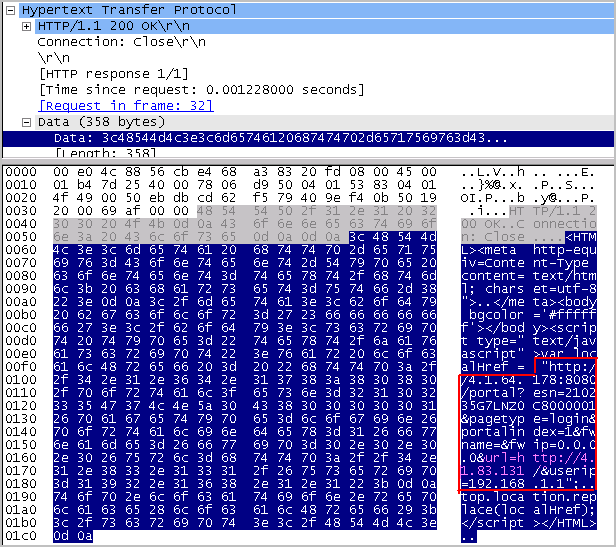

3. 用户访问Portal认证页面，地址就是红框中的地址。
4. Controller从url字段中提取用户认证前访问的页面，用户认证成功后继续访问这个页面，简化用户操作。

##### HTTPS支持重定向吗？

缺省情况下，NGFW只对80端口的HTTP访问进行重定向认证，不对HTTPS访问进行重定向认证，即不认证就可以访问HTTPS（443端口）业务。可以通过如下命令在Portal认证模板中启用对HTTPS访问的重定向。
```bash
user-manage portal-template test

https enable
```
需要说明的是该命令仅在自定义Portal认证模板中生效，对于内置Portal认证，所有匹配认证策略的流量都必须经过认证才能通过NGFW。


外部Portal认证是NGFW很常用的功能，商业Wi-Fi中用户连接Wi-Fi时向用户推送各类Portal也属于Portal认证的范畴，NGFW在其中的作用类似，只是触发重定向的用户操作可能不同。

## 单点登录
首先我们看下百度百科上对单点登录的解释：SSO英文全称Single Sign On，单点登录。SSO是在多个应用系统中，用户只需要登录一次就可以访问所有相互信任的应用系统。它包括可以将这次主要的登录映射到其他应用中，用于同一个用户登录的机制。它是目前比较流行的企业业务整合的解决方案之一。

通俗的说就是终端用户只登录一次就能访问不同的应用系统，各系统间怎么同步认证结果就是单点登录技术要实现的。

那NGFW的单点登录指的是什么呢？企业已经部署好了认证系统，比如AD域认证，现在引入了NGFW通过用户身份控制权限。NGFW自然要获取登录用户的身份信息才能基于用户控制权限，NGFW再通过Portal对用户再认证一次？当然不可接受。单点登录功能就是搞定这件事情的，NGFW通过单点登录功能获取已有部署系统的认证结果，使用户同时在NGFW上线。

说到这里一直给强叔捧场的同学可能已经发现了，上一篇“NGFW与Controller配合实现外部Portal认证”不就是单点登录吗？正解，用户认证都是在Controller完成的，NGFW只是被动获取认证结果。上一篇是单点登录与Portal重定向结合的应用，因为比较常用所以强叔单独设置一篇讲解了。本篇主要讲解AD单点登录和RADIUS单点登录，另外与Controller对接的TSM单点登录也会再稍微总结一下。

### AD单点登录
经常有同学问强叔，这个AD单点登录和AD服务器认证到底啥区别啊，不都是使用AD服务器吗？区别就是向AD服务器发起认证请求的对象不同：AD服务器认证是由NGFW发起，AD单点登录不是NGFW发起，NGFW只是被动侦听认证结果。

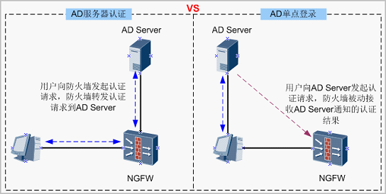

AD服务器认证在“第18篇 内置Portal认证”中已经介绍过了，用户在Portal输入用户名、密码后，NGFW将用户名、密码转发至AD服务器进行认证，如果忘记的同学可以查看。

下边正式开始介绍AD单点登录。

AD单点登录的关键技术就是用户在PC上登录或退出AD域时，NGFW如何获取用户上下线消息。

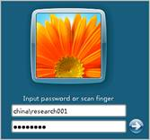

NGFW支持通过如下两种方式获取用户上下线消息：

- 插件方式

    - 在AD服务器或域内其他机器上安装插件, 当用户上下先时插件通知NGFW上下线消息
- 解析认证报文方式
    - NGFW获取用户与AD服务器之间的认证报文, 通过解析认证报文获取用户上线消息

#### 插件方式
如下图所示，通过在AD服务器的“组策略”中设置下发给PC的登录/注销脚本、在AD服务器或域内其他机器上安装AD单点登录插件，实现AD单点登录。

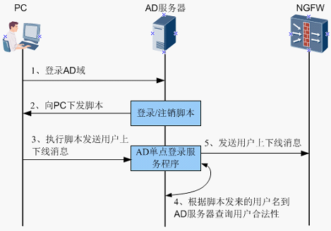

上图以在AD服务器上安装AD单点登录插件为例，如果AD单点登录插件安装在其他机器上，区别在于PC向另外一台机器上的AD单点登录服务程序发送用户上下线消息，然后由另外一台机器通知NGFW用户上下线消息。

登录注销脚本（ReportLogin.exe）、AD单点登录插件（ADSSO_Setup.exe）都可以从NGFW的Web界面下载，具体安装配置步骤可以查阅NGFW的产品文档。强叔这里只给出AD单点登录的关键对接步骤，帮助大家理解实现原理。


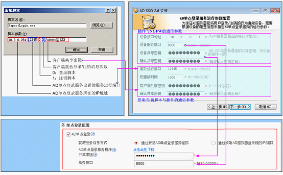

>说明: 如果有多台AD服务器主备或负载分担组网，需要在每台AD服务器都上安装插件和脚本。

安装配置完毕后，AD服务器（安装AD单点登录插件的机器）上的ADSSO服务自动启动 ，如果被停止则需要手工启动。

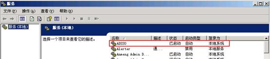

插件安装目录结构如下：
- log文件记录插件允许日志, 包括安装启动过程, 用户上下线记录等, 查看日志文件是定位问题的手段之一
- config.xml是插件的配置文件, 安装中设置的参数保持在该配置文件中. 可以通过此文件核对设置是否正确. 如果修改此文件需要重启 ADSSO 服务

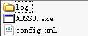

当用户通过AD域认证后，用户在NGFW同步上线。

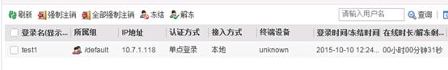

根据上边的描述可知AD单点登录涉及4个交互点，如果发生故障可以逐一排查：
1. 用户登录AD域时AD服务器是否正常向PC下发脚本

    AD服务器需要向用户PC正常下发脚本，PC才能向插件发送用户上下线消息。

    可以在PC的运行窗口执行rsop.msc，查看脚本是否正常下发。

    

    注意如果AD服务器安装了杀毒软件,也可能阻止脚本下发, 注意排查
2. PC是否正常向AD单点登录插件发送用户上下线信息
    PC向安装AD单点登录插件的机器的单点登录服务端口（安装时设置的服务运行端口）发送用户上下线消息，数据通过共享密钥加密。

    可以检查PC和安装插件的机器是否正常通信，服务端口是否被占用。

3. AD单点登录插件向AD服务器查询用户是否非法

    如果AD单点登录插件安装在非AD服务器上，请检查网络连通性。

    对于这个交互点，插件安装目录下的log文件是排障的重要依据，正常情况的日志如下：

    

    前两行日志代表AD登录插件可以正常连接AD服务器

    后边的日志是用户上下线的记录, AD单点登录插件从AD服务器获取用户的全路径, 并获取用户登录AD域的时间

    record time是AD服务器记录的用户登录AD域的时间，message是插件接收到PC发来的用户登录消息的时间。这两者的时间差如果超出安装插件时设置的“防重放时间”，则插件认为接收到的消息为恶意伪造的用户身份消息，不再将用户登录消息发给NGFW。此时日志打印“Fake logon detected,because logon time too far!”。 **因此一定要注意安装插件的机器与AD服务器之间的时间同步，如果没有特殊要求推荐将插件安装在AD服务器上。**

4. AD单点登录插件是否正常向NGFW发送用户上下线消息

    AD单点登录插件向NGFW的UDP 8000（缺省值）端口发送用户上下线消息，数据通过共享密钥加密。可以检查网络连通性、NGFW的安全策略配置等。

#### 免插件方式
免插件方式比较简单，就是用户登录AD域时，NGFW需要获取到AD服务器返回给用户的认证结果报文，如果认证成功则解析出其中的用户名与IP对应关系。如果认证报文不经过NGFW，则需要将流量镜像至NGFW，NGFW接收镜像流量的接口必须是独立的二层接口，不与其他业务混用。

免插件方式的AD单点登录配置如下，其中服务器IP地址/端口表示AD服务器的IP地址和认证端口，NGFW直接解析某些AD服务器的认证报文。


但是免插件方式只能获取到用户登录的消息，用户注销时没有数据，因此可能出现用户已经注销，但是NGFW上用户还未下线的情况。NGFW上的用户只能根据表项老化时间下线。

#### AD单点登录其他注意事项
除了在NGFW上配置AD单点登录参数，其他配置AD服务器、导入AD服务器用户、配置新用户选项等在内置Portal认证一篇中强叔已经介绍，这里不再赘述。强叔再交代如下两点:
1. AD单点登录优先在与服务器上用户域名同名的认证域上线，如果不存在则在default认证域上线。说到这里，大家知道用户应该导入哪个域了吧？

    什么叫“与服务器上用户域名同名的认证域”呢？例如AD服务器的域名是DC=cce,DC=com，那么NGFW上与其同名的认证域就是 cce.com。

2. 在线用户老化时间的设置大有讲究，如果设置过短将导致用户在NGFW下线，除非用户再次重新登录AD域才能再次上线。另外只有开机或注销后的用户登录会触发用户在NGFW上线，休眠后的登录并不能触发上线。

    因此，执行user-manage online-user aging-time命令设置在线用户老化时间需要大于用户的连续在线时长（包含休眠时间）。

### RADIUS单点登录
RADIUS单点登录指的是NGFW被动侦听已有RADIUS认证系统的认证结果


PC通过RADIUS客户端进行RADIUS服务器认证的交互过程如下，其中红色线的计费报文是NGFW解析的对象，以获取RADIUS单点登录用户上下线消息。


用户认证通过后RADIUS客户端向RADIUS服务器发送计费开始请求报文，NGFW从报文中读取用户名和用户IP地址，使用户在NGFW上线。


用户下线时RADIUS客户端向RADIUS服务器发送计费结束请求报文，用户同步在NGFW下线。


另外如果RADIUS客户端启用了实时计费功能，RADIUS客户端会定时向RADIUS服务器发送实时计费请求报文Accounting-Request(Interim-update)维持计费过程，NGFW获取计费更新报文后将刷新在线用户的剩余时间。

从上边的讲解可以看出，RADIUS客户端和服务器之间交互RADIUS计费报文是NGFW实现单点登录的先决条件。

RADIUS单点登录配置比较简单，启用功能并配置NGFW接收计费报文的接口。


如果RADIUS计费报文不经过NGFW，则需要将流量镜像至NGFW，此时的接口必须是独立的二层接口，不与其他业务混用。

### TSM单点登录
为啥叫TSM而不是Controller，这是历史原因啦，想了解Controller的前世今生，推荐看这篇帖子Controller全家福。

上一篇“NGFW与Controller配合实现外部Portal认证”其实已经讲了TSM单点登录的过程，NGFW被动获取Controller的认证结果。只是在Portal认证中NGFW还起到了重定向Controller Portal页面的作用，Portal认证是用户接入Controller的一种方式， Agile Controller-Campus支持用户在802.1X、Portal或SACG认证的场景下上线或下线时向NGFW发送消息，同时完成用户在NGFW上线或下线。

NGFW缺省使用UDP 8001端口接收Controller发过来的用户上下线消息，数据通过AES128或3DES算法加密。

TSM单点登录的基本配置过程如下，具体参见“NGFW与Controller配合实现外部Portal认证”。

1. 在Controller上添加NGFW作为上网行为管理设备。

2. 在NGFW上添加Controller（TSM服务器）。

3. 在NGFW上配置单点登录参数，以接收Controller的用户上线消息。

4. 将Controller的部门信息导入NGFW，以进行权限控制。

5. 配置default认证域的新用户选项。

6. 执行`user-manage online-user aging-time`命令将老化时间设置（缺省30分钟）的长一些，避免用户在Controller下线前就在NGFW先下线。

至此NGFW支持的各种上网认证方式就介绍完了